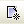

{width="8.625in" height="11.125in"}

+-----------------------------------------------------------------------+
| EXIMBILLS © Trade Finance System                                      |
|                                                                       |
| Customer Enterprise System Version 3.3.6                              |
|                                                                       |
| Data Objects                                                          |
|                                                                       |
| July 2021                                                             |
+-----------------------------------------------------------------------+
| *Copyright 2021 © China Systems Corporation*                          |
|                                                                       |
| *All Rights Reserved*                                                 |
|                                                                       |
| *This document is protected by United States Copyright Law and may    |
| contain Trade Secrets Information which is proprietary to China       |
| Systems Corporation. No part of this document may be copied,          |
| photocopied, reproduced, translated, distributed, or reduced to any   |
| electronic medium or machine-readable form without prior consent in   |
| writing from China Systems Corporation. The information in this       |
| document may be used only under the terms and conditions of separate  |
| China Systems Corporation license agreements.*                        |
|                                                                       |
| *Information is subject to change without notice. China Systems       |
| Corporation makes no warranties, either expressed or implied, with    |
| respect to the software herein described as to its quality,           |
| performance, including, without limitations to, its fitness for any   |
| particular purpose.*                                                  |
|                                                                       |
| *This document may not reflect total system capability at any         |
| subsequent date as a result of development. It is also possible that  |
| it may contain references to facilities not available on your         |
| computer system. Such references should not be construed to mean that |
| these facilities will necessarily be made available on all types of   |
| computer hardware or in all user locations.*                          |
|                                                                       |
| *China Systems Corporation accepts no responsibility or liability for |
| any damages or loss of business or revenue due to the use of this     |
| document.*                                                            |
|                                                                       |
| *All trademarks, registered trademarks and trade names mentioned in   |
| this document are the sole property of their respective holders.*     |
+-----------------------------------------------------------------------+
| ORDER MORE EXIMBILLS DOCUMENTATION                                    |
|                                                                       |
| Additional copies of Documentation are available for purchase from    |
| China Systems Corporation or through your local EXIMBILLS Support     |
| Office.                                                               |
+-----------------------------------------------------------------------+
| {width="0.7583333333333333in"           |
| height="0.74375in"}                                                   |
|                                                                       |
| CHINA SYSTEMS CORPORATION                                             |
|                                                                       |
| Comments may be addressed to:                                         |
|                                                                       |
| <corporatedocs@chinasystems.com>                                      |
|                                                                       |
| China Systems Corporation Ltd.                                        |
|                                                                       |
| Corner House, 20 Parliament Street                                    |
|                                                                       |
| Hamilton HM12                                                         |
|                                                                       |
| Bermuda                                                               |
+-----------------------------------------------------------------------+

Table of Contents

CE Documentation Library 5

CE Documentation Library 6

Core System Manuals 6

CE Utility Reference Manuals 9

Installation Guides 9

Introduction 10

System Overview 11

Manual Overview 13

Using the CE Utility 14

Running the CE Utility 15

Preparing the CE Utility Files 15

Accessing the CE Utility 17

Navigating the CE Utility Interface 21

CE Utility Functions 22

Menu Bar 25

Toolbar Buttons 27

Popup Menu 33

Generating the XML Parameter Files 34

Building a Product 38

Defining Data Objects 40

Defining Data Objects 41

Using Data Objects in a Product Function 42

DO Product Function: Simple UI Style 42

DO Product Function: Tree UI Style 48

Building Data Objects 55

Designing the Data Object Screen 56

Configuration 56

Procedure 57

Adding the Data Object Fields 59

Configuration 59

Procedure 59

Configuring the Data Object Template 61

FDO Templates 62

Configuration 62

Procedure 69

XDO Templates 71

Configuration 71

Procedure 77

TDO Templates 79

Configuration 79

Procedure 88

Configuring the Data Object Entity 91

DO Entities with a Non-Template Root Node 92

Configuration 92

Procedure 102

DO Entities with a Template Root Node 104

Configuration 104

Procedure 110

Attaching the Data Object to Module Tables 112

Configuration 112

Procedure 113

Reformatting the Related Transaction Table 115

Configuration 115

Procedure 115

Attaching the Data Object to the Transaction Screen 119

Configuration 119

Procedure 130

Generating DO-related XML Files 135

Configuration 135

Procedure 135

Configuring JS for Data Objects 143

Data Object Screen JS 144

Function Event JS 149

Amending Data Object Records 155

Amending Data Object Records 156

Glossary 162

Glossary 163

 {#section .CS-ChapterTitle}

CE Documentation Library {#ce-documentation-library .CS-ChapterTitle}
========================

CE Documentation Library {#ce-documentation-library-1 .CS-head1}
========================

The CE Documentation Library lists all available manuals that serve as
references on the use of the Customer Enterprise system. The documents
are categorized into three groups: Core System Manuals, CE Utility
Reference Manuals, and Installation Guides.

Core System Manuals {#core-system-manuals .CS-head2}
===================

The CE core system manuals provide details on the setup and
configuration of various CE parameters, as well as the implementation of
supplementary functionalities supported by the system.

Archiving and Recovery

This manual is a reference to the Archive and Recovery functionality of
the CE system. Discussions include the required parameter settings for
configuring the relevant functions, as well as examples of how this
functionality is used in transaction processes.

Building a Product

This manual is a reference to the process of building a product in CE.
It provides step-by-step procedures on how to create a basic CE module,
transaction function, and product setting; configure parameters; and
attach components to generate a working business product.

Data Objects

This manual serves as a reference for creating and utilizing data
objects in the CE system. The discussions provide details on how to
build data object templates and data object entities, and how to attach
these to the transaction function screen.

Frequently Asked Questions

This document addresses commonly-asked questions on the Customer
Enterprise system. Issues on the browser-side (transaction processing),
CE Utility, Security Module, and database, among others, are addressed
in the discussions.

Interfacing CE with CS Eximbills

This document discusses the process of interfacing CE with the CS
Eximbills (CSX) back office system. Employing the MQ, FTP, and TCP/IP
communication protocols, the interface process using the XML format is
detailed in this document.

Interfacing CE with Eximbills Enterprise

This document discusses the process of interfacing CE with the Eximbills
Enterprise (EE) back office system. Employing the MQ protocol, the
interface process for the transfer of data between CE and EE using the
XML format is detailed in this document.

Log Settings

This manual provides details on CE logs as well as general instructions
on log configuration in CE. This is especially written for the users who
are in charge of maintaining the CE system.

Look and Feel

This manual is a reference guide on designing the CE user interface
(i.e., the look and feel of the system). Divided into two parts, the
manual provides instructions on creating a) the basic L&F style of CE;
and b) the CE L&F style that incorporates widgets.

Multi-Entity

This manual is a reference on implementing the Multi-Entity
functionality of the CE system. Discussions cover the implementation and
application of CE multi-entity.

Multi-Language

This manual discusses the procedures required in setting up the
Multi-Language functionality of CE as it is run by Administrator- and
Operator-type users. Furthermore, the configuration of certain system
and browser elements as well as the setup of related system parameters
is explained in step-by-step procedures.

Reports

This manual is a comprehensive reference guide on the requirements and
processes involved in building business products and functions that
generate online reports and documents.

Security and System Maintenance Functions

This manual is a comprehensive guide on the security and system
maintenance of the CE system. As such, it includes detailed instructions
for company and company function management, and user and user function
management. Maintenance of key functionalities such as authorization
rules, reference numbers, and other services is covered as well. In
addition, this document discusses the security concepts in CE to assist
users assigned with access rights to the CE Security Module.

Standing Data Functions

This document discusses the functions for the CE standing data that are
maintained by operators (e.g., parties, clauses). It includes sections
for each function, starting with a brief description of the function,
followed by the function input when necessary, and the procedure steps.

Supplementary Functions

This manual is a reference for the CE Utility operator user in
configuring parameter, JSP, and transaction function settings to define
special or supplementary CE functionalities such as uploading images;
sending images and forms to the back-office system; and sending
notifications via e-mail, SMS, and widgets.

System Administration Functions

This manual is a reference for the default Super Administrator user of
the CE Utility in the configuration and maintenance of the CE
environment. It discusses in detail user management and parameter
management.

System Reference

This document serves as a quick reference to the following elements that
are used when configuring specific parameters in the CE Utility: global
system parameters, system parameters, components, XML Generator items,
server side system methods, system JS methods, and APIs.

CE Utility Reference Manuals {#ce-utility-reference-manuals .CS-head2}
============================

The CE Utility Reference set of manuals is a guide on the use of the
Customer Enterprise Utility Workbench, or simply CE Utility. This
reference provides details on every function or feature in the CE
Utility and includes instructions and step-by-step procedures on how to
operate or use the function in relation to operating and maintaining the
CE system and processing a business transaction.

> A manual is provided for each function group of the CE Utility:

-   *CE Utility Reference: User Manager Functions*, for the functions
    that belong to the User Manage function group of the CE Utility when
    accessed by an Administrator or Operator user

-   *CE Utility Reference: Parameter Manager Functions*, for the
    functions that belong to the Parameter Manage function group of the
    CE Utility when accessed by an Administrator or Operator user

-   *CE Utility Reference: System Functions*, for the functions that
    belong to the System Function group of the CE Utility.

-   *CE Utility Reference: Transaction Functions*, for the functions
    that belong to the Transaction Function group of the CE Utility.

-   *CE Utility Reference: Product Functions*, for the functions that
    belong to the Product Function group of the CE Utility.

-   *CE Utility Reference: Maintenance Functions*, for the functions
    that belong to the Maintenance function group of the CE Utility.

Installation Guides {#installation-guides .CS-head2}
===================

The CE installation guides are references on the installation and setup
processes of the CE system on different application servers and
databases.

Installation Guide WAS 9 - Oracle 19c

This is a reference for installing the CE system on WebSphere
Application Server Version 9.0.5.6, with an Oracle 19c database. This
includes detailed instructions on configuring the components that are
required to successfully run CE.

 {#section-1 .CS-ChapterTitle}

Introduction {#introduction .CS-ChapterTitle}
============

-   SYSTEM OVERVIEW

-   MaNUAL OVERVIEW

-   

System Overview {#system-overview .CS-head1}
===============

A data object (DO) is a smart element and a logical object that may be
incorporated into the transaction screen to perform operations involving
transactions with multiple records. Data objects are composed of
templates, which in turn, are composed of fields. As a different way of
handling business data and parameters, data objects are attached to the
screen for a more efficient process of retrieving and storing data.
Using data objects, a group of fields from one function may be used and
reused in another product function.

With the full and proficient utilization of data objects, CE can support
multi-layer and one-to-many transactions.

+-----------------------------------------------------------------------+
| Data Models for Data Objects                                          |
|                                                                       |
| [One-to-Many Data Model]{.underline}                                  |
|                                                                       |
| The one-to-many data model allows the system to associate one entity  |
| to several occurrences in another entity.                             |
|                                                                       |
| {width="1.3791666666666667in"                  |
| height="1.0805555555555555in"}                                        |
|                                                                       |
| [Multi-Layered Data Model]{.underline}                                |
|                                                                       |
| The multi-layered data model allows the data, contained in the DO     |
| templates, to be arranged into different or multiple layers.          |
|                                                                       |
| {width="3.8722222222222222in"                  |
| height="2.151388888888889in"}                                         |
+-----------------------------------------------------------------------+

Manual Overview {#manual-overview .CS-head1}
===============

**[Purpose]{.underline}**

This manual serves as a reference for creating and utilizing a data
object in the CE system. The chapters provide details on how to build
data object templates and data object entities, and how to attach these
to the transaction function screen.

> This document is written with the assumption that:

-   The CE environment has already been successfully installed; and

-   The reader has sufficient knowledge on building a CE product and
    > running the CE Utility functions.

**[Audience]{.underline}**

This manual is a reference specifically for, but not limited to, the
following users:

-   Consultants responsible for creating and configuring data objects
    and modifying data object screens. These users must have sufficient
    knowledge of running EE Utility functions and building EE modules

-   Bank or browser-side users tasked to process transactions involving
    screens with data objects

**[Prerequisites]{.underline}**

-   Recommended reading materials before reading this manual:

<!-- -->

-   *CE Building a Product*

-   *CE Utility References*

{width="0.3333333333333333in"
height="0.3333333333333333in"}NOTE: Some features discussed in this
manual have been tested and documented based on an older system version.
Unless otherwise specified, the overall functionality is the same when
recreated in the current version.

Using the CE Utility {#using-the-ce-utility .CS-ChapterTitle}
====================

-   Running the CE Utility

-   Generating the XML Parameter FILES

-   BUILDING A PRODUCT

-   

Running the CE Utility {#running-the-ce-utility .CS-head1}
======================

The Customer Enterprise Utility Workbench, or CE Utility, is the main
tool for building parameters in CE.

Preparing the CE Utility Files {#preparing-the-ce-utility-files .CS-head2}
==============================

> Along with the installation files, the CE Utility folder is provided
> with every CE system release. Prior to using the CE Utility, do the
> following:

i.  Copy the CE Utility folder to the local drive.

ii. Define the required environment variables.

iii. Map the CE directories (e.g., CEWeb.war and CE\_PARA) to the
    > network drive.

  -----------------------------------------------------------------------
  {width="4.85in" height="3.3097222222222222in"}
  -----------------------------------------------------------------------

***Figure 2.*** ***1 CE Utility Folder***

> {width="0.3333333333333333in"
> height="0.3333333333333333in"}**NOTE: **

i.  The default drives defined in the GEN\_XML\_ROOTPATH and
    GEN\_WEB\_ROOTPATH system parameters are O:\\ and P:\\ respectively.
    These drives, if currently not existing, may be created through a
    batch file. While O:\\ and P:\\are the default drives for CE, these
    may be set to any other preferred drive available in the network.

ii. To enable users to use the CE Utility on their own local machines as
    clients connecting to the CE server: 1) Install the Java Development
    Kit (JDK) program; 2) Copy the CE Utility folder; 3) Create the
    JAVA\_HOME environment variable, which must point to this directory:
    \[Java Home\]\\\[Installed JDK\].

iii. For more details on setting up the CE environment, refer to the CE
    installation guides*.*

iv. For details on the CE Utility functions, refer to the *CE Utility
    Reference* manuals.

+-----------------------------------------------------------------------+
| **Batch File for Creating the CE Drives**                             |
|                                                                       |
| The batch file for creating drives contains the following commands:   |
|                                                                       |
| > subst O: /d                                                         |
| >                                                                     |
| > subst P: /d                                                         |
| >                                                                     |
| > subst O: C:\"\\Program                                              |
| > Files\\IBM\\WebSphere\\AppServer\\profiles\\AppSrv01\\installedApps |
| \\DOCS-CEV336Node01Cell\\CE.ear\\CE\_PARA\"                           |
| >                                                                     |
| > subst P: C:\"\\Program                                              |
| > Files\\IBM\\WebSphere\\AppServer\\profiles\\AppSrv01\\installedApps |
| \\DOCS-CEV336Node01Cell\\CE.ear\\CEWeb.war\"                          |
|                                                                       |
| {width="4.8181813210848645in"                  |
| height="0.7698829833770778in"}                                        |
+-----------------------------------------------------------------------+

Accessing the CE Utility {#accessing-the-ce-utility .CS-head2}
========================

> The main program for running the CE Utility is the CEUtility.bat file,
> which is found in the CE Utility folder.

  ----------------------------
  **Do the following . . .**
  ----------------------------

+-----------------------+-----------------------+-----------------------+
| 1\. Run the           |                       | {width="3.5in"      |
| program to access     |                       | height="2.38819444444 |
| the CE Utility.       |                       | 44443in"}             |
|                       |                       |                       |
| **[NOTE]{.underline}* |                       |                       |
| *:                    |                       |                       |
|                       |                       |                       |
| A shortcut for the    |                       |                       |
| CEUtility batch file  |                       |                       |
| can be created on the |                       |                       |
| desktop for easy      |                       |                       |
| access.               |                       |                       |
+-----------------------+-----------------------+-----------------------+
|                       |                       |                       |
+-----------------------+-----------------------+-----------------------+
| 2\. The logon window  |                       | {width="3.5in"     |
| is displayed.         |                       | height="2.34513888888 |
|                       |                       | 8889in"}              |
| To define the         |                       |                       |
| database information, |                       |                       |
| click on the Profile  |                       |                       |
| button.               |                       |                       |
+-----------------------+-----------------------+-----------------------+
|                       |                       |                       |
+-----------------------+-----------------------+-----------------------+
| 3\. In the Database   |                       | {width="3.5in"     |
| box that is           |                       | height="2.48125in"}   |
| displayed, specify    |                       |                       |
| the required          |                       |                       |
| database details      |                       |                       |
| and click on the      |                       |                       |
| Save button.          |                       |                       |
+-----------------------+-----------------------+-----------------------+
|                       |                       |                       |
+-----------------------+-----------------------+-----------------------+
| 4\. A confirmation    |                       | {width="3.5in"     |
| displayed. Click on   |                       | height="2.47361111111 |
| the OK button.        |                       | 1111in"}              |
+-----------------------+-----------------------+-----------------------+
|                       |                       |                       |
+-----------------------+-----------------------+-----------------------+

+-----------------------+-----------------------+-----------------------+
| **[NOTE]{.underline}* |                       | {width="3.5in"     |
|                       |                       | height="0.79861111111 |
| This new data source  |                       | 11112in"}             |
| setting is saved in   |                       |                       |
| the UserInfo.xml file |                       |                       |
| in the CE Utility     |                       |                       |
| directory.            |                       |                       |
+-----------------------+-----------------------+-----------------------+
|                       |                       |                       |
+-----------------------+-----------------------+-----------------------+
| 5\. The relevant      |                       | {width="3.5in"     |
| password may then     |                       | height="2.34513888888 |
| be specified for      |                       | 8889in"}              |
| logging on the to     |                       |                       |
| CE Utility.           |                       |                       |
|                       |                       |                       |
| **[NOTE]{.underline}* |                       |                       |
| *:                    |                       |                       |
|                       |                       |                       |
| For details on        |                       |                       |
| defining CE Utility   |                       |                       |
| user profiles, refer  |                       |                       |
| to the *CE System     |                       |                       |
| Administration        |                       |                       |
| Functions* manual.    |                       |                       |
+-----------------------+-----------------------+-----------------------+
|                       |                       |                       |
+-----------------------+-----------------------+-----------------------+
| 6\. The CE Utility    |                       | {width="3.5in"     |
| displayed.            |                       | height="1.85694444444 |
|                       |                       | 44445in"}             |
+-----------------------+-----------------------+-----------------------+
|                       |                       |                       |
+-----------------------+-----------------------+-----------------------+

+-----------------------+-----------------------+-----------------------+
| 7\. A function is     |                       | {width="3.5in"     |
| or double-clicking    |                       | height="1.85694444444 |
| on the relevant       |                       | 44445in"}             |
| function group and    |                       |                       |
| clicking on the       |                       |                       |
| function name.        |                       |                       |
|                       |                       |                       |
| **[NOTE]{.underline}* |                       |                       |
| *:                    |                       |                       |
|                       |                       |                       |
| A user may only       |                       |                       |
| access and utilize    |                       |                       |
| the functions         |                       |                       |
| assigned to him. For  |                       |                       |
| more details, refer   |                       |                       |
| to the *CE Utility    |                       |                       |
| Reference: User       |                       |                       |
| Manager Functions*    |                       |                       |
| documentation*.*      |                       |                       |
+-----------------------+-----------------------+-----------------------+

> {width="0.3333333333333333in"
> height="0.3333333333333333in"}**NOTE:** It is sometimes necessary to
> assign a new user name and password when the new database is restored
> from a backup file. Restoring the backup file restores the original
> user profiles.
>
> The new user profiles for the CE Utility (as well as the CE Security
> Module) can be defined during the installation process. SQL scripts
> are run to create these profiles. Refer to the CE installation guides
> for more details.

Navigating the CE Utility Interface {#navigating-the-ce-utility-interface .CS-head2}
===================================

> After logging on, the CE Utility window is displayed and parameters
> may then be configured. The functions used for setting up parameters
> may be accessed by clicking on the function name on the Function menu
> or by using the shortcut buttons.
>
> The CE Utility interface also provides ways by which parameters can be
> created, edited, deleted or linked to other operations: menu bar,
> toolbar buttons, and popup menu.

  ------------------------------------------------------------------------
  {width="4.85in" height="2.5729166666666665in"}
  ------------------------------------------------------------------------

***Figure 2.*** ***2 The CE Utility Interface***

> {width="0.3333333333333333in"
> height="0.3333333333333333in"}**NOTE:** A function is only displayed,
> and its corresponding button or menu option enabled, if the user has
> been given the right to access this function. Some options and
> functions are only available to Super Administrator users, while
> others are only accessible to Administrator and Operator users.

####### CE Utility Functions

> The functions that may be accessed for setting up parameters are
> organized together into several function groups. The current available
> function groups and their corresponding functions in the CE Utility
> are as follows:

**User Manager Function Group**

> This function group is comprised of functions used for creating,
> configuring, and exporting Bank-Country group settings; creating new
> users; and configuring data sources. These functions are:

-   Business Unit Config

-   DataSource Manage

-   Import/Export Business Unit

-   User Manage

**Parameter Manage Function Group**

> This function group consists of functions used for maintaining
> system-wide parameters and components. These functions are:

-   AP Server

-   Component Manage

-   Language Configuration

-   System Parameter

-   System Parameters

**System Function Group**

> This function group consists of functions used for maintaining and
> facilitating system-wide tasks, operations, and settings. These
> functions are:

-   Image Type Maintain

-   Output Device

-   Queue Manager

-   STP Setting

-   Time Zone

**Transaction Function Group**

> This function group is comprised of functions used for defining the
> actual business parameters of transaction functions. These facilitate
> the maintenance and processes of the business transaction modules.
> These functions are:

-   Amount/Rate Format

-   Batch Manage

-   Clause

-   DO Get Data

-   Export Setting

-   Form

-   GAPIs Setting

-   Get Data

-   Image Control

-   Message Broker Setting

-   Module & Event

-   Report Template

-   STPs Mapping

-   Sub Tasks

-   SWIFT Config

-   System Maintain

-   Transaction Function

-   Transfer To

-   TSU Mapping

-   Upload Message Setting

-   Web Service Setting

-   Widget Maintain

**Product Function Group**

> This function group consists of functions that are used for creating
> and configuring the products to be accessed and used by the customers
> or end-users. These functions are:

-   Fields Select

-   Inbox

-   Product Authorize

-   Product Authorize Setting

-   Product Catalog

-   Product Function Setting

-   Product Item

**Maintenance Function Group**

> This function group is comprised of functions used for facilitating
> the maintenance of data from CE tables, including fields and error
> settings. These functions are:

-   DB Dictionary

-   Error Handling

-   Error Message Config (CE)

-   Field Conversion

-   Multi Language

-   Page Dictionary

-   XML Generator

####### 

####### Menu Bar

> The options on the menu bar are shortcuts to both the common and
> specific functions and tasks of the system.

  -------------------------------------------------------------------------
  {width="2.25in" height="0.22916666666666666in"}
  -------------------------------------------------------------------------

***Figure 2.*** ***3 Menu Bar***

  ---------- -- -----------------
  **Menu**      **Description**
  ---------- -- -----------------

+-----------------------+-----------------------+-----------------------+
| **File**              |                       | The available options |
|                       |                       | in the File menu are: |
|                       |                       |                       |
|                       |                       | -   New: This is used |
|                       |                       |     for creating a    |
|                       |                       |     new parameter or  |
|                       |                       |     rule.             |
|                       |                       |                       |
|                       |                       | -   Save: This is     |
|                       |                       |     used for saving   |
|                       |                       |     the created or    |
|                       |                       |     modified          |
|                       |                       |     settings.         |
|                       |                       |                       |
|                       |                       | -   Close Function:   |
|                       |                       |     This is used for  |
|                       |                       |     closing the       |
|                       |                       |     current function  |
|                       |                       |     window.           |
|                       |                       |                       |
|                       |                       | -   Connect To: This  |
|                       |                       |     is used for       |
|                       |                       |     connecting to     |
|                       |                       |     another Meta data |
|                       |                       |     source.           |
|                       |                       |                       |
|                       |                       | -   Log Off: This is  |
|                       |                       |     used for logging  |
|                       |                       |     off a user that   |
|                       |                       |     is logged on to   |
|                       |                       |     the system        |
|                       |                       |     without exiting   |
|                       |                       |     the system.       |
|                       |                       |                       |
|                       |                       | -   Exit: This is     |
|                       |                       |     used for closing  |
|                       |                       |     the system window |
|                       |                       |     and exiting the   |
|                       |                       |     system.           |
+-----------------------+-----------------------+-----------------------+
|                       |                       |                       |
+-----------------------+-----------------------+-----------------------+
| **Edit**              |                       | The available options |
|                       |                       | in the Edit menu are: |
|                       |                       |                       |
|                       |                       | -   Add: This is used |
|                       |                       |     for adding a      |
|                       |                       |     setting for the   |
|                       |                       |     selected function |
|                       |                       |     or parameter.     |
|                       |                       |                       |
|                       |                       | -   Delete: This is   |
|                       |                       |     used for deleting |
|                       |                       |     or removing an    |
|                       |                       |     existing setting. |
|                       |                       |                       |
|                       |                       | -   Edit: This is     |
|                       |                       |     used for editing  |
|                       |                       |     or modifying      |
|                       |                       |     existing          |
|                       |                       |     settings.         |
|                       |                       |                       |
|                       |                       | -   Copy: This is     |
|                       |                       |     used for copying  |
|                       |                       |     or duplicating a  |
|                       |                       |     selected setting. |
|                       |                       |                       |
|                       |                       | -   Find: This is     |
|                       |                       |     used for finding  |
|                       |                       |     a specific        |
|                       |                       |     setting.          |
+-----------------------+-----------------------+-----------------------+
|                       |                       |                       |
+-----------------------+-----------------------+-----------------------+
| **Function**          |                       | The available options |
|                       |                       | in the Function menu  |
|                       |                       | are:                  |
|                       |                       |                       |
|                       |                       | -   User Manage,      |
|                       |                       |     which displays    |
|                       |                       |     options for       |
|                       |                       |     running User      |
|                       |                       |     Manager functions |
|                       |                       |                       |
|                       |                       | -   Parameter Manage, |
|                       |                       |     which displays    |
|                       |                       |     options for       |
|                       |                       |     running Parameter |
|                       |                       |     Manager functions |
|                       |                       |                       |
|                       |                       | -   System Function,  |
|                       |                       |     which displays    |
|                       |                       |     options for       |
|                       |                       |     running System    |
|                       |                       |     functions         |
|                       |                       |                       |
|                       |                       | -   Transaction       |
|                       |                       |     Function, which   |
|                       |                       |     displays options  |
|                       |                       |     for running       |
|                       |                       |     Transaction       |
|                       |                       |     functions         |
|                       |                       |                       |
|                       |                       | -   Product Function, |
|                       |                       |     which displays    |
|                       |                       |     options for       |
|                       |                       |     running Product   |
|                       |                       |     functions         |
|                       |                       |                       |
|                       |                       | -   Maintenance,      |
|                       |                       |     which displays    |
|                       |                       |     options for       |
|                       |                       |     running           |
|                       |                       |     Maintenance       |
|                       |                       |     functions         |
+-----------------------+-----------------------+-----------------------+
|                       |                       |                       |
+-----------------------+-----------------------+-----------------------+
| **Tools**             |                       | The available options |
|                       |                       | in the Tools menu     |
|                       |                       | are:                  |
|                       |                       |                       |
|                       |                       | -   Toolbar: When     |
|                       |                       |     this option is    |
|                       |                       |     marked, the       |
|                       |                       |     toolbar is        |
|                       |                       |     displayed on the  |
|                       |                       |     CE Utility        |
|                       |                       |     Workbench window. |
|                       |                       |                       |
|                       |                       | -   Function Toolbar: |
|                       |                       |     When this option  |
|                       |                       |     is marked, the    |
|                       |                       |     function toolbar  |
|                       |                       |     is displayed on   |
|                       |                       |     the CE Utility    |
|                       |                       |     Workbench window. |
|                       |                       |                       |
|                       |                       | -   Set User Profile  |
|                       |                       |     DB Info: This     |
|                       |                       |     option is used by |
|                       |                       |     the Super         |
|                       |                       |     Administrator     |
|                       |                       |     user to change    |
|                       |                       |     the user          |
|                       |                       |     information that  |
|                       |                       |     is to be used by  |
|                       |                       |     the CE Utility    |
|                       |                       |     for connecting to |
|                       |                       |     a database.       |
|                       |                       |                       |
|                       |                       | -   Window Style:     |
|                       |                       |     Selecting this    |
|                       |                       |     option displays a |
|                       |                       |     list of CE        |
|                       |                       |     Utility interface |
|                       |                       |     styles: Microsoft |
|                       |                       |     Style, Unix       |
|                       |                       |     Style, Java       |
|                       |                       |     Style, Classic    |
|                       |                       |     Style, and Metal  |
|                       |                       |     Style. The        |
|                       |                       |     preferred style   |
|                       |                       |     may be marked     |
|                       |                       |     accordingly.      |
+-----------------------+-----------------------+-----------------------+
|                       |                       |                       |
+-----------------------+-----------------------+-----------------------+
| **Help**              |                       | The available options |
|                       |                       | in the Help menu are: |
|                       |                       |                       |
|                       |                       | -   Help Topics: This |
|                       |                       |     is *currently not |
|                       |                       |     used*.            |
|                       |                       |                       |
|                       |                       | -   Content Help:     |
|                       |                       |     This is           |
|                       |                       |     *currently not    |
|                       |                       |     used.*            |
|                       |                       |                       |
|                       |                       | -   About Customer    |
|                       |                       |     Enterprise:       |
|                       |                       |     Selecting this    |
|                       |                       |     option displays   |
|                       |                       |     the About         |
|                       |                       |     Customer          |
|                       |                       |     Enterprise        |
|                       |                       |     window, which     |
|                       |                       |     indicates the     |
|                       |                       |     version           |
|                       |                       |     information of    |
|                       |                       |     CE.               |
+-----------------------+-----------------------+-----------------------+

####### Toolbar Buttons

> There are two kinds of toolbars in the CE Utility: the basic toolbar
> and the function toolbar.
>
> **Basic Toolbar**
>
> The following standard buttons are available on the Basic Toolbar of
> the CE Utility window. These are used for performing the basic and
> common tasks of the system.

  ---------------------------------------------------------------
  {width="3.65625in" height="0.3125in"}
  ---------------------------------------------------------------

***Figure 2.*** ***4 Basic Toolbar Buttons***

  ------------ -- -----------------
  **Button**      **Description**
  ------------ -- -----------------

  -------------------------------------------------------------------------------------------- -- ------------------------------------------------------------------------------------
  {width="0.25in" height="0.25in"} **New**                                This button is used for creating a new parameter or rule.
                                                                                                  
  {width="0.25in" height="0.25in"} **Add**                                This button is used for adding a setting for the selected function or parameter.
                                                                                                  
  {width="0.25in" height="0.25in"} **Save**                               This button is used for storing created or modified settings.
                                                                                                  
  {width="0.25in" height="0.25in"} **Edit**                               This button is used for editing or modifying existing settings.
                                                                                                  
  {width="0.25in" height="0.25in"} **Copy**                               This button is used for copying or duplicating a selected setting.
                                                                                                  
  {width="0.25in" height="0.25in"} **Delete**                             This button is used for deleting or removing an existing setting.
                                                                                                  
  {width="0.25in" height="0.25in"} **Find**                               This button is used for finding an existing setting.
                                                                                                  
  {width="0.22916666666666666in" height="0.25in"} **Close Function**      This button is used for closing a function window.
                                                                                                  
  {width="0.25in" height="0.25in"} **Help Topic**                         This button is *currently not used.*
                                                                                                  
  {width="0.25in" height="0.25in"} **About Customer Enterprise**          This button is used for displaying the version information of Customer Enterprise.
  -------------------------------------------------------------------------------------------- -- ------------------------------------------------------------------------------------

> **Function Toolbar**
>
> The buttons on this toolbar are shortcuts to some of the functions
> that are in the Function Group lists of the CE Utility window. The
> buttons may also be accessed from the Function menu on the menu bar.

  ----------------------------------------------------------------------------------------------
  {width="4.864583333333333in" height="0.14583333333333334in"}
  ----------------------------------------------------------------------------------------------

***Figure 2.*** ***5 Function Toolbar Buttons***

  ------------ -- -----------------
  **Button**      **Description**
  ------------ -- -----------------

  ------------------------------------------------------------------------------------------------------------------------------- -- --------------------------------------------------------------------------------------------------------------------------------------------------------------------
  {width="0.22916666666666666in" height="0.22916666666666666in"} **Set System Parameter**                    This button is used for accessing the System Parameter function. The function may also be accessed from the Parameter Manage group in the Function menu.
                                                                                                                                     
  {width="0.22916666666666666in" height="0.22916666666666666in"} **Manage Component**                        This button is used for accessing the Component Manage function. The function may also be accessed from the Parameter Manage group in the Function menu.
                                                                                                                                     
  {width="0.22916666666666666in" height="0.22916666666666666in"} **Calculation**                             This button is *currently not used.*
                                                                                                                                     
  {width="0.22916666666666666in" height="0.22916666666666666in"} **Module/Event Configuration**              This button is used for accessing the Module & Event function. The function may also be accessed from the Transaction Function group in the Function menu.
                                                                                                                                     
  {width="0.22916666666666666in" height="0.22916666666666666in"} **Transaction Function Configuration**      This button is used for accessing the Transaction Function. The function may also be accessed from the Transaction Function group in the Function menu.
                                                                                                                                     
  {width="0.22916666666666666in" height="0.22916666666666666in"} **Form Set**                                This button is used for accessing the Form function. The function may also be accessed from the Transaction Function group in the Function menu.
                                                                                                                                     
  {width="0.22916666666666666in" height="0.22916666666666666in"} **Accounting Rule Setting**                 This button is *currently not used.*
                                                                                                                                     
  {width="0.22916666666666666in" height="0.22916666666666666in"} **Field Conversion**                        This button is used for accessing the Field Conversion function. The function may also be accessed from the Maintenance group in the Function menu.
                                                                                                                                     
  {width="0.22916666666666666in" height="0.22916666666666666in"}**Get Data**                                 This button is used for accessing the Get Data function. The function may also be accessed from the Transaction Function group in the Function menu.
                                                                                                                                     
  {width="0.22916666666666666in" height="0.22916666666666666in"} **Reference Number**                        This button is *currently not used.*
                                                                                                                                     
  {width="0.22916666666666666in" height="0.22916666666666666in"} **Output Device**                           This button is used for accessing the Output Device function. The function may also be accessed from the System Function group in the Function menu.
                                                                                                                                     
  {width="0.22916666666666666in" height="0.22916666666666666in"} **Function Group**                          This button is *currently not used.*
                                                                                                                                     
  {width="0.22916666666666666in" height="0.22916666666666666in"} **Clause**                                  This button is used for accessing the Clause function. The function may also be accessed from the Transaction Function group in the Function menu.
                                                                                                                                     
  {width="0.22916666666666666in" height="0.22916666666666666in"} **SWIFT**                                   This button is used for accessing the SWIFT Config function. The function may also be accessed from the Transaction Function group in the Function menu.
                                                                                                                                     
  {width="0.22916666666666666in" height="0.22916666666666666in"} **Queue Manager**                           This button is used for accessing the Queue Manager function. The function may also be accessed from the System Function group in the Function menu.
                                                                                                                                     
  {width="0.22916666666666666in" height="0.22916666666666666in"} **GAPIs Setting**                           This button is used for accessing the GAPIs Setting function. The function may also be accessed from the Transaction Function group in the Function menu.
                                                                                                                                     
  {width="0.22916666666666666in" height="0.22916666666666666in"} **Time Zone**                               This button is used for setting time zone. The function may also be accessed from the System Function group in the Function menu.
                                                                                                                                     
  {width="0.22916666666666666in" height="0.22916666666666666in"} **STP Setting**                             This button is used for accessing the STP Setting function. The function may also be accessed from the System Function group in the Function menu.
                                                                                                                                     
  {width="0.22916666666666666in" height="0.22916666666666666in"} **Message Broker Setting**                  This button is used for accessing the Message Broker Setting function. The function may also be accessed from the Transaction Function group in the Function menu.
                                                                                                                                     
  {width="0.22916666666666666in" height="0.22916666666666666in"} **Processing Center**                       This button is *currently not used.*
                                                                                                                                     
  {width="0.22916666666666666in" height="0.22916666666666666in"} **Amount Format Setting**                   This button is used for accessing the Amount/Rate Format function. The function may also be accessed from the Transaction Function group in the Function menu.
                                                                                                                                     
  {width="0.22916666666666666in" height="0.22916666666666666in"} **Error Message**                           This button is used for accessing the Error Message Config (CE) function. The function may also be accessed from the Maintenance group in the Function menu.
                                                                                                                                     
  {width="0.22916666666666666in" height="0.22916666666666666in"} **Say Total**                               This button is *currently not used.*
                                                                                                                                     
  {width="0.22916666666666666in" height="0.22916666666666666in"} **Holiday**                                 This button is *currently not used.*
                                                                                                                                     
  {width="0.22916666666666666in" height="0.22916666666666666in"} **Report**                                  This button is *currently not used.*
                                                                                                                                     
  {width="0.22916666666666666in" height="0.22916666666666666in"} **Transfer To**                             This button is used for accessing the Transfer To function. The function may also be accessed from the Transaction Function group in the Function menu.
                                                                                                                                     
  {width="0.22916666666666666in" height="0.22916666666666666in"} **Archiving**                               This button is *currently not used.*
                                                                                                                                     
  {width="0.22916666666666666in" height="0.22916666666666666in"} **DB Dictionary**                           This button is used for accessing the DB Dictionary function. The function may also be accessed from the Maintenance group in the Function menu.
                                                                                                                                     
  {width="0.22916666666666666in" height="0.22916666666666666in"} **Calculation Constant**                    This button is *currently not used.*
                                                                                                                                     
  {width="0.22916666666666666in" height="0.22916666666666666in"} **XML Generator**                           This button is used for accessing the XML Generator function. The function may also be accessed from the Maintenance group in the Function menu.
                                                                                                                                     
  {width="0.22916666666666666in" height="0.22916666666666666in"} **Business Unit**                           This button is used for accessing the Business Unit Config function. The function may also be accessed from the User Manage group in the Function menu.
                                                                                                                                     
  {width="0.22916666666666666in" height="0.22916666666666666in"} **User Manager**                            This button is used for accessing the User Manage function. The function may also be accessed from the User Manage group in the Function menu.
                                                                                                                                     
  {width="0.22916666666666666in" height="0.22916666666666666in"} **Import/Export Business Unit**             This button is used for accessing the Import/Export Business Unit function. The function may also be accessed from the User Manage group in the Function menu.
                                                                                                                                     
  {width="0.22916666666666666in" height="0.22916666666666666in"} **DataSource Manager**                      This function is used for accessing the Data Source Manage function. The function may also be accessed from the User Manage group in the Function menu.
  ------------------------------------------------------------------------------------------------------------------------------- -- --------------------------------------------------------------------------------------------------------------------------------------------------------------------

####### Popup Menu

> Inside a function or configuration window, options may be provided in
> the form of a popup menu. This menu is displayed by right-clicking on
> the relevant window section or on the relevant information.

  -------------------------------------------------------------------------------------
  {width="1.3644127296587927in" height="2.280964566929134in"}
  -------------------------------------------------------------------------------------

***Figure 2.*** ***6 Popup Menu***

> In a popup window, the following options may be made available:

-   New

-   Add

-   Save

-   Edit

-   Copy

-   Delete

-   Find

-   Sharable

-   Help

Generating the XML Parameter Files {#generating-the-xml-parameter-files .CS-head1}
==================================

The created parameters and business logic are stored in the database as
Meta data. For this Meta data to be accessible to the application server
(AP) and the web server, it has to be converted to XML -- the format
used for the communication between the client and the server.

The XML files are generated through the XML Generator function of the
Maintenance function group in the CE Utility. In most cases, the XML
Generator function must be run when a parameter is created or modified
using the functions discussed in this document.

  --------------------------------
  **Do the following . .** **.**
  --------------------------------

+-----------------------+-----------------------+-----------------------+
| 1\. Log on to the CE  |                       | {width="3.5in"     |
| Administrator or      |                       | height="2.34513888888 |
| Operator user with    |                       | 8889in"}              |
| rights to the XML     |                       |                       |
| Generator function.   |                       |                       |
+-----------------------+-----------------------+-----------------------+
|                       |                       |                       |
+-----------------------+-----------------------+-----------------------+
| 2\. The CE Utility    |                       | {width="3.5in"     |
| displayed.            |                       | height="1.85694444444 |
|                       |                       | 44445in"}             |
| Run the XML Generator |                       |                       |
| function from the     |                       |                       |
| Maintenance function  |                       |                       |
| group.                |                       |                       |
|                       |                       |                       |
| Alternatively, click  |                       |                       |
| on the XML Generator  |                       |                       |
| button in the         |                       |                       |
| function toolbar.     |                       |                       |
+-----------------------+-----------------------+-----------------------+
|                       |                       |                       |
+-----------------------+-----------------------+-----------------------+
| 3\. The XML           |                       | {width="3.5in"     |
| window is             |                       | height="1.85694444444 |
| displayed.            |                       | 44445in"}             |
|                       |                       |                       |
| When there are newly  |                       |                       |
| defined or modified   |                       |                       |
| parameters, the Meta  |                       |                       |
| Data to XML window is |                       |                       |
| also displayed. It    |                       |                       |
| lists these           |                       |                       |
| parameters for easy   |                       |                       |
| selection. In this    |                       |                       |
| case, the parameter   |                       |                       |
| can be selected from  |                       |                       |
| this window and the   |                       |                       |
| Apply button clicked. |                       |                       |
| Afterwards, proceed   |                       |                       |
| to Step 5.            |                       |                       |
|                       |                       |                       |
| Alternatively, the    |                       |                       |
| Meta data or          |                       |                       |
| parameter can be      |                       |                       |
| manually selected     |                       |                       |
| from the main XML     |                       |                       |
| Generator window. In  |                       |                       |
| this case, click on   |                       |                       |
| the Close button of   |                       |                       |
| the Meta Data to XML  |                       |                       |
| window and proceed to |                       |                       |
| Step 4.               |                       |                       |
+-----------------------+-----------------------+-----------------------+
|                       |                       |                       |
+-----------------------+-----------------------+-----------------------+
| 4\. Double-click on   |                       | {width="3.5in"     |
| parameter type from   |                       | height="1.85694444444 |
| the XML Generator     |                       | 44445in"}             |
| window.               |                       |                       |
+-----------------------+-----------------------+-----------------------+
|                       |                       |                       |
+-----------------------+-----------------------+-----------------------+
| 5\. Depending on the  |                       | {width="3.5in"     |
| type, an XML          |                       | height="1.85694444444 |
| configuration         |                       | 44445in"}             |
| window may be         |                       |                       |
| displayed. In other   |                       |                       |
| cases, the process    |                       |                       |
| directly proceeds     |                       |                       |
| to Step 6.            |                       |                       |
|                       |                       |                       |
| If the configuration  |                       |                       |
| window is displayed,  |                       |                       |
| indicate the exact or |                       |                       |
| any additional        |                       |                       |
| setting required to   |                       |                       |
| generate the relevant |                       |                       |
| XML files. When the   |                       |                       |
| specifications are    |                       |                       |
| defined click on the  |                       |                       |
| Save button           |                       |                       |
+-----------------------+-----------------------+-----------------------+
|                       |                       |                       |
+-----------------------+-----------------------+-----------------------+
| 6\. A message is      |                       | {width="3.5in"     |
| confirming if the     |                       | height="1.13472222222 |
| XML files are to be   |                       | 22222in"}             |
| generated on the      |                       |                       |
| system path.          |                       |                       |
+-----------------------+-----------------------+-----------------------+
|                       |                       |                       |
+-----------------------+-----------------------+-----------------------+
| **[NOTE]{.underline}* |                       | {width="3.5in"     |
|                       |                       | height="1.85694444444 |
| The path of the XML   |                       | 44445in"}             |
| files is defined      |                       |                       |
| through the           |                       |                       |
| GEN\_XML\_ROOTPATH    |                       |                       |
| Utility Workbench     |                       |                       |
| system parameter.     |                       |                       |
| This system parameter |                       |                       |
| is configured through |                       |                       |
| the System Parameter  |                       |                       |
| function from the     |                       |                       |
| Parameter Manage      |                       |                       |
| function group.       |                       |                       |
+-----------------------+-----------------------+-----------------------+
|                       |                       |                       |
+-----------------------+-----------------------+-----------------------+
| 7\. To save the XML   |                       | {width="3.5in"     |
| relevant system       |                       | height="2.47083333333 |
| path, click on the    |                       | 3333in"}              |
| Yes button.           |                       |                       |
|                       |                       |                       |
| To specify another    |                       |                       |
| path, click on the No |                       |                       |
| button. On the Save   |                       |                       |
| dialog box that is    |                       |                       |
| displayed, browse for |                       |                       |
| the path and click on |                       |                       |
| the Save button.      |                       |                       |
+-----------------------+-----------------------+-----------------------+
|                       |                       |                       |
+-----------------------+-----------------------+-----------------------+
| 8\. When the          |                       | {width="3.5in"     |
| are generated, the    |                       | height="1.85694444444 |
| system displays a     |                       | 44445in"}             |
| confirmation          |                       |                       |
| message.              |                       |                       |
|                       |                       |                       |
| **[NOTE]{.underline}* |                       |                       |
| *:                    |                       |                       |
|                       |                       |                       |
| To hide the           |                       |                       |
| information on the    |                       |                       |
| paths of the          |                       |                       |
| generated XML files,  |                       |                       |
| click on the Hide     |                       |                       |
| button.               |                       |                       |
+-----------------------+-----------------------+-----------------------+
|                       |                       |                       |
+-----------------------+-----------------------+-----------------------+
| **[NOTE]{.underline}* |                       | {width="3.5in"     |
|                       |                       | height="3.15208333333 |
| Check the indicated   |                       | 3333in"}              |
| path(s) to see the    |                       |                       |
| generated XML files.  |                       |                       |
+-----------------------+-----------------------+-----------------------+

Building a Product {#building-a-product .CS-head1}
==================

When building a product in the CE Utility, a few prerequisites are
required to be met to make sure that modules or products are built in
accordance with the bank's requirements. One step is the GAP analysis
which involves an evaluation of transaction requirements, based on the
process flow (e.g., fields, clauses, forms, and interfaces). These are
necessary for identifying the fields required for anticipating the
required output. When the analysis has been completed, the project team
can now begin the process of building a product for the bank's
customers.

The following are steps in building a product:

1.  **Access the CE Utility**. To access the CE Utility for building
    parameters, an Operator user must be created by an Administrator
    user. This is set up through the User Manager function in the User
    Manage function group.

2.  **Set up the module and events**. This involves naming the module
    and the projected events that manage the transaction flow within the
    module. This is set up in the Module and Event function in CE
    Utility.

3.  **Set up the transaction tables.** This involves creating the tables
    in the DB Dictionary function in CE Utility. There can be different
    types of tables but only three are mandatory for a CE module:
    master, ledger, and event.

{width="0.3333333333333333in"
height="0.3333333333333333in"}NOTE: It is possible to create tables
directly into the database by running SQL scripts in the database. In
this case, tables can be created before modules and events. It is
recommended, however, to use the DB Dictionary for creating tables.

4.  **Add fields to the transaction table**. Fields must be added to a
    transaction table and field properties defined for the processing
    and storage of data. These can be done through the DB Dictionary
    function in CE Utility.

5.  **Set up the transaction functions**. This involves creating the
    functions that correspond to actual business transaction processes.
    This is done through Transaction Function in the Transaction
    Function group.

6.  **Set up the transaction parameters**. This involves designing the
    transaction screen, defining attribute and catalog settings, and
    attaching these parameters to the transaction function. These can be
    done through Transaction Function in CE Utility.

7.  **Create the product.** The product is the actual functionality
    accessed and run by the end-user. This process of creating a product
    involves setting up the product group, product, and product
    function, and defining product catalog settings.

8.  **Define authorization rules**. Authorization rules are set to
    further define or set limits for authorizing transactions.

9.  **Calculation.** This involves configuring the transaction JS files
    and defining calculation functions using available system methods.
    There are three JS files that have to be configured: the Module Base
    JS file, Event JS file, and Function JS file.

10. **Define the settings for the transaction input.** Certain functions
    may be added to aid in the input of data into the transaction. The
    CE Utility provides options for setting up field conversion rules,
    lookup buttons, customer reference numbers, clauses, dropdown lists,
    and data objects for this purpose.

11. **Define the settings for the transaction output.** Some business
    transactions involve output generation (i.e., Forms). To make this
    option available, certain settings must be configured using the
    functions from the Transaction Function group in CE Utility.

12. **Define the security settings in the CE browser.** The products and
    functions created are assigned to an end-user through the
    browser-side Security and System Maintenance functions.

{width="0.3333333333333333in"
height="0.3333333333333333in"}NOTE: The browser-side security and system
maintenance functions of CE are often collectively called the Security
Module.

13. **Add the Inbox functionality.** Another way of accessing a product
    or a transaction for further processing is through the Customer
    Inbox. This can be set up through the Inbox function in CE Utility.

{width="0.3333333333333333in"
height="0.3333333333333333in"}NOTE: For more details on configuring
different parameters in CE, refer to the *CE Utility Reference*
manuals*.*

Defining Data Objects {#defining-data-objects .CS-ChapterTitle}
=====================

-   DEFINING data objects

-   using data objects in a product function

Defining Data Objects {#defining-data-objects-1 .CS-head1}
=====================

A data object, which may also be referred to as a data object entity, is
a logical object that has its own calculation rules. Being a reusable
component, it reduces the amount of work when building an effective
business module. A data object is composed of one or more templates,
which, in turn, are composed of fields and attached to a screen.

To attach the data object functionality to a product function, eight
stages are involved:

-   Designing the data object screen

-   Adding the data object fields

-   Configuring the data object template

-   Configuring the data object entity

-   Attaching the data object to module tables

-   Reformatting the related transaction table

-   Attaching the data object to the transaction screen

-   Generating DO-related XML Files

The look and feel of a data object depends on the DO template file used.
The two ways by which a data object can be displayed on the transaction
screen are:

-   Tree UI Style

-   Simple (IFrame) UI Style

{width="0.3333333333333333in"
height="0.3333333333333333in"}NOTE: The Tree UI Style is currently not
supported in the CE Baseline.

When a data object is added to module functions, a grid is displayed,
which contains the data object records. The user may manipulate (e.g.,
add, edit, delete) records from this grid using the available data
object buttons.

{width="0.33194444444444443in"
height="0.33194444444444443in"}NOTE:

i.  For data objects with more than three (3) layers, it is recommended
    that the Tree type of DO user interface be used.

ii. To configure the buttons to be displayed in the data object grid at
    runtime, refer to the [Data Object Buttons](#DataObjectButtons)
    discussion in this chapter for more details.

Using Data Objects in a Product Function {#using-data-objects-in-a-product-function .CS-head1}
========================================

A data object is used during transaction processing oftentimes to
support transactions with multiple records. Furthermore, a data object
has the capability to store and retrieve data from one transaction
screen to another.

The following steps demonstrate how a data object is applied or used in
a product function at runtime. The succeeding chapter discusses how CE
parameters and JSP settings are configured to enable the DO
functionality.

{width="0.33194444444444443in"
height="0.33194444444444443in"}NOTE: In browser processing, the DO
entity is simply referred to as a data object; and the DO template as
child data object.

DO Product Function: Simple UI Style {#do-product-function-simple-ui-style .CS-head2}
====================================

+-----------------------+-----------------------+-----------------------+
| Example               |                       |                       |
+=======================+=======================+=======================+
| 1\. Run the product   |                       | {width="1.91815616 |
| relevant product.     |                       | 79790027in"           |
|                       |                       | height="3.40625in"}   |
+-----------------------+-----------------------+-----------------------+
|                       |                       |                       |
+-----------------------+-----------------------+-----------------------+
| 2\. The product       |                       | {width="3.5in"     |
| displayed as one      |                       | height="2.28263888888 |
| tab. The data         |                       | 8889in"}              |
| object screen is      |                       |                       |
| shown in another      |                       |                       |
| tab.                  |                       |                       |
|                       |                       |                       |
| **[NOTE:]{.underline} |                       |                       |
| **                    |                       |                       |
|                       |                       |                       |
| Data objects may be   |                       |                       |
| attached to different |                       |                       |
| tabs depending on the |                       |                       |
| \<DIV\> setting to    |                       |                       |
| which the data object |                       |                       |
| is added in the       |                       |                       |
| function JSP file.    |                       |                       |
+-----------------------+-----------------------+-----------------------+
|                       |                       |                       |
+-----------------------+-----------------------+-----------------------+
| As defined in the     |                       | {width="3.5in"     |
| the Transaction       |                       | height="2.05555555555 |
| Function, the user    |                       | 55554in"}             |
| interface style for   |                       |                       |
| this data object      |                       |                       |
| screen is Simple or   |                       |                       |
| IFrame, with the      |                       |                       |
| SYS\_SIMPLE\_DO\_Temp |                       |                       |
| late.jsp              |                       |                       |
| template file         |                       |                       |
| attached to the       |                       |                       |
| transaction screen.   |                       |                       |
+-----------------------+-----------------------+-----------------------+
|                       |                       |                       |
+-----------------------+-----------------------+-----------------------+
| The data object is    |                       | {width="3.5in"     |
| transaction screen.   |                       | height="1.32638888888 |
|                       |                       | 88888in"}             |
+-----------------------+-----------------------+-----------------------+
|                       |                       |                       |
+-----------------------+-----------------------+-----------------------+
| 3\. Click on the      |                       | {width="3.5in"     |
| display the data      |                       | height="2.6in"}       |
| object.               |                       |                       |
|                       |                       |                       |
| **[NOTE]{.underline}* |                       |                       |
| *:                    |                       |                       |
|                       |                       |                       |
| In this example,      |                       |                       |
| Input Invoice is the  |                       |                       |
| main DO template, and |                       |                       |
| Invoice Details is    |                       |                       |
| the child template.   |                       |                       |
|                       |                       |                       |
| The columns included  |                       |                       |
| in the data object    |                       |                       |
| grid are the fields   |                       |                       |
| defined for the       |                       |                       |
| corresponding main    |                       |                       |
| and child DO          |                       |                       |
| templates.            |                       |                       |
|                       |                       |                       |
| Click on the Add      |                       |                       |
| button to add a       |                       |                       |
| record for the data   |                       |                       |
| object.               |                       |                       |
+-----------------------+-----------------------+-----------------------+
|                       |                       |                       |
+-----------------------+-----------------------+-----------------------+
| 4\. The DO screen is  |                       | {width="3.5in"     |
| the required          |                       | height="1.91597222222 |
| details and click     |                       | 22222in"}             |
| on the Save button.   |                       |                       |
+-----------------------+-----------------------+-----------------------+
|                       |                       |                       |
+-----------------------+-----------------------+-----------------------+
| 5\. The record added  |                       | {width="3.5in"     |
| is displayed in the   |                       | height="2.59027777777 |
| grid. Data Object     |                       | 77777in"}             |
| buttons are           |                       |                       |
| provided to           |                       |                       |
| maintain the          |                       |                       |
| records for the       |                       |                       |
| data object. Click    |                       |                       |
| on the Add button     |                       |                       |
| to add another DO     |                       |                       |
| record.               |                       |                       |
|                       |                       |                       |
| The number of records |                       |                       |
| allowed for a data    |                       |                       |
| object is defined in  |                       |                       |
| the Min and Max       |                       |                       |
| fields in the data    |                       |                       |
| object dialog box.    |                       |                       |
|                       |                       |                       |
| To add a record for   |                       |                       |
| the child DO, select  |                       |                       |
| a record and click on |                       |                       |
| the Add Child button  |                       |                       |
| from the grid at the  |                       |                       |
| lower section of the  |                       |                       |
| DO screen.            |                       |                       |
|                       |                       |                       |
| **[NOTE]{.underline}* |                       |                       |
| *:                    |                       |                       |
|                       |                       |                       |
| In the browser:       |                       |                       |
|                       |                       |                       |
| -   The main DO       |                       |                       |
|     > template is     |                       |                       |
|     > also called     |                       |                       |
|     > main data       |                       |                       |
|     > object or       |                       |                       |
|     > parent data     |                       |                       |
|     > object.         |                       |                       |
|                       |                       |                       |
| -   The child DO      |                       |                       |
|     > template is     |                       |                       |
|     > also called     |                       |                       |
|     > child data      |                       |                       |
|     > object or       |                       |                       |
|     > sub-DO.         |                       |                       |
+-----------------------+-----------------------+-----------------------+
|                       |                       |                       |
+-----------------------+-----------------------+-----------------------+
| 6\. The screen for    |                       | {width="3.5in"     |
| displayed.            |                       | height="1.91458333333 |
|                       |                       | 33333in"}             |
| Specify the required  |                       |                       |
| details and click on  |                       |                       |
| the Save button.      |                       |                       |
|                       |                       |                       |
| **[NOTE]{.underline}* |                       |                       |
| *:                    |                       |                       |
|                       |                       |                       |
| The child DO has its  |                       |                       |
| own screen, which     |                       |                       |
| shows the fields      |                       |                       |
| defined for this      |                       |                       |
| child DO (of the main |                       |                       |
| DO template).         |                       |                       |
+-----------------------+-----------------------+-----------------------+
|                       |                       |                       |
+-----------------------+-----------------------+-----------------------+
| Specific details of   |                       | {width="3.49791666 |
| shown in the grid.    |                       | 6666667in"            |
|                       |                       | height="2.5875in"}    |
| **[NOTE]{.underline}* |                       |                       |
| *:                    |                       |                       |
|                       |                       |                       |
| The fields shown as   |                       |                       |
| columns in the grid   |                       |                       |
| section of the        |                       |                       |
| browser pertain to    |                       |                       |
| the sub-DO template   |                       |                       |
| fields which Display  |                       |                       |
| in Grid setting is    |                       |                       |
| enabled.              |                       |                       |
+-----------------------+-----------------------+-----------------------+
|                       |                       |                       |
+-----------------------+-----------------------+-----------------------+
| 7\. Use the buttons   |                       | {width="3.06180555 |
| edit, delete and      |                       | 55555554in"           |
| view the sub-DO       |                       | height="0.27013888888 |
| records.              |                       | 88889in"}             |
+-----------------------+-----------------------+-----------------------+

DO Product Function: Tree UI Style {#do-product-function-tree-ui-style .CS-head2}
==================================

{width="0.3333333333333333in"
height="0.3333333333333333in"}NOTE: The Tree UI Style is currently not
supported in the CE Baseline.

  ---------
  Example
  ---------

+-----------------------+-----------------------+-----------------------+
| 1\. Run the product   |                       | {width="1.73958333 |
| relevant product.     |                       | 33333333in"           |
|                       |                       | height="2.64444444444 |
|                       |                       | 44444in"}             |
+-----------------------+-----------------------+-----------------------+
|                       |                       |                       |
+-----------------------+-----------------------+-----------------------+
| 2\. The product       |                       | {width="3.5in"     |
| displayed.            |                       | height="1.79236111111 |
|                       |                       | 1111in"}              |
| The left section of   |                       |                       |
| the page shows the DO |                       |                       |
| tree menu. The root   |                       |                       |
| node shows the        |                       |                       |
| product function      |                       |                       |
| name.                 |                       |                       |
|                       |                       |                       |
| The main transaction  |                       |                       |
| page attached to the  |                       |                       |
| function is shown as  |                       |                       |
| one tab on the right  |                       |                       |
| section of the        |                       |                       |
| screen.               |                       |                       |
+-----------------------+-----------------------+-----------------------+
|                       |                       |                       |
+-----------------------+-----------------------+-----------------------+
| As defined in the     |                       | {width="3.5in"     |
| the Transaction       |                       | height="2.07222222222 |
| Function, the user    |                       | 22224in"}             |
| interface style for   |                       |                       |
| this data object      |                       |                       |
| screen is Tree, with  |                       |                       |
| the                   |                       |                       |
| SYS\_Tree\_DO\_Templa |                       |                       |
| te.jsp                |                       |                       |
| template file         |                       |                       |
| attached to the       |                       |                       |
| transaction screen.   |                       |                       |
+-----------------------+-----------------------+-----------------------+
|                       |                       |                       |
+-----------------------+-----------------------+-----------------------+
| 3\. Click on the      |                       | {width="2.29375in" |
| tree menu to          |                       | height="1.10902777777 |
| display the data      |                       | 77777in"}             |
| object attached to    |                       |                       |
| the product           |                       |                       |
| function.             |                       |                       |
+-----------------------+-----------------------+-----------------------+
|                       |                       |                       |
+-----------------------+-----------------------+-----------------------+
| The item shown as a   |                       | {width="3.5in"     |
| object added to the   |                       | height="2.05625in"}   |
| relevant module       |                       |                       |
| table.                |                       |                       |
+-----------------------+-----------------------+-----------------------+
|                       |                       |                       |
+-----------------------+-----------------------+-----------------------+
| The data objects are  |                       | {width="3.48819444 |
| transaction screen of |                       | 44444444in"           |
| the product function. |                       | height="0.97152777777 |
|                       |                       | 77778in"}             |
+-----------------------+-----------------------+-----------------------+
|                       |                       |                       |
+-----------------------+-----------------------+-----------------------+
| 4\. To specify the    |                       | {width="3.5in"     |
| for a data object,    |                       | height="1.60972222222 |
| click on the DO       |                       | 22223in"}             |
| name from the tree    |                       |                       |
| menu.                 |                       |                       |
|                       |                       |                       |
| The data object       |                       |                       |
| screen is displayed   |                       |                       |
| as another tab in the |                       |                       |
| right section of the  |                       |                       |
| page. The tabs        |                       |                       |
| facilitate the easy   |                       |                       |
| navigation between    |                       |                       |
| the transaction and   |                       |                       |
| data object screens.  |                       |                       |
+-----------------------+-----------------------+-----------------------+
|                       |                       |                       |
+-----------------------+-----------------------+-----------------------+
| **[NOTE]{.underline}* |                       | {width="3.5in"     |
|                       |                       | height="2.07291666666 |
| i.  The corresponding |                       | 66665in"}             |
|     > template        |                       |                       |
|     > attached to a   |                       |                       |
|     > DO entity with  |                       |                       |
|     > a template node |                       |                       |
|     > is shown as a   |                       |                       |
|     > sub-node or a   |                       |                       |
|     > sub-DO.         |                       |                       |
|                       |                       |                       |
| ii. The child fields  |                       |                       |
|     > of the template |                       |                       |
|     > are the fields  |                       |                       |
|     > included in the |                       |                       |
|     > corresponding   |                       |                       |
|     > DO screen.      |                       |                       |
|     > These fields    |                       |                       |
|     > can be shown or |                       |                       |
|     > hidden in the   |                       |                       |
|     > screen.         |                       |                       |
|                       |                       |                       |
| iii. The screen       |                       |                       |
|     > displayed when  |                       |                       |
|     > the data object |                       |                       |
|     > is accessed in  |                       |                       |
|     > the browser is  |                       |                       |
|     > the screen      |                       |                       |
|     > attached to the |                       |                       |
|     > template of the |                       |                       |
|     > corresponding   |                       |                       |
|     > data object.    |                       |                       |
+-----------------------+-----------------------+-----------------------+
|                       |                       |                       |
+-----------------------+-----------------------+-----------------------+
| The lower section of  |                       | {width="3.5in"     |
| displays the grid     |                       | height="0.62013888888 |
| where the records     |                       | 88889in"}             |
| added to the data     |                       |                       |
| object are listed. To |                       |                       |
| maintain the records  |                       |                       |
| for the data object,  |                       |                       |
| data object buttons   |                       |                       |
| are provided.         |                       |                       |
|                       |                       |                       |
| **[NOTE]{.underline}* |                       |                       |
| *:                    |                       |                       |
|                       |                       |                       |
| i.  The Get Data      |                       |                       |
|     > button is       |                       |                       |
|     > *currently not  |                       |                       |
|     > used.*          |                       |                       |
|                       |                       |                       |
| ii. The template      |                       |                       |
|     > fields and      |                       |                       |
|     > child template  |                       |                       |
|     > fields          |                       |                       |
|     > displayed in    |                       |                       |
|     > the grid are    |                       |                       |
|     > the fields      |                       |                       |
|     > which Display   |                       |                       |
|     > in Grid flags   |                       |                       |
|     > are marked.     |                       |                       |
+-----------------------+-----------------------+-----------------------+
|                       |                       |                       |
+-----------------------+-----------------------+-----------------------+
| Once a record has     |                       | {width="3.5in"     |
| data object, the DO   |                       | height="1.59513888888 |
| node in the tree menu |                       | 88889in"}             |
| shows the number of   |                       |                       |
| records for the data  |                       |                       |
| object and provides   |                       |                       |
| an option to display  |                       |                       |
| the records saved.    |                       |                       |
|                       |                       |                       |
| **[NOTE]{.underline}* |                       |                       |
| *:                    |                       |                       |
|                       |                       |                       |
| i.  If more records   |                       |                       |
|     > are added for   |                       |                       |
|     > the data        |                       |                       |
|     > object, these   |                       |                       |
|     > records are     |                       |                       |
|     > listed in both  |                       |                       |
|     > the tree menu   |                       |                       |
|     > and the data    |                       |                       |
|     > object grid.    |                       |                       |
|                       |                       |                       |
| ii. When the maximum  |                       |                       |
|     > number of       |                       |                       |
|     > records has     |                       |                       |
|     > been added, the |                       |                       |
|     > Add button in   |                       |                       |
|     > the grid is     |                       |                       |
|     > disabled.       |                       |                       |
+-----------------------+-----------------------+-----------------------+
|                       |                       |                       |
+-----------------------+-----------------------+-----------------------+
| The maximum and       |                       | {width="3.49791666 |
| records that are to   |                       | 6666667in"            |
| be allowed for a data |                       | height="2.48819444444 |
| object are defined in |                       | 44444in"}             |
| the Data Object       |                       |                       |
| Dialog box.           |                       |                       |
|                       |                       |                       |
| **[NOTE]{.underline}* |                       |                       |
| *:                    |                       |                       |
|                       |                       |                       |
| The Min and Max       |                       |                       |
| fields are only       |                       |                       |
| available to a data   |                       |                       |
| object which child DO |                       |                       |
| is a TDO or XDO. If   |                       |                       |
| the template or the   |                       |                       |
| child DO is an FDO,   |                       |                       |
| the Min and Max       |                       |                       |
| fields are disabled.  |                       |                       |
+-----------------------+-----------------------+-----------------------+
|                       |                       |                       |
+-----------------------+-----------------------+-----------------------+
| 5\. A plus (+) sign   |                       | {width="2.74861111 |
| record node denotes   |                       | 1111111in"            |
| that it contains      |                       | height="2.00972222222 |
| child data objects.   |                       | 22224in"}             |
| Click on this sign    |                       |                       |
| to display the        |                       |                       |
| child data objects.   |                       |                       |
|                       |                       |                       |
| **[NOTE]{.underline}* |                       |                       |
| *:                    |                       |                       |
|                       |                       |                       |
| In the browser:       |                       |                       |
|                       |                       |                       |
| -   The main DO       |                       |                       |
|     > template is     |                       |                       |
|     > also called     |                       |                       |
|     > main data       |                       |                       |
|     > object or       |                       |                       |
|     > parent data     |                       |                       |
|     > object.         |                       |                       |
|                       |                       |                       |
| -   The child DO      |                       |                       |
|     > template is     |                       |                       |
|     > also called     |                       |                       |
|     > child data      |                       |                       |
|     > object or       |                       |                       |
|     > sub-DO.         |                       |                       |
+-----------------------+-----------------------+-----------------------+
|                       |                       |                       |
+-----------------------+-----------------------+-----------------------+
| 6\. To specify the    |                       | {width="3.5in"     |
| for a child data      |                       | height="1.59652777777 |
| object, click on      |                       | 77778in"}             |
| the DO name.          |                       |                       |
|                       |                       |                       |
| The data object       |                       |                       |
| template screen is    |                       |                       |
| displayed as another  |                       |                       |
| tab in the right      |                       |                       |
| section of the page.  |                       |                       |
+-----------------------+-----------------------+-----------------------+
|                       |                       |                       |
+-----------------------+-----------------------+-----------------------+
| 7\. Specify the       |                       | {width="3.5in"     |
| the fields in the     |                       | height="1.59652777777 |
| data object screen    |                       | 77778in"}             |
| (tab).                |                       |                       |
|                       |                       |                       |
| Click on the Save     |                       |                       |
| button to save the    |                       |                       |
| details.              |                       |                       |
+-----------------------+-----------------------+-----------------------+
|                       |                       |                       |
+-----------------------+-----------------------+-----------------------+
| Once a record has     |                       | {width="2.7486111 |
| data object template, |                       | 11111111in"           |
| the sub-DO node in    |                       | height="1.55in"}      |
| the tree menu shows   |                       |                       |
| the list and number   |                       |                       |
| of records for the    |                       |                       |
| child data object and |                       |                       |
| provides an option to |                       |                       |
| display the records   |                       |                       |
| saved.                |                       |                       |
|                       |                       |                       |
| **[NOTE]{.underline}* |                       |                       |
| *:                    |                       |                       |
|                       |                       |                       |
| To display the        |                       |                       |
| details of a record   |                       |                       |
| in the DO screen,     |                       |                       |
| select the record     |                       |                       |
| from the data object  |                       |                       |
| grid.                 |                       |                       |
+-----------------------+-----------------------+-----------------------+
|                       |                       |                       |
+-----------------------+-----------------------+-----------------------+
| 8\. To add another    |                       | {width="3.5in"    |
| the Add button in     |                       | height="1.59652777777 |
| the data object       |                       | 77778in"}             |
| grid.                 |                       |                       |
|                       |                       |                       |
| Specify the required  |                       |                       |
| field values and      |                       |                       |
| click on the Save     |                       |                       |
| button.               |                       |                       |
|                       |                       |                       |
| When a new DO record  |                       |                       |
| is added, the record  |                       |                       |
| count in the parent   |                       |                       |
| DO is updated.        |                       |                       |
|                       |                       |                       |
| Additionally, a node  |                       |                       |
| for the added record  |                       |                       |
| is added under this   |                       |                       |
| DO folder.            |                       |                       |
+-----------------------+-----------------------+-----------------------+
|                       |                       |                       |
+-----------------------+-----------------------+-----------------------+
| **[NOTE]{.underline}* |                       | {width="3.4979166 |
|                       |                       | 66666667in"           |
| The data object       |                       | height="0.20833333333 |
| buttons may be used   |                       | 333334in"}            |
| for the maintenance   |                       |                       |
| of data object        |                       |                       |
| records.              |                       |                       |
|                       |                       |                       |
| The GetData button is |                       |                       |
| *currently* *not      |                       |                       |
| used*.                |                       |                       |
+-----------------------+-----------------------+-----------------------+

 {#section-3 .CS-ChapterTitle}

Building Data Objects {#building-data-objects .CS-ChapterTitle}
=====================

-   DESIGNING THE DATA OBJECT SCREEN

-   ADDING THE DATA OBJECT FIELDS

-   CONFIGURING THE DATA OBJECT TEMPLATE

-   CONFIGURING THE DATA OBJECT ENTITY

-   ATTACHING THE DATA OBJECT TO MODULE TABLES

-   REFORMATTING THE RELATED TRANSACTION TABLE

-   ATTACHING THE DATA OBJECT TO THE TRANSACTION SCREEN

-   GENERATING DO-RELATED XML FILES

 {#section-4 .CS-head1}

Designing the Data Object Screen {#designing-the-data-object-screen .CS-head1}
================================

A data object screen contains the elements defined for a data object.
This data object screen is attached to the data object template, which
is the basis for creating the data object entity (or data object). The
data object screen is displayed once the corresponding button in the
data object grid is clicked on during transaction processing.

The corresponding JSP file for the data object screen defines the look
and feel as the data object is displayed in the transaction screen. The
data object JSP files are stored on the following path in the CEWeb.war
folder:

\[CEWeb.war\]\\\[Bank\]\\\[Country\]\\WEB\\SCRN\\DO

{width="0.33194444444444443in"
height="0.33194444444444443in"}NOTE:

> i\. A data object template, as discussed in the next chapter, consists of
> fields and/or groups of fields. While it is common for the DO screen and
> the DO template to contain the same fields, the DO screen typically has
> fewer fields than the DO template. In addition, extension fields can be
> added to a DO screen and not to a DO template.
>
> ii\. For DO configurations using the CE New Utility (i.e., the
> PARA\_FILE\_FORMAT system parameter is set to NU), the screen path is
> \\CEWeb.war\\Default\\SCRN\\DO. Refer to the CE New Utility set of
> manuals.

Configuration {#configuration .CS-head2}
=============

> When designing the data object screen, the following codes must be
> included in the data object JSP file:

-   EXIMTAGS and CETAGS codes

-   SubPage Oninit() script

Procedure {#procedure .CS-head2}
=========

  ------------------------
  Do the following . . .
  ------------------------

+-----------------------+-----------------------+-----------------------+
| 1\. Create a JSP      |                       | {width="3.5in"    |
| design of the         |                       | height="1.41458333333 |
| screen for the data   |                       | 33333in"}             |
| object.               |                       |                       |
|                       |                       |                       |
| **[NOTE:]{.underline} |                       |                       |
| **                    |                       |                       |
|                       |                       |                       |
| i.  In this sample    |                       |                       |
|     > procedure, the  |                       |                       |
|     > data object JSP |                       |                       |
|     > file is named   |                       |                       |
|     > XDO\_SCREEN\_DO |                       |                       |
| CS                    |                       |                       |
|                       |                       |                       |
| ii. Existing data     |                       |                       |
|     > object JSP      |                       |                       |
|     > files may be    |                       |                       |
|     > copied and      |                       |                       |
|     > edited          |                       |                       |
|     > according to    |                       |                       |
|     > the             |                       |                       |
|     > requirements.   |                       |                       |
|     > All data object |                       |                       |
|     > JSP files are   |                       |                       |
|     > stored in the   |                       |                       |
|     > following path: |                       |                       |
|                       |                       |                       |
| > \[CEWeb.war\]:\\\[B |                       |                       |
| ank\]\\\[Country\]\\W |                       |                       |
| EB\\SCRN\\DO          |                       |                       |
+-----------------------+-----------------------+-----------------------+
|                       |                       |                       |
+-----------------------+-----------------------+-----------------------+
| 2\. The data object   |                       | {width="3.5in"    |
| contain the           |                       | height="1.46180555555 |
| following codes:      |                       | 55556in"}             |
|                       |                       |                       |
| -   \<%@ taglib uri = |                       |                       |
|     > "/EXIMTAGS"     |                       |                       |
|     > prefix =        |                       |                       |
|     > "EXIMTAGS"%\>   |                       |                       |
|                       |                       |                       |
| -   \<%@ taglib uri = |                       |                       |
|     > "/CETAGS"       |                       |                       |
|     > prefix =        |                       |                       |
|     > "CETAGS"%\>     |                       |                       |
+-----------------------+-----------------------+-----------------------+
|                       |                       |                       |
+-----------------------+-----------------------+-----------------------+
| The data object jsp   |                       | {width="3.5in"    |
| following SubPage     |                       | height="1.55486111111 |
| Oninit () script,     |                       | 1111in"}              |
| which is added after  |                       |                       |
| the \</head\> tag of  |                       |                       |
| the data object JSP   |                       |                       |
| file.                 |                       |                       |
|                       |                       |                       |
| \<body                |                       |                       |
| onLoad="\_SubPageOnin |                       |                       |
| it()"\>               |                       |                       |
+-----------------------+-----------------------+-----------------------+
|                       |                       |                       |
+-----------------------+-----------------------+-----------------------+
| 3\. Once the screen   |                       | {width="3.5in"    |
| completed, copy the   |                       | height="1.84930555555 |
| data object JSP       |                       | 55555in"}             |
| file into the path:   |                       |                       |
| \[CEWeb.war\]:\\\[Ban |                       |                       |
| k\]\\\[Country\]\\WEB |                       |                       |
| \\SCRN\\DO            |                       |                       |
+-----------------------+-----------------------+-----------------------+

Adding the Data Object Fields {#adding-the-data-object-fields .CS-head1}
=============================

The required data object fields - based on the created data object
screen - must be added through the DB Dictionary function.

Configuration {#configuration-1 .CS-head2}
=============

Based on the created data object screen, the relevant data object fields
must be added in the DB Dictionary function. Once added, the Reformat
function must be run in order to commit the changes into the database.

Procedure {#procedure-1 .CS-head2}
=========

To add the relevant data object fields:

  ------------------------
  Do the following . . .
  ------------------------

+-----------------------+-----------------------+-----------------------+
| 1\. In the Reformat   |                       | {width="3.5in"    |
| Dictionary            |                       | height="1.61666666666 |
| function, add the     |                       | 66667in"}             |
| required data         |                       |                       |
| object transaction    |                       |                       |
| fields based on the   |                       |                       |
| created data object   |                       |                       |
| screen.               |                       |                       |
|                       |                       |                       |
| Click on the Reformat |                       |                       |
| button to run the     |                       |                       |
| Reformat function.    |                       |                       |
|                       |                       |                       |
| **[NOTE:]{.underline} |                       |                       |
| **                    |                       |                       |
|                       |                       |                       |
| When creating data    |                       |                       |
| objects using XDO     |                       |                       |
| template, the         |                       |                       |
| I\_SEQ\_NUM field is  |                       |                       |
| not manually added    |                       |                       |
| since this field is   |                       |                       |
| already included in   |                       |                       |
| the module by         |                       |                       |
| default.              |                       |                       |
+-----------------------+-----------------------+-----------------------+
|                       |                       |                       |
+-----------------------+-----------------------+-----------------------+
| 2\. Once the          |                       | {width="3.5in"    |
| completed, the        |                       | height="1.61805555555 |
| added fields are      |                       | 55556in"}             |
| displayed in the      |                       |                       |
| Data Dictionary       |                       |                       |
| tab.                  |                       |                       |
+-----------------------+-----------------------+-----------------------+

Configuring the Data Object Template {#configuring-the-data-object-template .CS-head1}
====================================

A data object template is the basis on which a data object is created.
It may be composed of fields and/or other data object templates. A DO
template can be shared by or used in several data objects.

The kinds of DO templates are based on the storage type of the data
object that is to use the template. These are:

-   FDO Templates

-   TDO Templates

-   XDO Templates

{width="0.3333333333333333in"
height="0.3333333333333333in"}NOTE: A data object template determines
the columns in the data object grid. These columns may either be
displayed or hidden in the data object grid.

{width="4.941345144356956in"
height="1.344932195975503in"}

FDO Templates {#fdo-templates .CS-head2}
=============

> In FDO (or Field Data Object) Templates, the content of the
> corresponding data object is stored in the fields of the related
> transaction table.
>
> An FDO may be used as a child template of a TDO template but it cannot
> have a TDO as its child template. In cases when it is used as a child
> of a TDO template, the content of the FDO is stored in the fields on
> the standalone table related to the parent TDO template.

####### Configuration

> The relevant settings must be defined in the Data Object Template
> window to create an FDO template.

Step 1: Storage Window

The following fields are provided in the Data Object Template -- Step 1
Window.

+-----------------------------------------------------------------------+
| +------------------------------------------------------------------+  |
| |   -------------------------------------------------------------- |  |
| | ----------                                                       |  |
| |   {width="4.85in" height="2.96736111111 |  |
| | 1111in"}                                                         |  |
| |   -------------------------------------------------------------- |  |
| | ----------                                                       |  |
| +------------------------------------------------------------------+  |
+-----------------------------------------------------------------------+

Figure 4. Data Object Template -- Step 1 Window

  ------- -- -------------------
  Field      Field Description
  ------- -- -------------------

+-----------------------+-----------------------+-----------------------+
| **Name**              |                       | Specify a name for    |
|                       |                       | the FDO template.     |
|                       |                       |                       |
|                       |                       | **[NOTE:]{.underline} |
|                       |                       | **                    |
|                       |                       |                       |
|                       |                       | The name of the       |
|                       |                       | template must be      |
|                       |                       | unique within the     |
|                       |                       | existing templates    |
|                       |                       | list. Otherwise, an   |
|                       |                       | error message is      |
|                       |                       | displayed and the     |
|                       |                       | template is not       |
|                       |                       | saved.                |
|                       |                       |                       |
|                       |                       | {width="3.0104166 |
|                       |                       | 666666665in"          |
|                       |                       | height="1.23958333333 |
|                       |                       | 33333in"}             |
+-----------------------+-----------------------+-----------------------+
|                       |                       |                       |
+-----------------------+-----------------------+-----------------------+
| **Desc**              |                       | Provide a description |
|                       |                       | of the FDO template.  |
|                       |                       |                       |
|                       |                       | The value of this     |
|                       |                       | field is for          |
|                       |                       | information only, and |
|                       |                       | is not reflected in   |
|                       |                       | the data object grid  |
|                       |                       | during transaction    |
|                       |                       | processing.           |
+-----------------------+-----------------------+-----------------------+
|                       |                       |                       |
+-----------------------+-----------------------+-----------------------+
| **Store Into**        |                       | This refers to the    |
|                       |                       | kind of storage in    |
|                       |                       | which the             |
|                       |                       | corresponding data    |
|                       |                       | object is saved.      |
|                       |                       |                       |
|                       |                       | Select the Database   |
|                       |                       | option.               |
|                       |                       |                       |
|                       |                       | **[NOTE]{.underline}* |
|                       |                       | *:                    |
|                       |                       |                       |
|                       |                       | The Components option |
|                       |                       | is *currently not     |
|                       |                       | used.*                |
+-----------------------+-----------------------+-----------------------+
|                       |                       |                       |
+-----------------------+-----------------------+-----------------------+
| **Storage Type**      |                       | This refers to the    |
|                       |                       | storage type of the   |
|                       |                       | content of the data   |
|                       |                       | object that is to use |
|                       |                       | the template. The     |
|                       |                       | available options are |
|                       |                       | Field Group, XML and  |
|                       |                       | Standalone Table.     |
|                       |                       |                       |
|                       |                       | For creating an FDO   |
|                       |                       | template, select the  |
|                       |                       | Field Group option to |
|                       |                       | store the DO content  |
|                       |                       | into the fields of    |
|                       |                       | the transaction       |
|                       |                       | table.                |
+-----------------------+-----------------------+-----------------------+

Step 2: Set Structure Window

The following fields are provided in the Data Object Template -- Step 2
Window.

+-----------------------------------------------------------------------+
|   ------------------------------------------------------------------- |
| -----                                                                 |
|   {width="4.85in" height="2.967361111111111i |
| n"}                                                                   |
|   ------------------------------------------------------------------- |
| -----                                                                 |
+-----------------------------------------------------------------------+

Figure 4. Data Object Template -- Step 2 Window

  ------- -- -------------------
  Field      Field Description
  ------- -- -------------------

+-----------------------+-----------------------+-----------------------+
| **Field**             |                       | This tab lists all    |
|                       |                       | the available         |
|                       |                       | transaction fields    |
|                       |                       | and system fields.    |
|                       |                       |                       |
|                       |                       | Select a field and    |
|                       |                       | click on the Add      |
|                       |                       | button to include it  |
|                       |                       | in the field and      |
|                       |                       | template list at the  |
|                       |                       | right.                |
|                       |                       |                       |
|                       |                       | The fields added are  |
|                       |                       | to be used in the DO  |
|                       |                       | template being        |
|                       |                       | created.              |
+-----------------------+-----------------------+-----------------------+
|                       |                       |                       |
+-----------------------+-----------------------+-----------------------+
| **Template**          |                       | If the template being |
|                       |                       | created is an FDO     |
|                       |                       | template, only        |
|                       |                       | existing FDO and XDO  |
|                       |                       | templates are         |
|                       |                       | included in the list. |
|                       |                       |                       |
|                       |                       | An FDO template can   |
|                       |                       | only have another FDO |
|                       |                       | or an XDO as a child  |
|                       |                       | template.             |
|                       |                       |                       |
|                       |                       | Select a template and |
|                       |                       | click on the Add      |
|                       |                       | button to add it to   |
|                       |                       | the field and         |
|                       |                       | template list at the  |
|                       |                       | right.                |
+-----------------------+-----------------------+-----------------------+
|                       |                       |                       |
+-----------------------+-----------------------+-----------------------+
| ***(Field and         |                       | The fields selected   |
| Template List)***     |                       | from the Field tab    |
|                       |                       | are listed in this    |
|                       |                       | section. The fields   |
|                       |                       | chosen now function   |
|                       |                       | as elements of the    |
|                       |                       | FDO template being    |
|                       |                       | created.              |
|                       |                       |                       |
|                       |                       | Each field may only   |
|                       |                       | be selected once and  |
|                       |                       | each field listed     |
|                       |                       | must be unique, as    |
|                       |                       | duplicate elements in |
|                       |                       | a DO template are not |
|                       |                       | allowed. When there   |
|                       |                       | are duplicate fields, |
|                       |                       | an error message is   |
|                       |                       | displayed and the     |
|                       |                       | system cannot proceed |
|                       |                       | to the next step of   |
|                       |                       | creating a DO         |
|                       |                       | template.             |
|                       |                       |                       |
|                       |                       | To remove an item     |
|                       |                       | from the list, select |
|                       |                       | it and click on the   |
|                       |                       | Del button.           |
|                       |                       |                       |
|                       |                       | The fields and        |
|                       |                       | templates are         |
|                       |                       | displayed in the      |
|                       |                       | browser accordingly.  |
|                       |                       | For the fields, the   |
|                       |                       | order presented in    |
|                       |                       | the browser depends   |
|                       |                       | on the order defined  |
|                       |                       | in the Field and      |
|                       |                       | Template List. To     |
|                       |                       | change the order of   |
|                       |                       | the fields, the Up    |
|                       |                       | and Down buttons may  |
|                       |                       | be used.              |
|                       |                       |                       |
|                       |                       | The templates, on the |
|                       |                       | other hand, are       |
|                       |                       | simply attached to    |
|                       |                       | the transaction       |
|                       |                       | function according to |
|                       |                       | the function's user   |
|                       |                       | interface style.      |
|                       |                       |                       |
|                       |                       | The PKey and FKey     |
|                       |                       | buttons are only      |
|                       |                       | applicable to TDO     |
|                       |                       | templates.            |
+-----------------------+-----------------------+-----------------------+
|                       |                       |                       |
+-----------------------+-----------------------+-----------------------+
| **Multi**             |                       | If the template being |
|                       |                       | created is an FDO     |
|                       |                       | template, the Multi   |
|                       |                       | option only applies   |
|                       |                       | to a child XDO.       |
|                       |                       |                       |
|                       |                       | This flag is only     |
|                       |                       | enabled when a child  |
|                       |                       | XDO is selected.      |
|                       |                       | Select the child XDO, |
|                       |                       | and mark this flag to |
|                       |                       | allow multiple        |
|                       |                       | records for the       |
|                       |                       | selected child XDO    |
|                       |                       | template.             |
|                       |                       |                       |
|                       |                       | **[NOTE]{.underline}* |
|                       |                       | *:                    |
|                       |                       |                       |
|                       |                       | Marking the Multi     |
|                       |                       | flag enables the Min  |
|                       |                       | and Max fields. See   |
|                       |                       | also Min and Max.     |
+-----------------------+-----------------------+-----------------------+
|                       |                       |                       |
+-----------------------+-----------------------+-----------------------+
| **Min**               |                       | This field is only    |
|                       |                       | enabled when the      |
|                       |                       | Multi flag is marked. |
|                       |                       |                       |
|                       |                       | Specify the minimum   |
|                       |                       | number of records for |
|                       |                       | the child template    |
|                       |                       | currently selected in |
|                       |                       | the field and         |
|                       |                       | template list.        |
+-----------------------+-----------------------+-----------------------+
|                       |                       |                       |
+-----------------------+-----------------------+-----------------------+
| **Max**               |                       | This field is only    |
|                       |                       | enabled when the      |
|                       |                       | Multi flag is marked. |
|                       |                       |                       |
|                       |                       | Specify the maximum   |
|                       |                       | number of records for |
|                       |                       | the child template    |
|                       |                       | currently selected in |
|                       |                       | the field and         |
|                       |                       | template list.        |
|                       |                       |                       |
|                       |                       | To indicate the       |
|                       |                       | maximum number of     |
|                       |                       | records possible,     |
|                       |                       | specify this value:   |
|                       |                       | n.                    |
+-----------------------+-----------------------+-----------------------+
|                       |                       |                       |
+-----------------------+-----------------------+-----------------------+
| **Default Value**     |                       | This field is enabled |
|                       |                       | only when a field is  |
|                       |                       | currently selected in |
|                       |                       | the field and         |
|                       |                       | template list.        |
|                       |                       | Specify the default   |
|                       |                       | value of the selected |
|                       |                       | field.                |
|                       |                       |                       |
|                       |                       | Specifying a default  |
|                       |                       | value does not        |
|                       |                       | automatically         |
|                       |                       | initialize a field    |
|                       |                       | value on the client   |
|                       |                       | side (browser).       |
|                       |                       | Instead, it           |
|                       |                       | initializes a field   |
|                       |                       | value on the server   |
|                       |                       | side. This default    |
|                       |                       | value is used in      |
|                       |                       | server-side           |
|                       |                       | calculations.         |
+-----------------------+-----------------------+-----------------------+
|                       |                       |                       |
+-----------------------+-----------------------+-----------------------+
| **Field Desc**        |                       | Specify a complete    |
|                       |                       | description for the   |
|                       |                       | field.                |
|                       |                       |                       |
|                       |                       | The value of this     |
|                       |                       | field is displayed as |
|                       |                       | the label of each     |
|                       |                       | column in the data    |
|                       |                       | object grid.          |
|                       |                       |                       |
|                       |                       | {w |
|                       |                       | idth="4.1662489063867 |
|                       |                       | 02in"                 |
|                       |                       | height="0.45202209098 |
|                       |                       | 862645in"}            |
+-----------------------+-----------------------+-----------------------+
|                       |                       |                       |
+-----------------------+-----------------------+-----------------------+
| **Display in Grid**   |                       | This flag is enabled  |
|                       |                       | only when a field is  |
|                       |                       | currently selected in |
|                       |                       | the field and         |
|                       |                       | template list. It     |
|                       |                       | indicates whether or  |
|                       |                       | not the selected      |
|                       |                       | field is to be        |
|                       |                       | displayed in a grid   |
|                       |                       | on the data object    |
|                       |                       | screen.               |
|                       |                       |                       |
|                       |                       | The I\_SEQ\_NUM field |
|                       |                       | is always included in |
|                       |                       | the grid whether or   |
|                       |                       | not it is included in |
|                       |                       | the DO template. If   |
|                       |                       | it is included in the |
|                       |                       | template, it is not   |
|                       |                       | required to select    |
|                       |                       | the Display in Grid   |
|                       |                       | flag.                 |
+-----------------------+-----------------------+-----------------------+
|                       |                       |                       |
+-----------------------+-----------------------+-----------------------+
| **Excel Coordinate    |                       | These are *currently  |
| Setting**             |                       | not used.*            |
|                       |                       |                       |
| **Convertor**         |                       |                       |
|                       |                       |                       |
| **Excel Sheet**       |                       |                       |
|                       |                       |                       |
| **Row**               |                       |                       |
|                       |                       |                       |
| **Col**               |                       |                       |
|                       |                       |                       |
| **Is Edit**           |                       |                       |
+-----------------------+-----------------------+-----------------------+

+-----------------------------------------------------------------------+
|   ------------------------------------------------------------------- |
| -----                                                                 |
|   {width="4.85in" height="2.967361111111111i |
| n"}                                                                   |
|   ------------------------------------------------------------------- |
| -----                                                                 |
+-----------------------------------------------------------------------+

Figure 4. Error Message on Selecting a Duplicate Field -- Example 1

+-----------------------------------------------------------------------+
|   ------------------------------------------------------------------- |
| -----                                                                 |
|   {width="4.85in" height="2.967361111111111i |
| n"}                                                                   |
|   ------------------------------------------------------------------- |
| -----                                                                 |
+-----------------------------------------------------------------------+

Figure 4. Error Message on Selecting a Template with a Duplicate Field
-- Example 2

Step 3: Set UI Window

The following field is provided in the Data Object Template -- Step 3
Window.

+-----------------------------------------------------------------------+
|   ------------------------------------------------------------------- |
| -----                                                                 |
|   {width="4.85in" height="2.967361111111111i |
| n"}                                                                   |
|   ------------------------------------------------------------------- |
| -----                                                                 |
+-----------------------------------------------------------------------+

Figure 4. Data Object Template -- Step 3 Window

  ------- -- -------------------
  Field      Field Description
  ------- -- -------------------

+-----------------------+-----------------------+-----------------------+
| **Screen**            |                       | Specify the data      |
|                       |                       | object screen to be   |
|                       |                       | assigned to the DO    |
|                       |                       | template or use the   |
|                       |                       | browse button to      |
|                       |                       | select the file.      |
|                       |                       |                       |
|                       |                       | To delete or change   |
|                       |                       | the set JSP file,     |
|                       |                       | click on the Clear    |
|                       |                       | button.               |
|                       |                       |                       |
|                       |                       | **[NOTE:]{.underline} |
|                       |                       | **                    |
|                       |                       |                       |
|                       |                       | Existing Data Object  |
|                       |                       | JSP files are stored  |
|                       |                       | in the following      |
|                       |                       | path:                 |
|                       |                       |                       |
|                       |                       | \[CEWeb.war\]:\\\[Ban |
|                       |                       | k\]\\\[Country\]\\WEB |
|                       |                       | \\SCRN\\DO            |
+-----------------------+-----------------------+-----------------------+

 {#section-5 .CS-head2}

####### Procedure

To create an FDO template:

  ------------------------
  Do the following . . .
  ------------------------

+-----------------------+-----------------------+-----------------------+
| 1\. Run the DB        |                       |                  |
| from the              |                       |                       |
| Maintenance           |                       |                       |
| function group.       |                       |                       |
+-----------------------+-----------------------+-----------------------+
|                       |                       |                       |
+-----------------------+-----------------------+-----------------------+
| 2\. In the Reformat   |                       |                  |
| Dictionary function   |                       |                       |
| window, open the      |                       |                       |
| Data Object node      |                       |                       |
| and select the        |                       |                       |
| Template option.      |                       |                       |
|                       |                       |                       |
| Click on the Add      |                       |                       |
| button on the         |                       |                       |
| toolbar.              |                       |                       |
+-----------------------+-----------------------+-----------------------+
|                       |                       |                       |
+-----------------------+-----------------------+-----------------------+
| 3\. The Data Object   |                       |                  |
| window is             |                       |                       |
| displayed.            |                       |                       |
|                       |                       |                       |
| Specify the required  |                       |                       |
| details and click on  |                       |                       |
| the forward button.   |                       |                       |
+-----------------------+-----------------------+-----------------------+
|                       |                       |                       |
+-----------------------+-----------------------+-----------------------+
| 4\. The Data Object   |                       |                  |
| window is             |                       |                       |
| displayed.            |                       |                       |
|                       |                       |                       |
| Specify the required  |                       |                       |
| details and click on  |                       |                       |
| the forward button.   |                       |                       |
+-----------------------+-----------------------+-----------------------+
|                       |                       |                       |
+-----------------------+-----------------------+-----------------------+
| 5\. The Data Object   |                       |                  |
| window is             |                       |                       |
| displayed.            |                       |                       |
|                       |                       |                       |
| Specify the DO screen |                       |                       |
| rule to be used in    |                       |                       |
| the template or use   |                       |                       |
| the browse button to  |                       |                       |
| locate the file.      |                       |                       |
|                       |                       |                       |
| Save the setting.     |                       |                       |
+-----------------------+-----------------------+-----------------------+
|                       |                       |                       |
+-----------------------+-----------------------+-----------------------+
| 6\. The created       |                       |                  |
| displayed in the      |                       |                       |
| grid of data          |                       |                       |
| objects in the        |                       |                       |
| Reformat tab.         |                       |                       |
+-----------------------+-----------------------+-----------------------+

XDO Templates {#xdo-templates .CS-head2}
=============

> In XDO (XML Data Object) templates, the content of the corresponding
> data object is stored in one field in XML format. This field is a CLOB
> (Character Long Object) type field, which also contains the
> corresponding DO content of all the child template of the XDO.

####### Configuration

> The relevant settings must be defined in the Data Object Template
> window to create an XDO template.

Step 1: Storage Window

The following fields are provided in the Data Object Template -- Step 1
window.

+-----------------------------------------------------------------------+
|   ------------------------------------------------------------------- |
| -----                                                                 |
|   {width="4.85in" height="2.967361111111111i |
| n"}                                                                   |
|   ------------------------------------------------------------------- |
| -----                                                                 |
+-----------------------------------------------------------------------+

Figure 4. Data Object Template -- Step 1 Window

  ------- -- -------------------
  Field      Field Description
  ------- -- -------------------

+-----------------------+-----------------------+-----------------------+
| **Name**              |                       | Specify a name for    |
|                       |                       | the XDO template.     |
|                       |                       |                       |
|                       |                       | **[NOTE:]{.underline} |
|                       |                       | **                    |
|                       |                       |                       |
|                       |                       | The name of the       |
|                       |                       | template must be      |
|                       |                       | unique within the     |
|                       |                       | existing templates    |
|                       |                       | list. Otherwise, an   |
|                       |                       | error message is      |
|                       |                       | displayed and the     |
|                       |                       | template is not       |
|                       |                       | saved.                |
|                       |                       |                       |
|                       |                       | {width="3.0104166 |
|                       |                       | 666666665in"          |
|                       |                       | height="1.23958333333 |
|                       |                       | 33333in"}             |
+-----------------------+-----------------------+-----------------------+
|                       |                       |                       |
+-----------------------+-----------------------+-----------------------+
| **Desc**              |                       | Provide a description |
|                       |                       | of the XDO template.  |
|                       |                       | This is the name to   |
|                       |                       | be displayed in the   |
|                       |                       | browser.              |
|                       |                       |                       |
|                       |                       | The value of this     |
|                       |                       | field is for          |
|                       |                       | information only, and |
|                       |                       | is not reflected in   |
|                       |                       | the data object grid  |
|                       |                       | during transaction    |
|                       |                       | processing.           |
+-----------------------+-----------------------+-----------------------+
|                       |                       |                       |
+-----------------------+-----------------------+-----------------------+
| **Store Into**        |                       | This refers to the    |
|                       |                       | kind of storage on    |
|                       |                       | which the             |
|                       |                       | corresponding data    |
|                       |                       | object is saved.      |
|                       |                       |                       |
|                       |                       | Select the Database   |
|                       |                       | option.               |
|                       |                       |                       |
|                       |                       | **[NOTE]{.underline}* |
|                       |                       | *:                    |
|                       |                       |                       |
|                       |                       | The Components option |
|                       |                       | is *currently not     |
|                       |                       | used.*                |
+-----------------------+-----------------------+-----------------------+
|                       |                       |                       |
+-----------------------+-----------------------+-----------------------+
| **Storage Type**      |                       | This refers to the    |
|                       |                       | storage type of the   |
|                       |                       | content of the data   |
|                       |                       | object that is to use |
|                       |                       | the template. The     |
|                       |                       | available options are |
|                       |                       | Field Group, XML and  |
|                       |                       | Standalone Table.     |
|                       |                       |                       |
|                       |                       | For creating an XDO   |
|                       |                       | template, select the  |
|                       |                       | XML option to store   |
|                       |                       | the DO content into   |
|                       |                       | the CLOB type field   |
|                       |                       | in XML format.        |
+-----------------------+-----------------------+-----------------------+
|                       |                       |                       |
+-----------------------+-----------------------+-----------------------+
| **Field Name**        |                       | This field is only    |
|                       |                       | made available when   |
|                       |                       | the template being    |
|                       |                       | created is an XDO, in |
|                       |                       | which the Store Into  |
|                       |                       | setting is Database   |
|                       |                       | and the Storage Type  |
|                       |                       | is XML.               |
|                       |                       |                       |
|                       |                       | Specify the name of   |
|                       |                       | the field in which    |
|                       |                       | the content of the    |
|                       |                       | corresponding data    |
|                       |                       | object is to be       |
|                       |                       | stored in XML format. |
|                       |                       | The system creates    |
|                       |                       | this new field with a |
|                       |                       | DB type of CLOB.      |
+-----------------------+-----------------------+-----------------------+
| +------------------+  |                       |                       |
| | > {widt |  |                       |                       |
| | h="4.85in"       |  |                       |                       |
| | > height="2.2402 |  |                       |                       |
| | 777777777776in"} |  |                       |                       |
| +------------------+  |                       |                       |
+-----------------------+-----------------------+-----------------------+

Figure 4. Example of an Automatically Created CLOB Field

Step 2: Set Structure Window

+-----------------------------------------------------------------------+
|   ------------------------------------------------------------------- |
| -----                                                                 |
|   {width="4.85in" height="2.967361111111111i |
| n"}                                                                   |
|   ------------------------------------------------------------------- |
| -----                                                                 |
+-----------------------------------------------------------------------+

Figure 4. Data Object Template -- Step 2 Window

  ------- -- -------------------
  Field      Field Description
  ------- -- -------------------

+-----------------------+-----------------------+-----------------------+
| **Field**             |                       | This tab lists all    |
|                       |                       | the available fields  |
|                       |                       | in the system.        |
|                       |                       |                       |
|                       |                       | Select a field and    |
|                       |                       | click on the Add      |
|                       |                       | button to include it  |
|                       |                       | in the field and      |
|                       |                       | template list at the  |
|                       |                       | right.                |
|                       |                       |                       |
|                       |                       | The fields added are  |
|                       |                       | to be used in the DO  |
|                       |                       | template being        |
|                       |                       | created.              |
+-----------------------+-----------------------+-----------------------+
|                       |                       |                       |
+-----------------------+-----------------------+-----------------------+
| **Template**          |                       | If the template being |
|                       |                       | created is an XDO     |
|                       |                       | template, existing    |
|                       |                       | FDO, XDO and TDO      |
|                       |                       | templates are         |
|                       |                       | included in the list. |
|                       |                       |                       |
|                       |                       | An XDO template can   |
|                       |                       | have another XDO, FDO |
|                       |                       | or TDO as a child     |
|                       |                       | template.             |
|                       |                       |                       |
|                       |                       | Select a template and |
|                       |                       | click on the Add      |
|                       |                       | button to add it to   |
|                       |                       | the field and         |
|                       |                       | template list at the  |
|                       |                       | right.                |
+-----------------------+-----------------------+-----------------------+
|                       |                       |                       |
+-----------------------+-----------------------+-----------------------+
| ***(Field and         |                       | The fields selected   |
| Template List)***     |                       | from the Field tab    |
|                       |                       | are listed in this    |
|                       |                       | section. The fields   |
|                       |                       | chosen now function   |
|                       |                       | as elements of the    |
|                       |                       | XDO template being    |
|                       |                       | created.              |
|                       |                       |                       |
|                       |                       | Each field may only   |
|                       |                       | be selected once and  |
|                       |                       | each field listed     |
|                       |                       | must be unique, as    |
|                       |                       | duplicate elements in |
|                       |                       | a DO template are not |
|                       |                       | allowed. When there   |
|                       |                       | are duplicate fields, |
|                       |                       | an error message is   |
|                       |                       | displayed and the     |
|                       |                       | system cannot proceed |
|                       |                       | to the next step of   |
|                       |                       | creating a DO         |
|                       |                       | template.             |
|                       |                       |                       |
|                       |                       | To remove an item     |
|                       |                       | from the list, select |
|                       |                       | it and click on the   |
|                       |                       | Del button.           |
|                       |                       |                       |
|                       |                       | The fields and        |
|                       |                       | templates are         |
|                       |                       | displayed in the      |
|                       |                       | browser accordingly.  |
|                       |                       | For the fields, the   |
|                       |                       | order presented in    |
|                       |                       | the browser depends   |
|                       |                       | on the order defined  |
|                       |                       | in the Field and      |
|                       |                       | Template List. To     |
|                       |                       | change the order of   |
|                       |                       | the fields, the Up    |
|                       |                       | and Down buttons may  |
|                       |                       | be used. The          |
|                       |                       | templates, on the     |
|                       |                       | other hand, are       |
|                       |                       | simply attached to    |
|                       |                       | the transaction       |
|                       |                       | function according to |
|                       |                       | the function's user   |
|                       |                       | interface style.      |
|                       |                       |                       |
|                       |                       | The PKey and FKey     |
|                       |                       | buttons are only      |
|                       |                       | applicable to TDO     |
|                       |                       | templates.            |
+-----------------------+-----------------------+-----------------------+
|                       |                       |                       |
+-----------------------+-----------------------+-----------------------+
| **Multi**             |                       | If the template being |
|                       |                       | created is an XDO     |
|                       |                       | template, the Multi   |
|                       |                       | option only applies   |
|                       |                       | to a child XDO or a   |
|                       |                       | child TDO.            |
|                       |                       |                       |
|                       |                       | This flag is only     |
|                       |                       | enabled when a child  |
|                       |                       | XDO or TDO is         |
|                       |                       | selected. Select the  |
|                       |                       | child XDO or TDO, and |
|                       |                       | mark this flag to     |
|                       |                       | allow multiple        |
|                       |                       | records for the       |
|                       |                       | selected child XDO or |
|                       |                       | TDO template.         |
|                       |                       |                       |
|                       |                       | **[NOTE]{.underline}* |
|                       |                       | *:                    |
|                       |                       |                       |
|                       |                       | Marking the Multi     |
|                       |                       | flag enables the Min  |
|                       |                       | and Max fields. See   |
|                       |                       | also Min and Max.     |
+-----------------------+-----------------------+-----------------------+
|                       |                       |                       |
+-----------------------+-----------------------+-----------------------+
| **Min**               |                       | This field is only    |
|                       |                       | enabled when the      |
|                       |                       | Multi flag is marked. |
|                       |                       |                       |
|                       |                       | Specify the minimum   |
|                       |                       | number of records for |
|                       |                       | the child template    |
|                       |                       | currently selected in |
|                       |                       | the field and         |
|                       |                       | template list.        |
+-----------------------+-----------------------+-----------------------+
|                       |                       |                       |
+-----------------------+-----------------------+-----------------------+
| **Max**               |                       | This field is only    |
|                       |                       | enabled when the      |
|                       |                       | Multi flag is marked. |
|                       |                       |                       |
|                       |                       | Specify the maximum   |
|                       |                       | number of records for |
|                       |                       | the child DO template |
|                       |                       | currently selected in |
|                       |                       | the field and         |
|                       |                       | template list.        |
|                       |                       |                       |
|                       |                       | To indicate the       |
|                       |                       | maximum number of     |
|                       |                       | records possible,     |
|                       |                       | specify this value:   |
|                       |                       | n.                    |
+-----------------------+-----------------------+-----------------------+
|                       |                       |                       |
+-----------------------+-----------------------+-----------------------+
| **Default Value**     |                       | This field is enabled |
|                       |                       | only when a field is  |
|                       |                       | currently selected in |
|                       |                       | the field and         |
|                       |                       | template list.        |
|                       |                       | Specify the default   |
|                       |                       | value of the selected |
|                       |                       | field.                |
|                       |                       |                       |
|                       |                       | Specifying a default  |
|                       |                       | value does not        |
|                       |                       | automatically         |
|                       |                       | initialize a field    |
|                       |                       | value on the client   |
|                       |                       | side (browser).       |
|                       |                       | Instead, it           |
|                       |                       | initializes a field   |
|                       |                       | value on the server   |
|                       |                       | side. This default    |
|                       |                       | value is used in      |
|                       |                       | server-side           |
|                       |                       | calculations.         |
+-----------------------+-----------------------+-----------------------+
|                       |                       |                       |
+-----------------------+-----------------------+-----------------------+
| **Field Desc**        |                       | Specify a complete    |
|                       |                       | description for the   |
|                       |                       | field.                |
|                       |                       |                       |
|                       |                       | The value of this     |
|                       |                       | field is displayed as |
|                       |                       | the label of each     |
|                       |                       | column in the data    |
|                       |                       | object grid.          |
|                       |                       |                       |
|                       |                       | {w |
|                       |                       | idth="4.1662489063867 |
|                       |                       | 02in"                 |
|                       |                       | height="0.45202209098 |
|                       |                       | 862645in"}            |
+-----------------------+-----------------------+-----------------------+
|                       |                       |                       |
+-----------------------+-----------------------+-----------------------+
| **Display in Grid**   |                       | This flag is enabled  |
|                       |                       | only when a field is  |
|                       |                       | currently selected in |
|                       |                       | the field and         |
|                       |                       | template list. It     |
|                       |                       | indicates whether or  |
|                       |                       | not the selected      |
|                       |                       | field is to be        |
|                       |                       | displayed in a grid   |
|                       |                       | on the data object    |
|                       |                       | screen.               |
|                       |                       |                       |
|                       |                       | The I\_SEQ\_NUM field |
|                       |                       | is always included in |
|                       |                       | the grid whether or   |
|                       |                       | not it is included in |
|                       |                       | the DO template. If   |
|                       |                       | it is included in the |
|                       |                       | template, it is not   |
|                       |                       | required to select    |
|                       |                       | the Display in Grid   |
|                       |                       | flag.                 |
+-----------------------+-----------------------+-----------------------+
|                       |                       |                       |
+-----------------------+-----------------------+-----------------------+
| **Excel Coordinate    |                       | These are *currently  |
| Setting**             |                       | not used.*            |
|                       |                       |                       |
| **Convertor**         |                       |                       |
|                       |                       |                       |
| **Excel Sheet**       |                       |                       |
|                       |                       |                       |
| **Row**               |                       |                       |
|                       |                       |                       |
| **Col**               |                       |                       |
|                       |                       |                       |
| **Is Edit**           |                       |                       |
+-----------------------+-----------------------+-----------------------+

Step 3: Set UI Window

+-----------------------------------------------------------------------+
|   ------------------------------------------------------------------- |
| -----                                                                 |
|   {width="4.85in" height="2.967361111111111i |
| n"}                                                                   |
|   ------------------------------------------------------------------- |
| -----                                                                 |
+-----------------------------------------------------------------------+

Figure 4. Data Object Template -- Step 3 Window

  ------- -- -------------------
  Field      Field Description
  ------- -- -------------------

+-----------------------+-----------------------+-----------------------+
| **Screen**            |                       | Specify the data      |
|                       |                       | object screen to be   |
|                       |                       | assigned to the DO    |
|                       |                       | template or use the   |
|                       |                       | browse button to      |
|                       |                       | select the file.      |
|                       |                       |                       |
|                       |                       | To delete or change   |
|                       |                       | the set JSP file,     |
|                       |                       | click on the Clear    |
|                       |                       | button.               |
|                       |                       |                       |
|                       |                       | **[NOTE:]{.underline} |
|                       |                       | **                    |
|                       |                       |                       |
|                       |                       | Existing Data Object  |
|                       |                       | JSP files are stored  |
|                       |                       | in the following      |
|                       |                       | path:                 |
|                       |                       |                       |
|                       |                       | \[CEWeb.war\]:\\\[Ban |
|                       |                       | k\]\\\[Country\]\\WEB |
|                       |                       | \\SCRN\\DO            |
+-----------------------+-----------------------+-----------------------+

 {#section-6 .CS-head2}

####### Procedure

To create an XDO template:

  ------------------------
  Do the following . . .
  ------------------------

+-----------------------+-----------------------+-----------------------+
| 1\. Run the DB        |                       |                  |
| from the              |                       |                       |
| Maintenance           |                       |                       |
| function group.       |                       |                       |
+-----------------------+-----------------------+-----------------------+
|                       |                       |                       |
+-----------------------+-----------------------+-----------------------+
| 2\. In the Reformat   |                       |                  |
| Object node and       |                       |                       |
| select the Template   |                       |                       |
| option.               |                       |                       |
|                       |                       |                       |
| Click on the Add      |                       |                       |
| button on the         |                       |                       |
| toolbar.              |                       |                       |
+-----------------------+-----------------------+-----------------------+
|                       |                       |                       |
+-----------------------+-----------------------+-----------------------+
| 3\. The Data Object   |                       |                  |
| window is             |                       |                       |
| displayed.            |                       |                       |
|                       |                       |                       |
| Specify the required  |                       |                       |
| details and click on  |                       |                       |
| the Forward button.   |                       |                       |
+-----------------------+-----------------------+-----------------------+
|                       |                       |                       |
+-----------------------+-----------------------+-----------------------+
| 4\. The Data Object   |                       |                  |
| window is             |                       |                       |
| displayed.            |                       |                       |
|                       |                       |                       |
| Specify the required  |                       |                       |
| details and click on  |                       |                       |
| the Forward button.   |                       |                       |
+-----------------------+-----------------------+-----------------------+
|                       |                       |                       |
+-----------------------+-----------------------+-----------------------+
| 5\. The Data Object   |                       |                  |
| window is             |                       |                       |
| displayed.            |                       |                       |
|                       |                       |                       |
| Specify the DO screen |                       |                       |
| rule to be used in    |                       |                       |
| the template or use   |                       |                       |
| the browse button to  |                       |                       |
| locate the file.      |                       |                       |
|                       |                       |                       |
| Save the setting.     |                       |                       |
+-----------------------+-----------------------+-----------------------+
|                       |                       |                       |
+-----------------------+-----------------------+-----------------------+
| 6\. The created       |                       |                  |
| displayed in the      |                       |                       |
| grid of data          |                       |                       |
| objects in the        |                       |                       |
| Reformat tab.         |                       |                       |
+-----------------------+-----------------------+-----------------------+

TDO Templates {#tdo-templates .CS-head2}
=============

> In TDO (Standalone Table Data Object) templates, the content of the
> corresponding data object is stored in a new and standalone table. The
> fields in the TDO are created in the table for storing the equivalent
> data.

####### Configuration

> The relevant settings must be defined in the Data Object Template
> window to create a TDO template.

Step 1: Set Storage Window

The following fields are provided in the Data Object Template -- Step 1
window:

+-----------------------------------------------------------------------+
| +------------------------------------------------------------------+  |
| |   -------------------------------------------------------------- |  |
| | ----------                                                       |  |
| |   {width="4.85in" height="2.96736111111 |  |
| | 1111in"}                                                         |  |
| |   -------------------------------------------------------------- |  |
| | ----------                                                       |  |
| +------------------------------------------------------------------+  |
+-----------------------------------------------------------------------+

Figure 4. Data Object Template -- Step 1 Window

  ------- -- -------------------
  Field      Field Description
  ------- -- -------------------

+-----------------------+-----------------------+-----------------------+
| **Name**              |                       | Specify a name for    |
|                       |                       | the TDO template.     |
|                       |                       |                       |
|                       |                       | **[NOTE:]{.underline} |
|                       |                       | **                    |
|                       |                       |                       |
|                       |                       | The name of the       |
|                       |                       | template must be      |
|                       |                       | unique within the     |
|                       |                       | existing templates    |
|                       |                       | list. Otherwise, an   |
|                       |                       | error message is      |
|                       |                       | displayed and the     |
|                       |                       | template is not       |
|                       |                       | saved.                |
|                       |                       |                       |
|                       |                       | {width="3.0104166 |
|                       |                       | 666666665in"          |
|                       |                       | height="1.23958333333 |
|                       |                       | 33333in"}             |
+-----------------------+-----------------------+-----------------------+
|                       |                       |                       |
+-----------------------+-----------------------+-----------------------+
| **Desc**              |                       | Provide a description |
|                       |                       | of the TDO template.  |
|                       |                       | This is the name to   |
|                       |                       | be displayed in the   |
|                       |                       | browser.              |
|                       |                       |                       |
|                       |                       | The value of this     |
|                       |                       | field is for          |
|                       |                       | information only, and |
|                       |                       | is not reflected in   |
|                       |                       | the data object grid  |
|                       |                       | during transaction    |
|                       |                       | processing.           |
+-----------------------+-----------------------+-----------------------+
|                       |                       |                       |
+-----------------------+-----------------------+-----------------------+
| **Store Into**        |                       | This refers to the    |
|                       |                       | kind of storage on    |
|                       |                       | which the             |
|                       |                       | corresponding data    |
|                       |                       | object is saved.      |
|                       |                       |                       |
|                       |                       | Select the Database   |
|                       |                       | option.               |
|                       |                       |                       |
|                       |                       | **[NOTE]{.underline}* |
|                       |                       | *:                    |
|                       |                       |                       |
|                       |                       | The Components option |
|                       |                       | is *currently not     |
|                       |                       | used.*                |
+-----------------------+-----------------------+-----------------------+
|                       |                       |                       |
+-----------------------+-----------------------+-----------------------+
| **Storage Type**      |                       | This refers to the    |
|                       |                       | storage type of the   |
|                       |                       | content of the data   |
|                       |                       | object that is to use |
|                       |                       | the template. The     |
|                       |                       | available options are |
|                       |                       | Field Group, XML and  |
|                       |                       | Standalone Table.     |
|                       |                       |                       |
|                       |                       | For creating a TDO    |
|                       |                       | template, select the  |
|                       |                       | Standalone Table      |
|                       |                       | option to store the   |
|                       |                       | DO content into the   |
|                       |                       | standalone table.     |
+-----------------------+-----------------------+-----------------------+
|                       |                       |                       |
+-----------------------+-----------------------+-----------------------+
| **Table Name**        |                       | This field is only    |
|                       |                       | made available when   |
|                       |                       | the template being    |
|                       |                       | created is a TDO, in  |
|                       |                       | which the Store Into  |
|                       |                       | setting is Database   |
|                       |                       | and the Storage Type  |
|                       |                       | is Standalone Table.  |
|                       |                       |                       |
|                       |                       | Specify the name of   |
|                       |                       | the table in which    |
|                       |                       | the content of the    |
|                       |                       | corresponding data    |
|                       |                       | object is to be       |
|                       |                       | stored. The system    |
|                       |                       | creates this new      |
|                       |                       | table in the          |
|                       |                       | transaction database. |
+-----------------------+-----------------------+-----------------------+

Step 2: Set Structure Window

The following fields are provided in the Data Object Template -- Step 2
window:

+-----------------------------------------------------------------------+
|   ------------------------------------------------------------------- |
| ------                                                                |
|   {width="4.85in" height="2.8472222222222223 |
| in"}                                                                  |
|   ------------------------------------------------------------------- |
| ------                                                                |
+-----------------------------------------------------------------------+

Figure 4. Data Object Template -- Step 2 Window

  ------- -- -------------------
  Field      Field Description
  ------- -- -------------------

+-----------------------+-----------------------+-----------------------+
| **Field**             |                       | This tab lists all    |
|                       |                       | the available fields. |
|                       |                       | Select a field and    |
|                       |                       | click on the Add      |
|                       |                       | button to include it  |
|                       |                       | in the field and      |
|                       |                       | template list at the  |
|                       |                       | right. The fields     |
|                       |                       | added are to be used  |
|                       |                       | in the DO template    |
|                       |                       | being created.        |
+-----------------------+-----------------------+-----------------------+
|                       |                       |                       |
+-----------------------+-----------------------+-----------------------+
| **Template**          |                       | If the template being |
|                       |                       | created is a TDO      |
|                       |                       | template, existing    |
|                       |                       | FDO, XDO and TDO      |
|                       |                       | templates are         |
|                       |                       | included in the list. |
|                       |                       | A TDO template can    |
|                       |                       | have another TDO,     |
|                       |                       | FDO, or XDO as a      |
|                       |                       | child template.       |
|                       |                       |                       |
|                       |                       | Select a template and |
|                       |                       | click on the Add      |
|                       |                       | button to add it to   |
|                       |                       | the field and         |
|                       |                       | template list at the  |
|                       |                       | right, for use in the |
|                       |                       | DO template being     |
|                       |                       | created.              |
+-----------------------+-----------------------+-----------------------+
|                       |                       |                       |
+-----------------------+-----------------------+-----------------------+
| ***(Field and         |                       | The fields selected   |
| Template List)***     |                       | from the Field tab    |
|                       |                       | are listed in this    |
|                       |                       | section. For a        |
|                       |                       | Standalone Table type |
|                       |                       | of DO, the            |
|                       |                       | I\_SEQ\_NUM system    |
|                       |                       | field is included by  |
|                       |                       | default. These fields |
|                       |                       | now function as       |
|                       |                       | elements of the TDO   |
|                       |                       | template being        |
|                       |                       | created.              |
|                       |                       |                       |
|                       |                       | The TDO template      |
|                       |                       | requires a primary    |
|                       |                       | key. To set the       |
|                       |                       | primary key, select   |
|                       |                       | the TDO template name |
|                       |                       | from the list and     |
|                       |                       | click on the PKey     |
|                       |                       | button. All the child |
|                       |                       | fields of the TDO     |
|                       |                       | template are listed   |
|                       |                       | in the Edit PKey      |
|                       |                       | dialog box. Select    |
|                       |                       | the field or fields   |
|                       |                       | from the list and     |
|                       |                       | click on the Select   |
|                       |                       | button to set the     |
|                       |                       | primary keys of the   |
|                       |                       | TDO template.         |
|                       |                       |                       |
|                       |                       | If a TDO is listed as |
|                       |                       | a child template, a   |
|                       |                       | foreign key must be   |
|                       |                       | set. This foreign key |
|                       |                       | or FKey identifies    |
|                       |                       | the relationship of   |
|                       |                       | the child DO with the |
|                       |                       | parent TDO template.  |
|                       |                       | To assign a foreign   |
|                       |                       | key, select the name  |
|                       |                       | of the child TDO      |
|                       |                       | template and click on |
|                       |                       | the FKey button. The  |
|                       |                       | system displays the   |
|                       |                       | Edit FKey dialog box. |
|                       |                       | The primary keys of   |
|                       |                       | the TDO template are  |
|                       |                       | listed in the Parent  |
|                       |                       | Table Key section of  |
|                       |                       | the dialog box.       |
|                       |                       | Select a field from   |
|                       |                       | the list in the       |
|                       |                       | Available Column      |
|                       |                       | section and click on  |
|                       |                       | the Select button to  |
|                       |                       | set the foreign keys  |
|                       |                       | of the TDO template.  |
|                       |                       | When the number of    |
|                       |                       | foreign keys does not |
|                       |                       | match the number of   |
|                       |                       | primary keys, the     |
|                       |                       | system displays an    |
|                       |                       | error message.        |
|                       |                       | Additionally, the     |
|                       |                       | FKey fields must      |
|                       |                       | correspond to and     |
|                       |                       | have the same         |
|                       |                       | sequence as the PKEY  |
|                       |                       | fields.               |
|                       |                       |                       |
|                       |                       | Each field may only   |
|                       |                       | be selected once and  |
|                       |                       | each field listed     |
|                       |                       | must be unique, as    |
|                       |                       | duplicate elements in |
|                       |                       | a DO template are not |
|                       |                       | allowed.              |
|                       |                       |                       |
|                       |                       | To remove an item     |
|                       |                       | from the list, select |
|                       |                       | it and click on the   |
|                       |                       | Del button.           |
|                       |                       |                       |
|                       |                       | The fields and        |
|                       |                       | templates are         |
|                       |                       | displayed in the      |
|                       |                       | browser accordingly.  |
|                       |                       | For the fields, the   |
|                       |                       | order presented in    |
|                       |                       | the browser depends   |
|                       |                       | on the order defined  |
|                       |                       | in the Field and      |
|                       |                       | Template List. To     |
|                       |                       | change the order of   |
|                       |                       | the fields, the Up    |
|                       |                       | and Down buttons may  |
|                       |                       | be used. The          |
|                       |                       | templates, on the     |
|                       |                       | other hand, are       |
|                       |                       | simply attached to    |
|                       |                       | the transaction       |
|                       |                       | function according to |
|                       |                       | the function's user   |
|                       |                       | interface style.      |
+-----------------------+-----------------------+-----------------------+
|                       |                       |                       |
+-----------------------+-----------------------+-----------------------+
| **Multi**             |                       | If the template being |
|                       |                       | created is a TDO      |
|                       |                       | template, the Multi   |
|                       |                       | option only applies   |
|                       |                       | to a child XDO or TDO |
|                       |                       | template.             |
|                       |                       |                       |
|                       |                       | This flag is only     |
|                       |                       | enabled when a child  |
|                       |                       | XDO or TDO is         |
|                       |                       | selected. Select the  |
|                       |                       | child XDO or TDO, and |
|                       |                       | mark this flag to     |
|                       |                       | allow multiple        |
|                       |                       | records for the       |
|                       |                       | selected child XDO or |
|                       |                       | TDO template.         |
|                       |                       |                       |
|                       |                       | **[NOTE]{.underline}* |
|                       |                       | *:                    |
|                       |                       |                       |
|                       |                       | Marking the Multi     |
|                       |                       | flag enables the Min  |
|                       |                       | and Max fields. See   |
|                       |                       | also Min and Max.     |
+-----------------------+-----------------------+-----------------------+

+-----------------------+-----------------------+-----------------------+
|                       |                       |                       |
+-----------------------+-----------------------+-----------------------+
| **Min**               |                       | This field is only    |
|                       |                       | enabled when the      |
|                       |                       | Multi flag is marked. |
|                       |                       |                       |
|                       |                       | Specify the minimum   |
|                       |                       | number of records for |
|                       |                       | the child DO template |
|                       |                       | currently selected in |
|                       |                       | the field and         |
|                       |                       | template list.        |
+-----------------------+-----------------------+-----------------------+
|                       |                       |                       |
+-----------------------+-----------------------+-----------------------+
| **Max**               |                       | This field is only    |
|                       |                       | enabled when the      |
|                       |                       | Multi flag is marked. |
|                       |                       |                       |
|                       |                       | Specify the maximum   |
|                       |                       | number of records for |
|                       |                       | the child DO template |
|                       |                       | currently selected in |
|                       |                       | the field and         |
|                       |                       | template list. To     |
|                       |                       | indicate the maximum  |
|                       |                       | number of records     |
|                       |                       | possible, specify     |
|                       |                       | this value: n.        |
+-----------------------+-----------------------+-----------------------+
|                       |                       |                       |
+-----------------------+-----------------------+-----------------------+
| **Default Value**     |                       | This field is enabled |
|                       |                       | only when a field is  |
|                       |                       | currently selected in |
|                       |                       | the field and         |
|                       |                       | template list. The    |
|                       |                       | default value of the  |
|                       |                       | selected field can be |
|                       |                       | specified here.       |
|                       |                       |                       |
|                       |                       | Specifying a default  |
|                       |                       | value does not        |
|                       |                       | automatically         |
|                       |                       | initialize a field    |
|                       |                       | value on the client   |
|                       |                       | side (browser).       |
|                       |                       | Instead, it           |
|                       |                       | initializes a field   |
|                       |                       | value on the server   |
|                       |                       | side. This default    |
|                       |                       | value is used in      |
|                       |                       | server-side           |
|                       |                       | calculations.         |
+-----------------------+-----------------------+-----------------------+
|                       |                       |                       |
+-----------------------+-----------------------+-----------------------+
| **Field Desc**        |                       | Specify a complete    |
|                       |                       | description for the   |
|                       |                       | field.                |
|                       |                       |                       |
|                       |                       | The value of this     |
|                       |                       | field is displayed as |
|                       |                       | the label of each     |
|                       |                       | column in the data    |
|                       |                       | object grid.          |
|                       |                       |                       |
|                       |                       | {w |
|                       |                       | idth="4.1662489063867 |
|                       |                       | 02in"                 |
|                       |                       | height="0.45202209098 |
|                       |                       | 862645in"}            |
+-----------------------+-----------------------+-----------------------+
|                       |                       |                       |
+-----------------------+-----------------------+-----------------------+
| **Display in Grid**   |                       | This flag is enabled  |
|                       |                       | only when a field is  |
|                       |                       | currently selected in |
|                       |                       | the field and         |
|                       |                       | template list. It     |
|                       |                       | indicates whether or  |
|                       |                       | not the selected      |
|                       |                       | field is to be        |
|                       |                       | displayed in a grid   |
|                       |                       | on the data object    |
|                       |                       | screen.               |
|                       |                       |                       |
|                       |                       | The I\_SEQ\_NUM field |
|                       |                       | is always included in |
|                       |                       | the grid whether or   |
|                       |                       | not it is included in |
|                       |                       | the DO template. If   |
|                       |                       | it is included in the |
|                       |                       | template, it is not   |
|                       |                       | required to select    |
|                       |                       | the Display in Grid   |
|                       |                       | flag.                 |
+-----------------------+-----------------------+-----------------------+
|                       |                       |                       |
+-----------------------+-----------------------+-----------------------+
| **Excel Coordinate    |                       | These are *currently  |
| Setting**             |                       | not used.*            |
|                       |                       |                       |
| **Convertor**         |                       |                       |
|                       |                       |                       |
| **Excel Sheet**       |                       |                       |
|                       |                       |                       |
| **Row**               |                       |                       |
|                       |                       |                       |
| **Col**               |                       |                       |
|                       |                       |                       |
| **Is Edit**           |                       |                       |
+-----------------------+-----------------------+-----------------------+

> {width="4.166146106736658in"
> height="3.957839020122485in"}

Figure 4. Edit PKey Dialog Box

+-----------------------------------------------------------------------+
|   ------------------------------------------------------------------- |
| -----                                                                 |
|   {width="4.85in" height="4.882638888888889i |
| n"}                                                                   |
|   ------------------------------------------------------------------- |
| -----                                                                 |
+-----------------------------------------------------------------------+

Figure 4. Edit FKey Dialog Box

+---------------------------------------------------------------+
|   ----------------------------------------------------------- |
|   {width="4.85in" height="4.85in"}   |
|   ----------------------------------------------------------- |
+---------------------------------------------------------------+

Figure 4. Error Message on Mismatched Number of Primary and Foreign Keys

Step 3: Set UI Window

The following field is provided in the Data Object Template -- Step 3
window:

+-----------------------------------------------------------------------+
|   ------------------------------------------------------------------- |
| ------                                                                |
|   {width="4.85in" height="2.8472222222222223 |
| in"}                                                                  |
|   ------------------------------------------------------------------- |
| ------                                                                |
+-----------------------------------------------------------------------+

Figure 4. Data Object Template -- Step 3 Window

  ------- -- -------------------
  Field      Field Description
  ------- -- -------------------

+-----------------------+-----------------------+-----------------------+
| **Screen**            |                       | Specify the data      |
|                       |                       | object screen to be   |
|                       |                       | assigned to the DO    |
|                       |                       | template or use the   |
|                       |                       | browse button to      |
|                       |                       | select the file.      |
|                       |                       |                       |
|                       |                       | To delete or change   |
|                       |                       | the set JSP file,     |
|                       |                       | click on the Clear    |
|                       |                       | button                |
+-----------------------+-----------------------+-----------------------+

####### Procedure

To create a TDO template:

  ------------------------
  Do the following . . .
  ------------------------

+-----------------------+-----------------------+-----------------------+
| 1\. Run DB            |                       |                  |
| from the              |                       |                       |
| Maintenance           |                       |                       |
| function group.       |                       |                       |
+-----------------------+-----------------------+-----------------------+
|                       |                       |                       |
+-----------------------+-----------------------+-----------------------+
| 2\. In the Reformat   |                       |                  |
| Dictionary function   |                       |                       |
| window, open the      |                       |                       |
| Data Object node      |                       |                       |
| and select the        |                       |                       |
| Template option.      |                       |                       |
|                       |                       |                       |
| Click on the Add      |                       |                       |
| button on the         |                       |                       |
| toolbar.              |                       |                       |
+-----------------------+-----------------------+-----------------------+
|                       |                       |                       |
+-----------------------+-----------------------+-----------------------+
| 3\. The Data Object   |                       |                  |
| window is             |                       |                       |
| displayed.            |                       |                       |
|                       |                       |                       |
| Specify the required  |                       |                       |
| details and click on  |                       |                       |
| the forward button.   |                       |                       |
+-----------------------+-----------------------+-----------------------+
|                       |                       |                       |
+-----------------------+-----------------------+-----------------------+
| 4\. The Data Object   |                       |                  |
| window is             |                       |                       |
| displayed.            |                       |                       |
|                       |                       |                       |
| Specify the required  |                       |                       |
| details. Click on the |                       |                       |
| Pkey button.          |                       |                       |
+-----------------------+-----------------------+-----------------------+
|                       |                       |                       |
+-----------------------+-----------------------+-----------------------+
| 5\. The Edit PKey     |                       |                  |
| displayed.            |                       |                       |
|                       |                       |                       |
| Specify the required  |                       |                       |
| details and click on  |                       |                       |
| the Save button.      |                       |                       |
+-----------------------+-----------------------+-----------------------+
|                       |                       |                       |
+-----------------------+-----------------------+-----------------------+
| 6\. If applicable,    |                       |                  |
| child DO template.    |                       |                       |
|                       |                       |                       |
| Click on the FKey     |                       |                       |
| button.               |                       |                       |
+-----------------------+-----------------------+-----------------------+
|                       |                       |                       |
+-----------------------+-----------------------+-----------------------+
| 7\. The Edit FKey     |                       |                  |
|                       |                       |                       |
| Specify the required  |                       |                       |
| details and click on  |                       |                       |
| the Save button.      |                       |                       |
+-----------------------+-----------------------+-----------------------+
|                       |                       |                       |
+-----------------------+-----------------------+-----------------------+
| 8\. Click on the      |                       |                  |
| done.                 |                       |                       |
+-----------------------+-----------------------+-----------------------+
|                       |                       |                       |
+-----------------------+-----------------------+-----------------------+
| 9\. The Data Object   |                       |                  |
| window is             |                       |                       |
| displayed.            |                       |                       |
|                       |                       |                       |
| Specify the DO screen |                       |                       |
| rule to be used in    |                       |                       |
| the template or use   |                       |                       |
| the browse button to  |                       |                       |
| locate the file.      |                       |                       |
|                       |                       |                       |
| Save the setting.     |                       |                       |
+-----------------------+-----------------------+-----------------------+
|                       |                       |                       |
+-----------------------+-----------------------+-----------------------+
| 10\. The created      |                       |                  |
| displayed in the      |                       |                       |
| grid of data          |                       |                       |
| objects in the        |                       |                       |
| Reformat tab.         |                       |                       |
+-----------------------+-----------------------+-----------------------+

Configuring the Data Object Entity {#configuring-the-data-object-entity .CS-head1}
==================================

A data object entity, or simply referred to as a data object, is created
based on and is composed of one or more data object templates. These
templates may be composed of a field, a group of fields or other
templates. The data object is then attached to a sub-page of the main
transaction function screen.

In CE, there are two kinds of data object entities:

-   Data object entity with a non-template root node: This data object
    may be based on one or several DO templates.

-   Data object entity with a template root node: This data object is
    based on only one main DO template.

{width="0.33194444444444443in"
height="0.33194444444444443in"}NOTE:

i.  Data objects with a non-template root node are often used in
    transaction functions that utilize the Tree user interface style.
    Data objects with a template root node are often used in transaction
    functions that utilize the Simple user interface style.

ii. In the browser-side transaction processing, a data object entity is
    simply referred to as a data object, while a DO entity's templates
    are referred to as child data objects.

####### 

DO Entities with a Non-Template Root Node {#do-entities-with-a-non-template-root-node .CS-head2}
=========================================

A data object entity with a non-template root node pertains to a data
object that is based on one or several DO templates.

####### Configuration

> The relevant settings must be defined in the Data Object Dialog window
> to create a data object entity with a non-template root node. This
> configuration window displays two tabs: Data Object and Table.
>
> **[Data Object Dialog Window: Data Object Tab]{.underline}**
>
> The following fields are provided in the Data Object tab.

+-----------------------------------------------------------------------+
| +------------------------------------------------------------------+  |
| |   -------------------------------------------------------------- |  |
| | -----------                                                      |  |
| |   {width="4.85in" height="3.18819444444 |  |
| | 44446in"}                                                        |  |
| |   -------------------------------------------------------------- |  |
| | -----------                                                      |  |
| +------------------------------------------------------------------+  |
+-----------------------------------------------------------------------+

Figure 4. Data Object Dialog Window -- Data Object Tab

  ------- -- -------------------
  Field      Field Description
  ------- -- -------------------

+-----------------------+-----------------------+-----------------------+
| ***(Data Object       |                       | When the data object  |
| Tree)***              |                       | entity being defined  |
|                       |                       | is a DO entity with a |
|                       |                       | non-template root     |
|                       |                       | node, this section    |
|                       |                       | displays the          |
|                       |                       | hierarchy of nodes on |
|                       |                       | which the new data    |
|                       |                       | object entity is to   |
|                       |                       | be based. A node can  |
|                       |                       | either be:            |
|                       |                       |                       |
|                       |                       | -   a template node,  |
|                       |                       |     which represents  |
|                       |                       |     a DO template; or |
|                       |                       |                       |
|                       |                       | -   a non-template    |
|                       |                       |     node, to which a  |
|                       |                       |     template node or  |
|                       |                       |     another           |
|                       |                       |     non-template node |
|                       |                       |     can be added as a |
|                       |                       |     child node.       |
|                       |                       |                       |
|                       |                       | To create the root    |
|                       |                       | node (when a new data |
|                       |                       | object entity with a  |
|                       |                       | non-template root     |
|                       |                       | node is currently     |
|                       |                       | being set up), click  |
|                       |                       | on the Add button.    |
|                       |                       | Define the settings   |
|                       |                       | for the node in the   |
|                       |                       | Data Object dialog    |
|                       |                       | box that is           |
|                       |                       | displayed.            |
|                       |                       |                       |
|                       |                       | To add a child node   |
|                       |                       | to the DO tree,       |
|                       |                       | select the parent     |
|                       |                       | root node and click   |
|                       |                       | on the Add button.    |
|                       |                       | Define the settings   |
|                       |                       | for the node in the   |
|                       |                       | Data Object dialog    |
|                       |                       | box that is           |
|                       |                       | displayed.            |
|                       |                       |                       |
|                       |                       | Only a non-template   |
|                       |                       | node can have a child |
|                       |                       | node. An error        |
|                       |                       | message is displayed  |
|                       |                       | when the currently    |
|                       |                       | selected node is a    |
|                       |                       | template node and the |
|                       |                       | Add button is         |
|                       |                       | clicked.              |
|                       |                       |                       |
|                       |                       | Except for the root   |
|                       |                       | node, a node can be   |
|                       |                       | deleted by selecting  |
|                       |                       | it and clicking on    |
|                       |                       | the Del button. To    |
|                       |                       | delete the root node, |
|                       |                       | the data object       |
|                       |                       | entity itself must be |
|                       |                       | deleted.              |
|                       |                       |                       |
|                       |                       | Refer also to these   |
|                       |                       | discussions in this   |
|                       |                       | chapter:              |
|                       |                       |                       |
|                       |                       | i.  [Data Object      |
|                       |                       |     Dialog Window:    |
|                       |                       |     Data Object Tab:  |
|                       |                       |     Data Object       |
|                       |                       |     Window](#DataObje |
|                       |                       | ctDialogWindowDataObj |
|                       |                       | ecttab)               |
|                       |                       |                       |
|                       |                       | ii. [Data Object      |
|                       |                       |     Dialog Window:    |
|                       |                       |     Data Object Tab:  |
|                       |                       |     Up, Down, Left,   |
|                       |                       |     and Right         |
|                       |                       |     Buttons](#DataObj |
|                       |                       | ectDialogWindowUpDown |
|                       |                       | But)                  |
+-----------------------+-----------------------+-----------------------+
|                       |                       |                       |
+-----------------------+-----------------------+-----------------------+
| **Name**              |                       | This field displays   |
|                       |                       | the name of the node  |
|                       |                       | currently selected in |
|                       |                       | the DO tree.          |
|                       |                       |                       |
|                       |                       | The value of this     |
|                       |                       | field cannot be       |
|                       |                       | modified.             |
+-----------------------+-----------------------+-----------------------+
|                       |                       |                       |
+-----------------------+-----------------------+-----------------------+
| **Description**       |                       | This field displays   |
|                       |                       | the description of    |
|                       |                       | the node currently    |
|                       |                       | selected in the DO    |
|                       |                       | tree. The value of    |
|                       |                       | this field can be     |
|                       |                       | modified.             |
|                       |                       |                       |
|                       |                       | The value of this     |
|                       |                       | field is for          |
|                       |                       | information only and  |
|                       |                       | is not shown in the   |
|                       |                       | browser during        |
|                       |                       | transaction           |
|                       |                       | processing.           |
+-----------------------+-----------------------+-----------------------+
|                       |                       |                       |
+-----------------------+-----------------------+-----------------------+
| **Template**          |                       | When the node         |
|                       |                       | currently selected in |
|                       |                       | the DO tree is a      |
|                       |                       | template node, this   |
|                       |                       | field displays the    |
|                       |                       | name of the DO        |
|                       |                       | template.             |
|                       |                       |                       |
|                       |                       | To view the settings  |
|                       |                       | of this DO template,  |
|                       |                       | click on the Detail   |
|                       |                       | button. The system    |
|                       |                       | displays the Data     |
|                       |                       | Object Template       |
|                       |                       | window.               |
+-----------------------+-----------------------+-----------------------+
|                       |                       |                       |
+-----------------------+-----------------------+-----------------------+
| **Save Pending        |                       | To store the DO       |
| Transaction**         |                       | record to the         |
|                       |                       | relevant table when   |
|                       |                       | the related pending   |
|                       |                       | transaction is        |
|                       |                       | confirmed at runtime, |
|                       |                       | mark this flag.       |
+-----------------------+-----------------------+-----------------------+
|                       |                       |                       |
+-----------------------+-----------------------+-----------------------+
| **Min**               |                       | When the node         |
|                       |                       | currently selected in |
|                       |                       | the DO tree is a      |
|                       |                       | template node, this   |
|                       |                       | field displays the    |
|                       |                       | minimum number of     |
|                       |                       | records -- with this  |
|                       |                       | template details --   |
|                       |                       | to be displayed in    |
|                       |                       | the resulting data    |
|                       |                       | object entity.        |
|                       |                       |                       |
|                       |                       | The value of this     |
|                       |                       | field can be          |
|                       |                       | modified.             |
|                       |                       |                       |
|                       |                       | **[NOTE:]{.underline} |
|                       |                       | **                    |
|                       |                       |                       |
|                       |                       | This field is         |
|                       |                       | applicable to the     |
|                       |                       | parent DO only. There |
|                       |                       | is no effect when     |
|                       |                       | applied to a child DO |
|                       |                       | template.             |
+-----------------------+-----------------------+-----------------------+
|                       |                       |                       |
+-----------------------+-----------------------+-----------------------+
| **Max**               |                       | When the node         |
|                       |                       | currently selected in |
|                       |                       | the DO tree is a      |
|                       |                       | template node, this   |
|                       |                       | field displays the    |
|                       |                       | maximum number of     |
|                       |                       | records -- with this  |
|                       |                       | template details --   |
|                       |                       | to be displayed in    |
|                       |                       | the resulting data    |
|                       |                       | object entity.        |
|                       |                       |                       |
|                       |                       | The value of this     |
|                       |                       | field can be          |
|                       |                       | modified. To indicate |
|                       |                       | the maximum number of |
|                       |                       | records possible,     |
|                       |                       | specify this value:   |
|                       |                       | n.                    |
|                       |                       |                       |
|                       |                       | **[NOTE:]{.underline} |
|                       |                       | **                    |
|                       |                       |                       |
|                       |                       | This field is         |
|                       |                       | applicable to the     |
|                       |                       | parent DO only. There |
|                       |                       | is no effect when     |
|                       |                       | applied to a child DO |
|                       |                       | template.             |
+-----------------------+-----------------------+-----------------------+

> []{#DataObjectDialogWindowDataObjecttab .anchor}**[Data Object Dialog
> Window: Data Object Tab: Data Object Window]{.underline}**
>
> Upon selecting a template node and clicking on the Add button on the
> Data Object Dialog window, the Data Object window is displayed. The
> following fields are provided in this window:

+-----------------------------------------------------------------------+
|   ------------------------------------------------------------------- |
| -------------------                                                   |
|   {width="4.686913823272091in" height="3.332 |
| 9166666666667in"}                                                     |
|   ------------------------------------------------------------------- |
| -------------------                                                   |
+-----------------------------------------------------------------------+

Figure 4. Data Object Dialog Window -- Data Object Tab: Data Object
Window

  ------- -- -------------------
  Field      Field Description
  ------- -- -------------------

+-----------------------+-----------------------+-----------------------+
| **Name**              |                       | Specify a unique name |
|                       |                       | for the data object   |
|                       |                       | node. This must not   |
|                       |                       | begin with, or        |
|                       |                       | consist entirely of,  |
|                       |                       | numbers.              |
+-----------------------+-----------------------+-----------------------+
|                       |                       |                       |
+-----------------------+-----------------------+-----------------------+
| **Description**       |                       | Provide a description |
|                       |                       | for the data object   |
|                       |                       | node.                 |
+-----------------------+-----------------------+-----------------------+
|                       |                       |                       |
+-----------------------+-----------------------+-----------------------+
| **Template**          |                       | This field indicates  |
|                       |                       | whether the DO node   |
|                       |                       | currently being       |
|                       |                       | defined or added is a |
|                       |                       | template node or a    |
|                       |                       | non-template node.    |
|                       |                       |                       |
|                       |                       | Select None from the  |
|                       |                       | dropdown list when:   |
|                       |                       |                       |
|                       |                       | -   the DO node being |
|                       |                       |     defined is the    |
|                       |                       |     root (first) node |
|                       |                       |     of a DO entity    |
|                       |                       |     with a non-root   |
|                       |                       |     node              |
|                       |                       |                       |
|                       |                       | -   the DO node being |
|                       |                       |     defined is to     |
|                       |                       |     function as a     |
|                       |                       |     parent node to    |
|                       |                       |     other nodes       |
|                       |                       |                       |
|                       |                       | Select a DO template  |
|                       |                       | from the dropdown     |
|                       |                       | list when:            |
|                       |                       |                       |
|                       |                       | -   the node being    |
|                       |                       |     defined is the    |
|                       |                       |     root node of a DO |
|                       |                       |     entity with a     |
|                       |                       |     template root     |
|                       |                       |     node (see *DO     |
|                       |                       |     Entities with a   |
|                       |                       |     Template Root     |
|                       |                       |     Node*); or        |
|                       |                       |                       |
|                       |                       | -   the node being    |
|                       |                       |     defined is a      |
|                       |                       |     child template    |
|                       |                       |     node (of a        |
|                       |                       |     non-template      |
|                       |                       |     node).            |
|                       |                       |                       |
|                       |                       | For creating a DO     |
|                       |                       | entity with a         |
|                       |                       | non-template root     |
|                       |                       | node, either None or  |
|                       |                       | a template can be     |
|                       |                       | selected from the     |
|                       |                       | dropdown list         |
|                       |                       | depending on the type |
|                       |                       | of node currently     |
|                       |                       | being defined --      |
|                       |                       | root, parent or       |
|                       |                       | child.                |
+-----------------------+-----------------------+-----------------------+
|                       |                       |                       |
+-----------------------+-----------------------+-----------------------+
| **Min**               |                       | When a template is    |
|                       |                       | selected from the     |
|                       |                       | Template dropdown     |
|                       |                       | list, specify the     |
|                       |                       | minimum number of     |
|                       |                       | records -- with this  |
|                       |                       | template details --   |
|                       |                       | to be displayed in    |
|                       |                       | the resulting data    |
|                       |                       | object entity.        |
|                       |                       |                       |
|                       |                       | **[NOTE:]{.underline} |
|                       |                       | **                    |
|                       |                       |                       |
|                       |                       | The Min field in the  |
|                       |                       | Data Object window is |
|                       |                       | applicable to the     |
|                       |                       | parent DO only. There |
|                       |                       | is no effect when     |
|                       |                       | applied to a child DO |
|                       |                       | template.             |
+-----------------------+-----------------------+-----------------------+
|                       |                       |                       |
+-----------------------+-----------------------+-----------------------+
| **Max**               |                       | When a template is    |
|                       |                       | selected from the     |
|                       |                       | Template dropdown     |
|                       |                       | list, specify the     |
|                       |                       | maximum number of     |
|                       |                       | records -- with this  |
|                       |                       | template details --   |
|                       |                       | to be displayed in    |
|                       |                       | the resulting data    |
|                       |                       | object entity. To     |
|                       |                       | indicate the maximum  |
|                       |                       | number of records     |
|                       |                       | possible, specify     |
|                       |                       | this value: n.        |
|                       |                       |                       |
|                       |                       | **[NOTE:]{.underline} |
|                       |                       | **                    |
|                       |                       |                       |
|                       |                       | The Max field in the  |
|                       |                       | Data Object window is |
|                       |                       | applicable to the     |
|                       |                       | parent DO only. There |
|                       |                       | is no effect when     |
|                       |                       | applied to a child DO |
|                       |                       | template.             |
+-----------------------+-----------------------+-----------------------+

[]{#DataObjectDialogWindowUpDownBut .anchor}**[Data Object Dialog
Window: Data Object Tab: Up, Down, Left, and Right
Buttons]{.underline}**

+-----------------------------------------------------------------------+
| **Using the Up, Down, Left and Right Buttons**                        |
|                                                                       |
| The Up, Down, Left and Right buttons in the Data Object Dialog window |
| are used to change the position of the selected node in the data      |
| object tree.                                                          |
|                                                                       |
|   ------------------------------------------------------------------- |
| ------                                                                |
|   {width="4.85in" height="3.1930555555555555 |
| in"}                                                                  |
|   ------------------------------------------------------------------- |
| ------                                                                |
|                                                                       |
| Generally, no node can be higher in the DO tree than the root node    |
| and the position of the root node cannot be changed. The other rules  |
| are as follows.                                                       |
|                                                                       |
| -   Clicking on the Up button moves the selected node one row up the  |
|     DO tree. The node, however, is still at the same level in the DO  |
|     tree (e.g., child or parent node).                                |
|                                                                       |
|   ------------------------------------------------------------------- |
| -----                                                                 |
|   {width="4.85in" height="3.182638888888889i |
| n"}                                                                   |
|   ------------------------------------------------------------------- |
| -----                                                                 |
|                                                                       |
| -   Clicking on the Down button moves the selected node one row down  |
|     the DO tree. The node, however, is still at the same level in the |
|     DO tree (e.g., child or parent node).                             |
|                                                                       |
|   ------------------------------------------------------------------- |
| ------                                                                |
|   {width="4.85in" height="3.1930555555555555 |
| in"}                                                                  |
|   ------------------------------------------------------------------- |
| ------                                                                |
|                                                                       |
| -   Clicking on the Left button moves the selected node to the same   |
|     position or level of its parent node in the DO tree.              |
|                                                                       |
| > {width="4.32536198600175in"                |
| > height="2.8569444444444443in"}                                      |
|                                                                       |
| -   Clicking on the Right button moves the selected node to the child |
|     position of the preceding parent node. As a template node cannot  |
|     have any child node, a node can only be moved as a child node     |
|     when the parent node (the preceding node) is a non-template node. |
|                                                                       |
| +------------------------------------------------------------------+  |
| | > {width="4.385416666666667in"          |  |
| | > height="2.8871916010498686in"}                                 |  |
| +------------------------------------------------------------------+  |
+-----------------------------------------------------------------------+

> **[Data Object Dialog Window: Table Tab]{.underline}**
>
> The Table tab of the Data Object Dialog window lists the new tables of
> all the TDO templates related to the DO entity currently being
> defined.

+-----------------------------------------------------------------------+
|   ------------------------------------------------------------------- |
| ------                                                                |
|   {width="4.85in" height="3.1041666666666665 |
| in"}                                                                  |
|   ------------------------------------------------------------------- |
| ------                                                                |
+-----------------------------------------------------------------------+

Figure 4. Data Object Dialog Window -- Table Tab

####### 

####### Procedure

> To create a data object entity with a non-template root node.

  ------------------------
  Do the following . . .
  ------------------------

+-----------------------+-----------------------+-----------------------+
| 1\. Run the DB        |                       | {width="3.5in"    |
| from the              |                       | height="1.43263888888 |
| Maintenance           |                       | 88888in"}             |
| function group.       |                       |                       |
+-----------------------+-----------------------+-----------------------+
|                       |                       |                       |
+-----------------------+-----------------------+-----------------------+
| 2\. In the Reformat   |                       | {width="3.5in"    |
| Dictionary window,    |                       | height="1.43263888888 |
| open the Data         |                       | 88888in"}             |
| Object node and       |                       |                       |
| select the Data       |                       |                       |
| Object Entity         |                       |                       |
| option.               |                       |                       |
|                       |                       |                       |
| Click on the Add      |                       |                       |
| button on the         |                       |                       |
| toolbar.              |                       |                       |
+-----------------------+-----------------------+-----------------------+
|                       |                       |                       |
+-----------------------+-----------------------+-----------------------+
| 3\. The Data Object   |                       | {width="3.5in"    |
| displayed.            |                       | height="2.28680555555 |
|                       |                       | 55555in"}             |
| Click on the Add      |                       |                       |
| button.               |                       |                       |
+-----------------------+-----------------------+-----------------------+
|                       |                       |                       |
+-----------------------+-----------------------+-----------------------+
| 4\. Define the        |                       | {width="3.5in"    |
| settings and click    |                       | height="2.28680555555 |
| on the Save button    |                       | 55555in"}             |
| in the Data Object    |                       |                       |
| window.               |                       |                       |
+-----------------------+-----------------------+-----------------------+
|                       |                       |                       |
+-----------------------+-----------------------+-----------------------+
| 5\. The created root  |                       | {width="3.5in"    |
| in the Data Object    |                       | height="2.28680555555 |
| Dialog window.        |                       | 55555in"}             |
+-----------------------+-----------------------+-----------------------+
|                       |                       |                       |
+-----------------------+-----------------------+-----------------------+
| 6\. Specify the       |                       | {width="3.5in"    |
| and click on the      |                       | height="2.28680555555 |
| Save button.          |                       | 55555in"}             |
+-----------------------+-----------------------+-----------------------+
|                       |                       |                       |
+-----------------------+-----------------------+-----------------------+
| 7\. The root node is  |                       | {width="3.5in"    |
| Object Entity list.   |                       | height="1.43263888888 |
|                       |                       | 88888in"}             |
+-----------------------+-----------------------+-----------------------+

DO Entities with a Template Root Node {#do-entities-with-a-template-root-node .CS-head2}
=====================================

A data object entity with a template root node pertains to a data object
that is based on only one main DO template. This main DO template may be
composed of one or more child templates.

####### Configuration

> The relevant settings must be defined in the Data Object Dialog window
> to create a data object entity with a template root node. This
> configuration window displays two tabs: Data Object and Table.
>
> **[Data Object Dialog Window: Data Object Tab]{.underline}**
>
> The following fields are provided in the Data Object tab.

+-----------------------------------------------------------------------+
|   ------------------------------------------------------------------- |
| ------                                                                |
|   {width="4.85in" height="3.2333333333333334 |
| in"}                                                                  |
|   ------------------------------------------------------------------- |
| ------                                                                |
+-----------------------------------------------------------------------+

Figure 4. Data Object Dialog Window -- Data Object Tab

  ------- -- -------------------
  Field      Field Description
  ------- -- -------------------

+-----------------------+-----------------------+-----------------------+
| ***(Data Object       |                       | This section displays |
| Tree)***              |                       | the hierarchy of      |
|                       |                       | nodes on which the    |
|                       |                       | new data object       |
|                       |                       | entity is to be       |
|                       |                       | based. A node can     |
|                       |                       | either be:            |
|                       |                       |                       |
|                       |                       | -   a template node,  |
|                       |                       |     which represents  |
|                       |                       |     a DO template; or |
|                       |                       |                       |
|                       |                       | -   a non-template    |
|                       |                       |     node, to which a  |
|                       |                       |     template node or  |
|                       |                       |     another           |
|                       |                       |     non-template node |
|                       |                       |     can be added as a |
|                       |                       |     child node.       |
|                       |                       |                       |
|                       |                       | To create the root    |
|                       |                       | node (when a new data |
|                       |                       | object entity with a  |
|                       |                       | template root node is |
|                       |                       | currently being set   |
|                       |                       | up), click on the Add |
|                       |                       | button. Define the    |
|                       |                       | settings for the node |
|                       |                       | in the Data Object    |
|                       |                       | dialog box that is    |
|                       |                       | displayed.            |
|                       |                       |                       |
|                       |                       | When the data object  |
|                       |                       | entity being defined  |
|                       |                       | is a DO entity with a |
|                       |                       | template root node,   |
|                       |                       | only one node can be  |
|                       |                       | added: the root node, |
|                       |                       | which is a template   |
|                       |                       | node. An error        |
|                       |                       | message is displayed  |
|                       |                       | when the template     |
|                       |                       | root node is selected |
|                       |                       | and the Add button is |
|                       |                       | clicked.              |
|                       |                       |                       |
|                       |                       | Except for the root   |
|                       |                       | node, a node can be   |
|                       |                       | deleted by selecting  |
|                       |                       | it and clicking on    |
|                       |                       | the Del button. To    |
|                       |                       | delete the root node, |
|                       |                       | the data object       |
|                       |                       | entity itself must be |
|                       |                       | deleted.              |
|                       |                       |                       |
|                       |                       | Refer also to the     |
|                       |                       | [Data Object Dialog   |
|                       |                       | Window: Data Object   |
|                       |                       | Tab: Data Object      |
|                       |                       | Window](#DataObjectDi |
|                       |                       | alogWindowDataObjectt |
|                       |                       | ab)                   |
|                       |                       | discussion*.*         |
+-----------------------+-----------------------+-----------------------+
|                       |                       |                       |
+-----------------------+-----------------------+-----------------------+
| **Name**              |                       | This field displays   |
|                       |                       | the name of the node  |
|                       |                       | currently selected in |
|                       |                       | the DO tree.          |
|                       |                       |                       |
|                       |                       | The value of this     |
|                       |                       | field cannot be       |
|                       |                       | modified.             |
+-----------------------+-----------------------+-----------------------+
|                       |                       |                       |
+-----------------------+-----------------------+-----------------------+
| **Description**       |                       | This field displays   |
|                       |                       | the description of    |
|                       |                       | the node currently    |
|                       |                       | selected in the DO    |
|                       |                       | tree. This is the     |
|                       |                       | name to be displayed  |
|                       |                       | in the browser.       |
|                       |                       |                       |
|                       |                       | The value of this     |
|                       |                       | field can be          |
|                       |                       | modified.             |
+-----------------------+-----------------------+-----------------------+
|                       |                       |                       |
+-----------------------+-----------------------+-----------------------+
| **Template**          |                       | When the node         |
|                       |                       | currently selected in |
|                       |                       | the DO tree is a      |
|                       |                       | template node -- as   |
|                       |                       | is the case for DO    |
|                       |                       | entities with         |
|                       |                       | template root nodes   |
|                       |                       | -- this field         |
|                       |                       | displays the name of  |
|                       |                       | the DO template.      |
|                       |                       |                       |
|                       |                       | To view the settings  |
|                       |                       | of this DO template,  |
|                       |                       | click on the Detail   |
|                       |                       | button. The system    |
|                       |                       | displays the Data     |
|                       |                       | Object Template       |
|                       |                       | window.               |
+-----------------------+-----------------------+-----------------------+
|                       |                       |                       |
+-----------------------+-----------------------+-----------------------+
| **Save Pending        |                       | To store the DO       |
| Transaction**         |                       | record to the         |
|                       |                       | relevant table when   |
|                       |                       | the related pending   |
|                       |                       | transaction is        |
|                       |                       | confirmed at runtime, |
|                       |                       | mark this flag.       |
+-----------------------+-----------------------+-----------------------+
|                       |                       |                       |
+-----------------------+-----------------------+-----------------------+
| **Min**               |                       | When the node         |
|                       |                       | currently selected in |
|                       |                       | the DO tree is a      |
|                       |                       | template node, this   |
|                       |                       | field displays the    |
|                       |                       | minimum number of     |
|                       |                       | records -- with this  |
|                       |                       | template details --   |
|                       |                       | to be displayed in    |
|                       |                       | the resulting data    |
|                       |                       | object entity.        |
|                       |                       |                       |
|                       |                       | The value of this     |
|                       |                       | field can be          |
|                       |                       | modified.             |
|                       |                       |                       |
|                       |                       | **[NOTE:]{.underline} |
|                       |                       | **                    |
|                       |                       |                       |
|                       |                       | This field is         |
|                       |                       | applicable to the     |
|                       |                       | parent DO only. There |
|                       |                       | is no effect when     |
|                       |                       | applied to a child DO |
|                       |                       | template.             |
+-----------------------+-----------------------+-----------------------+
|                       |                       |                       |
+-----------------------+-----------------------+-----------------------+
| **Max**               |                       | When the node         |
|                       |                       | currently selected in |
|                       |                       | the DO tree is a      |
|                       |                       | template node, this   |
|                       |                       | field displays the    |
|                       |                       | maximum number of     |
|                       |                       | records -- with this  |
|                       |                       | template details --   |
|                       |                       | to be displayed in    |
|                       |                       | the resulting data    |
|                       |                       | object entity.        |
|                       |                       |                       |
|                       |                       | The value of this     |
|                       |                       | field can be          |
|                       |                       | modified. To indicate |
|                       |                       | the maximum number of |
|                       |                       | records possible,     |
|                       |                       | specify this value:   |
|                       |                       | n.                    |
|                       |                       |                       |
|                       |                       | **[NOTE:]{.underline} |
|                       |                       | **                    |
|                       |                       |                       |
|                       |                       | This field is         |
|                       |                       | applicable to the     |
|                       |                       | parent DO only. There |
|                       |                       | is no effect when     |
|                       |                       | applied to a child DO |
|                       |                       | template.             |
+-----------------------+-----------------------+-----------------------+

> **[Data Object Dialog Window: Data Object Tab: Data Object
> Window]{.underline}**
>
> Upon selecting the template node and clicking on the Add button on the
> Data Object Dialog window, the Data Object window is displayed. The
> following fields are provided in this window.

+-----------------------------------------------------------------------+
|   ------------------------------------------------------------------- |
| -------------------                                                   |
|   {width="4.686913823272091in" height="3.332 |
| 9166666666667in"}                                                     |
|   ------------------------------------------------------------------- |
| -------------------                                                   |
+-----------------------------------------------------------------------+

Figure 4. Data Object Dialog Box

  ------- -- -------------------
  Field      Field Description
  ------- -- -------------------

+-----------------------+-----------------------+-----------------------+
| **Name**              |                       | Specify a unique name |
|                       |                       | for the data object   |
|                       |                       | node. This must not   |
|                       |                       | begin with, or        |
|                       |                       | consist entirely of,  |
|                       |                       | numbers.              |
+-----------------------+-----------------------+-----------------------+
|                       |                       |                       |
+-----------------------+-----------------------+-----------------------+
| **Description**       |                       | Provide a description |
|                       |                       | for the data object   |
|                       |                       | node.                 |
+-----------------------+-----------------------+-----------------------+
|                       |                       |                       |
+-----------------------+-----------------------+-----------------------+
| **Template**          |                       | This field indicates  |
|                       |                       | if the DO node        |
|                       |                       | currently being       |
|                       |                       | defined or added is a |
|                       |                       | template node or a    |
|                       |                       | non-template node.    |
|                       |                       |                       |
|                       |                       | Select None from the  |
|                       |                       | dropdown list when:   |
|                       |                       |                       |
|                       |                       | -   the DO node being |
|                       |                       |     defined is the    |
|                       |                       |     root (first) node |
|                       |                       |     of a DO entity    |
|                       |                       |     with a            |
|                       |                       |     non-template root |
|                       |                       |     node (see *DO     |
|                       |                       |     Entities with a   |
|                       |                       |     Non-Template Root |
|                       |                       |     Node*); or        |
|                       |                       |                       |
|                       |                       | -   the DO node being |
|                       |                       |     defined is to     |
|                       |                       |     function as a     |
|                       |                       |     parent node to    |
|                       |                       |     other nodes       |
|                       |                       |                       |
|                       |                       | Select a DO template  |
|                       |                       | from the dropdown     |
|                       |                       | list when:            |
|                       |                       |                       |
|                       |                       | -   the node being    |
|                       |                       |     defined is the    |
|                       |                       |     root node of a DO |
|                       |                       |     entity with a     |
|                       |                       |     template root     |
|                       |                       |     node; or          |
|                       |                       |                       |
|                       |                       | -   the node being    |
|                       |                       |     defined is a      |
|                       |                       |     child template    |
|                       |                       |     node (of a        |
|                       |                       |     non-template root |
|                       |                       |     node).            |
|                       |                       |                       |
|                       |                       | For creating a DO     |
|                       |                       | entity with a         |
|                       |                       | template root node,   |
|                       |                       | select a DO template  |
|                       |                       | from the dropdown     |
|                       |                       | list.                 |
+-----------------------+-----------------------+-----------------------+
|                       |                       |                       |
+-----------------------+-----------------------+-----------------------+
| **Min**               |                       | When a template is    |
|                       |                       | selected from the     |
|                       |                       | Template dropdown     |
|                       |                       | list, specify the     |
|                       |                       | minimum number of     |
|                       |                       | records -- with this  |
|                       |                       | template details --   |
|                       |                       | to be displayed in    |
|                       |                       | the resulting data    |
|                       |                       | object entity.        |
|                       |                       |                       |
|                       |                       | **[NOTE:]{.underline} |
|                       |                       | **                    |
|                       |                       |                       |
|                       |                       | This field is         |
|                       |                       | applicable to the     |
|                       |                       | parent DO only. There |
|                       |                       | is no effect when     |
|                       |                       | applied to a child DO |
|                       |                       | template.             |
+-----------------------+-----------------------+-----------------------+
|                       |                       |                       |
+-----------------------+-----------------------+-----------------------+
| **Max**               |                       | When a template is    |
|                       |                       | selected from the     |
|                       |                       | Template dropdown     |
|                       |                       | list, specify the     |
|                       |                       | maximum number of     |
|                       |                       | records -- with this  |
|                       |                       | template details --   |
|                       |                       | to be displayed in    |
|                       |                       | the resulting data    |
|                       |                       | object entity. To     |
|                       |                       | indicate the maximum  |
|                       |                       | number of records     |
|                       |                       | possible, specify     |
|                       |                       | this value: n.        |
|                       |                       |                       |
|                       |                       | **[NOTE:]{.underline} |
|                       |                       | **                    |
|                       |                       |                       |
|                       |                       | This field is         |
|                       |                       | applicable to the     |
|                       |                       | parent DO only. There |
|                       |                       | is no effect when     |
|                       |                       | applied to a child DO |
|                       |                       | template.             |
+-----------------------+-----------------------+-----------------------+

> **[Data Object Dialog Window: Table Tab]{.underline}**
>
> The Table tab of the Data Object Dialog window lists the new tables of
> all the TDO templates related to the DO entity currently being
> defined.

+-----------------------------------------------------------------------+
|   ------------------------------------------------------------------- |
| ------                                                                |
|   {width="4.85in" height="3.2333333333333334 |
| in"}                                                                  |
|   ------------------------------------------------------------------- |
| ------                                                                |
+-----------------------------------------------------------------------+

Figure 4. Data Object Dialog Window -- Table Tab

####### Procedure

> To create a data object entity with a template root node:

  ------------------------
  Do the following . . .
  ------------------------

+-----------------------+-----------------------+-----------------------+
| 1\. Run the DB        |                       | {width="3.5in"    |
| from the              |                       | height="1.59444444444 |
| Maintenance           |                       | 44446in"}             |
| function group.       |                       |                       |
+-----------------------+-----------------------+-----------------------+
|                       |                       |                       |
+-----------------------+-----------------------+-----------------------+
| 2\. In the Reformat   |                       |                  |
| Object node and       |                       |                       |
| select the Data       |                       |                       |
| Object Entity         |                       |                       |
| option.               |                       |                       |
|                       |                       |                       |
| Click on the Add      |                       |                       |
| button on the         |                       |                       |
| toolbar.              |                       |                       |
+-----------------------+-----------------------+-----------------------+
|                       |                       |                       |
+-----------------------+-----------------------+-----------------------+
| 3\. The Data Object   |                       |                  |
| displayed. Click on   |                       |                       |
| the Add button.       |                       |                       |
+-----------------------+-----------------------+-----------------------+
|                       |                       |                       |
+-----------------------+-----------------------+-----------------------+
| 4\. Define the        |                       |                  |
| and click on the      |                       |                       |
| Save button in the    |                       |                       |
| Data Object and       |                       |                       |
| Data Object Dialog    |                       |                       |
| windows.              |                       |                       |
+-----------------------+-----------------------+-----------------------+
|                       |                       |                       |
+-----------------------+-----------------------+-----------------------+
| 5\. The created Data  |                       |                  |
| a template root       |                       |                       |
| node is displayed     |                       |                       |
| in the grid.          |                       |                       |
+-----------------------+-----------------------+-----------------------+

Attaching the Data Object to Module Tables {#attaching-the-data-object-to-module-tables .CS-head1}
==========================================

Once a data object entity has been set up, it must be added to a master,
event or event master table of a module.

Configuration {#configuration-7 .CS-head2}
=============

When adding a DO entity to a transaction table, the following rules
apply:

-   A data object entity cannot be added to a module table when one of
    > the fields from its child FDO template, if any, already exists in
    > the table. To be able to add a data object entity with a field
    > already existing in the module table, either remove the field from
    > the module table or modify the DO entity and delete the duplicate
    > field (i.e., remove the field from the attached FDO template).

<!-- -->

-   As the content of a TDO data object entity is stored in a standalone
    > table, the system does not check for duplicate fields when this DO
    > entity is added to a table.

-   As the content of an XDO data object entity is stored in a CLOB
    > field, the system does not check for duplicate fields when this DO
    > entity is added to a table. However:

    -   The CLOB field associated with an XDO template, to which the
        > fields and child templates are stored, cannot be added as a
        > separate transaction field to a table that already contains a
        > data object entity that includes the same XDO template; and
        > vice versa.

    -   A table cannot contain two or more data object entities that
        > contain the same XDO template as they utilize the same CLOB
        > field.

    -   A table can contain an XDO template which associated CLOB field
        > is added as a child field of another XDO template that is also
        > included in the same table. (This second XDO template is
        > associated with another CLOB field to which its child fields
        > -- including the CLOB field related to the first XDO template
        > -- and templates are stored.)

Procedure {#procedure-7 .CS-head2}
=========

To attach the data object to module tables:

  ------------------------
  Do the following . . .
  ------------------------

+-----------------------+-----------------------+-----------------------+
| 1\. Run the DB        |                       |                  |
| from the              |                       |                       |
| Maintenance           |                       |                       |
| function group.       |                       |                       |
+-----------------------+-----------------------+-----------------------+
|                       |                       |                       |
+-----------------------+-----------------------+-----------------------+
| 2\. In the Reformat   |                       |                  |
| on the Module node    |                       |                       |
| and open the node     |                       |                       |
| of the relevant       |                       |                       |
| module.               |                       |                       |
|                       |                       |                       |
| From the list of      |                       |                       |
| tables displayed,     |                       |                       |
| select the table to   |                       |                       |
| which the data object |                       |                       |
| is to be added.       |                       |                       |
+-----------------------+-----------------------+-----------------------+
|                       |                       |                       |
+-----------------------+-----------------------+-----------------------+
| 3\. Right-click on    |                       |                  |
| and select the Add    |                       |                       |
| option from the       |                       |                       |
| popup menu that is    |                       |                       |
| displayed.            |                       |                       |
|                       |                       |                       |
| Alternatively, the    |                       |                       |
| Add button in toolbar |                       |                       |
| may be used.          |                       |                       |
+-----------------------+-----------------------+-----------------------+
|                       |                       |                       |
+-----------------------+-----------------------+-----------------------+
| 4\. The Create Table  |                       | {width="3.5in"    |
| displayed. Click on   |                       | height="1.59444444444 |
| the Data Object       |                       | 44446in"}             |
| tab.                  |                       |                       |
+-----------------------+-----------------------+-----------------------+
|                       |                       |                       |
+-----------------------+-----------------------+-----------------------+
| 5\. In the Data       |                       | {width="3.5in"    |
| selection buttons     |                       | height="1.59444444444 |
| to choose which       |                       | 44446in"}             |
| data object           |                       |                       |
| entities are to be    |                       |                       |
| added to the table.   |                       |                       |
+-----------------------+-----------------------+-----------------------+
|                       |                       |                       |
+-----------------------+-----------------------+-----------------------+
| 6\. Click on the      |                       |                  |
+-----------------------+-----------------------+-----------------------+
|                       |                       |                       |
+-----------------------+-----------------------+-----------------------+
| 7\. The added data    |                       |                  |
| then displayed in     |                       |                       |
| the index of fields   |                       |                       |
| that correspond to    |                       |                       |
| the table.            |                       |                       |
|                       |                       |                       |
| Each added data       |                       |                       |
| object entity is      |                       |                       |
| given the Data Object |                       |                       |
| CE type.              |                       |                       |
+-----------------------+-----------------------+-----------------------+

Reformatting the Related Transaction Table {#reformatting-the-related-transaction-table .CS-head1}
==========================================

Before a data object is created in or committed into the database, the
Reformat process must be performed. This allows the data object, and the
fields and tables included in the DO templates to be used in a
transaction module.

Configuration {#configuration-8 .CS-head2}
=============

The reformat process is done by clicking on the Reformat button in the
Reformat tab of the DB Dictionary function.

> The Reformat process to be performed on a data object depends on the
> type of DO template attached to the DO entity.

Procedure  {#procedure-8 .CS-head2}
==========

To run the reformat process:

  ------------------------
  Do the following . . .
  ------------------------

+-----------------------+-----------------------+-----------------------+
| 1\. Run the DB        |                       |                  |
| from the              |                       |                       |
| Maintenance           |                       |                       |
| function group.       |                       |                       |
+-----------------------+-----------------------+-----------------------+
|                       |                       |                       |
+-----------------------+-----------------------+-----------------------+
| 2\. In the Reformat   |                       | {width="3.5in"    |
| Reformat button.      |                       | height="1.59444444444 |
|                       |                       | 44446in"}             |
+-----------------------+-----------------------+-----------------------+
|                       |                       |                       |
+-----------------------+-----------------------+-----------------------+
| 3\. The system        |                       | {width="3.5in"    |
| confirming if the     |                       | height="1.59444444444 |
| Reformat process is   |                       | 44446in"}             |
| to be executed.       |                       |                       |
|                       |                       |                       |
| Click on the Yes      |                       |                       |
| button to continue.   |                       |                       |
+-----------------------+-----------------------+-----------------------+
|                       |                       |                       |
+-----------------------+-----------------------+-----------------------+
| **[NOTE]{.underline}* |                       | {width="3.5in"    |
|                       |                       | height="2.45in"}      |
| A warning message is  |                       |                       |
| displayed if the CE   |                       |                       |
| Utility is currently  |                       |                       |
| used by another user. |                       |                       |
|                       |                       |                       |
| Click on the Continue |                       |                       |
| button to proceed     |                       |                       |
| with the Reformat     |                       |                       |
| process.              |                       |                       |
+-----------------------+-----------------------+-----------------------+
|                       |                       |                       |
+-----------------------+-----------------------+-----------------------+
| 4\. The system        |                       | {widt |
|                       |                       | h="3.452174103237095i |
|                       |                       | n"                    |
|                       |                       | height="1.39693678915 |
|                       |                       | 1356in"}              |
+-----------------------+-----------------------+-----------------------+
|                       |                       |                       |
+-----------------------+-----------------------+-----------------------+
| 5\. A confirmation    |                       | {widt |
| successfully          |                       | h="3.5in"             |
| completed.            |                       | height="2.61595581802 |
|                       |                       | 27473in"}             |
+-----------------------+-----------------------+-----------------------+
|                       |                       |                       |
+-----------------------+-----------------------+-----------------------+
| 6\. In the Data       |                       | {width="3.5in"    |
| the DB Dictionary     |                       | height="1.59444444444 |
| function, the         |                       | 44446in"}             |
| related DO            |                       |                       |
| templates are added   |                       |                       |
| to the Template       |                       |                       |
| node of the Data      |                       |                       |
| Object option.        |                       |                       |
+-----------------------+-----------------------+-----------------------+
|                       |                       |                       |
+-----------------------+-----------------------+-----------------------+
| The reformatted data  |                       | {width="3.5in"    |
| added to the Data     |                       | height="1.59444444444 |
| Object Entity node of |                       | 44446in"}             |
| the Data Object       |                       |                       |
| option.               |                       |                       |
+-----------------------+-----------------------+-----------------------+
|                       |                       |                       |
+-----------------------+-----------------------+-----------------------+
| The field created     |                       | {width="3.5in"    |
| is listed in the      |                       | height="1.59444444444 |
| index of transaction  |                       | 44446in"}             |
| fields.               |                       |                       |
+-----------------------+-----------------------+-----------------------+
|                       |                       |                       |
+-----------------------+-----------------------+-----------------------+
| The related           |                       | {width="3.5in"    |
| created are listed in |                       | height="1.59444444444 |
| the index of          |                       | 44446in"}             |
| transaction fields.   |                       |                       |
+-----------------------+-----------------------+-----------------------+

Attaching the Data Object to the Transaction Screen {#attaching-the-data-object-to-the-transaction-screen .CS-head1}
===================================================

The created data object must be attached to the screen of the related
transaction function, and the interface style that specifies how the
data object is displayed on the screen must be defined.

Configuration {#configuration-9 .CS-head2}
=============

To properly attach the data object to the transaction screen, four
elements must be configured:

-   Interface Style

-   Input Script

-   \<Div\> Tag

-   DoFrame Method

Interface Style

Depending on the template file attached to the transaction screen, the
user interface style for a data object may be Tree style or Simple
(IFrame) style.

Tree UI Style

This interface style provides a tree menu at the left section of the
transaction page. This menu displays the data objects attached to the
module table and the records added to the corresponding data object.

To apply the Tree UI Style, the SYS\_Tree\_DO\_Template.jsp file must be
attached to the transaction function.

This file is stored on the following path of the CEWeb.war folder:

> \[CEWeb.war\]:\\Templates

{width="0.33194444444444443in"
height="0.33194444444444443in"}NOTE:

i.  When configuring the screen settings for the Standing module, the
    JSP file to be used is STD\_Tree\_DO\_Template.jsp.

ii. The Tree UI Style is *currently not supported* in the CE Baseline.

  --------------------------------------------------------------
  {width="4.85in" height="2.24375in"}
  --------------------------------------------------------------

Figure 4. Transaction Function: SYS\_Tree\_DO\_Template.jsp

Simple (Iframe Style)

With the Simple UI style, child data objects and details of added DO
records are displayed in grids.

To set the DO screen to Simple or IFrame UI style, the
SYS\_SIMPLE\_DO\_Template.jsp file must be attached to the screen
function component of the transaction function.

This file is stored on the following path of the CEWeb.war folder:

\[CEWeb.war\]:\\Templates

{width="0.33194444444444443in"
height="0.33194444444444443in"}NOTE: When configuring the screen
settings for the Standing module, the JSP file to be used is
STD\_Simple\_DO\_Template.jsp.

+-----------------------------------------------------------------------+
|   ------------------------------------------------------------------- |
| ------                                                                |
|   {width="4.85in" height="2.2333333333333334 |
| in"}                                                                  |
|   ------------------------------------------------------------------- |
| ------                                                                |
+-----------------------------------------------------------------------+

Figure 4. Transaction Function: SYS\_SIMPLE\_DO\_Template.jsp

Input Script

Once the screen rule has been modified, the data object must then be
assigned to the transaction screen. This is done by adding the data
object to the transaction JSP file, as a hidden field, with the DO
entity name as the field name.

**[EXAMPLE]{.underline}**:

Where XDO\_IMLCISSUE is the DO name, D00000000001 the assigned DO Id,
the following code must be added to the JSP file:

> \<input type=\"hidden\" name =\"XDO\_IMLCISSUE\" id=\"D00000000001\"
> EETYPE=\"DO\"\>

{width="0.3333333333333333in"
height="0.3333333333333333in"}NOTE: The name and ID of the Data Object
entity specified in this script must be the same as the name and ID of
the Data Object entity in the Utility.

+-----------------------------------------------------------------------+
|   ------------------------------------------------------------------- |
| ------                                                                |
|   {width="4.85in" height="2.2402777777777776 |
| in"}                                                                  |
|   ------------------------------------------------------------------- |
| ------                                                                |
+-----------------------------------------------------------------------+

Figure 4. The DO Added as a Hidden Field

+-----------------------------------------------------------------------+
| **The xPATH**                                                         |
|                                                                       |
| An xPath pertains to the complete path of the data object element in  |
| the data object hierarchy. This data object element can be the data   |
| object element itself or a child template.                            |
|                                                                       |
| Examples:                                                             |
|                                                                       |
| i.  To determine the value of Field1:                                 |
|                                                                       |
| -   Data object -- TestDataObject (This is a DO with a template root  |
|     node.)                                                            |
|                                                                       |
| -   DOTemplate -- This is the corresponding template of the DO        |
|                                                                       |
| -   DOTemplate has 3 child templates: DOTemplateA, DOTemplateB,       |
|     DOTemplateC.                                                      |
|                                                                       |
| -   If Field1 is in DOTemplateC, the xPath is:                        |
|     TestDataObject/DOTemplateC                                        |
|                                                                       |
| ii. To determine the value of Field1:                                 |
|                                                                       |
| -   Data object -- TestDataObject (This is a DO with a template root  |
|     node)                                                             |
|                                                                       |
| -   DOTemplate -- This is the corresponding template of the DO        |
|                                                                       |
| -   DOTemplate has 3 child templates: DOTemplateA, DOTemplateB,       |
|     DOTemplateC.                                                      |
|                                                                       |
| -   DOTemplateC has 2 child templates: DOTemplateC1 and DOTemplateC2. |
|                                                                       |
| -   If Field1 is in DOTemplateC2, the xPath is:                       |
|     TestDataObject/DOTemplateC/DOTemplateC2                           |
|                                                                       |
| iii. To determine the value of Field1:                                |
|                                                                       |
| -   Data object -- Test2DataObject (This is a DO with a none-template |
|     root node)                                                        |
|                                                                       |
| -   Test2DataObject has 3 child templates, all at the same level:     |
|     Template1, Template2, Template3                                   |
|                                                                       |
| -   If Field1 is in Template3, the xPath is: Test2DataObject          |
|     /Template3                                                        |
+-----------------------------------------------------------------------+

\<DIV\> Tag

For every data object attached to the transaction screen, an additional
\<div\> tag must be appended into the JSP file.

{width="0.3333333333333333in"
height="0.3333333333333333in"}NOTE: Data objects are attached in
separate \<div\> tags to make it easier in cases when the data object
must be disabled or enabled in JavaScript conditions depending on bank
requirements.

**[EXAMPLE]{.underline}**:

Where Mixed Payment Details is the title to be displayed in the browser
and XDO\_IMLCISSUE the name of the data object to be attached, the
\<div\> tag must be:

> \
 doName=\"XDO\_IMLCISSUE\"\>\</div\>

+-----------------------------------------------------------------------+
| +------------------------------------------------------------------+  |
| | +-------------------------------------------------------------+  |  |
| | |   --------------------------------------------------------- |  |  |
| | | ----------------                                            |  |  |
| | |   {width="4.85in" height="2.240277 |  |  |
| | | 7777777776in"}                                              |  |  |
| | |   --------------------------------------------------------- |  |  |
| | | ----------------                                            |  |  |
| | +-------------------------------------------------------------+  |  |
| +------------------------------------------------------------------+  |
+-----------------------------------------------------------------------+

Figure 4. DIV Tag

DoFrame Methods

The following scripts must be added at the end of the related function
JS file:

+-----------------------------------------------------------------------+
| DoFrame.showDO(\"DOXpath\",\"Control                                  |
| Name\",\"Title\",parentDoName,button,maxShow);                        |
+=======================================================================+
| **[Description]{.underline}**                                         |
|                                                                       |
| This method is used to show the data object, and is required for each |
| instance of the data object. A DoFrame.showDO script must also be     |
| added for every \<div\> created for the data objects attached to the  |
| screen.                                                               |
|                                                                       |
| **[Parameters]{.underline}**                                          |
|                                                                       |
| -   DOXPath, - this indicates the actual xPath of the data object to  |
|     be inserted (i.e., the data object entity name)                   |
|                                                                       |
| -   Control Name - this is the DIV ID on which the data object is to  |
|     be inserted                                                       |
|                                                                       |
| -   Title -- this is the DIV title. This title or description is to   |
|     be shown in the DO screen.                                        |
|                                                                       |
| -   parentDoName - this is currently not used in the CE Baseline and  |
|     must default as null.                                             |
|                                                                       |
| -   button -- This is used to define the variable added in the        |
|     function JS file to specify default data object buttons on the    |
|     function-level. This is currently not used in the CE Baseline and |
|     must default as null.                                             |
|                                                                       |
| -   maxShow -- this indicates whether the data object screen is to be |
|     displayed in full screen or not. If the value is set to true, the |
|     data object screen is displayed in full screen. Otherwise, if the |
|     value is set to false, the data object screen is not displayed in |
|     full screen. This is currently not used in the CE Baseline.       |
+-----------------------------------------------------------------------+
| DoFrame.getTemplate();                                                |
+-----------------------------------------------------------------------+
| **[Description]{.underline}**                                         |
|                                                                       |
| This method is used to retrieve the template of the attached data     |
| object entity.                                                        |
+-----------------------------------------------------------------------+
| refreshDO(seq);                                                       |
+-----------------------------------------------------------------------+
| **[Description]{.underline}**                                         |
|                                                                       |
| This method is used to adjust the DO screen display.                  |
|                                                                       |
| **[Example]{.underline}**                                             |
|                                                                       |
| function refreshDO(seq){                                              |
|                                                                       |
| if (seq == 1) {                                                       |
|                                                                       |
| var doPanel = DoFrame.getDo(\"XDO\_IMLCISSUE\");                      |
| doPanel.fireEvent(\"resize\");                                        |
|                                                                       |
| }                                                                     |
|                                                                       |
| }                                                                     |
+-----------------------------------------------------------------------+

+-----------------------------------------------------------------------+
|   ------------------------------------------------------------------- |
| ------                                                                |
|   {width="4.85in" height="2.2402777777777776 |
| in"}                                                                  |
|   ------------------------------------------------------------------- |
| ------                                                                |
+-----------------------------------------------------------------------+

Figure 4. DoFrame Methods

**[EXAMPLES:]{.underline}**

**When using one \<div\>:**

\<script language=\"javascript\" type=\"text/javascript\"\>

> DoFrame.showDO(\"XDO\_IMLCISSUE\",\"AA\_div\",\"Mixed Payment
> Details\",null,null,false);
>
> DoFrame.getTemplate();
>
> \</script\>

**When using multiple \<div\>:**

> \
 doName=\"DO1\"\>\</div\>
>
> \
 doName=\"DO2\"\>\</div\>
>
> \
 doName=\"DO3\"\>\</div\>

\<script language=\"javascript\" type=\"text/javascript\"\>

> DoFrame.showDO(\"DO1\",\"1\_div\",\"Test1\",null,null,true);
>
> DoFrame.showDO(\"DO2\",\"2\_div\",\"Test2\",null,null,true);
>
> DoFrame.showDO(\"DO3\",\"3\_div\",\"Test3\",null,null,true);
>
> DoFrame.getTemplate();

\</script\>

+-----------------------------------------------------------------------+
| []{#DataObjectButtons .anchor}Data Object Buttons                     |
|                                                                       |
| Data object buttons are made available in the data object grid during |
| transaction processing to enable users to maintain records included   |
| in the data object. (e.g., Add button, Edit button, Delete button).   |
|                                                                       |
| > **System-level**                                                    |
| >                                                                     |
| > Specific buttons may be added to all data objects using the same    |
| > interface style.                                                    |
|                                                                       |
| Configuration                                                         |
|                                                                       |
| > To specify the buttons to be displayed in the data object grid      |
| > based on the interface style used on the data object, the following |
| > JS files may be configured:                                         |
| >                                                                     |
| > [If the Simple UI Style is used:]{.underline}                       |
|                                                                       |
| -   DOGridForSimple.js                                                |
|                                                                       |
| > [If the Tree UI Style is used:]{.underline}                         |
| >                                                                     |
| > The Tree UI Style is *currently not supported* in the CE Baseline   |
| >                                                                     |
| > These JS files are stored on the path: \[CEWeb.war                  |
| > folder\]:\\SYS\_JS\\DO                                              |
| >                                                                     |
| > In these JS files, the following values may be assigned to the      |
| > hidden parameter of the corresponding button:                       |
|                                                                       |
| -   true -- Assign this value to hide the button in the data object   |
|     grid.                                                             |
|                                                                       |
| -   false -- Assign this value to display the button in the data      |
|     object grid.                                                      |
|                                                                       |
| > {w |
| idth="5.295354330708661in"                                            |
| > height="2.4476082677165354in"}                                      |
|                                                                       |
| Figure 4. DOGridForSimple.js                                          |
|                                                                       |
| Procedure                                                             |
|                                                                       |
| 1.  Access the DOGridForSimple.js file from the path:                 |
|                                                                       |
| > \[CEWeb.war folder\]:\\SYS\_JS\\DO                                  |
| >                                                                     |
| > {width="4.521738845144357in"               |
| > height="2.088687664041995in"}                                       |
|                                                                       |
| 2.  Modify the JS file to add the relevant buttons. Assign the value  |
|     false to the hidden parameter for buttons to be displayed in the  |
|     data object grid.                                                 |
|                                                                       |
|   ------------------------------------------------------------------- |
| -------------------                                                   |
|   {width="4.547825896762904in" height="2.100 |
| 7370953630797in"}                                                     |
|   ------------------------------------------------------------------- |
| -------------------                                                   |
|                                                                       |
| 3.  The relevant buttons are shown in the data object grid at         |
|     runtime.                                                          |
|                                                                       |
| > {width="4.521738845144357in"               |
| > height="2.088687664041995in"}                                       |
+=======================================================================+
|                                                                       |
+-----------------------------------------------------------------------+

Procedure {#procedure-9 .CS-head2}
=========

To attach the data object to the transaction screen:

  ------------------------
  Do the following . . .
  ------------------------

+-----------------------+-----------------------+-----------------------+
|                       |                       | ***Configure the      |
|                       |                       | Interface Style***    |
+-----------------------+-----------------------+-----------------------+
|                       |                       |                       |
+-----------------------+-----------------------+-----------------------+
| 1\. Run the           |                       | {width=" |
|                       |                       | 3.4881944444444444in" |
|                       |                       | height="1.60833333333 |
|                       |                       | 33334in"}             |
+-----------------------+-----------------------+-----------------------+
|                       |                       |                       |
+-----------------------+-----------------------+-----------------------+
| 2\. Select the        |                       | {width=" |
|                       |                       | 3.4895833333333335in" |
|                       |                       | height="1.61458333333 |
|                       |                       | 33333in"}             |
+-----------------------+-----------------------+-----------------------+
|                       |                       |                       |
+-----------------------+-----------------------+-----------------------+
| 3\. Click on the      |                       | {width=" |
|                       |                       | 3.4881944444444444in" |
|                       |                       | height="1.60833333333 |
|                       |                       | 33334in"}             |
+-----------------------+-----------------------+-----------------------+
|                       |                       |                       |
+-----------------------+-----------------------+-----------------------+
| 4\. Right-click on    |                       | {width=" |
|                       |                       | 3.4895833333333335in" |
|                       |                       | height="1.61458333333 |
|                       |                       | 33333in"}             |
+-----------------------+-----------------------+-----------------------+
|                       |                       |                       |
+-----------------------+-----------------------+-----------------------+
| 5\. The Set JSP file  |                       | {width=" |
| Template File field.  |                       | 3.4881944444444444in" |
|                       |                       | height="1.60833333333 |
|                       |                       | 33334in"}             |
+-----------------------+-----------------------+-----------------------+
|                       |                       |                       |
+-----------------------+-----------------------+-----------------------+
| 6\. Select the JSP    |                       | {width=" |
| applied.              |                       | 3.4895833333333335in" |
|                       |                       | height="1.61458333333 |
| These JSP template    |                       | 33333in"}             |
| files are stored on   |                       |                       |
| the following path:   |                       |                       |
|                       |                       |                       |
| \[CEWeb.war\]:\\Templ |                       |                       |
| ates                  |                       |                       |
|                       |                       |                       |
| Click on the Save     |                       |                       |
| button.               |                       |                       |
+-----------------------+-----------------------+-----------------------+
|                       |                       |                       |
+-----------------------+-----------------------+-----------------------+
| 7\. Click on the      |                       | {width=" |
|                       |                       | 3.4881944444444444in" |
|                       |                       | height="1.60833333333 |
|                       |                       | 33334in"}             |
+-----------------------+-----------------------+-----------------------+
|                       |                       |                       |
+-----------------------+-----------------------+-----------------------+
| 8\. A confirmation    |                       | {width=" |
|                       |                       | 3.4881944444444444in" |
| Click on the Yes      |                       | height="1.60833333333 |
| button.               |                       | 33334in"}             |
+-----------------------+-----------------------+-----------------------+
|                       |                       |                       |
+-----------------------+-----------------------+-----------------------+
| 9\. The selected      |                       |                  |
| displayed on the      |                       |                       |
| JSP/Template Files    |                       |                       |
| list.                 |                       |                       |
+-----------------------+-----------------------+-----------------------+
|                       |                       |                       |
+-----------------------+-----------------------+-----------------------+
|                       |                       | ***Modify the         |
|                       |                       | Function JSP file***  |
+-----------------------+-----------------------+-----------------------+
|                       |                       |                       |
+-----------------------+-----------------------+-----------------------+
| 10\. Open the JSP     |                       |                  |
| function screen.      |                       |                       |
|                       |                       |                       |
| JSP files for         |                       |                       |
| transaction function  |                       |                       |
| screens are stored in |                       |                       |
| this path:            |                       |                       |
|                       |                       |                       |
| \[CEWeb.war\]:\\\[Ban |                       |                       |
| k\]\\\[Country\]\\WEB |                       |                       |
| \\SCRN                |                       |                       |
+-----------------------+-----------------------+-----------------------+
|                       |                       |                       |
+-----------------------+-----------------------+-----------------------+
| 11\. Add the          |                       |                  |
| script:               |                       |                       |
|                       |                       |                       |
| \<input name=\"\[Name |                       |                       |
| of DO Entity\]\"      |                       |                       |
| type=\"hidden\"       |                       |                       |
| id=\"\[ID of DO       |                       |                       |
| Entity\]\"            |                       |                       |
| EETYPE=\"DO\"\>       |                       |                       |
+-----------------------+-----------------------+-----------------------+
|                       |                       |                       |
+-----------------------+-----------------------+-----------------------+
| **[NOTE:]{.underline} |                       |                  |
|                       |                       |                       |
| The name and ID of    |                       |                       |
| the DO entity         |                       |                       |
| specified in this     |                       |                       |
| script must be the    |                       |                       |
| same as the name and  |                       |                       |
| ID of the DO entity   |                       |                       |
| in the Utility.       |                       |                       |
+-----------------------+-----------------------+-----------------------+
|                       |                       |                       |
+-----------------------+-----------------------+-----------------------+
| 12\. Add a new        |                       |                  |
| data object.          |                       |                       |
|                       |                       |                       |
| This \<DIV\> script   |                       |                       |
| contains:             |                       |                       |
|                       |                       |                       |
| \
\</div\>  |                       |                       |
|                       |                       |                       |
| **[NOTE:]{.underline} |                       |                       |
| **                    |                       |                       |
|                       |                       |                       |
| i.  Place the \<DIV\> |                       |                       |
|     > tag inside the  |                       |                       |
|     > corresponding   |                       |                       |
|     > \<div\>\</div\> |                       |                       |
|     > (i.e., tab) of  |                       |                       |
|     > the main        |                       |                       |
|     > transaction     |                       |                       |
|     > screen, to      |                       |                       |
|     > which the data  |                       |                       |
|     > object is to be |                       |                       |
|     > shown.          |                       |                       |
|                       |                       |                       |
| ii. It is advisable   |                       |                       |
|     > to create each  |                       |                       |
|     > data object in  |                       |                       |
|     > a separate      |                       |                       |
|     > \<DIV\> to make |                       |                       |
|     > it easier to    |                       |                       |
|     > enable or       |                       |                       |
|     > disable the     |                       |                       |
|     > data object in  |                       |                       |
|     > JavaScript      |                       |                       |
|     > conditions      |                       |                       |
|     > depending on    |                       |                       |
|     > bank            |                       |                       |
|     > requirements.   |                       |                       |
+-----------------------+-----------------------+-----------------------+
|                       |                       |                       |
+-----------------------+-----------------------+-----------------------+
| 13\. Add the          |                       |                  |
| method at the end     |                       |                       |
| of the main           |                       |                       |
| transaction screen    |                       |                       |
| JSP file:             |                       |                       |
|                       |                       |                       |
| \<script              |                       |                       |
| language=\"javascript |                       |                       |
| \"                    |                       |                       |
| type=\"text/javascrip |                       |                       |
| t\"\>                 |                       |                       |
|                       |                       |                       |
| DoFrame.showDO(\"\[DO |                       |                       |
| name\]\",\"\[div      |                       |                       |
| ID\]\",\"\[caption\]\ |                       |                       |
| ",null,null,false);   |                       |                       |
|                       |                       |                       |
| DoFrame.getTemplate() |                       |                       |
| ;                     |                       |                       |
|                       |                       |                       |
| \</script\>           |                       |                       |
|                       |                       |                       |
| **[NOTE:]{.underline} |                       |                       |
| **                    |                       |                       |
|                       |                       |                       |
| This method may also  |                       |                       |
| be added              |                       |                       |
| alternatively at the  |                       |                       |
| **end of the          |                       |                       |
| *function OnInit()*   |                       |                       |
| of the related        |                       |                       |
| function JS file.**   |                       |                       |
+-----------------------+-----------------------+-----------------------+

Generating DO-related XML Files {#generating-do-related-xml-files .CS-head1}
===============================

Before any of the changes made to the data object parameters can take
effect, the relevant XML files must first be generated.

Configuration {#configuration-10 .CS-head2}
=============

> The XML files to be generated depend on the parameters that have
> already been configured. In most cases, the following parameters must
> be generated:

-   Data Object -- for using the created data object entities.

-   Table Structure -- for creating or updating the relevant table
    > structure.

-   Function -- for applying changes made to the transaction function.

-   Screen -- for applying changes made to the transaction function
    > screen.

Procedure {#procedure-10 .CS-head2}
=========

XML Files for the Data Object

To generate the XML files for the data object:

  ------------------------
  Do the following . . .
  ------------------------

+-----------------------+-----------------------+-----------------------+
| 1\. Run the XML       |                       | {width=" |
| from the              |                       | 3.4881944444444444in" |
| Maintenance           |                       | height="1.62777777777 |
| function group.       |                       | 77778in"}             |
+-----------------------+-----------------------+-----------------------+
|                       |                       |                       |
+-----------------------+-----------------------+-----------------------+
| 2\. The XML           |                       | {width=" |
| window is             |                       | 3.4881944444444444in" |
| displayed.            |                       | height="1.62777777777 |
|                       |                       | 77778in"}             |
| In the AP Server tab, |                       |                       |
| double-click on the   |                       |                       |
| Data Object           |                       |                       |
| parameter.            |                       |                       |
+-----------------------+-----------------------+-----------------------+
|                       |                       |                       |
+-----------------------+-----------------------+-----------------------+
| 3\. In the XML        |                       | {width=" |
| Object window that    |                       | 3.4881944444444444in" |
| is displayed,         |                       | height="1.62777777777 |
| select the data       |                       | 77778in"}             |
| object which XML      |                       |                       |
| files are to be       |                       |                       |
| generated.            |                       |                       |
|                       |                       |                       |
| When a new data       |                       |                       |
| object has been       |                       |                       |
| created or has been   |                       |                       |
| changed, mark the     |                       |                       |
| DO\_Root flag. This   |                       |                       |
| updates the           |                       |                       |
| DO\_Root.xml file     |                       |                       |
| which contains a list |                       |                       |
| of the data objects   |                       |                       |
| created in CE         |                       |                       |
| Utility.              |                       |                       |
|                       |                       |                       |
| Click on the Save     |                       |                       |
| button.               |                       |                       |
+-----------------------+-----------------------+-----------------------+
|                       |                       |                       |
+-----------------------+-----------------------+-----------------------+
| 4\. The system        |                       | {width=" |
| confirming if the     |                       | 3.4881944444444444in" |
| XML files are to be   |                       | height="1.62777777777 |
| generated in the      |                       | 77778in"}             |
| system path.          |                       |                       |
|                       |                       |                       |
| Click on the Yes      |                       |                       |
| button to continue,   |                       |                       |
| or the No button to   |                       |                       |
| select a different    |                       |                       |
| directory.            |                       |                       |
+-----------------------+-----------------------+-----------------------+
|                       |                       |                       |
+-----------------------+-----------------------+-----------------------+
| 5\. If the process    |                       | {width=" |
| completed, a          |                       | 3.4881944444444444in" |
| confirmation          |                       | height="1.55833333333 |
| message is            |                       | 33333in"}             |
| displayed.            |                       |                       |
|                       |                       |                       |
| **[NOTE]{.underline}* |                       |                       |
| *:                    |                       |                       |
|                       |                       |                       |
| The generated XML     |                       |                       |
| files are saved in    |                       |                       |
| this path:            |                       |                       |
|                       |                       |                       |
| -   PARAMETER         |                       |                       |
|     > DRIVE\]\\CE\_SY |                       |                       |
| S\\DO                 |                       |                       |
+-----------------------+-----------------------+-----------------------+

XML Files for the Table Structure

To generate the XML files for Table Structure:

  ------------------------
  Do the following . . .
  ------------------------

+-----------------------+-----------------------+-----------------------+
| 1\. Run the XML       |                       |                  |
| from the              |                       |                       |
| Maintenance           |                       |                       |
| function group.       |                       |                       |
+-----------------------+-----------------------+-----------------------+
|                       |                       |                       |
+-----------------------+-----------------------+-----------------------+
| 2\. The XML           |                       |                  |
| window is             |                       |                       |
| displayed.            |                       |                       |
| Double-click on the   |                       |                       |
| Table Structure       |                       |                       |
| parameter from the    |                       |                       |
| AP Server tab or      |                       |                       |
| select it from the    |                       |                       |
| items listed in the   |                       |                       |
| Meta Data to XML      |                       |                       |
| window.               |                       |                       |
+-----------------------+-----------------------+-----------------------+
|                       |                       |                       |
+-----------------------+-----------------------+-----------------------+
| 3\. In the XML        |                       | {width="3.5in"    |
| Structure window      |                       | height="2.8125in"}    |
| that is displayed,    |                       |                       |
| make sure to          |                       |                       |
| include in the        |                       |                       |
| Selected Fields       |                       |                       |
| section the           |                       |                       |
| modified module       |                       |                       |
| table. If not         |                       |                       |
| currently included,   |                       |                       |
| select the table      |                       |                       |
| from the list and     |                       |                       |
| click on the Select   |                       |                       |
| button.               |                       |                       |
|                       |                       |                       |
| Click on the Save     |                       |                       |
| button.               |                       |                       |
+-----------------------+-----------------------+-----------------------+
|                       |                       |                       |
+-----------------------+-----------------------+-----------------------+
| 4\. The system        |                       |                  |
| confirming if the     |                       |                       |
| XML files are to be   |                       |                       |
| generated in the      |                       |                       |
| system path.          |                       |                       |
|                       |                       |                       |
| Click on the Yes      |                       |                       |
| button to continue,   |                       |                       |
| or the No button to   |                       |                       |
| select a different    |                       |                       |
| directory.            |                       |                       |
+-----------------------+-----------------------+-----------------------+
|                       |                       |                       |
+-----------------------+-----------------------+-----------------------+
| 5\. If the process    |                       |                  |
| completed, a          |                       |                       |
| confirmation          |                       |                       |
| message is            |                       |                       |
| displayed.            |                       |                       |
+-----------------------+-----------------------+-----------------------+
|                       |                       |                       |
+-----------------------+-----------------------+-----------------------+
| **[NOTE]{.underline}* |                       |                  |
|                       |                       |                       |
| The generated XML     |                       |                       |
| files are saved in    |                       |                       |
| this path:            |                       |                       |
|                       |                       |                       |
| -   \[PARAMETER       |                       |                       |
|     > DRIVE\]\\\[BANK |                       |                       |
| \]\\\[COUNTRY\]\\AP\\ |                       |                       |
| LAYOUT                |                       |                       |
|                       |                       |                       |
| -   \[PARAMETER       |                       |                       |
|     > DRIVE\]         |                       |                       |
|     > \\CE\_SYS\\SYST |                       |                       |
+-----------------------+-----------------------+-----------------------+

XML Files for the Transaction Function

To generate the XML files for Transaction Function:

  ------------------------
  Do the following . . .
  ------------------------

+-----------------------+-----------------------+-----------------------+
| 1\. Run the XML       |                       |                  |
| from the              |                       |                       |
| Maintenance           |                       |                       |
| function group.       |                       |                       |
+-----------------------+-----------------------+-----------------------+
|                       |                       |                       |
+-----------------------+-----------------------+-----------------------+
| 2\. The XML           |                       |                  |
| window is             |                       |                       |
| displayed.            |                       |                       |
| Double-click on the   |                       |                       |
| Function parameter    |                       |                       |
| from the Web Server   |                       |                       |
| tab.                  |                       |                       |
+-----------------------+-----------------------+-----------------------+
|                       |                       |                       |
+-----------------------+-----------------------+-----------------------+
| 3\. In the XML        |                       |                  |
| Function window       |                       |                       |
| that is displayed,    |                       |                       |
| select the relevant   |                       |                       |
| function.             |                       |                       |
|                       |                       |                       |
| Click on the Save     |                       |                       |
| button.               |                       |                       |
+-----------------------+-----------------------+-----------------------+
|                       |                       |                       |
+-----------------------+-----------------------+-----------------------+
| 4\. The system        |                       |                  |
| confirming if the     |                       |                       |
| XML files are to be   |                       |                       |
| generated in the      |                       |                       |
| system path.          |                       |                       |
|                       |                       |                       |
| Click on the Yes      |                       |                       |
| button to continue,   |                       |                       |
| or the No button to   |                       |                       |
| select a different    |                       |                       |
| directory.            |                       |                       |
+-----------------------+-----------------------+-----------------------+
|                       |                       |                       |
+-----------------------+-----------------------+-----------------------+
| 5\. If the process    |                       |                  |
| completed, a          |                       |                       |
| confirmation          |                       |                       |
| message is            |                       |                       |
| displayed.            |                       |                       |
|                       |                       |                       |
| **[NOTE]{.underline}* |                       |                       |
| *:                    |                       |                       |
|                       |                       |                       |
| The generated XML     |                       |                       |
| files are saved in    |                       |                       |
| this path:            |                       |                       |
|                       |                       |                       |
| -   \[PARAMETER       |                       |                       |
|     > DRIVE\]\\\[BANK |                       |                       |
| \]\\\[COUNTRY\]\\AP\\ |                       |                       |
| FUNC                  |                       |                       |
|                       |                       |                       |
| -   \[PARAMETER       |                       |                       |
|     > DRIVE\]         |                       |                       |
|     > \\\[BANK\]\\\[C |                       |                       |
| OUNTRY\]\\WEB\\FUNC   |                       |                       |
+-----------------------+-----------------------+-----------------------+

XML Files for the Screen

To generate the XML files for Screen:

  ------------------------
  Do the following . . .
  ------------------------

+-----------------------+-----------------------+-----------------------+
| 1\. Run the XML       |                       |                  |
| from the              |                       |                       |
| Maintenance           |                       |                       |
| function group.       |                       |                       |
+-----------------------+-----------------------+-----------------------+
|                       |                       |                       |
+-----------------------+-----------------------+-----------------------+
| 2\. The XML           |                       |                  |
| window is             |                       |                       |
| displayed.            |                       |                       |
| Double-click on the   |                       |                       |
| Screen parameter      |                       |                       |
| from the Web Server   |                       |                       |
| tab.                  |                       |                       |
+-----------------------+-----------------------+-----------------------+
|                       |                       |                       |
+-----------------------+-----------------------+-----------------------+
| 3\. In the XML        |                       |                  |
| Function window       |                       |                       |
| that is displayed,    |                       |                       |
| select the relevant   |                       |                       |
| screen.               |                       |                       |
|                       |                       |                       |
| Click on the Save     |                       |                       |
| button.               |                       |                       |
+-----------------------+-----------------------+-----------------------+
|                       |                       |                       |
+-----------------------+-----------------------+-----------------------+
| 4\. The system        |                       |                  |
| confirming if the     |                       |                       |
| XML files are to be   |                       |                       |
| generated in the      |                       |                       |
| system path.          |                       |                       |
|                       |                       |                       |
| Click on the Yes      |                       |                       |
| button to continue,   |                       |                       |
| or the No button to   |                       |                       |
| select a different    |                       |                       |
| directory.            |                       |                       |
+-----------------------+-----------------------+-----------------------+
|                       |                       |                       |
+-----------------------+-----------------------+-----------------------+
| 5\. If the process    |                       |                  |
| completed, a          |                       |                       |
| confirmation          |                       |                       |
| message is            |                       |                       |
| displayed.            |                       |                       |
|                       |                       |                       |
| **[NOTE]{.underline}* |                       |                       |
| *:                    |                       |                       |
|                       |                       |                       |
| The generated XML     |                       |                       |
| file is saved in this |                       |                       |
| path:                 |                       |                       |
|                       |                       |                       |
| -   \[PARAMETER       |                       |                       |
|     > DRIVE\]\\\[BANK |                       |                       |
| \]\\\[COUNTRY\]\\WEB\ |                       |                       |
| \SCRN                 |                       |                       |
+-----------------------+-----------------------+-----------------------+

Configuring JS for Data Objects {#configuring-js-for-data-objects .CS-ChapterTitle}
===============================

-   DATA OBJECT SCREEN JS

-   FUNCTION EVENT JS

Data Object Screen JS {#data-object-screen-js .CS-head1}
=====================

Through the use of EXIMTAGS, a JavaScript file can be attached to the
JSP file of the data object. This file may contain scripts that can be
invoked or utilized upon the loading of the screen, on change of value
from the data object screen, or upon saving or closing the record in the
data object screen.

JS Files for the screen of the data object are stored on the path:
\[CEWeb.war\]\\JS

{width="4.41875in"
height="1.395138888888889in"}

Figure 5. EXIMTAGS to Attach DO Screen JS

{width="4.0465277777777775in"
height="2.6979166666666665in"}

Figure 5. Data Object Screen JS Files

{width="0.3333333333333333in"
height="0.3333333333333333in"}NOTE: JS files for the data object screen
may either be created from scratch, or copied from existing JS files.
The following naming convention is applied for data object screen JS
files to easily identify the purpose of this file:

\[Module Name\]\_DO\[Action\]\_Event.js

  --
  --

System Functions

To utilize the data object screen functionalities, the following
pre-defined system functions may be used when configuring the data
object screen JS files.

  ---------- -- -------------
  Function      Description
  ---------- -- -------------

+-----------------------+-----------------------+-----------------------+
| **OnInit()**          |                       | This function is run  |
|                       |                       | upon loading of the   |
|                       |                       | data object screen.   |
|                       |                       | Any script inside     |
|                       |                       | this function is run  |
|                       |                       | on load of the data   |
|                       |                       | object screen.        |
|                       |                       |                       |
|                       |                       | {width="4.569444 |
|                       |                       | 444444445in"          |
|                       |                       | height="1.48819444444 |
|                       |                       | 44444in"}             |
+-----------------------+-----------------------+-----------------------+
|                       |                       |                       |
+-----------------------+-----------------------+-----------------------+
| **InitValue()**       |                       | This is used to       |
|                       |                       | initialize,           |
|                       |                       | calculate, and set    |
|                       |                       | the value of the      |
|                       |                       | field in the data     |
|                       |                       | object screen.        |
|                       |                       |                       |
|                       |                       | {width="4.558333 |
|                       |                       | 333333334in"          |
|                       |                       | height="1.35740266841 |
|                       |                       | 6448in"}              |
+-----------------------+-----------------------+-----------------------+
|                       |                       |                       |
+-----------------------+-----------------------+-----------------------+
|                       |                       |                       |
+-----------------------+-----------------------+-----------------------+
| **InitFldEvt()**      |                       | This is used to       |
|                       |                       | initialize events on  |
|                       |                       | the data object       |
|                       |                       | screen. Events that   |
|                       |                       | can be used in the    |
|                       |                       | data object screen    |
|                       |                       | are onchange and      |
|                       |                       | onclick.              |
|                       |                       |                       |
|                       |                       | {width="4.565972 |
|                       |                       | 222222222in"          |
|                       |                       | height="1.23611111111 |
|                       |                       | 11112in"}             |
+-----------------------+-----------------------+-----------------------+
|                       |                       |                       |
+-----------------------+-----------------------+-----------------------+
| **ConfirmBusinessCall |                       | This is run upon      |
| ()**                  |                       | confirming or saving  |
|                       |                       | a record in the data  |
|                       |                       | object screen.        |
|                       |                       | Methods and scripts   |
|                       |                       | in the                |
|                       |                       | ConfirmBusinessCall   |
|                       |                       | function are invoked  |
|                       |                       | upon the onclick      |
|                       |                       | event of the Save     |
|                       |                       | button.               |
|                       |                       |                       |
|                       |                       | {width="4.5in"   |
|                       |                       | height="2.00972222222 |
|                       |                       | 22224in"}             |
+-----------------------+-----------------------+-----------------------+
|                       |                       |                       |
+-----------------------+-----------------------+-----------------------+
| **ConfirmBusinessChec |                       | This is run after the |
| k()**                 |                       | execution of the      |
|                       |                       | ConfirmBusinessCall   |
|                       |                       | function. Methods and |
|                       |                       | scripts in            |
|                       |                       | ConfirmBusinessCheck  |
|                       |                       | function are invoked  |
|                       |                       | upon the onclick      |
|                       |                       | event of the Save     |
|                       |                       | button.               |
|                       |                       |                       |
|                       |                       | This is used to       |
|                       |                       | **check the value of  |
|                       |                       | mandatory fields      |
|                       |                       | before a DO record is |
|                       |                       | saved.**              |
|                       |                       |                       |
|                       |                       | {width="4.565972 |
|                       |                       | 222222222in"          |
|                       |                       | height="1.07569444444 |
|                       |                       | 44445in"}             |
+-----------------------+-----------------------+-----------------------+

+-----------------------------------------------------------------------+
| Functions in Data Object Screen JS                                    |
|                                                                       |
| Aside from the pre-defined system functions that may be used in the   |
| JS files for the data object screen, functions may also be added,     |
| which may be executed during transaction processing.                  |
|                                                                       |
| **[EXAMPLES:]{.underline}**                                           |
|                                                                       |
| 1.  Create the function Cal\_SEQ and call this function in the        |
|     OnInit() pre-defined system function. The Cal\_SEQ function is    |
|     then executed upon the loading of the data object screen.         |
|                                                                       |
|     {width="4.1625in"                       |
|     height="1.3486111111111112in"}                                    |
|                                                                       |
| 2.  In this example, the MIX\_PAY\_DET function retrieves the value   |
|     of a field from the main transaction screen, and uses this value  |
|     to apply calculations inside the data object screen. This is done |
|     by including the prefix parent in the document.getElementById     |
|     method to retrieve or set the element/field value by ID from and  |
|     to the main transaction screen.                                   |
|                                                                       |
|     {width="4.686111111111111in"            |
|     height="1.5583333333333333in"}                                    |
+-----------------------------------------------------------------------+

Function Event JS {#function-event-js .CS-head1}
=================

Methods can also be executed for data objects in the event level
calculation of the corresponding function to which it belongs.

System Functions

The following pre-defined system functions may be used in the function
event JS.

  ---------- -- -------------
  Function      Description
  ---------- -- -------------

+-----------------------+-----------------------+-----------------------+
| **AddRecordCheck()**  |                       | This is used to       |
|                       |                       | define validation and |
|                       |                       | checking rules when a |
|                       |                       | new DO is added.      |
+-----------------------+-----------------------+-----------------------+
|                       |                       |                       |
+-----------------------+-----------------------+-----------------------+
| **EditRecordCheck()** |                       | This is used to       |
|                       |                       | define validation and |
|                       |                       | checking rules when   |
|                       |                       | an existing DO is     |
|                       |                       | modified.             |
+-----------------------+-----------------------+-----------------------+
|                       |                       |                       |
+-----------------------+-----------------------+-----------------------+
|                       |                       |                       |
+-----------------------+-----------------------+-----------------------+
| **DeleteRecordCheck() |                       | This is used to       |
| **                    |                       | define validation and |
|                       |                       | checking rules when a |
|                       |                       | DO is deleted.        |
+-----------------------+-----------------------+-----------------------+
|                       |                       |                       |
+-----------------------+-----------------------+-----------------------+
| **LoadDODataonInit()* |                       | This is executed upon |
| *                     |                       | loading of the main   |
|                       |                       | transaction screen.   |
|                       |                       |                       |
|                       |                       | {width="4.534722 |
|                       |                       | 222222222in"          |
|                       |                       | height="0.41875in"}   |
+-----------------------+-----------------------+-----------------------+

System Methods

Pre-defined methods may be used in the event JS file of the function to
which the data object is attached. If the interface style applied is
Simple UI, these methods are defined in the SYS\_DO\_Simple.js file,
which is located on the path:

> \[CEWeb.war\]\\SYS\_JS\\DO

The Tree UI style is *currently not supported* in the CE Baseline.

The following methods are frequently used when configuring data object
JS:

+-----------------------------------------------------------------------+
| DoFrame.showDO(\"DOXpath\",\"Control                                  |
| name\",\"title\",parentDoName,button,maxShow);                        |
+=======================================================================+
| **[Description]{.underline}**                                         |
|                                                                       |
| This method is used to show the Data Object. It is required for each  |
| instance of the data object. A DoFrame.showDO script must also be     |
| added for every \<div\> created for the data objects attached to the  |
| screen.                                                               |
|                                                                       |
| **[Parameters]{.underline}**                                          |
|                                                                       |
| -   DOXPath, - this indicates the actual xPath of the data object to  |
|     be inserted (i.e., the data object entity name)                   |
|                                                                       |
| -   Control name - this is the DIV on which the data object is to be  |
|     inserted                                                          |
|                                                                       |
| -   title -- this is the title or description of the data object that |
|     is to be shown in the DO grid.                                    |
|                                                                       |
| -   parentDoName - this is currently not used in the CE Baseline and  |
|     must default as null.                                             |
|                                                                       |
| -   button -- This is used to define the variable added in the        |
|     function JS file to specify default data object buttons on the    |
|     function-level. This is currently not used in the CE Baseline and |
|     must default as null.                                             |
|                                                                       |
| -   maxShow -- this indicates whether the data object screen is to be |
|     displayed in full screen or not. If the value is set to true, the |
|     data object screen is displayed in full screen. Otherwise, if the |
|     value is set to false, the data object screen is not displayed in |
|     full screen. This is currently not used in the CE Baseline.       |
|                                                                       |
| **[Example]{.underline}**                                             |
|                                                                       |
| {width="4.48125in"                          |
| height="1.8020833333333333in"}                                        |
+-----------------------------------------------------------------------+
| DoFrame.getTemplate();                                                |
+-----------------------------------------------------------------------+
| **[Description]{.underline}**                                         |
|                                                                       |
| This method is used to retrieve the template of the attached data     |
| object entity.                                                        |
|                                                                       |
| **[Example]{.underline}**                                             |
|                                                                       |
| {width="4.477083333333334in"                |
| height="1.8020833333333333in"}                                        |
+-----------------------------------------------------------------------+
| DoFrame.getDoByXpath(path)                                            |
+-----------------------------------------------------------------------+
| **[Description]{.underline}**                                         |
|                                                                       |
| This method is used to retrieve the data object path.                 |
|                                                                       |
| **[NOTE:]{.underline}**                                               |
|                                                                       |
| If this method is to be assigned in a variable, \_do must always be   |
| used as variable.                                                     |
|                                                                       |
| **[Parameters]{.underline}**                                          |
|                                                                       |
| -   Path - this indicates the path of the data object                 |
|                                                                       |
| **[Example]{.underline}**                                             |
|                                                                       |
| {width="4.558333333333334in"                |
| height="1.8020833333333333in"}                                        |
+-----------------------------------------------------------------------+
| DoFrame.getRecords(\_do)                                              |
+-----------------------------------------------------------------------+
| **[Description]{.underline}**                                         |
|                                                                       |
| This method is used to retrieve the data object record count - in     |
| array format - from the data object grid.                             |
|                                                                       |
| **[Parameters]{.underline}**                                          |
|                                                                       |
| -   \_do - this indicates the data object record to be retrieved.     |
|                                                                       |
| **[Example]{.underline}**                                             |
|                                                                       |
| {width="4.558333333333334in"                |
| height="1.8020833333333333in"}                                        |
+-----------------------------------------------------------------------+
| DoFrame.getFieldValue(\_do,rowid,fieldname)                           |
+-----------------------------------------------------------------------+
| **[Description]{.underline}**                                         |
|                                                                       |
| This method is used to retrieve the value of a field from the record  |
| in the data object grid by specifying the row id record and field     |
| name.                                                                 |
|                                                                       |
| **[Parameters]{.underline}**                                          |
|                                                                       |
| -   \_do - this indicates the data object record to be retrieved.     |
|                                                                       |
| -   rowid -- this indicates the row id of the record to be selected.  |
|                                                                       |
| -   fieldname -- this indicates the name of the field from which the  |
|     value is to be retrieved.                                         |
|                                                                       |
| **[Example]{.underline}**                                             |
|                                                                       |
| {width="4.558333333333334in"                |
| height="1.8020833333333333in"}                                        |
+-----------------------------------------------------------------------+
| DoFrame.setFieldValue(\_do,rowid,fieldname,value)                     |
+-----------------------------------------------------------------------+
| **[Description]{.underline}**                                         |
|                                                                       |
| This method is used to set a new value from the record in the data    |
| object grid by specifying the row id record and field name.           |
|                                                                       |
| **[Parameters]{.underline}**                                          |
|                                                                       |
| -   \_do - this indicates the data object record to be retrieved.     |
|                                                                       |
| -   rowid -- this indicates the row id of the record to be selected.  |
|                                                                       |
| -   fieldname -- this indicates the name of the field from which the  |
|     value is to be retrieved.                                         |
|                                                                       |
| -   value -- this indicates the new value to be set for the record    |
|     from the data object grid.                                        |
|                                                                       |
| **[Example]{.underline}**                                             |
|                                                                       |
| {width="4.511805555555555in"               |
| height="2.2909722222222224in"}                                        |
+-----------------------------------------------------------------------+

Amending Data Object Records {#amending-data-object-records .CS-ChapterTitle}
============================

Amending Data Object Records {#amending-data-object-records-1 .CS-head1}
============================

During transaction processing, data object records that have already
been confirmed can be amended through the corresponding amendment
function.

To enable this amendment process, the following procedures must be
performed.

-   Attach the data object entity to the amendment function screen

-   Create an XML mapping rule

Attach the Data Object Entity to the Amendment Function Screen

In order to modify records in the data object, the data object entity
must first be attached to the JSP file of the relevant amendment
function to which the data object records are to be amended.

> {width="4.779166666666667in"
> height="1.604861111111111in"}

Appendix A. Amendment Function JSP File

Create an XML Mapping Rule

Initially in the amendment function, no record is displayed in the data
object. To retrieve the data object records from the corresponding
module table, an XML mapping rule must first be created. This rule must
then be attached to the SYS\_GetDoForData method, which is used to
retrieve data object records.

+-----------------------------------------------------------------------+
| SYS\_GetDoForData(sMappingName,status,showError,datafromDO)           |
+=======================================================================+
| **[Description]{.underline}**                                         |
|                                                                       |
| This method is used to retrieve data object records from the module   |
| table and display these to the data object grid of a function.        |
|                                                                       |
| **[Parameters]{.underline}**                                          |
|                                                                       |
| -   sMappingName - this indicates the mapping rule name to be         |
|     retrieved from the module table.                                  |
|                                                                       |
| -   status -- this indicates the status of the record to be           |
|     retrieved. P is for pending, and M for Master.                    |
|                                                                       |
| -   showError -- this indicates whether or not the a message is       |
|     displayed if an error occurs during data retrieval. Add the value |
|     true if a message is to be displayed, otherwise, set this as      |
|     false.                                                            |
|                                                                       |
| -   datafromDO -- this is *currently not used*.                       |
|                                                                       |
| **[Example]{.underline}**                                             |
|                                                                       |
| {width="4.802083333333333in"                |
| height="2.604861111111111in"}                                         |
+-----------------------------------------------------------------------+

To create an XML rule and attach this rule to the SYS\_GetDoForData
method:

  ------------------------
  Do the following . . .
  ------------------------

+-----------------------+-----------------------+-----------------------+
| 1\. Create the Get    |                       | {width=" |
|                       |                       | 3.4881944444444444in" |
| Run the DO Get Data   |                       | height="1.61597222222 |
| function from the     |                       | 22221in"}             |
| Transaction Function  |                       |                       |
| group in the Utility. |                       |                       |
+-----------------------+-----------------------+-----------------------+
|                       |                       |                       |
+-----------------------+-----------------------+-----------------------+
| 2\. Select the        |                       | {width=" |
| Right click on the    |                       | 3.4881944444444444in" |
| configuration         |                       | height="1.61597222222 |
| section and select    |                       | 22221in"}             |
| the Add option from   |                       |                       |
| the popup menu that   |                       |                       |
| is displayed.         |                       |                       |
+-----------------------+-----------------------+-----------------------+
|                       |                       |                       |
+-----------------------+-----------------------+-----------------------+
| 3\. The Get Data      |                       | {width=" |
| shown.                |                       | 3.5in"                |
|                       |                       | height="2.52291666666 |
| Specify the following |                       | 66667in"}             |
| values:               |                       |                       |
|                       |                       |                       |
| -   Type -- Table     |                       |                       |
|                       |                       |                       |
| -   Name -- Specify   |                       |                       |
|     > the DO Get Data |                       |                       |
|     > rule name       |                       |                       |
|                       |                       |                       |
| -   Table: Select the |                       |                       |
|     > relevant table  |                       |                       |
|                       |                       |                       |
| -   Target DO -- root |                       |                       |
|                       |                       |                       |
| Click on the forward  |                       |                       |
| button.               |                       |                       |
+-----------------------+-----------------------+-----------------------+
|                       |                       |                       |
+-----------------------+-----------------------+-----------------------+
| 4\. No                |                       | {width=" |
| to be specified in    |                       | 3.4881944444444444in" |
| steps 2 and 3 of      |                       | height="1.61597222222 |
| the Get Data          |                       | 22221in"}             |
| Mapping window.       |                       |                       |
|                       |                       |                       |
| Click on the Save     |                       |                       |
| button when done.     |                       |                       |
+-----------------------+-----------------------+-----------------------+
|                       |                       |                       |
+-----------------------+-----------------------+-----------------------+
| 5\. The created Get   |                       | {width=" |
| displayed on the      |                       | 3.4881944444444444in" |
| list of Get Data      |                       | height="1.61597222222 |
| rules.                |                       | 22221in"}             |
+-----------------------+-----------------------+-----------------------+
|                       |                       |                       |
+-----------------------+-----------------------+-----------------------+
| 6\. Generate the XML  |                       | {width=" |
| Data parameter.       |                       | 3.4881944444444444in" |
|                       |                       | height="1.61597222222 |
|                       |                       | 22221in"}             |
+-----------------------+-----------------------+-----------------------+
|                       |                       |                       |
+-----------------------+-----------------------+-----------------------+
| 7\. Access the        |                       | {width=" |
| the path:             |                       | 3.4881944444444444in" |
|                       |                       | height="2.75555555555 |
| \[Parameter           |                       | 55555in"}             |
| Drive\]\\\[BANK\]     |                       |                       |
| \\\[Country\]\\WEB    |                       |                       |
|                       |                       |                       |
| The generated Get     |                       |                       |
| Data XML file is      |                       |                       |
| included in this      |                       |                       |
| path.                 |                       |                       |
+-----------------------+-----------------------+-----------------------+
|                       |                       |                       |
+-----------------------+-----------------------+-----------------------+
| 8\. Modify the event  |                       | {width="3.488371 |
| the relevant          |                       | 6097987754in"         |
| amendment function    |                       | height="1.88467957130 |
| and use the           |                       | 3587in"}              |
| SYS\_GetDataForDO     |                       |                       |
| method.               |                       |                       |
|                       |                       |                       |
| This method may be    |                       |                       |
| invoked in the OnInit |                       |                       |
| system function.      |                       |                       |
+-----------------------+-----------------------+-----------------------+
|                       |                       |                       |
+-----------------------+-----------------------+-----------------------+
| 9\. Access the        |                       | {width="3.488194 |
| function.             |                       | 4444444444in"         |
|                       |                       | height="2.02643482064 |
| The corresponding     |                       | 7419in"}              |
| data object records   |                       |                       |
| are retrieved upon    |                       |                       |
| loading of the        |                       |                       |
| transaction screen.   |                       |                       |
+-----------------------+-----------------------+-----------------------+

Glossary {#glossary .CS-ChapterTitle}
========

Glossary {#glossary-1 .CS-head1}
========

a

  ***Administrator***        The type of CE Utility user with rights to create Administrator and Operator users and define transaction function parameters such as GAPI rules, SWIFT settings, and accounting rules.
  -------------------------- -----------------------------------------------------------------------------------------------------------------------------------------------------------------------------------------
                             
  ***Application Server***   Server where the CE system is actually deployed and where CE processes the business logic and parameter operations.

C

  ***CE Baseline ***                            The CE data and processing model for the trade finance and supply chain services of a customer (company). It consists of modules that can be executed readily to produce the required output or action.
  --------------------------------------------- -----------------------------------------------------------------------------------------------------------------------------------------------------------------------------------------------------------------------------
                                                
  ***CE Utility ***                             Short for Customer Enterprise Utility Workbench. This is the main tool for building parameters in CE.
                                                
  ***CEWeb.war***                               The folder that contains the business parameter files which are in the original format as JS or JSP.
                                                
  ***CE\_PARA***                                The folder that contains the business parameter files which are in an XML file format.
                                                
  ***CLOB***                                    Stands for Character Long Object. It is a type of field that is used to store value of unlimited length.
                                                
  ***Customer Enterprise***                     The Eximbills business-to-business (B2B) solution that provides bank customers with a convenient and secure single window for processing and inquiring on all their trade finance, open account, and payments transactions.
                                                
  ***Customer Enterprise Utility Workbench***   See *CE Utility*.

D

  ***Database***               An application used for the management, storage, and retrieval of data.
  ---------------------------- ----------------------------------------------------------------------------------------------------------------------------------------------------------------------------------------------------
                               
  ***Data Object***            Data object or DO is a set of records pertaining to a specific type of information required in a transaction (e.g. payment, advices).
                               
  ***Data Object Entity***     Also simply referred to as a data object. It is a set of templates attached to the main transaction function screen.
                               
  ***Data Object Grid***       Pertains to the object that displays the records of a data object in the main transaction screen.
                               
  ***Data Object Screen***     Pertains to the JSP file that is to contain the elements defined for a data object.
                               
  ***Data Object Template***   It is the basis on which a data object is created. It may be composed of fields and/or other data object templates. In browser processing, DO template is simply referred to as child data object.
                               
  ***DB Dictionary***          The CE Utility function used primarily for viewing, creating, updating, and maintaining transaction table structures and data types.
                               
  ***DO Record***              A record added to or displayed in the data object grid.

E

  ***End-user***                    The actual user running the CE business functions.
  --------------------------------- -------------------------------------------------------------------------------------------------------------------------------------------------------------------------------------------------------------------------------------
                                    
  ***Event***                       A grouping of activities that occur in the life cycle of a specific type of transaction.
                                    
  ***Eximbills***                   The flagship product of China Systems, which provides support for advanced e-commerce, open account, and trade-related services.
                                    
  ***Eximbills Enterprise (EE)***   The Eximbills integrated system that runs on Java EE. It automates and audits the complete cycle of Trade Finance, Open Account, and Payments transactions, in real time and in accordance with SWIFT, UCP, and ISO20022 standards.
                                    
  ***Extension Fields***            User-defined miscellaneous fields that are used in transaction processing but do not require inclusion in the transaction module tables (e.g., temporary fields for calculations, names of buttons on the transaction JSP).

F

  ***FDO Template***      Stands for Field Data Object. In this type of DO template, the content of the data object is stored in the fields of the related transaction table.
  ----------------------- --------------------------------------------------------------------------------------------------------------------------------------------------------------------------------------------
                          
  ***Field***             The smallest unit that can hold data.
                          
  ***Function ***         A unified set of elements, operations, and configurations that produce a target setting, process, and/or output. This typically refers to a CE Utility function or a transaction function.
                          
  ***Function Group ***   A grouping of CE browser-side functions that is organized based on the common usage and purpose of the functions. A function group is set up in the CE Utility.

G

  ***GEN\_WEB\_ROOTPATH***    The system parameter that is used to define the path of the WEB parameter files. It is a Utility Workbench type of system parameter, which is defined through the System Parameter function in the CE Utility.
  --------------------------- ----------------------------------------------------------------------------------------------------------------------------------------------------------------------------------------------------------------
                              
  ***GEN\_XML\_ROOTPATH ***   The system parameter that is used to define the path of the XML parameter files. It is a Utility Workbench type of system parameter, which is defined through the System Parameter function in the CE Utility.
                              
  ***Get DATA***              The CE Utility function that is used for defining the settings that allow the passing of data to records in a data object.

J

  ***JavaScript ***   A scripting language that can interact with HTML source codes and has dynamic content.
  ------------------- -----------------------------------------------------------------------------------------------------------------------------------------------------------------------------------------------------------------------------------------------------------------------------------------------------------------
                      
  ***JSP ***          Stands for JavaServer Pages. This technology enables the creation of dynamic web content and development of web-based applications that are server- and platform- independent. Transaction screens, which are the actual web pages displayed when running a function in the CE browser, are saved as JSP files.

K

  ------------------ -----------------------------------------------------------------------------------------------------------------------------------------------------------------------------------------------------
  ***Key Fields***   The fields that, when combined together, make each of the records of a table unique. The key fields that are automatically added to the table must be retained to ensure proper runtime processing.
  ------------------ -----------------------------------------------------------------------------------------------------------------------------------------------------------------------------------------------------

M

  ---------------------------------- -------------------------------------------------------------------------------------------------------------------------------------------------------------------------------------------------------------------------------------------------------------
  ***Main Transaction Screen***      Pertains to the JSP file defined for a transaction function, to which data object entities are attached.
  ***Maintenance Function Group***   A function group composed of functions that are used for maintaining the tables, fields, and files that are used in the CE Utility.
                                     
  ***Master Table***                 The base table that stores unique records and contains the updated status of each record. A module must have one and only one master table.
                                     
  ***Meta Data***                    The parameter data, or simply parameters, that are defined in the CE Utility.
                                     The parameter data, or simply parameters, that are defined in the CE Utility.
  ***Module***                       A group of functions that perform interrelated processes and operate under a general principle or objective (e.g., a system module, which is essential to system processes; a business or transaction module, which pertains to a bank service or product).
  ---------------------------------- -------------------------------------------------------------------------------------------------------------------------------------------------------------------------------------------------------------------------------------------------------------

N

  ------------------------------ ----------------------------------------------------------------------------------------------------------------------------
  ***Non-Template Root Node***   A data object entity with a non-template root node pertains to a data object that is based on one or several DO templates.
  ------------------------------ ----------------------------------------------------------------------------------------------------------------------------

P

  ***Parameter***         Any user-controlled configuration that defines a factor or logic within a set of interrelated operations; performs a specific action in a group of processes; or produces a categorical result or setting.
  ----------------------- ------------------------------------------------------------------------------------------------------------------------------------------------------------------------------------------------------------
                          
                          
  ***Parameter Drive***   The location of the CE parameter files, one of the two main folders of an CE environment. Its path is defined in the GEN\_XML\_ROOTPATH system parameter.

R

  ***Record ***           Pertains to the transaction.
  ----------------------- -----------------------------------------------------------------------------------------------------------------------------------------------------
                          
                          
  ***Reformat***          A function that is used to commit and update all maintenance operations on the table structures and CE data types, to the relevant database tables.
                          
  ***Report Template***   Templates that are created to be incorporated to the CE Directory for the system to generate the relevant report.

S

  ***Schema ***                The structure and layout of objects within the database. In Oracle, a schema is associated with a specific database user and is comprised of database objects such as tables and views.
  ---------------------------- -----------------------------------------------------------------------------------------------------------------------------------------------------------------------------------------
                               
  ***Screen***                 A function's transaction screen. This is the actual webpage displayed when running a function in the CE browser.
                               
  ***Simple UI Style***        A DO interface style wherein the child data objects and details of added DO records are displayed in the grid in the data object.
                               
  ***Standalone Table***       Associated with a Data Object Entity, this refers to the table defined in the TDO Template.
                               
  ***Standing Data module***   Maintains the different types of standing data and the tables and files corresponding to these data.

T

  ***Table Structure ***       The layout of tables that have been created and committed to the database after the Reformat process performed in the DB Dictionary function.
  ---------------------------- ----------------------------------------------------------------------------------------------------------------------------------------------------------------------------------------------------------------------------------------------------------
                               
  ***TDO Template***           Stands for Standalone Table Data Object. In this type of DO template, the content of the data object is stored in a new and standalone table.
                               
  ***Template Root Node***     A data object entity with a template root node pertains to a data object that is based on only one main DO template. This main DO template may be composed of one or more child templates.
                               
  ***Transaction Database***   The main database utilized by CE. It contains system, security, standing, parameter, and transaction data.
                               
  ***Transaction Fields***     User-defined fields for use in transaction module tables.
                               
  ***Transaction Function***   The CE Utility function group that consists of functions used for defining the actual business parameters of transaction functions. See *Function* also.
                               
  ***Transaction Screen***     See *Screen*.
                               
  ***Transaction Table***      Refers to tables that are used for building a module. These may also be referred to as Module Tables as these are created within the Module Table node of the DB Dictionary. Specifically, these are the Master, Ledger, Event Master, and Event tables.
                               
  ***Tree UI Style***          A DO interface style that provides a tree menu at the left section of the transaction page.

X

  ***XDO Template***              Stands for XML Data Object. In this type of DO template, the content of the data object is stored in one field in XML format. This field is a CLOB type field which also contains the corresponding DO content of all the child template of the XDO. See *CLOB*.
  ------------------------------- ------------------------------------------------------------------------------------------------------------------------------------------------------------------------------------------------------------------------------------------------------------------
                                  
  ***XML***                       Stands for Extensible Markup Language. This is the format used by CE for the communication between the client (browser) and the server.
                                  
  ***XML Generator Function ***   The CE Utility function that is used to generate the corresponding XML files for a specific parameter setting.
                                  
  ***xPATH***                     Pertains to the complete path of the data object element in d data object hierarchy.
