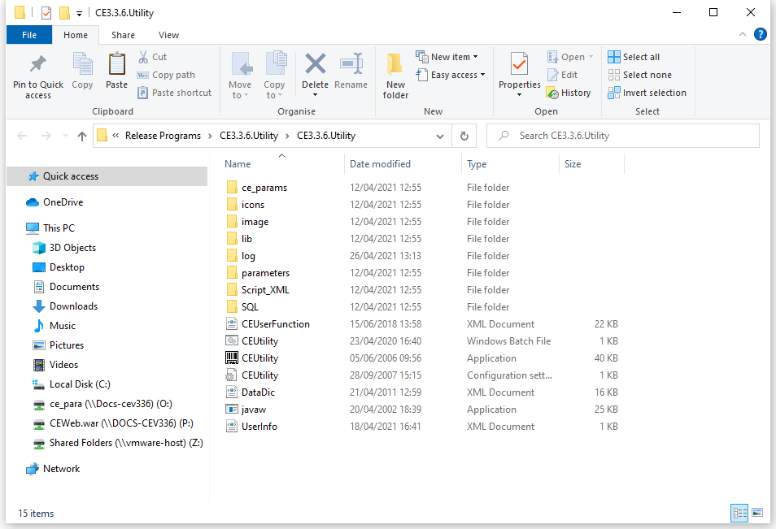
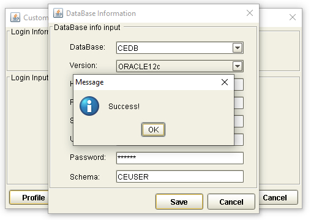
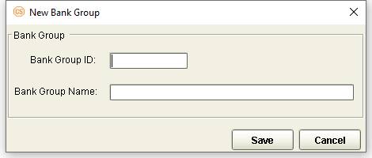
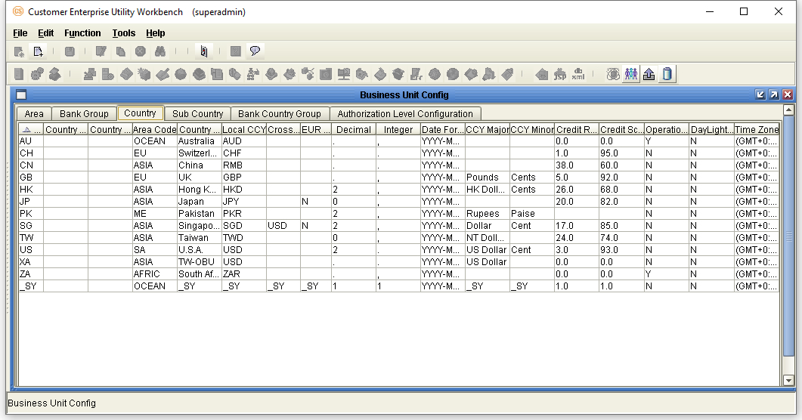
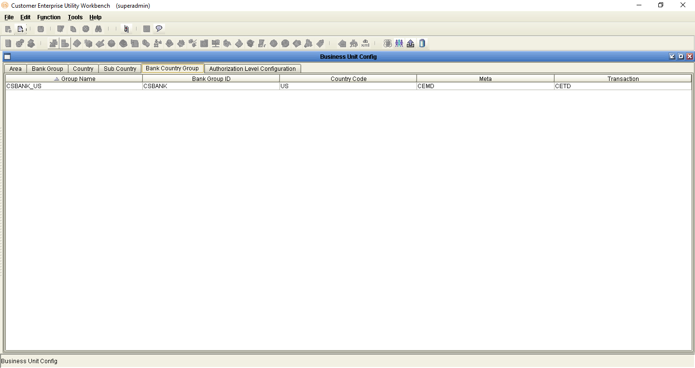
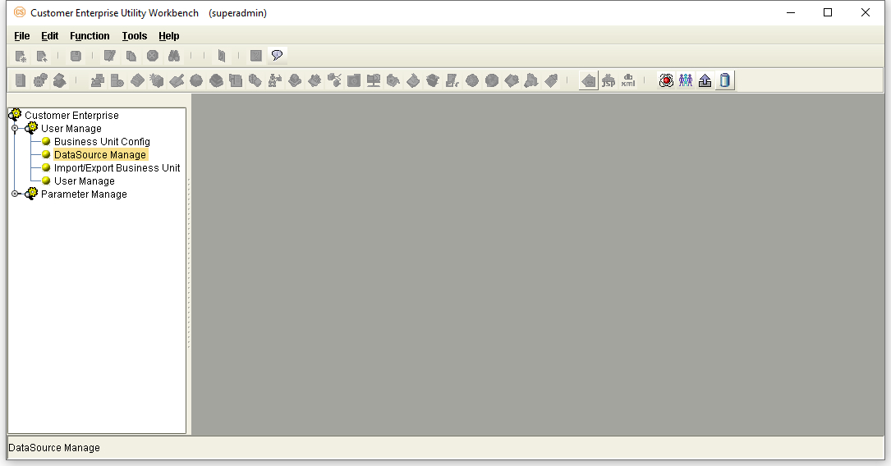
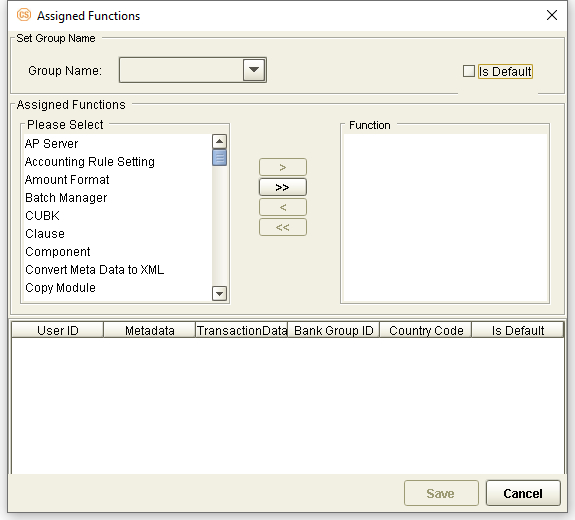
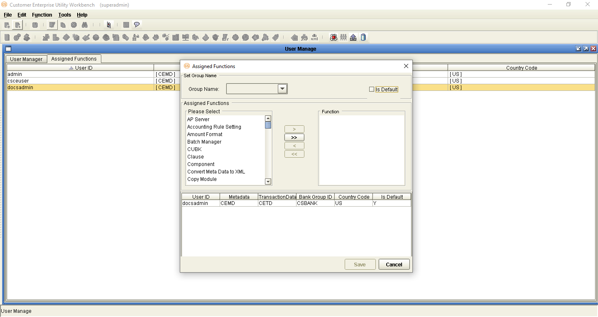
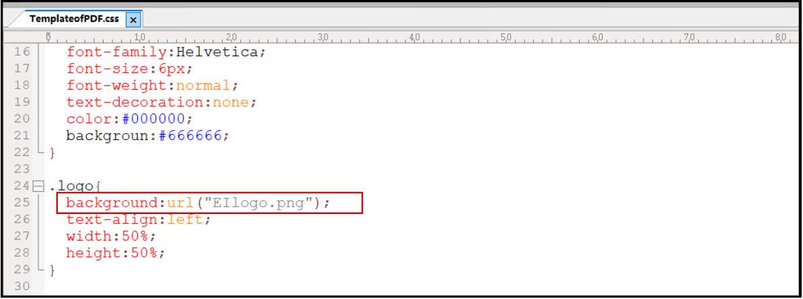

{width="8.625in" height="11.125in"}

+-----------------------------------------------------------------------+
| EXIMBILLS © Trade Finance System                                      |
|                                                                       |
| Customer Enterprise System Version 3.3.6                              |
|                                                                       |
| Frequently Asked Questions                                            |
|                                                                       |
| July 2021                                                             |
+-----------------------------------------------------------------------+
| *Copyright 2021 © China Systems Corporation*                          |
|                                                                       |
| *All Rights Reserved*                                                 |
|                                                                       |
| *This document is protected by United States Copyright Law and may    |
| contain Trade Secrets Information which is proprietary to China       |
| Systems Corporation. No part of this document may be copied,          |
| photocopied, reproduced, translated, distributed, or reduced to any   |
| electronic medium or machine-readable form without prior consent in   |
| writing from China Systems Corporation. The information in this       |
| document may be used only under the terms and conditions of separate  |
| China Systems Corporation license agreements.*                        |
|                                                                       |
| *Information is subject to change without notice. China Systems       |
| Corporation makes no warranties, either expressed or implied, with    |
| respect to the software herein described as to its quality,           |
| performance, including, without limitations to, its fitness for any   |
| particular purpose.*                                                  |
|                                                                       |
| *This document may not reflect total system capability at any         |
| subsequent date as a result of development. It is also possible that  |
| it may contain references to facilities not available on your         |
| computer system. Such references should not be construed to mean that |
| these facilities will necessarily be made available on all types of   |
| computer hardware or in all user locations.*                          |
|                                                                       |
| *China Systems Corporation accepts no responsibility or liability for |
| any damages or loss of business or revenue due to the use of this     |
| document.*                                                            |
|                                                                       |
| *All trademarks, registered trademarks and trade names mentioned in   |
| this document are the sole property of their respective holders.*     |
+-----------------------------------------------------------------------+
| ORDER MORE EXIMBILLS DOCUMENTATION                                    |
|                                                                       |
| Additional copies of Documentation are available for purchase from    |
| China Systems Corporation or through your local EXIMBILLS Support     |
| Office.                                                               |
+-----------------------------------------------------------------------+
| {width="0.7534722222222222in"           |
| height="0.7402777777777778in"}                                        |
|                                                                       |
| CHINA SYSTEMS CORPORATION                                             |
|                                                                       |
| Comments may be addressed to:                                         |
|                                                                       |
| <corporatedocs@chinasystems.com>                                      |
|                                                                       |
| China Systems Corporation Ltd.                                        |
|                                                                       |
| Corner House, 20 Parliament Street                                    |
|                                                                       |
| Hamilton HM12                                                         |
|                                                                       |
| Bermuda                                                               |
+-----------------------------------------------------------------------+

Table of Contents

[CE Documentation Library 7](#ce-documentation-library)

[CE Documentation Library 8](#ce-documentation-library-1)

[Core System Manuals 8](#core-system-manuals)

[CE Utility Reference Manuals 11](#ce-utility-reference-manuals)

[Installation Guides 11](#installation-guides)

[Introduction 12](#introduction)

[System Overview 13](#system-overview)

[Manual Overview 14](#manual-overview)

[Browser-side Issues 15](#browser-side-issues)

[Creating the Super Officer User Profile
16](#creating-the-super-officer-user-profile)

[CECheckCharacterFilterError 17](#cecheckcharacterfiltererror)

[Inbox or Detail Info Error Message 18](#_Toc75262064)

[Inbox Not Working Properly 19](#inbox-not-working-properly)

[Downloading Transaction Data on Weblogic
21](#downloading-transaction-data-on-weblogic)

[Modified LBI Files 22](#modified-lbi-files)

[Supporting Multi-Languages 23](#supporting-multi-languages)

[Session Timeout and Auto Save 24](#session-timeout-and-auto-save)

[Session Extension and Related Settings
25](#session-extension-and-related-settings)

[Cancel Button Issue 40](#cancel-button-issue)

[Uploading Files or Images 41](#uploading-files-or-images)

[Parameter Settings 41](#parameter-settings)

[Transaction Processing 42](#transaction-processing)

[Authorization Not Working 44](#authorization-not-working)

[Setting the Date Format 45](#setting-the-date-format)

[EC Ledger Error 46](#ec-ledger-error)

[Disable Cache 48](#disable-cache)

[Manually Stop/Start the WebSphere Service
49](#manually-stopstart-the-websphere-service)

[Browser Logon Information 52](#browser-logon-information)

[Encrypting User Logon Information
53](#encrypting-user-logon-information)

[Chrome Browser Settings 59](#chrome-browser-settings)

[IE9 Browser Settings 60](#ie9-browser-settings)

[Displaying the Last Logon Failure
61](#displaying-the-last-logon-failure)

[Browser Navigation Limitations 63](#browser-navigation-limitations)

[JSP and JS File Modifications 63](#jsp-and-js-file-modifications)

[Parameter Settings 69](#parameter-settings-1)

[Multiple Authorization Functions in One Product
71](#multiple-authorization-functions-in-one-product)

[Display Error When Printing Historical Records 73](#_Toc75262089)

[Display All Records For Inquire CUBK
77](#display-all-records-for-inquire-cubk)

[Disallowing the System Login GET Method
83](#disallowing-the-system-login-get-method)

[CE Utility and Parameter Issues 86](#ce-utility-and-parameter-issues)

[Creating the Super Admin User Profile
87](#creating-the-super-admin-user-profile)

[Host Name and Port Number of the Application Server
88](#host-name-and-port-number-of-the-application-server)

[Oracle Driver Error 91](#oracle-driver-error)

[SQL 2000 SP3 Error 92](#sql-2000-sp3-error)

[Catalog Setting Rules 93](#catalog-setting-rules)

[Maintaining Item Ids 94](#maintaining-item-ids)

[Deleting Data Source and User Information
95](#deleting-data-source-and-user-information)

[Creating the CE EAR File Backup 96](#creating-the-ce-ear-file-backup)

[Creating the Backup of CE.EAR Using a Batch File
96](#creating-the-backup-of-ce.ear-using-a-batch-file)

[Creating the Backup of CE.EAR Using the Command Prompt
99](#creating-the-backup-of-ce.ear-using-the-command-prompt)

[Selecting Multiple Transaction or Security Records in a Catalog
104](#selecting-multiple-transaction-or-security-records-in-a-catalog)

[Selecting Multiple Inbox Records in a Catalog
105](#selecting-multiple-inbox-records-in-a-catalog)

[CE Utility and CE New Utility Directory Structures
106](#ce-utility-and-ce-new-utility-directory-structures)

[Security Issues 114](#security-issues)

[Add Admin FAP Issue 115](#add-admin-fap-issue)

[Function Errors on WebLogic 116](#function-errors-on-weblogic)

[Supported Security Tokens 117](#supported-security-tokens)

[CE DB User Rights in a Production Environment
118](#ce-db-user-rights-in-a-production-environment)

[Token to Prevent CSRF Attack 119](#token-to-prevent-csrf-attack)

[Secure Cookie Attributes 121](#secure-cookie-attributes)

[Hiding Parameters in the Popup Window URL
123](#hiding-parameters-in-the-popup-window-url)

[Password Validation Rules 126](#password-validation-rules)

[Setting Different Password Policies for Bank and Company Users
133](#setting-different-password-policies-for-bank-and-company-users)

[Reactivating Locked Out Users 158](#reactivating-locked-out-users)

[Manual Reactivation 158](#manual-reactivation)

[Auto-Reactivation 162](#auto-reactivation)

[Logon and Password Issues 167](#logon-and-password-issues)

[Logon Information Issues 167](#logon-information-issues)

[User Profile Status Issues 168](#user-profile-status-issues)

[User Profile Inactive for too Long
168](#user-profile-inactive-for-too-long)

[User Profile Not Yet Effective 168](#user-profile-not-yet-effective)

[User Profile Already Expired 168](#user-profile-already-expired)

[User Profile Already Logged On 169](#user-profile-already-logged-on)

[Password Issues 169](#password-issues)

[Incorrect Password 169](#incorrect-password)

[Forgotten Password 170](#forgotten-password)

[Expired Password 170](#expired-password)

[Parameter Checklist for Security Vulnerabilities
171](#parameter-checklist-for-security-vulnerabilities)

[JQuery Upgrade 182](#jquery-upgrade)

[Integration Issues 194](#integration-issues)

[Updating CE Directly with Back Office Data
195](#updating-ce-directly-with-back-office-data)

[Assigning a Company Group to a Company Sent from EE
196](#assigning-a-company-group-to-a-company-sent-from-ee)

[MQ Tool 197](#mq-tool)

[MQ Channel Authentication Configuration
209](#mq-channel-authentication-configuration)

[Creating the Queue Manager, Queues, and Channels
210](#creating-the-queue-manager-queues-and-channels)

[Creating a Local Machine User 222](#creating-a-local-machine-user)

[Setting the Channel Authentication Records
224](#setting-the-channel-authentication-records)

[Granting the Local Machine User Access to the Queue
233](#granting-the-local-machine-user-access-to-the-queue)

[Configuring the Queues in the CE Utility
237](#configuring-the-queues-in-the-ce-utility)

[Database Issues 239](#database-issues)

[Copying Tables in DB2 240](#copying-tables-in-db2)

[Assigning the Database Users to the SQL Server Logins
241](#assigning-the-database-users-to-the-sql-server-logins)

[Importing Existing Tables from the Database
242](#importing-existing-tables-from-the-database)

[Manually Stop/Start the Oracle Database
243](#manually-stopstart-the-oracle-database)

[Backing up the Oracle Database 247](#backing-up-the-oracle-database)

[Uninstalling the Oracle Database
251](#uninstalling-the-oracle-database)

[Common Oracle Errors 265](#common-oracle-errors)

[Database Tools 274](#database-tools)

[Using QTODBC 274](#using-qtodbc)

[Using Squirrel SQL 283](#using-squirrel-sql)

[Error on Data Retrieval 293](#error-on-data-retrieval)

[Report Issues 294](#report-issues)

[Saving Static Reports 295](#saving-static-reports)

[Special Features 297](#special-features)

[SMS Notification Feature 298](#sms-notification-feature)

[Additional Information 299](#additional-information)

[CE Version 300](#ce-version)

[Manually Maintained Parameters 302](#manually-maintained-parameters)

[Project-Controlled Parameters 303](#project-controlled-parameters)

[Frequently Used SQL Statements 304](#frequently-used-sql-statements)

[Mapping the Parameter and Web Server Drives
308](#mapping-the-parameter-and-web-server-drives)

[Server-Side Mapping 310](#server-side-mapping)

[Client-Side Mapping 311](#client-side-mapping)

[CE Log Files 315](#ce-log-files)

[SQL Parser 316](#sql-parser)

[Microsoft^^ Script Editor 318](#microsoft-script-editor)

[Ultra Edit Text Editor 323](#ultra-edit-text-editor)

[Macromedia® Dreamweaver® 330](#macromedia-dreamweaver)

[Veracode Scanning 335](#veracode-scanning)

[The CE New Utility 336](#the-ce-new-utility)

[Glossary 337](#glossary)

[Glossary 338](#_Toc75262174)

 {#section .CS-ChapterTitle}

CE Documentation Library {#ce-documentation-library .CS-ChapterTitle}
========================

CE Documentation Library {#ce-documentation-library-1 .CS-head1}
========================

The CE Documentation Library lists all available manuals that serve as
references on the use of the Customer Enterprise system. The documents
are categorized into three groups: Core System Manuals, CE Utility
Reference Manuals, and Installation Guides.

Core System Manuals {#core-system-manuals .CS-head2}
===================

The CE core system manuals provide information on the setup and
configuration of various CE parameters, as well as the implementation of
supplementary functionalities supported by the system.

Archiving and Recovery

This manual is a reference to the Archive and Recovery functionality of
the CE system. Discussions include the required parameter settings for
configuring the relevant functions, as well as examples of how this
functionality is used in transaction processes.

Building a Product

This manual is a reference to the process of building a product in CE.
It provides step-by-step procedures on how to create a basic CE module,
transaction function, and product setting; configure parameters; and
attach components to generate a working business product.

Data Objects

This manual serves as a reference for creating and utilizing data
objects in the CE system. The discussions provide information on how to
build data object templates and data object entities, and how to attach
these to the transaction function screen.

Frequently Asked Questions

This document addresses commonly-asked questions on the Customer
Enterprise system. Issues on the browser-side (transaction processing),
CE Utility, Security Module, and database, among others, are addressed
in the discussions.

Interfacing CE with CS Eximbills

This document discusses the process of interfacing CE with the CS
Eximbills (CSX) back office system. Employing the MQ, FTP, and TCP/IP
communication protocols, the interface process using the XML format is
detailed in this document.

Interfacing CE with Eximbills Enterprise

This document discusses the process of interfacing CE with the Eximbills
Enterprise (EE) back office system. Employing the MQ protocol, the
interface process for the transfer of data between CE and EE using the
XML format is detailed in this document.

Log Settings

This manual provides information on CE logs as well as general
instructions on log configuration in CE. This is especially written for
the users who are in charge of maintaining the CE system.

Look and Feel

This manual is a reference guide on designing the CE user interface
(i.e., the look and feel of the system). Divided into two parts, the
manual provides instructions on creating a) the basic L&F style of CE;
and b) the CE L&F style that incorporates widgets.

Multi-Entity

This manual is a reference on implementing the Multi-Entity
functionality of the CE system. Discussions cover the implementation and
application of CE multi-entity.

Multi-Language

This manual discusses the procedures required in setting up the
Multi-Language functionality of CE as it is run by Administrator- and
Operator-type users. Furthermore, the configuration of certain system
and browser elements as well as the setup of related system parameters
is explained in step-by-step procedures.

Reports

This manual is a comprehensive reference guide on the requirements and
processes involved in building business products and functions that
generate online reports and documents.

Security and System Maintenance Functions

This manual is a comprehensive guide on the security and system
maintenance of the CE system. As such, it includes detailed instructions
for company and company function management, and user and user function
management. Maintenance of key functionalities such as authorization
rules, reference numbers, and other services is covered as well. In
addition, this document discusses the security concepts in CE to assist
users assigned with access rights to the CE Security Module.

Standing Data Functions

This document discusses the functions for the CE standing data that are
maintained by operators (e.g., parties, clauses). It includes sections
for each function, starting with a brief description of the function,
followed by the function input when necessary, and the procedure steps.

Supplementary Functions

This manual is a reference for the CE Utility operator user in
configuring parameter, JSP, and transaction function settings to define
special or supplementary CE functionalities such as uploading images;
sending images and forms to the back-office system; and sending
notifications via e-mail, SMS, and widgets.

System Administration Functions

This manual is a reference for the default Super Administrator user of
the CE Utility in the configuration and maintenance of the CE
environment. It discusses in detail user management and parameter
management.

System Reference

This document serves as a quick reference to the following elements that
are used when configuring specific parameters in the CE Utility: global
system parameters, system parameters, components, XML Generator items,
server side system methods, system JS methods, and APIs.

CE Utility Reference Manuals {#ce-utility-reference-manuals .CS-head2}
============================

The CE Utility Reference set of manuals is a guide on the use of the
Customer Enterprise Utility Workbench, or simply CE Utility. This
reference provides information on every function or feature in the CE
Utility and includes instructions and step-by-step procedures on how to
operate or use the function in relation to operating and maintaining the
CE system and processing a business transaction.

> A manual is provided for each function group of the CE Utility:

-   *CE Utility Reference: User Manager Functions*, for the functions
    that belong to the User Manage function group of the CE Utility when
    accessed by an Administrator or Operator user

-   *CE Utility Reference: Parameter Manager Functions*, for the
    functions that belong to the Parameter Manage function group of the
    CE Utility when accessed by an Administrator or Operator user

-   *CE Utility Reference: System Functions*, for the functions that
    belong to the System Function group of the CE Utility.

-   *CE Utility Reference: Transaction Functions*, for the functions
    that belong to the Transaction Function group of the CE Utility.

-   *CE Utility Reference: Product Functions*, for the functions that
    belong to the Product Function group of the CE Utility.

-   *CE Utility Reference: Maintenance Functions*, for the functions
    that belong to the Maintenance function group of the CE Utility.

Installation Guides {#installation-guides .CS-head2}
===================

The CE installation guides are references on the installation and setup
processes of the CE system on different application servers and
databases.

Installation Guide WAS 9 - Oracle 19c

This is a reference for installing the CE system on WebSphere
Application Server Version 9.0.5.6, with an Oracle 19c database. This
includes detailed instructions on configuring the components that are
required to successfully run CE.

 {#section-1 .CS-ChapterTitle}

Introduction {#introduction .CS-ChapterTitle}
============

-   SYSTEM OVERVIEW

-   MANUAL OVERVIEW

System Overview {#system-overview .CS-head1}
===============

Customer Enterprise (CE) is a system that provides customers with access
to business transactions with more convenience and faster connection.
With the help of internet technology, CE is especially designed to allow
customers to do business and participate in the business process without
being physically present at the bank. Making use of supplementary
functionalities, CE may be interfaced with Eximbills Enterprise and CS
Eximbills. The system utilizes three main physical components: the
database server, the application server, and the web server.

The Customer Enterprise Utility Workbench, or CE Utility, is the main
parameter-setting tool of the CE system. It is used to define parameters
and rules that are required to successfully carry out business processes
and operations, and system tasks. Parameters instruct the system on how
to control, manage, and process the business data that it receives. The
parameters are written into the background database or saved in the
Application and Web servers as XML documents to be used for system
operations.

General issues and information about the Customer Enterprise system and
the CE Utility are discussed in this reference.

{width="0.3375in" height="0.3375in"}NOTE:
Refer to the Customer Enterprise documentations for detailed information
on the CE system.

 {#section-2 .CS-head1}

Manual Overview {#manual-overview .CS-head1}
===============

> **[Purpose]{.underline}**
>
> This document addresses commonly-asked questions on the Customer
> Enterprise system. Issues on the browser-side (transaction
> processing), CE Utility, Security Module, and database, among others,
> are addressed in the discussions.
>
> **[Audience]{.underline}**
>
> This manual is a reference specifically for, but not limited to, the
> following users:

-   Users assigned to build modules or troubleshoot parameter errors

-   Users assigned to troubleshoot runtime errors

-   Users with sufficient knowledge of installing a CE environment,
    using the different CE and CE Utility functions, and configuring CE
    parameters

> **[Prerequisites]{.underline}**
>
> In depth knowledge of the system, as also presented and detailed in
> the following manuals, is recommended:

-   *CE Core Manuals*

-   *CE Utility References*

-   *CE Installation Guides*

{width="0.3333333333333333in"
height="0.3333333333333333in"}NOTE: Some features discussed in this
manual have been tested and documented based on an older system version.
Unless otherwise specified, the overall functionality is the same when
recreated in the current version.

 {#section-3 .CS-ChapterTitle}

Browser-side Issues {#browser-side-issues .CS-ChapterTitle}
===================

-   CREATING THE SUPER OFFICER USER PROFILE

-   CECHECKCHARACTERFILTER ERROR

-   INBOX OR DETAIL INFO ERROR MESSAGE

-   INBOX NOT WORKING PROPERLY

-   DOWNLOADING TRANSACTION DATA ON WEBLOGIC

-   MODIFIED LBI FILES

-   SUPPORTING MULTI-LANGUAGES

-   SESSION TIMEOUT AND AUTO SAVE

-   SESSION EXTENSION AND RELATED SETTINGS

-   CANCEL BUTTON ISSUE

-   Uploading Files or Images

-   AUTHORIZATION NOT WORKING

-   SETTING THE DATE FORMAT

-   EC LEDGER ERROR

-   DISABLE CACHE

-   MANUALLY STOP/START THE WEBSPHERE SERVICE

-   BROWSER LOGON INFORMATION

-   Chrome Browser Settings

-   IE9 Browser SEttings

-   Displaying the Last Logon Failure

-   Browser navigation limitations

-   MULTIPLE AUTHORIZATION FUNCTIONS IN ONE PRODUCT

-   DISPLAY ERROR WHEN PRINTING HISTORICAL RECORDS

-   DISPLAY ALL RECORDS FOR INQUIRE CUBK

-   DISALLOWING THE SYSTEM LOGIN GET METHOD

 {#section-4 .CS-head1}

 {#section-5 .CS-head1}

Creating the Super Officer User Profile {#creating-the-super-officer-user-profile .CS-head1}
=======================================

To create the default Super Officer user profile, run this SQL Insert
statement:

(Start of code)

> INSERT INTO CEUSER.SEC\_USER\_INFO ( SEC\_USER\_INFO.C\_BK\_GROUP\_ID,
> SEC\_USER\_INFO.C\_UNIT\_CODE, SEC\_USER\_INFO.C\_USER\_ID,
> SEC\_USER\_INFO.C\_USER\_DESC, SEC\_USER\_INFO.C\_PASSWORD,
> SEC\_USER\_INFO.I\_USER\_TYPE, SEC\_USER\_INFO.I\_AUTH\_LEVEL,
> SEC\_USER\_INFO.I\_AUTH\_TYPE, SEC\_USER\_INFO.C\_DFLT\_UNIT\_CODE,
> SEC\_USER\_INFO.C\_DATE\_FORM, SEC\_USER\_INFO.C\_TMPL\_PROTECT,
> SEC\_USER\_INFO.C\_LOG\_TYPE, SEC\_USER\_INFO.C\_HAVE\_AUTH,
> SEC\_USER\_INFO.C\_AUTH\_SET, SEC\_USER\_INFO.C\_LOGIN\_RULE,
> SEC\_USER\_INFO.C\_LOCKED\_FLAG, SEC\_USER\_INFO.C\_FAP\_SET,
> SEC\_USER\_INFO.C\_CNTY\_CODE, SEC\_USER\_INFO.C\_LANG\_NAME,
> SEC\_USER\_INFO.C\_LANG\_VAL, SEC\_USER\_INFO.C\_LOCKED\_OP,
> SEC\_USER\_INFO.T\_LOCKED\_TIME, SEC\_USER\_INFO.EFFECTIVE\_DATE,
> SEC\_USER\_INFO.EXPIRY\_DATE, SEC\_USER\_INFO.I\_EXPIRY\_TYPE,
> SEC\_USER\_INFO.I\_MULTI\_LOGIN, SEC\_USER\_INFO.C\_ADD\_FLAG,
> SEC\_USER\_INFO.C\_TRX\_STATUS, SEC\_USER\_INFO.C\_CREATED\_BU,
> SEC\_USER\_INFO.C\_CREATED\_BY, SEC\_USER\_INFO.C\_GRP\_CODE,
> SEC\_USER\_INFO.C\_CURRENCY, SEC\_USER\_INFO.I\_SEC\_TYPE,
> SEC\_USER\_INFO.D\_CREATED\_DATE, SEC\_USER\_INFO.C\_CHANGE\_PSW,
> SEC\_USER\_INFO.I\_LOGON\_RETRIES, SEC\_USER\_INFO.C\_INACTIVE,
> SEC\_USER\_INFO.C\_FIRST\_PWD, SEC\_USER\_INFO.C\_LAST\_PWD,
> SEC\_USER\_INFO.C\_USER\_MAIL )
>
> VALUES ( \'CSBANK\', \'CSOFFICE\', \'superofficer\', \'The Super
> Officer\', \'11111111\', 0, 1, 0, NULL, \'yyyy-mm-dd\', NULL, NULL,
> \'F\', NULL, NULL, \'F\', \'T\', \'US\', NULL, NULL, \'superofficer\',
> TO\_DATE(\'2005/12/08 12:51:46\', \'YYYY/MM/DD HH24:MI:SS\'), NULL,
> NULL, 1, 0, NULL, NULL, NULL, NULL, \'CSOFFICE\', NULL, NULL,
> TO\_DATE(\'2007/03/09 00:00:00\', \'YYYY/MM/DD HH24:MI:SS\'), \'F\',
> 0, NULL, NULL, NULL, NULL )

(End of code)

 {#section-6 .CS-head1}

CECheckCharacterFilterError {#cecheckcharacterfiltererror .CS-head1}
===========================

Issue

On a new environment, this error occurs when loading a transaction
screen: 'Error 500: Filter \[CECheckCharacterFilter\]: Filter is
unavailable'.

Solution

Add the following parameter in the \[CE Parameter Folder\]\\CE\_SYS
folder.

-   characterfilter.xml

Inbox or Detail Info Error Message {#inbox-or-detail-info-error-message .CS-head1}
==================================

Issue

The system cannot display the inbox, or the 'Detail Info' error message
is shown.

  ------------------------------------------------------------------------------------
  {width="4.844444444444444in" height="1.1555555555555554in"}
  ------------------------------------------------------------------------------------

Figure 2. Loading the Inbox

Solution

Start the database first and then the CE application.

 {#section-7 .CS-head1}

Inbox Not Working Properly {#inbox-not-working-properly .CS-head1}
==========================

Issue

The Inbox does not work properly: the statistics or figures are
incorrect

Solution

Check the parameter settings in the CE Utility and make sure that the
Key FAP has been properly set. Additionally, the Key FAP selected must
be the Item assigned to the relevant product function and not the Item
Type.

**[EXAMPLE:]{.underline}**

The Key FAP value for Rejected (an Inbox item) is Modify.

  ----------------------------------------------------------------------
  {width="4.85in" height="2.588888888888889in"}
  ----------------------------------------------------------------------

Modify is also the Item assigned to the related product function,
ModifyTrx (as opposed to the assigned Item Type -- Edit).

  -----------------------------------------------------------------------
  {width="4.85in" height="2.5833333333333335in"}
  -----------------------------------------------------------------------

 {#section-8 .CS-head1}

Downloading Transaction Data on Weblogic {#downloading-transaction-data-on-weblogic .CS-head1}
========================================

Issue

When run on WebLogic, transaction data are not properly downloaded
unless the screen is refreshed.

Solution

Add this tag in the transaction JSP file:

\<%@ page contentType=\"text/html; CHARSET=UTF-8\" %\>

 {#section-9 .CS-head1}

Modified LBI Files {#modified-lbi-files .CS-head1}
==================

Issue

The transaction screen does not reflect the changes made on an LBI file
that is attached to the screen or JSP file.

Solution

If an LBI file is changed and this is attached to the transaction JSP
file through the 'include' command, save the JSP file again.

**[EXAMPLE: ]{.underline}**

Refer to the following figure.

The SecuOperator.lbi file is attached to the SecuAdmin.jsp file as shown
in this code:

\<%@ include file="SecuOperator.lbi"%\>

If the SecuOperator.lbi file is modified, make sure to save the
SecuAdmin.jsp file again.

  -------------------------------------------------------------------------------------
  {width="4.856944444444444in" height="2.726415135608049in"}
  -------------------------------------------------------------------------------------

Figure 2. Attached LBI File

 {#section-10 .CS-head1}

Supporting Multi-Languages {#supporting-multi-languages .CS-head1}
==========================

For the system to support different languages in the system or browser
(i.e., special characters are to be accepted), open the WebSphere --
Administrative Console and access the application server (e.g.,
Server1). In the Process Definition -- Configuration screen, click on
the Java Virtual Machine property. Click on the Custom Properties option
and create the following setting:

  ------- -- -------------
  Field      Description
  ------- -- -------------

  ----------------- -- ---------------------------------------------------------------------
  **Name **            Specify this value: client.encoding.override
                       
  **Value**            Specify this value: UTF-8
                       
  **Description**      Specify the language to be supported in this field (e.g., Chinese).
  ----------------- -- ---------------------------------------------------------------------

  ------------------------------------------------------------
  {width="4.85in" height="2.58125in"}
  ------------------------------------------------------------

Figure 2. Example: Supporting the Chinese Language

 Session Timeout and Auto Save {#session-timeout-and-auto-save .CS-head1}
=============================

The timeout and auto save functionality for CE transactions are set in
CE Utility.

The session timeout is defined in the SESSION\_TIMEOUT system parameter
(under the Web Server parameter type). The unit is in minutes, and the
value must be greater than 1, as the system prompts a warning message
one minute before it has to time out

  ------------------------------------------------------------------------
  {width="4.85in" height="2.5770833333333334in"}
  ------------------------------------------------------------------------

Figure 2. SESSION\_TIMEOUT System Parameter

The generated XML file for this system parameter is in:

\[Parameter Path\]\\CSBANK\\US\\WEB\\SYST\\sysparam.xml

The Value setting in the SESSION\_TIMEOUT node must be in capitals,
'VALUE'; otherwise, the system cannot recognize the defined value and
defaults it to 30.

 {#section-11 .CS-head1}

Session Extension and Related Settings {#session-extension-and-related-settings .CS-head1}
======================================

During transaction processing, a warning message is shown when a session
is about to expire. Through this message, a user may opt to extend the
session, otherwise, due to inactivity, the transaction is automatically
saved and the user automatically logged off the CE system when the
session expires. This warning message may be shown either through a
popup window or through a float layer.

Originally, a popup window is displayed to enable users to extend the
session. However, this popup window may only be made available in
transaction modules. In addition, some browser types block this popup
window causing the user to be unaware of session expiry and thus
encountering an exception during processing.

In order to fully utilize the extend session feature in transaction,
security, standing and system modules, the extend session warning
message must be shown through the use of float layer.

{width="0.3333333333333333in"
height="0.3333333333333333in"}NOTE:

When using the extend session feature:

i.  In the security, standing, and system modules, transactions are not
    automatically saved once a session expires.

ii. In transaction modules, transactions processed in pending functions
    are automatically saved once a session expires.

Configuration

To enable the use of float layer for extend session warning messages,
the following configurations must be performed:

1.  Modify the web.xml file. This file is stored on the following path:

    \[CEWeb.war folder\]\\WEB-INF

-   Add a new mapping for this filter: CEVerifySessionFilter

+--------------------------------------------------------+
| \<filter-mapping id=\"FilterMapping\_1138957604797\"\> |
|                                                        |
| \<filter-name\>CEVerifySessionFilter\</filter-name\>   |
|                                                        |
| \<servlet-name\>WSSTrxManager\</servlet-name\>         |
|                                                        |
| \</filter-mapping\>                                    |
|                                                        |
| \<filter-mapping\>                                     |
|                                                        |
| \<filter-name\>CEVerifySessionFilter\</filter-name\>   |
|                                                        |
| \<servlet-name\>WSGetDataSSScript\</servlet-name\>     |
|                                                        |
| \</filter-mapping\>                                    |
+--------------------------------------------------------+

-   Add the WSSessionTimeOutManage servlet and define its mapping.

+-----------------------------------------------------------------------+
| \<servlet\>                                                           |
|                                                                       |
| \<servlet-name\>WSSessionTimeOutManage\</servlet-name\>               |
|                                                                       |
| \<display-name\>WSSessionTimeOutManage\</display-name\>               |
|                                                                       |
| \<description\>\</description\>                                       |
|                                                                       |
| \<servlet-class\>com.cs.eximweb.servlets.WSSessionTimeOutManage\</ser |
| vlet-class\>                                                          |
|                                                                       |
| \</servlet\>                                                          |
+-----------------------------------------------------------------------+

+-----------------------------------------------------------------+
| \<servlet-mapping\>                                             |
|                                                                 |
| \<servlet-name\>WSSessionTimeOutManage\</servlet-name\>         |
|                                                                 |
| \<url-pattern\>/servlets/WSSessionTimeOutManage\</url-pattern\> |
|                                                                 |
| \</servlet-mapping\>                                            |
+-----------------------------------------------------------------+

2.  Log on to the CE Utility as a super administrator user and set the
    value of the EXTEND\_SESSION\_LAYER security system parameter to
    TRUE.

> This parameter is used to control how the extend session notification
> is to be displayed: through a popup window or a float layer. It may
> have any of the following values:

-   TRUE, in which a float layer is shown as a notification for
    extending the session. This is made available in transaction,
    security, standing, and system modules.

-   FALSE, in which the standard logic is applied and a popup window is
    displayed as a notification for extending the session. This is made
    available in pending transactions only. This is the default value.

  ------------------------------------------------------------------------
  {width="4.85in" height="2.5729166666666665in"}
  ------------------------------------------------------------------------

> Log on to the CE Utility as an administrator or operator user and
> generate the xml files for the Security System Parameter. The
> sys\_para.xml file is generated on the following path:

\[Parameter folder\]\\CE\_SYS\\SYST

  ------------------------------------------------------------------------
  {width="4.85in" height="2.5729166666666665in"}
  ------------------------------------------------------------------------

3.  Log on the CE Utility as an administrator or operator user. In the
    System Parameter function, make sure that the value of the
    SESSION\_TIMEOUT Web Server system parameter is less than or equal
    to the session timeout value of the application server. The value of
    this parameter is in minutes, and its minimum value is 2.

  ------------------------------------------------------------------------
  {width="4.85in" height="2.5729166666666665in"}
  ------------------------------------------------------------------------

> To check the session timeout configuration of the application in
> WebSphere, run the WebSphere Administrative Console and access the
> following path:
>
> Servers \> Server Type \> WebSphere Application Servers \> \[server\]
> \> Container Settings Section: Session Management

  ------------------------------------------------------------------------
  {width="4.85in" height="2.3340277777777776in"}
  ------------------------------------------------------------------------

> Generate the xml file for the Meta System Parameter. The sysparam.xml
> file is generated on the following path:

\[Parameter folder\]\\\[Bank\]\\\[Country\]\\WEB\\SYST

  ------------------------------------------------------------------------
  {width="4.85in" height="2.5729166666666665in"}
  ------------------------------------------------------------------------

4.  Add the SYS\_ExtendSession.js file in the following path:

    \[CEWeb.war folder\]\\JS

    [File Content:]{.underline}

+-----------------------------------------------------------------------+
| /\*\*                                                                 |
|                                                                       |
| \* ADD DORA FOR CEV2-05-12-10                                         |
|                                                                       |
| \* Support extend session in security, and change the popup window to |
| div.                                                                  |
|                                                                       |
| \*/                                                                   |
|                                                                       |
| var sessionLife = \"\"; //session life cycle-1min                     |
|                                                                       |
| var sessionCouter = null; //session counter                           |
|                                                                       |
| var CountdownNum = 30; //count number on layer                        |
|                                                                       |
| var subTimer = null; //session count down                             |
|                                                                       |
| //APPEND EXTEND SESSION LISTENER                                      |
|                                                                       |
| function sessionListener(){                                           |
|                                                                       |
| var actionUrl =                                                       |
| \"../servlets/WSTrxManager?\_TRX\_STATUS=SESSION\_LIFE\_CYCLE&MOTION\ |
| _TYPE=INIT\";                                                         |
|                                                                       |
| actionUrl = encodeUrl(actionUrl);                                     |
|                                                                       |
| sendRequestByAjaxPost(actionUrl, true,iTimeBack);                     |
|                                                                       |
| }                                                                     |
|                                                                       |
| function iTimeBack(xmlhttp){                                          |
|                                                                       |
| var iTime = xmlhttp.responseText;                                     |
|                                                                       |
| sessionLife = iTime;                                                  |
|                                                                       |
| if(sessionLife){                                                      |
|                                                                       |
| sessionCouter = setTimeout(\"SYS\_DrewExtendLayer(\" + sessionLife +  |
| \")\", sessionLife);                                                  |
|                                                                       |
| }                                                                     |
|                                                                       |
| }                                                                     |
|                                                                       |
| function SYS\_DrewExtendLayer(sessionTime){                           |
|                                                                       |
| drewExtendSessionLayer();                                             |
|                                                                       |
| drewCover();                                                          |
|                                                                       |
| //SET COUNTDOWN                                                       |
|                                                                       |
| couterCal();                                                          |
|                                                                       |
| }                                                                     |
|                                                                       |
| //drew cover layer                                                    |
|                                                                       |
| function drewCover(){                                                 |
|                                                                       |
| var oCoverDiv = document.createElement(\"div\");                      |
|                                                                       |
| oCoverDiv.className = \"CoverDiv\";                                   |
|                                                                       |
| oCoverDiv.id = \"CoverLayer\";                                        |
|                                                                       |
| var sStyle = \"height:\" + getDocHeight() + \"px\";                   |
|                                                                       |
| oCoverDiv.setAttribute(\"style\",sStyle);                             |
|                                                                       |
| document.body.appendChild(oCoverDiv);                                 |
|                                                                       |
| }                                                                     |
|                                                                       |
| //drea extend session layer                                           |
|                                                                       |
| function drewExtendSessionLayer(){                                    |
|                                                                       |
| rmErrMsg();                                                           |
|                                                                       |
| //FLOAT LAYER                                                         |
|                                                                       |
| var floatLayerDIV = document.createElement(\"div\");                  |
|                                                                       |
| floatLayerDIV.id = \"floatLayerDIV\";                                 |
|                                                                       |
| floatLayerDIV.className = \"floatLayerDIV\";                          |
|                                                                       |
| //HEADER                                                              |
|                                                                       |
| var layerHeader = document.createElement(\"div\");                    |
|                                                                       |
| layerHeader.id = \"layerHeader\";                                     |
|                                                                       |
| layerHeader.className = \"layerHeader\";                              |
|                                                                       |
| var headerH3 = document.createElement(\"h3\");                        |
|                                                                       |
| headerH3.innerHTML = \"Warning\";                                     |
|                                                                       |
| layerHeader.appendChild(headerH3);                                    |
|                                                                       |
| floatLayerDIV.appendChild(layerHeader);                               |
|                                                                       |
| //HR                                                                  |
|                                                                       |
| var hr = document.createElement(\"hr\");                              |
|                                                                       |
| floatLayerDIV.appendChild(hr);                                        |
|                                                                       |
| //MIAN                                                                |
|                                                                       |
| var layerMain = document.createElement(\"div\");                      |
|                                                                       |
| layerMain.id = \"layerMain\";                                         |
|                                                                       |
| layerMain.className = \"layerMain\";                                  |
|                                                                       |
| if(typeof(SYS\_FUNCTION\_TYPE)!=\"undefined\" && (SYS\_FUNCTION\_TYPE |
| == \"MM\" \|\| SYS\_FUNCTION\_TYPE == \"PM\" \|\| SYS\_FUNCTION\_TYPE |
| == \"EC\" )){                                                         |
|                                                                       |
| layerMain.innerHTML = \"Your session is about to time out. Your       |
| transaction details will be saved and you will be logged out in \";   |
|                                                                       |
| }else{                                                                |
|                                                                       |
| layerMain.innerHTML = \"Your session is about to time out. You will   |
| be logged out in \";                                                  |
|                                                                       |
| }                                                                     |
|                                                                       |
| var countSpan = document.createElement(\"span\");                     |
|                                                                       |
| countSpan.id = \"countNum\";                                          |
|                                                                       |
| countSpan.innerHTML = CountdownNum ;                                  |
|                                                                       |
| layerMain.appendChild(countSpan);                                     |
|                                                                       |
| var secondSpan = document.createElement(\"span\");                    |
|                                                                       |
| secondSpan.innerHTML = \" seconds.\";                                 |
|                                                                       |
| layerMain.appendChild(secondSpan);                                    |
|                                                                       |
| var br1 = document.createElement(\"br\");                             |
|                                                                       |
| layerMain.appendChild(br1);                                           |
|                                                                       |
| var br2 = document.createElement(\"br\");                             |
|                                                                       |
| layerMain.appendChild(br2);                                           |
|                                                                       |
| var descSpan = document.createElement(\"span\");                      |
|                                                                       |
| descSpan.innerHTML = \" To extend your session, please click Extend.  |
| \";                                                                   |
|                                                                       |
| layerMain.appendChild(descSpan);                                      |
|                                                                       |
| floatLayerDIV.appendChild(layerMain);                                 |
|                                                                       |
| //FOOT                                                                |
|                                                                       |
| var layerFoot = document.createElement(\"div\");                      |
|                                                                       |
| layerFoot.id = \"layerFoot\";                                         |
|                                                                       |
| layerFoot.className = \"layerFoot\";                                  |
|                                                                       |
| // CONTINUE BUTTON                                                    |
|                                                                       |
| var continueBTN = document.createElement(\"input\");                  |
|                                                                       |
| continueBTN.type = \"button\";                                        |
|                                                                       |
| continueBTN.value = \"Extend\";                                       |
|                                                                       |
| attachObjEvent(continueBTN, \"onclick\", eval(\"toExtendSession\"));  |
|                                                                       |
| continueBTN.className = \"prim\";                                     |
|                                                                       |
| layerFoot.appendChild(continueBTN);                                   |
|                                                                       |
| floatLayerDIV.appendChild(layerFoot);                                 |
|                                                                       |
| document.body.appendChild(floatLayerDIV);                             |
|                                                                       |
| }                                                                     |
|                                                                       |
| //calculate countdown                                                 |
|                                                                       |
| function couterCal(){                                                 |
|                                                                       |
| subTimer = setInterval(\"subTimes(\$(\'\#countNum\').html())\",       |
| 1000);                                                                |
|                                                                       |
| }                                                                     |
|                                                                       |
| //decrease count number                                               |
|                                                                       |
| function subTimes(curSecond){                                         |
|                                                                       |
| if( parseInt(curSecond) \> 0 ){                                       |
|                                                                       |
| var tempSecond = parseInt(curSecond) - 1;                             |
|                                                                       |
| \$(\"\#countNum\").html(tempSecond);                                  |
|                                                                       |
| }else{                                                                |
|                                                                       |
| clearInterval(subTimer);                                              |
|                                                                       |
| removeLayer();                                                        |
|                                                                       |
| if(typeof(SYS\_FUNCTION\_TYPE)!=\"undefined\" && (SYS\_FUNCTION\_TYPE |
| == \"MM\" \|\| SYS\_FUNCTION\_TYPE == \"PM\" \|\| SYS\_FUNCTION\_TYPE |
| == \"EC\" )){                                                         |
|                                                                       |
| \_save\_onclick(true);                                                |
|                                                                       |
| }else{                                                                |
|                                                                       |
| SYS\_CE\_LOGOUT(false);                                               |
|                                                                       |
| }                                                                     |
|                                                                       |
| }                                                                     |
|                                                                       |
| }                                                                     |
|                                                                       |
| //RESERT SESSION COUNTER WHEN CONTINUE AND SEND OTHER REQUEST         |
|                                                                       |
| function restartSessionCounter(){                                     |
|                                                                       |
| removeLayer();                                                        |
|                                                                       |
| if (sessionCouter) {                                                  |
|                                                                       |
| clearTimeout(sessionCouter);                                          |
|                                                                       |
| }                                                                     |
|                                                                       |
| if (sessionLife) {                                                    |
|                                                                       |
| sessionCouter = setTimeout(\"SYS\_DrewExtendLayer(\" + sessionLife +  |
| \")\", sessionLife);                                                  |
|                                                                       |
| }                                                                     |
|                                                                       |
| }                                                                     |
|                                                                       |
| function resetSubTimer(){                                             |
|                                                                       |
| if (subTimer) {                                                       |
|                                                                       |
| clearTimeout(subTimer);                                               |
|                                                                       |
| }                                                                     |
|                                                                       |
| if(\$(\'\#countNum\').html()){                                        |
|                                                                       |
| subTimer = setInterval(\"subTimes(\$(\'\#countNum\').html())\",       |
| 1000);                                                                |
|                                                                       |
| }                                                                     |
|                                                                       |
| }                                                                     |
|                                                                       |
| //remove extend session float layer                                   |
|                                                                       |
| function removeLayer(){                                               |
|                                                                       |
| rmNode(\"CoverLayer\");                                               |
|                                                                       |
| rmNode(\"floatLayerDIV\");                                            |
|                                                                       |
| }                                                                     |
|                                                                       |
| //when click CONTINUE button to extend session                        |
|                                                                       |
| function continueSession(){                                           |
|                                                                       |
| clearInterval(subTimer);                                              |
|                                                                       |
| restartSessionCounter();                                              |
|                                                                       |
| }                                                                     |
|                                                                       |
| function toExtendSession(){                                           |
|                                                                       |
| var actionUrl =                                                       |
| \"../servlets/WSTrxManager?\_TRX\_STATUS=SESSION\_LIFE\_CYCLE&MOTION\ |
| _TYPE=EXTEND\";                                                       |
|                                                                       |
| actionUrl = encodeUrl(actionUrl);                                     |
|                                                                       |
| sendRequestByAjaxPost(actionUrl, true);                               |
|                                                                       |
| }                                                                     |
|                                                                       |
| function getDocHeight() {                                             |
|                                                                       |
| var D = document;                                                     |
|                                                                       |
| return Math.max(                                                      |
|                                                                       |
| Math.max(D.body.scrollHeight, D.documentElement.scrollHeight),        |
|                                                                       |
| Math.max(D.body.offsetHeight, D.documentElement.offsetHeight),        |
|                                                                       |
| Math.max(D.body.clientHeight, D.documentElement.clientHeight));       |
|                                                                       |
| }                                                                     |
|                                                                       |
| //END DORA FOR CEV2-05-12-10                                          |
+-----------------------------------------------------------------------+

5.  Modify the following JSP and CSS files.

-   File: common.jsp

    Path: \[CEWeb.war folder\] \\include

+--------------------------------------------------------------------+
| \<!\-- Project wide JavaScript function \--\>                      |
|                                                                    |
| \<EXIMTAGS:IncludeFile filePath=\"../JS/Calendar.js\"/\>           |
|                                                                    |
| \<EXIMTAGS:IncludeFile filePath=\"../JS/Validation.js\"/\>         |
|                                                                    |
| \<EXIMTAGS:IncludeFile filePath=\"../JS/BaseFunc.js\"/\>           |
|                                                                    |
| \<EXIMTAGS:IncludeFile filePath=\"../JS/MainMenu.js\"/\>           |
|                                                                    |
| \<EXIMTAGS:IncludeFile filePath=\"../JS/Buttons.js\"/\>            |
|                                                                    |
| \<EXIMTAGS:IncludeFile filePath=\"../JS/SYS\_ExtendSession.js\"/\> |
|                                                                    |
| \<!\-- End: include/common.jsp \--\>                               |
+--------------------------------------------------------------------+

-   File: common.jsp

    Path: \[CEWeb.war folder\]
    \\\[Bank\]\\\[Country\]\\WEB\\SCRN\\Library

+--------------------------------------------------------------------+
| \<!\-- Project wide JavaScript function \--\>                      |
|                                                                    |
| \<EXIMTAGS:IncludeFile filePath=\"../JS/Calendar.js\"/\>           |
|                                                                    |
| \<EXIMTAGS:IncludeFile filePath=\"../JS/Validation.js\"/\>         |
|                                                                    |
| \<EXIMTAGS:IncludeFile filePath=\"../JS/BaseFunc.js\"/\>           |
|                                                                    |
| \<EXIMTAGS:IncludeFile filePath=\"../JS/MainMenu.js\"/\>           |
|                                                                    |
| \<EXIMTAGS:IncludeFile filePath=\"../JS/HelpTips.js\"/\>           |
|                                                                    |
| \<EXIMTAGS:IncludeFile filePath=\"../JS/Buttons.js\"/\>            |
|                                                                    |
| \<EXIMTAGS:IncludeFile filePath=\"../JS/DocumentList.js\"/\>       |
|                                                                    |
| \<EXIMTAGS:IncludeFile filePath=\"../JS/SYS\_ExtendSession.js\"/\> |
|                                                                    |
| \<!\-- End: Library/common.jsp \--\>                               |
+--------------------------------------------------------------------+

-   File: Secu\_Template.jsp

    Path: \[CEWeb.war folder\] \\Templates

+--------------------------------------------------------+
| function templateOnInit(){                             |
|                                                        |
| OnInit();                                              |
|                                                        |
| showMainMenu();                                        |
|                                                        |
| getHeader(\"headerName\", selFuncDesc); //set trx name |
|                                                        |
| \$.CSPage.initPage();                                  |
|                                                        |
| if(this.window == getTopWindow()){                     |
|                                                        |
| sessionListener();                                     |
|                                                        |
| }                                                      |
|                                                        |
| }                                                      |
+--------------------------------------------------------+

-   File: STD\_Template.jsp

    Path: \[CEWeb.war folder\] \\Templates

+-----------------------------------------------------------------------+
| function templateOnInit(){                                            |
|                                                                       |
| \_OnInit();                                                           |
|                                                                       |
| if (window.showMainMenu&&(\"A\" == LOGIN\_NAME \|\|                   |
| !window.widgetPopup)){                                                |
|                                                                       |
| showMainMenu();                                                       |
|                                                                       |
| }                                                                     |
|                                                                       |
| getHeader(\"headerName\", selFuncDesc); //set trx name                |
|                                                                       |
| \$.CSPage.initPage();                                                 |
|                                                                       |
| if(this.window == getTopWindow()){                                    |
|                                                                       |
| sessionListener();                                                    |
|                                                                       |
| }                                                                     |
|                                                                       |
| }                                                                     |
+-----------------------------------------------------------------------+

-   File: Trx\_Template.jsp

    Path: \[CEWeb.war folder\] \\Templates

+--------------------------------------------------------+
| function templateOnInit(){                             |
|                                                        |
| \_OnInit();                                            |
|                                                        |
| if window.showMainMenu&&!isDO) {                       |
|                                                        |
| showMainMenu();                                        |
|                                                        |
| }                                                      |
|                                                        |
| getHeader(\"headerName\", selFuncDesc); //set trx name |
|                                                        |
| \$.CSPage.initPage();                                  |
|                                                        |
| \$.CSWidget.includePageStyles();                       |
|                                                        |
| if(this.window == getTopWindow()){                     |
|                                                        |
| sessionListener();                                     |
|                                                        |
| }                                                      |
|                                                        |
| }                                                      |
+--------------------------------------------------------+

-   File: SYS\_Template.jsp

    Path: \[CEWeb.war folder\] \\Templates

+-----------------------------------------------------------------------+
| function templateOnInit(){                                            |
|                                                                       |
| OnInit();                                                             |
|                                                                       |
| if (window.showMainMenu&&(\"A\" == LOGIN\_NAME \|\|                   |
| !window.widgetPopup)){                                                |
|                                                                       |
| showMainMenu();                                                       |
|                                                                       |
| }                                                                     |
|                                                                       |
| getHeader(\"headerName\", selFuncDesc); //set trx name                |
|                                                                       |
| \$.CSPage.initPage();                                                 |
|                                                                       |
| if(this.window == getTopWindow()){                                    |
|                                                                       |
| sessionListener();                                                    |
|                                                                       |
| }                                                                     |
|                                                                       |
| }                                                                     |
+-----------------------------------------------------------------------+

-   File: WGT\_Template.jsp

    Path: \[CEWeb.war folder\] \\Templates

+-----------------------------------------------------------------------+
| \<script language=\"javascript\" type=\"text/javascript\"\>           |
|                                                                       |
| if(\"T\" == \"\<CETAGS:SysField                                       |
| fldName=\"gpm.ENABLED\_CLIENT\_COOKIE\"/\>\"){                        |
|                                                                       |
| window.jSessionId = \"\<%= escapedSessionId %\>\";                    |
|                                                                       |
| }                                                                     |
|                                                                       |
| window.widgetPopup = \<%= actPopup%\>;                                |
|                                                                       |
| window.parallelProcess = \<%=parallel %\>;                            |
|                                                                       |
| if(window.widgetPopup){                                               |
|                                                                       |
| if(window.parallelProcess){                                           |
|                                                                       |
| window.trxSessionId = \"\<CETAGS:SysField                             |
| fldName=\'reqA.TrxSessionId\' defaultVal=\'\'/\>\";                   |
|                                                                       |
| }                                                                     |
|                                                                       |
| }                                                                     |
|                                                                       |
| window.refreshToken = \<%=longToken%\>;//CEV2-01-19-02(CEV2-0784)     |
| Cash 2014-04-15                                                       |
|                                                                       |
| function widgetOnInit(){                                              |
|                                                                       |
| if(this.window == getTopWindow()){                                    |
|                                                                       |
| sessionListener();                                                    |
|                                                                       |
| }                                                                     |
|                                                                       |
| }                                                                     |
|                                                                       |
| \</script\>                                                           |
|                                                                       |
| \</head\>                                                             |
|                                                                       |
| \<body onLoad=\"widgetOnInit()\"\>                                    |
+-----------------------------------------------------------------------+

-   File: Standard.css

    Path: \[CEWeb.war folder\] \\theme

+------------------------------------+
| /\* ADD DORA FOR CEV2-05-12-10 \*/ |
|                                    |
| .floatLayerDIV{                    |
|                                    |
| width:550px;                       |
|                                    |
| height:230px;                      |
|                                    |
| box-shadow:\#262525 0px 0px 20px;  |
|                                    |
| border-radius: 12px;               |
|                                    |
| z-index:111000;                    |
|                                    |
| position:absolute;                 |
|                                    |
| top:30%;                           |
|                                    |
| left:30%;                          |
|                                    |
| background:\#FFF;                  |
|                                    |
| padding:5px;                       |
|                                    |
| }                                  |
|                                    |
| \#CoverLayer{                      |
|                                    |
| opacity: 0.3;                      |
|                                    |
| z-index: 110000;                   |
|                                    |
| }                                  |
|                                    |
| .layerHeader{                      |
|                                    |
| width: 90%;                        |
|                                    |
| height: 16%;                       |
|                                    |
| }                                  |
|                                    |
| .layerHeader h3{                   |
|                                    |
| float: left;                       |
|                                    |
| font-size: 14px;                   |
|                                    |
| color: \#2b3772;                   |
|                                    |
| margin: 15px 0 0 10px;             |
|                                    |
| display: inline;                   |
|                                    |
| }                                  |
|                                    |
| .floatLayerDIV hr{                 |
|                                    |
| height: 1px;                       |
|                                    |
| border : none;                     |
|                                    |
| border-top : 1px dashed \#aba7a7;  |
|                                    |
| }                                  |
|                                    |
| \#countNum{                        |
|                                    |
| color:\#0064B2;                    |
|                                    |
| font-weight:bold;                  |
|                                    |
| }                                  |
|                                    |
| .layerMain{                        |
|                                    |
| padding-top: 10px;                 |
|                                    |
| padding-left: 8px;                 |
|                                    |
| height: 45%;                       |
|                                    |
| font-size: 13px;                   |
|                                    |
| }                                  |
|                                    |
| .layerFoot{                        |
|                                    |
| height: 20%;                       |
|                                    |
| text-align: center;                |
|                                    |
| cursor: pointer;                   |
|                                    |
| }                                  |
|                                    |
| /\* END DORA FOR CEV2-05-12-10 \*/ |
+------------------------------------+

Transaction Processing

  ---------
  Example
  ---------

+-----------------------+-----------------------+-----------------------+
| 1\. Process a         |                       |                   |
| Apply for Import LC   |                       |                       |
| function and leave    |                       |                       |
| it idle.              |                       |                       |
+-----------------------+-----------------------+-----------------------+
|                       |                       |                       |
+-----------------------+-----------------------+-----------------------+
| 2\. Before the        |                       |                   |
| warning message is    |                       |                       |
| shown through a       |                       |                       |
| float layer.          |                       |                       |
|                       |                       |                       |
| To extend the         |                       |                       |
| session, click on the |                       |                       |
| Extend button before  |                       |                       |
| the countdown (in     |                       |                       |
| seconds) ends.        |                       |                       |
|                       |                       |                       |
| In this example,      |                       |                       |
| leave the session     |                       |                       |
| idle until the        |                       |                       |
| countdown ends.       |                       |                       |
|                       |                       |                       |
| **[NOTE:]{.underline} |                       |                       |
| **                    |                       |                       |
|                       |                       |                       |
| i\. This feature is   |                       |                       |
| also applied in       |                       |                       |
| security, standing,   |                       |                       |
| and system modules.   |                       |                       |
|                       |                       |                       |
| ii\. A session        |                       |                       |
| expires based on      |                       |                       |
| the number of         |                       |                       |
| minutes indicated     |                       |                       |
| in the                |                       |                       |
| SESSION\_TIMEOUT      |                       |                       |
| web server system     |                       |                       |
| parameter.            |                       |                       |
+-----------------------+-----------------------+-----------------------+
|                       |                       |                       |
+-----------------------+-----------------------+-----------------------+
| The user is           |                       |                   |
| off the CE system.    |                       |                       |
|                       |                       |                       |
| Re-log on the CE      |                       |                       |
| system using the      |                       |                       |
| relevant credentials. |                       |                       |
+-----------------------+-----------------------+-----------------------+
|                       |                       |                       |
+-----------------------+-----------------------+-----------------------+
| 3\. Run the Modify    |                       |                   |
| function.             |                       |                       |
+-----------------------+-----------------------+-----------------------+
|                       |                       |                       |
+-----------------------+-----------------------+-----------------------+
| 4\. The transaction   |                       |                   |
| before the session    |                       |                       |
| expired was           |                       |                       |
| automatically saved   |                       |                       |
| in this function.     |                       |                       |
|                       |                       |                       |
| **[NOTE:]{.underline} |                       |                       |
| **                    |                       |                       |
|                       |                       |                       |
| This is only          |                       |                       |
| applicable to         |                       |                       |
| transaction modules.  |                       |                       |
| Transactions          |                       |                       |
| processed in          |                       |                       |
| security, standing,   |                       |                       |
| and system modules    |                       |                       |
| are not automatically |                       |                       |
| saved when a session  |                       |                       |
| expires.              |                       |                       |
+-----------------------+-----------------------+-----------------------+
|                       |                       |                       |
+-----------------------+-----------------------+-----------------------+
|                       |                       | {width="3. |
|                       |                       | 49375in"              |
|                       |                       | height="1.6625in"}    |
+-----------------------+-----------------------+-----------------------+

Cancel Button Issue {#cancel-button-issue .CS-head1}
===================

Issue

When the Cancel button is clicked, the system stays in the current page.

Solution

Currently, CE only supports the following functions for canceling a
transaction.

  ---------- -- --------
  Function      Action
  ---------- -- --------

  ---------------------------- -- --------------------------------------------
  **\_Cancel\_ToMainMenu()**      The system returns to the main menu.
                                  
  **\_Cancel\_ToPrevious()**      The system returns to the previous screen.
  ---------------------------- -- --------------------------------------------

 {#section-12 .CS-head1}

 {#section-13 .CS-head1}

Uploading Files or Images {#uploading-files-or-images .CS-head1}
=========================

Files or images can be attached, edited, deleted, and viewed when
running a transaction.

{width="0.3333333333333333in"
height="0.3333333333333333in"}NOTE: Refer to the *CE Supplementary
Functions* manual for additional details on images.

Parameter Settings {#parameter-settings .CS-head2}
==================

> The supported file types, maximum file size, and the path where
> uploaded files are to be stored can be defined in the Image Control
> function of the Transaction Function group in the CE Utility.

  ------------------------------------------------------------------------
  {width="4.85in" height="2.5881944444444445in"}
  ------------------------------------------------------------------------

Figure 2. Image Control Function

On the other hand, the total size of all uploaded images can be
controlled through the ALL\_IMAGE\_LENGTH parameter. This setting is
defined in the System Parameter function of the Parameter Manage
function group.

  ------------------------------------------------------------------------
  {width="4.85in" height="2.5868055555555554in"}
  ------------------------------------------------------------------------

Figure 2. ALL\_IMAGE\_LENGTH System Parameter

Transaction Processing {#transaction-processing .CS-head2}
======================

> During transaction processing, clicking the Upload Image button on the
> transaction function screen opens the Image(s) Information window.
> Images and other files can be uploaded and managed in this window.

  -------------------------------------------------------------------------------------
  {width="4.779141513560805in" height="2.5033792650918634in"}
  -------------------------------------------------------------------------------------

Figure 2. Uploading an Image

> A warning message is displayed when the file being uploaded has an
> unsupported file type. The upload process is then terminated.

  ------------------------------------------------------------------------
  {width="4.85in" height="1.1520833333333333in"}
  ------------------------------------------------------------------------

Figure 2. Invalid File Type Warning Message

> If the size of the file being uploaded exceeds the maximum size
> allowed, the upload is stopped and a warning message is displayed as
> well.

  ------------------------------------------------------------------------
  {width="4.85in" height="1.1909722222222223in"}
  ------------------------------------------------------------------------

Figure 2. Invalid File Size Warning Message

  {#section-14 .CS-head1}

Authorization Not Working {#authorization-not-working .CS-head1}
=========================

Issue

The authorization rule is not followed.

A function, with an AP type and with the Release flag unchecked, is run
and the transaction is confirmed. However, the transaction is not queued
to the authorization function.

Solution

Note the following points when setting an authorization rule:

-   An Amount field in the screen must be linked to this authorization
    rule (through the Product Authorize function in CE Utility);

-   The value of this amount field in the transaction screen must not be
    null and must be greater than zero.

-   The Amount/Rate format for the related pending function has to be
    set.

 {#section-15 .CS-head1}

Setting the Date Format {#setting-the-date-format .CS-head1}
=======================

When a transaction is run, the process flows from the application server
(AP), to the web server (Web), and back to the application server.

When retrieving data from AP to display it on Web (AP to Web), CE
converts the date format from the system format (YYYY-MM-DD) to the
user-defined one using the SYS\_CONVERT\_DISPLAY\_DATE() system JS
function. The SYS\_DateFormat.js file is the system level js function
that is used to format date value.

When the transaction is submitted (Web to AP), CE converts the
user-defined format to the system format using the
SYS\_CONVERT\_SYSTEM\_DATE() system JS function.

The following conditions must be satisfied in order to set up a date
format:

-   The two JS functions can convert the format automatically as long as
    the CLASS attribute of a field begins with a 'DATE\_'.

-   Before a date-type field is converted, it must first have the proper
    date format: if the date value is to be changed from the system
    format to the user-defined one, it must first be in system format;
    conversely, a date value must first be in the user-defined format if
    it is to be changed to the system format.

{width="0.3375in" height="0.3375in"}NOTE: The
Date Format setting (i.e., the C\_DATE\_FORM field), is set in the
company group level (using the Add Company Group function in the
Security Module).

EC Ledger Error {#ec-ledger-error .CS-head1}
===============

Issue

The 'EC ledger' error occurs when a transaction for a Trx Manager
EC-type function is confirmed.

  -------------------------------------------------------------------------------------
  {width="4.844444444444444in" height="2.6132075678040243in"}
  -------------------------------------------------------------------------------------

Figure 2. EC Ledger Error Message

Solution

For functions assigned with the Trx Manager EC main program (e.g.,
Modify LC), it is not required to set any function attribute. The system
retrieves the attributes of the preceding or original function of the
selected record via function Id (e.g., Apply for LC).

Note the value of the EVENT parameter (e.g., \<EVENT\>MASTER\</EVENT\>);
this is used to retrieve the table name and to get value of
I\_EVENT\_TIMES. If the EVENT parameter is incorrect, the value of
I\_EVENT\_TIMES becomes null and, consequently, the EC Ledger error
occurs.

To correct this error, check the Attribute component of the original
function and make sure that the Event Name property is set to MASTER.

  -------------------------------------------------------------
  {width="4.85in" height="2.85625in"}
  -------------------------------------------------------------

Figure 2. Function Attribute -- Event Name

 {#section-16 .CS-head1}

Disable Cache {#disable-cache .CS-head1}
=============

Cache Manage can be disabled in CE, open the WebSphere -- Administrative
Console and access the application server (e.g., Server1). In the
Process Definition -- Configuration screen, click on the Java Virtual
Machine property. Click on the Custom Properties option and create the
following setting:

  ------- -- -------------
  Field      Description
  ------- -- -------------

  ----------- -- ---------------------------------------
  **Name **      Specify this value: ce.cache.disabled
                 
  **Value**      Specify this value: true
  ----------- -- ---------------------------------------

  ------------------------------------------------------------------------
  {width="4.85in" height="2.5833333333333335in"}
  ------------------------------------------------------------------------

Figure 2. Example: Disable Cache

 {#section-17 .CS-head1}

Manually Stop/Start the WebSphere Service {#manually-stopstart-the-websphere-service .CS-head1}
=========================================

The following instances require the manual running of the stop/start
process for the WAS service.

-   After installing the CE.ear file;

-   After modifying the parameters of CE in the WAS console;

-   After modifying the setting of JDBC provider and data source; and

-   After replacing the JAR files and the class files of CE.

There are three ways to run the stop/start process for the WebSphere
service:

1.  In the Windows Control Panel, run the Services option from the
    Administrative Tools folder. In the Services window, select the IBM
    WebSphere application and click on the stop, start or restart
    options for the service.

> {width="5.03125in"
> height="2.8714227909011374in"}
>
> {width="4.9468318022747155in"
> height="2.4716983814523186in"}

2.  Access the IBM WebSphere Application Server menu from the Windows
    Programs group. Click on the Stop/Start the Server option from the
    relevant profile sub-menu of the Profile folder.

  ------------------------------------------------------------------------------------
  {width="1.997004593175853in" height="4.083333333333333in"}
  ------------------------------------------------------------------------------------

3.  In the Enterprise Applications page of the WebSphere Administrative
    console, select the CE program and click on the stop/start service
    option.

  -----------------------------------------------------------------------
  {width="4.85in" height="2.109722222222222in"}
  -----------------------------------------------------------------------

Browser Logon Information {#browser-logon-information .CS-head1}
=========================

In the Browser Logon window, the Company Code field is the value of the
Company Group code. If a customer has no specified company group, the
system designates the company code value as the company group value.

  ------------------------------------------------------------------------
  {width="4.85in" height="2.2506944444444446in"}
  ------------------------------------------------------------------------

Figure 2. Browser Logon Window

 {#section-18 .CS-head2}

Encrypting User Logon Information {#encrypting-user-logon-information .CS-head2}
=================================

  -------------------------------------------------------------
  {width="4.85in" height="2.29375in"}
  -------------------------------------------------------------

Figure 2. Encrypted User Logon Information

In order to avoid showing sensitive information in clear text, the
user's company code, logon Id, and password can be encrypted upon
logging on to the system. Enabling this feature includes the following
steps:

-   Adding the DECRYPT\_FIELDS system parameter;

-   Modifying the LegalRequest.properties file;

-   Adding new servlets to the web.xml file; and

-   Modifying JS files.

Add the DECRYPT\_FIELDS System Parameter

In the System Parameters function of the CE Utility, add the
DECRYPT\_FIELDS system parameter. This is used to define the fields to
be encrypted when logging on to CE.

  ------- -- -------
  Field      Value
  ------- -- -------

+-----------------------+-----------------------+-----------------------+
| **Parameter Name**    |                       | DECRYPT\_FIELDS       |
+-----------------------+-----------------------+-----------------------+
|                       |                       |                       |
+-----------------------+-----------------------+-----------------------+
| **Parameter           |                       | Common                |
| Attribute**           |                       |                       |
+-----------------------+-----------------------+-----------------------+
|                       |                       |                       |
+-----------------------+-----------------------+-----------------------+
| **Parameter Value**   |                       | Field Ids of the      |
|                       |                       | fields to be          |
|                       |                       | encrypted (separated  |
|                       |                       | by semicolons)        |
|                       |                       |                       |
|                       |                       | **[EXAMPLE:]{.underli |
|                       |                       | ne}**                 |
|                       |                       |                       |
|                       |                       | C\_PASSWORD;C\_USER\_ |
|                       |                       | ID;C\_BUSINESS\_UNIT  |
+-----------------------+-----------------------+-----------------------+
|                       |                       |                       |
+-----------------------+-----------------------+-----------------------+
| **CDATA**             |                       | Unmarked              |
+-----------------------+-----------------------+-----------------------+
|                       |                       |                       |
+-----------------------+-----------------------+-----------------------+
| **Parameter Desc**    |                       | Decrypt Fields        |
+-----------------------+-----------------------+-----------------------+

Run the XML Generator function and generate the XML files for the System
Parameter attribute.

Modify the LegalRequest.properties File

Manually modify the LegalRequest.properties file located in the CE\_SYS
folder of the parameter drive. Add the following paths:

-   /CEWeb/JS/rsaencrypt/Publickey.js

-   /CEWeb/JS/rsaencrypt/jsencrypt.min.js

-   /CEWeb/SYS\_JS/jQuery/jquery.min.js

  ---------------------------
  
  ---------------------------

Figure 2. LegalRequest.properties File

Add New Servlets

Manually modify the web.xml file located in the WEB-INF folder of the
CEWeb.war directory. Add the following codes in red to define the new
servlets:

**[Code 1:]{.underline}**

(Start code)

\<!\-- CEV2-11-01-28 bruce 2014-09-22 S \--\>

\<filter\>

> \<filter-name\>CECharsetFilter\</filter-name\>
>
> \<display-name\>CECharsetFilter\</display-name\>
>
> \<filter-class\>com.cs.eximweb.servlets.CECharsetFilter\</filter-class\>

\</filter\>

\<!\-- CEV2-11-01-28 bruce 2014-09-22 E \--\>

\<!\-- CEV2-14-15-04 drew 2018-03-22 S \--\>

\<filter\>

> \<filter-name\>CEDecryptFilter\</filter-name\>
>
> \<display-name\>CEDecryptFilter\</display-name\>
>
> \<filter-class\>com.cs.ceweb.servlets.CEDecryptFilter\</filter-class\>

\</filter\>

\<!\-- CEV2-14-15-04 drew 2018-03-22 E \--\>

(End code)

**[Code 2:]{.underline}**

(Start code)

\<!\-- CEV2-11-01-28 bruce 2014-09-22 S \--\>

\<filter-mapping\>

> \<filter-name\>CECharsetFilter\</filter-name\>
>
> \<url-pattern\>/\*\</url-pattern\>

\</filter-mapping\>

\<!\-- CEV2-11-01-28 bruce 2014-09-22 E \--\>

\<!\-- CEV2-14-15-04 drew 2018-03-22 S \--\>

\<filter-mapping\>

> \<filter-name\>CEDecryptFilter\</filter-name\>
>
> \<url-pattern\>/screen/SECindex.htm\</url-pattern\>

\</filter-mapping\>

\<!\-- CEV2-14-15-04 drew 2018-03-22 E \--\>

(End code)

Modify JS Files

Make sure that the following JS files are in the \[CEWeb.war
folder\]:\\JS\\rsaencrypt folder:

-   Publickey.js

-   jsencrypt.min.js

{width="0.3333333333333333in"
height="0.3333333333333333in"}NOTE: These files are bundled with the CE
EAR file.

Modify the SYS\_index.htm file in CEWeb.war drive by adding the
following codes in red:

**[Code 1:]{.underline}**

(Start code)

\<script language=\"javascript\" type=\"text/javascript\"
src=\"SYS\_JS/jQuery/jquery.min.js\"\>\</script\>

\<script language=\"javascript\" type=\"text/javascript\"
src=\"JS/rsaencrypt/jsencrypt.min.js\"\>\</script\>

\<script language=\"javascript\" type=\"text/javascript\"
src=\"JS/rsaencrypt/Publickey.js\"\>\</script\>

\<script language=\"javascript\" type=\"text/javascript\"\>

(End code)

**[Code 2:]{.underline}**

(Start code)

function Login()

{

> var C\_BUSINESS\_UNIT = document.LOGIN.C\_BUSINESS\_UNIT.value;
>
> var C\_USER\_ID = document.LOGIN.C\_USER\_ID.value;
>
> var C\_PASSWORD = document.LOGIN.C\_PASSWORD.value;
>
> var sErrMsg = \"\";
>
> document.LOGIN.C\_BUSINESS\_UNIT.value =
> rsaEncript(C\_BUSINESS\_UNIT,publicKey);
>
> document.LOGIN.C\_USER\_ID.value = rsaEncript(C\_USER\_ID,publicKey);
>
> document.LOGIN.C\_PASSWORD.value = rsaEncript(C\_PASSWORD,publicKey);
>
> if (C\_PASSWORD.length == 0) {
>
> sErrMsg = document.LOGIN.C\_PASSWORD.title + \" is empty.\";
>
> }
>
> if (C\_USER\_ID.length == 0) {
>
> sErrMsg = document.LOGIN.C\_USER\_ID.title + \" is empty.\";
>
> }
>
> if (C\_BUSINESS\_UNIT.length == 0) {
>
> sErrMsg = document.LOGIN.C\_BUSINESS\_UNIT.title + \" is empty.\";
>
> }
>
> if (sErrMsg.length \> 0) {
>
> alert(sErrMsg);
>
> } else {
>
> var act = document.LOGIN.action;
>
> document.LOGIN.action = getAbsoluteURL(\"screen/SECindex.htm\");
>
> document.LOGIN.submit();
>
> }

}

(End code)

**[Code 3:]{.underline}**

(Start code)

function rsaEncript(content,publicKey){

> var encrypt = new JSEncrypt();
>
> encrypt.setPublicKey(publicKey);
>
> var encrypted = encrypt.encrypt(content);
>
> return encrypted;

}

(End code)

Chrome Browser Settings {#chrome-browser-settings .CS-head1}
=======================

Issue

A blank page is shown when executing View History and Compare Event in
catalog using the Chrome Browser. This is caused by the following code:

var trxWin = openWin(\"\", \"trxview\", wStyle);

Solution

Include the HTM file Sys\_Dummy.htm for the URL in the relevant JS code.

**EXAMPLE:**

openWin(\"Sys\_Dummy.htm \", \"trxview\", wStyle);

IE9 Browser Settings {#ie9-browser-settings .CS-head1}
====================

Issue

A JS error messages is displayed when an input is made in any field when
IE9 browser is used.

  -------------------------------------------------------------------------
  {width="4.844444444444444in" height="2.3375in"}
  -------------------------------------------------------------------------

Figure 2. Example: JS Error Message

Solution

1.  Include the \<EXIMTAGS:IncludeFile
    > filePath=\"../SYS\_JS/SYS\_CrossBrowser.js\"/\> in the common.jsp
    > file found in following paths:

-   \[Parameter Folder\]\\include

-   \[Parameter Folder\]\\\[Bank\]\\\[Country\]\\WEB\\SCRN\\\[Library\]

    2.  Remove the following codes in SYS\_Crossbrowser.js:

> //Start: Detect browser type
>
> var isMozilla = (typeof(document.implementation) != \'undefined\') &&
> (typeof(document.implementation.createDocument) != \'undefined\');
>
> var isMSIE = (typeof(window.ActiveXObject) != \'undefined\');
>
> //End: Detect browser type

3.  Clear the WAS temporary files located in the application server
    > directory.

> **[EXAMPLE:]{.underline}**

C:\\Program
Files\\IBM\\WebSphere\\AppServer\\profiles\\AppSrv01\\temp\\DOC-
CEV28Node01\\server1\\CE

Displaying the Last Logon Failure {#displaying-the-last-logon-failure .CS-head1}
=================================

Issue

CE displays the last logon failure time in the screen the next
successful logon to the system.

Solution

1.  Add the following codes to BankBanner.lbi file.

\<tr id=\"LOGFAILTIME\"\>

\<td colspan=\"3\" align=\"left\"\>\\</span\>\</td\>

\</tr\>

\<script language=\"javascript\" type=\"text/javascript\"\>

**var logFailDesc = \"\<MLG:Desc name=\'sys.incl.BKNAFAIL.TIME\'\>Your
last failure logon was \</MLG:Desc\>\"; **

var logFail = \"\<CETAGS:GETLOGFAILTIME timeFormat=\"hh:mm\" /\>\";

if(logFail!=\"\"){

document.getElementById(\"LOGFAILTIMEDESC\").innerHTML = logFailDesc +
logFail;

}else{

document.getElementById(\"LOGFAILTIME\").style.display=\"none\";

}

\</ script\>

2.  3.  Update the Widget parameter with the following codes.

\<iw:itemSet id=\"labels\"\>

\<iw:item id=\"labelWel\" alias=\"\" lang=\"\" readOnly=\"false\"
value=\"Welcome\"\>

\</iw:item\>

\<iw:item id=\"labelLastTime\" alias=\"\" lang=\"\"

readOnly=\"false\" value=\"Your last logon time was\"\>

\</iw:item\>

\<iw:item id=\"labelFailTime\" alias=\"\" lang=\"\"

readOnly=\"false\" value=\"Your last failure logon time was\"\>

\</iw:item\>

\<iw:item id=\"labelToday\" alias=\"\" lang=\"\"

readOnly=\"false\" value=\"Your current logon time is\"\>

\</iw:item\>

> \</iw:itemSet\>

Browser Navigation Limitations {#browser-navigation-limitations .CS-head1}
==============================

The user's navigation through the CE browser may be limited depending on
the specified business requirements. The one or more of the following
restrictions may be applied:

-   Disallowing refreshing the page in the main transaction window

-   Disallowing the use of multiple windows and tabs

-   Allowing refreshing the page in certain popup windows (e.g., Inquire
    Clause window) only

When the user performs an action prohibited by the set limitations, the
system clears the session and logs the user out of CE. An error message
is displayed requiring the user to login to the system again.

JSP and JS File Modifications {#jsp-and-js-file-modifications .CS-head2}
=============================

> To apply the aforementioned limitations in browser navigation, the
> following JSP and JS files in CEWeb.war must be modified.

{width="0.3375in" height="0.3375in"}NOTE: The
navigation limitations and the code changes to be applied may vary
depending on the business requirements.

1.  \\WEB-INF\\web.xml

+-----------------------------------------------------------------------+
| Add a new filter.                                                     |
+-----------------------------------------------------------------------+
| \<filter\>                                                            |
|                                                                       |
| > \<filter-name\>CEPreventRefreshFilter\</filter-name\>               |
| >                                                                     |
| > \<display-name\>CEPreventRefreshFilter\</display-name\>             |
| >                                                                     |
| > \<filter-class\>com.cs.ceweb.servlets.CEPreventRefreshFilter\</filt |
| er-class\>                                                            |
|                                                                       |
| \</filter\>                                                           |
+-----------------------------------------------------------------------+
| Add the filter mapping under CERequestFilter.                         |
+-----------------------------------------------------------------------+
| \<filter-mapping\>                                                    |
|                                                                       |
| > \<filter-name\>CERequestFilter\</filter-name\>                      |
| >                                                                     |
| > \<url-pattern\>/\*\</url-pattern\>                                  |
|                                                                       |
| \</filter-mapping\>                                                   |
|                                                                       |
| \<filter-mapping\>                                                    |
|                                                                       |
| > \<filter-name\>CEPreventRefreshFilter\</filter-name\>               |
| >                                                                     |
| > \<url-pattern\>/\*\</url-pattern\>                                  |
|                                                                       |
| \</filter-mapping\>                                                   |
+-----------------------------------------------------------------------+

2.  \\include\\header.jsp

+-----------------------------------------------------------------------+
| Add this statement.                                                   |
+-----------------------------------------------------------------------+
| \<%                                                                   |
|                                                                       |
| String refreshToken =                                                 |
| (String)WSSessionManager.getObject(request,\"REFRESH\_TOKEN\");       |
|                                                                       |
| long longToken = 0;                                                   |
|                                                                       |
| if(refreshToken != null){                                             |
|                                                                       |
| > longToken = Long.parseLong(refreshToken);                           |
|                                                                       |
| }                                                                     |
|                                                                       |
| \%\>                                                                  |
+-----------------------------------------------------------------------+

3.  \\screen\\CE\_Add\_op\_func.jsp

+-----------------------------------------------------------------------+
| Add the statement in blue.                                            |
+-----------------------------------------------------------------------+
| \<script language=\"javascript\" type=\"text/javascript\"\>           |
|                                                                       |
| \<!\--                                                                |
|                                                                       |
| window.refreshToken = \<%=longToken%\>;                               |
|                                                                       |
| function \_submit\_onclick()                                          |
|                                                                       |
| {                                                                     |
|                                                                       |
| > //CEV2-martin-s                                                     |
| >                                                                     |
| > if(parent.document.MAINFORM.FUN\_DESC){                             |
| >                                                                     |
| > document.IFRAMEMAINFORM.FUN\_DESC.value =                           |
| > parent.document.MAINFORM.FUN\_DESC.value;                           |
| >                                                                     |
| > }                                                                   |
| >                                                                     |
| > //CEV2-martin-e                                                     |
| >                                                                     |
| > if(getXMLDOM()){                                                    |
| >                                                                     |
| > //CEV2-0536 CEV2.1.1 2010-01-05 Frank Modify Start                  |
| >                                                                     |
| > var actionUrl = document.IFRAMEMAINFORM.action;                     |
| >                                                                     |
| > actionUrl=encodeUrl(actionUrl);                                     |
| >                                                                     |
| > document.IFRAMEMAINFORM.action = actionUrl;                         |
| >                                                                     |
| > //Frank Modify End                                                  |
| >                                                                     |
| > document.IFRAMEMAINFORM.submit();                                   |
| >                                                                     |
| > }                                                                   |
|                                                                       |
| }                                                                     |
|                                                                       |
| \--\>                                                                 |
|                                                                       |
| \</script\>                                                           |
+-----------------------------------------------------------------------+

4.  \\screen\\CE\_Edit\_op\_func.jsp

+-----------------------------------------------------------------------+
| Add the statement in blue.                                            |
+-----------------------------------------------------------------------+
| \<script language=\"javascript\" type=\"text/javascript\"\>           |
|                                                                       |
| \<!\--                                                                |
|                                                                       |
| window.refreshToken = \<%=longToken%\>;                               |
|                                                                       |
| function OnInit()                                                     |
|                                                                       |
| {                                                                     |
|                                                                       |
| > //CEV2-martin-s                                                     |
| >                                                                     |
| > if(parent.document.MAINFORM.FUN\_DESC){                             |
| >                                                                     |
| > document.IFRAMEMAINFORM.FUN\_DESC.value =                           |
| > parent.document.MAINFORM.FUN\_DESC.value;                           |
| >                                                                     |
| > }                                                                   |
| >                                                                     |
| > //CEV2-martin-e                                                     |
| >                                                                     |
| > initInq();                                                          |
| >                                                                     |
| > ClickFirst();                                                       |
|                                                                       |
| }                                                                     |
|                                                                       |
| .....................................................                 |
|                                                                       |
| \--\>                                                                 |
|                                                                       |
| \</script\>                                                           |
+-----------------------------------------------------------------------+

5.  \\screen\\errorPage.jsp

+-----------------------------------------------------------------------+
| Add the statement in blue.                                            |
+-----------------------------------------------------------------------+
| \<script language = \"javascript\"                                    |
| src=\"../SYS\_JS/SYS\_BaseFunc\_CAL.js\"\>\</script\>                 |
|                                                                       |
| \<script language = \"javascript\"                                    |
| src=\"../SYS\_JS/SYS\_Common.js\"\>\</script\>                        |
+-----------------------------------------------------------------------+

6.  \\screen\\SYS\_main\_menu.jsp

+-----------------------------------------------------------------------+
| Add the statement in blue.                                            |
+-----------------------------------------------------------------------+
| \<%                                                                   |
|                                                                       |
| //CEV2-14-04-01 Edward edit begin for Veracode 2012-10-11             |
|                                                                       |
| String pswExpireNotify = (String)WSSessionManager.getObject(request,  |
| \"PSW\_EXPIRE\_NOTIFY\");                                             |
|                                                                       |
| pswExpireNotify = CEEscapeHelper.escapeJavaScript(pswExpireNotify);   |
|                                                                       |
| //CEV2-14-04-01 Edward edit end for Veracode 2012-10-11               |
|                                                                       |
| //CEV2-01-19-02(CEV2-0784) john.zhong 2014-02-27 S                    |
|                                                                       |
| String globalRefreshToken =                                           |
| (String)WSSessionManager.getObject(request,                           |
| \"GLOBAL\_REFRESH\_TOKEN\");                                          |
|                                                                       |
| //CEV2-01-19-02(CEV2-0784) john.zhong 2014-02-27 E                    |
|                                                                       |
| \%\>                                                                  |
|                                                                       |
| \<script language=\"javascript\" type=\"text/javascript\"\>           |
|                                                                       |
| \<!\--                                                                |
|                                                                       |
| //CEV2-05-08-01 2011-9-9(CEV2-0548) Louis bound Start                 |
|                                                                       |
| var PSW\_EXPIRE\_NOTIFY = \"\<%=pswExpireNotify%\>\";                 |
|                                                                       |
| //CEV2-05-08-01 2011-9-9(CEV2-0548) Louis bound End                   |
|                                                                       |
| var PswNotify = document.getElementById(\"PswNotify\");               |
|                                                                       |
| if (PSW\_EXPIRE\_NOTIFY != \"null\"){                                 |
|                                                                       |
| > PswNotify.innerHTML = PSW\_EXPIRE\_NOTIFY;                          |
| >                                                                     |
| > document.getElementById(\"PswNotifyTr\").style.display = \"\";      |
|                                                                       |
| }                                                                     |
|                                                                       |
| //CEV2-01-19-02(CEV2-0784) john.zhong 2014-02-27 S                    |
|                                                                       |
| var globalRefreshToken = \<%=globalRefreshToken%\>;                   |
|                                                                       |
| //CEV2-01-19-02(CEV2-0784) john.zhong 2014-02-27 E                    |
|                                                                       |
| \--\>                                                                 |
|                                                                       |
| \</script\>                                                           |
+-----------------------------------------------------------------------+

7.  \\screen\\SYS\_security\_menu.jsp

+-----------------------------------------------------------------------+
| Add the statement in blue.                                            |
+-----------------------------------------------------------------------+
| \<%                                                                   |
|                                                                       |
| //CEV2-14-04-01 Edward edit begin for Veracode 2012-10-11             |
|                                                                       |
| String pswExpireNotify = (String)WSSessionManager.getObject(request,  |
| \"PSW\_EXPIRE\_NOTIFY\");                                             |
|                                                                       |
| pswExpireNotify = CEEscapeHelper.escapeJavaScript(pswExpireNotify);   |
|                                                                       |
| //CEV2-14-04-01 Edward edit end for Veracode 2012-10-11               |
|                                                                       |
| //CEV2-01-19-02(CEV2-0784) john.zhong 2014-02-27 S                    |
|                                                                       |
| String globalRefreshToken =                                           |
| (String)WSSessionManager.getObject(request,                           |
| \"GLOBAL\_REFRESH\_TOKEN\");                                          |
|                                                                       |
| //CEV2-01-19-02(CEV2-0784) john.zhong 2014-02-27 E                    |
|                                                                       |
| \%\>                                                                  |
|                                                                       |
| \<script language=\"javascript\" type=\"text/javascript\"\>           |
|                                                                       |
| \<!\--                                                                |
|                                                                       |
| //CEV2-01-19-02(CEV2-0784) john.zhong 2014-02-27 S                    |
|                                                                       |
| var globalRefreshToken = \<%=globalRefreshToken%\>;                   |
|                                                                       |
| //CEV2-01-19-02(CEV2-0784) john.zhong 2014-02-27 E                    |
|                                                                       |
| function OnInit()                                                     |
|                                                                       |
| {                                                                     |
|                                                                       |
| > //nothing to do.                                                    |
|                                                                       |
| }                                                                     |
|                                                                       |
| \--\>                                                                 |
|                                                                       |
| \</script\>                                                           |
+-----------------------------------------------------------------------+

8.  \\Templates\\Secu\_Template.jsp

+-----------------------------------------------------------------------+
| Add the statement in blue.                                            |
+-----------------------------------------------------------------------+
| \<script language=\"javascript\" type=\"text/javascript\"\>           |
|                                                                       |
| \<!\--                                                                |
|                                                                       |
| .............................................                         |
|                                                                       |
| window.refreshToken = \<%=longToken%\>;                               |
|                                                                       |
| if(module!=null && product!=\"\" && module!=\"null\" &&               |
| product!=\"null\"){                                                   |
|                                                                       |
| > setFuncName();                                                      |
|                                                                       |
| }                                                                     |
|                                                                       |
| function templateOnInit(){                                            |
|                                                                       |
| > OnInit();                                                           |
| >                                                                     |
| > showMainMenu();                                                     |
| >                                                                     |
| > getHeader(\"headerName\", selFuncDesc); //set trx name              |
| >                                                                     |
| > \$.CSPage.initPage();                                               |
|                                                                       |
| }                                                                     |
|                                                                       |
| \--\>                                                                 |
|                                                                       |
| \</script\>                                                           |
+-----------------------------------------------------------------------+

9.  \\Templates\\STD\_Template.jsp

+-----------------------------------------------------------------------+
| Add the statement in blue.                                            |
+-----------------------------------------------------------------------+
| \<script language=\"javascript\" type=\"text/javascript\"\>           |
|                                                                       |
| \<!\--                                                                |
|                                                                       |
| .................................................                     |
|                                                                       |
| window.refreshToken = \<%=longToken%\>;                               |
|                                                                       |
| if(module!=null && product!=\"\" && module!=\"null\" &&               |
| product!=\"null\"){                                                   |
|                                                                       |
| > setFuncName();                                                      |
|                                                                       |
| }                                                                     |
|                                                                       |
| function templateOnInit(){                                            |
|                                                                       |
| > \_OnInit();                                                         |
| >                                                                     |
| > if (window.showMainMenu&&(\"A\" == LOGIN\_NAME \|\|                 |
| > !window.widgetPopup)){                                              |
| >                                                                     |
| > showMainMenu();                                                     |
| >                                                                     |
| > }                                                                   |
| >                                                                     |
| > getHeader(\"headerName\", selFuncDesc); //set trx name              |
| >                                                                     |
| > \$.CSPage.initPage();                                               |
|                                                                       |
| }\--\>                                                                |
|                                                                       |
| \</script\>                                                           |
+-----------------------------------------------------------------------+

10. \\Templates\\SYS\_Tempalte.jsp

+-----------------------------------------------------------------------+
| Add the statement in blue.                                            |
+-----------------------------------------------------------------------+
| \<script language=\"javascript\" type=\"text/javascript\"\>           |
|                                                                       |
| \<!\--                                                                |
|                                                                       |
| ............................................................          |
|                                                                       |
| window.refreshToken = \<%=longToken%\>;                               |
|                                                                       |
| if(selFuncDesc==null\|\|selFuncDesc.length\<=0){                      |
|                                                                       |
| > selFuncDesc = \"\<%=escapedFuncName%\>\";                           |
|                                                                       |
| }                                                                     |
|                                                                       |
| if(module!=null && product!=\"\" && module!=\"null\" &&               |
| product!=\"null\"){                                                   |
|                                                                       |
| > setFuncName();                                                      |
|                                                                       |
| }                                                                     |
|                                                                       |
| function templateOnInit(){                                            |
|                                                                       |
| > OnInit();                                                           |
| >                                                                     |
| > if (window.showMainMenu&&(\"A\" == LOGIN\_NAME \|\|                 |
| > !window.widgetPopup)){                                              |
| >                                                                     |
| > showMainMenu();                                                     |
| >                                                                     |
| > }                                                                   |
| >                                                                     |
| > getHeader(\"headerName\", selFuncDesc); //set trx name              |
| >                                                                     |
| > \$.CSPage.initPage();                                               |
|                                                                       |
| }\--\>                                                                |
|                                                                       |
| \</script\>                                                           |
+-----------------------------------------------------------------------+

11. 12. \\Templates\\Trx\_Template.jsp

+-----------------------------------------------------------------------+
| Add the statement in blue.                                            |
+-----------------------------------------------------------------------+
| \<script language=\"javascript\" type=\"text/javascript\"\>           |
|                                                                       |
| \<!---                                                                |
|                                                                       |
| ...........................................                           |
|                                                                       |
| window.refreshToken = \<%=longToken%\>;                               |
|                                                                       |
| if(module!=null && product!=\"\" && module!=\"null\" &&               |
| product!=\"null\"){                                                   |
|                                                                       |
| > setFuncName();                                                      |
|                                                                       |
| }                                                                     |
|                                                                       |
| function templateOnInit(){                                            |
|                                                                       |
| > \_OnInit();                                                         |
| >                                                                     |
| > if (window.showMainMenu&&!isDO) {                                   |
| >                                                                     |
| > showMainMenu();                                                     |
| >                                                                     |
| > }                                                                   |
| >                                                                     |
| > getHeader(\"headerName\", selFuncDesc); //set trx name              |
| >                                                                     |
| > \$.CSPage.initPage();                                               |
|                                                                       |
| }\--\>                                                                |
|                                                                       |
| \</script\>                                                           |
+-----------------------------------------------------------------------+

13. \\Templates\\WGT\_Template.jsp

+-----------------------------------------------------------------------+
| Add the statement in blue.                                            |
+-----------------------------------------------------------------------+
| \<script language=\"javascript\" type=\"text/javascript\"\>           |
|                                                                       |
| if(\"T\" == \"\<CETAGS:SysField                                       |
| fldName=\"gpm.ENABLED\_CLIENT\_COOKIE\"/\>\"){                        |
|                                                                       |
| > window.jSessionId = \"\<%= escapedSessionId %\>\";                  |
|                                                                       |
| }                                                                     |
|                                                                       |
| window.parallelProcess = \<%=parallel %\>;                            |
|                                                                       |
| if(\<%= parallel %\>){                                                |
|                                                                       |
| > window.trxSessionId = \"\<%= escapedTrxSessionId %\>\";             |
|                                                                       |
| }                                                                     |
|                                                                       |
| //CEV2-04-01-09 Cash 2014-2-13 s                                      |
|                                                                       |
| window.widgetPopup = \<%= actPopup%\>;                                |
|                                                                       |
| //CEV2-04-01-09 Cash 2014-2-13 e                                      |
|                                                                       |
| window.refreshToken = \<%=longToken%\>;                               |
|                                                                       |
| \</script\>                                                           |
+-----------------------------------------------------------------------+

 {#section-19 .CS-head2}

Parameter Settings {#parameter-settings-1 .CS-head2}
==================

> The following parameter settings must also be defined for browser
> navigations limitations to be applied.

1.  \[Parameter Drive\]\\CE\_SYS\\refreshSetting.xml

+-----------------------------------------------------------------+
| Add a new parameter file. This file is manually maintained.     |
+-----------------------------------------------------------------+
| \<root\>                                                        |
|                                                                 |
| > \<exceptions\>                                                |
| >                                                               |
| > \<exception-uri\>                                             |
| >                                                               |
| > \<uri\>\</uri\>                                               |
| >                                                               |
| > \</exception-uri\>                                            |
| >                                                               |
| > \<exception-svt\>                                             |
| >                                                               |
| > \<svt\>\</svt\>                                               |
| >                                                               |
| > \</exception-svt\>                                            |
| >                                                               |
| > \<exception-req\>                                             |
| >                                                               |
| > \<params\>                                                    |
| >                                                               |
| > \<param name=\"\_TRX\_STATUS\"\>RESEND\_GAPI\</param\>        |
| >                                                               |
| > \</params\>                                                   |
| >                                                               |
| > \<params\>                                                    |
| >                                                               |
| > \<param name=\"\_TRX\_STATUS\"\>INQTRX\_UNITCODE\</param\>    |
| >                                                               |
| > \</params\>                                                   |
| >                                                               |
| > \</exception-req\>                                            |
| >                                                               |
| > \</exceptions\>                                               |
| >                                                               |
| > \<no-exceptions\>                                             |
| >                                                               |
| > \<no-exception-svt\>/screen/SECindex.htm\</no-exception-svt\> |
| >                                                               |
| > \</no-exceptions\>                                            |
|                                                                 |
| \</root\>                                                       |
+-----------------------------------------------------------------+

2.  3.  CE Utility -- Error Handling Function

  ---------------------------------------------------------------------------------------------------------------------------
  Define the new error code 000469 through the Error Handling function of the Maintenance function group in the CE Utility.
  {width="5.443396762904637in" height="3.2061876640419946in"}
  ---------------------------------------------------------------------------------------------------------------------------

4.  \[Parameter Drive\]\\CE\_SYS\\SYST\\sys\_external\_session\_obj.xml

+----------------------------+
| Add the statement in blue. |
+----------------------------+
| \<root\>                   |
|                            |
| > \<fixed\>                |
| >                          |
| > \<INBOX\_DOM/\>          |
| >                          |
| > \<REFRESH\_TOKEN/\>      |
| >                          |
| > \<PSW\_EXPIRE\_NOTIFY/\> |
| >                          |
| > \<WIDGET\_ATTRS/\>       |
| >                          |
| > \</fixed\>               |
| >                          |
| > \<regexp\>               |
| >                          |
| > \</regexp\>              |
|                            |
| \</root\>                  |
+----------------------------+

Multiple Authorization Functions in One Product {#multiple-authorization-functions-in-one-product .CS-head1}
===============================================

When there are multiple authorization functions that are included in one
product, the SYS\_PdtMultiAuthFuncMapping.xml file must be configured to
specify which authorization function must be used of each specific
product function. This file is located on the following path:

\[Parameter Folder\]\\CE\_SYS

Example:

1.  In their corresponding function\_root.xml files, two authorization
    functions have the following details:

    [Authorise Transaction]{.underline}

-   Function ID -- F05030700871

-   Product ID -- P08071500000

    [Bank Authorise Transaction]{.underline}

-   Function ID -- F05030701014

-   Product ID -- P08071500000

    Both functions are included in the same product.

    {width="6.0in"
    height="1.2326388888888888in"}

2.  In their corresponding function\_root.xml files, three product
    functions have the following details:

    [Apply for Import LC]{.underline}

-   Function ID -- F05030700829

-   Product ID -- P08071500000

    [Apply for Amendment]{.underline}

-   Function ID -- F05030700940

-   Product ID -- P08071500000

    [Apply for IMLC]{.underline}

-   Function ID -- F05030701009

-   Product ID -- P08071500000

    All these product functions are included in the same product.

    {width="6.0in"
    height="0.5798611111111112in"}

    {width="6.0in"
    height="0.5854166666666667in"}

    {width="6.0in"
    height="0.5979166666666667in"}

3.  In the SYS\_PdtMultiAuthFuncMapping.xml file, configure the same
    product ID for all three product functions and indicate the ID of
    the related authorization function that is to be used to authorize
    transactions from each product function.

    {width="6.0in"
    height="1.1416666666666666in"}

Display Error When Printing Historical Records {#display-error-when-printing-historical-records .CS-head1}
==============================================

When printing historical records, the style and fields may be improperly
displayed on the preview screen.

Sample Procedure and Solution:

1.  Log on to the CE system as an operator user and run the View Import
    LC function.

  -----------------------------------------------------------------------
  {width="4.85in" height="2.310416666666667in"}
  -----------------------------------------------------------------------

2.  Select the relevant record. In the dropdown list for More Actions,
    select the View Historical option and click on the Go button.

  -----------------------------------------------------------------------
  {width="4.85in" height="2.310416666666667in"}
  -----------------------------------------------------------------------

3.  In the screen that is displayed, select the record and click on the
    Select button.

  ------------------------------------------------------------------------
  {width="4.85in" height="0.6229166666666667in"}
  ------------------------------------------------------------------------

4.  Details of the record are shown. Click on the Print button.

  ------------------------------------------------------------------------
  {width="4.85in" height="2.4180555555555556in"}
  ------------------------------------------------------------------------

5.  The preview screen displays improper style and placement of fields.
    Log off the CE system.

  ------------------------------------------------------------------------
  {width="4.85in" height="3.8979166666666667in"}
  ------------------------------------------------------------------------

6.  Open the Trx\_Template.jsp file. This file is stored on the
    following path:

    \[CEWeb.war folder\]\\Templates

    Remove or disable the following script:

    \<EXIMTAGS:IncludeFile filePath=\"../JS/SYS\_InqCUBK.js\"/\>

  ------------------------------------------------------------------------
  {width="4.85in" height="2.5729166666666665in"}
  ------------------------------------------------------------------------

After updating this JSP file, generate the XML file for the Screen
parameter in the CE Utility.

7.  Log on to the CE system. View and print the same transaction. The
    preview screen then displays the proper style and placement of
    fields.

  ------------------------------------------------------------------------
  {width="4.85in" height="3.8979166666666667in"}
  ------------------------------------------------------------------------

Display All Records For Inquire CUBK  {#display-all-records-for-inquire-cubk .CS-head1}
=====================================

During transaction processing, search buttons may be used to inquire on
the available CUBK records for the relevant field. However, once a
record is selected and the search button is again clicked on, only the
already selected record is displayed on the inquiry list. All available
records are only displayed once the reset button is clicked on.

Sample Processing and Solution:

1.  In the CE Utility, the CUBK rule is defined. This rule is then
    attached to the relevant search button on the screen (e.g., for
    Beneficiary Bank).

  -----------------------------------------------------------------------
  {width="4.85in" height="2.839583333333333in"}
  -----------------------------------------------------------------------

  ------------------------------------------------------------
  {width="4.85in" height="3.7625in"}
  ------------------------------------------------------------

2.  Log on to the CE system and run the Apply for Import LC function.
    Click on the relevant Search button to inquire on the available
    beneficiary banks.

  -----------------------------------------------------------------------
  {width="4.85in" height="2.642361111111111in"}
  -----------------------------------------------------------------------

3.  A window is displayed listing the available banks. Select a record
    by clicking on the Bank ID (e.g., BANK001).

  -----------------------------------------------------------------------
  {width="4.85in" height="2.082638888888889in"}
  -----------------------------------------------------------------------

4.  The values are retrieved in the relevant fields. Click on the Search
    button for beneficiary bank again.

  -------------------------------------------------------------
  {width="4.85in" height="2.55625in"}
  -------------------------------------------------------------

5.  Only the details of the already selected record (e.g., BANK001) are
    displayed on the list.

  -------------------------------------------------------------
  {width="4.85in" height="2.81875in"}
  -------------------------------------------------------------

**[NOTE:]{.underline}**

The Reset link must first be clicked on to remove the already selected
record in order to display all available bank records in the inquire
list.

  ------------------------------------------------------------------------
  {width="4.85in" height="2.1020833333333333in"}
  ------------------------------------------------------------------------

Log off the CE system.

6.  Modify the Tautocomplete.js file. This file is stored on the
    following path:

    \[CEWeb.war folder\]\\JS\\autoComplete

+-----------------------------------------------------------------------+
| autocomplete key press                                                |
|                                                                       |
| textBox.keyup(function (e) {                                          |
|                                                                       |
| if(textBox.val() === \'\' \|\| e.keyCode === keys.ESC \|\| e.keyCode  |
| === keys.TAB) {                                                       |
|                                                                       |
| hideDropDown();                                                       |
|                                                                       |
| return;                                                               |
|                                                                       |
| }                                                                     |
|                                                                       |
| // return if up/down/return key                                       |
|                                                                       |
| if ((e.keyCode \< 46 \|\| (e.keyCode \> 111 && e.keyCode \< 186)) &&  |
| (e.keyCode != 8)) {                                                   |
|                                                                       |
| > e.preventDefault();                                                 |
| >                                                                     |
| > return;                                                             |
|                                                                       |
| }                                                                     |
|                                                                       |
| currentPage = 1;                                                      |
|                                                                       |
| var callBack = settings.loadData;                                     |
|                                                                       |
| > var param = {};                                                     |
| >                                                                     |
| > var result = {};                                                    |
| >                                                                     |
| > param.isAutoComplete = true;                                        |
| >                                                                     |
| > param.callBack = ajaxSuccessMethod.call(result);                    |
| >                                                                     |
| > param.currentPage = currentPage;                                    |
| >                                                                     |
| > param.pageSize = pageSize;                                          |
| >                                                                     |
| > //CEV2-02-17-17 martin.yin add for enhance cubk 20200824S           |
| >                                                                     |
| > param.autoField = getEvtTarget(e).id;                               |
| >                                                                     |
| > //End                                                               |
| >                                                                     |
| > if(settings.columns.length === 0) {                                 |
|                                                                       |
| param.needTableHead = true;                                           |
|                                                                       |
| }else{                                                                |
|                                                                       |
| param.needTableHead = false;                                          |
|                                                                       |
| }                                                                     |
|                                                                       |
| > callBack(param);                                                    |
| >                                                                     |
| > settings.data = result.data;                                        |
| >                                                                     |
| > if(result.columns && result.columns.length \> 0) {                  |
| >                                                                     |
| > settings.columns = result.columns;                                  |
| >                                                                     |
| > settings.keyMap = result.keyMap;                                    |
| >                                                                     |
| > settings.aliasMap = result.aliasMap;                                |
|                                                                       |
| }                                                                     |
|                                                                       |
| if(result.errMsg) {                                                   |
|                                                                       |
| el.ddTableCaption.html(result.errMsg);                                |
|                                                                       |
| > }                                                                   |
| >                                                                     |
| > totalRecordNum = result.totalRecordNum;                             |
| >                                                                     |
| > currentPage = result.currentPage;                                   |
| >                                                                     |
| > pageSize = result.pageSize;                                         |
|                                                                       |
| CSRFTOKEN = result.CSRFTOKEN;                                         |
+-----------------------------------------------------------------------+

7.  Log on to the CE system and run the Apply Import LC function. The
    inquire window lists all available records when the Search button is
    clicked on even after a record has already been previously selected.

  -------------------------------------------------------------
  {width="4.85in" height="3.41875in"}
  -------------------------------------------------------------

Disallowing the System Login GET Method {#disallowing-the-system-login-get-method .CS-head1}
=======================================

When logging on to the CE system, the Post method is used to submit the
form in the CE login page. However, the Get method is also allowed by
the system, which is incorrect.

**[Example:]{.underline}**

In the SYS\_index.htm file -- located in the CEWeb.war folder -- and the
Post and GET methods are both allowed to be used for submitting the
form.

-   Post method:

  ------------------------------------------------------------------------
  {width="4.85in" height="2.3069444444444445in"}
  ------------------------------------------------------------------------

-   Get method:

  ------------------------------------------------------------------------
  {width="4.85in" height="2.3069444444444445in"}
  ------------------------------------------------------------------------

**[Configuration]{.underline}**

In order to disallow the Get method from being used during system login,
the following configuration must be made in the Error Handling function:

-   Log on to the CE Utility as an operator user and run the Error
    Handling function.

Add the following error details:

  Error Key   Error Code   Error Message               Recommended Action   Error Level   Variable
  ----------- ------------ --------------------------- -------------------- ------------- ----------
  SYSTEM      000559       GET method is not allowed   /                    ERROR         N/A

  ------------------------------------------------------------------------
  {width="4.85in" height="2.5729166666666665in"}
  ------------------------------------------------------------------------

Generate the xml file for the Error Handling parameter.

**[Sample Procedure:]{.underline}**

1.  In the SYS\_index.htm file, the Get method is used. This file is
    stored on the CEWeb.war folder.

  ------------------------------------------------------------------------
  {width="4.85in" height="2.5729166666666665in"}
  ------------------------------------------------------------------------

2.  Log on to the CE system. The added error message is displayed and
    the user is not allowed to log on to the CE system.

  -----------------------------------------------------------------------
  {width="4.85in" height="2.379166666666667in"}
  -----------------------------------------------------------------------

CE Utility and Parameter Issues {#ce-utility-and-parameter-issues .CS-ChapterTitle}
===============================

-   CREATING THE SUPER ADMIN USER PROFILE

-   HOST NAME AND PORT NUMBER OF THE APPLICATION SERVER

-   ORACLE DRIVER ERROR

-   SQL 2000 SP3 ERROR

-   CATALOG SETTING RULES

-   MAINTAINING ITEM IDS

-   DELETING DATA SOURCE AND USER INFORMATION

-   creating the ce ear file backup

-   Selecting Multiple Transaction or Security Records in a Catalog

-   Selecting Multiple Inbox Records in a Catalog

-   CE UTILITY AND CE NEW UTILITY DIRECTORY STRUCTURES

 {#section-20 .CS-head1}

Creating the Super Admin User Profile {#creating-the-super-admin-user-profile .CS-head1}
=====================================

To create the default Super Admin user profile in CE Utility, run this
SQL Insert statement:

(Start of code)

INSERT INTO \"CEUSER\".\"SEC\_PARAMGR\_HDER\"
(C\_USER\_ID,C\_PASSWORD,C\_USER\_NAME,C\_USER\_DESC,C\_ASSIGNED\_BY,I\_USER\_TYPE,C\_PW\_HIST\_NUMS,C\_PW\_HIST,I\_MAX\_PW\_AGE,I\_MIN\_PW\_AGE,C\_REC\_PW\_DATE,I\_ACC\_LOCK,C\_MAC\_TYPE)
VALUES (\'superadmin\',\'6c34629835d389f3cc4b449f2e551f5c\',\'Super
Admin\',\'Super
Administrator\',\'owner\',1,0,\'6c34629835d389f3cc4b449f2e551f5c\',0,0,TO\_DATE(
\'06-27-2006 00:00:00\', \'MM-DD-YYYY HH24:MI:SS\' ),0,\'MD5\');

(End of code)

 {#section-21 .CS-head1}

Host Name and Port Number of the Application Server {#host-name-and-port-number-of-the-application-server .CS-head1}
===================================================

Several CE Utility functions such as AP Server require the host name and
port number of the application server.

Using WebSphere 9.0

To determine the Host and Port Values:

  ---------------------
  Do the following...
  ---------------------

+-----------------------+-----------------------+-----------------------+
| 1\. Run the           |                       | {width="3.5in"     |
| Administrative        |                       | height="1.51597222222 |
| Console.              |                       | 22223in"}             |
+-----------------------+-----------------------+-----------------------+
|                       |                       |                       |
+-----------------------+-----------------------+-----------------------+
| 2\. In the Servers    |                       | {width="3.48958333 |
| WebSphere             |                       | 33333335in"           |
| Application Servers   |                       | height="3.15625in"}   |
| option.               |                       |                       |
+-----------------------+-----------------------+-----------------------+
|                       |                       |                       |
+-----------------------+-----------------------+-----------------------+
| 3\. Select the        |                       | {width="3.5in"     |
| name in the list      |                       | height="1.51597222222 |
| that is shown         |                       | 22223in"}             |
| (e.g., server1).      |                       |                       |
+-----------------------+-----------------------+-----------------------+
|                       |                       |                       |
+-----------------------+-----------------------+-----------------------+
| 4\. The               |                       | {width="3.5in"     |
| screen is             |                       | height="1.77708333333 |
| displayed.            |                       | 33333in"}             |
|                       |                       |                       |
| Click on the Ports    |                       |                       |
| option in the         |                       |                       |
| Communications        |                       |                       |
| section.              |                       |                       |
+-----------------------+-----------------------+-----------------------+
|                       |                       |                       |
+-----------------------+-----------------------+-----------------------+
| 5\. The Ports screen  |                       | {width="3.5in"     |
|                       |                       | height="1.77708333333 |
| The Host and Port     |                       | 33333in"}             |
| values are specified  |                       |                       |
| in the                |                       |                       |
| BOOTSTRAP\_ADDRESS    |                       |                       |
| item.                 |                       |                       |
+-----------------------+-----------------------+-----------------------+
|                       |                       |                       |
+-----------------------+-----------------------+-----------------------+
| 6\. Use the Host and  |                       | {width="3.5in"     |
| relevant CE Utility   |                       | height="1.85694444444 |
| function.             |                       | 44445in"}             |
+-----------------------+-----------------------+-----------------------+

Using WebLogic 8.1

Access the domain assigned to CE (e.g., cedomain), double- click on the
Services folder, and click on the SNMP subfolder. Among the details
displayed on the right section of the WebLogic screen is the Listen Port
number.

  -------------------------------------------------------------------------------------
  {width="4.844444444444444in" height="1.9868055555555555in"}
  -------------------------------------------------------------------------------------

Figure 3. WebLogic Setting

 {#section-22 .CS-head1}

Oracle Driver Error {#oracle-driver-error .CS-head1}
===================

Issue

This error occurs when logging on CE Utility: 'Cannot Find User
Information' when Oracle 11g is installed.

Solution

The Oracle 11g driver is currently used. Change the CE Utility database
profile: set the database version to Oracle 10g even if the version used
is Oracle 11g.

  -----------------------------------------------------------------------
  {width="4.85in" height="3.877083333333333in"}
  -----------------------------------------------------------------------

Figure 3. Database Information Dialog Box

 {#section-23 .CS-head1}

SQL 2000 SP3 Error {#sql-2000-sp3-error .CS-head1}
==================

Issue

When running CE Utility on Windows 2003 and the database version used is
SQL2000 SP3, this error occurs: 'SQLServer 2000 Driver for JDBC
Unsupported VM encoding MS936'.

{width="0.3333333333333333in"
height="0.3333333333333333in"}NOTE: This error usually occurs if the
version used is J2RE\_1\_4\_2\_03.

Solution

Update the Java 2 Runtime Environment program to the J2RE\_1\_4\_2\_12
multi-language version.

 {#section-24 .CS-head1}

Catalog Setting Rules {#catalog-setting-rules .CS-head1}
=====================

A few rules on catalog settings (thru the Product Catalog and
Transaction Function - Component functions):

1.  The ORDER BY relation must be placed at the end of the catalog
    clause, except for the next condition --

2.  For field conditions that do not use specific values, use RELATION
    to connect these. Fixed conditions must be placed at the end of the
    catalog clause, but before the ORDER BY relation.

> **[EXAMPLE: ]{.underline}**
>
> As 'C\_TRX\_STATUS = \'M'' is a fixed condition, it is placed at the
> end of the clause.
>
> C\_MAIN\_REF \[OPERAND\] \'VALUE\' \[RELATION\] C\_USER\_ID
> \[OPERAND\] \'VALUE\' AND C\_TRX\_STATUS = \'M\'

3.  Examples for comparing dates:

-   ...And (days(DATE\_FLD1) -- days(DATE\_FLD2)) \> 180

-   ...And (days(current date) - days(EXPIRY\_DT)) \> 180

-   ...And (days(current date) -- days (date(DATE\_FLD))) \> 180

-   ...And (days(SYS\_BUSI\_DATE) -- days ((DATE\_FLD)) \> 180

Maintaining Item Ids {#maintaining-item-ids .CS-head1}
====================

An Item Id can be manually modified and maintained. The Item Ids are
defined in this file:

*\[CE Utility
folder\]\\ce\_params\\Script\_XML\\product\_item\_prar.xml*

  ------------------------------------------------------------------------
  {width="4.85in" height="1.0868055555555556in"}
  ------------------------------------------------------------------------

Figure 3. Item Ids

 {#section-25 .CS-head1}

 {#section-26 .CS-head1}

Deleting Data Source and User Information {#deleting-data-source-and-user-information .CS-head1}
=========================================

Information on the data sources and users, shown in the CE Utility logon
window, is maintained in the UserInfo.xml file. This file is placed in
the main CEUtility folder.

  ------------------------------------------------------------
  {width="4.85in" height="1.5375in"}
  ------------------------------------------------------------

Figure 3. User Info.xml File

 {#section-27 .CS-head1}

 {#section-28 .CS-head1}

 {#section-29 .CS-head1}

Creating the CE EAR File Backup {#creating-the-ce-ear-file-backup .CS-head1}
===============================

To ensure that the latest parameter data are kept for purposes of
contingency, the Application server parameters may be bundled into an
EAR file. The following are two ways to backup an EAR file:

-   Use the Batch file

-   Use the Command Prompt

Creating the Backup of CE.EAR Using a Batch File {#creating-the-backup-of-ce.ear-using-a-batch-file .CS-head2}
================================================

The CE.EAR file can be created by using batch file. These commands can
be created via notepad, however, the file extension must be saved in
.BAT format.

  -----------------------------------------------------------------------
  {width="4.85in" height="2.022222222222222in"}
  -----------------------------------------------------------------------

Figure 3. Sample Batch file to Back Up the CE.EAR file

+-----------------------------------------------------------------------+
| The following are the contents of the batch file that is to be used   |
| to create an EAR file:                                                |
|                                                                       |
|   --------- -- -------------                                          |
|   Concept      Description                                            |
|   --------- -- -------------                                          |
|                                                                       |
| +---------------------+---------------------+---------------------+   |
| | setlocal            |                     | This command is     |   |
| |                     |                     | used to get the     |   |
| | for /f \"tokens=1-4 |                     | current date.       |   |
| | delims=/ \" %%a in  |                     |                     |   |
| | (                   |                     |                     |   |
| |                     |                     |                     |   |
| | \'date /t\'         |                     |                     |   |
| |                     |                     |                     |   |
| | ) do set            |                     |                     |   |
| | month=%%b&set       |                     |                     |   |
| | day=%%c&set         |                     |                     |   |
| | year=%%d            |                     |                     |   |
| |                     |                     |                     |   |
| | set                 |                     |                     |   |
| | exportdate=%year%%d |                     |                     |   |
| | ay%%month%          |                     |                     |   |
| +---------------------+---------------------+---------------------+   |
| |                     |                     |                     |   |
| +---------------------+---------------------+---------------------+   |
| | set                 |                     | This command is     |   |
| | EARExpander=\"C:\\P |                     | used to expand the  |   |
| | rogram              |                     | contents of the EAR |   |
| | Files\\IBM\\WebSphe |                     | file that is to be  |   |
| | re\\AppServer\\bin\ |                     | exported.           |   |
| | \EARExpander.bat\"  |                     |                     |   |
| +---------------------+---------------------+---------------------+   |
| |                     |                     |                     |   |
| +---------------------+---------------------+---------------------+   |
| | set                 |                     | This command is     |   |
| | CEDIR=\"C:\\Program |                     | used to get the     |   |
| | Files\\IBM\\WebSphe |                     | absolute path of    |   |
| | re\\AppServer\\prof |                     | the folder that is  |   |
| | iles\\AppSrv01\\ins |                     | to be exported.     |   |
| | talledApps\\DOCS-CE |                     |                     |   |
| | V336Node01Cell\\CE. |                     |                     |   |
| | ear\"               |                     |                     |   |
| +---------------------+---------------------+---------------------+   |
| |                     |                     |                     |   |
| +---------------------+---------------------+---------------------+   |
| | set                 |                     | This command is     |   |
| | exportdir=C:\\CE\_E |                     | used to define the  |   |
| | AR\_BACKUP\\%export |                     | directory/location  |   |
| | date%               |                     | where the EAR file  |   |
| |                     |                     | is to be            |   |
| |                     |                     | exported/created.   |   |
| +---------------------+---------------------+---------------------+   |
| |                     |                     |                     |   |
| +---------------------+---------------------+---------------------+   |
| | \%EARExpander% -ear |                     | This command is     |   |
| | %exportdir%\\CE\_%e |                     | used to create the  |   |
| | xportdate%.ear      |                     | EAR file.           |   |
| | -operationDir       |                     |                     |   |
| | %CEdir% -operation  |                     |                     |   |
| | collapse            |                     |                     |   |
| | -expansionFlags all |                     |                     |   |
| +---------------------+---------------------+---------------------+   |
| |                     |                     |                     |   |
| +---------------------+---------------------+---------------------+   |
+-----------------------------------------------------------------------+

  ------------------------------------------------
  To Create the CE.EAR Backup Using a Batch File
  ------------------------------------------------

  --------------------------------------------------------------------------- -- ---------------------------------------------------------------------------------------------
  1\. Run the batch file to create the backup copy of the EAR file.              {width="3.5in" height="2.7305555555555556in"}
                                                                                 
  2\. The process of creating backup for the EAR file is initialized.            {width="3.504166666666667in" height="1.8263888888888888in"}
                                                                                 
  3\. The created backup copy of the EAR file is displayed in the directory      {width="3.5in" height="1.8569444444444445in"}
  that is defined in the batch file.                                             
  --------------------------------------------------------------------------- -- ---------------------------------------------------------------------------------------------

Creating the Backup of CE.EAR Using the Command Prompt {#creating-the-backup-of-ce.ear-using-the-command-prompt .CS-head2}
======================================================

The CE.EAR file can be created via Command Prompt by defining the
JAVA\_HOME environment variable and setting the path to the EAR file to
be created.

{width="0.3333333333333333in"
height="0.3333333333333333in"}NOTE: Windows 10 is used to simulate this
procedure.

  ------------------------------------------------------
  To Create the CE.EAR Backup Using the Command Prompt
  ------------------------------------------------------

+-----------------------+-----------------------+-----------------------+
| 1\. To define the     |                       | {width="3.26956583 |
| environment           |                       | 552056in"             |
| variable, access      |                       | height="1.69652777777 |
| the following path:   |                       | 77779in"}             |
|                       |                       |                       |
| Control Panel \>      |                       |                       |
| System and Security   |                       |                       |
| \> System \> Advanced |                       |                       |
| System Settings       |                       |                       |
+-----------------------+-----------------------+-----------------------+
|                       |                       |                       |
+-----------------------+-----------------------+-----------------------+
| 2\. The System        |                       | {width="3.5in"     |
| is displayed.         |                       | height="3.90277777777 |
|                       |                       | 77777in"}             |
| In the Advanced tab,  |                       |                       |
| click on the          |                       |                       |
| Environment Variables |                       |                       |
| button.               |                       |                       |
+-----------------------+-----------------------+-----------------------+
|                       |                       |                       |
+-----------------------+-----------------------+-----------------------+
| 3\. Click on the New  |                       | {width="3.5in"     |
| section of the        |                       | height="3.27847222222 |
| screen in the         |                       | 22222in"}             |
| Environment           |                       |                       |
| Variables window to   |                       |                       |
| define the            |                       |                       |
| variable.             |                       |                       |
+-----------------------+-----------------------+-----------------------+
|                       |                       |                       |
+-----------------------+-----------------------+-----------------------+
| 4\. Define the        |                       | {width="3.5in"     |
| JAVA\_HOME            |                       | height="3.15972222222 |
| environment           |                       | 22223in"}             |
| variable.             |                       |                       |
+-----------------------+-----------------------+-----------------------+
|                       |                       |                       |
+-----------------------+-----------------------+-----------------------+
| 5\. Access the        |                       | {width="2.30780293 |
|                       |                       | 08836396in"           |
|                       |                       | height="4.6875in"}    |
+-----------------------+-----------------------+-----------------------+
|                       |                       |                       |
+-----------------------+-----------------------+-----------------------+
| 6\. Insert the        |                       | {width="3.5in"     |
| to set the path to    |                       | height="1.65902777777 |
| the JAVA\_HOME        |                       | 77778in"}             |
| variable:             |                       |                       |
|                       |                       |                       |
| Set path =            |                       |                       |
| %JAVA\_HOME%\\bin     |                       |                       |
+-----------------------+-----------------------+-----------------------+
|                       |                       |                       |
+-----------------------+-----------------------+-----------------------+
| 7\. Change the        |                       | {width="3.5in"     |
| path to which the     |                       | height="1.59930555555 |
| CE.ear file is        |                       | 55555in"}             |
| installed.            |                       |                       |
+-----------------------+-----------------------+-----------------------+
|                       |                       |                       |
+-----------------------+-----------------------+-----------------------+
| 8\. Insert the        |                       | {width="3.5in"     |
| to initialize the     |                       | height="1.77847222222 |
| start of the backup   |                       | 22222in"}             |
| process:              |                       |                       |
|                       |                       |                       |
| jar --cvf \[Path to   |                       |                       |
| which the created ear |                       |                       |
| file is to be         |                       |                       |
| stored\]\\\[filename  |                       |                       |
| of the EAR file to be |                       |                       |
| created\] \*          |                       |                       |
+-----------------------+-----------------------+-----------------------+
|                       |                       |                       |
+-----------------------+-----------------------+-----------------------+
| 9\. The creation of   |                       | {width="3.5in"     |
| is initialized.       |                       | height="1.59930555555 |
|                       |                       | 55555in"}             |
+-----------------------+-----------------------+-----------------------+
|                       |                       |                       |
+-----------------------+-----------------------+-----------------------+
| 10\. The newly        |                       | {width="3.5in"     |
| displayed on the      |                       | height="1.61944444444 |
| relevant path that    |                       | 44445in"}             |
| is defined.           |                       |                       |
+-----------------------+-----------------------+-----------------------+

Selecting Multiple Transaction or Security Records in a Catalog {#selecting-multiple-transaction-or-security-records-in-a-catalog .CS-head1}
===============================================================

In this system version, a flag is added to control whether or not to
enable the multiple selection in a catalog.

Add the following codes to relevant function used for transaction
catalog:

(Start of code)

> **function** multiCheck(){
>
> //enable multi selection for special functions
>
> **if** (FUNC\_ID == \"F05030700193\") {
>
> **return true**;
>
> }
>
> **return false**;
>
> }

(End of code)

Selecting Multiple Inbox Records in a Catalog {#selecting-multiple-inbox-records-in-a-catalog .CS-head1}
=============================================

In this system version, a flag is added to control whether or not to
enable the multiple selection in a catalog.

Add the following codes to the relevant function used for inbox catalog:

(Start of code)

> **function isInboxMultiSel(){**
>
> **try {**
>
> **if (ITEM\_ID == \"Awaiting Authorisation\") {**
>
> **return true;**
>
> **}**
>
> **}**
>
> **catch (e) {**
>
> **showExcpt(\"SYS\_MultiCatalog\", e);**
>
> **}**
>
> **}**

(End of code)

CE Utility and CE New Utility Directory Structures {#ce-utility-and-ce-new-utility-directory-structures .CS-head1}
==================================================

To define which parameter settings are to be utilized by the CE system,
the value of the global system parameter PARA\_FILE\_FORMAT must be set.
This parameter may have any of the following values:

-   NU, in which the parameters generated by the CE New Utility are used
    by the CE system.

-   LEGACY, in which the parameters generated in the old CE Utility
    (e.g., CSBANK folder) are used by the CE system.

If this parameter is set to LEGACY, the CE core system is not able to
use the parameters that are currently in CE NU.

If the CE New Utility is to be used, this global system parameter must
be set to NU, and the following additional parameter and file changes
must be further configured.

{width="0.3333333333333333in"
height="0.3333333333333333in"}NOTE:

> i\. For added details on the CE New Utility, refer to [The CE New
> Utility](#the-ce-new-utility) discussion in Chapter 9.
>
> ii\. Refer to the CE New Utility documentation set for more details on
> using the CE New Utility.

Configuration

To configure the directory structure for the CE New Utility, the
following steps must be performed.

**[Parameter Setting]{.underline}**

1.  Log on to the CE Utility as a super administrator user and run the
    System Parameters function.

> Add the PARA\_FILE\_FORMAT global system parameter and set its value
> to NU in order to support the CE New Utility.
>
> Log on to the CE Utility as an operator user and generate the XML file
> for the Security System Parameter.

  ------------------------------------------------------------------------
  {width="4.85in" height="2.5729166666666665in"}
  ------------------------------------------------------------------------

2.  Manually modify the following XML files.

-   sys\_screens.xml

> Path: \[Parameter folder\]\\CE\_SYS\\SYST

+----------------------------------------------------------------+
| \<?xml version=\"1.0\" encoding=\"UTF-8\"?\>                   |
|                                                                |
| \<SCREENS\>                                                    |
|                                                                |
| ......                                                         |
|                                                                |
| \<SCREEN\>                                                     |
|                                                                |
| > \<ALIAS\>SecuCatalog\</ALIAS\>                               |
| >                                                              |
| > \<DESC\>Security standard catalog\</DESC\>                   |
| >                                                              |
| > \<JSPFILE\>../Default/CATA/SYS\_SecuCatalog.jsp\</JSPFILE \> |
| >                                                              |
| > \<TMPLFILE\>../Templates/SYS\_Template.jsp\</TMPLFILE\>      |
|                                                                |
| \</SCREEN\>                                                    |
|                                                                |
| ......                                                         |
|                                                                |
| \</SCREENS\>                                                   |
+----------------------------------------------------------------+

-   DO\_D00000000XXX.xml

> Path: \[Parameter folder\]\\CE\_SYS\\DO
>
> **[NOTE:]{.underline}**
>
> This applies to the xml files of all data objects set in the DB
> Dictionary function of the CE Utility.

+-----------------------------------------------------------------------+
| \<?xml version=\"1.0\" encoding=\"UTF-8\"?\>                          |
|                                                                       |
| \<DO DATATYPE=\"2005\" Desc=\"\[Field Description\]\" Field=\"\[Field |
| Name\]\" Max=\"n\" Min=\"0\"                                          |
|                                                                       |
| Name=\"\[DO Name\]\"                                                  |
|                                                                       |
| > PendingStore=\"N\" Screen=\"..\\Default\\SCRN\\DO\\\[DO JSP Screen  |
| > Name\]\" StoreInto=\"D\" StoreType=\"X\"\>                          |
| >                                                                     |
| > \<Elements\>                                                        |
|                                                                       |
| ......                                                                |
|                                                                       |
| \</Elements\>                                                         |
|                                                                       |
| \</DO\>                                                               |
+-----------------------------------------------------------------------+

3.  Manually add the schemaType.xml file into the following path:

> \[Parameter folder\]\\CE\_SYS\\SYST
>
> [schemaType.xml File Content]{.underline}

+-----------------------------------------------------------------------+
| > \<?xml version=\"1.0\" encoding=\"UTF-8\"?\>                        |
| >                                                                     |
| > \<root\>                                                            |
| >                                                                     |
| > \<schemainfos\>                                                     |
| >                                                                     |
| > \<schemainfo desc=\"Security schema\"                               |
| > type=\"Security\"\>CEUSER\</schemainfo\>                            |
| >                                                                     |
| > \<schemainfo desc=\"Transaction schema\"                            |
| > type=\"Transaction\"\>CETRX\</schemainfo\>                          |
| >                                                                     |
| > \</schemainfos\>                                                    |
| >                                                                     |
| > \</root\>                                                           |
+-----------------------------------------------------------------------+

4.  The following files are maintained manually. Thus, add these files
    in their corresponding folders according to the project.

-   \[Parameter folder\]\\CE\_SYS\\BIRT.properties

-   \[Parameter folder\]\\CE\_SYS\\characterfilter.xml

-   \[Parameter folder\]\\CE\_SYS\\criteria\_mapping.xml

-   \[Parameter folder\]\\CE\_SYS\\Cache\_Config.xml

-   \[Parameter folder\]\\CE\_SYS\\CE\_Log\_Config.xml

-   \[Parameter folder\]\\CE\_SYS\\CustomPolicy.xml

-   \[Parameter folder\]\\CE\_SYS\\ejbserver.properties

-   \[Parameter folder\]\\CE\_SYS\\EXPORT folder

-   \[Parameter folder\]\\CE\_SYS\\FTL folder

-   \[Parameter folder\]\\CE\_SYS\\LegalRequest.properties

-   \[Parameter folder\]\\CE\_SYS\\password\_config.xml

-   \[Parameter folder\]\\CE\_SYS\\password\_verification.xml

-   \[Parameter folder\]\\CE\_SYS\\password\_verification\_type.xml

-   \[Parameter folder\]\\CE\_SYS\\refreshSetting.xml

-   \[Parameter folder\]\\CE\_SYS\\release\_ext\_mapping.xml

-   \[Parameter folder\]\\CE\_SYS\\RPTEngine.xml

-   \[Parameter folder\]\\CE\_SYS\\RSAKEY.properties

-   \[Parameter folder\]\\CE\_SYS\\sys.char.fld.xml

-   \[Parameter folder\]\\CE\_SYS\\sys.char.list.xml

-   \[Parameter folder\]\\CE\_SYS\\SBRFieldMapping.xml

-   \[Parameter folder\]\\CE\_SYS\\SYS\_PdtMultiAuthFuncMapping.xml

-   \[Parameter folder\]\\CE\_SYS\\SYST\\criteria.char.xml

-   \[Parameter folder\]\\CE\_SYS\\SYST\\sys\_batch.xml

-   \[Parameter folder\]\\CE\_SYS\\SYST\\sys\_cache\_data.xml

-   \[Parameter
    folder\]\\CE\_SYS\\SYST\\sys\_extend\_session\_fields.xml

-   \[Parameter folder\]\\CE\_SYS\\SYST\\sys\_external\_session\_obj.xml

-   \[Parameter folder\]\\CE\_SYS\\SYST\\sys\_screens.xml

-   \[Parameter folder\]\\CE\_SYS\\WIDGETS\\framework\\cs-iwidget.xml

**[CEWeb.war Modification]{.underline}**

1.  Modify the file path structure.

<!-- -->

A.  In the CEWeb.war folder, add a new folder named Default.

  ------------------------------------------------------------------------
  {width="4.85in" height="2.5729166666666665in"}
  ------------------------------------------------------------------------

B.  Access the following folder ─

    \[CEWeb.war folder\]\\\[Bank\]\\\[Country\]\\WEB

> ─ and move all the contents of this folder into the newly created
> Default folder in step A.

  ------------------------------------------------------------------------
  {width="4.85in" height="2.1152777777777776in"}
  ------------------------------------------------------------------------

C.  Delete the following folder:

    \[CEWeb.war folder\]\\\[Bank\]

  ------------------------------------------------------------------------
  {width="4.85in" height="3.2090277777777776in"}
  ------------------------------------------------------------------------

2.  Update the path for the following files with the path to the newly
    created Default folder

-   \[CEWeb.war folder\]\\Default\\SCRN\\BatchUpload.jsp

-   \[CEWeb.war folder\]\\JS\\Buttons.js

-   \[CEWeb.war folder\]\\JS\\SYS\_userprofile\_OpFunc\_Template.js

-   \[CEWeb.war folder\]\\screen\\SYS\_CE\_Template.jsp

-   \[CEWeb.war folder\]\\screen\\SYS\_DoMain.jsp

-   \[CEWeb.war folder\]\\Templates\\STD\_SIMPLE\_DO\_Template.jsp

-   \[CEWeb.war folder\]\\Templates\\STD\_Template.jsp

-   \[CEWeb.war folder\]\\Templates\\STD\_Tree\_DO\_Template.jsp

-   \[CEWeb.war folder\]\\Templates\\SYS\_Tree\_DO\_Template.jsp

-   \[CEWeb.war folder\]\\Templates\\Trx\_Template.jsp

    [Example:]{.underline}

  -----------------------------------------------------------------------
  {width="4.85in" height="4.158333333333333in"}
  -----------------------------------------------------------------------

3.  Update the include file path parameter in the following JSP files
    according to project. Change the root path from "../../../../" into
    "../../".

-   \[CEWeb.war folder\]\\Default\\SCRN\\EXCO\_ViewExco.jsp

-   \[CEWeb.war folder\]\\Default\\SCRN\\EXLC\_ViewExptLc.jsp

-   \[CEWeb.war folder\]\\Default\\SCRN\\IMCO\_ViewImpColl.jsp

-   \[CEWeb.war folder\]\\Default\\SCRN\\IMLC\_ViewArchive.jsp

-   \[CEWeb.war folder\]\\Default\\SCRN\\IMLC\_ViewImpLc.jsp

-   \[CEWeb.war folder\]\\Default\\SCRN\\IWGT\_ViewGtee.jsp

-   \[CEWeb.war folder\]\\Default\\SCRN\\OWGT\_ViewGtee.jsp

-   \[CEWeb.war folder\]\\Default\\STD\\Std\_Country\_Edit.jsp

-   \[CEWeb.war folder\]\\Default\\STD\\Std\_Currency\_Edit.jsp

-   \[CEWeb.war folder\]\\Default\\STD\\Std\_Currency\_Release.jsp

-   \[CEWeb.war folder\]\\Default\\STD\\Std\_Lov\_Edit.jsp

    **[NOTE:]{.underline}**

    This is an example list. Update the necessary files based on
    project.

    [Example:]{.underline}

  ------------------------------------------------------------------------
  {width="4.85in" height="3.5118055555555556in"}
  ------------------------------------------------------------------------

Security Issues  {#security-issues .CS-ChapterTitle}
================

-   ADD ADMIN FAP ISSUE

-   FUNCTION ERRORS ON WEBLOGIC

-   SUPPORTED SECURITY TOKENS

-   CE DB User Rights in a Production Environment

-   Token to Prevent CSRF Attack

-   Secure Cookie Attributes

-   Hiding Parameters in the Popup Window URL

-   Password Validation Rules

-   Reactivating locked out users

-   logon and password issues

-   PARAMETER CHECKLIST FOR SECURITY VULNERABILITIES

-   JQUERY UPGRADE

 {#section-30 .CS-head1}

Add Admin FAP Issue {#add-admin-fap-issue .CS-head1}
===================

Issue

The system cannot display the proper Add Admin FAP screen. Instead, the
following screen is shown.

  ------------------------------------------------------------------------
  {width="4.844444444444444in" height="0.675in"}
  ------------------------------------------------------------------------

Figure 4. Add Admin FAP

Solution

Run the following SQL statement to insert the required data into the
CEUSER.SEC\_UNIT\_FUNC\_LOCK table.

*(Start of code)*

> *INSERT INTO CEUSER.SEC\_UNIT\_FUNC\_LOCK ( C\_UNIT\_CODE,
> C\_BK\_GROUP\_ID, C\_REFUSE\_REASON, C\_LOCKED\_FLAG, C\_TRX\_STATUS,
> C\_ADD\_FLAG, I\_FUNC\_TYPE, C\_CREATED\_BY, T\_LOCKED\_TIME,
> C\_CREATED\_BU, C\_LOCKED\_OP, C\_GRP\_CODE, C\_STATUS\_NAME,
> C\_LOCKED\_BU )*
>
> *VALUES (\'CSOFFICE\', \'CSBANK\', NULL, \'F\', NULL, NULL, 0, NULL,
> \'11/07/2019 01:01:38.467 PM\', NULL,\'superofficer\', NULL, NULL,
> NULL)*
>
> *Go*

*(End of code)*

 {#section-31 .CS-head1}

Function Errors on WebLogic {#function-errors-on-weblogic .CS-head1}
===========================

Issue

When running the Security Module on WebLogic, some functions cannot work
properly.

**[EXAMPLES OF ERRORS:]{.underline}**

-   Run the Edit Operator FAP function, open a record and then cancel
    it. Run the Inquiry function and select the same user or record; all
    the fields (modules) are enabled, similar with the Edit screen.

-   Run the Inquiry function first. When the Edit function is run next,
    the fields are disabled.

Solution

Modify the Sec\_Edit\_Op\_Func.jsp file in the screen folder and add the
following codes:

(Start of code)

> *\<%*
>
> *response.setHeader(\"Pragma\",\"No-cache\");*
>
> *response.setHeader(\"Cache-Control\",\"no-cache\");*
>
> *response.setDateHeader(\"Expires\", -1);*
>
> *%\>*

(End of code)

 {#section-32 .CS-head1}

Supported Security Tokens {#supported-security-tokens .CS-head1}
=========================

CE currently supports the following security tokens --

-   VASCO tokens : for re-authentication and non-repudiation

-   eThales tokens: for multi-factor authentication, re-authentication,
    and non-repudiation

-   Safeword tokens: for re-authentication.

-   RSA Secure Tokens: for multi- factor authentication and
    re-authentication.

CE DB User Rights in a Production Environment {#ce-db-user-rights-in-a-production-environment .CS-head1}
=============================================

CE currently uses three types of users to access the database during
production. Each user is granted with certain rights in the database.

-   CEMETA - this is used to maintain the parameter configuration in the
    CE utility.

-   CEUSER - this user is assigned with SELECT, INSERT, UPDATE, DELETE
    rights to all the tables that belong to ceuser and cetrx.

-   CETRX - this user is assigned with SELECT, INSERT, UPDATE and DELETE
    rights to all tables that belong to cetrx and to the
    ceuser.TRX\_SYS\_ERR\_LOG table.

Token to Prevent CSRF Attack {#token-to-prevent-csrf-attack .CS-head1}
============================

Check that the following codes exist in the system\'s main pages:

-   Print Token tag

> This tag can be added to the Template jsp files in this
> path:\[CEWeb.war Folder\]/Templates.
>
> \<CETAGS:PrintToken/\>

-   Hidden Fields Codes

> Check that the following codes for hidden fields exist in the system
> by viewing the page source after logging on to the CE system:
>
> \<input type=\"hidden\" name=\" CSRFTOKEN" id=\" CSRFTOKEN\"
> value=\"8AA7E5D93B6366EC013B6393640D0134\"\>

-   Error Code

Check that the following error code exists in the system:

  ----------------------------------------------------------
  {width="4.85in" height="4.85in"}
  ----------------------------------------------------------

Figure 4. Edit Error Message Window

Secure Cookie Attributes {#secure-cookie-attributes .CS-head1}
========================

The following security attributes in the CE system are used to provide
secure transmission of information from client to server:

-   Secure Attribute - This is only used when the transmission of
    information is done via HTTPS. This prevents attacks and thefts
    through eavesdropping.

-   HttpOnly Attribute - This is used when the transmission of
    information is done via HTTP or HTTPS. This restricts access from
    non-HTTP APIs such as JavaScript.

Parameter Setting

The global system parameter COOKIE\_SECURITY is used to specify the
cookie security attribute to be applied in the system. This parameter is
configured through the System Parameter function in CE Utility when
logged on as a Super Administrator user.

  ------------------------------------------------------------------------
  {width="4.85in" height="2.5729166666666665in"}
  ------------------------------------------------------------------------

Figure 4. Parameter Config Window

  ----------------- -- -------------
  Parameter Value      Description
  ----------------- -- -------------

  ----------------- -- -------------------------------------------------------------------------------------------------------
  HttpOnly             This restricts access from other non-HTTP APIs such as JavaScript.
                       
  SECURE               This ensures that the cookie is always encrypted when transmitting information from client to server.
                       
  HttpOnly;SECURE      This is a combination of the two attributes - HttpOnly and SECURE.
  ----------------- -- -------------------------------------------------------------------------------------------------------

Hiding Parameters in the Popup Window URL {#hiding-parameters-in-the-popup-window-url .CS-head1}
=========================================

Issue

The parameters are shown in the URL of the popup window.

Solution

Modify the following files:

  **File**           **Original Code**                                                                                                                               **New Code**
  ------------------ ----------------------------------------------------------------------------------------------------------------------------------------------- ---------------------------------------------------------------------------------------------------------------------------------------------------------------------------------------------------------------------
  SysViewImage.jsp   window.open(url,\"win\",\"toolbar=0,menubar=0,resizable=1,scrollbars=1,status=1,fullwindow\");                                                  openWin(url,\"win\",\"toolbar=0,menubar=0,resizable=1,scrollbars=1,status=1,fullwindow\");
  Button.js          var trxWin = window.open(actionUrl, \"ceImgView\", wStyle);                                                                                     var trxWin = openWin(actionUrl, \"ceImgView\", wStyle);
                     openWin(url, winID, wStyle); var winID1= addWinIDSuffix(winID); var objNewWin = window.open(url, winID1, wStyle); arChildWin.push(objNewWin);   openWin(url, winID, wStyle); //var winID1= addWinIDSuffix(winID); //var objNewWin = window.open(url, winID1, wStyle); //arChildWin.push(objNewWin);
                     var wOpen = window.open(\"\", \"\_ViewGAPI\", wStyle); oForm.target = \"\_ViewGAPI\";                                                           //var wOpen = window.open(\"\", \"\_ViewGAPI\", wStyle); var wOpen = openWin(\"../screen/SYS\_Dummy.htm\", \"\_ViewGAPI\", wStyle); oForm.target = addWinIDSuffix(\"\_ViewGAPI\"); //oForm.target = \"\_ViewGAPI\";

+-----------------------+-----------------------+-----------------------+
| DocumentList.js       | var win = \"newWin\"; | //var win =           |
|                       |                       | \"newWin\";           |
|                       | //openWin(url,\"win\" |                       |
|                       | ,\"toolbar=0,menubar= | openWin(url,\"win\",\ |
|                       | 0,resizable=1,scrollb | "toolbar=0,menubar=0, |
|                       | ars=1,status=1,fullwi | resizable=1,scrollbar |
|                       | ndow\");              | s=1,status=1,fullwind |
|                       |                       | ow\");                |
|                       | window.open(url,      |                       |
|                       | \"win\",              | //window.open(url,    |
|                       | \"toolbar=0,menubar=0 | \"win\",              |
|                       | ,resizable=1,scrollba | \"toolbar=0,menubar=0 |
|                       | rs=1,status=1,fullwin | ,resizable=1,scrollba |
|                       | dow\");               | rs=1,status=1,fullwin |
|                       |                       | dow\");               |
+=======================+=======================+=======================+
| SECU\_SecuCompanyGrp. | window.open(url);     | openWin(url);         |
| js                    |                       |                       |
+-----------------------+-----------------------+-----------------------+
| SHGT\_ApplyForGtee\_F | window.open(url,\"win | openWin(url,\"window\ |
| unction.js            | dow\",wStyle);        | ",wStyle);            |
+-----------------------+-----------------------+-----------------------+
| SYS\_ResultSuccess.js | var win = \"newWin\"; | //var win =           |
|                       | window.open(url,      | \"newWin\";           |
|                       | \"win\",              | //window.open(url,    |
|                       | \"toolbar=0,menubar=0 | \"win\",              |
|                       | ,resizable=1,scrollba | \"toolbar=0,menubar=0 |
|                       | rs=1,status=1,fullwin | ,resizable=1,scrollba |
|                       | dow\");               | rs=1,status=1,fullwin |
|                       | //openWin(url,        | dow\");               |
|                       | \"win\",              | openWin(url, \"win\", |
|                       | \"toolbar=0,menubar=0 | \"toolbar=0,menubar=0 |
|                       | ,resizable=1,scrollba | ,resizable=1,scrollba |
|                       | rs=1,status=1,fullwin | rs=1,status=1,fullwin |
|                       | dow\");               | dow\");               |
+-----------------------+-----------------------+-----------------------+
| SYS\_userprofile\_OpF | window.open(actionUrl | openWin(actionUrl);   |
| unc.js                | );                    |                       |
+-----------------------+-----------------------+-----------------------+
| SYS\_userprofile\_Vie | window.open(\"21\_02. | openWin(\"21\_02.htm\ |
| w.js                  | htm\");               | ");                   |
+-----------------------+-----------------------+-----------------------+
| error.jsp             | window.open(\"../SYS\ | openWin(\"../SYS\_ind |
|                       | _index.htm\",\"wind\" | ex.htm\",\"wind\",wSt |
|                       | ,wStyle);             | yle);                 |
+-----------------------+-----------------------+-----------------------+
| loginfailPage.jsp     | window.open(\'\',\'\_ | openWin(\"../screen/S |
|                       | top\');               | YS\_Dummy.htm\",\"\_t |
|                       |                       | op\");                |
+-----------------------+-----------------------+-----------------------+
| mailReport.jsp        | var win =\"newWin\";  | //var win             |
|                       | //openWin(url,\"win\" | =\"newWin\";          |
|                       | ,\"toolbar=0,menubar= | openWin(url,\"win\",\ |
|                       | 0,resizable=1,scrollb | "toolbar=0,menubar=0, |
|                       | ars=1,status=1,fullwi | resizable=1,scrollbar |
|                       | ndow\");              | s=1,status=1,fullwind |
|                       | window.open(url,\"\_b | ow\");                |
|                       | lank\",\"toolbar=0,me | //window.open(url,\"\ |
|                       | nubar=0,resizable=1,s | _blank\",\"toolbar=0, |
|                       | crollbars=1,status=1, | menubar=0,resizable=1 |
|                       | fullwindow\");        | ,scrollbars=1,status= |
|                       |                       | 1,fullwindow\");      |
+-----------------------+-----------------------+-----------------------+
| SYS\_CE\_Locked\_Mess | window.open(\"../SYS\ | openWin(\"../SYS\_ind |
| age.jsp               | _index.htm\",\"wind\" | ex.htm\",\"wind\",wSt |
|                       | ,wStyle);             | yle);                 |
+-----------------------+-----------------------+-----------------------+
| SYS\_GetSecuItem.jsp  | document.forms\[0\].t | //document.forms\[0\] |
|                       | arget                 | .target               |
|                       | = vTar; \_login\_win  | = vTar;               |
|                       | = window.open(\"\",   | document.forms\[0\].t |
|                       | vTar, wStyle);        | arget                 |
|                       |                       | =                     |
|                       |                       | addWinIDSuffix(vTar); |
|                       |                       | //\_login\_win =      |
|                       |                       | window.open(\"\",     |
|                       |                       | vTar, wStyle);        |
|                       |                       | \_login\_win =        |
|                       |                       | openWin(\"../screen/S |
|                       |                       | YS\_Dummy.htm\",      |
|                       |                       | vTar, wStyle);        |
+-----------------------+-----------------------+-----------------------+
| SYS\_ViewImagingDetai | window.open(actionUrl | openWin(actionUrl,\"I |
| l.jsp                 | ,\"Img\",wStyle);     | mg\",wStyle);         |
+-----------------------+-----------------------+-----------------------+

 {#section-33 .CS-head1}

Password Validation Rules {#password-validation-rules .CS-head1}
=========================

In CE, the following password rules apply:

-   The password is case sensitive.

-   The minimum and maximum length of password can be defined.

-   The space character is not allowed.

-   The sequential characters are not allowed.

-   The repeating characters are not allowed.

-   The password must be a combination of either numbers, letters, or
    special characters.

-   Other details used in the system cannot be used as password.

-   The old passwords cannot be reused.

-   The password is encrypted.

-   The user account is to be deactivated after a specified number of
    unsuccessful logon attempts.

Before these can be utilized, the following actions are required:

-   Add the password\_verification.xml file in the path:

> \[CE Parameter Folder\]/CE\_SYS

The contents of this file are as follows:

(Start of code)

> \<root\>
>
> \<regexp-lib\>
>
> \<item
> name=\"includeRepeatChar\"\>\<!\[CDATA\[(.{2,20})\\1\]\]\>\</item\>
>
> \<item name=\"number\"\>\<!\[CDATA\[\^\\d+\$\]\]\>\</item\>
>
> \<item name=\"letter\"\>\<!\[CDATA\[\^\[a-zA-Z\]+\$\]\]\>\</item\>
>
> \<item
> name=\"char\"\>\<!\[CDATA\[\^\[-\`=\\\\\\\[\\\];\',./\~!@\#\$%\^&\*()\_+\|{}:\"\<\>?\]+\$\]\]\>\</item\>
>
> \<item
> name=\"number\_letter\"\>\<!\[CDATA\[\^(?!\[a-zA-Z\]+\$)(?!\[0-9\]+\$)\[a-zA-Z0-9\]+\$\]\]\>\</item\>
>
> \<item
> name=\"number\_char\"\>\<!\[CDATA\[\^(?!\[\\d\]+\$)(?!\[-\`=\\\\\\\[\\\];\',./\~!@\#\$%\^&\*()\_+\|{}:\"\<\>?\]+\$)\[\\d-\`=\\\\\\\[\\\];\',./\~!@\#\$%\^&\*()\_+\|{}:\"\<\>?\]+\$\]\]\>\</item\>
>
> \<item
> name=\"letter\_char\"\>\<!\[CDATA\[\^(?!\[a-zA-Z\]+\$)(?!\[-\`=\\\\\\\[\\\];\',./\~!@\#\$%\^&\*()\_+\|{}:\"\<\>?\]+\$)\[a-zA-Z-\`=\\\\\\\[\\\];\',./\~!@\#\$%\^&\*()\_+\|{}:\"\<\>?\]+\$\]\]\>\</item\>
>
> \<item
> name=\"number\_letter\_char\"\>\<!\[CDATA\[\^(?!(?:\[\^a-zA-Z\]\|\\D\|\[a-zA-Z0-9\])\$).+\$\]\]\>\</item\>
>
> \</regexp-lib\>
>
> \<strength\>
>
> \<level value=\"1\"\>
>
> \<regexp-item item=\"number\"/\>
>
> \<regexp-item item=\"letter\"/\>
>
> \<regexp-item item=\"includeRepeatChar\"/\>
>
> \<rule name=\"CECheckConsecutivePassword\"/\>
>
> \</level\>
>
> \<level value=\"2\"\>
>
> \<regexp-item item=\"number\_letter\"/\>
>
> \<regexp-item item=\"number\_char\"/\>
>
> \<regexp-item item=\"letter\_char\"/\>
>
> \</level\> \<level value=\"3\"\>
>
> \<regexp-item item=\"number\_letter\_char\"/\>
>
> \</level\> \</strength\>
>
> \<valid case=\"userprofile\"\>
>
> \<passlevel\>2\</passlevel\>
>
> \<min-length\>4\</min-length\>
>
> \<max-length\>16\</max-length\>
>
> \<rule name=\"CECheckEqualityFlds\"\>
>
> \<param name=\"userDesc\"\>usr.C\_USER\_DESC\</param\>
>
> \<param name=\"userId\"\>usr.C\_USER\_ID\</param\>
>
> \</rule\>
>
> \<rule name=\"CECheckRepeatChangePassword\"/\>
>
> \</valid\>
>
> \<valid case=\"webcheck\"\>
>
> \<rule name=\"CECheckEqualityFlds\"\>
>
> \<param name=\"userId\"\>usr.C\_USER\_ID\</param\>
>
> \<param name=\"userDesc\"\>usr.C\_USER\_DESC\</param\>
>
> \<param name=\"unitCode\"\>usr.C\_UNIT\_CODE\</param\>
>
> \<param name=\"deltUnitCode\"\>usr.C\_DFLT\_UNIT\_CODE\</param\>
>
> \<param name=\"BKGrpId\"\>usr.C\_BK\_GROUP\_ID\</param\>
>
> \</rule\>
>
> \<rule name=\"CECheckRepeatChangePassword\"/\>
>
> \</valid\>
>
> \</root\>
>
> (End of code)

-   Add the following error codes.

  **Error Key**   **Error Level**   **Error Message**
  --------------- ----------------- -------------------------------------------------------------
  SYSTEM          ERROR             Old password is incorrect!
  SYSTEM          ERROR             The password level is too weak.
  SYSTEM          ERROR             The password is checked invalid according to customer rule.
  SYSTEM          ERROR             Invalid rule for checking password.

-   Add the following function in the Basefunc.js file.

> (Start of code)
>
> function checkPwdStrength(){
>
> try {
>
> var password = document.getElementById(\"NEWPASSWORD\").value;
>
> if((typeof(password)==\"undefined\") \|\| password == \"\"){
>
> return;
>
> }
>
> password = encodeURIComponent(password);
>
> var actionUrl =
> \"../servlets/WSTrxManager?\_TRX\_STATUS=PWD\_CHECK&C\_PASSWORD=\"+password;
>
> actionUrl = encodeUrl(actionUrl);
>
> sendRequestByAjaxPost(actionUrl, true, genPwdStrength);
>
> } catch (e) {
>
> showExcpt(\"BaseFunc\", e);
>
> }
>
> }
>
> function genPwdStrength(xmlhttp) {
>
> try {
>
> var errorMsg = getSysErrorFromRespXml(xmlhttp);
>
> if(errorMsg!=null) {
>
> checkPwdStrengthFail(errorMsg);
>
> return;
>
> }
>
> var rtnDom = xmlhttp.responseXML;
>
> if (typeof(rtnDom) == \"object\") {
>
> var root = rtnDom.documentElement;
>
> if (root == null) {
>
> return null;
>
> }
>
> var status = XMLManager.getChildNodeValue(root,\"Status\",true);
>
> if(status==\"N\"){
>
> var warnMsg = XMLManager.getChildNodeValue(root,\"Warning\",true);
>
> checkPwdStrengthFail(warnMsg);
>
> document.getElementById(\"pwd-strength\").style.display=\"none\";
>
> return;
>
> }
>
> var level = XMLManager.getChildNodeValue(root,\"PasswordLevel\",true);
>
> var iLevel = parseInt(level);
>
> var pwd\_ul = document.getElementById(\"pwd-strength\");
>
> var liArray = pwd\_ul.getElementsByTagName(\"li\");
>
> for (var i = 0; i \< liArray.length; i++) {
>
> liArray\[i\].className=\"\";
>
> }
>
> document.getElementById(\"pwd-strength\").style.display=\"block\";
>
> for (var j = iLevel; j \> 0; j\--) {
>
> document.getElementById(\"pwdstrength\_\"+j).className=\"pwdstrength\_\"+level;
>
> }
>
> var curr = document.getElementById(\"pwdstrength\_\"+level);
>
> curr.className = curr.className + \" currs\";
>
> }
>
> } catch (e) {
>
> showExcpt(\"BaseFunc\", e);
>
> }
>
> }
>
> function checkPwdStrengthFail(errMsg){
>
> \_SYS\_Display\_ERROR(errMsg);
>
> }

(End of code)

-   Check that the following codes exists in the SYS\_UserProfile.jsp
    file.

> (Start of code)
>
> \<tr\>
>
> \<td class=\"FldLabel\" nowrap=\"nowrap\"\>New Password \</td\>
>
> \<td\>\<input name=\"NEWPASSWORD\" type=\"password\" class=\"CHAR\_M\"
> id=\"NEWPASSWORD\" title=\"New Password\" size=\"10\" maxlength=\"10\"
> onblur=\"checkPwdStrength()\"\>\</td\>
>
> \<td\>
>
> \<ul id=\"pwd-strength\" class=\"pwd-strength\"\>
>
> \<li id=\"pwdstrength\_1\"\>Weak\</li\>
>
> \<li id=\"pwdstrength\_2\"\>Medium\</li\>
>
> \<li id=\"pwdstrength\_3\"\>Strong\</li\>
>
> \</ul\>
>
> \</td\>
>
> (End of code)

-   Check that the following codes exist in the Basefunc.js file.

> (Start of code)
>
> function Change\_User(wStyle) {
>
> try {
>
> //2010-12-15 Frank modify start
>
> var actionUrl = \"../servlets/WSTrxManager\";
>
> if(typeof(window.jSessionId)!=\"undefined\"){
>
> actionUrl += window.jSessionId;
>
> }
>
> actionUrl+=\"?\_TRX\_STATUS=USERPROFILE&\_ACTION=GETUSERINFO\";
>
> //Frank modify end
>
> //var url =
> \"../servlets/WSTrxManager?\_TRX\_STATUS=USERPROFILE&\_ACTION=GETUSERINFO\";
>
> var winID = \"UserProfile\";
>
> if(typeof(wStyle) == \"undefined\"){
>
> wStyle = new OpenWinStyle();
>
> wStyle.setWidth(340);
>
> wStyle.setHeight(350);
>
> }
>
> // if (wStyle == undefined) {
>
> // var wStyle =
> \"menubar=no,toolbar=no,scrollbars=no,resizable=no,width=330,height=210\";
>
> // }
>
> openWin(actionUrl, winID, wStyle);
>
> } catch (e) {
>
> DisExcpt(\"BaseFunc\", e);
>
> }
>
> }

(End of code)

-   Add the following codes in the Standard.css file.

> (Start of code)
>
> .pwd-strength{
>
> margin: 5px 0 0 10px;
>
> padding: 0;
>
> display: none; 400px;
>
> }
>
> .success{
>
> margin: 5px 0 0 170px;
>
> padding: 0;
>
> display: none;
>
> }
>
> \#pwd-strength li{
>
> list-style-type: none;
>
> float: left;
>
> border-top: 6px \#DCDCDC solid;
>
> color: \#DCDCDC;
>
> width: 50px;
>
> }
>
> \#pwd-strength li.pwdstrength\_1{
>
> border-top: 6px \#E70403 solid;
>
> width: 50px;
>
> color: \#DCDCDC;
>
> }
>
> \#pwd-strength li.pwdstrength\_2{
>
> border-top: 6px \#FFAB16 solid;
>
> width: 50px;
>
> color: \#DCDCDC;
>
> }
>
> \#pwd-strength li.pwdstrength\_3{
>
> border-top: 6px \#32C040 solid;
>
> width: 50px;
>
> color: \#DCDCDC;
>
> }
>
> \#pwd-strength li.currs {
>
> color: \#000000;
>
> }

(End of code)

Setting Different Password Policies for Bank and Company Users {#setting-different-password-policies-for-bank-and-company-users .CS-head2}
==============================================================

By default, the same password policy is applied to all CE users. This
includes the same password complexity levels and password expiry dates.
If required, the system can be configured in order to implement
different password policies for bank and company users. These segregated
password policies include the following, among others:

-   Different password verification rules;

-   Different password expiration settings;

-   Different password expiration notification settings;

-   Different maximum number of logon attempts;

-   Different maximum number of days inactive; and

-   Different password history number settings.

> To implement different password policies for bank and company users,
> the following files must be modified:

-   CustomPolicy.xml

-   password\_verification\_type.xml

-   SYS\_UserProfile.js

-   SYS\_ResetPassword.js

CustomPolicy.xml

Manually add a new policy to the CustomPolicy.xml file, which is stored
in the following path:

> \[CE Parameter Folder\]:\\CE\_SYS

**[EXAMPLE:]{.underline}**

(Start of Code)

> \<object name=\"PwdVerificationType\"
> extClass=\"com.cs.core.policy.PwdVerificationRuleTypeIML\"\>
>
> \<type name=\"pwdVerification\"\>\</type\>
>
> \<type name=\"checkPwdExpireDays\"\>\</type\>
>
> \</object\>

(End of Code)

{width="0.3333333333333333in"
height="0.3333333333333333in"}NOTE: If the above mentioned policy is not
defined in the CustomPollicy.xml file, the global password verification
rule (i.e., default settings) is implemented to all users. This rule is
configured in the password\_verification.xml file stored in the path:
\[CE Parameter Folder\]:\\CE\_SYS.

Password\_verification\_type.xml

Manually add the pwdverification-rule parameters for company and bank
users, which are indicated as NotBank and Bank respectively, to the
password\_verification.xml file located in the path:

> \[CE Parameter Folder\]:\\CE\_SYS

**[EXAMPLE:]{.underline}**

(Start of Code)

> \<pwdverification-rule type=\"NotBank\"\>
>
> \<PSW\_EXPIRE\_DAYS attr=\"C\"\>60\</PSW\_EXPIRE\_DAYS\>
>
> \<PSW\_EXPIRED\_CHANGE attr=\"C\"\>TRUE\</PSW\_EXPIRED\_CHANGE\>
>
> \<PSW\_EXPIRE\_NOTIFY\_DAYS
> attr=\"C\"\>10\</PSW\_EXPIRE\_NOTIFY\_DAYS\>
>
> \<PSW\_HISTORY\_NUM attr=\"C\"\>3\</PSW\_HISTORY\_NUM\>
>
> \<MAX\_LOGON\_RETRIES attr=\"C\"\>4\</MAX\_LOGON\_RETRIES\>
>
> \<MAX\_INACTIVE\_DAYS attr=\"C\"\>30\</MAX\_INACTIVE\_DAYS\>
>
> \<regexp-lib\>
>
> \<item
> name=\"includeRepeatChar\"\>\<!\[CDATA\[(.{2,20})\\1\]\]\>\</item\>
>
> \<item name=\"number\"\>\<!\[CDATA\[\^.\*\\d+.\*\$\]\]\>\</item\>
>
> \<item
> name=\"letter\"\>\<!\[CDATA\[\^.\*\[a-zA-Z\]+.\*\$\]\]\>\</item\>
>
> \<item
> name=\"char\"\>\<!\[CDATA\[\^.\*\[-\`=\\\\\\\[\\\];\',./\~!@\#\$%\^&\*()\_+\|{}:\"\<\>?\]+.\*\$\]\]\>\</item\>
>
> \<item name=\"lowercase\"
> ignorecase=\"false\"\>\<!\[CDATA\[\^.\*\[a-z\].\*\$\]\]\>\</item\>
>
> \<item name=\"uppercase\"
> ignorecase=\"false\"\>\<!\[CDATA\[\^.\*\[A-Z\].\*\$\]\]\>\</item\>
>
> \</regexp-lib\>
>
> \<strength\>
>
> \<level value=\"1\"\>
>
> \<rule name=\"PasswordHybridRegExpValidation\"\>
>
> \<param name=\"or\"\>number,letter\</param\>
>
> \</rule\>
>
> \</level\>
>
> \<level value=\"2\"\>
>
> \<rule name=\"PasswordHybridRegExpValidation\"\>
>
> \<param name=\"and\"\>number,letter\</param\>
>
> \</rule\>
>
> \</level\>
>
> \<level value=\"3\"\>
>
> \<rule name=\"PasswordHybridRegExpValidation\"\>
>
> \<param name=\"and\"\>lowercase,uppercase,number\</param\>
>
> \</rule\>
>
> \</level\>
>
> \</strength\>
>
> \<valid case=\"userprofile\"\>
>
> \<passlevel\>3\</passlevel\>
>
> \<min-length\>8\</min-length\>
>
> \<max-length\>16\</max-length\>
>
> \<rule name=\"CECheckEqualityFlds\"\>
>
> \<param name=\"userDesc\"\>usr.C\_USER\_DESC\</param\>
>
> \<param name=\"userId\"\>usr.C\_USER\_ID\</param\>
>
> \</rule\>
>
> \<rule name=\"CECheckRepeatChangePassword\"/\>
>
> \<rule name=\"CECheckConsecutivePassword\"\>
>
> \<param name=\"intervalSize\"\>1\</param\>
>
> \<param name=\"illegalLen\"\>3\</param\>
>
> \</rule\>
>
> \</valid\>
>
> \<valid case=\"webcheck\"\>
>
> \<min-length\>8\</min-length\>
>
> \<max-length\>16\</max-length\>
>
> \<rule name=\"CECheckEqualityFlds\"\>
>
> \<param name=\"userId\"\>usr.C\_USER\_ID\</param\>
>
> \<param name=\"userDesc\"\>usr.C\_USER\_DESC\</param\>
>
> \<param name=\"unitCode\"\>usr.C\_UNIT\_CODE\</param\>
>
> \<param name=\"BKGrpId\"\>usr.C\_BK\_GROUP\_ID\</param\>
>
> \</rule\>
>
> \<rule name=\"CECheckRepeatChangePassword\"/\>
>
> \<rule name=\"CECheckConsecutivePassword\"\>
>
> \<param name=\"intervalSize\"\>1\</param\>
>
> \<param name=\"illegalLen\"\>3\</param\>
>
> \</rule\>
>
> \</valid\>
>
> \</pwdverification-rule\>
>
> \<pwdverification-rule type=\"Bank\"\>
>
> \<PSW\_EXPIRE\_DAYS attr=\"C\"\>60\</PSW\_EXPIRE\_DAYS\>
>
> \<PSW\_EXPIRED\_CHANGE attr=\"C\"\>TRUE\</PSW\_EXPIRED\_CHANGE\>
>
> \<PSW\_EXPIRE\_NOTIFY\_DAYS
> attr=\"C\"\>10\</PSW\_EXPIRE\_NOTIFY\_DAYS\>
>
> \<PSW\_HISTORY\_NUM attr=\"C\"\>3\</PSW\_HISTORY\_NUM\>
>
> \<MAX\_LOGON\_RETRIES attr=\"C\"\>4\</MAX\_LOGON\_RETRIES\>
>
> \<MAX\_INACTIVE\_DAYS attr=\"C\"\>30\</MAX\_INACTIVE\_DAYS\>
>
> \<regexp-lib\>
>
> \<item
> name=\"includeRepeatChar\"\>\<!\[CDATA\[(.{2,20})\\1\]\]\>\</item\>
>
> \<item name=\"number\"\>\<!\[CDATA\[\^.\*\\d+.\*\$\]\]\>\</item\>
>
> \<item
> name=\"letter\"\>\<!\[CDATA\[\^.\*\[a-zA-Z\]+.\*\$\]\]\>\</item\>
>
> \<item
> name=\"char\"\>\<!\[CDATA\[\^.\*\[-\`=\\\\\\\[\\\];\',./\~!@\#\$%\^&\*()\_+\|{}:\"\<\>?\]+.\*\$\]\]\>\</item\>
>
> \<item name=\"lowercase\"
> ignorecase=\"false\"\>\<!\[CDATA\[\^.\*\[a-z\].\*\$\]\]\>\</item\>
>
> \<item name=\"uppercase\"
> ignorecase=\"false\"\>\<!\[CDATA\[\^.\*\[A-Z\].\*\$\]\]\>\</item\>
>
> \</regexp-lib\>
>
> \<strength\>
>
> \<level value=\"1\"\>
>
> \<rule name=\"PasswordHybridRegExpValidation\"\>
>
> \<param name=\"or\"\>number,letter\</param\>
>
> \</rule\>
>
> \</level\>
>
> \<level value=\"2\"\>
>
> \<rule name=\"PasswordHybridRegExpValidation\"\>
>
> \<param name=\"and\"\>number,letter\</param\>
>
> \</rule\>
>
> \</level\>
>
> \<level value=\"3\"\>
>
> \<rule name=\"PasswordHybridRegExpValidation\"\>
>
> \<param name=\"and\"\>lowercase,uppercase,number\</param\>
>
> \</rule\>
>
> \</level\>
>
> \</strength\>
>
> \<valid case=\"userprofile\"\>
>
> \<passlevel\>3\</passlevel\>
>
> \<min-length\>8\</min-length\>
>
> \<max-length\>16\</max-length\>
>
> \<rule name=\"CECheckEqualityFlds\"\>
>
> \<param name=\"userDesc\"\>usr.C\_USER\_DESC\</param\>
>
> \<param name=\"userId\"\>usr.C\_USER\_ID\</param\>
>
> \</rule\>
>
> \<rule name=\"CECheckRepeatChangePassword\"/\>
>
> \<rule name=\"CECheckConsecutivePassword\"\>
>
> \<param name=\"intervalSize\"\>1\</param\>
>
> \<param name=\"illegalLen\"\>3\</param\>
>
> \</rule\>
>
> \</valid\>
>
> \<valid case=\"webcheck\"\>
>
> \<min-length\>8\</min-length\>
>
> \<max-length\>16\</max-length\>
>
> \<rule name=\"CECheckEqualityFlds\"\>
>
> \<param name=\"userId\"\>usr.C\_USER\_ID\</param\>
>
> \<param name=\"userDesc\"\>usr.C\_USER\_DESC\</param\>
>
> \<param name=\"unitCode\"\>usr.C\_UNIT\_CODE\</param\>
>
> \<param name=\"BKGrpId\"\>usr.C\_BK\_GROUP\_ID\</param\>
>
> \</rule\>
>
> \<rule name=\"CECheckRepeatChangePassword\"/\>
>
> \<rule name=\"CECheckConsecutivePassword\"\>
>
> \<param name=\"intervalSize\"\>1\</param\>
>
> \<param name=\"illegalLen\"\>3\</param\>
>
> \</rule\>
>
> \</valid\>
>
> \</pwdverification-rule\>

(End of Code)

The pwdverification-rule parameter for the company and bank users have
the same structure. The values of the elements within the parameters can
be defined differently between the two user types.

  --------- -- -------------
  Element      Description
  --------- -- -------------

+-----------------------+-----------------------+-----------------------+
| **\<pwdverification-\ |                       | This element defines  |
| rule\>**              |                       | the password policy   |
|                       |                       | for different types   |
|                       |                       | of users. The Type    |
|                       |                       | attribute may have    |
|                       |                       | any of the following  |
|                       |                       | values:               |
|                       |                       |                       |
|                       |                       | -   NotBank, which    |
|                       |                       |     indicates that    |
|                       |                       |     the password      |
|                       |                       |     policy is for     |
|                       |                       |     company users; or |
|                       |                       |                       |
|                       |                       | -   Bank, which       |
|                       |                       |     indicates that    |
|                       |                       |     the password      |
|                       |                       |     policy is for     |
|                       |                       |     bank users.       |
+-----------------------+-----------------------+-----------------------+
|                       |                       |                       |
+-----------------------+-----------------------+-----------------------+
| **PSW\_EXPIRE\_\      |                       | This refers to the    |
| DAYS**                |                       | number of days the    |
|                       |                       | password is valid for |
|                       |                       | logging on to the     |
|                       |                       | system. The system    |
|                       |                       | uses the value of     |
|                       |                       | SEC\_USER\_INFO.D\_PS |
|                       |                       | W\_DATE               |
|                       |                       | as the start day for  |
|                       |                       | calculating the       |
|                       |                       | expiry date. After    |
|                       |                       | the specified number  |
|                       |                       | of days, the password |
|                       |                       | expires and has to be |
|                       |                       | changed.              |
+-----------------------+-----------------------+-----------------------+
|                       |                       |                       |
+-----------------------+-----------------------+-----------------------+
| **PSW\_EXPIRE\_\      |                       | This element refers   |
| NOTIFY\_DAYS**        |                       | to the day when the   |
|                       |                       | password expiration   |
|                       |                       | notification is to    |
|                       |                       | expire. This day is   |
|                       |                       | calculated by         |
|                       |                       | subtracting the value |
|                       |                       | of the                |
|                       |                       | PSW\_EXPIRE\_NOTIFY\_ |
|                       |                       | DAYS                  |
|                       |                       | from the value of the |
|                       |                       | PSW\_EXPIRE\_DAYS.    |
|                       |                       |                       |
|                       |                       | **[EXAMPLE:]{.underli |
|                       |                       | ne}**                 |
|                       |                       |                       |
|                       |                       | If the                |
|                       |                       | PSW\_EXPIRE\_DAYS is  |
|                       |                       | set to 10 and the     |
|                       |                       | PSW\_EXPIRE\_NOTIFY\_ |
|                       |                       | DAYS                  |
|                       |                       | is set to 2, the      |
|                       |                       | password expiration   |
|                       |                       | notification is shown |
|                       |                       | on the 8^th^ day.     |
|                       |                       |                       |
|                       |                       | The value of this     |
|                       |                       | element must be less  |
|                       |                       | than the value of the |
|                       |                       | PSW\_EXPIRE\_DAYS.    |
+-----------------------+-----------------------+-----------------------+
|                       |                       |                       |
+-----------------------+-----------------------+-----------------------+
| **PSW\_EXPIRED\_\     |                       | The value of this     |
| CHANGE**              |                       | element determines    |
|                       |                       | whether or not the    |
|                       |                       | user is allowed to    |
|                       |                       | reset the password    |
|                       |                       | once it expires. This |
|                       |                       | can have any of the   |
|                       |                       | following values:     |
|                       |                       |                       |
|                       |                       | -   True, which       |
|                       |                       |     indicates that    |
|                       |                       |     the user is       |
|                       |                       |     allowed to reset  |
|                       |                       |     the password.     |
|                       |                       |     Upon logging on   |
|                       |                       |     to the system,    |
|                       |                       |     the Change        |
|                       |                       |     Password screen   |
|                       |                       |     is displayed.     |
|                       |                       |                       |
|                       |                       | -   False, which      |
|                       |                       |     indicates that    |
|                       |                       |     the user is not   |
|                       |                       |     allowed to reset  |
|                       |                       |     the password.     |
|                       |                       |     Upon logging on   |
|                       |                       |     to the system, an |
|                       |                       |     error message is  |
|                       |                       |     displayed. This   |
|                       |                       |     is the default    |
|                       |                       |     value.            |
+-----------------------+-----------------------+-----------------------+
|                       |                       |                       |
+-----------------------+-----------------------+-----------------------+
| **PSW\_HISTORY\_\     |                       | The value of this     |
| NUM**                 |                       | element determines    |
|                       |                       | how many times the    |
|                       |                       | password has to be    |
|                       |                       | reset to a new and    |
|                       |                       | different one before  |
|                       |                       | the same password can |
|                       |                       | be used again.        |
|                       |                       |                       |
|                       |                       | **[EXAMPLE:]{.underli |
|                       |                       | ne}**                 |
|                       |                       |                       |
|                       |                       | A user's password is  |
|                       |                       | LetMeIn01! currently. |
|                       |                       | If the                |
|                       |                       | PSW\_HISTORY\_NUM is  |
|                       |                       | set to 3, the user    |
|                       |                       | can use the password  |
|                       |                       | LetMeIn01! after 3    |
|                       |                       | password resets.      |
|                       |                       |                       |
|                       |                       | When resetting an     |
|                       |                       | expired password, the |
|                       |                       | system checks the     |
|                       |                       | password history in   |
|                       |                       | the following cases:  |
|                       |                       |                       |
|                       |                       | -   Resetting the     |
|                       |                       |     password in       |
|                       |                       |     Change User       |
|                       |                       |     Profile; and      |
|                       |                       |                       |
|                       |                       | -   Resetting the     |
|                       |                       |     password from the |
|                       |                       |     link in the       |
|                       |                       |     Forget Password   |
|                       |                       |     e-mail            |
+-----------------------+-----------------------+-----------------------+
|                       |                       |                       |
+-----------------------+-----------------------+-----------------------+

+-----------------------+-----------------------+-----------------------+
| **PASSWORD\_\         |                       | The value of this     |
| VERIFY**              |                       | element determines    |
|                       |                       | whether or not the    |
|                       |                       | system validates      |
|                       |                       | against the user      |
|                       |                       | password policy       |
|                       |                       | during the following  |
|                       |                       | cases:                |
|                       |                       |                       |
|                       |                       | -   Resetting the     |
|                       |                       |     password in       |
|                       |                       |     Change User       |
|                       |                       |     Profile; and      |
|                       |                       |                       |
|                       |                       | -   Resetting the     |
|                       |                       |     password from the |
|                       |                       |     link in the       |
|                       |                       |     Forget Password   |
|                       |                       |     e-mail.           |
+-----------------------+-----------------------+-----------------------+
|                       |                       |                       |
+-----------------------+-----------------------+-----------------------+
| **MAX\_LOGON\_\       |                       | This element refers   |
| RETRIES**             |                       | to the maximum number |
|                       |                       | of failed logon       |
|                       |                       | attempts before the   |
|                       |                       | user account is       |
|                       |                       | locked by the system. |
+-----------------------+-----------------------+-----------------------+
|                       |                       |                       |
+-----------------------+-----------------------+-----------------------+
| **MAX\_INACTIVE\_\    |                       | This element refers   |
| DAYS**                |                       | to the maximum number |
|                       |                       | of consecutive days a |
|                       |                       | user account may      |
|                       |                       | remain inactive       |
|                       |                       | before the system     |
|                       |                       | deactivates it.       |
+-----------------------+-----------------------+-----------------------+
|                       |                       |                       |
+-----------------------+-----------------------+-----------------------+
| **\<regexp-lib\>**    |                       | This element is       |
|                       |                       | divided into several  |
|                       |                       | \<item\> elements     |
|                       |                       | with each one         |
|                       |                       | defining a regular    |
|                       |                       | expression. These     |
|                       |                       | regular expressions   |
|                       |                       | are used to set the   |
|                       |                       | password complexity   |
|                       |                       | rules in the          |
|                       |                       | \<strength\> element. |
|                       |                       |                       |
|                       |                       | The \<item\> element  |
|                       |                       | supports the          |
|                       |                       | following attributes: |
|                       |                       |                       |
|                       |                       | -   name: This is a   |
|                       |                       |     mandatory         |
|                       |                       |     attribute and     |
|                       |                       |     must be unique in |
|                       |                       |     the               |
|                       |                       |     \<regexp-lib\>    |
|                       |                       |     element.          |
|                       |                       |                       |
|                       |                       | -   ignorecase: This  |
|                       |                       |     is an optional    |
|                       |                       |     attribute used to |
|                       |                       |     indicate the case |
|                       |                       |     sensitivity. The  |
|                       |                       |     default value is  |
|                       |                       |     true.             |
|                       |                       |                       |
|                       |                       | **[NOTE:]{.underline} |
|                       |                       | **                    |
|                       |                       |                       |
|                       |                       | If there are no       |
|                       |                       | letters in the        |
|                       |                       | expression (e.g.,     |
|                       |                       | \[a-z\]), set the     |
|                       |                       | ignorecase attribute  |
|                       |                       | to false. This helps  |
|                       |                       | improve system        |
|                       |                       | performance.          |
|                       |                       |                       |
|                       |                       | **[EXAMPLE:]{.underli |
|                       |                       | ne}**                 |
|                       |                       |                       |
|                       |                       | \<regexp-lib\>        |
|                       |                       |                       |
|                       |                       | > \<item              |
|                       |                       | > name=\"includeRepea |
|                       |                       | tChar\"\>\<!\[CDATA\[ |
|                       |                       | (.{2,20})\\1\]\]\>\</ |
|                       |                       | item\>                |
|                       |                       | >                     |
|                       |                       | > \<item              |
|                       |                       | > name=\"number\"\>\< |
|                       |                       | !\[CDATA\[\^.\*\\d+.\ |
|                       |                       | *\$\]\]\>\</item\>    |
|                       |                       | >                     |
|                       |                       | > \<item              |
|                       |                       | > name=\"letter\"\>\< |
|                       |                       | !\[CDATA\[\^.\*\[a-zA |
|                       |                       | -Z\]+.\*\$\]\]\>\</it |
|                       |                       | em\>                  |
|                       |                       | >                     |
|                       |                       | > \<item              |
|                       |                       | > name=\"char\"\>\<!\ |
|                       |                       | [CDATA\[\^.\*\[-\`=\\ |
|                       |                       | \\\\\[\\\];\',./\~!@\ |
|                       |                       | #\$%\^&\*()\_+\|{}:\" |
|                       |                       | \<\>?\]+.\*\$\]\]\>\< |
|                       |                       | /item\>               |
|                       |                       | >                     |
|                       |                       | > \<item              |
|                       |                       | > name=\"lowercase\"  |
|                       |                       | > ignorecase=\"false\ |
|                       |                       | "\>\<!\[CDATA\[\^.\*\ |
|                       |                       | [a-z\].\*\$\]\]\>\</i |
|                       |                       | tem\>                 |
|                       |                       | >                     |
|                       |                       | > \<item              |
|                       |                       | > name=\"uppercase\"  |
|                       |                       | > ignorecase=\"false\ |
|                       |                       | "\>\<!\[CDATA\[\^.\*\ |
|                       |                       | [A-Z\].\*\$\]\]\>\</i |
|                       |                       | tem\>                 |
|                       |                       |                       |
|                       |                       | \</regexp-lib\>       |
+-----------------------+-----------------------+-----------------------+
|                       |                       |                       |
+-----------------------+-----------------------+-----------------------+
| **\<strength\>**      |                       | This element contains |
|                       |                       | the password          |
|                       |                       | complexity rules      |
|                       |                       | (i.e., strength of    |
|                       |                       | the password). It is  |
|                       |                       | divided into three    |
|                       |                       | \<level\> elements    |
|                       |                       | corresponding to the  |
|                       |                       | three tiers of        |
|                       |                       | password complexity:  |
|                       |                       |                       |
|                       |                       | -   \<level           |
|                       |                       |     value="1"\> for   |
|                       |                       |     weak complexity;  |
|                       |                       |                       |
|                       |                       | -   \<level           |
|                       |                       |     value="2"\> for   |
|                       |                       |     medium            |
|                       |                       |     complexity; and   |
|                       |                       |                       |
|                       |                       | -   \<level           |
|                       |                       |     value="3"\> for   |
|                       |                       |     strong            |
|                       |                       |     complexity.       |
|                       |                       |                       |
|                       |                       | Each \<level\> has    |
|                       |                       | only one \<rule\>     |
|                       |                       | element with a name   |
|                       |                       | attribute hardcoded   |
|                       |                       | as                    |
|                       |                       | PasswordHybridRegExpV |
|                       |                       | alidation.            |
|                       |                       |                       |
|                       |                       | Each \<rule\> can     |
|                       |                       | have several          |
|                       |                       | \<param\> elements to |
|                       |                       | define the password   |
|                       |                       | complexity rule. The  |
|                       |                       | value of a \<param\>  |
|                       |                       | is one or more        |
|                       |                       | regular expression    |
|                       |                       | names defined in the  |
|                       |                       | \<regexp-lib\>        |
|                       |                       | element. Each regular |
|                       |                       | expression name must  |
|                       |                       | be separated by a     |
|                       |                       | comma ( , ).          |
|                       |                       |                       |
|                       |                       | The relationship      |
|                       |                       | between the regular   |
|                       |                       | expressions is        |
|                       |                       | determined by the     |
|                       |                       | value of the          |
|                       |                       | \<param\> element's   |
|                       |                       | name attribute. It    |
|                       |                       | can have any of the   |
|                       |                       | following values:     |
|                       |                       |                       |
|                       |                       | -   and, which        |
|                       |                       |     indicates that    |
|                       |                       |     the password must |
|                       |                       |     meet the          |
|                       |                       |     conditions of all |
|                       |                       |     the regular       |
|                       |                       |     expressions in    |
|                       |                       |     the \<param\>     |
|                       |                       |     element;          |
|                       |                       |                       |
|                       |                       | -   or, which         |
|                       |                       |     indicates that    |
|                       |                       |     the password must |
|                       |                       |     meet the          |
|                       |                       |     conditions of any |
|                       |                       |     of the regular    |
|                       |                       |     expressions in    |
|                       |                       |     the \<param\>     |
|                       |                       |     element;          |
|                       |                       |                       |
|                       |                       | -   or\_X (with X     |
|                       |                       |     being an integer  |
|                       |                       |     from two and      |
|                       |                       |     above); which is  |
|                       |                       |     used when there   |
|                       |                       |     are several       |
|                       |                       |     \<param\>         |
|                       |                       |     elements; and     |
|                       |                       |                       |
|                       |                       | **[EXAMPLE:]{.underli |
|                       |                       | ne}**                 |
|                       |                       |                       |
|                       |                       | \<strength\>          |
|                       |                       |                       |
|                       |                       | > \<level             |
|                       |                       | > value=\"1\"\>       |
|                       |                       | >                     |
|                       |                       | > \<rule              |
|                       |                       | > name=\"PasswordHybr |
|                       |                       | idRegExpValidation\"\ |
|                       |                       | >                     |
|                       |                       | >                     |
|                       |                       | > \<param             |
|                       |                       | > name=\"or\"\>number |
|                       |                       | ,letter\</param\>     |
|                       |                       | >                     |
|                       |                       | > \</rule\>           |
|                       |                       | >                     |
|                       |                       | > \</level\>          |
|                       |                       | >                     |
|                       |                       | > \<level             |
|                       |                       | > value=\"2\"\>       |
|                       |                       | >                     |
|                       |                       | > \<rule              |
|                       |                       | > name=\"PasswordHybr |
|                       |                       | idRegExpValidation\"\ |
|                       |                       | >                     |
|                       |                       | >                     |
|                       |                       | > \<param             |
|                       |                       | > name=\"and\"\>numbe |
|                       |                       | r,letter\</param\>    |
|                       |                       | >                     |
|                       |                       | > \</rule\>           |
|                       |                       | >                     |
|                       |                       | > \</level\>          |
|                       |                       | >                     |
|                       |                       | > \<level             |
|                       |                       | > value=\"3\"\>       |
|                       |                       | >                     |
|                       |                       | > \<rule              |
|                       |                       | > name=\"PasswordHybr |
|                       |                       | idRegExpValidation\"\ |
|                       |                       | >                     |
|                       |                       | >                     |
|                       |                       | > \<param             |
|                       |                       | > name=\"and\"\>lower |
|                       |                       | case,uppercase,letter |
|                       |                       | \</param\>            |
|                       |                       | >                     |
|                       |                       | > \<param             |
|                       |                       | > name=\"or\_2\"\>num |
|                       |                       | ber,char\</param\>    |
|                       |                       | >                     |
|                       |                       | > \</rule\>           |
|                       |                       | >                     |
|                       |                       | > \</level\>          |
|                       |                       |                       |
|                       |                       | \</strength\>         |
|                       |                       |                       |
|                       |                       | In this example, if a |
|                       |                       | password is a         |
|                       |                       | combination of        |
|                       |                       | numbers OR letters,   |
|                       |                       | it has a weak         |
|                       |                       | complexity (level 1). |
|                       |                       | If it is a            |
|                       |                       | combination of        |
|                       |                       | numbers AND letters,  |
|                       |                       | it has a medium       |
|                       |                       | complexity (level 2). |
|                       |                       | If it is a            |
|                       |                       | combination of        |
|                       |                       | lowercase AND         |
|                       |                       | uppercase letters,    |
|                       |                       | AND numbers OR        |
|                       |                       | special characters,   |
|                       |                       | it has a strong       |
|                       |                       | complexity (level 3). |
|                       |                       |                       |
|                       |                       | An exclamation mark ( |
|                       |                       | ! ) can be used to    |
|                       |                       | indicate that the     |
|                       |                       | password cannot have  |
|                       |                       | any character defined |
|                       |                       | in a regular          |
|                       |                       | expression. It is     |
|                       |                       | placed at the         |
|                       |                       | beginning of the      |
|                       |                       | regular expression    |
|                       |                       | that is to be         |
|                       |                       | excluded. When this   |
|                       |                       | is used, the name     |
|                       |                       | attribute is not      |
|                       |                       | omitted from the      |
|                       |                       | \<param\> element.    |
|                       |                       |                       |
|                       |                       | **[EXAMPLE:]{.underli |
|                       |                       | ne}**                 |
|                       |                       |                       |
|                       |                       | \<rule                |
|                       |                       | name=\"PasswordHybrid |
|                       |                       | RegExpValidation\"\>  |
|                       |                       |                       |
|                       |                       | > \<param\>!char\</pa |
|                       |                       | ram\>                 |
|                       |                       |                       |
|                       |                       | \</rule\>             |
|                       |                       |                       |
|                       |                       | This example means    |
|                       |                       | that the password     |
|                       |                       | cannot have any       |
|                       |                       | special character.    |
+-----------------------+-----------------------+-----------------------+
|                       |                       |                       |
+-----------------------+-----------------------+-----------------------+
| **\<valid\>**         |                       | This element refers   |
|                       |                       | to the password       |
|                       |                       | validation rules for  |
|                       |                       | different cases. It   |
|                       |                       | has a case attribute, |
|                       |                       | which can have one of |
|                       |                       | the following values: |
|                       |                       |                       |
|                       |                       | -   userprofile,      |
|                       |                       |     which refers to   |
|                       |                       |     the password      |
|                       |                       |     validation        |
|                       |                       |     performed upon    |
|                       |                       |     resetting the     |
|                       |                       |     password in       |
|                       |                       |     Change User       |
|                       |                       |     Profile. The      |
|                       |                       |     system uses Ajax  |
|                       |                       |     to check the      |
|                       |                       |     password.         |
|                       |                       |                       |
|                       |                       | -   webcheck, which   |
|                       |                       |     refers to the     |
|                       |                       |     validation        |
|                       |                       |     performed for     |
|                       |                       |     one-time          |
|                       |                       |     passwords.        |
|                       |                       |     JavaScript is     |
|                       |                       |     used to invoke    |
|                       |                       |     the onBlur or     |
|                       |                       |     onChange events.  |
|                       |                       |     The system then   |
|                       |                       |     performs the      |
|                       |                       |     validation for    |
|                       |                       |     the whole         |
|                       |                       |     password.         |
|                       |                       |                       |
|                       |                       | Each \<valid\>        |
|                       |                       | element or case has   |
|                       |                       | the following         |
|                       |                       | elements to define    |
|                       |                       | the password          |
|                       |                       | validation rules:     |
|                       |                       |                       |
|                       |                       | -   \<passlevel\>,    |
|                       |                       |     which refers to   |
|                       |                       |     the required      |
|                       |                       |     password          |
|                       |                       |     complexity (e.g., |
|                       |                       |     level 1);         |
|                       |                       |                       |
|                       |                       | -   \<min-length\>,   |
|                       |                       |     which refers to   |
|                       |                       |     the minimum       |
|                       |                       |     password length   |
|                       |                       |     (default is 1);   |
|                       |                       |                       |
|                       |                       | -   \<max-length\>,   |
|                       |                       |     which refers to   |
|                       |                       |     the maximum       |
|                       |                       |     password length   |
|                       |                       |     (default is 20);  |
|                       |                       |     and               |
|                       |                       |                       |
|                       |                       | -   \<rule\>, which   |
|                       |                       |     refers to a       |
|                       |                       |     password          |
|                       |                       |     validation rule.  |
|                       |                       |                       |
|                       |                       | A case can have more  |
|                       |                       | than one \<rule\>     |
|                       |                       | element. Each         |
|                       |                       | \<rule\> comes with a |
|                       |                       | name attribute, which |
|                       |                       | determines the type   |
|                       |                       | of validation that    |
|                       |                       | the rule performs.    |
|                       |                       |                       |
|                       |                       | [CECheckEqualityFlds] |
|                       |                       | {.underline}          |
|                       |                       |                       |
|                       |                       | If a \<rule\>         |
|                       |                       | element's name        |
|                       |                       | attribute is set to   |
|                       |                       | CECheckEqualityFlds,  |
|                       |                       | the password cannot   |
|                       |                       | contain the values of |
|                       |                       | the fields defined in |
|                       |                       | the \<rule\>. The     |
|                       |                       | \<rule\> can have one |
|                       |                       | or more \<param\>     |
|                       |                       | elements, each with a |
|                       |                       | name attribute. To    |
|                       |                       | define a field, set   |
|                       |                       | the unique field name |
|                       |                       | as the value of the   |
|                       |                       | name attribute, and   |
|                       |                       | the field Id as the   |
|                       |                       | value of the          |
|                       |                       | \<param\> element.    |
|                       |                       |                       |
|                       |                       | **[EXAMPLE:]{.underli |
|                       |                       | ne}**                 |
|                       |                       |                       |
|                       |                       | \<rule                |
|                       |                       | name=\"CECheckEqualit |
|                       |                       | yFlds\"\>             |
|                       |                       |                       |
|                       |                       | > \<param             |
|                       |                       | > name="userDesc"\>us |
|                       |                       | r.C\_USER\_DESC\</par |
|                       |                       | am\>                  |
|                       |                       | >                     |
|                       |                       | > \<param             |
|                       |                       | > name="userId"\>usr. |
|                       |                       | C\_USER\_ID\</param\> |
|                       |                       |                       |
|                       |                       | \</rule\>             |
|                       |                       |                       |
|                       |                       | This example means    |
|                       |                       | that the password     |
|                       |                       | cannot contain the    |
|                       |                       | values of the         |
|                       |                       | C\_USER\_DESC and     |
|                       |                       | C\_USER\_ID fields.   |
|                       |                       |                       |
|                       |                       | [CECheckRepeatChangeP |
|                       |                       | assword]{.underline}  |
|                       |                       |                       |
|                       |                       | If a \<rule\>         |
|                       |                       | element's name        |
|                       |                       | attribute is set to   |
|                       |                       | CECheckRepeatChangePa |
|                       |                       | ssword,               |
|                       |                       | the system checks the |
|                       |                       | password history      |
|                       |                       | based on the value of |
|                       |                       | the                   |
|                       |                       | \<PSW\_HISTORY\_NUM\> |
|                       |                       | element.              |
|                       |                       |                       |
|                       |                       | [CECheckConsecutivePa |
|                       |                       | ssword]{.underline}   |
|                       |                       |                       |
|                       |                       | If a \<rule\>         |
|                       |                       | element's name        |
|                       |                       | attribute is set to   |
|                       |                       | CECheckConsecutivePas |
|                       |                       | sword,                |
|                       |                       | the system checks the |
|                       |                       | sequence interval of  |
|                       |                       | consecutive           |
|                       |                       | characters in the     |
|                       |                       | password according to |
|                       |                       | numerical and         |
|                       |                       | alphabetical order    |
|                       |                       | (e.g., ABC or 123).   |
|                       |                       | This \<rule\>         |
|                       |                       | contains two          |
|                       |                       | \<param\> elements,   |
|                       |                       | each with a name      |
|                       |                       | attribute. The values |
|                       |                       | of these name         |
|                       |                       | attributes are:       |
|                       |                       |                       |
|                       |                       | -   intervalSize:     |
|                       |                       |     This refers to    |
|                       |                       |     the minimum       |
|                       |                       |     sequence interval |
|                       |                       |     in the            |
|                       |                       |     alphabetical and  |
|                       |                       |     numerical order   |
|                       |                       |     allowed for the   |
|                       |                       |     password's        |
|                       |                       |     consecutive       |
|                       |                       |     characters. The   |
|                       |                       |     value of this     |
|                       |                       |     \<param\> element |
|                       |                       |     must be a         |
|                       |                       |     positive integer. |
|                       |                       |     The default value |
|                       |                       |     is 1.             |
|                       |                       |                       |
|                       |                       | -   illegalLen: This  |
|                       |                       |     refers to the     |
|                       |                       |     maximum length of |
|                       |                       |     consecutive       |
|                       |                       |     sequential        |
|                       |                       |     characters        |
|                       |                       |     allowed in a      |
|                       |                       |     password. The     |
|                       |                       |     value of this     |
|                       |                       |     \<param\> element |
|                       |                       |     must be a         |
|                       |                       |     positive integer. |
|                       |                       |     The default value |
|                       |                       |     is 3.             |
|                       |                       |                       |
|                       |                       | **[EXAMPLE:]{.underli |
|                       |                       | ne}**                 |
|                       |                       |                       |
|                       |                       | \<rule                |
|                       |                       | name=\"CECheckConsecu |
|                       |                       | tivePassword\"\>      |
|                       |                       |                       |
|                       |                       | > \<param             |
|                       |                       | > name="interval      |
|                       |                       | > size"\>1\</param\>  |
|                       |                       | >                     |
|                       |                       | > \<param             |
|                       |                       | > name="illegalLen"\> |
|                       |                       | 3\</param\>           |
|                       |                       |                       |
|                       |                       | \</rule\>             |
|                       |                       |                       |
|                       |                       | In this example, the  |
|                       |                       | following passwords   |
|                       |                       | are not allowed:      |
|                       |                       |                       |
|                       |                       | -   123ABqwe because  |
|                       |                       |     123 are 3         |
|                       |                       |     consecutive       |
|                       |                       |     characters with a |
|                       |                       |     sequence interval |
|                       |                       |     of 1 in the       |
|                       |                       |     numerical order.  |
|                       |                       |                       |
|                       |                       | -   cbaa1354 because  |
|                       |                       |     cba are 3         |
|                       |                       |     consecutive       |
|                       |                       |     characters with a |
|                       |                       |     sequence interval |
|                       |                       |     of 1 in the       |
|                       |                       |     reverse           |
|                       |                       |     alphabetical      |
|                       |                       |     order.            |
|                       |                       |                       |
|                       |                       | -   654abdeg because  |
|                       |                       |     654 are 3         |
|                       |                       |     consecutive       |
|                       |                       |     characters with a |
|                       |                       |     sequence interval |
|                       |                       |     of 1 in the       |
|                       |                       |     reverse numerical |
|                       |                       |     order.            |
|                       |                       |                       |
|                       |                       | \<rule                |
|                       |                       | name=\"CECheckConsecu |
|                       |                       | tivePassword\"\>      |
|                       |                       |                       |
|                       |                       | > \<param             |
|                       |                       | > name="interval      |
|                       |                       | > size"\>0\</param\>  |
|                       |                       | >                     |
|                       |                       | > \<param             |
|                       |                       | > name="illegalLen"\> |
|                       |                       | 2\</param\>           |
|                       |                       |                       |
|                       |                       | \</rule\>             |
|                       |                       |                       |
|                       |                       | In this example, the  |
|                       |                       | following passwords   |
|                       |                       | are not allowed:      |
|                       |                       |                       |
|                       |                       | -   11234ab because   |
|                       |                       |     11 are 2          |
|                       |                       |     consecutive       |
|                       |                       |     characters with a |
|                       |                       |     sequence interval |
|                       |                       |     of 0 in the       |
|                       |                       |     numerical order.  |
|                       |                       |                       |
|                       |                       | -   abcde4cc because  |
|                       |                       |     cc are 2          |
|                       |                       |     consecutive       |
|                       |                       |     characters with a |
|                       |                       |     sequence interval |
|                       |                       |     of 0 in the       |
|                       |                       |     alphabetical      |
|                       |                       |     order.            |
|                       |                       |                       |
|                       |                       | -   655432 because 55 |
|                       |                       |     are 2 consecutive |
|                       |                       |     characters with a |
|                       |                       |     sequence interval |
|                       |                       |     of 0 in the       |
|                       |                       |     numerical order.  |
+-----------------------+-----------------------+-----------------------+

{width="0.3333333333333333in"
height="0.3333333333333333in"}NOTE: The following elements are optional:

-   PSW\_EXIRE\_DAYS

-   PSW\_EXPIRE\_NOTIFY\_DAYS

-   PSW\_EXPIRED\_CHANGE

-   PSW\_HISTORY\_NUM

-   PASSWORD\_VERIFY

-   MAX\_LOGON\_RETRIES

-   MAX\_INACTIVE\_DAYS

If not defined, the system uses the corresponding settings in the
sys\_para.xml file, which is stored in this path: \[CE Parameter
Folder\]:\\CE\_SYS\\SYST

SYS\_UserProfile.js

The SYS\_UserProfile.js file is located on this path: \[CEWeb.war
Folder\]\\JS. This file must be updated with the following new version
codes:

  ---------- -- ------
  Function      Code
  ---------- -- ------

+-----------------------+-----------------------+-----------------------+
| **function            |                       | **Old Version Code:** |
| Confirm()**           |                       |                       |
|                       |                       | function Confirm(){   |
|                       |                       |                       |
|                       |                       | > try {               |
|                       |                       | >                     |
|                       |                       | > if (ChkPassword())  |
|                       |                       | > {                   |
|                       |                       | >                     |
|                       |                       | > Submit();           |
|                       |                       | >                     |
|                       |                       | > }                   |
|                       |                       | >                     |
|                       |                       | > }                   |
|                       |                       | >                     |
|                       |                       | > catch (e) {         |
|                       |                       | >                     |
|                       |                       | > showExcpt(\"SYS\_Us |
|                       |                       | erProfile\",          |
|                       |                       | > e);                 |
|                       |                       | >                     |
|                       |                       | > }                   |
|                       |                       |                       |
|                       |                       | }                     |
|                       |                       |                       |
|                       |                       | **New Version Code:** |
|                       |                       |                       |
|                       |                       | function Confirm(){   |
|                       |                       |                       |
|                       |                       | > try {               |
|                       |                       | >                     |
|                       |                       | > if (ChkPassword())  |
|                       |                       | > {                   |
|                       |                       | >                     |
|                       |                       | > //Submit();         |
|                       |                       | >                     |
|                       |                       | > SubmitByAjax();     |
|                       |                       | >                     |
|                       |                       | > }                   |
|                       |                       | >                     |
|                       |                       | > }                   |
|                       |                       | >                     |
|                       |                       | > catch (e) {         |
|                       |                       | >                     |
|                       |                       | > showExcpt(\"SYS\_Us |
|                       |                       | erProfile\",          |
|                       |                       | > e);                 |
|                       |                       | >                     |
|                       |                       | > }                   |
|                       |                       |                       |
|                       |                       | }                     |
+-----------------------+-----------------------+-----------------------+
|                       |                       |                       |
+-----------------------+-----------------------+-----------------------+
| **function Submit()** |                       | **Old Version Code:** |
|                       |                       |                       |
|                       |                       | function Submit(){    |
|                       |                       |                       |
|                       |                       | > try {               |
|                       |                       | >                     |
|                       |                       | > var oForm =         |
|                       |                       | > document.userprofil |
|                       |                       | e;                    |
|                       |                       | >                     |
|                       |                       | > //CEV2-0536         |
|                       |                       | > CEV2.1.1 2010-01-07 |
|                       |                       | > Frank Modify Start  |
|                       |                       | >                     |
|                       |                       | > var actionUrl =     |
|                       |                       | > \"../servlets/WSTrx |
|                       |                       | Manager\";            |
|                       |                       | >                     |
|                       |                       | > //CEV2-01-20-01     |
|                       |                       | > cash 20130114 s     |
|                       |                       | >                     |
|                       |                       | > //actionUrl =       |
|                       |                       | > encodeUrl(actionUrl |
|                       |                       | );                    |
|                       |                       | >                     |
|                       |                       | > //Frank modify end  |
|                       |                       | >                     |
|                       |                       | > //oForm.action =    |
|                       |                       | > actionUrl;          |
|                       |                       | >                     |
|                       |                       | > //oForm.submit();   |
|                       |                       | >                     |
|                       |                       | > submitForm(oForm,ac |
|                       |                       | tionUrl);             |
|                       |                       | >                     |
|                       |                       | > //e                 |
|                       |                       | >                     |
|                       |                       | > }                   |
|                       |                       | >                     |
|                       |                       | > catch (e) {         |
|                       |                       | >                     |
|                       |                       | > showExcpt(\"SYS\_Us |
|                       |                       | erProfile\",          |
|                       |                       | > e);                 |
|                       |                       | >                     |
|                       |                       | > }                   |
|                       |                       |                       |
|                       |                       | }                     |
|                       |                       |                       |
|                       |                       | **New Version Code:** |
|                       |                       |                       |
|                       |                       | function Submit(){    |
|                       |                       |                       |
|                       |                       | > try {               |
|                       |                       | >                     |
|                       |                       | > var oForm =         |
|                       |                       | > document.userprofil |
|                       |                       | e;                    |
|                       |                       | >                     |
|                       |                       | > //CEV2-0536         |
|                       |                       | > CEV2.1.1 2010-01-07 |
|                       |                       | > Frank Modify Start  |
|                       |                       | >                     |
|                       |                       | > //var actionUrl =   |
|                       |                       | > \"../servlets/WSTrx |
|                       |                       | Manager\";            |
|                       |                       | >                     |
|                       |                       | > //CEV2-01-20-01     |
|                       |                       | > cash 20130114 s     |
|                       |                       | >                     |
|                       |                       | > //actionUrl =       |
|                       |                       | > encodeUrl(actionUrl |
|                       |                       | );                    |
|                       |                       | >                     |
|                       |                       | > //Frank modify end  |
|                       |                       | >                     |
|                       |                       | > //oForm.action =    |
|                       |                       | > actionUrl;          |
|                       |                       | >                     |
|                       |                       | > //oForm.submit();   |
|                       |                       | >                     |
|                       |                       | > //submitForm(oForm, |
|                       |                       | actionUrl);           |
|                       |                       | >                     |
|                       |                       | > //e                 |
|                       |                       | >                     |
|                       |                       | > var actionUrl =     |
|                       |                       | > \"../servlets/WSTrx |
|                       |                       | Manager?CHANGE\_PROFI |
|                       |                       | LE\_STATUS=AJAXSUCCES |
|                       |                       | S\";                  |
|                       |                       | >                     |
|                       |                       | > submitForm(oForm,ac |
|                       |                       | tionUrl);             |
|                       |                       | >                     |
|                       |                       | > }                   |
|                       |                       | >                     |
|                       |                       | > catch (e) {         |
|                       |                       | >                     |
|                       |                       | > showExcpt(\"SYS\_Us |
|                       |                       | erProfile\",          |
|                       |                       | > e);                 |
|                       |                       | >                     |
|                       |                       | > }                   |
|                       |                       |                       |
|                       |                       | }                     |
+-----------------------+-----------------------+-----------------------+
|                       |                       |                       |
+-----------------------+-----------------------+-----------------------+
| **function            |                       | **Old Version Code:** |
| ChkPassword()**       |                       |                       |
|                       |                       | function              |
|                       |                       | ChkPassword(){        |
|                       |                       |                       |
|                       |                       | > try {               |
|                       |                       | >                     |
|                       |                       | > if                  |
|                       |                       | > (beInt(nConfTimes)  |
|                       |                       | > \>= 3) {            |
|                       |                       | >                     |
|                       |                       | > showMsg(\"Max       |
|                       |                       | > confirm times is 3, |
|                       |                       | > please retry it     |
|                       |                       | > later.\");          |
|                       |                       | >                     |
|                       |                       | > window.close();     |
|                       |                       | >                     |
|                       |                       | > return false;       |
|                       |                       | >                     |
|                       |                       | > }                   |
|                       |                       | >                     |
|                       |                       | > var invalid = \"    |
|                       |                       | > \"; // Invalid      |
|                       |                       | > character is a      |
|                       |                       | > space               |
|                       |                       | >                     |
|                       |                       | > var minLength = 4;  |
|                       |                       | > // Minimum length   |
|                       |                       | >                     |
|                       |                       | > var OLDPASSWORD =   |
|                       |                       | > document.userprofil |
|                       |                       | e.OLDPASSWORD.value;  |
|                       |                       | >                     |
|                       |                       | > var NEWPASSWORD =   |
|                       |                       | > document.userprofil |
|                       |                       | e.NEWPASSWORD.value;  |
|                       |                       | >                     |
|                       |                       | > var CONFPASSWORD =  |
|                       |                       | > document.userprofil |
|                       |                       | e.CONFPASSWORD.value; |
|                       |                       | >                     |
|                       |                       | > var charPwd =       |
|                       |                       | > NEWPASSWORD.charCod |
|                       |                       | eAt(0);               |
|                       |                       | >                     |
|                       |                       | > var isConsecutive = |
|                       |                       | > true;               |
|                       |                       | >                     |
|                       |                       | > var iFirstInterval  |
|                       |                       | > = charPwd -         |
|                       |                       | > NEWPASSWORD.charCod |
|                       |                       | eAt(1);               |
|                       |                       | >                     |
|                       |                       | > var sErrMsg = \"\"; |
|                       |                       | >                     |
|                       |                       | > if (iFirstInterval  |
|                       |                       | > != 1 &&             |
|                       |                       | > iFirstInterval !=   |
|                       |                       | > -1) {               |
|                       |                       | >                     |
|                       |                       | > isConsecutive =     |
|                       |                       | > false;              |
|                       |                       | >                     |
|                       |                       | > }                   |
|                       |                       | >                     |
|                       |                       | > var iInterval = 0;  |
|                       |                       | >                     |
|                       |                       | > for (var i = 1; i   |
|                       |                       | > \<                  |
|                       |                       | > NEWPASSWORD.length; |
|                       |                       | > i++) {              |
|                       |                       | >                     |
|                       |                       | > if (charPwd ==      |
|                       |                       | > NEWPASSWORD.charCod |
|                       |                       | eAt(i))               |
|                       |                       | > {                   |
|                       |                       | >                     |
|                       |                       | > sErrMsg = 90009;    |
|                       |                       | >                     |
|                       |                       | > }                   |
|                       |                       | >                     |
|                       |                       | > if (i \> 1) {       |
|                       |                       | >                     |
|                       |                       | > if (isConsecutive)  |
|                       |                       | > {                   |
|                       |                       | >                     |
|                       |                       | > iInterval = charPwd |
|                       |                       | > -                   |
|                       |                       | > NEWPASSWORD.charCod |
|                       |                       | eAt(i);               |
|                       |                       | >                     |
|                       |                       | > if ((iInterval != 1 |
|                       |                       | > && iInterval != -1) |
|                       |                       | > \|\| iFirstInterval |
|                       |                       | > != iInterval)       |
|                       |                       | >                     |
|                       |                       | > isConsecutive =     |
|                       |                       | > false;              |
|                       |                       | >                     |
|                       |                       | > }                   |
|                       |                       | >                     |
|                       |                       | > }                   |
|                       |                       | >                     |
|                       |                       | > charPwd =           |
|                       |                       | > NEWPASSWORD.charCod |
|                       |                       | eAt(i);               |
|                       |                       | >                     |
|                       |                       | > }                   |
|                       |                       | >                     |
|                       |                       | > if (isConsecutive)  |
|                       |                       | > {                   |
|                       |                       | >                     |
|                       |                       | > sErrMsg = 90010;    |
|                       |                       | >                     |
|                       |                       | > }                   |
|                       |                       | >                     |
|                       |                       | > if(sErrMsg!=\"\"){  |
|                       |                       | >                     |
|                       |                       | > var msg =           |
|                       |                       | > \_getClientMessage( |
|                       |                       | sErrMsg);             |
|                       |                       | >                     |
|                       |                       | > \_SYS\_Display\_WAR |
|                       |                       | N(msg);               |
|                       |                       | >                     |
|                       |                       | > return;             |
|                       |                       | >                     |
|                       |                       | > }                   |
|                       |                       | >                     |
|                       |                       | > if                  |
|                       |                       | > (CONFPASSWORD.lengt |
|                       |                       | h                     |
|                       |                       | > == 0) {             |
|                       |                       | >                     |
|                       |                       | > sErrMsg = \"Confirm |
|                       |                       | > Password is         |
|                       |                       | > empty.\";           |
|                       |                       | >                     |
|                       |                       | > document.userprofil |
|                       |                       | e.CONFPASSWORD.focus( |
|                       |                       | );                    |
|                       |                       | >                     |
|                       |                       | > }                   |
|                       |                       | >                     |
|                       |                       | > if                  |
|                       |                       | > (NEWPASSWORD.length |
|                       |                       | > == 0) {             |
|                       |                       | >                     |
|                       |                       | > sErrMsg = \"New     |
|                       |                       | > Password is         |
|                       |                       | > empty.\";           |
|                       |                       | >                     |
|                       |                       | > document.userprofil |
|                       |                       | e.NEWPASSWORD.focus() |
|                       |                       | ;                     |
|                       |                       | >                     |
|                       |                       | > }                   |
|                       |                       | >                     |
|                       |                       | > //CEV2-01-01-09     |
|                       |                       | > 2015-06-15 hank     |
|                       |                       | > Modify s            |
|                       |                       | >                     |
|                       |                       | > //if(!chkNewPwd(NEW |
|                       |                       | PASSWORD)){           |
|                       |                       | >                     |
|                       |                       | > //document.userprof |
|                       |                       | ile.NEWPASSWORD.focus |
|                       |                       | ();                   |
|                       |                       | >                     |
|                       |                       | > //return false;     |
|                       |                       | >                     |
|                       |                       | > //}                 |
|                       |                       | >                     |
|                       |                       | > if(!chkConfPwd(NEWP |
|                       |                       | ASSWORD,              |
|                       |                       | > CONFPASSWORD)){     |
|                       |                       | >                     |
|                       |                       | > document.userprofil |
|                       |                       | e.CONFPASSWORD.focus( |
|                       |                       | );                    |
|                       |                       | >                     |
|                       |                       | > return false;       |
|                       |                       | >                     |
|                       |                       | > }                   |
|                       |                       | >                     |
|                       |                       | > //CEV2-01-01-09     |
|                       |                       | > 2015-06-15 hank     |
|                       |                       | > Modify e            |
|                       |                       | >                     |
|                       |                       | > if                  |
|                       |                       | > (OLDPASSWORD.length |
|                       |                       | > == 0) {             |
|                       |                       | >                     |
|                       |                       | > sErrMsg = \"Old     |
|                       |                       | > Password is         |
|                       |                       | > empty.\";           |
|                       |                       | >                     |
|                       |                       | > document.userprofil |
|                       |                       | e.OLDPASSWORD.focus() |
|                       |                       | ;                     |
|                       |                       | >                     |
|                       |                       | > }                   |
|                       |                       | >                     |
|                       |                       | > if                  |
|                       |                       | > ((NEWPASSWORD.lengt |
|                       |                       | h                     |
|                       |                       | > \> 0 &&             |
|                       |                       | > CONFPASSWORD.length |
|                       |                       | > \> 0) &&            |
|                       |                       | >                     |
|                       |                       | > (NEWPASSWORD !=     |
|                       |                       | > CONFPASSWORD)) {    |
|                       |                       | >                     |
|                       |                       | > sErrMsg = \"Confirm |
|                       |                       | > Password and New    |
|                       |                       | > Password should be  |
|                       |                       | > the same.\";        |
|                       |                       | >                     |
|                       |                       | > document.userprofil |
|                       |                       | e.NEWPASSWORD.focus() |
|                       |                       | ;                     |
|                       |                       | >                     |
|                       |                       | > }                   |
|                       |                       | >                     |
|                       |                       | > if                  |
|                       |                       | > ((OLDPASSWORD.lengt |
|                       |                       | h                     |
|                       |                       | > \> 0 &&             |
|                       |                       | > NEWPASSWORD.length  |
|                       |                       | > \> 0) &&            |
|                       |                       | >                     |
|                       |                       | > (OLDPASSWORD ==     |
|                       |                       | > NEWPASSWORD)) {     |
|                       |                       | >                     |
|                       |                       | > sErrMsg = \"The New |
|                       |                       | > Password cannot the |
|                       |                       | > same with Old       |
|                       |                       | > Password.\";        |
|                       |                       | >                     |
|                       |                       | > document.userprofil |
|                       |                       | e.NEWPASSWORD.focus() |
|                       |                       | ;                     |
|                       |                       | >                     |
|                       |                       | > }                   |
|                       |                       | >                     |
|                       |                       | > nConfTimes++;       |
|                       |                       | >                     |
|                       |                       | > if (sErrMsg.length  |
|                       |                       | > == 0) {             |
|                       |                       | >                     |
|                       |                       | > return true;        |
|                       |                       | >                     |
|                       |                       | > }                   |
|                       |                       | >                     |
|                       |                       | > else {              |
|                       |                       | >                     |
|                       |                       | > showMsg(sErrMsg);   |
|                       |                       | >                     |
|                       |                       | > return false;       |
|                       |                       | >                     |
|                       |                       | > }                   |
|                       |                       | >                     |
|                       |                       | > }                   |
|                       |                       | >                     |
|                       |                       | > catch (e) {         |
|                       |                       | >                     |
|                       |                       | > showExcpt(\"SYS\_Us |
|                       |                       | erProfile\",          |
|                       |                       | > e);                 |
|                       |                       | >                     |
|                       |                       | > }                   |
|                       |                       |                       |
|                       |                       | }                     |
|                       |                       |                       |
|                       |                       | **New Version Code:** |
|                       |                       |                       |
|                       |                       | function              |
|                       |                       | ChkPassword(){        |
|                       |                       |                       |
|                       |                       | > try {               |
|                       |                       | >                     |
|                       |                       | > if                  |
|                       |                       | > (beInt(nConfTimes)  |
|                       |                       | > \>= 3) {            |
|                       |                       | >                     |
|                       |                       | > showMsg(\"Max       |
|                       |                       | > confirm times is 3, |
|                       |                       | > please retry it     |
|                       |                       | > later.\");          |
|                       |                       | >                     |
|                       |                       | > window.close();     |
|                       |                       | >                     |
|                       |                       | > return false;       |
|                       |                       | >                     |
|                       |                       | > }                   |
|                       |                       | >                     |
|                       |                       | > var invalid = \"    |
|                       |                       | > \"; // Invalid      |
|                       |                       | > character is a      |
|                       |                       | > space               |
|                       |                       | >                     |
|                       |                       | > var minLength = 4;  |
|                       |                       | > // Minimum length   |
|                       |                       | >                     |
|                       |                       | > var OLDPASSWORD =   |
|                       |                       | > document.userprofil |
|                       |                       | e.OLDPASSWORD.value;  |
|                       |                       | >                     |
|                       |                       | > var NEWPASSWORD =   |
|                       |                       | > document.userprofil |
|                       |                       | e.NEWPASSWORD.value;  |
|                       |                       | >                     |
|                       |                       | > var CONFPASSWORD =  |
|                       |                       | > document.userprofil |
|                       |                       | e.CONFPASSWORD.value; |
|                       |                       | >                     |
|                       |                       | > var charPwd =       |
|                       |                       | > NEWPASSWORD.charCod |
|                       |                       | eAt(0);               |
|                       |                       | >                     |
|                       |                       | > var isConsecutive = |
|                       |                       | > true;               |
|                       |                       | >                     |
|                       |                       | > var iFirstInterval  |
|                       |                       | > = charPwd -         |
|                       |                       | > NEWPASSWORD.charCod |
|                       |                       | eAt(1);               |
|                       |                       | >                     |
|                       |                       | > var sErrMsg = \"\"; |
|                       |                       | >                     |
|                       |                       | > if (iFirstInterval  |
|                       |                       | > != 1 &&             |
|                       |                       | > iFirstInterval !=   |
|                       |                       | > -1) {               |
|                       |                       | >                     |
|                       |                       | > isConsecutive =     |
|                       |                       | > false;              |
|                       |                       | >                     |
|                       |                       | > }                   |
|                       |                       | >                     |
|                       |                       | > var iInterval = 0;  |
|                       |                       | >                     |
|                       |                       | > for (var i = 1; i   |
|                       |                       | > \<                  |
|                       |                       | > NEWPASSWORD.length; |
|                       |                       | > i++) {              |
|                       |                       | >                     |
|                       |                       | > //if (charPwd ==    |
|                       |                       | > NEWPASSWORD.charCod |
|                       |                       | eAt(i))               |
|                       |                       | > {                   |
|                       |                       | >                     |
|                       |                       | > // sErrMsg = 90009; |
|                       |                       | >                     |
|                       |                       | > //}                 |
|                       |                       | >                     |
|                       |                       | > if (i \> 1) {       |
|                       |                       | >                     |
|                       |                       | > if (isConsecutive)  |
|                       |                       | > {                   |
|                       |                       | >                     |
|                       |                       | > iInterval = charPwd |
|                       |                       | > -                   |
|                       |                       | > NEWPASSWORD.charCod |
|                       |                       | eAt(i);               |
|                       |                       | >                     |
|                       |                       | > if ((iInterval != 1 |
|                       |                       | > && iInterval != -1) |
|                       |                       | > \|\| iFirstInterval |
|                       |                       | > != iInterval)       |
|                       |                       | >                     |
|                       |                       | > isConsecutive =     |
|                       |                       | > false;              |
|                       |                       | >                     |
|                       |                       | > }                   |
|                       |                       | >                     |
|                       |                       | > }                   |
|                       |                       | >                     |
|                       |                       | > charPwd =           |
|                       |                       | > NEWPASSWORD.charCod |
|                       |                       | eAt(i);               |
|                       |                       | >                     |
|                       |                       | > }                   |
|                       |                       | >                     |
|                       |                       | > //if                |
|                       |                       | > (isConsecutive) {   |
|                       |                       | >                     |
|                       |                       | > // sErrMsg = 90010; |
|                       |                       | >                     |
|                       |                       | > //}                 |
|                       |                       | >                     |
|                       |                       | > if(sErrMsg!=\"\"){  |
|                       |                       | >                     |
|                       |                       | > var msg =           |
|                       |                       | > \_getClientMessage( |
|                       |                       | sErrMsg);             |
|                       |                       | >                     |
|                       |                       | > \_SYS\_Display\_WAR |
|                       |                       | N(msg);               |
|                       |                       | >                     |
|                       |                       | > return;             |
|                       |                       | >                     |
|                       |                       | > }                   |
|                       |                       | >                     |
|                       |                       | > if                  |
|                       |                       | > (CONFPASSWORD.lengt |
|                       |                       | h                     |
|                       |                       | > == 0) {             |
|                       |                       | >                     |
|                       |                       | > sErrMsg = \"Confirm |
|                       |                       | > Password is         |
|                       |                       | > empty.\";           |
|                       |                       | >                     |
|                       |                       | > document.userprofil |
|                       |                       | e.CONFPASSWORD.focus( |
|                       |                       | );                    |
|                       |                       | >                     |
|                       |                       | > }                   |
|                       |                       | >                     |
|                       |                       | > if                  |
|                       |                       | > (NEWPASSWORD.length |
|                       |                       | > == 0) {             |
|                       |                       | >                     |
|                       |                       | > sErrMsg = \"New     |
|                       |                       | > Password is         |
|                       |                       | > empty.\";           |
|                       |                       | >                     |
|                       |                       | > document.userprofil |
|                       |                       | e.NEWPASSWORD.focus() |
|                       |                       | ;                     |
|                       |                       | >                     |
|                       |                       | > }                   |
|                       |                       | >                     |
|                       |                       | > //CEV2-01-01-09     |
|                       |                       | > 2015-06-15 hank     |
|                       |                       | > Modify s            |
|                       |                       | >                     |
|                       |                       | > //if(!chkNewPwd(NEW |
|                       |                       | PASSWORD)){           |
|                       |                       | >                     |
|                       |                       | > //document.userprof |
|                       |                       | ile.NEWPASSWORD.focus |
|                       |                       | ();                   |
|                       |                       | >                     |
|                       |                       | > //return false;     |
|                       |                       | >                     |
|                       |                       | > //}                 |
|                       |                       | >                     |
|                       |                       | > if(!chkConfPwd(NEWP |
|                       |                       | ASSWORD,              |
|                       |                       | > CONFPASSWORD)){     |
|                       |                       | >                     |
|                       |                       | > document.userprofil |
|                       |                       | e.CONFPASSWORD.focus( |
|                       |                       | );                    |
|                       |                       | >                     |
|                       |                       | > return false;       |
|                       |                       | >                     |
|                       |                       | > }                   |
|                       |                       | >                     |
|                       |                       | > //CEV2-01-01-09     |
|                       |                       | > 2015-06-15 hank     |
|                       |                       | > Modify e            |
|                       |                       | >                     |
|                       |                       | > if                  |
|                       |                       | > (OLDPASSWORD.length |
|                       |                       | > == 0) {             |
|                       |                       | >                     |
|                       |                       | > sErrMsg = \"Old     |
|                       |                       | > Password is         |
|                       |                       | > empty.\";           |
|                       |                       | >                     |
|                       |                       | > document.userprofil |
|                       |                       | e.OLDPASSWORD.focus() |
|                       |                       | ;                     |
|                       |                       | >                     |
|                       |                       | > }                   |
|                       |                       | >                     |
|                       |                       | > if                  |
|                       |                       | > ((NEWPASSWORD.lengt |
|                       |                       | h                     |
|                       |                       | > \> 0 &&             |
|                       |                       | > CONFPASSWORD.length |
|                       |                       | > \> 0) &&            |
|                       |                       | >                     |
|                       |                       | > (NEWPASSWORD !=     |
|                       |                       | > CONFPASSWORD)) {    |
|                       |                       | >                     |
|                       |                       | > sErrMsg = \"Confirm |
|                       |                       | > Password and New    |
|                       |                       | > Password should be  |
|                       |                       | > the same.\";        |
|                       |                       | >                     |
|                       |                       | > document.userprofil |
|                       |                       | e.NEWPASSWORD.focus() |
|                       |                       | ;                     |
|                       |                       | >                     |
|                       |                       | > }                   |
|                       |                       | >                     |
|                       |                       | > if                  |
|                       |                       | > ((OLDPASSWORD.lengt |
|                       |                       | h                     |
|                       |                       | > \> 0 &&             |
|                       |                       | > NEWPASSWORD.length  |
|                       |                       | > \> 0) &&            |
|                       |                       | >                     |
|                       |                       | > (OLDPASSWORD ==     |
|                       |                       | > NEWPASSWORD)) {     |
|                       |                       | >                     |
|                       |                       | > sErrMsg = \"The New |
|                       |                       | > Password cannot the |
|                       |                       | > same with Old       |
|                       |                       | > Password.\";        |
|                       |                       | >                     |
|                       |                       | > document.userprofil |
|                       |                       | e.NEWPASSWORD.focus() |
|                       |                       | ;                     |
|                       |                       | >                     |
|                       |                       | > }                   |
|                       |                       | >                     |
|                       |                       | > nConfTimes++;       |
|                       |                       | >                     |
|                       |                       | > if (sErrMsg.length  |
|                       |                       | > == 0) {             |
|                       |                       | >                     |
|                       |                       | > return true;        |
|                       |                       | >                     |
|                       |                       | > }                   |
|                       |                       | >                     |
|                       |                       | > else {              |
|                       |                       | >                     |
|                       |                       | > showMsg(sErrMsg);   |
|                       |                       | >                     |
|                       |                       | > return false;       |
|                       |                       | >                     |
|                       |                       | > }                   |
|                       |                       | >                     |
|                       |                       | > }                   |
|                       |                       | >                     |
|                       |                       | > catch (e) {         |
|                       |                       | >                     |
|                       |                       | > showExcpt(\"SYS\_Us |
|                       |                       | erProfile\",          |
|                       |                       | > e);                 |
|                       |                       | >                     |
|                       |                       | > }                   |
|                       |                       |                       |
|                       |                       | }                     |
+-----------------------+-----------------------+-----------------------+
|                       |                       |                       |
+-----------------------+-----------------------+-----------------------+
| **function            |                       | **Old Version Code:** |
| confirmEmail()**      |                       |                       |
|                       |                       | function              |
|                       |                       | confirmEmail(){       |
|                       |                       |                       |
|                       |                       | > try {               |
|                       |                       | >                     |
|                       |                       | > var                 |
|                       |                       | > C\_PRIVATE\_MAIL =  |
|                       |                       | > document.getElement |
|                       |                       | ById(\"C\_PRIVATE\_MA |
|                       |                       | IL\");                |
|                       |                       | >                     |
|                       |                       | > var \_ACTION =      |
|                       |                       | > document.getElement |
|                       |                       | ById(\"\_ACTION\");   |
|                       |                       | >                     |
|                       |                       | > \_ACTION.value =    |
|                       |                       | > \"CHANGEBASEPROFILE |
|                       |                       | \";                   |
|                       |                       | >                     |
|                       |                       | > if(\_TYPE ==        |
|                       |                       | > \"PM\"){            |
|                       |                       | >                     |
|                       |                       | > Confirm();          |
|                       |                       | >                     |
|                       |                       | > }                   |
|                       |                       | >                     |
|                       |                       | > if(C\_PRIVATE\_MAIL |
|                       |                       | .value                |
|                       |                       | > == \"\"){           |
|                       |                       | >                     |
|                       |                       | > showEmailErrMsg(\'E |
|                       |                       | mail                  |
|                       |                       | > address can not be  |
|                       |                       | > empty!\');          |
|                       |                       | >                     |
|                       |                       | > return false;       |
|                       |                       | >                     |
|                       |                       | > }else               |
|                       |                       | > if(!/\^(\\w)+(\\.\\ |
|                       |                       | w+)\*@(\\w)+((\\.\\w{ |
|                       |                       | 2,3}){1,3})\$/.test(C |
|                       |                       | \_PRIVATE\_MAIL.value |
|                       |                       | )){                   |
|                       |                       | >                     |
|                       |                       | > showEmailErrMsg(\'E |
|                       |                       | mail                  |
|                       |                       | > address is not in   |
|                       |                       | > the right           |
|                       |                       | > format!\');         |
|                       |                       | >                     |
|                       |                       | > return false;       |
|                       |                       | >                     |
|                       |                       | > }else{              |
|                       |                       | >                     |
|                       |                       | > Submit();           |
|                       |                       | >                     |
|                       |                       | > }                   |
|                       |                       | >                     |
|                       |                       | > }                   |
|                       |                       | >                     |
|                       |                       | > catch (e) {         |
|                       |                       | >                     |
|                       |                       | > showExcpt(\"SYS\_Us |
|                       |                       | erProfile\",          |
|                       |                       | > e);                 |
|                       |                       | >                     |
|                       |                       | > }                   |
|                       |                       |                       |
|                       |                       | }                     |
|                       |                       |                       |
|                       |                       | **New Version Code:** |
|                       |                       |                       |
|                       |                       | function              |
|                       |                       | confirmEmail(){       |
|                       |                       |                       |
|                       |                       | > try {               |
|                       |                       | >                     |
|                       |                       | > var                 |
|                       |                       | > C\_PRIVATE\_MAIL =  |
|                       |                       | > document.getElement |
|                       |                       | ById(\"C\_PRIVATE\_MA |
|                       |                       | IL\");                |
|                       |                       | >                     |
|                       |                       | > var \_ACTION =      |
|                       |                       | > document.getElement |
|                       |                       | ById(\"\_ACTION\");   |
|                       |                       | >                     |
|                       |                       | > \_ACTION.value =    |
|                       |                       | > \"CHANGEBASEPROFILE |
|                       |                       | \";                   |
|                       |                       | >                     |
|                       |                       | > if(\_TYPE ==        |
|                       |                       | > \"PM\"){            |
|                       |                       | >                     |
|                       |                       | > Confirm();          |
|                       |                       | >                     |
|                       |                       | > }                   |
|                       |                       | >                     |
|                       |                       | > if(C\_PRIVATE\_MAIL |
|                       |                       | .value                |
|                       |                       | > == \"\"){           |
|                       |                       | >                     |
|                       |                       | > showEmailErrMsg(\'E |
|                       |                       | mail                  |
|                       |                       | > address can not be  |
|                       |                       | > empty!\');          |
|                       |                       | >                     |
|                       |                       | > return false;       |
|                       |                       | >                     |
|                       |                       | > }else               |
|                       |                       | > if(!/\^(\\w)+(\\.\\ |
|                       |                       | w+)\*@(\\w)+((\\.\\w{ |
|                       |                       | 2,3}){1,3})\$/.test(C |
|                       |                       | \_PRIVATE\_MAIL.value |
|                       |                       | )){                   |
|                       |                       | >                     |
|                       |                       | > showEmailErrMsg(\'E |
|                       |                       | mail                  |
|                       |                       | > address is not in   |
|                       |                       | > the right           |
|                       |                       | > format!\');         |
|                       |                       | >                     |
|                       |                       | > return false;       |
|                       |                       | >                     |
|                       |                       | > }else{              |
|                       |                       | >                     |
|                       |                       | > //Submit();         |
|                       |                       | >                     |
|                       |                       | > SubmitByAjax();     |
|                       |                       | >                     |
|                       |                       | > }                   |
|                       |                       | >                     |
|                       |                       | > }                   |
|                       |                       | >                     |
|                       |                       | > catch (e) {         |
|                       |                       | >                     |
|                       |                       | > showExcpt(\"SYS\_Us |
|                       |                       | erProfile\",          |
|                       |                       | > e);                 |
|                       |                       | >                     |
|                       |                       | > }                   |
|                       |                       |                       |
|                       |                       | }                     |
+-----------------------+-----------------------+-----------------------+

Add the following new functions to the SYS\_UserProfile.js file.

  ---------- -- ------
  Function      Code
  ---------- -- ------

+-----------------------+-----------------------+-----------------------+
| **function            |                       | function              |
| SubmitByAjax()**      |                       | SubmitByAjax(){       |
|                       |                       |                       |
|                       |                       | > var oForm =         |
|                       |                       | > document.getElement |
|                       |                       | ById(\"userprofile\") |
|                       |                       | ;                     |
|                       |                       | >                     |
|                       |                       | > var                 |
|                       |                       | > actionUrl=\"../serv |
|                       |                       | lets/WSTrxManager\";  |
|                       |                       | >                     |
|                       |                       | > oForm.action =      |
|                       |                       | > actionUrl;          |
|                       |                       | >                     |
|                       |                       | > oForm.method =      |
|                       |                       | > \"post\";           |
|                       |                       | >                     |
|                       |                       | > postFormByAjax(docu |
|                       |                       | ment.userprofile,     |
|                       |                       | > \_callback);        |
|                       |                       |                       |
|                       |                       | }                     |
+-----------------------+-----------------------+-----------------------+
|                       |                       |                       |
+-----------------------+-----------------------+-----------------------+
| **function            |                       | function              |
| \_callback(xmlhttp)** |                       | \_callback(xmlhttp){  |
|                       |                       |                       |
|                       |                       | > var rtnDom =        |
|                       |                       | > xmlhttp.responseXML |
|                       |                       | ;                     |
|                       |                       | >                     |
|                       |                       | > if (typeof(rtnDom)  |
|                       |                       | > == \"object\") {    |
|                       |                       | >                     |
|                       |                       | > var root =          |
|                       |                       | > rtnDom.documentElem |
|                       |                       | ent;                  |
|                       |                       | >                     |
|                       |                       | > if (root == null) { |
|                       |                       | >                     |
|                       |                       | > return null;        |
|                       |                       | >                     |
|                       |                       | > }                   |
|                       |                       | >                     |
|                       |                       | > var status =        |
|                       |                       | > XMLManager.getChild |
|                       |                       | NodeValue(root,\"Stat |
|                       |                       | us\",true);           |
|                       |                       | >                     |
|                       |                       | > var changeType =    |
|                       |                       | > XMLManager.getChild |
|                       |                       | NodeValue(root,\"Chan |
|                       |                       | geUserType\",true);   |
|                       |                       | >                     |
|                       |                       | > if(status==\"N\"){  |
|                       |                       | >                     |
|                       |                       | > var errorMsg =      |
|                       |                       | > XMLManager.getChild |
|                       |                       | NodeValue(root,\"Erro |
|                       |                       | rMsg\",true);         |
|                       |                       | >                     |
|                       |                       | > if(changeType ==    |
|                       |                       | > \"CHANGEPASSWORD\") |
|                       |                       | {                     |
|                       |                       | >                     |
|                       |                       | > loadPwdErrorPage(er |
|                       |                       | rorMsg);              |
|                       |                       | >                     |
|                       |                       | > }                   |
|                       |                       | >                     |
|                       |                       | > if(changeType ==    |
|                       |                       | > \"CHANGEUSER\"){    |
|                       |                       | >                     |
|                       |                       | > showEmailErrMsg(err |
|                       |                       | orMsg);               |
|                       |                       | >                     |
|                       |                       | > }                   |
|                       |                       | >                     |
|                       |                       | > return;             |
|                       |                       | >                     |
|                       |                       | > }                   |
|                       |                       | >                     |
|                       |                       | > if(status==\"Y\"){  |
|                       |                       | >                     |
|                       |                       | > Submit();           |
|                       |                       | >                     |
|                       |                       | > }                   |
|                       |                       | >                     |
|                       |                       | > }                   |
|                       |                       |                       |
|                       |                       | }                     |
+-----------------------+-----------------------+-----------------------+
|                       |                       |                       |
+-----------------------+-----------------------+-----------------------+
| **function            |                       | function              |
| loadPwdErrorPage(erro |                       | loadPwdErrorPage(erro |
| rMsg)**               |                       | rMsg){                |
|                       |                       |                       |
|                       |                       | > \_SYS\_Display\_ERR |
|                       |                       | OR(errorMsg);         |
|                       |                       | >                     |
|                       |                       | > document.getElement |
|                       |                       | ById(\"NEWPASSWORD\") |
|                       |                       | .value                |
|                       |                       | > = \"\";             |
|                       |                       | >                     |
|                       |                       | > document.getElement |
|                       |                       | ById(\"CONFPASSWORD\" |
|                       |                       | ).value               |
|                       |                       | > = \"\";             |
|                       |                       | >                     |
|                       |                       | > document.getElement |
|                       |                       | ById(\"pwd-strength\" |
|                       |                       | ).style.display=\"non |
|                       |                       | e\";                  |
|                       |                       | >                     |
|                       |                       | > document.getElement |
|                       |                       | ById(\"confPWDIcon\") |
|                       |                       | .style.display=\"none |
|                       |                       | \";                   |
|                       |                       |                       |
|                       |                       | }                     |
+-----------------------+-----------------------+-----------------------+

SYS\_Reset\_Password.js

The SYS\_Reset\_Password.js located on this path: \[CEWeb.war
Folder\]\\JS. Update this file with the following new version codes:

  ---------- -- ------
  Function      Code
  ---------- -- ------

+-----------------------+-----------------------+-----------------------+
| **function            |                       | **Old Version Code:** |
| \_ResetPwd\_Confirm() |                       |                       |
| **                    |                       | function              |
|                       |                       | \_ResetPwd\_Confirm() |
|                       |                       | {                     |
|                       |                       |                       |
|                       |                       | > try {               |
|                       |                       | >                     |
|                       |                       | > if                  |
|                       |                       | > (chkNewPwd(NEWPASSW |
|                       |                       | ORD.value)            |
|                       |                       | > &&                  |
|                       |                       | > chkConfPwd(NEWPASSW |
|                       |                       | ORD.value,            |
|                       |                       | > CONFPASSWORD.value) |
|                       |                       | )                     |
|                       |                       | > {                   |
|                       |                       | >                     |
|                       |                       | > // if               |
|                       |                       | > (chkConfPwd(NEWPASS |
|                       |                       | WORD.value,           |
|                       |                       | > CONFPASSWORD.value) |
|                       |                       | )                     |
|                       |                       | > {                   |
|                       |                       | >                     |
|                       |                       | > // var              |
|                       |                       | > isConsecutiveOK =   |
|                       |                       | > consecutiveCheckOk( |
|                       |                       | NEWPASSWORD.value,3); |
|                       |                       | >                     |
|                       |                       | > // var              |
|                       |                       | > sErrMsg=\"\";       |
|                       |                       | >                     |
|                       |                       | > // if               |
|                       |                       | > (!isConsecutiveOK)  |
|                       |                       | > {                   |
|                       |                       | >                     |
|                       |                       | > // sErrMsg = 90010; |
|                       |                       | >                     |
|                       |                       | > //                  |
|                       |                       | >                     |
|                       |                       | > // }                |
|                       |                       | >                     |
|                       |                       | > // var              |
|                       |                       | > isDuplicateOK =     |
|                       |                       | > duplicateCheckOk(NE |
|                       |                       | WPASSWORD.value,3);   |
|                       |                       | >                     |
|                       |                       | > //                  |
|                       |                       | > if(isDuplicateOK==1 |
|                       |                       | ){                    |
|                       |                       | >                     |
|                       |                       | > // sErrMsg = 90009; |
|                       |                       | >                     |
|                       |                       | > // }                |
|                       |                       | >                     |
|                       |                       | > //                  |
|                       |                       | > if(isDuplicateOK==2 |
|                       |                       | ){                    |
|                       |                       | >                     |
|                       |                       | > // sErrMsg = 90009; |
|                       |                       | >                     |
|                       |                       | > // }                |
|                       |                       | >                     |
|                       |                       | > //                  |
|                       |                       | > if(sErrMsg!=\"\"){  |
|                       |                       | >                     |
|                       |                       | > // var msg =        |
|                       |                       | > \_getClientMessage( |
|                       |                       | sErrMsg);             |
|                       |                       | >                     |
|                       |                       | > //                  |
|                       |                       | > \_SYS\_Display\_WAR |
|                       |                       | N(msg);               |
|                       |                       | >                     |
|                       |                       | > // //               |
|                       |                       | > showMsg(sErrMsg);   |
|                       |                       | >                     |
|                       |                       | > // return;          |
|                       |                       | >                     |
|                       |                       | > // }                |
|                       |                       | >                     |
|                       |                       | > var oForm =         |
|                       |                       | > document.getElement |
|                       |                       | ById(\"MAINFORM\");   |
|                       |                       | >                     |
|                       |                       | > var actionUrl =     |
|                       |                       | > \"../servlets/WSTrx |
|                       |                       | Manager\";            |
|                       |                       | >                     |
|                       |                       | > submitForm(oForm,ac |
|                       |                       | tionUrl);             |
|                       |                       | >                     |
|                       |                       | > }                   |
|                       |                       | >                     |
|                       |                       | > }                   |
|                       |                       | >                     |
|                       |                       | > catch (e) {         |
|                       |                       | >                     |
|                       |                       | > showExcpt(\"SYS\_Re |
|                       |                       | set\_Password\",      |
|                       |                       | > e);                 |
|                       |                       | >                     |
|                       |                       | > }                   |
|                       |                       | >                     |
|                       |                       | > }                   |
|                       |                       |                       |
|                       |                       | }                     |
|                       |                       |                       |
|                       |                       | **New Version Code:** |
|                       |                       |                       |
|                       |                       | function              |
|                       |                       | \_ResetPwd\_Confirm() |
|                       |                       | {                     |
|                       |                       |                       |
|                       |                       | > try {               |
|                       |                       | >                     |
|                       |                       | > //if                |
|                       |                       | > (chkNewPwd(NEWPASSW |
|                       |                       | ORD.value)            |
|                       |                       | > &&                  |
|                       |                       | > chkConfPwd(NEWPASSW |
|                       |                       | ORD.value,            |
|                       |                       | > CONFPASSWORD.value) |
|                       |                       | )                     |
|                       |                       | > {                   |
|                       |                       | >                     |
|                       |                       | > if(CheckNewConfirmP |
|                       |                       | assword()){           |
|                       |                       | >                     |
|                       |                       | > // if               |
|                       |                       | > (chkConfPwd(NEWPASS |
|                       |                       | WORD.value,           |
|                       |                       | > CONFPASSWORD.value) |
|                       |                       | )                     |
|                       |                       | > {                   |
|                       |                       | >                     |
|                       |                       | > // var              |
|                       |                       | > isConsecutiveOK =   |
|                       |                       | > consecutiveCheckOk( |
|                       |                       | NEWPASSWORD.value,3); |
|                       |                       | >                     |
|                       |                       | > // var              |
|                       |                       | > sErrMsg=\"\";       |
|                       |                       | >                     |
|                       |                       | > // if               |
|                       |                       | > (!isConsecutiveOK)  |
|                       |                       | > {                   |
|                       |                       | >                     |
|                       |                       | > // sErrMsg = 90010; |
|                       |                       | >                     |
|                       |                       | > //                  |
|                       |                       | >                     |
|                       |                       | > // }                |
|                       |                       | >                     |
|                       |                       | > // var              |
|                       |                       | > isDuplicateOK =     |
|                       |                       | > duplicateCheckOk(NE |
|                       |                       | WPASSWORD.value,3);   |
|                       |                       | >                     |
|                       |                       | > //                  |
|                       |                       | > if(isDuplicateOK==1 |
|                       |                       | ){                    |
|                       |                       | >                     |
|                       |                       | > // sErrMsg = 90009; |
|                       |                       | >                     |
|                       |                       | > // }                |
|                       |                       | >                     |
|                       |                       | > //                  |
|                       |                       | > if(isDuplicateOK==2 |
|                       |                       | ){                    |
|                       |                       | >                     |
|                       |                       | > // sErrMsg = 90009; |
|                       |                       | >                     |
|                       |                       | > // }                |
|                       |                       | >                     |
|                       |                       | > //                  |
|                       |                       | > if(sErrMsg!=\"\"){  |
|                       |                       | >                     |
|                       |                       | > // var msg =        |
|                       |                       | > \_getClientMessage( |
|                       |                       | sErrMsg);             |
|                       |                       | >                     |
|                       |                       | > //                  |
|                       |                       | > \_SYS\_Display\_WAR |
|                       |                       | N(msg);               |
|                       |                       | >                     |
|                       |                       | > // //               |
|                       |                       | > showMsg(sErrMsg);   |
|                       |                       | >                     |
|                       |                       | > // return;          |
|                       |                       | >                     |
|                       |                       | > // }                |
|                       |                       | >                     |
|                       |                       | > // var oForm =      |
|                       |                       | > document.getElement |
|                       |                       | ById(\"MAINFORM\");   |
|                       |                       | >                     |
|                       |                       | > // var actionUrl =  |
|                       |                       | > \"../servlets/WSTrx |
|                       |                       | Manager\";            |
|                       |                       | >                     |
|                       |                       | > //                  |
|                       |                       | > submitForm(oForm,ac |
|                       |                       | tionUrl);             |
|                       |                       | >                     |
|                       |                       | > ajaxSubmit();       |
|                       |                       | >                     |
|                       |                       | > }                   |
|                       |                       | >                     |
|                       |                       | > }                   |
|                       |                       | >                     |
|                       |                       | > catch (e) {         |
|                       |                       | >                     |
|                       |                       | > showExcpt(\"SYS\_Re |
|                       |                       | set\_Password\",      |
|                       |                       | > e);                 |
|                       |                       | >                     |
|                       |                       | > }                   |
|                       |                       | >                     |
|                       |                       | > }                   |
|                       |                       | >                     |
|                       |                       | > }                   |
|                       |                       |                       |
|                       |                       | }                     |
+-----------------------+-----------------------+-----------------------+

Add the following new functions to the SYS\_Reset\_Password.js file.

  ---------- -- ------
  Function      Code
  ---------- -- ------

+-----------------------+-----------------------+-----------------------+
| **function            |                       | function              |
| ajaxSubmit()**        |                       | ajaxSubmit(){         |
|                       |                       |                       |
|                       |                       | > var oForm =         |
|                       |                       | > document.getElement |
|                       |                       | ById(\"MAINFORM\");   |
|                       |                       | >                     |
|                       |                       | > var                 |
|                       |                       | > actionUrl=\"../serv |
|                       |                       | lets/WSTrxManager\";  |
|                       |                       | >                     |
|                       |                       | > oForm.action =      |
|                       |                       | > actionUrl;          |
|                       |                       | >                     |
|                       |                       | > oForm.method =      |
|                       |                       | > \"post\";           |
|                       |                       | >                     |
|                       |                       | > postFormByAjax(docu |
|                       |                       | ment.MAINFORM,        |
|                       |                       | > \_ajaxSuccess);     |
|                       |                       |                       |
|                       |                       | }                     |
+-----------------------+-----------------------+-----------------------+
|                       |                       |                       |
+-----------------------+-----------------------+-----------------------+
| **function            |                       | function              |
| \_ajaxSuccess(xmlhttp |                       | \_ajaxSuccess(xmlhttp |
| )**                   |                       | ){                    |
|                       |                       |                       |
|                       |                       | > var rtnDom =        |
|                       |                       | > xmlhttp.responseXML |
|                       |                       | ;                     |
|                       |                       | >                     |
|                       |                       | > if (typeof(rtnDom)  |
|                       |                       | > == \"object\") {    |
|                       |                       | >                     |
|                       |                       | > var root =          |
|                       |                       | > rtnDom.documentElem |
|                       |                       | ent;                  |
|                       |                       | >                     |
|                       |                       | > if (root == null) { |
|                       |                       | >                     |
|                       |                       | > return null;        |
|                       |                       | >                     |
|                       |                       | > }                   |
|                       |                       | >                     |
|                       |                       | > var status =        |
|                       |                       | > XMLManager.getChild |
|                       |                       | NodeValue(root,\"Stat |
|                       |                       | us\",true);           |
|                       |                       | >                     |
|                       |                       | > if(status==\"N\"){  |
|                       |                       | >                     |
|                       |                       | > var errorMsg =      |
|                       |                       | > XMLManager.getChild |
|                       |                       | NodeValue(root,\"Erro |
|                       |                       | rMsg\",true);         |
|                       |                       | >                     |
|                       |                       | > loadErrorInfoPage(e |
|                       |                       | rrorMsg);             |
|                       |                       | >                     |
|                       |                       | > return;             |
|                       |                       | >                     |
|                       |                       | > }                   |
|                       |                       | >                     |
|                       |                       | > if(status==\"Y\"){  |
|                       |                       | >                     |
|                       |                       | > formSubmit();       |
|                       |                       | >                     |
|                       |                       | > }                   |
|                       |                       | >                     |
|                       |                       | > }                   |
|                       |                       |                       |
|                       |                       | }                     |
+-----------------------+-----------------------+-----------------------+
|                       |                       |                       |
+-----------------------+-----------------------+-----------------------+
| **function            |                       | function              |
| formSubmit()**        |                       | formSubmit(){         |
|                       |                       |                       |
|                       |                       | > try {               |
|                       |                       | >                     |
|                       |                       | > var oForm =         |
|                       |                       | > document.MAINFORM;  |
|                       |                       | >                     |
|                       |                       | > var actionUrl =     |
|                       |                       | > \"../servlets/WSTrx |
|                       |                       | Manager?CHANGE\_PROFI |
|                       |                       | LE\_STATUS=AJAXSUCCES |
|                       |                       | S\";                  |
|                       |                       | >                     |
|                       |                       | > submitForm(oForm,ac |
|                       |                       | tionUrl);             |
|                       |                       | >                     |
|                       |                       | > }                   |
|                       |                       | >                     |
|                       |                       | > catch (e) {         |
|                       |                       | >                     |
|                       |                       | > showExcpt(\"SYS\_Re |
|                       |                       | set\_Password\",      |
|                       |                       | > e);                 |
|                       |                       | >                     |
|                       |                       | > }                   |
|                       |                       |                       |
|                       |                       | }                     |
+-----------------------+-----------------------+-----------------------+
|                       |                       |                       |
+-----------------------+-----------------------+-----------------------+
| **function            |                       | function              |
| loadErrorInfoPage(err |                       | loadErrorInfoPage(err |
| orMsg)**              |                       | orMsg){               |
|                       |                       |                       |
|                       |                       | > \_SYS\_Display\_ERR |
|                       |                       | OR(errorMsg);         |
|                       |                       | >                     |
|                       |                       | > document.getElement |
|                       |                       | ById(\"NEWPASSWORD\") |
|                       |                       | .value                |
|                       |                       | > = \"\";             |
|                       |                       | >                     |
|                       |                       | > document.getElement |
|                       |                       | ById(\"CONFPASSWORD\" |
|                       |                       | ).value               |
|                       |                       | > = \"\";             |
|                       |                       | >                     |
|                       |                       | > document.getElement |
|                       |                       | ById(\"newPwd\_status |
|                       |                       | \_tip\").style.displa |
|                       |                       | y=\"none\";           |
|                       |                       | >                     |
|                       |                       | > document.getElement |
|                       |                       | ById(\"confPwd\_statu |
|                       |                       | s\_tip\").style.displ |
|                       |                       | ay=\"none\";          |
|                       |                       |                       |
|                       |                       | }                     |
+-----------------------+-----------------------+-----------------------+
|                       |                       |                       |
+-----------------------+-----------------------+-----------------------+
| **function            |                       | function              |
| CheckNewConfirmPasswo |                       | CheckNewConfirmPasswo |
| rd()**                |                       | rd(){                 |
|                       |                       |                       |
|                       |                       | > try {               |
|                       |                       | >                     |
|                       |                       | > var invalid = \"    |
|                       |                       | > \"; // Invalid      |
|                       |                       | > character is a      |
|                       |                       | > space               |
|                       |                       | >                     |
|                       |                       | > var minLength = 4;  |
|                       |                       | > // Minimum length   |
|                       |                       | >                     |
|                       |                       | > var NEWPASSWORD =   |
|                       |                       | > document.MAINFORM.N |
|                       |                       | EWPASSWORD.value;     |
|                       |                       | >                     |
|                       |                       | > var CONFPASSWORD =  |
|                       |                       | > document.MAINFORM.C |
|                       |                       | ONFPASSWORD.value;    |
|                       |                       | >                     |
|                       |                       | > var charPwd =       |
|                       |                       | > NEWPASSWORD.charCod |
|                       |                       | eAt(0);               |
|                       |                       | >                     |
|                       |                       | > var isConsecutive = |
|                       |                       | > true;               |
|                       |                       | >                     |
|                       |                       | > var iFirstInterval  |
|                       |                       | > = charPwd -         |
|                       |                       | > NEWPASSWORD.charCod |
|                       |                       | eAt(1);               |
|                       |                       | >                     |
|                       |                       | > var sErrMsg = \"\"; |
|                       |                       | >                     |
|                       |                       | > if (iFirstInterval  |
|                       |                       | > != 1 &&             |
|                       |                       | > iFirstInterval !=   |
|                       |                       | > -1) {               |
|                       |                       | >                     |
|                       |                       | > isConsecutive =     |
|                       |                       | > false;              |
|                       |                       | >                     |
|                       |                       | > }                   |
|                       |                       | >                     |
|                       |                       | > var iInterval = 0;  |
|                       |                       | >                     |
|                       |                       | > for (var i = 1; i   |
|                       |                       | > \<                  |
|                       |                       | > NEWPASSWORD.length; |
|                       |                       | > i++) {              |
|                       |                       | >                     |
|                       |                       | > if (i \> 1) {       |
|                       |                       | >                     |
|                       |                       | > if (isConsecutive)  |
|                       |                       | > {                   |
|                       |                       | >                     |
|                       |                       | > iInterval = charPwd |
|                       |                       | > -                   |
|                       |                       | > NEWPASSWORD.charCod |
|                       |                       | eAt(i);               |
|                       |                       | >                     |
|                       |                       | > if ((iInterval != 1 |
|                       |                       | > && iInterval != -1) |
|                       |                       | > \|\| iFirstInterval |
|                       |                       | > != iInterval)       |
|                       |                       | >                     |
|                       |                       | > isConsecutive =     |
|                       |                       | > false;              |
|                       |                       | >                     |
|                       |                       | > }                   |
|                       |                       | >                     |
|                       |                       | > }                   |
|                       |                       | >                     |
|                       |                       | > charPwd =           |
|                       |                       | > NEWPASSWORD.charCod |
|                       |                       | eAt(i);               |
|                       |                       | >                     |
|                       |                       | > }                   |
|                       |                       | >                     |
|                       |                       | > if(sErrMsg!=\"\"){  |
|                       |                       | >                     |
|                       |                       | > var msg =           |
|                       |                       | > \_getClientMessage( |
|                       |                       | sErrMsg);             |
|                       |                       | >                     |
|                       |                       | > \_SYS\_Display\_WAR |
|                       |                       | N(msg);               |
|                       |                       | >                     |
|                       |                       | > return;             |
|                       |                       | >                     |
|                       |                       | > }                   |
|                       |                       | >                     |
|                       |                       | > if                  |
|                       |                       | > (CONFPASSWORD.lengt |
|                       |                       | h                     |
|                       |                       | > == 0) {             |
|                       |                       | >                     |
|                       |                       | > sErrMsg = \"Confirm |
|                       |                       | > Password is         |
|                       |                       | > empty.\";           |
|                       |                       | >                     |
|                       |                       | > document.MAINFORM.C |
|                       |                       | ONFPASSWORD.focus();  |
|                       |                       | >                     |
|                       |                       | > }                   |
|                       |                       | >                     |
|                       |                       | > if                  |
|                       |                       | > (NEWPASSWORD.length |
|                       |                       | > == 0) {             |
|                       |                       | >                     |
|                       |                       | > sErrMsg = \"New     |
|                       |                       | > Password is         |
|                       |                       | > empty.\";           |
|                       |                       | >                     |
|                       |                       | > document.MAINFORM.N |
|                       |                       | EWPASSWORD.focus();   |
|                       |                       | >                     |
|                       |                       | > }                   |
|                       |                       | >                     |
|                       |                       | > if(!chkConfPwd(NEWP |
|                       |                       | ASSWORD,              |
|                       |                       | > CONFPASSWORD)){     |
|                       |                       | >                     |
|                       |                       | > document.MAINFORM.C |
|                       |                       | ONFPASSWORD.focus();  |
|                       |                       | >                     |
|                       |                       | > return false;       |
|                       |                       | >                     |
|                       |                       | > }                   |
|                       |                       | >                     |
|                       |                       | > if                  |
|                       |                       | > ((NEWPASSWORD.lengt |
|                       |                       | h                     |
|                       |                       | > \> 0 &&             |
|                       |                       | > CONFPASSWORD.length |
|                       |                       | > \> 0) &&            |
|                       |                       | >                     |
|                       |                       | > (NEWPASSWORD !=     |
|                       |                       | > CONFPASSWORD)) {    |
|                       |                       | >                     |
|                       |                       | > sErrMsg = \"Confirm |
|                       |                       | > Password and New    |
|                       |                       | > Password should be  |
|                       |                       | > the same.\";        |
|                       |                       | >                     |
|                       |                       | > document.MAINFORM.N |
|                       |                       | EWPASSWORD.focus();   |
|                       |                       | >                     |
|                       |                       | > }                   |
|                       |                       | >                     |
|                       |                       | > if (sErrMsg.length  |
|                       |                       | > == 0) {             |
|                       |                       | >                     |
|                       |                       | > return true;        |
|                       |                       | >                     |
|                       |                       | > }                   |
|                       |                       | >                     |
|                       |                       | > else {              |
|                       |                       | >                     |
|                       |                       | > showMsg(sErrMsg);   |
|                       |                       | >                     |
|                       |                       | > return false;       |
|                       |                       | >                     |
|                       |                       | > }                   |
|                       |                       | >                     |
|                       |                       | > }                   |
|                       |                       | >                     |
|                       |                       | > catch (e) {         |
|                       |                       | >                     |
|                       |                       | > showExcpt(\"SYS\_Re |
|                       |                       | set\_Password\",      |
|                       |                       | > e);                 |
|                       |                       | >                     |
|                       |                       | > }                   |
|                       |                       |                       |
|                       |                       | }                     |
+-----------------------+-----------------------+-----------------------+

Reactivating Locked Out Users {#reactivating-locked-out-users .CS-head1}
=============================

When the maximum number of failed logon attempts to the CE application
has been exceeded by a user, the user account gets locked out (i.e., the
user is not allowed to log on to the system). The reactivation process
depends on the system's configuration. Two processes are available:

-   Manual Reactivation

-   Auto-reactivation

{width="0.3333333333333333in"
height="0.3333333333333333in"}NOTE: Manual reactivation is always
available. On the other hand, auto-reactivation is available only when
it is enabled.

Manual Reactivation {#manual-reactivation .CS-head2}
===================

> The system's default settings require the locked out user to be
> manually reactivated by a user that has access to the Security module.

  ---------
  EXAMPLE
  ---------

+-----------------------+-----------------------+-----------------------+
| 1\. When an Operator  |                       | {width="3.5in"     |
| logon credentials     |                       | height="0.28611111111 |
| to access the CE      |                       | 11111in"}             |
| system, the error     |                       |                       |
| 000337 is             |                       |                       |
| displayed.            |                       |                       |
+-----------------------+-----------------------+-----------------------+
|                       |                       |                       |
+-----------------------+-----------------------+-----------------------+
| 2\. When the maximum  |                       | {width="3.5in"     |
| logon attempts is     |                       | height="0.53263888888 |
| exceeded, the         |                       | 88889in"}             |
| account gets locked   |                       |                       |
| out and error         |                       |                       |
| 000310 is             |                       |                       |
| displayed.            |                       |                       |
|                       |                       |                       |
| The user must contact |                       |                       |
| the bank              |                       |                       |
| administrator to      |                       |                       |
| request for           |                       |                       |
| reactivation.         |                       |                       |
+-----------------------+-----------------------+-----------------------+
|                       |                       |                       |
+-----------------------+-----------------------+-----------------------+
| 3\. Log on to the CE  |                       | {width="3.5in"     |
| with access rights    |                       | height="1.66736111111 |
| to the Security       |                       | 1111in"}              |
| module and run the    |                       |                       |
| Activate/Inactivate   |                       |                       |
| Operator function     |                       |                       |
| in the Operator       |                       |                       |
| Maintain group.       |                       |                       |
+-----------------------+-----------------------+-----------------------+
|                       |                       |                       |
+-----------------------+-----------------------+-----------------------+
| 4\. The function      |                       | {width="3.5in"    |
| displayed. Select     |                       | height="1.66736111111 |
| the relevant user     |                       | 1111in"}              |
| and click on the      |                       |                       |
| Active User button.   |                       |                       |
|                       |                       |                       |
| **[NOTE:]{.underline} |                       |                       |
| **                    |                       |                       |
|                       |                       |                       |
| i\. The value on the  |                       |                       |
| Logon Retries         |                       |                       |
| column refers to      |                       |                       |
| the number of         |                       |                       |
| failed logon          |                       |                       |
| attempts by the       |                       |                       |
| relevant user         |                       |                       |
| account.              |                       |                       |
|                       |                       |                       |
| ii\. The maximum      |                       |                       |
| number of logon       |                       |                       |
| retries is defined    |                       |                       |
| through the           |                       |                       |
| MAX\_LOGON\_RETRIES   |                       |                       |
| global system         |                       |                       |
| parameter.            |                       |                       |
+-----------------------+-----------------------+-----------------------+
|                       |                       |                       |
+-----------------------+-----------------------+-----------------------+
| 5\. In the            |                       | {width="3.5in"    |
| Operator function     |                       | height="1.66736111111 |
| screen that is        |                       | 1111in"}              |
| displayed, click on   |                       |                       |
| the Active User       |                       |                       |
| button.               |                       |                       |
+-----------------------+-----------------------+-----------------------+
|                       |                       |                       |
+-----------------------+-----------------------+-----------------------+
| 6\. A confirmation    |                       | {width="3.5in"    |
| displayed. Click on   |                       | height="1.67222222222 |
| the OK button to      |                       | 22223in"}             |
| continue.             |                       |                       |
+-----------------------+-----------------------+-----------------------+
|                       |                       |                       |
+-----------------------+-----------------------+-----------------------+
| 7\. The Instruction   |                       | {width="3.5in"    |
| shown.                |                       | height="1.66736111111 |
|                       |                       | 1111in"}              |
+-----------------------+-----------------------+-----------------------+
|                       |                       |                       |
+-----------------------+-----------------------+-----------------------+
| 8\. Release the       |                       | {width="3.5in"    |
| the Authorise         |                       | height="1.66736111111 |
| Operator function.    |                       | 1111in"}              |
|                       |                       |                       |
| **[NOTE:]{.underline} |                       |                       |
| **                    |                       |                       |
|                       |                       |                       |
| The Logon Retries     |                       |                       |
| field value is reset  |                       |                       |
| to 0.                 |                       |                       |
+-----------------------+-----------------------+-----------------------+
|                       |                       |                       |
+-----------------------+-----------------------+-----------------------+
| 9\. The Operator      |                       | {width="3.4992180 |
| log on to the         |                       | 664916885in"          |
| system again.         |                       | height="1.77300634295 |
|                       |                       | 71303in"}             |
+-----------------------+-----------------------+-----------------------+
|                       |                       |                       |
+-----------------------+-----------------------+-----------------------+
| 10\. When correct     |                       | {width="3.5in"    |
| are used, the         |                       | height="1.66736111111 |
| Operator user is      |                       | 1111in"}              |
| able to access the    |                       |                       |
| system.               |                       |                       |
+-----------------------+-----------------------+-----------------------+

Auto-Reactivation {#auto-reactivation .CS-head2}
=================

The system can be configured to allow the auto-reactivation of locked
out user accounts. To enable this feature, the following parameters must
be defined or modified in the CE Utility:

-   UNLOCKTIME global system parameter

-   Error code 000310

{width="0.3333333333333333in"
height="0.3333333333333333in"}NOTE: The system can only automatically
reactivate user accounts that are deactivated by exceeding its maximum
number of failed logon attempts. Accounts that are locked out for any
other reason are not automatically reactivated.

Parameter Setting

To enable auto-reactivation, the global system parameter UNLOCKTIME must
be defined. This parameter is used to specify the time (in minutes) that
the user account remains locked out before it is automatically
reactivated. During this time, the user cannot log on to the system even
when using the correct logon details. When the specified time has
elapsed, the user can try to log on to the system again.

To configure this system parameter, log on to the CE Utility as Super
Administrator user and access the System Parameters function in the
Parameter Manage group.

  -------------------------------------------------------------------------
  {width="4.85in" height="2.5729166666666665in"}
  -------------------------------------------------------------------------

Figure 4. UNLOCKTIME System Parameter

The UNLOCKTIME global system parameter may have any of the following
values:

  ----------------- -- -------------
  Parameter Value      Description
  ----------------- -- -------------

+-----------------------+-----------------------+-----------------------+
| **0 **                |                       | The auto-reactivate   |
|                       |                       | feature is not        |
|                       |                       | enabled. The user     |
|                       |                       | must contact the bank |
|                       |                       | administrator to      |
|                       |                       | reactivate the        |
|                       |                       | account. This is the  |
|                       |                       | default value.        |
|                       |                       |                       |
|                       |                       | **[NOTE:]{.underline} |
|                       |                       | **                    |
|                       |                       |                       |
|                       |                       | If this system        |
|                       |                       | parameter is not      |
|                       |                       | defined, the          |
|                       |                       | auto-reactivate       |
|                       |                       | feature is not        |
|                       |                       | enabled as well.      |
+-----------------------+-----------------------+-----------------------+
|                       |                       |                       |
+-----------------------+-----------------------+-----------------------+
| **Any positive        |                       | The system calculates |
| integer**             |                       | the number of minutes |
|                       |                       | from the last failed  |
|                       |                       | logon attempt. If the |
|                       |                       | calculated time is    |
|                       |                       | less than this        |
|                       |                       | parameter value, the  |
|                       |                       | user is not allowed   |
|                       |                       | to log on to the      |
|                       |                       | system and the        |
|                       |                       | account remains       |
|                       |                       | deactivated.          |
|                       |                       | Otherwise, the        |
|                       |                       | account is            |
|                       |                       | reactivated and the   |
|                       |                       | user is able to log   |
|                       |                       | on.                   |
+-----------------------+-----------------------+-----------------------+

The system error message 000310 must also be modified. When the
Auto-reactivation feature is disabled, this error message instructs the
locked out user to contact the bank administrator for reactivation. If
the Auto-reactivation feature is enabled, error message 000310 must be
configured to instruct the user to wait for a specified amount of time
before the account gets reactivated automatically.

{width="0.3333333333333333in"
height="0.3333333333333333in"}NOTE: The error message 000135 is the
default error message for unexpected exception. It provides a general
message to the user, which can apply to all exceptions.

Modify the configuration of the error message 000310 through the Error
Handling function in the Maintenance group of the CE Utility.

  -----------------------------------------------------------
  {width="4.85in" height="4.85in"}
  -----------------------------------------------------------

Figure 4. Error Message 000310 Configuration

  ------- -- -------
  Field      Value
  ------- -- -------

+-----------------------+-----------------------+-----------------------+
| **Error Code**        |                       | 000310                |
+-----------------------+-----------------------+-----------------------+
|                       |                       |                       |
+-----------------------+-----------------------+-----------------------+
| **Error Key**         |                       | SYSTEM                |
+-----------------------+-----------------------+-----------------------+
|                       |                       |                       |
+-----------------------+-----------------------+-----------------------+
| **Error Level**       |                       | ERROR                 |
+-----------------------+-----------------------+-----------------------+
|                       |                       |                       |
+-----------------------+-----------------------+-----------------------+
| **Error Message**     |                       | You have exceeded     |
|                       |                       | your maximum logon    |
|                       |                       | retries.              |
+-----------------------+-----------------------+-----------------------+
|                       |                       |                       |
+-----------------------+-----------------------+-----------------------+
| **Recommended         |                       | Please try again      |
| Action**              |                       | after \[%1 Hour %2    |
|                       |                       | Minute %3 Second\]    |
|                       |                       |                       |
|                       |                       | **[NOTE:]{.underline} |
|                       |                       | **\                   |
|                       |                       | The %1, %2, and %3    |
|                       |                       | variables refer to    |
|                       |                       | the hours, minutes,   |
|                       |                       | and seconds,          |
|                       |                       | respectively.         |
+-----------------------+-----------------------+-----------------------+

Example

  ---------
  EXAMPLE
  ---------

+-----------------------+-----------------------+-----------------------+
| 1\. When an Operator  |                       | {width="3.5in"    |
| logon credentials     |                       | height="0.26875in"}   |
| to access the CE      |                       |                       |
| application, error    |                       |                       |
| 000337 is             |                       |                       |
| displayed.            |                       |                       |
+-----------------------+-----------------------+-----------------------+
|                       |                       |                       |
+-----------------------+-----------------------+-----------------------+
| 2\. When the maximum  |                       | {width="3.5in"    |
| logon attempts is     |                       | height="0.38472222222 |
| exceeded, the         |                       | 222224in"}            |
| account gets locked   |                       |                       |
| out and error         |                       |                       |
| 000310 is             |                       |                       |
| displayed.            |                       |                       |
|                       |                       |                       |
| The error message     |                       |                       |
| displays the amount   |                       |                       |
| of time the user must |                       |                       |
| wait before logging   |                       |                       |
| on to the system      |                       |                       |
| again.                |                       |                       |
+-----------------------+-----------------------+-----------------------+
|                       |                       |                       |
+-----------------------+-----------------------+-----------------------+
| **[NOTE:]{.underline} |                       | {width="3.5in"    |
|                       |                       | height="0.38541666666 |
| If a locked out user  |                       | 66667in"}             |
| attempts to log on to |                       |                       |
| the system during the |                       |                       |
| lockout time, the     |                       |                       |
| timer is not          |                       |                       |
| restarted.            |                       |                       |
+-----------------------+-----------------------+-----------------------+
|                       |                       |                       |
+-----------------------+-----------------------+-----------------------+
| 3\. When the          |                       | {width="3.5in"    |
| time has elapsed,     |                       | height="2.40940398075 |
| the system            |                       | 2406in"}              |
| automatically         |                       |                       |
| reactivates the       |                       |                       |
| account. The user     |                       |                       |
| can attempt to log    |                       |                       |
| on to the system      |                       |                       |
| again.                |                       |                       |
+-----------------------+-----------------------+-----------------------+
|                       |                       |                       |
+-----------------------+-----------------------+-----------------------+
| 4\. When correct      |                       | {width="3.5in"    |
| are used, the         |                       | height="1.66736111111 |
| Operator user is      |                       | 1111in"}              |
| able to access the    |                       |                       |
| system.               |                       |                       |
+-----------------------+-----------------------+-----------------------+

Logon and Password Issues  {#logon-and-password-issues .CS-head1}
==========================

There are several reasons why a CE user's logon attempt to the CE system
may fail. The usual logon issues that may be encountered are often of
the following types:

-   Logon Information Issues;

-   User Profile Status Issues; and

-   Password Issues

{width="0.3333333333333333in"
height="0.3333333333333333in"}NOTE:

> i\. For the complete information on CE security settings and the Security
> module, refer to the *CE Security and System Maintenance Functions*
> manual.
>
> ii\. The system can be configured in such a way that password
> verification rules (e.g., limit for the period of inactivity) for bank
> users are different from that of company users. For details on this
> configuration, refer to the [Password Validation
> Rules](#password-validation-rules) topic of this chapter.

Logon Information Issues {#logon-information-issues .CS-head2}
========================

> In the CE Logon screen, the user profile's company code, logon Id, and
> password are required to be specified to access the system. If any of
> the logon information provided is incorrect, an error message is
> displayed and the user is denied access. The same goes when the
> specified company code or logon Id does not exist in the database. The
> user can return to the Logon screen and provide the correct logon
> information.
>
> Password issues are discussed separately in this topic.

 {#section-34 .CS-head2}

User Profile Status Issues {#user-profile-status-issues .CS-head2}
==========================

> Access to the system is denied to a user profile that is inactive for
> too long, not yet effective, already expired, or currently logged on
> in a different machine.

### User Profile Inactive for too Long {#user-profile-inactive-for-too-long .CS-head3}

> A user profile automatically gets suspended when the account has not
> been logged on the CE system for a period longer than the maximum
> number of days allowed for inactivity. When the details of the
> suspended user profile are viewed in the Security module through the
> Inquire SSO, Inquire Admin, or Inquire Operator functions, the
> Inactive/ Suspended flag of the Advanced Security Information section
> is marked. Unmarking this flag grants the corresponding user access to
> the system again.

{width="0.3333333333333333in"
height="0.3333333333333333in"}NOTE: The limit for the period of
inactivity is defined through the MAX\_INACTIVE\_DAYS security system
parameter.

### User Profile Not Yet Effective {#user-profile-not-yet-effective .CS-head3}

> When a user is created in the Security module, it is mandatory to
> specify the value of the Effective Date field, which refers to the
> date when the new user profile can be used. If a new user attempts to
> log on to CE before this date, an error message is displayed and the
> system denies the user access.

### User Profile Already Expired {#user-profile-already-expired .CS-head3}

> Once a user profile expires, it cannot be used to log on to CE
> anymore. The expiry date is specified in the Expiry Date field when
> the profile is created or modified in the Security module. This
> information can be viewed through the Inquire SSO, Inquire Admin, or
> Inquire Operator functions.
>
> The affected user can contact the bank administrator to request for
> the reactivation of the expired account. The administrator can then
> set the expiry date at a later date and reactivate the account through
> the Activate/Inactivate SSO, Activate/Inactivate Admin, or
> Activate/Inactivate Operator functions of the Security module.

### User Profile Already Logged On {#user-profile-already-logged-on .CS-head3}

> Whether or not a user profile can be logged on the system from
> multiple machines at the same time depends on its Multi Login field
> settings in the Security module. The value of this field is specified
> during the creation or modification of a user profile. It can be set
> to either Yes or No.
>
> If the Mutli Login field is set to No, the user profile can be used to
> log on to CE through one machine only. Until the account is logged
> off, all attempts to access the same account through other machines
> are denied.

Password Issues {#password-issues .CS-head2}
===============

The common password issues encountered when attempting to log on to the
CE system are:

-   Incorrect password;

-   Forgotten password; and

-   Expired password.

### Incorrect Password {#incorrect-password .CS-head3}

> A user is automatically denied access to the system when the specified
> password on the CE Logon screen is incorrect. The user must simply try
> logging on again with a correct password. However, if the maximum
> number of failed logon attempts is reached, the account is
> automatically suspended. The error message displayed contains
> instructions on how to regain access to CE. These instructions depend
> on the system configuration.
>
> If the Auto-reactivate feature is enabled, the error message displays
> the amount of time that the user must wait before the account becomes
> reactivated. Once the specified time has elapsed, the user can try to
> log on again.
>
> If the Auto-reactivate feature is disabled, the error message
> instructs the user to contact the bank administrator for manual
> reactivation. The Bank administrator can then reactivate the suspended
> account through the Activate/Inactivate SSO, Activate/Inactivate
> Admin, or Activate/Inactivate Operator functions of the Security
> module.

{width="0.3333333333333333in"
height="0.3333333333333333in"}NOTE:

> i\. The maximum number of failed logon attempts is defined through the
> MAX\_LOGON\_RETRIES security system parameter
>
> ii\. For details on how to enable or disable the Auto-reactivate feature,
> refer to the preceding [Reactivating Locked Out
> Users](#reactivating-locked-out-users) topic of this chapter.

### Forgotten Password {#forgotten-password .CS-head3}

> In case of a forgotten account password, the I Forgot My Password link
> is provided in the CE Logon screen. Clicking on this link initiates
> the password reset process.

{width="0.3333333333333333in"
height="0.3333333333333333in"}NOTE: For details on the password reset
process through the I Forgot My Password Link, refer to the *CE Security
and System Maintenance Functions* manual.

### Expired Password {#expired-password .CS-head3}

> Once a user profile's password expires, the user is denied access to
> CE. Whether or not the user can reset the account password upon
> expiration depends on the setting of the PSW\_EXPIRED\_CHANGE security
> system parameter. If this parameter is set to True, the user is
> prompted to reset the account password upon logon. If it is set to
> False, the user is not allowed to reset the password upon logon. The
> bank administrator must be contacted for further processing.

{width="0.3333333333333333in"
height="0.3333333333333333in"}NOTE: The number of days the password is
valid for logging on to the system is defined through the
PSW\_EXPIRE\_DAYS security system parameter.

Parameter Checklist for Security Vulnerabilities {#parameter-checklist-for-security-vulnerabilities .CS-head1}
================================================

To prevent the potential for compromised integrity in the CE system,
certain parameters must be configured to avoid security vulnerabilities.

Cookie Settings for HTTP Session

It is recommended to set the complete Domain and Secure cookie
attributes in the Set-Cookie HTTP response header option. The Path
cookie attribute must also be set to the context root (i.e. /CEWeb/).

To configure the Cookie settings:

**[IBM WebSphere]{.underline}**

1.  Run the WebSphere Administrative console. In the Applications menu,
    expand the Application Types sub-menu and select the WebSphere
    enterprise applications option.

  --------------------------------------------------------------------------------------
  {width="3.6766240157480317in" height="3.426654636920385in"}
  --------------------------------------------------------------------------------------

2.  Click on the CE application link.

  -------------------------------------------------------------------------
  {width="4.85in" height="2.3340277777777776in"}
  -------------------------------------------------------------------------

3.  The configuration page for the CE application is shown. Select the
    Session Management option in the Web Module Properties section.

  -------------------------------------------------------------------------
  {width="4.85in" height="2.3340277777777776in"}
  -------------------------------------------------------------------------

4.  The configuration page for session manager properties is shown. In
    the Session tracking mechanism section, mark the corresponding
    Enable cookies option. To set the cookie path and attribute, click
    on the Enable cookies link.

  -------------------------------------------------------------------------
  {width="4.85in" height="2.3340277777777776in"}
  -------------------------------------------------------------------------

5.  The Cookie settings configuration page is displayed. Mark the
    following items to enable these options:

-   Restrict cookies to HTTPS sessions

-   Set session to HTTP Only to help prevent cross-site scripting
    attacks

In the Cookie path section, mark the following option to set the cookie
path to the context root.

-   Use the context root

Click on the OK button.

  -------------------------------------------------------------------------
  {width="4.85in" height="2.3340277777777776in"}
  -------------------------------------------------------------------------

6.  Click on the Save link to store the settings to the master
    configuration.

  -------------------------------------------------------------------------
  {width="4.85in" height="2.3340277777777776in"}
  -------------------------------------------------------------------------

**[Weblogic]{.underline}**

Update the weblogic.xml file that is stored on this path:

.ear\\CEWeb.war\\WEB-INF

  ---------------------------------------------------------------------------
  {width="5.8125in" height="3.1114370078740157in"}
  ---------------------------------------------------------------------------

**[JBOSS]{.underline}**

Update the web.xml file that is stored on this path:

> .ear\\CEWeb.war\\WEB-INF

  ---------------------------------------------------------------------------------------
  {width="3.5729166666666665in" height="1.4660367454068242in"}
  ---------------------------------------------------------------------------------------

Global System Parameter Settings

The values of certain global system parameters must be defined to
prevent security vulnerabilities.

Cross Site Request Forgery (CSRF) Attack

  ----------- -- ------------
  Parameter      Definition
  ----------- -- ------------

+-----------------------+-----------------------+-----------------------+
| **DISABLE\_CSRFTOKEN* |                       | This controls whether |
| *                     |                       | or not the system     |
|                       |                       | checks the token to   |
|                       |                       | prevent CSRF attacks. |
|                       |                       |                       |
|                       |                       | This security system  |
|                       |                       | parameter may have    |
|                       |                       | either one of the     |
|                       |                       | following values:     |
|                       |                       |                       |
|                       |                       | -   TRUE, in which    |
|                       |                       |     the token is not  |
|                       |                       |     checked           |
|                       |                       |                       |
|                       |                       | -   FALSE, in which   |
|                       |                       |     the token is      |
|                       |                       |     checked to        |
|                       |                       |     prevent CSRF      |
|                       |                       |     attacks. This is  |
|                       |                       |     the default       |
|                       |                       |     value.            |
+-----------------------+-----------------------+-----------------------+
|                       |                       |                       |
+-----------------------+-----------------------+-----------------------+
| **NO\_TOKEN\_CHECK\_R |                       | This is used for      |
| EQ**                  |                       | defining the          |
|                       |                       | parameter from the    |
|                       |                       | page or action URL    |
|                       |                       | that is not to be     |
|                       |                       | checked by the        |
|                       |                       | system. Multiple      |
|                       |                       | values can be         |
|                       |                       | defined, each         |
|                       |                       | separated by a        |
|                       |                       | semi-colon (;).       |
|                       |                       |                       |
|                       |                       | **[EXAMPLE:]{.underli |
|                       |                       | ne}**                 |
|                       |                       |                       |
|                       |                       | If this system        |
|                       |                       | parameter is set to   |
|                       |                       | PWD\_CHECK;USERPROFIL |
|                       |                       | E,                    |
|                       |                       | then the system does  |
|                       |                       | not check the         |
|                       |                       | PWD\_CHECK and        |
|                       |                       | USERPROFILE values on |
|                       |                       | the URL.              |
+-----------------------+-----------------------+-----------------------+
|                       |                       |                       |
+-----------------------+-----------------------+-----------------------+
| **NO\_TOKEN\_CHECK\_S |                       | This is used to       |
| VT**                  |                       | define unchecked      |
|                       |                       | servlet settings. The |
|                       |                       | value is the          |
|                       |                       | url-pattern value     |
|                       |                       | that is set in the    |
|                       |                       | web.xml file. The     |
|                       |                       | values to be defined  |
|                       |                       | are separated by      |
|                       |                       | semi-colon (;). In    |
|                       |                       | addition, the servlet |
|                       |                       | can simply be added   |
|                       |                       | as a value of this    |
|                       |                       | parameter.            |
|                       |                       |                       |
|                       |                       | **[EXAMPLE:]{.underli |
|                       |                       | ne}**                 |
|                       |                       |                       |
|                       |                       | screen/SYS\_UserProfi |
|                       |                       | le.jsp;/servlets/CELo |
|                       |                       | ginAuthorizationManag |
|                       |                       | er;/servlets/WSSGetUs |
|                       |                       | erProfile             |
+-----------------------+-----------------------+-----------------------+
|                       |                       |                       |
+-----------------------+-----------------------+-----------------------+
| **NO\_TOKEN\_CHECK\_U |                       | This is used to       |
| RI**                  |                       | define unchecked file |
|                       |                       | request. If the URI   |
|                       |                       | ends with a value     |
|                       |                       | that is defined in    |
|                       |                       | the setting, the      |
|                       |                       | request does not      |
|                       |                       | check the token. The  |
|                       |                       | values to be defined  |
|                       |                       | are separated by a    |
|                       |                       | semi-colon (;).       |
|                       |                       |                       |
|                       |                       | The following are the |
|                       |                       | file extensions that  |
|                       |                       | may be used:.js,      |
|                       |                       | .htm, .html, .css,    |
|                       |                       | .jpeg, .png, .gif,    |
|                       |                       | .ico, .bmp, .jpg,     |
|                       |                       | .tiff, .pcx, .tga,    |
|                       |                       | .exif, .fpx, .svg,    |
|                       |                       | .psd, .cdr, .pcd,     |
|                       |                       | .dxf, .ufo, .eps,     |
|                       |                       | .ai, .raw             |
|                       |                       |                       |
|                       |                       | **[EXAMPLE:]{.underli |
|                       |                       | ne}**                 |
|                       |                       |                       |
|                       |                       | \<NO\_TOKEN\_CHECK\_U |
|                       |                       | RI                    |
|                       |                       | attr=\"C\"\>.JS;.CSS\ |
|                       |                       | </                    |
|                       |                       | NO\_TOKEN\_CHECK\_URI |
|                       |                       | \>                    |
+-----------------------+-----------------------+-----------------------+

Host Header Poisoning Vulnerability

  ----------- -- ------------
  Parameter      Definition
  ----------- -- ------------

+-----------------------+-----------------------+-----------------------+
| **DISABLE\_HTTPHOSTCH |                       | This is used to       |
| ECK**                 |                       | control whether or    |
|                       |                       | not to apply the HTTP |
|                       |                       | host attack check.    |
|                       |                       |                       |
|                       |                       | This security system  |
|                       |                       | parameter may have    |
|                       |                       | either one of the     |
|                       |                       | following values:     |
|                       |                       |                       |
|                       |                       | -   TRUE, in which    |
|                       |                       |     the HTTP host     |
|                       |                       |     check is          |
|                       |                       |     disabled.         |
|                       |                       |                       |
|                       |                       | -   FALSE, in which   |
|                       |                       |     the HTTP host     |
|                       |                       |     check is enabled, |
|                       |                       |     using the         |
|                       |                       |     configuration     |
|                       |                       |     specified in the  |
|                       |                       |     HTTPHOST\_LIST    |
|                       |                       |     security system   |
|                       |                       |     parameter.        |
+-----------------------+-----------------------+-----------------------+
|                       |                       |                       |
+-----------------------+-----------------------+-----------------------+
| **HTTPHOST\_LIST**    |                       | This is used to       |
|                       |                       | configure the legal   |
|                       |                       | host to prevent Host  |
|                       |                       | Header Poisoning      |
|                       |                       | Vulnerability. A      |
|                       |                       | semicolon can be used |
|                       |                       | to separate multiple  |
|                       |                       | hosts.                |
|                       |                       |                       |
|                       |                       | To enable this        |
|                       |                       | setting, the          |
|                       |                       | DISABLE\_HTTPHOSTCHEC |
|                       |                       | K                     |
|                       |                       | must first be set to  |
|                       |                       | FALSE.                |
|                       |                       |                       |
|                       |                       | **[EXAMPLE:]{.underli |
|                       |                       | ne}**                 |
|                       |                       |                       |
|                       |                       | \<HTTPHOST\_LIST      |
|                       |                       | attr=\"C\"\>10.39.104 |
|                       |                       | .39:39083;            |
|                       |                       | 127.0.0.1\</HTTPHOST\ |
|                       |                       | _LIST\>               |
+-----------------------+-----------------------+-----------------------+

{width="0.3333333333333333in"
height="0.3333333333333333in"}NOTE: When defining the URL, the IP
address and port number of the AP server must be used. For the bank's
client users, the domain must also be defined.

Example:

\- Internal URL: http://10.39.104.39:9080/CEWeb/SYS\_index.htm

\- External URL: <http://www.neweximbills.com/CEWeb/SYS_index.htm>

> If only the external access is to be allowed, the value of the
> HTTPHOST\_LIST parameter must be set to
> [www.neweximbills.com](http://www.neweximbills.com).
>
> If both the internal and external access are to be allowed, the value
> of the HTTPHOST\_LIST parameter must be set to
> www.neweximbills.com;10.39.104.39:9080.

HSTS Header in HTTP Response

  ----------- -- ------------
  Parameter      Definition
  ----------- -- ------------

+-----------------------+-----------------------+-----------------------+
| **SECU\_EXT\_RESPONSE |                       | This is used to       |
| \_HEADER**            |                       | define the security   |
|                       |                       | attributes in the     |
|                       |                       | HTTP response header. |
|                       |                       | More than one         |
|                       |                       | attribute can be      |
|                       |                       | defined. Separate     |
|                       |                       | multiple attributes   |
|                       |                       | by using \\r as in    |
|                       |                       | the example below.    |
|                       |                       |                       |
|                       |                       | **[EXAMPLE:]{.underli |
|                       |                       | ne}**                 |
|                       |                       |                       |
|                       |                       | Strict-Transport-Secu |
|                       |                       | rity:max-age=16070400 |
|                       |                       | ;includeSubDomains\\r |
|                       |                       | X-XSS-Protection:1;mo |
|                       |                       | de=block\\rContent-Se |
|                       |                       | curity-Policy:font-sr |
|                       |                       | c                     |
|                       |                       | http://192.168.1.9:90 |
|                       |                       | 80;                   |
|                       |                       | img-src \'self\'      |
|                       |                       | data: base64;         |
|                       |                       | default-src           |
|                       |                       | \'unsafe-inline\';    |
|                       |                       | \'unsafe-eval\'       |
|                       |                       | http://192.168.1.9:90 |
|                       |                       | 80                    |
+-----------------------+-----------------------+-----------------------+

{width="0.3333333333333333in"
height="0.3333333333333333in"}NOTE: When defining the URL, the IP
address and port number of the AP server must be used. For the bank's
client users, the domain must also be defined.

The value of the SECU\_EXT\_RESPONSE\_HEADER parameter is defined
through the CE Utility. However, if this parameter is manually
configured by modifying the sys\_para.xml file, its value must be
defined by replacing the single quotations with &apos;.

Example:

[Through the CE Utility:]{.underline}

Strict-Transport-Security:max-age=16070400;includeSubDomains\\rX-XSS-Protection:1;mode=block\\rContent-Security-Policy:font-src
http://10.39.104.39:9080; img-src \'self\' data: base64; default-src
\'unsafe-inline\'; \'unsafe-eval\' http://10.39.104.39:9080

[By Manual Configuration:]{.underline}

Strict-Transport-Security:max-age=16070400;includeSubDomains\\rX-XSS-Protection:1;mode=block\\rContent-Security-Policy:font-src
http://10.39.104.39:9080;default-src &apos;unsafe-inline&apos;
&apos;unsafe-eval&apos; http://10.39.104.39:9080

The sys\_para.xml file is stored on the path: \[Parameter
Folder\]\\CE\_SYS\\SYST

Web Resource Access Control

The CE application must prevent any web resource access for illegal
client users.

-   Web.xml File

> Make sure that filter and filter mapping are configured in the web.xml
> file. This file is stored on the following path:

\[CEWeb.war Folder\]\\WEB-INF

> {width="5.395833333333333in"
> height="1.5115988626421697in"}

-   LegalRequest.properties File

> The CEWeb context root must be updated in the LegalRequest.properties
> file. This file is stored on the following path:

\[Parameter Folder\]\\CE\_SYS

{width="0.3333333333333333in"
height="0.3333333333333333in"}NOTE: In projects, files used when logging
on to the system must be updated with a unique URI ID.

{width="5.645833333333333in"
height="4.082120516185477in"}

X-Frame Attack

-   Web.xml Configuration

> To prevent X-Frame attacks, make sure that filter and filter mapping
> are configured in the web.xml file. This file is stored on the
> following path:

\[CEWeb.war Folder\]\\WEB-INF

{width="5.541666666666667in"
height="1.537739501312336in"}

-   HTTP Server Configuration

**[Apache Server]{.underline}**

Configure the X-Frame options on the Apache server.

  ------------------------------------------------
  Header always append X-Frame-Options \[value\]
  ------------------------------------------------

One of following values may be specified:

-   DENY, in which the page cannot be displayed in a frame, regardless
    of the site's attempts.

-   SAMEORIGIN, in which the page can only be displayed in a frame on
    the same origin as the page itself.

-   ALLOW\_FROM, in which the page can only be displayed in a frame on
    the specified origin.

**[IHS (IBM HTTP Server)]{.underline}**

The X-Frame-Options header may be added in IHS. To do this:

1.  Ensure that the headers module (i.e., mod\_headers module) is
    loaded. To load this module, uncomment the line and restart the web
    server.

  ----------------------------------------------------
  LoadModule headers\_module modules/mod\_headers.so
  ----------------------------------------------------

2.  In the http.conf file, add the X-Frame-Options header using the
    Header set.

  --------------------------------------
  Header set X-Frame-Options \[value\]
  --------------------------------------

> One of following values may be specified:

-   DENY, in which the page cannot be displayed in a frame, regardless
    > of the site's attempts.

-   SAMEORIGIN, in which the page can only be displayed in a frame on
    > the same origin as the page itself.

-   ALLOW\_FROM, in which the page can only be displayed in a frame on
    > the specified origin.

JQuery Upgrade {#jquery-upgrade .CS-head1}
==============

Using outdated versions of the JavaScript jQuery libraries may cause
security vulnerabilities such as cross site scripting. To avoid
vulnerabilities, the following items must be updated:

-   jQuery upgrade from v1.7.1 to v3.3.0

-   jQuery UI upgrade from v1.8.22 to v1.12.0

{width="0.3333333333333333in"
height="0.3333333333333333in"} NOTE: Internet Explorer versions 6, 7,
and 8 are not supported after the jQuery upgrade.

Procedure:

1.  Modify the LegalRequest.properties file. This file is located in the
    following path:

> \[CE Parameter folder\]\\CE\_SYS

  ---------------------------------------------------------------------------------------
  {width="1.6972222222222222in" height="3.7614107611548557in"}
  ---------------------------------------------------------------------------------------

2.  Delete the following folder and file:

-   Folder: jui folder

> Path: \[CEWeb.war folder\]\\Plugins

-   File: jquery.min.js

> Path: \[CEWeb.war folder\]\\SYS\_JS\\jQuery

3.  Create a new folder:

-   Folder: jQueryUI

-   Path: \[CEWeb.war folder\]\\Plugins

4.  The old jQuery methods must be updated in order to support these
    methods once the jQuery upgrade is applied.

> In the \[CEWeb.war folder\]\\JS path, search for the following files
> --

-   CE\_AddUserInfo.js

-   SECU\_SecuAdmin.js

-   SECU\_SecuOperator.js

-   SYS\_MultiCatalog.js

-   SYS\_userprofile\_OpFunc.js

-   Secu\_OPFAP\_Template.js

-   SecuAuthRuleTemplate\_Add.js

-   Secu\_ADFAP\_Template.js

-   SYS\_userprofile\_OpFunc\_Template.js

-   Secu\_AuthRule\_Template.js

-   Secu\_Template\_Info.js

-   SECU\_SecuAdmin-Martin.js

> \-\-- Update these files with the following new version codes:

  **Old Version Code**                               **New Version Code**
  -------------------------------------------------- ---------------------------------------
  .attr(\"checked\",false\")                         .prop(\'checked\',false)
  .attr(\"checked\",\"checked\")                     .prop(\'checked\',true)
  .attr(\"checked\",\"true\")                        .prop(\'checked\',true)
  .attr(\'checked\',\'true\')                        
  .removeAttr(\'checked\')                           .prop(\'checked\',false)
  .attr(\'checked\')==\"checked\"                    .prop(\'checked\')
  .attr(\'checked\') == \'checked\'                  
  .attr(\'checked\')!=\"checked\"                    !\$(\"\").prop(\'checked\')
  \$(\"input\[type=checkbox\].REGION\[checked\]\")   \$(\"input\[type=checkbox\].REGION\")

{width="0.3333333333333333in"
height="0.3333333333333333in"}NOTE: The files to be modified may differ
in every project.

5.  The following JSP and JS files require specific changes:

-   common.jsp

-   Secu\_ADFAP\_Template.js

-   Secu\_ OPFAP\_Template.js

-   search.js

-   excratetabs.css

-   Personalize.js

-   Plugins.js

-   mainmenu.js

-   quickaccess.js

-   recentfunc.js

-   summary.js

-   welcome.js

{width="0.3333333333333333in"
height="0.3333333333333333in"}NOTE:

i.  After modifying the JSP files, make sure to generate the relevant
    Screen XML files.

ii. For detailed information on the changes, refer to the related
    material that accompanies the CE Version 3.3.0 release.

+-----------------------------------+-----------------------------------+
| **FILE**                          | **UPDATE**                        |
+===================================+===================================+
| \\CEWeb.war\\CSBANK\\US\\WEB\\SCR | {width=" |
| N                                 | 3.4479166666666665in"             |
|                                   | height="0.78125in"}               |
| \\Library\\common.jsp             |                                   |
+-----------------------------------+-----------------------------------+
|                                   | {width=" |
|                                   | 3.4270833333333335in"             |
|                                   | height="0.84375in"}               |
+-----------------------------------+-----------------------------------+
| \\CEWeb.war\\JS\\Secu\_ADFAP\_Tem | {width=" |
| plate.js                          | 3.3987489063867016in"             |
|                                   | height="5.760416666666667in"}     |
+-----------------------------------+-----------------------------------+
| \\CEWeb.war\\JS\\Se               | {width=" |
| cu\_ADFAP\_Templa te.js           | 3.4583333333333335in"             |
|                                   | height="4.270833333333333in"}     |
+-----------------------------------+-----------------------------------+
| \\CEWeb.war\\JS\\Se               | {width=" |
| cu\_OPFAP\_Templa te.js           | 3.28125in"                        |
|                                   | height="5.594809711286089in"}     |
+-----------------------------------+-----------------------------------+
|                                   | {width=" |
|                                   | 3.34375in"                        |
|                                   | height="6.1791601049868765in"}    |
+-----------------------------------+-----------------------------------+
|                                   |         |
+-----------------------------------+-----------------------------------+
| \\CEWeb.war\\widg                 | {width=" |
| ets\\ExchangeRate\\               | 3.34375in"                        |
| excratetabs.css                   | height="0.805152012248469in"}     |
+-----------------------------------+-----------------------------------+
| \\CEWeb.war\\widg                 | {width=" |
| ets\\framework\\per               | 3.34375in"                        |
| sonalize\\Personaliz e.js         | height="2.5123807961504814in"}    |
+-----------------------------------+-----------------------------------+
| \\CEWeb.war\\widg                 | {width=" |
| ets\\framework\\per               | 3.375in"                          |
| sonalize\\Personaliz e.js         | height="2.7916666666666665in"}    |
+-----------------------------------+-----------------------------------+
| \\CEWeb.war\\widg                 | {width=" |
| ets\\framework\\plu               | 3.3798764216972876in"             |
| gins\\Plugins.js                  | height="3.1770833333333335in"}    |
+-----------------------------------+-----------------------------------+
| \\CEWeb.war\\widg                 | {width=" |
| ets\\MainMenu\\ma inmenu.js       | 3.2664206036745407in"             |
|                                   | height="3.375in"}                 |
+-----------------------------------+-----------------------------------+
| \\CEWeb.war\\widgets\\CriteriaSea | Replace:                          |
| rch\\                             |                                   |
|                                   | {width=" |
| search.js                         | 1.4375in"                         |
|                                   | height="0.16666666666666666in"}   |
|                                   |                                   |
|                                   | With:                             |
|                                   |                                   |
|                                   | {width=" |
|                                   | 1.4375in"                         |
|                                   | height="0.17708333333333334in"}   |
+-----------------------------------+-----------------------------------+
| > \\CEWeb.war\\widg               |                                   |
| > ets\\QuickAccess\\q             |                                   |
|                                   |                                   |
| uickaccess.js                     |                                   |
+-----------------------------------+-----------------------------------+
| \\CEWeb.war\\widg                 |                                   |
| ets\\RecentFunctio                |                                   |
|                                   |                                   |
| n\\recentfunc.js                  |                                   |
+-----------------------------------+-----------------------------------+
| \\CEWeb.war\\widg                 |                                   |
| ets\\TrxSummary\\s                |                                   |
|                                   |                                   |
| ummary.js                         |                                   |
+-----------------------------------+-----------------------------------+
| \\CEWeb.war\\widg                 |                                   |
| ets\\WelcomeBox\\                 |                                   |
|                                   |                                   |
| welcome.js                        |                                   |
+-----------------------------------+-----------------------------------+

Integration Issues {#integration-issues .CS-ChapterTitle}
==================

-   UPDATING CE DIRECTLY WITH BACK OFFICE DATA

-   ASSIGNING A COMPANY GROUP TO A COMPANY SENT FROM EE

-   MQ TOOL

-   MQ Channel Authentication Configuration

 {#section-35 .CS-head1}

 {#section-36 .CS-head1}

Updating CE Directly with Back Office Data {#updating-ce-directly-with-back-office-data .CS-head1}
==========================================

CE can be directly updated with data sent by the back office system
(e.g., CS Eximbills, Eximbills Enterprise): the CE user is not required
to select the relevant record and release it. Specifically, both the
SEC\_BUSINESS\_UNIT and SEC\_BUSINESS\_UNIT\_TEMP tables in CE are
automatically updated with this data from the back office system.

In the STP transaction component of the receiving CE function, include
the following setting:

stp.updateFieldValue("L\_DUAL\_CTRL", "F");

With this setting, the master file is updated directly and regardless of
the company profile (e.g., Authorize Transaction by Self).

Assigning a Company Group to a Company Sent from EE {#assigning-a-company-group-to-a-company-sent-from-ee .CS-head1}
===================================================

The parent company or company group is manually assigned to a child
company (record) that is sent by Eximbills Enterprise.

In the STP mapping rule related to the receiving function in CE, assign
the actual company group name to the C\_PARENT\_ID tag via Value option
in the STPs Receive Message dialog box.

  --------------------------------------------------------------------------------------
  {width="4.389583333333333in" height="2.8048611111111112in"}
  --------------------------------------------------------------------------------------

Figure 5. STPs Mapping Function: C\_PARENT\_ID

Alternatively, this assignment can be hard-coded in the XML file of the
STP mapping rule:

stp.updateFieldValue("C\_PARENT\_ID", "CS\_Company\_Group");

MQ Tool {#mq-tool .CS-head1}
=======

The MQ Message Toolkit, also known as the MQ Tool, is an external
program that allows consultants to validate the GAPI parameters set in
the CE Utility. This tool directly communicates with the IBM WebSphere
MQ to perform interface scenarios such as verify the GAPI Parameters for
outgoing CE messages, and verifying the GAPI and STP Parameters for
demerging messages into CE transaction tables. In addition, the MQ Tool
also has features that can be used to encrypt or decrypt data.

Before this tool can be utilized, the following settings are required:

-   The Java program must be installed in the system, and the JAVA\_HOME
    environment variable must be defined.

-   The MQ tool must establish a connection with the WebSphere MQ.

{width="0.3333333333333333in"
height="0.3333333333333333in"}**NOTE: Windows 10 is used in the
succeeding sample procedure.**

To use the MQ Tool:

  ----------------------
  Do the following ...
  ----------------------

+-----------------------+-----------------------+-----------------------+
| 1\. Once the Java     |                       | {width="3.26956583 |
| installed, the        |                       | 552056in"             |
| JAVA\_HOME            |                       | height="1.69652777777 |
| environment           |                       | 77779in"}             |
| variable must be      |                       |                       |
| defined.              |                       |                       |
|                       |                       |                       |
| Access the following  |                       |                       |
| path:                 |                       |                       |
|                       |                       |                       |
| Control Panel \>      |                       |                       |
| System and Security   |                       |                       |
| \> System \> Advanced |                       |                       |
| System Settings       |                       |                       |
+-----------------------+-----------------------+-----------------------+
|                       |                       |                       |
+-----------------------+-----------------------+-----------------------+
| 2\. The System        |                       | {width="3.5in"     |
| is displayed.         |                       | height="3.90277777777 |
|                       |                       | 77777in"}             |
| In the Advanced tab,  |                       |                       |
| click on the          |                       |                       |
| Environment Variables |                       |                       |
| button.               |                       |                       |
+-----------------------+-----------------------+-----------------------+
|                       |                       |                       |
+-----------------------+-----------------------+-----------------------+
| 3\. Click on the New  |                       | {width="3.5in"     |
| section of the        |                       | height="3.27847222222 |
| screen in the         |                       | 22222in"}             |
| Environment           |                       |                       |
| Variables window to   |                       |                       |
| define the            |                       |                       |
| variable.             |                       |                       |
+-----------------------+-----------------------+-----------------------+
|                       |                       |                       |
+-----------------------+-----------------------+-----------------------+
| 4\. Define the        |                       | {width="3.5in"     |
| JAVA\_HOME            |                       | height="3.15972222222 |
| environment           |                       | 22223in"}             |
| variable.             |                       |                       |
+-----------------------+-----------------------+-----------------------+
|                       |                       |                       |
+-----------------------+-----------------------+-----------------------+
| 5\. The tool must     |                       | {width="3.5in"    |
| connection with the   |                       | height="2.11666666666 |
| WebSphere MQ. To do   |                       | 66667in"}             |
| this, run the MQ      |                       |                       |
| Tool batch file.      |                       |                       |
+-----------------------+-----------------------+-----------------------+
|                       |                       |                       |
+-----------------------+-----------------------+-----------------------+
| 6\. In the MQ         |                       | {width="3.49375in |
| window, specify the   |                       | "                     |
| following MQ          |                       | height="2.31180555555 |
| details:              |                       | 55554in"}             |
|                       |                       |                       |
| -   Host Name:        |                       |                       |
|     > Specify the     |                       |                       |
|     > name of the     |                       |                       |
|     > host machine on |                       |                       |
|     > which the IBM   |                       |                       |
|     > WebSphere MQ is |                       |                       |
|     > installed.      |                       |                       |
|                       |                       |                       |
| -   Queue Mgr:        |                       |                       |
|     > Specify the     |                       |                       |
|     > name of the     |                       |                       |
|     > Queue Manager   |                       |                       |
|     > defined in the  |                       |                       |
|     > MQ.             |                       |                       |
|                       |                       |                       |
| -   Send Queue:       |                       |                       |
|     > Specify the     |                       |                       |
|     > name of the     |                       |                       |
|     > Local Queue     |                       |                       |
|     > that is used to |                       |                       |
|     > store the       |                       |                       |
|     > messages that   |                       |                       |
|     > are sent by the |                       |                       |
|     > MQ tool.        |                       |                       |
|                       |                       |                       |
| -   Recv Queue:       |                       |                       |
|     > Specify the     |                       |                       |
|     > name of the     |                       |                       |
|     > Local Queue     |                       |                       |
|     > that is used to |                       |                       |
|     > store messages  |                       |                       |
|     > that are        |                       |                       |
|     > received by the |                       |                       |
|     > MQ tool.        |                       |                       |
|                       |                       |                       |
| -   Channel: Specify  |                       |                       |
|     > the channel     |                       |                       |
|     > defined in the  |                       |                       |
|     > MQ. Unless a    |                       |                       |
|     > specific        |                       |                       |
|     > channel is      |                       |                       |
|     > specified, the  |                       |                       |
|     > default channel |                       |                       |
|     > SYSTEM.DEF.SVRC |                       |                       |
| ONN                   |                       |                       |
|     > may be used.    |                       |                       |
|                       |                       |                       |
| -   CCSID: It is the  |                       |                       |
|     > Coded Character |                       |                       |
|     > Set Id. Specify |                       |                       |
|     > its value which |                       |                       |
|     > is defined      |                       |                       |
|     > under the       |                       |                       |
|     > General         |                       |                       |
|     > properties of   |                       |                       |
|     > the Queue       |                       |                       |
|     > Manager.        |                       |                       |
|                       |                       |                       |
| -   Port: It refers   |                       |                       |
|     > to the TCP      |                       |                       |
|     > Port. Specify   |                       |                       |
|     > its value,      |                       |                       |
|     > which can be    |                       |                       |
|     > seen under the  |                       |                       |
|     > TCP properties  |                       |                       |
|     > of the Queue    |                       |                       |
|     > Manager.        |                       |                       |
|                       |                       |                       |
| -   MQ: Mark this     |                       |                       |
|     > option button   |                       |                       |
|     > to specify an   |                       |                       |
|     > MQ connection.  |                       |                       |
|                       |                       |                       |
| Click on the Connect  |                       |                       |
| button to establish   |                       |                       |
| connection.           |                       |                       |
+-----------------------+-----------------------+-----------------------+
|                       |                       |                       |
+-----------------------+-----------------------+-----------------------+
| 7\. Once connected,   |                       | {width="2.3763888 |
| displayed             |                       | 88888889in"           |
| confirming the        |                       | height="1.01319444444 |
| connection.           |                       | 44445in"}             |
+-----------------------+-----------------------+-----------------------+
|                       |                       |                       |
+-----------------------+-----------------------+-----------------------+
| 8\. To disconnect     |                       | {width="2.4534875 |
| on the Disconnect     |                       | 32808399in"           |
| button. A message     |                       | height="1.04325459317 |
| is displayed          |                       | 5853in"}              |
| confirming the        |                       |                       |
| disconnection.        |                       |                       |
+-----------------------+-----------------------+-----------------------+
|                       |                       |                       |
+-----------------------+-----------------------+-----------------------+
| The flow of sending   |                       |                       |
| and receiving of MQ   |                       |                       |
| messages may be       |                       |                       |
| tested with the use   |                       |                       |
| of the Send Message   |                       |                       |
| and Receive Message   |                       |                       |
| tabs in the MQ tool.  |                       |                       |
|                       |                       |                       |
| For checking the GAPI |                       |                       |
| Parameters for        |                       |                       |
| Outgoing Messages,    |                       |                       |
| use the Receive       |                       |                       |
| Message tab to test   |                       |                       |
| if the MQ have        |                       |                       |
| received the GAPI     |                       |                       |
| Message from CE.      |                       |                       |
| Click the Receive     |                       |                       |
| button to retrieve    |                       |                       |
| the message and       |                       |                       |
| validate the GAPI     |                       |                       |
| Parameters.           |                       |                       |
+-----------------------+-----------------------+-----------------------+
|                       |                       |                       |
+-----------------------+-----------------------+-----------------------+
| For checking the      |                       |                       |
| STP/GAPI Parameters   |                       |                       |
| for Incoming          |                       |                       |
| Messages, use the     |                       |                       |
| Send Message tab to   |                       |                       |
| send a test message   |                       |                       |
| to the MQ. Enter a    |                       |                       |
| sample message in the |                       |                       |
| text area then, click |                       |                       |
| the Send button. From |                       |                       |
| then, the message     |                       |                       |
| must already be       |                       |                       |
| handled by the        |                       |                       |
| STP/GAPI Parameters   |                       |                       |
| demerging them in the |                       |                       |
| corresponding         |                       |                       |
| transaction table.    |                       |                       |
+-----------------------+-----------------------+-----------------------+

  -------------------------------------------
  To Encrypt/Decrypt Data Using the MQ Tool
  -------------------------------------------

+-----------------------+-----------------------+-----------------------+
| 1\. In the MQ Tool    |                       | {width="3.49375in |
| Text Toolkit tab.     |                       | "                     |
|                       |                       | height="2.31180555555 |
|                       |                       | 55554in"}             |
+-----------------------+-----------------------+-----------------------+
|                       |                       |                       |
+-----------------------+-----------------------+-----------------------+
| 2\. Select the From   |                       | {width="3.49375in |
| specify the data to   |                       | "                     |
| be encrypted in the   |                       | height="2.31180555555 |
| text area at the      |                       | 55554in"}             |
| upper section of      |                       |                       |
| the window.           |                       |                       |
|                       |                       |                       |
| **[NOTE:]{.underline} |                       |                       |
| **                    |                       |                       |
|                       |                       |                       |
| The From File option  |                       |                       |
| may also be used to   |                       |                       |
| specify the source    |                       |                       |
| file from which to    |                       |                       |
| encrypt data.         |                       |                       |
+-----------------------+-----------------------+-----------------------+
|                       |                       |                       |
+-----------------------+-----------------------+-----------------------+
| 3\. Click on the      |                       | {width="3.49375in |
| encrypt the data.     |                       | "                     |
| The result is         |                       | height="2.31180555555 |
| displayed at the      |                       | 55554in"}             |
| lower section of      |                       |                       |
| the window.           |                       |                       |
+-----------------------+-----------------------+-----------------------+
|                       |                       |                       |
+-----------------------+-----------------------+-----------------------+
| 4\. To decrypt,       |                       | {width="3.49375in |
| be decrypted in the   |                       | "                     |
| text area at the      |                       | height="2.31180555555 |
| upper section of      |                       | 55554in"}             |
| the window.           |                       |                       |
+-----------------------+-----------------------+-----------------------+
|                       |                       |                       |
+-----------------------+-----------------------+-----------------------+
| 5\. Click on the      |                       | {width="3.49375in |
| (\<-\>), beside the   |                       | "                     |
| Encrypt button, to    |                       | height="2.31180555555 |
| decrypt the data.     |                       | 55554in"}             |
| The result is         |                       |                       |
| displayed at the      |                       |                       |
| lower section of      |                       |                       |
| the window.           |                       |                       |
+-----------------------+-----------------------+-----------------------+
|                       |                       |                       |
+-----------------------+-----------------------+-----------------------+
| 6\. Data may also be  |                       | {width="3.49375in |
| decrypted in Base64   |                       | "                     |
| form. Place the       |                       | height="2.31180555555 |
| data to be            |                       | 55554in"}             |
| encrypted in the      |                       |                       |
| text area at the      |                       |                       |
| upper section of      |                       |                       |
| the window.           |                       |                       |
|                       |                       |                       |
| **[NOTE:]{.underline} |                       |                       |
| **                    |                       |                       |
|                       |                       |                       |
| Base-64 encoding is a |                       |                       |
| way of taking binary  |                       |                       |
| data and turning it   |                       |                       |
| into text that are    |                       |                       |
| easily transmitted in |                       |                       |
| HTML form data. This  |                       |                       |
| is used when data     |                       |                       |
| that are required to  |                       |                       |
| be stored and         |                       |                       |
| transmitted over      |                       |                       |
| media are designed to |                       |                       |
| deal with textual     |                       |                       |
| data. This is to      |                       |                       |
| ensure that the data  |                       |                       |
| remains intact        |                       |                       |
| without modification  |                       |                       |
| during transport.     |                       |                       |
+-----------------------+-----------------------+-----------------------+
|                       |                       |                       |
+-----------------------+-----------------------+-----------------------+
| 7\. Click on the      |                       | {width="3.49375in |
| encrypt the data in   |                       | "                     |
| this form. The        |                       | height="2.31180555555 |
| result is displayed   |                       | 55554in"}             |
| at the lower          |                       |                       |
| section of the        |                       |                       |
| window.               |                       |                       |
+-----------------------+-----------------------+-----------------------+
|                       |                       |                       |
+-----------------------+-----------------------+-----------------------+
| 8\. To decrypt data   |                       | {width="3.49375in |
| place the data to     |                       | "                     |
| be decrypted in the   |                       | height="2.31180555555 |
| text area at the      |                       | 55554in"}             |
| upper section of      |                       |                       |
| the window.           |                       |                       |
+-----------------------+-----------------------+-----------------------+
|                       |                       |                       |
+-----------------------+-----------------------+-----------------------+
| 9\. Click on the      |                       | {width="3.49375in |
| (\<-\>), beside the   |                       | "                     |
| Base64 button, to     |                       | height="2.31180555555 |
| decrypt the data.     |                       | 55554in"}             |
| The result is         |                       |                       |
| displayed at the      |                       |                       |
| lower section of      |                       |                       |
| the window.           |                       |                       |
+-----------------------+-----------------------+-----------------------+
|                       |                       |                       |
+-----------------------+-----------------------+-----------------------+
| 10\. Another way to   |                       | {width="3.49375in |
| data is through       |                       | "                     |
| Zip+Base64. To        |                       | height="2.31180555555 |
| encrypt data using    |                       | 55554in"}             |
| Zip+Base64, place     |                       |                       |
| the data to be        |                       |                       |
| encrypted in the      |                       |                       |
| text area at the      |                       |                       |
| upper section of      |                       |                       |
| the window.           |                       |                       |
+-----------------------+-----------------------+-----------------------+
|                       |                       |                       |
+-----------------------+-----------------------+-----------------------+
| 11\. Click on the     |                       | {width="3.49375in |
| to encrypt the        |                       | "                     |
| data. The result is   |                       | height="2.31180555555 |
| displayed at the      |                       | 55554in"}             |
| lower section of      |                       |                       |
| the window.           |                       |                       |
+-----------------------+-----------------------+-----------------------+
|                       |                       |                       |
+-----------------------+-----------------------+-----------------------+
| 12\. To decrypt data  |                       | {width="3.49375in |
| place the data to     |                       | "                     |
| be decrypted in the   |                       | height="2.31180555555 |
| text area at the      |                       | 55554in"}             |
| upper section of      |                       |                       |
| the window.           |                       |                       |
+-----------------------+-----------------------+-----------------------+
|                       |                       |                       |
+-----------------------+-----------------------+-----------------------+
| 13\. Click on the     |                       | {width="3.49375in |
| (\<-\>), beside the   |                       | "                     |
| Zip+Base64 button,    |                       | height="2.31180555555 |
| to decrypt the        |                       | 55554in"}             |
| data. The result is   |                       |                       |
| displayed at the      |                       |                       |
| lower section of      |                       |                       |
| the window.           |                       |                       |
+-----------------------+-----------------------+-----------------------+
|                       |                       |                       |
+-----------------------+-----------------------+-----------------------+
| 14\. If a user        |                       | {width="3.49375in |
| Zip+Base64 to         |                       | "                     |
| decrypt data with     |                       | height="2.31180555555 |
| incorrect format,     |                       | 55554in"}             |
| the Result Content    |                       |                       |
| section displays      |                       |                       |
| the error message,    |                       |                       |
| which indicates       |                       |                       |
| that the data are     |                       |                       |
| not in GZIP format.   |                       |                       |
+-----------------------+-----------------------+-----------------------+

MQ Channel Authentication Configuration {#mq-channel-authentication-configuration .CS-head1}
=======================================

If the CE system is to connect to IBM WebSphere MQ version 7.5 or
higher, the local machine username and password are required to be
specified when defining queues in the Queue Manager function of the CE
Utility. To ensure that the system connects to WebSphere MQ properly,
the following configurations must be done:

1.  Create the queue manager, queue, and channels;

2.  Create a local machine user;

3.  Set the channel authentication records;

4.  Grant the local machine user access to the queue; and

5.  Configure the queues in the CE Utility.

{width="0.3333333333333333in"
height="0.3333333333333333in"}NOTE: When connecting to lower versions of
WebSphere MQ, the local machine username and password are not required.

Creating the Queue Manager, Queues, and Channels {#creating-the-queue-manager-queues-and-channels .CS-head2}
================================================

> To create the queue manager, queue, and channels in WebSphere MQ:

  ---------------------
  Do the following...
  ---------------------

+-----------------------+-----------------------+-----------------------+
| 1\. From the Start    |                       | {width="1.9879243 |
| MQ Explorer from      |                       | 21959755in"           |
| the IBM MQ program    |                       | height="4.11458333333 |
| folder.               |                       | 3333in"}              |
+-----------------------+-----------------------+-----------------------+
|                       |                       |                       |
+-----------------------+-----------------------+-----------------------+
| 2\. In the IBM MQ     |                       | {width="3.5in"    |
| right-click on        |                       | height="1.85694444444 |
| Queue Managers, and   |                       | 44445in"}             |
| then select the       |                       |                       |
| following options     |                       |                       |
| to create a new       |                       |                       |
| Queue Manager:        |                       |                       |
|                       |                       |                       |
| Queue Managers \> New |                       |                       |
| \> Queue Manager      |                       |                       |
+-----------------------+-----------------------+-----------------------+
|                       |                       |                       |
+-----------------------+-----------------------+-----------------------+
| 3\. The Create Queue  |                       | {width="3.5in"    |
| displayed. Specify    |                       | height="4.24652777777 |
| the name and basic    |                       | 7778in"}              |
| information of the    |                       |                       |
| queue manager.        |                       |                       |
|                       |                       |                       |
| Click on the Next     |                       |                       |
| button.               |                       |                       |
+-----------------------+-----------------------+-----------------------+
|                       |                       |                       |
+-----------------------+-----------------------+-----------------------+
| 4\. Specify the data  |                       | {width="3.5in"    |
| the queue manager.    |                       | height="4.24652777777 |
|                       |                       | 7778in"}              |
| Click on the Next     |                       |                       |
| button.               |                       |                       |
+-----------------------+-----------------------+-----------------------+
|                       |                       |                       |
+-----------------------+-----------------------+-----------------------+
| 5\. Specify the       |                       | {width="3.5in"    |
| settings and click    |                       | height="4.24652777777 |
| on the Next button.   |                       | 7778in"}              |
+-----------------------+-----------------------+-----------------------+
|                       |                       |                       |
+-----------------------+-----------------------+-----------------------+
| 6\. Specify the       |                       | {width="3.5in"    |
| information and       |                       | height="4.24652777777 |
| click on the Next     |                       | 7778in"}              |
| button.               |                       |                       |
+-----------------------+-----------------------+-----------------------+
|                       |                       |                       |
+-----------------------+-----------------------+-----------------------+
| 7\. Configure the MQ  |                       | {width="3.5in"    |
| and click on the      |                       | height="4.24652777777 |
| Finish button.        |                       | 7778in"}              |
+-----------------------+-----------------------+-----------------------+
|                       |                       |                       |
+-----------------------+-----------------------+-----------------------+
| 8\. MQ proceeds to    |                       | {width="3.5in"    |
| Managetr.             |                       | height="1.78402777777 |
|                       |                       | 77778in"}             |
+-----------------------+-----------------------+-----------------------+
|                       |                       |                       |
+-----------------------+-----------------------+-----------------------+
| 9\. The newly         |                       | {width="3.5in"    |
| manager (e.g.,        |                       | height="2.27986111111 |
| QM\_CE) node is       |                       | 1111in"}              |
| displayed in the      |                       |                       |
| Queue Managers        |                       |                       |
| list. Expand this     |                       |                       |
| node.                 |                       |                       |
+-----------------------+-----------------------+-----------------------+
|                       |                       |                       |
+-----------------------+-----------------------+-----------------------+
| 10\. Right-click on   |                       | {width="3.5in"    |
| select the            |                       | height="2.27986111111 |
| following options     |                       | 1111in"}              |
| to create a new       |                       |                       |
| Local Queue:          |                       |                       |
|                       |                       |                       |
| Queues \> New \>      |                       |                       |
| Local Queue           |                       |                       |
+-----------------------+-----------------------+-----------------------+
|                       |                       |                       |
+-----------------------+-----------------------+-----------------------+
| 11\. The New Local    |                       | {width="3.5in"    |
| displayed.            |                       | height="2.9625in"}    |
|                       |                       |                       |
| Specify the relevant  |                       |                       |
| details for the local |                       |                       |
| queue.                |                       |                       |
|                       |                       |                       |
| Click on the Next     |                       |                       |
| button.               |                       |                       |
+-----------------------+-----------------------+-----------------------+
|                       |                       |                       |
+-----------------------+-----------------------+-----------------------+
| 12\. In the Change    |                       | {width="3.5in"    |
| that is displayed,    |                       | height="2.9625in"}    |
| specify the           |                       |                       |
| relevant details.     |                       |                       |
|                       |                       |                       |
| Click on the Finish   |                       |                       |
| button.               |                       |                       |
+-----------------------+-----------------------+-----------------------+
|                       |                       |                       |
+-----------------------+-----------------------+-----------------------+
| 13\. A confirmation   |                       | {width="3.5in"    |
| once the queue is     |                       | height="2.9625in"}    |
| successfully          |                       |                       |
| created.              |                       |                       |
+-----------------------+-----------------------+-----------------------+
|                       |                       |                       |
+-----------------------+-----------------------+-----------------------+
| 14\. Repeat steps 10  |                       | {width="3.5in"    |
| another local queue   |                       | height="2.27986111111 |
| (e.g., Q\_BANK).      |                       | 1111in"}              |
|                       |                       |                       |
| The new queues are    |                       |                       |
| displayed on the      |                       |                       |
| grid.                 |                       |                       |
+-----------------------+-----------------------+-----------------------+
|                       |                       |                       |
+-----------------------+-----------------------+-----------------------+
| 15\. Right-click on   |                       | {width="3.5in"    |
| to create a new       |                       | height="2.27986111111 |
| server-connection     |                       | 1111in"}              |
| channel.              |                       |                       |
+-----------------------+-----------------------+-----------------------+
|                       |                       |                       |
+-----------------------+-----------------------+-----------------------+
| 16\. The New          |                       | {width="3.5in"    |
| Channel window is     |                       | height="2.9625in"}    |
| displayed.            |                       |                       |
|                       |                       |                       |
| Specify the relevant  |                       |                       |
| channel details.      |                       |                       |
|                       |                       |                       |
| Click on the Next     |                       |                       |
| button.               |                       |                       |
+-----------------------+-----------------------+-----------------------+
|                       |                       |                       |
+-----------------------+-----------------------+-----------------------+
| 17\. In the Change    |                       | {width="3.5in"    |
| specify the           |                       | height="2.9625in"}    |
| relevant details      |                       |                       |
| and click on the      |                       |                       |
| Finish button.        |                       |                       |
+-----------------------+-----------------------+-----------------------+
|                       |                       |                       |
+-----------------------+-----------------------+-----------------------+
| 18\. A confirmation   |                       | {width="3.5020833 |
| once the              |                       | 33333333in"           |
| server-connection     |                       | height="2.96388888888 |
| channel is            |                       | 8889in"}              |
| successfully          |                       |                       |
| created.              |                       |                       |
+-----------------------+-----------------------+-----------------------+
|                       |                       |                       |
+-----------------------+-----------------------+-----------------------+
| 19\. The new          |                       | {width="3.5020833 |
| channel is            |                       | 33333333in"           |
| displayed on the      |                       | height="2.28125in"}   |
| grid.                 |                       |                       |
|                       |                       |                       |
| **[NOTE:]{.underline} |                       |                       |
| **                    |                       |                       |
|                       |                       |                       |
| The channel status    |                       |                       |
| and icon are changed  |                       |                       |
| to active once the    |                       |                       |
| channel starts to     |                       |                       |
| receive or send       |                       |                       |
| messages.             |                       |                       |
+-----------------------+-----------------------+-----------------------+

Creating a Local Machine User {#creating-a-local-machine-user .CS-head2}
=============================

> Create a local machine user that is a regular user (i.e., the user is
> not an administrator and is not part of any group) with a password.

{width="0.3333333333333333in"
height="0.3333333333333333in"}NOTE: When connecting to WebSphere MQ
version 7.0 or lower, the local machine user is not required to be a
regular user.

  ------------------------
  Do the following . . .
  ------------------------

+-----------------------+-----------------------+-----------------------+
| 1\. Create a local    |                       | {width="3.5in"    |
| user must not         |                       | height="2.34861111111 |
| belong to any         |                       | 1111in"}              |
| group.                |                       |                       |
|                       |                       |                       |
| Access the following  |                       |                       |
| path:                 |                       |                       |
|                       |                       |                       |
| Control Panel \>      |                       |                       |
| System and Security   |                       |                       |
| \> Administrative     |                       |                       |
| Tools \> Computer     |                       |                       |
| Management            |                       |                       |
+-----------------------+-----------------------+-----------------------+
|                       |                       |                       |
+-----------------------+-----------------------+-----------------------+
| 2\. In the Computer   |                       | {width="3.5in"    |
| expand the Local      |                       | height="2.34861111111 |
| Users and Groups      |                       | 1111in"}              |
| node. Right-click     |                       |                       |
| on the Users folder   |                       |                       |
| and select the New    |                       |                       |
| User option from      |                       |                       |
| the dropdown list     |                       |                       |
| that is displayed.    |                       |                       |
+-----------------------+-----------------------+-----------------------+
|                       |                       |                       |
+-----------------------+-----------------------+-----------------------+
| 3\. The New User      |                       | {width="3.5in"    |
| Specify the details   |                       | height="3.49097222222 |
| of the user. Click    |                       | 2222in"}              |
| on the Create         |                       |                       |
| button.               |                       |                       |
+-----------------------+-----------------------+-----------------------+
|                       |                       |                       |
+-----------------------+-----------------------+-----------------------+
| 4\. The created user  |                       | {width="3.5in"    |
| list of users.        |                       | height="2.34861111111 |
|                       |                       | 1111in"}              |
+-----------------------+-----------------------+-----------------------+

Setting the Channel Authentication Records {#setting-the-channel-authentication-records .CS-head2}
==========================================

> To set the channel authentication records:

  ------------------------
  Do the following . . .
  ------------------------

+-----------------------+-----------------------+-----------------------+
| 1\. In the IBM MQ     |                       | {width="3.5in"    |
| right-click on the    |                       | height="2.53680555555 |
| corresponding         |                       | 55555in"}             |
| server-connection     |                       |                       |
| channel and select    |                       |                       |
| Properties.           |                       |                       |
|                       |                       |                       |
| On the Left panel,    |                       |                       |
| click on the MCA      |                       |                       |
| option. Specify the   |                       |                       |
| ID of the created     |                       |                       |
| local user. Click on  |                       |                       |
| the Apply button, and |                       |                       |
| then the OK button.   |                       |                       |
+-----------------------+-----------------------+-----------------------+
|                       |                       |                       |
+-----------------------+-----------------------+-----------------------+
| 2\. In the IBM MQ     |                       | {width="3.5in"    |
| the Channels node     |                       | height="2.27986111111 |
| for the relevant      |                       | 1111in"}              |
| queue manager         |                       |                       |
| (e.g., QM\_CE).       |                       |                       |
|                       |                       |                       |
| Right-click on the    |                       |                       |
| Channel               |                       |                       |
| Authentication        |                       |                       |
| Records option and    |                       |                       |
| create a new Channel  |                       |                       |
| Authentication        |                       |                       |
| Record.               |                       |                       |
+-----------------------+-----------------------+-----------------------+
|                       |                       |                       |
+-----------------------+-----------------------+-----------------------+
| 3\. The Create a      |                       | {width="3.5in"    |
| Authentication        |                       | height="4.47361111111 |
| Record window is      |                       | 1111in"}              |
| displayed.            |                       |                       |
|                       |                       |                       |
| Select the Allow      |                       |                       |
| Access rule type and  |                       |                       |
| click on the Next     |                       |                       |
| button.               |                       |                       |
+-----------------------+-----------------------+-----------------------+
|                       |                       |                       |
+-----------------------+-----------------------+-----------------------+
| 4\. In the Match      |                       | {width="3.5in"    |
| Identity window,      |                       | height="4.47361111111 |
| select the Client     |                       | 1111in"}              |
| Application User Id   |                       |                       |
| option and click on   |                       |                       |
| the Next button.      |                       |                       |
+-----------------------+-----------------------+-----------------------+
|                       |                       |                       |
+-----------------------+-----------------------+-----------------------+
| 5\. In the Matching   |                       | {width="3.5in"    |
| window, specify the   |                       | height="4.47361111111 |
| created channel       |                       | 1111in"}              |
| profile (i.e.,        |                       |                       |
| CHANNEL1) and click   |                       |                       |
| on the Show           |                       |                       |
| Matching Channels     |                       |                       |
| button.               |                       |                       |
|                       |                       |                       |
| Click on the Next     |                       |                       |
| button.               |                       |                       |
+-----------------------+-----------------------+-----------------------+
|                       |                       |                       |
+-----------------------+-----------------------+-----------------------+
| 6\. In the Matching   |                       | {width="3.5in"    |
| User Id window,       |                       | height="4.47361111111 |
| specify the created   |                       | 1111in"}              |
| local machine user    |                       |                       |
| ID and click on the   |                       |                       |
| Next button.          |                       |                       |
+-----------------------+-----------------------+-----------------------+
|                       |                       |                       |
+-----------------------+-----------------------+-----------------------+
| 7\. In the            |                       | {width="3.5in"    |
| Id window, select     |                       | height="4.47361111111 |
| the Fixed User Id     |                       | 1111in"}              |
| option. Specify the   |                       |                       |
| created local         |                       |                       |
| machine user ID and   |                       |                       |
| click on the Next     |                       |                       |
| button.               |                       |                       |
+-----------------------+-----------------------+-----------------------+
|                       |                       |                       |
+-----------------------+-----------------------+-----------------------+
| 8\. In the            |                       | {width="3.5in"    |
| window, select the    |                       | height="4.47361111111 |
| As Queue Manager      |                       | 1111in"}              |
| option and click on   |                       |                       |
| the Next button.      |                       |                       |
+-----------------------+-----------------------+-----------------------+
|                       |                       |                       |
+-----------------------+-----------------------+-----------------------+
| 9\. In the Optional   |                       | {width="3.5in"    |
| specify the rule      |                       | height="4.47361111111 |
| description and       |                       | 1111in"}              |
| click on the Next     |                       |                       |
| button.               |                       |                       |
+-----------------------+-----------------------+-----------------------+
|                       |                       |                       |
+-----------------------+-----------------------+-----------------------+
| 10\. A summary of     |                       | {width="3.5in"    |
| settings is           |                       | height="4.47361111111 |
| displayed.            |                       | 1111in"}              |
|                       |                       |                       |
| Click on the Finish   |                       |                       |
| button.               |                       |                       |
+-----------------------+-----------------------+-----------------------+
|                       |                       |                       |
+-----------------------+-----------------------+-----------------------+
| 11\. The created      |                       | {width="3.5020833 |
| the Channel           |                       | 33333333in"           |
| Authentication        |                       | height="1.85833333333 |
| Records grid.         |                       | 33334in"}             |
+-----------------------+-----------------------+-----------------------+

 {#section-37 .CS-head2}

Granting the Local Machine User Access to the Queue {#granting-the-local-machine-user-access-to-the-queue .CS-head2}
===================================================

> To grant the local machine user with access to the queue:

  ------------------------
  Do the following . . .
  ------------------------

+-----------------------+-----------------------+-----------------------+
| 1\. In the IBM MQ     |                       | {width="3.5in"    |
| right-click on the    |                       | height="1.85694444444 |
| relevant queue        |                       | 44445in"}             |
| manager (e.g.,        |                       |                       |
| QM\_CE).\]            |                       |                       |
|                       |                       |                       |
| Select the following  |                       |                       |
| options:              |                       |                       |
|                       |                       |                       |
| Queue Managers \>     |                       |                       |
| Object Authorities \> |                       |                       |
| Add Role Based        |                       |                       |
| Authorities           |                       |                       |
+-----------------------+-----------------------+-----------------------+
|                       |                       |                       |
+-----------------------+-----------------------+-----------------------+
| 2\. In the Add Role   |                       | {width="3.5in"    |
| window that is        |                       | height="2.72777777777 |
| displayed, specify    |                       | 7778in"}              |
| the following         |                       |                       |
| details:              |                       |                       |
|                       |                       |                       |
| -   User: specify the |                       |                       |
|     > local machine   |                       |                       |
|     > user name.      |                       |                       |
|                       |                       |                       |
| -   Mark the          |                       |                       |
|     following         |                       |                       |
|     options:          |                       |                       |
|                       |                       |                       |
| <!-- -->              |                       |                       |
|                       |                       |                       |
| -   Full              |                       |                       |
|     administrative    |                       |                       |
|     access            |                       |                       |
|                       |                       |                       |
| -   Permit reading of |                       |                       |
|     messages on       |                       |                       |
|     queues            |                       |                       |
|                       |                       |                       |
| Click on the OK       |                       |                       |
| button.               |                       |                       |
+-----------------------+-----------------------+-----------------------+
|                       |                       |                       |
+-----------------------+-----------------------+-----------------------+
| 3\. A confirmation    |                       | {width="3.5in"    |
| displayed.            |                       | height="2.72777777777 |
|                       |                       | 7778in"}              |
| Click on the Yes      |                       |                       |
| button.               |                       |                       |
+-----------------------+-----------------------+-----------------------+
|                       |                       |                       |
+-----------------------+-----------------------+-----------------------+
| 4\. A message         |                       | {width="3.5in"    |
| user was              |                       | height="2.72777777777 |
| successfully          |                       | 7778in"}              |
| granted authority     |                       |                       |
| is displayed.         |                       |                       |
|                       |                       |                       |
| Click on the OK       |                       |                       |
| button.               |                       |                       |
+-----------------------+-----------------------+-----------------------+
|                       |                       |                       |
+-----------------------+-----------------------+-----------------------+
| 5\. In the IBM MQ     |                       | {width="3.5in"    |
| right-click on the    |                       | height="2.27986111111 |
| Queues node of the    |                       | 1111in"}              |
| relevant queue        |                       |                       |
| manager (e.g.,        |                       |                       |
| QM\_CE).              |                       |                       |
|                       |                       |                       |
| Select the following  |                       |                       |
| options:              |                       |                       |
|                       |                       |                       |
| Queues \> Object      |                       |                       |
| Authorities \> Manage |                       |                       |
| Authority Records     |                       |                       |
+-----------------------+-----------------------+-----------------------+
|                       |                       |                       |
+-----------------------+-----------------------+-----------------------+
| 6\. In the window     |                       | {width="3.5in"    |
| select the generic    |                       | height="2.51388888888 |
| profile that is to    |                       | 8889in"}              |
| act on all queues,    |                       |                       |
| and access the        |                       |                       |
| Users tab.            |                       |                       |
|                       |                       |                       |
| Select the relevant   |                       |                       |
| user record and click |                       |                       |
| on the Edit button.   |                       |                       |
+-----------------------+-----------------------+-----------------------+
|                       |                       |                       |
+-----------------------+-----------------------+-----------------------+
| 7\. In the Edit       |                       | {width="3.5in"    |
| select all options    |                       | height="3.45625in"}   |
| in the Authorities    |                       |                       |
| section and click     |                       |                       |
| on the OK button.     |                       |                       |
+-----------------------+-----------------------+-----------------------+
|                       |                       |                       |
+-----------------------+-----------------------+-----------------------+
| **[NOTE:]{.underline} |                       | {width="3.5in"    |
|                       |                       | height="2.51388888888 |
| If there are no       |                       | 8889in"}              |
| existing authority    |                       |                       |
| records in Generic    |                       |                       |
| Profiles, right-click |                       |                       |
| on the Generic        |                       |                       |
| Profiles node to      |                       |                       |
| create a new User     |                       |                       |
| Authority Using New   |                       |                       |
| Profile record.       |                       |                       |
+-----------------------+-----------------------+-----------------------+
|                       |                       |                       |
+-----------------------+-----------------------+-----------------------+
| In the window that is |                       | {width="3.5in"    |
| the following         |                       | height="3.45625in"}   |
| details:              |                       |                       |
|                       |                       |                       |
| -   Entity Name:      |                       |                       |
|     > \[local machine |                       |                       |
|     > user            |                       |                       |
|     > Id\]@\[computer |                       |                       |
|     > name\]          |                       |                       |
|                       |                       |                       |
| -   Profile Name:     |                       |                       |
|     > \*\*            |                       |                       |
|                       |                       |                       |
| -   Authorities:      |                       |                       |
|     > select all      |                       |                       |
|     > options         |                       |                       |
|                       |                       |                       |
| Click on the OK       |                       |                       |
| button.               |                       |                       |
|                       |                       |                       |
| The authority record  |                       |                       |
| becomes available for |                       |                       |
| selection.            |                       |                       |
+-----------------------+-----------------------+-----------------------+

Configuring the Queues in the CE Utility {#configuring-the-queues-in-the-ce-utility .CS-head2}
========================================

> In the Queue Manager function of the CE Utility:

  ----------------------
  Do the following ...
  ----------------------

+-----------------------+-----------------------+-----------------------+
| 1\. Run the Queue     |                       | {width="3.5in"    |
| the System Function   |                       | height="1.85694444444 |
| group.                |                       | 44445in"}             |
|                       |                       |                       |
| Define the Q\_CE      |                       |                       |
| queue.                |                       |                       |
|                       |                       |                       |
| Specify the username  |                       |                       |
| and password of the   |                       |                       |
| local machine user    |                       |                       |
| that was created.     |                       |                       |
|                       |                       |                       |
| Click on the Save     |                       |                       |
| button.               |                       |                       |
+-----------------------+-----------------------+-----------------------+
|                       |                       |                       |
+-----------------------+-----------------------+-----------------------+
| 2\. Define the        |                       | {width="3.5in"    |
|                       |                       | height="1.85694444444 |
| Specify the username  |                       | 44445in"}             |
| and password of the   |                       |                       |
| local machine user    |                       |                       |
| that was created.     |                       |                       |
|                       |                       |                       |
| Click on the Save     |                       |                       |
| button.               |                       |                       |
+-----------------------+-----------------------+-----------------------+
|                       |                       |                       |
+-----------------------+-----------------------+-----------------------+
| 3\. Run the XML       |                       | {width="3.5in"    |
| and generate the      |                       | height="1.85694444444 |
| XML files for the     |                       | 44445in"}             |
| Queue Manager         |                       |                       |
| parameter.            |                       |                       |
|                       |                       |                       |
| Select the relevant   |                       |                       |
| queue Ids in the      |                       |                       |
| Queue Manager tab.    |                       |                       |
+-----------------------+-----------------------+-----------------------+
|                       |                       |                       |
+-----------------------+-----------------------+-----------------------+
| 4\. In the generated  |                       | {width="3.5in"    |
| local machine         |                       | height="1.78819444444 |
| username and          |                       | 44444in"}             |
| password are          |                       |                       |
| defined.              |                       |                       |
+-----------------------+-----------------------+-----------------------+

Database Issues  {#database-issues .CS-ChapterTitle}
================

-   COPYING TABLES IN DB2

-   ASSIGNING THE DATABASE USERS TO THE SQL SERVER LOGINS

-   IMPORTING EXISTING TABLES FROM THE DATABASE

-   MANUALLY STOP/START THE ORACLE DATABASE

-   backing up the oracle database

-   uninstalling the oracle database

-   common oracle errors

-   DATABASE TOOLS

-   Error on Data Retrieval

Copying Tables in DB2 {#copying-tables-in-db2 .CS-head1}
=====================

Run the following SQL command to copy a table in DB2:

(Start of code)

> create table New\_Table like Old\_Table;
>
> insert into New\_Table (select \* from Old\_Table)*;*

(End of code)

 {#section-38 .CS-head1}

Assigning the Database Users to the SQL Server Logins {#assigning-the-database-users-to-the-sql-server-logins .CS-head1}
=====================================================

To link each of the CE SQL users with the relevant login, run the
following commands in the New Query tool of MS SQL:

(Start of code)

> exec sp\_change\_users\_login \'Update\_One\',\'CETRX\',\'CETRX\'
>
> exec sp\_change\_users\_login \'Update\_One\',\'CEUSER\',\'CEUSER\'
>
> exec sp\_change\_users\_login \'Update\_One\',\'CEMETA\',\'CEMETA\'

(End of code)

  --
  --

Figure 6. SQL Query

 {#section-39 .CS-head1}

Importing Existing Tables from the Database {#importing-existing-tables-from-the-database .CS-head1}
===========================================

Issue

When the import process is run from the DB Dictionary function, an error
occurs and the system prompts the following message:

  ---------------------------------------------------------------------------------------
  {width="2.7916666666666665in" height="1.2395833333333333in"}
  ---------------------------------------------------------------------------------------

Figure 6. Error Message: Importing Tables

Solution

This error occurs when the physical database is not matched with the DB
Dictionary. For instance, there are tables that are deleted from the CE
Utility, but still exist in the database.

These tables must be manually deleted from the database to successfully
complete the import process. The Check Table option may be used to
specify the differences between the physical database and the DB
Dictionary, to be able to correct the differences accordingly.

 {#section-40 .CS-head1}

Manually Stop/Start the Oracle Database {#manually-stopstart-the-oracle-database .CS-head1}
=======================================

There are three ways to run the stop/start process for the Oracle
service:

1.  Using the Command prompt

2.  Using the Services option in the Windows Control Panel

3.  Using the Oracle Enterprise Manager Database Control

{width="0.3333333333333333in"
height="0.3333333333333333in"}NOTE: The Oracle version used in the
following procedures is Oracle 12c.

  --------------------------
  Using the Command Prompt
  --------------------------

+-----------------------+-----------------------+-----------------------+
| 1\. To start the      |                       | {width="3.5in"    |
| the following         |                       | height="2.25694444444 |
| commands:             |                       | 44446in"}             |
|                       |                       |                       |
| -   \>sqlplus/nolog   |                       |                       |
|                       |                       |                       |
| -   SQL\>connect/as   |                       |                       |
|     > sysdba          |                       |                       |
|                       |                       |                       |
| -   SQL\>startup      |                       |                       |
+-----------------------+-----------------------+-----------------------+
|                       |                       |                       |
+-----------------------+-----------------------+-----------------------+
| 2\. To stop the       |                       | {width="3.5in"    |
| the following         |                       | height="1.74236111111 |
| commands:             |                       | 1111in"}              |
|                       |                       |                       |
| -   \>sqlplus/nolog   |                       |                       |
|                       |                       |                       |
| -   SQL\>connect/as   |                       |                       |
|     > sysdba          |                       |                       |
|                       |                       |                       |
| -   SQL\>shutdown     |                       |                       |
|     > immediate       |                       |                       |
+-----------------------+-----------------------+-----------------------+

  -----------------------------
  Using Windows Control Panel
  -----------------------------

+-----------------------+-----------------------+-----------------------+
| 1\. Access the        |                       | {width="3.5in"    |
| through the           |                       | height="2.49722222222 |
| following path:       |                       | 22222in"}             |
|                       |                       |                       |
| Control Panel \>      |                       |                       |
| System and Security   |                       |                       |
| \> Administrative     |                       |                       |
| Tools \> Services     |                       |                       |
+-----------------------+-----------------------+-----------------------+
|                       |                       |                       |
+-----------------------+-----------------------+-----------------------+
| 2\. In the Services   |                       | {width="3.5in"    |
| Oracle service and    |                       | height="1.85694444444 |
| click on the stop,    |                       | 44445in"}             |
| start, pause or       |                       |                       |
| restart options for   |                       |                       |
| the service.          |                       |                       |
+-----------------------+-----------------------+-----------------------+

  -------------------------------------------------------
  Using the Oracle Administration Assistant for Windows
  -------------------------------------------------------

+-----------------------+-----------------------+-----------------------+
| 1\. From the Start    |                       | {width="3.5in"    |
| Oracle home menu      |                       | height="4.17430555555 |
| from the Windows      |                       | 5556in"}              |
| programs group. In    |                       |                       |
| the Configuration     |                       |                       |
| and Migration Tools   |                       |                       |
| folder, select the    |                       |                       |
| Administration        |                       |                       |
| Assistant for         |                       |                       |
| Windows option.       |                       |                       |
|                       |                       |                       |
| **[NOTE:]{.underline} |                       |                       |
| **                    |                       |                       |
|                       |                       |                       |
| The Administration    |                       |                       |
| Assistant for Windows |                       |                       |
| is only available for |                       |                       |
| Oracle versions 12c   |                       |                       |
| and lower.            |                       |                       |
+-----------------------+-----------------------+-----------------------+
|                       |                       |                       |
+-----------------------+-----------------------+-----------------------+
| 2\. In the window     |                       | {width="3.5in"    |
| expand the nodes to   |                       | height="2.60208333333 |
| view the relevant     |                       | 33333in"}             |
| Oracle database       |                       |                       |
| SID. (e.g., CEDB).    |                       |                       |
+-----------------------+-----------------------+-----------------------+
|                       |                       |                       |
+-----------------------+-----------------------+-----------------------+
| 3\. Right-click on    |                       | {width="3.5in"    |
| and select the        |                       | height="2.61041666666 |
| option to start or    |                       | 66666in"}             |
| stop the database     |                       |                       |
| service.              |                       |                       |
+-----------------------+-----------------------+-----------------------+

Backing up the Oracle Database {#backing-up-the-oracle-database .CS-head1}
==============================

Data backup is essential to prevent data loss in the event of primary
data failure. To ensure that the latest data are kept, the CE database
may be exported into a dump file to serve as backup.

Exporting a dump file may be done through the use of a batch file
containing the following codes:

set dbbakdir=\[dump file directory\]

exp userid=\[user id\]/\[password\]@\[database SID\]

file=%dbbakdir%\\\[dumpfile name\].dmp

log= %dbbakdir%\\\[logfile name\].log

owner=\[database owner\]

{width="4.791044400699913in"
height="2.5607688101487316in"}

Figure 6. Sample Batch file to Backup the Database

  ------ -- -------------
  Code      Description
  ------ -- -------------

  ----------------------------------------------------------- -- ------------------------------------------------------------------------------------------------------------------------------
  **set dbbakdir=\[dump file directory\]**                       This sets the directory on which the backup dump files and logs are to be generated.
                                                                 
  **exp userid=\[user id\]\\\[password\]@\[database SID\]**      This contains the export command and the login credentials of the database system administrator.
                                                                 
  **file=%dbbakdir%\\\[dumpfile name\].dmp **                    This contains the directory of the backup files previously set, and the name to be assigned to the dump file to be exported.
                                                                 
  **log= %dbbakdir%\\\[logfile name\].log**                      This contains the directory previously set, and the name to be assigned to the backup log file to be generated.
                                                                 
  **owner=\[database owner\]**                                   This specifies the database owner.
  ----------------------------------------------------------- -- ------------------------------------------------------------------------------------------------------------------------------

  --------------------------------
  To Create a Database Backup...
  --------------------------------

  ------------------------------------------------------------------------- -- ------------------------------------------------------------------------
  1\. Run the batch file to create the backup copy of the database.            {width="3.5in" height="2.901388888888889in"}
                                                                               
  2\. The process of creating backup for the database is started.              {width="3.5in" height="1.8291666666666666in"}
                                                                               
  3\. The created backup copy of the database and the corresponding logs       {width="3.5in" height="2.1756944444444444in"}
  are generated in the directory that is defined in the batch file. (e.g.      
  C:\\DOCS).                                                                   
  ------------------------------------------------------------------------- -- ------------------------------------------------------------------------

Uninstalling the Oracle Database {#uninstalling-the-oracle-database .CS-head1}
================================

{width="0.3333333333333333in"
height="0.3333333333333333in"}NOTE:

> i\. For more details and examples on uninstalling Oracle database, refer
> to the official documentation on the Oracle site.

ii\. Refer to the CE installation guides for details on completely
uninstalling the CE system.

**[For Oracle 10g and 12c]{.underline}**

  ------------------------------------
  Through Oracle Universal Installer
  ------------------------------------

+-----------------------+-----------------------+-----------------------+
| 1\. Uninstall all     |                       | {width="3.49375in |
| using the Oracle      |                       | "                     |
| Universal Installer   |                       | height="2.72708333333 |
| (OUI).                |                       | 33333in"}             |
+-----------------------+-----------------------+-----------------------+
|                       |                       |                       |
+-----------------------+-----------------------+-----------------------+
| 2\. Run the Registry  |                       | {width="3.49375in |
|                       |                       | "                     |
|                       |                       | height="2.40277777777 |
|                       |                       | 77777in"}             |
+-----------------------+-----------------------+-----------------------+
|                       |                       |                       |
+-----------------------+-----------------------+-----------------------+
| 3\. In the Registry   |                       | {width="3.49375in |
| delete the registry   |                       | "                     |
| entries for all       |                       | height="2.05208333333 |
| Oracle products in    |                       | 33335in"}             |
| the following         |                       |                       |
| registry location:    |                       |                       |
|                       |                       |                       |
| HKEY\_LOCAL\_MACHINE/ |                       |                       |
| Software/Oracle.      |                       |                       |
+-----------------------+-----------------------+-----------------------+
|                       |                       |                       |
+-----------------------+-----------------------+-----------------------+
| 4\. Delete any        |                       | {width="3.49375in |
| Oracle                |                       | "                     |
| services/components   |                       | height="2.05208333333 |
| and key entries       |                       | 33335in"}             |
| that starts with      |                       |                       |
| 'Ora' which are       |                       |                       |
| evidently related     |                       |                       |
| to Oracle, in the     |                       |                       |
| following registry    |                       |                       |
| location:             |                       |                       |
|                       |                       |                       |
| HKEY\_LOCAL\_MACHINE/ |                       |                       |
| SYSTEM/CurrentControl |                       |                       |
| Set/Services          |                       |                       |
|                       |                       |                       |
| Reboot the            |                       |                       |
| Workstation once      |                       |                       |
| done.                 |                       |                       |
+-----------------------+-----------------------+-----------------------+
|                       |                       |                       |
+-----------------------+-----------------------+-----------------------+
| 5\. Delete the        |                       | {width="3.49375in |
| directory.            |                       | "                     |
|                       |                       | height="2.3375in"}    |
+-----------------------+-----------------------+-----------------------+
|                       |                       |                       |
+-----------------------+-----------------------+-----------------------+
| 6\. Empty the Temp    |                       | {width="3.49375in |
| recycle bin.          |                       | "                     |
|                       |                       | height="2.53263888888 |
|                       |                       | 8889in"}              |
+-----------------------+-----------------------+-----------------------+

  -----------------------
  Through deinstall.bat
  -----------------------

+-----------------------+-----------------------+-----------------------+
| 1\. Run the           |                       |                  |
| as an Administrator   |                       |                       |
| user. This file is    |                       |                       |
| located on the        |                       |                       |
| following path:       |                       |                       |
|                       |                       |                       |
| ORACLE\_HOME\]\\deins |                       |                       |
| tall                  |                       |                       |
+-----------------------+-----------------------+-----------------------+
|                       |                       |                       |
+-----------------------+-----------------------+-----------------------+
| 2\. The deinstaller   |                       |                  |
| initialized.          |                       |                       |
|                       |                       |                       |
| Verify the Listener   |                       |                       |
| name and click Enter. |                       |                       |
+-----------------------+-----------------------+-----------------------+
|                       |                       |                       |
+-----------------------+-----------------------+-----------------------+
| 3\. Verify the        |                       |                  |
| click Enter.          |                       |                       |
+-----------------------+-----------------------+-----------------------+
|                       |                       |                       |
+-----------------------+-----------------------+-----------------------+
| 4\. The details of    |                       |                  |
| automatically         |                       |                       |
| discovered by the     |                       |                       |
| system.               |                       |                       |
|                       |                       |                       |
| Input y and then      |                       |                       |
| click Enter.          |                       |                       |
+-----------------------+-----------------------+-----------------------+
|                       |                       |                       |
+-----------------------+-----------------------+-----------------------+
| 5\. Specify the type  |                       |                  |
| be deleted.           |                       |                       |
|                       |                       |                       |
| Input the             |                       |                       |
| corresponding number  |                       |                       |
| and then click Enter. |                       |                       |
+-----------------------+-----------------------+-----------------------+
|                       |                       |                       |
+-----------------------+-----------------------+-----------------------+
| 6\. Specify the       |                       |                  |
| destination           |                       |                       |
| location of the       |                       |                       |
| database.             |                       |                       |
|                       |                       |                       |
| Either accept the     |                       |                       |
| default value or      |                       |                       |
| specify the relevant  |                       |                       |
| location.             |                       |                       |
|                       |                       |                       |
| Click Enter.          |                       |                       |
+-----------------------+-----------------------+-----------------------+
|                       |                       |                       |
+-----------------------+-----------------------+-----------------------+
| 7\. Specify the       |                       |                  |
| by the database.      |                       |                       |
|                       |                       |                       |
| Either accept the     |                       |                       |
| default value or      |                       |                       |
| specify the relevant  |                       |                       |
| storage type.         |                       |                       |
|                       |                       |                       |
| Click Enter.          |                       |                       |
+-----------------------+-----------------------+-----------------------+
|                       |                       |                       |
+-----------------------+-----------------------+-----------------------+
| 8\. Specify the       |                       |                  |
| directories.          |                       |                       |
|                       |                       |                       |
| Either accept the     |                       |                       |
| default value or      |                       |                       |
| specify the relevant  |                       |                       |
| directories.          |                       |                       |
|                       |                       |                       |
| Click Enter.          |                       |                       |
+-----------------------+-----------------------+-----------------------+
|                       |                       |                       |
+-----------------------+-----------------------+-----------------------+
| 9\. Specify the fast  |                       |                  |
| location for the      |                       |                       |
| database.             |                       |                       |
|                       |                       |                       |
| Either accept the     |                       |                       |
| default value (blank) |                       |                       |
| or specify the        |                       |                       |
| relevant location.    |                       |                       |
|                       |                       |                       |
| Click Enter.          |                       |                       |
+-----------------------+-----------------------+-----------------------+
|                       |                       |                       |
+-----------------------+-----------------------+-----------------------+
| 10\. Specify the      |                       |                  |
| spfile.               |                       |                       |
|                       |                       |                       |
| Either accept the     |                       |                       |
| default value or      |                       |                       |
| specify the relevant  |                       |                       |
| location.             |                       |                       |
|                       |                       |                       |
| Click Enter.          |                       |                       |
+-----------------------+-----------------------+-----------------------+
|                       |                       |                       |
+-----------------------+-----------------------+-----------------------+
| 11\. A summary of     |                       |                  |
| settings is           |                       |                       |
| displayed.            |                       |                       |
|                       |                       |                       |
| Input y and click     |                       |                       |
| Enter to continue.    |                       |                       |
+-----------------------+-----------------------+-----------------------+
|                       |                       |                       |
+-----------------------+-----------------------+-----------------------+
| 12\. A confirmation   |                       |                  |
| displayed once the    |                       |                       |
| deinstallation        |                       |                       |
| process is started.   |                       |                       |
|                       |                       |                       |
| The command window    |                       |                       |
| automatically closes  |                       |                       |
| once the              |                       |                       |
| deinstallation        |                       |                       |
| process is completed. |                       |                       |
+-----------------------+-----------------------+-----------------------+
|                       |                       |                       |
+-----------------------+-----------------------+-----------------------+
| 13\. The deinstaller  |                       |                  |
| removes all           |                       |                       |
| directories from      |                       |                       |
| the ORACLE\_HOME.     |                       |                       |
|                       |                       |                       |
| However, the          |                       |                       |
| following steps must  |                       |                       |
| be performed          |                       |                       |
| manually:             |                       |                       |
|                       |                       |                       |
| -   Manually delete   |                       |                       |
|     > the app         |                       |                       |
|     > directory from  |                       |                       |
|     > the File        |                       |                       |
|     > Explorer.       |                       |                       |
|                       |                       |                       |
| -   Manually remove   |                       |                       |
|     > any user        |                       |                       |
|     > account that    |                       |                       |
|     > belongs to the  |                       |                       |
|     > database.       |                       |                       |
+-----------------------+-----------------------+-----------------------+

**[For Oracle 19c]{.underline}**

  ---------------------
  Do the following...
  ---------------------

+-----------------------+-----------------------+-----------------------+
|                       |                       | ***Delete Oracle Home |
|                       |                       | Environment           |
|                       |                       | Variable***           |
+-----------------------+-----------------------+-----------------------+
|                       |                       |                       |
+-----------------------+-----------------------+-----------------------+
| 1\. Open the          |                       | {width="3.5in"    |
|                       |                       | height="1.77847222222 |
| Control Panel \>      |                       | 22222in"}             |
| System and Security   |                       |                       |
| \> System \> Advanced |                       |                       |
| System Settings       |                       |                       |
+-----------------------+-----------------------+-----------------------+
|                       |                       |                       |
+-----------------------+-----------------------+-----------------------+
| 2\. In the System     |                       | {width="3.5in"     |
| click on the          |                       | height="3.90277777777 |
| Environment           |                       | 77777in"}             |
| Variables option.     |                       |                       |
+-----------------------+-----------------------+-----------------------+
|                       |                       |                       |
+-----------------------+-----------------------+-----------------------+
| 3\. The Environment   |                       | {width="3.5in"    |
| displayed. In the     |                       | height="3.27847222222 |
| System variables      |                       | 22222in"}             |
| section, double       |                       |                       |
| click on the Path     |                       |                       |
| variable.             |                       |                       |
+-----------------------+-----------------------+-----------------------+
|                       |                       |                       |
+-----------------------+-----------------------+-----------------------+
| 4\. In the list of    |                       | {width="3.5in"    |
| shown, select the     |                       | height="3.27847222222 |
| Oracle Home path      |                       | 22222in"}             |
| and click on the      |                       |                       |
| Delete button.        |                       |                       |
|                       |                       |                       |
| Click on the OK       |                       |                       |
| button once done.     |                       |                       |
+-----------------------+-----------------------+-----------------------+
|                       |                       |                       |
+-----------------------+-----------------------+-----------------------+
|                       |                       | ***Delete Oracle 19c  |
|                       |                       | Registries***         |
+-----------------------+-----------------------+-----------------------+
|                       |                       |                       |
+-----------------------+-----------------------+-----------------------+
| 5\. Run the Registry  |                       | {width="3.5in"    |
|                       |                       | height="1.80486111111 |
|                       |                       | 1111in"}              |
+-----------------------+-----------------------+-----------------------+
|                       |                       |                       |
+-----------------------+-----------------------+-----------------------+
| 6\. In the Registry   |                       | {width="3.5in"    |
| access the            |                       | height="1.85694444444 |
| following node:       |                       | 44445in"}             |
|                       |                       |                       |
| HKEY\_LOCAL\_MACHINE\ |                       |                       |
| \SYSTEM\\CurrentContr |                       |                       |
| olSet\\Services       |                       |                       |
|                       |                       |                       |
| Under this node,      |                       |                       |
| delete the following  |                       |                       |
| registries:           |                       |                       |
|                       |                       |                       |
| -   OracleJobSchedule |                       |                       |
| r\[SID\]              |                       |                       |
|                       |                       |                       |
| -   OracleOraDB19Home |                       |                       |
| 1MTSRecoveryService   |                       |                       |
|                       |                       |                       |
| -   OracleOraDB19Home |                       |                       |
| 1TNSListener          |                       |                       |
|                       |                       |                       |
| -   OracleRemExecServ |                       |                       |
| iceV2                 |                       |                       |
|                       |                       |                       |
| -   OracleService\[SI |                       |                       |
| D\]                   |                       |                       |
|                       |                       |                       |
| -   OracleVssWriter\[ |                       |                       |
| SID\]                 |                       |                       |
|                       |                       |                       |
| **[NOTE:]{.underline} |                       |                       |
| **                    |                       |                       |
|                       |                       |                       |
| If there are other    |                       |                       |
| software from Oracle  |                       |                       |
| installed in the      |                       |                       |
| system, consult the   |                       |                       |
| system administrator  |                       |                       |
| before deleting any   |                       |                       |
| registries. It is     |                       |                       |
| also advisable to     |                       |                       |
| create backup copies  |                       |                       |
| of registries before  |                       |                       |
| deletion.             |                       |                       |
+-----------------------+-----------------------+-----------------------+
|                       |                       |                       |
+-----------------------+-----------------------+-----------------------+
| 7\. Access the        |                       | {width="3.5in"    |
|                       |                       | height="1.85694444444 |
| \\HKEY\_LOCAL\_MACHIN |                       | 44445in"}             |
| E\\SOFTWARE           |                       |                       |
|                       |                       |                       |
| Under this node,      |                       |                       |
| delete the following  |                       |                       |
| registry and its      |                       |                       |
| contents that are     |                       |                       |
| associated with the   |                       |                       |
| Oracle database 19c   |                       |                       |
| software:             |                       |                       |
|                       |                       |                       |
| -   Oracle            |                       |                       |
|                       |                       |                       |
| Once done, restart    |                       |                       |
| the machine to apply  |                       |                       |
| the changes made.     |                       |                       |
+-----------------------+-----------------------+-----------------------+
|                       |                       |                       |
+-----------------------+-----------------------+-----------------------+
|                       |                       | ***Delete Home Users  |
|                       |                       | and Groups***         |
+-----------------------+-----------------------+-----------------------+
|                       |                       |                       |
+-----------------------+-----------------------+-----------------------+
| 8\. During Oracle     |                       | {width="3.5in"    |
| and group profiles    |                       | height="1.80486111111 |
| were automatically    |                       | 1111in"}              |
| created. To access    |                       |                       |
| these profiles, run   |                       |                       |
| the lusrmgr.msc       |                       |                       |
| file.                 |                       |                       |
+-----------------------+-----------------------+-----------------------+
|                       |                       |                       |
+-----------------------+-----------------------+-----------------------+
| 9\. In the Users      |                       | {width="3.5in"    |
| Oracle user that      |                       | height="2.65763888888 |
| was created during    |                       | 8889in"}              |
| Oracle                |                       |                       |
| installation.         |                       |                       |
+-----------------------+-----------------------+-----------------------+
|                       |                       |                       |
+-----------------------+-----------------------+-----------------------+
| 10\. In the Groups    |                       | {width="3.5in"    |
| following Oracle      |                       | height="2.65763888888 |
| groups:               |                       | 8889in"}              |
|                       |                       |                       |
| -   ORA\_ASMADMIN     |                       |                       |
|                       |                       |                       |
| -   ORA\_ASMDBA       |                       |                       |
|                       |                       |                       |
| -   ORA\_ASMOPER      |                       |                       |
|                       |                       |                       |
| -   ORA\_CLIENT\_LIST |                       |                       |
| ENERS                 |                       |                       |
|                       |                       |                       |
| -   ORA\_DBA          |                       |                       |
|                       |                       |                       |
| -   ORA\_DBSVCACCTS   |                       |                       |
|                       |                       |                       |
| -   ORA\_GRID\_LISTEN |                       |                       |
| ERS                   |                       |                       |
|                       |                       |                       |
| -   ORA\_INSTALL      |                       |                       |
|                       |                       |                       |
| -   ORA\_OPER         |                       |                       |
|                       |                       |                       |
| -   ORA\_OraDB19Home1 |                       |                       |
| \_DBA                 |                       |                       |
|                       |                       |                       |
| -   ORA\_OraDB19Home1 |                       |                       |
| \_OPER                |                       |                       |
|                       |                       |                       |
| -   ORA\_OraDB19Home1 |                       |                       |
| \_SYSBACKUP           |                       |                       |
|                       |                       |                       |
| -   ORA\_OraDB19Home1 |                       |                       |
| \_SYSDG               |                       |                       |
|                       |                       |                       |
| -   ORA\_OraDB19Home1 |                       |                       |
| \_SYSKM               |                       |                       |
+-----------------------+-----------------------+-----------------------+
|                       |                       |                       |
+-----------------------+-----------------------+-----------------------+
|                       |                       | ***Delete Oracle      |
|                       |                       | Database 19c Files    |
|                       |                       | and Directories***    |
+-----------------------+-----------------------+-----------------------+
|                       |                       |                       |
+-----------------------+-----------------------+-----------------------+
| 11\. Delete the       |                       | {width="3.5in"    |
| folders. These        |                       | height="2.11597222222 |
| folders were          |                       | 2222in"}              |
| created and defined   |                       |                       |
| during Oracle         |                       |                       |
| installation:         |                       |                       |
|                       |                       |                       |
| -   Oracle Home       |                       |                       |
|                       |                       |                       |
| -   Oracle Base       |                       |                       |
|                       |                       |                       |
| **[NOTE:]{.underline} |                       |                       |
| **                    |                       |                       |
|                       |                       |                       |
| Some cases when these |                       |                       |
| folders cannot be     |                       |                       |
| deleted may be caused |                       |                       |
| by a pending system   |                       |                       |
| restart. Thus,        |                       |                       |
| restart the system    |                       |                       |
| first before          |                       |                       |
| deleting. Otherwise,  |                       |                       |
| reboot Windows in     |                       |                       |
| safe mode before      |                       |                       |
| deleting these        |                       |                       |
| folders.              |                       |                       |
+-----------------------+-----------------------+-----------------------+
|                       |                       |                       |
+-----------------------+-----------------------+-----------------------+
|                       |                       | {width="3.5in"    |
|                       |                       | height="2.11597222222 |
|                       |                       | 2222in"}              |
+-----------------------+-----------------------+-----------------------+
|                       |                       |                       |
+-----------------------+-----------------------+-----------------------+
| 12\. Delete the       |                       | {width="3.5in"    |
| created by the        |                       | height="2.11597222222 |
| installer during      |                       | 2222in"}              |
| installation. This    |                       |                       |
| folder is created     |                       |                       |
| inside the Program    |                       |                       |
| Files folder.         |                       |                       |
+-----------------------+-----------------------+-----------------------+

Common Oracle Errors {#common-oracle-errors .CS-head1}
====================

  ------- -- -------------
  Error      Description
  ------- -- -------------

+-----------------------+-----------------------+-----------------------+
| **ORA Error**         |                       | CAUSE:                |
|                       |                       |                       |
|                       |                       | This error is caused  |
|                       |                       | by an attempt to make |
|                       |                       | a basic peer-to-peer  |
|                       |                       | (single protocol      |
|                       |                       | network) connection.  |
|                       |                       |                       |
|                       |                       | SOLUTION:             |
|                       |                       |                       |
|                       |                       | 1.  Verify that the   |
|                       |                       |     database is       |
|                       |                       |     running.          |
|                       |                       |                       |
|                       |                       | 2.  Perform a         |
|                       |                       |     loopback test.    |
|                       |                       |                       |
|                       |                       | 3.  Check base        |
|                       |                       |     connectivity for  |
|                       |                       |     underlying        |
|                       |                       |     network           |
|                       |                       |     transport.        |
|                       |                       |                       |
|                       |                       | 4.  Check that the    |
|                       |                       |     client computer   |
|                       |                       |     has the           |
|                       |                       |     tnsnames.ora and  |
|                       |                       |     the sqlnet.ora    |
|                       |                       |     files in the      |
|                       |                       |     correct           |
|                       |                       |     locations.        |
|                       |                       |                       |
|                       |                       | 5.  Test the Net8     |
|                       |                       |     foundation layer. |
+-----------------------+-----------------------+-----------------------+
|                       |                       |                       |
+-----------------------+-----------------------+-----------------------+
| **ORA ErrorORA-00001: |                       | CAUSE:                |
| unique constraint (   |                       |                       |
| constraint\_name )    |                       | When executing an     |
| violated**            |                       | INSERT or UPDATE      |
|                       |                       | statement, it has     |
|                       |                       | created a duplicate   |
|                       |                       | value in a field      |
|                       |                       | restricted by a       |
|                       |                       | unique index.         |
|                       |                       |                       |
|                       |                       | SOLUTION:             |
|                       |                       |                       |
|                       |                       | 1.  Drop the unique   |
|                       |                       |     constraint        |
|                       |                       |                       |
|                       |                       | 2.  Change the        |
|                       |                       |     constraint to     |
|                       |                       |     allow duplicate   |
|                       |                       |     values            |
|                       |                       |                       |
|                       |                       | 3.  Modify the SQL so |
|                       |                       |     that a duplicate  |
|                       |                       |     value is not      |
|                       |                       |     created           |
+-----------------------+-----------------------+-----------------------+
|                       |                       |                       |
+-----------------------+-----------------------+-----------------------+
| **ORA-00054: resource |                       | CAUSE:                |
| busy and acquire with |                       |                       |
| NOWAIT specified**    |                       | When executing a Lock |
|                       |                       | Table or Select For   |
|                       |                       | Update command with   |
|                       |                       | the No Wait keyword,  |
|                       |                       | the resource was      |
|                       |                       | unavailable.          |
|                       |                       |                       |
|                       |                       | SOLUTION:             |
|                       |                       |                       |
|                       |                       | 1.  Re-execute the    |
|                       |                       |     statement(s).     |
|                       |                       |                       |
|                       |                       | 2.  Execute the       |
|                       |                       |     command without   |
|                       |                       |     the No Wait       |
|                       |                       |     keyword.          |
+-----------------------+-----------------------+-----------------------+
|                       |                       |                       |
+-----------------------+-----------------------+-----------------------+
| **ORA-00060: deadlock |                       | CAUSE:                |
| detected while        |                       |                       |
| waiting for           |                       | While executing a     |
| resource**            |                       | statement, the        |
|                       |                       | session was           |
|                       |                       | deadlocked because    |
|                       |                       | another session had   |
|                       |                       | the same resource     |
|                       |                       | locked. The           |
|                       |                       | statement(s) that     |
|                       |                       | were executed have    |
|                       |                       | been rolled back.     |
|                       |                       |                       |
|                       |                       | SOLUTION:             |
|                       |                       |                       |
|                       |                       | 1.  Re-execute the    |
|                       |                       |     statement(s) that |
|                       |                       |     were rolled back. |
|                       |                       |                       |
|                       |                       | 2.  The user may      |
|                       |                       |     execute a         |
|                       |                       |     rollback and      |
|                       |                       |     re-execute all    |
|                       |                       |     statements since  |
|                       |                       |     the last commit   |
|                       |                       |     was executed.     |
+-----------------------+-----------------------+-----------------------+
|                       |                       |                       |
+-----------------------+-----------------------+-----------------------+
| **ORA-00200:          |                       | CAUSE:                |
| controlfile could not |                       |                       |
| be created**          |                       | It was not possible   |
|                       |                       | to create the control |
|                       |                       | file.                 |
|                       |                       |                       |
|                       |                       | SOLUTION:             |
|                       |                       |                       |
|                       |                       | Check that there is   |
|                       |                       | sufficient disk space |
|                       |                       | and that there are no |
|                       |                       | conflicts in          |
|                       |                       | filenames.            |
+-----------------------+-----------------------+-----------------------+
|                       |                       |                       |
+-----------------------+-----------------------+-----------------------+
| **ORA-00312: online   |                       | CAUSE:                |
| log string thread     |                       |                       |
| string: \`string\`**  |                       | This message reports  |
|                       |                       | the filename for      |
|                       |                       | details of another    |
|                       |                       | message.              |
|                       |                       |                       |
|                       |                       | SOLUTION:             |
|                       |                       |                       |
|                       |                       | View the associated   |
|                       |                       | messages for the      |
|                       |                       | appropriate action to |
|                       |                       | take.                 |
+-----------------------+-----------------------+-----------------------+
|                       |                       |                       |
+-----------------------+-----------------------+-----------------------+
| **ORA-00235: control  |                       | CAUSE:                |
| file fixed table      |                       |                       |
| inconsistent due to   |                       | Concurrent update     |
| concurrent update**   |                       | activity on a control |
|                       |                       | file caused a query   |
|                       |                       | on a control file     |
|                       |                       | fixed table to read   |
|                       |                       | inconsistent          |
|                       |                       | information.          |
|                       |                       |                       |
|                       |                       | SOLUTION:             |
|                       |                       |                       |
|                       |                       | Re-execute the        |
|                       |                       | operation.            |
+-----------------------+-----------------------+-----------------------+
|                       |                       |                       |
+-----------------------+-----------------------+-----------------------+
| **ORA-00313: open     |                       | CAUSE:                |
| failed for members of |                       |                       |
| log group string of   |                       | The online log cannot |
| thread string**       |                       | be opened, and the    |
|                       |                       | file cannot be found. |
|                       |                       |                       |
|                       |                       | SOLUTION:             |
|                       |                       |                       |
|                       |                       | Check the             |
|                       |                       | accompanying errors   |
|                       |                       | and make the log      |
|                       |                       | available.            |
+-----------------------+-----------------------+-----------------------+
|                       |                       |                       |
+-----------------------+-----------------------+-----------------------+
| **ORA-00320: cannot   |                       | CAUSE:                |
| read file header from |                       |                       |
| log string of thread  |                       | The file is not       |
| string**              |                       | available.            |
|                       |                       |                       |
|                       |                       | SOLUTION:             |
|                       |                       |                       |
|                       |                       | Restore the log file. |
+-----------------------+-----------------------+-----------------------+
|                       |                       |                       |
+-----------------------+-----------------------+-----------------------+
| **ORA-00321: log      |                       | CAUSE:                |
| string of thread      |                       |                       |
| string, cannot update |                       | Cannot write to the   |
| log file header**     |                       | log file.             |
|                       |                       |                       |
|                       |                       | SOLUTION:             |
|                       |                       |                       |
|                       |                       | Restore the access to |
|                       |                       | the file.             |
+-----------------------+-----------------------+-----------------------+
|                       |                       |                       |
+-----------------------+-----------------------+-----------------------+
| **ORA-00396: error    |                       | CAUSE:                |
| string required       |                       |                       |
| fallback to           |                       | The indicated error   |
| single-pass           |                       | caused two-pass       |
| recovery**            |                       | instance or crash     |
|                       |                       | recovery to fail.     |
|                       |                       | Recovery was retried  |
|                       |                       | with an alternate     |
|                       |                       | (slower) method to    |
|                       |                       | avoid the error.      |
|                       |                       |                       |
|                       |                       | SOLUTION:             |
|                       |                       |                       |
|                       |                       | Correct the cause of  |
|                       |                       | the indicated error   |
|                       |                       | (also recorded) so    |
|                       |                       | that future instance  |
|                       |                       | or crash recovery can |
|                       |                       | succeed with the      |
|                       |                       | two-pass algorithm.   |
|                       |                       | This usually requires |
|                       |                       | making more main      |
|                       |                       | memory available to   |
|                       |                       | the recovery process. |
+-----------------------+-----------------------+-----------------------+
|                       |                       |                       |
+-----------------------+-----------------------+-----------------------+
| **ORA-12154:          |                       | CAUSE:                |
| TNS:could not resolve |                       |                       |
| the connect           |                       | When connecting to    |
| identifier            |                       | Oracle, the service   |
| specified**           |                       | name is either        |
|                       |                       | missing from the      |
|                       |                       | TNSNAMES.ORA file or  |
|                       |                       | is incorrectly        |
|                       |                       | defined.              |
|                       |                       |                       |
|                       |                       | SOLUTION:             |
|                       |                       |                       |
|                       |                       | 1.  Make sure that    |
|                       |                       |     the TNSNAMES.ORA  |
|                       |                       |     file exists and   |
|                       |                       |     is in the proper  |
|                       |                       |     directory.        |
|                       |                       |                       |
|                       |                       | 2.  Make sure that    |
|                       |                       |     the service name  |
|                       |                       |     that is being     |
|                       |                       |     accessed is       |
|                       |                       |     included in the   |
|                       |                       |     TNSNAMES.ORA file |
|                       |                       |     and that it is    |
|                       |                       |     correctly         |
|                       |                       |     defined.          |
|                       |                       |                       |
|                       |                       | 3.  Make sure that    |
|                       |                       |     there are no      |
|                       |                       |     syntax errors in  |
|                       |                       |     the TNSNAMES.ORA  |
|                       |                       |     file. For         |
|                       |                       |     example, if there |
|                       |                       |     are unmatched     |
|                       |                       |     brackets in the   |
|                       |                       |     file, the file is |
|                       |                       |     to be rendered    |
|                       |                       |     unusable.         |
+-----------------------+-----------------------+-----------------------+
|                       |                       |                       |
+-----------------------+-----------------------+-----------------------+
| **ORA-06512: at       |                       | CAUSE:                |
| stringline string**   |                       |                       |
|                       |                       | This error is caused  |
|                       |                       | by back trace         |
|                       |                       | message, as the stack |
|                       |                       | is unwound by         |
|                       |                       | unhandled exceptions. |
|                       |                       |                       |
|                       |                       | SOLUTION:             |
|                       |                       |                       |
|                       |                       | 1.  Fix the problem   |
|                       |                       |     causing the       |
|                       |                       |     exception or      |
|                       |                       |     write an          |
|                       |                       |     exception handler |
|                       |                       |     for this          |
|                       |                       |     condition.        |
|                       |                       |                       |
|                       |                       | 2.  Contact the       |
|                       |                       |     application       |
|                       |                       |     administrator or  |
|                       |                       |     DBA.              |
+-----------------------+-----------------------+-----------------------+
|                       |                       |                       |
+-----------------------+-----------------------+-----------------------+
| **ORA-00904: invalid  |                       | CAUSE:                |
| column name**         |                       |                       |
|                       |                       | Executing an SQL      |
|                       |                       | statement that        |
|                       |                       | included an invalid   |
|                       |                       | or missing column     |
|                       |                       | name.                 |
|                       |                       |                       |
|                       |                       | SOLUTION:             |
|                       |                       |                       |
|                       |                       | 1.  The column name   |
|                       |                       |     must begin with a |
|                       |                       |     letter.           |
|                       |                       |                       |
|                       |                       | 2.  The column name   |
|                       |                       |     cannot be longer  |
|                       |                       |     than 30           |
|                       |                       |     characters.       |
|                       |                       |                       |
|                       |                       | 3.  The column name   |
|                       |                       |     must be made up   |
|                       |                       |     of alphanumeric   |
|                       |                       |     characters or the |
|                       |                       |     special           |
|                       |                       |     characters:  \$,  |
|                       |                       |     \_, and \#. If    |
|                       |                       |     the column name   |
|                       |                       |     uses any other    |
|                       |                       |     characters, it    |
|                       |                       |     must be enclosed  |
|                       |                       |     in double         |
|                       |                       |     quotation marks.  |
|                       |                       |                       |
|                       |                       | 4.  The column name   |
|                       |                       |     cannot be a       |
|                       |                       |     reserved word.    |
+-----------------------+-----------------------+-----------------------+
|                       |                       |                       |
+-----------------------+-----------------------+-----------------------+
| **ORA-01722: invalid  |                       | CAUSE:                |
| number**              |                       |                       |
|                       |                       | Executing an SQL      |
|                       |                       | statement that tried  |
|                       |                       | to convert a string   |
|                       |                       | to a number, but was  |
|                       |                       | unsuccessful.         |
|                       |                       |                       |
|                       |                       | SOLUTION:             |
|                       |                       |                       |
|                       |                       | 1.  Only numeric      |
|                       |                       |     fields or         |
|                       |                       |     character fields  |
|                       |                       |     that contain      |
|                       |                       |     numeric values    |
|                       |                       |     can be used in    |
|                       |                       |     arithmetic        |
|                       |                       |     operations. Make  |
|                       |                       |     sure that all     |
|                       |                       |     expressions       |
|                       |                       |     evaluate to       |
|                       |                       |     numbers.          |
|                       |                       |                       |
|                       |                       | 2.  When adding or    |
|                       |                       |     subtracting from  |
|                       |                       |     dates, make sure  |
|                       |                       |     that the numeric  |
|                       |                       |     value is added or |
|                       |                       |     subtracted from   |
|                       |                       |     the date.         |
+-----------------------+-----------------------+-----------------------+
|                       |                       |                       |
+-----------------------+-----------------------+-----------------------+

+-----------------------+-----------------------+-----------------------+
| **ORA-00600: internal |                       | CAUSE:                |
| error code;           |                       |                       |
| arguments:            |                       | This is the generic   |
| \[string\],           |                       | internal error number |
| \[string\],           |                       | for Oracle program    |
| \[string\],           |                       | exceptions. This      |
| \[string\],           |                       | indicates that a      |
| \[string\],           |                       | process has           |
| \[string\],           |                       | encountered an        |
| \[string\],           |                       | exceptional           |
| \[string\]**          |                       | condition.            |
|                       |                       |                       |
|                       |                       | SOLUTION:             |
|                       |                       |                       |
|                       |                       | Report as a bug - the |
|                       |                       | first argument is the |
|                       |                       | internal error number |
+-----------------------+-----------------------+-----------------------+
|                       |                       |                       |
+-----------------------+-----------------------+-----------------------+
| **ORA-00936: missing  |                       | CAUSE:                |
| expression**          |                       |                       |
|                       |                       | Executing an SQL      |
|                       |                       | statement, but        |
|                       |                       | omitting a part of    |
|                       |                       | the syntax.           |
|                       |                       |                       |
|                       |                       | SOLUTION:             |
|                       |                       |                       |
|                       |                       | Execute the SELECT    |
|                       |                       | statement which       |
|                       |                       | includes the complete |
|                       |                       | list of the columns.  |
+-----------------------+-----------------------+-----------------------+
|                       |                       |                       |
+-----------------------+-----------------------+-----------------------+
| **ORA-01034: Oracle   |                       | CAUSE:                |
| not available**       |                       |                       |
|                       |                       | This error is caused  |
|                       |                       | by Oracle that is not |
|                       |                       | started up. It is     |
|                       |                       | either caused by the  |
|                       |                       | SGA requiring more    |
|                       |                       | space than was        |
|                       |                       | allocated or the      |
|                       |                       | operating-system      |
|                       |                       | variable pointing to  |
|                       |                       | the instance is       |
|                       |                       | improperly defined.   |
|                       |                       |                       |
|                       |                       | SOLUTION:             |
|                       |                       |                       |
|                       |                       | 1.  Refer to          |
|                       |                       |     accompanying      |
|                       |                       |     messages for      |
|                       |                       |     possible causes   |
|                       |                       |     and correct the   |
|                       |                       |     problem mentioned |
|                       |                       |     in the other      |
|                       |                       |     messages.         |
|                       |                       |                       |
|                       |                       | 2.  If Oracle has     |
|                       |                       |     been initialized, |
|                       |                       |     verify that       |
|                       |                       |     Oracle was linked |
|                       |                       |     correctly.        |
+-----------------------+-----------------------+-----------------------+
|                       |                       |                       |
+-----------------------+-----------------------+-----------------------+
| **ORA-12545: Connect  |                       | CAUSE:                |
| failed because target |                       |                       |
| host or object does   |                       | The address specified |
| not exist**           |                       | is not valid, or the  |
|                       |                       | program being         |
|                       |                       | connected to does not |
|                       |                       | exist.                |
|                       |                       |                       |
|                       |                       | SOLUTION:             |
|                       |                       |                       |
|                       |                       | 1.  Ensure that the   |
|                       |                       |     Address           |
|                       |                       |     parameters are    |
|                       |                       |     entered           |
|                       |                       |     correctly.        |
|                       |                       |                       |
|                       |                       | 2.  Ensure that the   |
|                       |                       |     executable for    |
|                       |                       |     the server        |
|                       |                       |     exists.           |
|                       |                       |                       |
|                       |                       | 3.  If the protocol   |
|                       |                       |     is TCP/IP, edit   |
|                       |                       |     the TNSNAMES.ORA  |
|                       |                       |     file to change    |
|                       |                       |     the host name to  |
|                       |                       |     a numeric IP      |
|                       |                       |     address.          |
+-----------------------+-----------------------+-----------------------+
|                       |                       |                       |
+-----------------------+-----------------------+-----------------------+
| **ORA-00942: table or |                       | CAUSE:                |
| view does not exist** |                       |                       |
|                       |                       | 1.  An SQL statement  |
|                       |                       |     is executed that  |
|                       |                       |     references a      |
|                       |                       |     table or view     |
|                       |                       |     that does not     |
|                       |                       |     exist.            |
|                       |                       |                       |
|                       |                       | 2.  The user does not |
|                       |                       |     have access to    |
|                       |                       |     the table or      |
|                       |                       |     view, or the      |
|                       |                       |     table or view     |
|                       |                       |     belongs to        |
|                       |                       |     another schema    |
|                       |                       |     and was not       |
|                       |                       |     referenced by the |
|                       |                       |     schema name.      |
|                       |                       |                       |
|                       |                       | SOLUTION:             |
|                       |                       |                       |
|                       |                       | 1.  If the table or   |
|                       |                       |     view does not     |
|                       |                       |     exist, create the |
|                       |                       |     table or view.    |
|                       |                       |                       |
|                       |                       | 2.  Appropriate       |
|                       |                       |     privileges must   |
|                       |                       |     be given if the   |
|                       |                       |     user does not     |
|                       |                       |     have access to    |
|                       |                       |     the table or      |
|                       |                       |     view.             |
|                       |                       |                       |
|                       |                       | 3.  If the table or   |
|                       |                       |     view belongs to   |
|                       |                       |     another schema    |
|                       |                       |     and was not       |
|                       |                       |     referenced by the |
|                       |                       |     schema name,      |
|                       |                       |     rewrite the SQL   |
|                       |                       |     to include the    |
|                       |                       |     schema name.      |
+-----------------------+-----------------------+-----------------------+
|                       |                       |                       |
+-----------------------+-----------------------+-----------------------+
| **ORA-03113:          |                       | CAUSE:                |
| end-of-file on        |                       |                       |
| communication         |                       | An unexpected         |
| channel**             |                       | end-of-file on the    |
|                       |                       | communication channel |
|                       |                       | was encountered.      |
|                       |                       |                       |
|                       |                       | SOLUTION:             |
|                       |                       |                       |
|                       |                       | 1.  Check for network |
|                       |                       |     problems and      |
|                       |                       |     review the        |
|                       |                       |     SQL\*Net setup.   |
|                       |                       |                       |
|                       |                       | 2.  Test to see       |
|                       |                       |     whether the       |
|                       |                       |     server process is |
|                       |                       |     disabled and      |
|                       |                       |     whether a trace   |
|                       |                       |     file was          |
|                       |                       |     generated at      |
|                       |                       |     failure time.     |
+-----------------------+-----------------------+-----------------------+
|                       |                       |                       |
+-----------------------+-----------------------+-----------------------+
| **ORA-06502: PL/SQL:  |                       | CAUSE:                |
| numeric or value      |                       |                       |
| error**               |                       | The executed          |
|                       |                       | statement resulted in |
|                       |                       | an arithmetic,        |
|                       |                       | numeric, string,      |
|                       |                       | conversion, or        |
|                       |                       | constraint error.     |
|                       |                       |                       |
|                       |                       | SOLUTION:             |
|                       |                       |                       |
|                       |                       | Change the data, how  |
|                       |                       | it is manipulated, or |
|                       |                       | how it is declared,   |
|                       |                       | so that values do not |
|                       |                       | violate constraints.  |
+-----------------------+-----------------------+-----------------------+
|                       |                       |                       |
+-----------------------+-----------------------+-----------------------+

+-----------------------+-----------------------+-----------------------+
| **ORA-04031: unable   |                       | CAUSE:                |
| to allocate num bytes |                       |                       |
| of shared memory num, |                       | The SGA memory has    |
| num, num**            |                       | been exhausted.       |
|                       |                       |                       |
|                       |                       | SOLUTION:             |
|                       |                       |                       |
|                       |                       | 1.  Reduce the use of |
|                       |                       |     shared memory.    |
|                       |                       |                       |
|                       |                       | 2.  Increase the      |
|                       |                       |     SHARED\_POOL\_SIZ |
|                       |                       | E                     |
|                       |                       |     initialization    |
|                       |                       |     parameter in the  |
|                       |                       |     initialization    |
|                       |                       |     file.             |
+-----------------------+-----------------------+-----------------------+
|                       |                       |                       |
+-----------------------+-----------------------+-----------------------+
| **ORA-01756: quoted   |                       | CAUSE:                |
| string not properly   |                       |                       |
| terminated**          |                       | A quoted string is    |
|                       |                       | not terminated with a |
|                       |                       | single quote mark.    |
|                       |                       |                       |
|                       |                       | SOLUTION:             |
|                       |                       |                       |
|                       |                       | Insert the closing    |
|                       |                       | quote and re-execute  |
|                       |                       | the statement.        |
+-----------------------+-----------------------+-----------------------+
|                       |                       |                       |
+-----------------------+-----------------------+-----------------------+
| **ORA-29283: invalid  |                       | CAUSE:                |
| file operation**      |                       |                       |
|                       |                       | An attempt was made   |
|                       |                       | to read from a file   |
|                       |                       | or directory that     |
|                       |                       | does not exist, or    |
|                       |                       | the file or directory |
|                       |                       | access was denied by  |
|                       |                       | the operating system. |
|                       |                       |                       |
|                       |                       | SOLUTION:             |
|                       |                       |                       |
|                       |                       | Verify file and       |
|                       |                       | directory access      |
|                       |                       | privileges on the     |
|                       |                       | file system, and      |
|                       |                       | verify that the file  |
|                       |                       | exists.               |
+-----------------------+-----------------------+-----------------------+
|                       |                       |                       |
+-----------------------+-----------------------+-----------------------+
| **ORA-00020: maximum  |                       | CAUSE:                |
| number of processes   |                       |                       |
| num exceeded**        |                       | All process state     |
|                       |                       | objects are in use.   |
|                       |                       |                       |
|                       |                       | SOLUTION:             |
|                       |                       |                       |
|                       |                       | 1.  Re-execute the    |
|                       |                       |     statement(s).     |
|                       |                       |                       |
|                       |                       | 2.  Restart Oracle.   |
+-----------------------+-----------------------+-----------------------+
|                       |                       |                       |
+-----------------------+-----------------------+-----------------------+

+-----------------------+-----------------------+-----------------------+
| **ORA-12203:          |                       | CAUSE:                |
| TNS:unable to connect |                       |                       |
| to destination**      |                       | 1.  An Invalid        |
|                       |                       |     address was       |
|                       |                       |     specified or the  |
|                       |                       |     destination       |
|                       |                       |     address is not    |
|                       |                       |     listening.        |
|                       |                       |                       |
|                       |                       | 2.  This error can    |
|                       |                       |     also occur        |
|                       |                       |     because of        |
|                       |                       |     underlying        |
|                       |                       |     network or        |
|                       |                       |     network transport |
|                       |                       |     problems.         |
|                       |                       |                       |
|                       |                       | SOLUTION:             |
|                       |                       |                       |
|                       |                       | 1.  Verify that the   |
|                       |                       |     net service name  |
|                       |                       |     entered was       |
|                       |                       |     correct.          |
|                       |                       |                       |
|                       |                       | 2.  Verify that the   |
|                       |                       |     address portion   |
|                       |                       |     of the connect    |
|                       |                       |     descriptor which  |
|                       |                       |     corresponds to    |
|                       |                       |     the net service   |
|                       |                       |     name is correct.  |
|                       |                       |                       |
|                       |                       | 3.  Ensure that the   |
|                       |                       |     destination       |
|                       |                       |     process is        |
|                       |                       |     running at the    |
|                       |                       |     remote node.      |
+-----------------------+-----------------------+-----------------------+
|                       |                       |                       |
+-----------------------+-----------------------+-----------------------+
| **ORA-01017: invalid  |                       | CAUSE:                |
| username/password;    |                       |                       |
| logon denied**        |                       | Logging onto Oracle   |
|                       |                       | with an invalid       |
|                       |                       | username and password |
|                       |                       | combination.          |
|                       |                       |                       |
|                       |                       | SOLUTION:             |
|                       |                       |                       |
|                       |                       | Enter a valid         |
|                       |                       | username and password |
|                       |                       | combination in the    |
|                       |                       | proper format.        |
+-----------------------+-----------------------+-----------------------+
|                       |                       |                       |
+-----------------------+-----------------------+-----------------------+
| **ORA-01403: no data  |                       | CAUSE:                |
| found**               |                       |                       |
|                       |                       | 1.  Executing a       |
|                       |                       |     SELECT INTO       |
|                       |                       |     statement and no  |
|                       |                       |     rows were         |
|                       |                       |     returned.         |
|                       |                       |                       |
|                       |                       | 2.  Referencing an    |
|                       |                       |     uninitialized row |
|                       |                       |     in a table.       |
|                       |                       |                       |
|                       |                       | SOLUTION:             |
|                       |                       |                       |
|                       |                       | Terminate the         |
|                       |                       | processing of the     |
|                       |                       | data.                 |
+-----------------------+-----------------------+-----------------------+
|                       |                       |                       |
+-----------------------+-----------------------+-----------------------+
| **ORA-01033: ORACLE   |                       | CAUSE:                |
| initialization or     |                       |                       |
| shutdown in progress  |                       | An attempt was made   |
| **                    |                       | to log on while       |
|                       |                       | Oracle is being       |
|                       |                       | started up or         |
|                       |                       | shutdown              |
|                       |                       |                       |
|                       |                       | SOLUTION:             |
|                       |                       |                       |
|                       |                       | Retry the operation.  |
+-----------------------+-----------------------+-----------------------+
|                       |                       |                       |
+-----------------------+-----------------------+-----------------------+

+-----------------------+-----------------------+-----------------------+
| **ORA-01830: date     |                       | CAUSE:                |
| format picture ends   |                       |                       |
| before converting     |                       | When entering a date  |
| entire input string** |                       | value, the date       |
|                       |                       | entered did not match |
|                       |                       | the date format       |
|                       |                       |                       |
|                       |                       | SOLUTION:             |
|                       |                       |                       |
|                       |                       | Enter a date value    |
|                       |                       | using the Oracle      |
|                       |                       | default date format   |
|                       |                       | DD-MMM-YYYY.          |
|                       |                       |                       |
|                       |                       | **[NOTE:]{.underline} |
|                       |                       | **                    |
|                       |                       |                       |
|                       |                       | Refer to the [Setting |
|                       |                       | the Date              |
|                       |                       | Format](#setting-the- |
|                       |                       | date-format)          |
|                       |                       | discussion.           |
+-----------------------+-----------------------+-----------------------+

 {#section-41 .CS-head1}

Database Tools {#database-tools .CS-head1}
==============

There are certain debugging tools available to assist consultants to
debug errors easier and faster during parameterization work in the
system. The following tools may be used to view tables, fields and
records in the database:

-   QTODBC

-   Squirrel SQL Client

Using QTODBC {#using-qtodbc .CS-head2}
============

The Query tool using ODBC (QTODBC) is a Universal Data Access (UDA) tool
that allows the user to query ODBC data sources, author SQL scripts and
queries, execute multiple SQL Scripts and return query results to a grid
or free-form text. This tool is used in debugging data inconsistencies
or inaccuracies, if any, in CE.

{width="0.3375in" height="0.3375in"}NOTE:

i.  To be able to use this tool, the user must ensure proper
    connectivity to the database server.

ii. The following sample procedure is based on the Oracle 10G database.

To use the QTODBC tool, the Data Source must first be set up.

> **\
> **

  -------------------------
  To Create a Data Source
  -------------------------

+-----------------------+-----------------------+-----------------------+
| 1\. To use the        |                       | {width="3.49375in |
| debugging, the Data   |                       | "                     |
| Source must first     |                       | height="2.62361111111 |
| be set up. To do      |                       | 1111in"}              |
| this, run the         |                       |                       |
| QTODBC program from   |                       |                       |
| the QTODBC home       |                       |                       |
| directory.            |                       |                       |
+-----------------------+-----------------------+-----------------------+
|                       |                       |                       |
+-----------------------+-----------------------+-----------------------+
| 2\. The Select Data   |                       | {width="3.49375in |
| displayed. Access     |                       | "                     |
| the Machine Data      |                       | height="3.02569444444 |
| Source tab and        |                       | 44445in"}             |
| click on the New      |                       |                       |
| button.               |                       |                       |
+-----------------------+-----------------------+-----------------------+
|                       |                       |                       |
+-----------------------+-----------------------+-----------------------+
| 3\. In the Create     |                       | {width="3.49375in |
| window, select the    |                       | "                     |
| type of data source   |                       | height="2.59722222222 |
| to be applied then    |                       | 22223in"}             |
| click on the Next     |                       |                       |
| button.               |                       |                       |
+-----------------------+-----------------------+-----------------------+
|                       |                       |                       |
+-----------------------+-----------------------+-----------------------+
| 4\. In the drivers    |                       | {width="3.49375in |
| select the driver     |                       | "                     |
| from which the data   |                       | height="2.58472222222 |
| source is to be set   |                       | 2222in"}              |
| up. (e.g.,            |                       |                       |
| OraDb10g\_home1).     |                       |                       |
|                       |                       |                       |
| Click on the Next     |                       |                       |
| button when done.     |                       |                       |
+-----------------------+-----------------------+-----------------------+
|                       |                       |                       |
+-----------------------+-----------------------+-----------------------+
| 5\. The summary of    |                       | {width="3.49375in |
| settings is           |                       | "                     |
| displayed. Review     |                       | height="2.58472222222 |
| the details and       |                       | 2222in"}              |
| click on the Finish   |                       |                       |
| button.               |                       |                       |
+-----------------------+-----------------------+-----------------------+
|                       |                       |                       |
+-----------------------+-----------------------+-----------------------+
| 6\. The Oracle ODBC   |                       | {width="3.49375in |
| Configuration         |                       | "                     |
| screen is             |                       | height="2.24652777777 |
| displayed. The        |                       | 77777in"}             |
| following details     |                       |                       |
| must be specified:    |                       |                       |
|                       |                       |                       |
| -   Data Source Name: |                       |                       |
|     > specify the     |                       |                       |
|     > data source     |                       |                       |
|     > name, which is  |                       |                       |
|     > the service     |                       |                       |
|     > name defined in |                       |                       |
|     > Oracle (e.g.,   |                       |                       |
|     > CEDB).          |                       |                       |
|                       |                       |                       |
| -   Description:      |                       |                       |
|     > specify a brief |                       |                       |
|     > description for |                       |                       |
|     > the new data    |                       |                       |
|     > source.         |                       |                       |
|                       |                       |                       |
| -   TNS Service Name: |                       |                       |
|     > Specify the     |                       |                       |
|     > service name    |                       |                       |
|     > defined during  |                       |                       |
|     > database        |                       |                       |
|     > installation.   |                       |                       |
|                       |                       |                       |
| -   User Id: Specify  |                       |                       |
|     > a valid         |                       |                       |
|     > username to     |                       |                       |
|     > access the      |                       |                       |
|     > database. The   |                       |                       |
|     > users defined   |                       |                       |
|     > during the      |                       |                       |
|     > installation of |                       |                       |
|     > the database    |                       |                       |
|     > are to be used. |                       |                       |
|                       |                       |                       |
| Click on the Test     |                       |                       |
| Connection button     |                       |                       |
| when done to test the |                       |                       |
| proper communication  |                       |                       |
| to the database.      |                       |                       |
+-----------------------+-----------------------+-----------------------+
|                       |                       |                       |
+-----------------------+-----------------------+-----------------------+
| 7\. In the Oracle     |                       | {width="2.7013888 |
| dialog box, specify   |                       | 88888889in"           |
| a valid User Name     |                       | height="2.06527777777 |
| and Password and      |                       | 77778in"}             |
| click on the OK       |                       |                       |
| button.               |                       |                       |
+-----------------------+-----------------------+-----------------------+
|                       |                       |                       |
+-----------------------+-----------------------+-----------------------+
| 8\. A confirmation    |                       | {width="3.49375in |
| displayed             |                       | "                     |
| indicating a          |                       | height="2.24652777777 |
| successful            |                       | 77777in"}             |
| connection. Click     |                       |                       |
| on the Ok button.     |                       |                       |
+-----------------------+-----------------------+-----------------------+
|                       |                       |                       |
+-----------------------+-----------------------+-----------------------+
| 9\. In the Oracle     |                       | {width="3.49375in |
| Configuration         |                       | "                     |
| window, click on      |                       | height="2.24652777777 |
| the Ok button to      |                       | 77777in"}             |
| complete the          |                       |                       |
| process of creating   |                       |                       |
| the new data          |                       |                       |
| source.               |                       |                       |
+-----------------------+-----------------------+-----------------------+
|                       |                       |                       |
+-----------------------+-----------------------+-----------------------+
| 10\. The newly        |                       | {width="3.49375in |
| is displayed under    |                       | "                     |
| the Machine Data      |                       | height="3.02569444444 |
| Source tab. Click     |                       | 44445in"}             |
| on the Ok button to   |                       |                       |
| start using the       |                       |                       |
| QTODBC tool.          |                       |                       |
+-----------------------+-----------------------+-----------------------+

  ------------------------
  To use the QTODBC tool
  ------------------------

+-----------------------+-----------------------+-----------------------+
| 1\. Run the QTODBC    |                       | {width="3.49375in |
| QTODBC home           |                       | "                     |
| directory.            |                       | height="2.62361111111 |
|                       |                       | 1111in"}              |
+-----------------------+-----------------------+-----------------------+
|                       |                       |                       |
+-----------------------+-----------------------+-----------------------+
| 2\. The Select Data   |                       | {width="3.49375in |
| displayed. In the     |                       | "                     |
| Machine Data Source   |                       | height="3.02569444444 |
| tab, select the       |                       | 44445in"}             |
| data source to be     |                       |                       |
| used then click on    |                       |                       |
| the Ok button.        |                       |                       |
+-----------------------+-----------------------+-----------------------+
|                       |                       |                       |
+-----------------------+-----------------------+-----------------------+
| 3\. In the Oracle     |                       | {width="2.7013888 |
| dialog box, specify   |                       | 88888889in"           |
| the relevant User     |                       | height="2.06527777777 |
| Name and Password.    |                       | 77778in"}             |
|                       |                       |                       |
| Click on the Ok       |                       |                       |
| button when done.     |                       |                       |
|                       |                       |                       |
| **[NOTE:]{.underline} |                       |                       |
| **                    |                       |                       |
|                       |                       |                       |
| The Database access   |                       |                       |
| depends on the access |                       |                       |
| rights of the user    |                       |                       |
+-----------------------+-----------------------+-----------------------+
|                       |                       |                       |
+-----------------------+-----------------------+-----------------------+
| 4\. The main page of  |                       | {width="3.49375in |
| program is            |                       | "                     |
| displayed.            |                       | height="2.06527777777 |
|                       |                       | 77778in"}             |
+-----------------------+-----------------------+-----------------------+
|                       |                       |                       |
+-----------------------+-----------------------+-----------------------+
| 5\. To start          |                       | {width="3.49375in |
| commands may be       |                       | "                     |
| specified in the      |                       | height="2.06527777777 |
| condition text        |                       | 77778in"}             |
| area.                 |                       |                       |
|                       |                       |                       |
| Click on the Execute  |                       |                       |
| Query button to       |                       |                       |
| execute the command.  |                       |                       |
| Alternatively, the F5 |                       |                       |
| button on the toolbar |                       |                       |
| may also be used.     |                       |                       |
|                       |                       |                       |
| The result of the     |                       |                       |
| query is displayed at |                       |                       |
| the lower section of  |                       |                       |
| the screen.           |                       |                       |
|                       |                       |                       |
| **[NOTE:]{.underline} |                       |                       |
| **                    |                       |                       |
|                       |                       |                       |
| The QTODBC tool is    |                       |                       |
| not case sensitive.   |                       |                       |
+-----------------------+-----------------------+-----------------------+
|                       |                       |                       |
+-----------------------+-----------------------+-----------------------+
| 6\. A list of the     |                       | {width="3.49375in |
| from the database     |                       | "                     |
| is also available     |                       | height="2.06527777777 |
| at the left panel     |                       | 77778in"}             |
| of the screen. This   |                       |                       |
| may also be used      |                       |                       |
| for inquiry by        |                       |                       |
| double-clicking on    |                       |                       |
| the relevant table    |                       |                       |
| to be inquired.       |                       |                       |
|                       |                       |                       |
| The result of the     |                       |                       |
| query is then         |                       |                       |
| displayed at the      |                       |                       |
| lower section of the  |                       |                       |
| screen.               |                       |                       |
+-----------------------+-----------------------+-----------------------+

 {#section-42 .CS-head2}

Using Squirrel SQL {#using-squirrel-sql .CS-head2}
==================

The Squirrel SQL Client is a program written in Java that allows the
user to view the contents of a database, issue SQL commands, and perform
a number of other functions. The graphical front end is built to support
JDBC-compliant databases.

{width="0.3375in" height="0.3375in"}NOTE:

> i\. To be able to use this tool, the user must ensure proper connectivity
> to the database server.
>
> ii\. The following sample procedure is based on the Oracle 10G database.

  ---------------------
  Do the following...
  ---------------------

+-----------------------+-----------------------+-----------------------+
| 1\. Run the           |                       | {width="3.49375in |
| file from the         |                       | "                     |
| Squirrel SQL home     |                       | height="2.38958333333 |
| directory.            |                       | 33334in"}             |
+-----------------------+-----------------------+-----------------------+
|                       |                       |                       |
+-----------------------+-----------------------+-----------------------+
| 2\. The Squirrel SQL  |                       | {width="3.49375in |
| screen is             |                       | "                     |
| displayed.            |                       | height="4.25972222222 |
|                       |                       | 2222in"}              |
+-----------------------+-----------------------+-----------------------+
|                       |                       |                       |
+-----------------------+-----------------------+-----------------------+
| 3\. In the Squirrel   |                       | {width="3.49375in |
| the Drivers option.   |                       | "                     |
|                       |                       | height="2.61041666666 |
|                       |                       | 66666in"}             |
+-----------------------+-----------------------+-----------------------+
|                       |                       |                       |
+-----------------------+-----------------------+-----------------------+
| 4\. The Drivers       |                       | {width="3.49375in |
| different databases   |                       | "                     |
| that the client       |                       | height="2.61041666666 |
| supports. Squirrel    |                       | 66666in"}             |
| detects if the JDBC   |                       |                       |
| driver for a given    |                       |                       |
| database is in the    |                       |                       |
| classpath; if not,    |                       |                       |
| an X is marked next   |                       |                       |
| to the driver.        |                       |                       |
+-----------------------+-----------------------+-----------------------+
|                       |                       |                       |
+-----------------------+-----------------------+-----------------------+
| 5\. To interact with  |                       | {width="3.49375in |
| Squirrel, an Alias    |                       | "                     |
| must be created.      |                       | height="2.61041666666 |
| Click on the          |                       | 66666in"}             |
| Aliases option.       |                       |                       |
+-----------------------+-----------------------+-----------------------+
|                       |                       |                       |
+-----------------------+-----------------------+-----------------------+
| 6\. In the Aliases    |                       | {width="3.49375in |
| toolbar, select New   |                       | "                     |
| Alias.                |                       | height="2.61041666666 |
|                       |                       | 66666in"}             |
+-----------------------+-----------------------+-----------------------+
|                       |                       |                       |
+-----------------------+-----------------------+-----------------------+
| 7\. The Add Alias     |                       | {width="3.2928455 |
| displayed. Specify    |                       | 818022746in"          |
| the following:        |                       | height="2.80327099737 |
|                       |                       | 5328in"}              |
| -   Name: Specify the |                       |                       |
|     > service name    |                       |                       |
|     > defined in      |                       |                       |
|     > Oracle (e.g.,   |                       |                       |
|     > cedb).          |                       |                       |
|                       |                       |                       |
| -   Driver: Select    |                       |                       |
|     > the relevant    |                       |                       |
|     > database.       |                       |                       |
|                       |                       |                       |
| -   URL: Specify the  |                       |                       |
|     > relevant URL of |                       |                       |
|     > the service.    |                       |                       |
|                       |                       |                       |
| -   User              |                       |                       |
|     > Name/Password:  |                       |                       |
|     > Specify a valid |                       |                       |
|     > username and    |                       |                       |
|     > password to     |                       |                       |
|     > access the      |                       |                       |
|     > database. The   |                       |                       |
|     > users defined   |                       |                       |
|     > during the      |                       |                       |
|     > installation of |                       |                       |
|     > the database    |                       |                       |
|     > are to be used. |                       |                       |
|                       |                       |                       |
| Click on the Test     |                       |                       |
| button to test the    |                       |                       |
| connection to the     |                       |                       |
| database.             |                       |                       |
+-----------------------+-----------------------+-----------------------+
|                       |                       |                       |
+-----------------------+-----------------------+-----------------------+
| 8\. In the Connect    |                       | {width="3.1041666 |
| name\] window,        |                       | 666666665in"          |
| click on Connect.     |                       | height="4.68819444444 |
|                       |                       | 4444in"}              |
| A message prompts     |                       |                       |
| confirming a          |                       |                       |
| successful            |                       |                       |
| connection.           |                       |                       |
+-----------------------+-----------------------+-----------------------+
|                       |                       |                       |
+-----------------------+-----------------------+-----------------------+
| 9\. Click on the Ok   |                       | {width="3.49375in |
| Alias window.         |                       | "                     |
|                       |                       | height="2.97430555555 |
|                       |                       | 55555in"}             |
+-----------------------+-----------------------+-----------------------+
|                       |                       |                       |
+-----------------------+-----------------------+-----------------------+
| 10\. The Connect to:  |                       | {width="3.0652777 |
| window is again       |                       | 777777778in"          |
| displayed.            |                       | height="3.40277777777 |
|                       |                       | 77777in"}             |
| Click on the Connect  |                       |                       |
| button to start using |                       |                       |
| the Squirrel tool.    |                       |                       |
+-----------------------+-----------------------+-----------------------+
|                       |                       |                       |
+-----------------------+-----------------------+-----------------------+
| 11\. The Squirrel     |                       | {width="3.49375in |
| displayed. The left   |                       | "                     |
| window panel          |                       | height="2.12986111111 |
| displays the          |                       | 1111in"}              |
| different Schemas     |                       |                       |
| that are associated   |                       |                       |
| with the specified    |                       |                       |
| database.             |                       |                       |
| Double-click on a     |                       |                       |
| Schema.               |                       |                       |
+-----------------------+-----------------------+-----------------------+
|                       |                       |                       |
+-----------------------+-----------------------+-----------------------+
| 12\. Double-click on  |                       | {width="3.49375in |
|                       |                       | "                     |
|                       |                       | height="2.12986111111 |
|                       |                       | 1111in"}              |
+-----------------------+-----------------------+-----------------------+
|                       |                       |                       |
+-----------------------+-----------------------+-----------------------+
| 13\. The tables that  |                       | {width="3.49375in |
| selected schema are   |                       | "                     |
| displayed. Select     |                       | height="2.12986111111 |
| the relevant table.   |                       | 1111in"}              |
+-----------------------+-----------------------+-----------------------+
|                       |                       |                       |
+-----------------------+-----------------------+-----------------------+
| 14\. The Content tab  |                       | {width="3.49375in |
| that are included     |                       | "                     |
| in the selected       |                       | height="2.12986111111 |
| table.                |                       | 1111in"}              |
+-----------------------+-----------------------+-----------------------+
|                       |                       |                       |
+-----------------------+-----------------------+-----------------------+
| 15\. Click on the     |                       | {width="3.49375in |
| view the row count    |                       | "                     |
| of the selected       |                       | height="2.12986111111 |
| table.                |                       | 1111in"}              |
+-----------------------+-----------------------+-----------------------+
|                       |                       |                       |
+-----------------------+-----------------------+-----------------------+
| 16\. The Primary key  |                       | {width="3.49375in |
| primary keys of the   |                       | "                     |
| selected table.       |                       | height="2.12986111111 |
|                       |                       | 1111in"}              |
+-----------------------+-----------------------+-----------------------+
|                       |                       |                       |
+-----------------------+-----------------------+-----------------------+
| 17\. To issue         |                       | {width="3.49375in |
| statements, access    |                       | "                     |
| the SQL tab.          |                       | height="2.12986111111 |
|                       |                       | 1111in"}              |
| Specify the SQL       |                       |                       |
| statement in the text |                       |                       |
| area and click on the |                       |                       |
| Run SQL icon.         |                       |                       |
+-----------------------+-----------------------+-----------------------+
|                       |                       |                       |
+-----------------------+-----------------------+-----------------------+
| 18\. The Results tab  |                       | {width="3.49375in |
| of the query.         |                       | "                     |
|                       |                       | height="2.12986111111 |
|                       |                       | 1111in"}              |
+-----------------------+-----------------------+-----------------------+
|                       |                       |                       |
+-----------------------+-----------------------+-----------------------+
| 19\. The result of    |                       | {width="3.49375in |
| copied to the         |                       | "                     |
| clipboard in HTML     |                       | height="2.12986111111 |
| form. To do this,     |                       | 1111in"}              |
| right-click on the    |                       |                       |
| results section and   |                       |                       |
| select the Copy as    |                       |                       |
| HTML option from      |                       |                       |
| the popup menu that   |                       |                       |
| is displayed.         |                       |                       |
+-----------------------+-----------------------+-----------------------+
|                       |                       |                       |
+-----------------------+-----------------------+-----------------------+
| 20\. The Meta Data    |                       | {width="3.49375in |
| appropriate Java      |                       | "                     |
| data types that map   |                       | height="2.12986111111 |
| to a given database   |                       | 1111in"}              |
| table\'s columns.     |                       |                       |
| (i.e.,                |                       |                       |
| java.lang.String,     |                       |                       |
| java.math.BigDecimal) |                       |                       |
+-----------------------+-----------------------+-----------------------+
|                       |                       |                       |
+-----------------------+-----------------------+-----------------------+
| 21\. Right-click on   |                       | {width="3.49375in |
| to access the popup   |                       | "                     |
| menu that provides    |                       | height="2.12986111111 |
| access to advanced    |                       | 1111in"}              |
| script generation     |                       |                       |
| and graphing          |                       |                       |
| features.             |                       |                       |
+-----------------------+-----------------------+-----------------------+
|                       |                       |                       |
+-----------------------+-----------------------+-----------------------+
| 22\. The Add a graph  |                       | {width="3.49375in |
| user to create        |                       | "                     |
| [table                |                       | height="2.12986111111 |
| charts](http://www.sq |                       | 1111in"}              |
| uirrelsql.org/screens |                       |                       |
| hots/graph.png).      |                       |                       |
+-----------------------+-----------------------+-----------------------+

 {#section-43 .CS-ChapterTitle}

Error on Data Retrieval  {#error-on-data-retrieval .CS-head1}
========================

Issue

After selecting a record from the catalog, the details are not populated
on the corresponding fields in the screen.

Solution

1\. Modify the value of SYS\_FILTER\_DB parameter to FALSE in
sys\_para.xml file.

> \<SYS\_FILTER\_DB attr=\"C\"\>FALSE\</SYS\_FILTER\_DB\>

2\. Restart the application server.

Report Issues {#report-issues .CS-ChapterTitle}
=============

-   SAVING STATIC REPORTS

Saving Static Reports {#saving-static-reports .CS-head1}
=====================

Issue

The system saves the generated static report as a file with
WSSGenerateReport\...xls file name instead of the report template name.

**[EXAMPLE:]{.underline}**

WSSGenerateReport96fd7baa.xls

Solution

Add the code ?OUTPUT\_TYPE=export after the WSSGenerateReport code in
all the relevant JS functions.

**[EXAMPLE:]{.underline}**

Add the ?OUTPUT\_TYPE=export code in function \_confirm\_onclick()

(Start of code)

> function \_confirm\_onclick(){
>
> try {
>
> var C\_REPORT\_TNAME = getFldValue(\"C\_REPORT\_TNAME\");
>
> if (C\_REPORT\_TNAME == \'ConfUnconfLCAdvisedDuringPeriod\' \|\|
> C\_REPORT\_TNAME == \'ExportLCAdvisedDuringPeriod\' \|\|
> C\_REPORT\_TNAME == \'ExportLCCancelledDuringPeriod\' \|\|
> C\_REPORT\_TNAME == \'ExportLCsAmendedDuringPeriod\' \|\|
> C\_REPORT\_TNAME == \'ExportLCTransactionsDuringPeriod\' \|\|
> C\_REPORT\_TNAME == \'ExportBillsDiscountedDuringPeriod\' \|\|
> C\_REPORT\_TNAME == \'ExportDocumentsMaturityDuringPeriod\' \|\|
> C\_REPORT\_TNAME == \'ExportDocsUnpaidOnMaturityDuringPeriod\' \|\|
> C\_REPORT\_TNAME == \'ExportLCDocsDiscountedDuringPeriod\' \|\|
> C\_REPORT\_TNAME == \'OutstandingEXLCAtMaturityDuringPeriod\'){
>
> if (!checkNull(\"ISSUE\_DT\")) return false;
>
> if (!checkNull(\"EXPIRY\_DT\")) return false;
>
> }
>
> var vForm = document.MAINFORM;
>
> vForm.action =
> \"../servlets/WSSGenerateReport**?OUTPUT\_TYPE=export**\";
>
> vForm.method = \"POST\";
>
> vForm.target = \"\_blank\";
>
> vForm.submit();
>
> vForm.target = \"\";
>
> }
>
> catch (e) {
>
> showExcpt(\"EXLC\_Reports\", e);
>
> }
>
> }

(End of code)

Special Features {#special-features .CS-ChapterTitle}
================

-   SMS notification Feature

SMS Notification Feature {#sms-notification-feature .CS-head1}
========================

The CE system provides the facility to send notifications to concerned
recipients via SMS in order to advise them of business transactions such
as purchase orders. To generate these notifications, templates and rules
for automatic sending are used.

To fully set up the system to generate SMS notifications, the following
must be configured:

-   JSP and JS files;

-   SMS template settings; and

-   Functions settings.

For the complete information on the configuration of this feature, refer
to the *CE Supplementary Functions* manual.

{width="0.3333333333333333in"
height="0.3333333333333333in"}NOTE: Generation of the SMS content is
done in CE. However, the actual settings and processes to interface CE
with an SMS service center are project-specific.

Additional Information {#additional-information .CS-ChapterTitle}
======================

-   CE VERSION

-   MANUALLY MAINTAINED PARAMETERS

-   PROJECT-CONTROLLED PARAMETERS

-   FREQUENTLY USED SQL STATEMENTS

-   MAPPING THE PARAMETER AND WEB SERVER DRIVES

-   CE LOG FILES

-   SQL PARSER

-   MICROSOFT SCRIPT EDITOR

-   ULTRA EDIT TEXT EDITOR

-   MACROMEDIA DREAMWEAVER

-   veracode scanning

-   THE CE NEW UTILITY

CE Version {#ce-version .CS-head1}
==========

There are two ways to determine the CE version used.

1.  Run the CE Utility, open the Help menu, and click on the About
    Customer Enterprise option.

  --------------------------------------------------------------------------------------
  {width="4.824635826771654in" height="1.1744192913385827in"}
  --------------------------------------------------------------------------------------

> The About Customer Enterprise window is displayed, showing the details
> of the CE Utility version.

  --------------------------------------------------------------
  {width="4.85in" height="3.99375in"}
  --------------------------------------------------------------

{width="0.3333333333333333in"
height="0.3333333333333333in"}NOTE: The CE system version indicated in
the CE Utility is the same as the CE core version.

2.  Check the Version node in this file: \[*CEWeb.war
    folder\]\\ceversion\\CEAbout.xml*

  -------------------------------------------------------------------------
  {width="4.85in" height="0.9513888888888888in"}
  -------------------------------------------------------------------------

 {#section-44 .CS-head1}

 {#section-45 .CS-head1}

Manually Maintained Parameters {#manually-maintained-parameters .CS-head1}
==============================

The following parameters, found in the parameter directory, cannot be
generated by the CE Utility. These have to be manually maintained.

-   \[CE Parameter Folder\]\\CE\_SYS\\BIRT.properties

-   \[CE Parameter Folder\]\\CE\_SYS\\characterfilter.xml

-   \[CE Parameter Folder\]\\CE\_SYS\\criteria\_mapping.xml

-   \[CE Parameter Folder\]\\CE\_SYS\\Cache\_Config.xml

-   \[CE Parameter Folder\]\\CE\_SYS\\CE\_Log\_Config.xml

-   \[CE Parameter Folder\]\\CE\_SYS\\CustomPolicy.xml

-   \[CE Parameter Folder\]\\CE\_SYS\\ejbserver.properties

-   \[CE Parameter Folder\]\\CE\_SYS\\LegalRequest.properties

-   \[CE Parameter Folder\]\\CE\_SYS\\password\_config.xml

-   \[CE Parameter Folder\]\\CE\_SYS\\password\_verification.xml

-   \[CE Parameter Folder\]\\CE\_SYS\\refreshSetting.xml

-   \[CE Parameter Folder\]\\CE\_SYS\\release\_ext\_mapping.xml

-   \[CE Parameter Folder\]\\CE\_SYS\\RPTEngine.xml

-   \[CE Parameter Folder\]\\CE\_SYS\\RSAKEY.properties

-   \[CE Parameter Folder\]\\CE\_SYS\\sys.char.fld.xml

-   \[CE Parameter Folder\]\\CE\_SYS\\sys.char.list.xml

-   \[CE Parameter Folder\]\\CE\_SYS\\SBRFieldMapping.xml

-   \[CE Parameter Folder\]\\CE\_SYS\\SYS\_PdtMultiAuthFuncMapping.xml

-   \[CE Parameter Folder\]\\CE\_SYS\\SYST\\criteria.char.xml

-   \[CE Parameter Folder\]\\CE\_SYS\\SYST\\sys\_batch.xml

-   \[CE Parameter Folder\]\\CE\_SYS\\SYST\\sys\_cache\_data.xml

-   \[CE Parameter
    Folder\]\\CE\_SYS\\SYST\\sys\_extend\_session\_fields.xml

-   \[CE Parameter
    Folder\]\\CE\_SYS\\SYST\\sys\_external\_session\_obj.xml

-   \[CE Parameter Folder\]\\CE\_SYS\\SYST\\sys\_screens.xml

-   \[CE Parameter Folder\]\\CE\_SYS\\WIDGETS\\framework\\cs-iwidget.xml

-   \[CE Parameter Folder\]\\CE\_SYS\\EXPORT folder

-   \[CE Parameter Folder\]\\CE\_SYS\\FTL folder

 {#section-46 .CS-head1}

Project-Controlled Parameters {#project-controlled-parameters .CS-head1}
=============================

Most parameter files are controlled and maintained in the Nanjing
Development Center.

Only the following parameters can be modified and controlled by the
project team:

-   \[CE Utility Folder\]\\DataDic.xml

-   \[CE Utility Folder\]\\UserInfo.xml

-   \[CE Utility
    Folder\]\\ce\_params\\Script\_XML\\product\_item\_prar.xml

 {#section-47 .CS-head1}

Frequently Used SQL Statements {#frequently-used-sql-statements .CS-head1}
==============================

The following are the frequently used SQL statements.

1.  Select Statement

    -   To display all the details included in a specific table:

> Select \* from \[Schema\].\[Table Name\] where \[Field Name\] =
> "\[Field Value\]"

-   To filter the fields that are to be displayed:

> Select \[Field Name 1\],Field Name 2\],\[Field Name 3\] from
> \[Schema\].\[Table Name\] where \[Field Name\] = "\[Field Value\]"

-   To return all records in a table but display only field 1 and field
    2:

> Select \[Field Name 1\],\[Field Name 2\] from \[Schema\].\[Table
> Name\]

-   To return field 1 for all records in a table with a specific value
    for field 2:

> Select \[Field Name 1\] from \[Schema\].\[Table Name\] where \[Field
> Name 2\] = "\[Field Value\]"

-   To return all records in a table where field 1 is one of the three
    possible values:

> Select \* from \[Schema\].\[Table Name\] where \[Field Name 1\] in
> \[value1,value2,value3\]

-   To return the number of records in a table:

> Select count (\*) from \[Schema\].\[Table Name\]

-   To return the number of records in a table with a specific value for
    field 1:

> Select count (\*) from \[Schema\].\[Table Name\] where \[Field Name
> 1\] = "\[Field value\]"

-   To select all unique values for field 1 from a table together with
    the number of records with that unique value:

> Select \[Field Name 1\], count (\*) from \[Schema\].\[Table Name\]
> group field 1

-   To select all unique values for combinations of field 1 and field 2
    from a table, together with the number of records with that
    combination:

> Select \[Field Name 1\], \[Field Name 2\], count (\*) from
> \[Schema\].\[Table Name\] group by \[Field Name 1\], \[Field Name 2\]

-   To select the number of unique values:

> Select count (distinct field1) from \[Schema\].\[Table Name\]

-   To select all duplicate records in a table, where two (or more)
    records are considered duplicates if they share a common value for a
    single field:

> Select field, count (field) from \[Schema\].\[Table Name\] group by
> field having count (\*) \> 1

-   To select all duplicate records in a table, where two (or more)
    records are considered duplicates if they share common values for a
    pair of fields:

> Select \[Field Name 1\], \[Field Name 2\], count (\*) from
> \[Schema\].\[Table Name\] group by \[Field Name 1\], \[Field Name 2\]
> having count (\*) \> 1

2.  Update Statement

    -   To modify the tables

> Update \[Schema\].\[Table Name\] set \[Field Name\] = "\[Current field
> value\]" where \[Field Name\] = '\[New field value\]'

-   To update a particular field from all records in a table:

> Update \[Schema\].\[Table Name\] set \[Field Name 1\]= '\[Field
> Value\]'

-   To update specific records in a table in reference to a field value:

> Update \[Schema\].\[Table Name\] set \[Field Name 1\]='\[Field Value
> 2\]' where \[Field Name 1\]='\[Field Value 1\]'

-   To update more than one field at the same time:

> Update \[Schema\].\[Table Name\] set \[Field Name 1\]='\[Field Value
> 1\]', \[Field Name 2\]='\[Field Value 2\]'

3.  Delete Statement

    -   To delete records

> Delete from \[Schema\].\[Table Name\] where \[Field Name\] = "\[Field
> Value\]"

4.  Create Statement

-   To Create an Event Master table

> CREATE TABLE CETRX.\[Module Name\]\_EM\_ISSUE (ADD\_AMT\_COVR
> VARCHAR2(146),APPL\_ID VARCHAR2(20),APPL\_NM VARCHAR2(35),AVAL\_BY
> VARCHAR2(128),BENE\_ADD1 VARCHAR2(35),BENE\_ADD2
> VARCHAR2(35),BENE\_ADD3 VARCHAR2(35),BENE\_BK\_ADD1
> VARCHAR2(35),BENE\_BK\_ADD2 VARCHAR2(35),BENE\_BK\_ADD3
> VARCHAR2(35),BENE\_BK\_ID VARCHAR2(16),BENE\_BK\_NM
> VARCHAR2(35),BENE\_BK\_SW\_ADD VARCHAR2(11),BENE\_ID
> VARCHAR2(20),BENE\_NM VARCHAR2(35),BK\_MAIN\_REF
> VARCHAR2(16),CURRNT\_STATUS VARCHAR2(35),CUST\_NO
> VARCHAR2(16),C\_BK\_GROUP\_ID VARCHAR2(12),C\_CP\_UNIT\_CODE
> VARCHAR2(12),C\_CUST\_ID VARCHAR2(12),C\_EVENT\_NAME
> VARCHAR2(20),C\_EVENT\_STATUS VARCHAR2(4),C\_FUNC\_SHORT\_NAME
> VARCHAR2(16),C\_LOCKED\_BU VARCHAR2(32),C\_LOCKED\_FLAG
> VARCHAR2(1),C\_LOCKED\_OP VARCHAR2(32),C\_LOCK\_FUNC\_ID
> VARCHAR2(12),C\_MAIN\_REF VARCHAR2(20) NOT NULL,C\_NOW\_EVENT
> VARCHAR2(20),C\_PRODUCT\_ID VARCHAR2(16),C\_PRODUCT\_NAME
> VARCHAR2(30),C\_RELE\_BY VARCHAR2(16),C\_TRX\_REF VARCHAR2(24) NOT
> NULL,C\_TRX\_STATUS VARCHAR2(4),C\_UNIT\_CODE VARCHAR2(12) NOT
> NULL,DOC\_PRES CLOB,DRAFTS\_AT VARCHAR2(109),D\_CREA\_DATE
> DATE,D\_RELE\_DATE DATE,D\_SYS\_OP\_DATE DATE,D\_SYS\_REL\_DATE
> DATE,EXPIRY\_DT DATE,EXPIRY\_PLC VARCHAR2(35),FORM\_OF\_LC
> VARCHAR2(128),GOODS\_DESC CLOB,I\_CANCEL\_ETIMES
> INTEGER,I\_EVENT\_TIMES INTEGER,LC\_AMT DECIMAL(18,3),LC\_CCY
> VARCHAR2(3),LC\_NO VARCHAR2(16),LTST\_SHIP\_DT DATE,MIX\_PMT\_DETL
> VARCHAR2(146),NEG\_TOL INT,NXT\_STATUS VARCHAR2(35),PARENT\_MAIN\_REF
> VARCHAR2(20),PARTIAL\_SHIP VARCHAR2(128),POS\_TOL INT,SHIP\_PRD
> VARCHAR2(400),TENOR\_DAYS INTEGER,TENOR\_TYPE VARCHAR2(128),TNSHIP
> VARCHAR2(128),TOL\_SPEC VARCHAR2(128),TRX\_DT DATE,TTL\_EXPOE
> DECIMAL(18,3),T\_LOCKED\_TIME DATE,T\_RELE\_TIME DATE,T\_SYS\_OP\_TIME
> DATE,T\_SYS\_REL\_TIME DATE, PRIMARY KEY
> (C\_MAIN\_REF,C\_UNIT\_CODE,C\_TRX\_REF))

-   To create a Master table

> CREATE TABLE CETRX.\[Module Name\]\_MASTER (AVAL\_BY
> VARCHAR2(128),BK\_MAIN\_REF VARCHAR2(16),CURRNT\_STATUS
> VARCHAR2(35),C\_AUTH\_BU VARCHAR2(20),C\_BK\_GROUP\_ID
> VARCHAR2(12),C\_CP\_UNIT\_CODE VARCHAR2(12),C\_CUST\_ID
> VARCHAR2(12),C\_EVENT\_NAME VARCHAR2(20),C\_FUNC\_SHORT\_NAME
> VARCHAR2(16),C\_LOCKED\_BU VARCHAR2(32),C\_LOCKED\_FLAG
> VARCHAR2(1),C\_LOCKED\_OP VARCHAR2(32),C\_LOCK\_FUNC\_ID
> VARCHAR2(12),C\_MAIN\_REF VARCHAR2(20) NOT NULL,C\_NOW\_EVENT
> VARCHAR2(20),C\_PRODUCT\_ID VARCHAR2(16),C\_PRODUCT\_NAME
> VARCHAR2(30),C\_RELE\_BY VARCHAR2(16),C\_TRX\_REF
> VARCHAR2(24),C\_TRX\_STATUS VARCHAR2(4),C\_UNIT\_CODE VARCHAR2(12) NOT
> NULL,D\_CREA\_DATE DATE,D\_RELE\_DATE DATE,D\_SYS\_OP\_DATE
> DATE,D\_SYS\_REL\_DATE DATE,I\_CANCEL\_ETIMES INTEGER,I\_EVENT\_TIMES
> INTEGER,LC\_AMT DECIMAL(18,3),LC\_CCY VARCHAR2(3),LC\_NO
> VARCHAR2(16),NXT\_STATUS VARCHAR2(35),PARENT\_MAIN\_REF
> VARCHAR2(20),SYS\_IMG\_TYPE VARCHAR2(128),TRX\_DT DATE,T\_LOCKED\_TIME
> DATE,T\_SYS\_OP\_TIME DATE,T\_SYS\_REL\_TIME DATE, PRIMARY KEY
> (C\_MAIN\_REF,C\_UNIT\_CODE))

-   To create an Auth table

> CREATE TABLE CETRX.\[Module Name\]\_AUTH (C\_AUTH\_STAT
> VARCHAR2(4),C\_AUTH\_USER VARCHAR2(16),C\_MAIN\_REF
> VARCHAR2(20),C\_PRODUCT\_NAME VARCHAR2(30),C\_SIGN\_DATA
> VARCHAR2(256),C\_STAT\_INFO VARCHAR2(256),C\_TRX\_DATA
> CLOB,C\_TRX\_REF VARCHAR2(24),C\_UNIT\_CODE VARCHAR2(12),D\_AUTH\_DATE
> DATE,I\_AUTH\_LEVEL NUMERIC(22,0),I\_EVENT\_TIMES
> INTEGER,T\_AUTH\_TIME DATE)

-   To create a Ledger table

> CREATE TABLE CETRX.\[Module Name\]\_LEDGER (CURRNT\_STATUS
> VARCHAR2(35),C\_AUTH\_BU VARCHAR2(20),C\_AUTH\_STATUS
> VARCHAR2(10),C\_BK\_GROUP\_ID VARCHAR2(12),C\_CP\_UNIT\_CODE
> VARCHAR2(12),C\_CREA\_BY VARCHAR2(16),C\_CUST\_ID
> VARCHAR2(12),C\_DATA\_CHANGED CLOB,C\_EVENT\_DESC
> VARCHAR2(40),C\_EVENT\_NAME VARCHAR2(20),C\_EVENT\_STATUS
> VARCHAR2(4),C\_FUNC\_ID VARCHAR2(12),C\_FUNC\_SHORT\_NAME
> VARCHAR2(16),C\_LOCKED\_BU VARCHAR2(32),C\_LOCKED\_FLAG
> VARCHAR2(1),C\_LOCKED\_OP VARCHAR2(32),C\_LOCK\_FUNC\_ID
> VARCHAR2(12),C\_MAIN\_REF VARCHAR2(20) NOT NULL,C\_OUTPUT\_INFO
> VARCHAR2(20),C\_PRODUCT\_ID VARCHAR2(16),C\_PRODUCT\_NAME
> VARCHAR2(30),C\_REFUSE\_REASON CLOB,C\_RELE\_BY
> VARCHAR2(16),C\_TEMP\_DATA CLOB,C\_TRX\_REF VARCHAR2(24),C\_UNIT\_CODE
> VARCHAR2(12) NOT NULL,D\_CREA\_DATE DATE,D\_RELE\_DATE
> DATE,D\_SYS\_OP\_DATE DATE,D\_SYS\_REL\_DATE DATE,I\_EVENT\_TIMES
> INTEGER NOT NULL,I\_PREV\_ETIMES INTEGER,LC\_NO
> VARCHAR2(16),NXT\_STATUS VARCHAR2(35),PARENT\_MAIN\_REF
> VARCHAR2(20),T\_CREA\_TIME DATE,T\_LOCKED\_TIME DATE,T\_RELE\_TIME
> DATE,T\_SYS\_OP\_TIME DATE,T\_SYS\_REL\_TIME DATE, PRIMARY KEY
> (C\_MAIN\_REF,C\_UNIT\_CODE,I\_EVENT\_TIMES))

 {#section-48 .CS-head1}

Mapping the Parameter and Web Server Drives {#mapping-the-parameter-and-web-server-drives .CS-head1}
===========================================

The two main folders of a CE environment are the directories that
contain the CE business parameters in XML format and the original JS or
JSP; these pertain to the parameter server and web server, respectively.
Both must be mapped to specific drives.

The parameter and web servers are mapped to ensure that any parameter
definition or modification created in the CE Utility is saved and
reflected in the system, and that the generated XML files are stored in
proper directories.

-   GEN\_XML\_ROOTPATH

-   GEN\_WEB\_ROOTPATH

  -------------------------------------------------------------------------
  {width="4.85in" height="2.5729166666666665in"}
  -------------------------------------------------------------------------

Figure 9. System Parameter Settings in the CE Utility

The parameter and web servers may be mapped to any available drive of
the host machine, for example, the o: and the p: drives.

  ------------------------------------------------------------------------------------
  {width="2.60003280839895in" height="6.745283245844269in"}
  ------------------------------------------------------------------------------------

Figure 9. Sample Mapped Parameter Server and Web Server Drives

 {#section-49 .CS-head2}

Server-Side Mapping {#server-side-mapping .CS-head2}
===================

> There are two ways by which the drives may be mapped. Depending on the
> environment setup (i.e., the number of users involved), any of these
> types of mapping may be utilized:

-   **Network Mapping** -- This is done when multiple users access the
    > mapped drives over a network. The parameter and web servers must
    > be shared before these are mapped as O: and P: drives, for
    > example. When sharing these servers, define the Permission
    > settings to ensure that proper access rights are given to the
    > users.

> {width="4.375in"
> height="2.581045494313211in"}
>
> Figure 9. Permission Setting

-   **Local Mapping** -- This is done when parameter and web servers are
    > not accessed over a network. To create this kind of mapping, the
    > following codes may be executed through a batch file.

+-----------------------------------------------------------------------+
| > (Start of code)                                                     |
| >                                                                     |
| > subst O: /d                                                         |
| >                                                                     |
| > subst P: /d                                                         |
| >                                                                     |
| > subst O: C:\"\\Program                                              |
| > Files\\IBM\\WebSphere\\AppServer\\profiles\\AppSrv01\\installedApps |
| \\DOCS-CEV330Node01Cell\\CE.ear\\CE\_PARA\"                           |
| >                                                                     |
| > subst P: C:\"\\Program                                              |
| > Files\\IBM\\WebSphere\\AppServer\\profiles\\AppSrv01\\installedApps |
| \\                                                                    |
| > DOCS-CEV330Node01Cell\\CE.ear\\CEWeb.war\"                          |
| >                                                                     |
| > (End of code)                                                       |
+-----------------------------------------------------------------------+

Client-Side Mapping {#client-side-mapping .CS-head2}
===================

To map the shared CE parameters and CEWeb.war folders to the system
parameter-defined drives. (e.g. O:\\ and P:\\) of the client
workstation, the following procedure must be performed.

  ------------------------------------------------
  To Configure The CE Utility on The Client-side
  ------------------------------------------------

+-----------------------+-----------------------+-----------------------+
| 1\. To identify the   |                       | {width="3.5in"    |
| parameter-defined     |                       | height="2.35277777777 |
| drives to be mapped   |                       | 7778in"}              |
| with the CE           |                       |                       |
| Parameters and        |                       |                       |
| CEWeb.war folders,    |                       |                       |
| log on the CE         |                       |                       |
| Utility as an         |                       |                       |
| administrator user.   |                       |                       |
+-----------------------+-----------------------+-----------------------+
|                       |                       |                       |
+-----------------------+-----------------------+-----------------------+
| 2\. Select the        |                       | {width="3.5in"    |
| function of the       |                       | height="1.85694444444 |
| Parameter Manage      |                       | 44445in"}             |
| group.                |                       |                       |
+-----------------------+-----------------------+-----------------------+
|                       |                       |                       |
+-----------------------+-----------------------+-----------------------+
| 3\. The parameters    |                       | {width="3.5in"    |
| and                   |                       | height="1.85694444444 |
| GEN\_XML\_ROOTPATH    |                       | 44445in"}             |
| display the           |                       |                       |
| parameter values of   |                       |                       |
| the                   |                       |                       |
| system-parameter      |                       |                       |
| drives to be          |                       |                       |
| mapped.               |                       |                       |
+-----------------------+-----------------------+-----------------------+
|                       |                       |                       |
+-----------------------+-----------------------+-----------------------+
| 4\. Locate the        |                       | {width="3.4895 |
| Parameters and        |                       | 833333333335in"       |
| CEWeb.war folders     |                       | height="2.35416666666 |
| from the network.     |                       | 66665in"}             |
| These folders are     |                       |                       |
| to be mapped to the   |                       |                       |
| client workstation.   |                       |                       |
+-----------------------+-----------------------+-----------------------+
|                       |                       |                       |
+-----------------------+-----------------------+-----------------------+
| 5\. To map the        |                       | {width="3.5in"    |
| the client            |                       | height="1.85694444444 |
| workstation, select   |                       | 44445in"}             |
| the Map Network       |                       |                       |
| Drive option from     |                       |                       |
| the Windows           |                       |                       |
| Explorer menu bar.    |                       |                       |
+-----------------------+-----------------------+-----------------------+
|                       |                       |                       |
+-----------------------+-----------------------+-----------------------+
| 6\. In the Map        |                       | {width="3.5in"    |
| window, map the CE    |                       | height="2.59375in"}   |
| Parameters and to     |                       |                       |
| the                   |                       |                       |
| GEN\_XML\_ROOTPATH    |                       |                       |
| drive that is         |                       |                       |
| indicated in the      |                       |                       |
| Systems Parameter     |                       |                       |
| function. (E.g.       |                       |                       |
| O:\\)                 |                       |                       |
|                       |                       |                       |
| Use the browse button |                       |                       |
| to specify the folder |                       |                       |
| to be mapped and      |                       |                       |
| click on the OK       |                       |                       |
| button once done.     |                       |                       |
+-----------------------+-----------------------+-----------------------+
|                       |                       |                       |
+-----------------------+-----------------------+-----------------------+
| 7\. In the Map        |                       | {width="3.5in"    |
| window, click on      |                       | height="2.59375in"}   |
| the Finish button     |                       |                       |
| to finalize the       |                       |                       |
| mapping.              |                       |                       |
+-----------------------+-----------------------+-----------------------+
|                       |                       |                       |
+-----------------------+-----------------------+-----------------------+
| 8\. Map the           |                       | {width="3.5in"    |
| the                   |                       | height="2.58958333333 |
| GEN\_WEB\_ROOTPATH    |                       | 3333in"}              |
| drive that is         |                       |                       |
| indicated in the      |                       |                       |
| Systems Parameter     |                       |                       |
| function. (E.g.       |                       |                       |
| P:\\)                 |                       |                       |
|                       |                       |                       |
| Click on the Finish   |                       |                       |
| button when done.     |                       |                       |
+-----------------------+-----------------------+-----------------------+
|                       |                       |                       |
+-----------------------+-----------------------+-----------------------+
| 9\. The mapped        |                       | {width="3.5in"    |
| displayed in the      |                       | height="1.85694444444 |
| drive index of the    |                       | 44445in"}             |
| Windows Explorer.     |                       |                       |
+-----------------------+-----------------------+-----------------------+

 {#section-50 .CS-head1}

CE Log Files {#ce-log-files .CS-head1}
============

Logs aid the user to narrow down the scope and trace the source of any
errors that occur in the system. For this purpose, CE provides the
following log types and functionalities:

-   DAOLOG

-   TIMELOG

-   CHARFILTERLOG

-   RPTLOG

-   CELOG

-   STPLOG

-   CE Utility Log

{width="0.3375in" height="0.3375in"}NOTE: For
detailed information on CE logs, refer to the *CE Log Settings*
documentation.

 SQL Parser {#sql-parser .CS-head1}
==========

The SQL Parser is a tool that interprets SQL statements and is most
commonly used to understand log files. This tool does not require
installation and can be directly used once run. JAVA\_HOME environment
variable is required to be defined in the machine.

To use the SQL Parser tool:

  ----------------------
  Do the following ...
  ----------------------

+-----------------------+-----------------------+-----------------------+
| 1\. Run the           |                       | {width="3.49375in |
| file from the SQL     |                       | "                     |
| Parser home           |                       | height="2.38958333333 |
| directory.            |                       | 33334in"}             |
+-----------------------+-----------------------+-----------------------+
|                       |                       |                       |
+-----------------------+-----------------------+-----------------------+
| 2\. The SQL Parser    |                       | {width="3.49375in |
| displayed.            |                       | "                     |
|                       |                       | height="1.80486111111 |
| In the upper section  |                       | 1111in"}              |
| of the window,        |                       |                       |
| specify the SQL       |                       |                       |
| statement that        |                       |                       |
| requires              |                       |                       |
| interpretation. Click |                       |                       |
| on the Parse button   |                       |                       |
| when done.            |                       |                       |
+-----------------------+-----------------------+-----------------------+
|                       |                       |                       |
+-----------------------+-----------------------+-----------------------+
| 3\. The lower         |                       | {width="3.49375in |
| window shows the      |                       | "                     |
| parsed data.          |                       | height="1.80486111111 |
|                       |                       | 1111in"}              |
+-----------------------+-----------------------+-----------------------+

 {#section-51 .CS-head1}

Microsoft^^ Script Editor  {#microsoft-script-editor .CS-head1}
===========================

The Microsoft^^ Script Editor has a built-in JavaScript debugger that
allows JavaScript debugging of web-based applications. Thus, this tool
may be used to easily troubleshoot errors that are encountered in the CE
system.

  -------------------------------------------
  Setting up the Microsoft^^ Script Editor
  -------------------------------------------

+-----------------------+-----------------------+-----------------------+
| 1\. Run the           |                       | {width="3.454861 |
| Debugger executable   |                       | 111111111in"          |
| file.                 |                       | height="1.45486111111 |
|                       |                       | 11112in"}             |
+-----------------------+-----------------------+-----------------------+
|                       |                       |                       |
+-----------------------+-----------------------+-----------------------+
| 2\. To proceed with   |                       | {width="3.4805555 |
| click on the Run      |                       | 555555556in"          |
| button in the         |                       | height="2.68819444444 |
| dialog box that is    |                       | 44446in"}             |
| displayed.            |                       |                       |
+-----------------------+-----------------------+-----------------------+
|                       |                       |                       |
+-----------------------+-----------------------+-----------------------+
| 3\. A confirmation    |                       | {width="3.16875i |
| displayed for the     |                       | n"                    |
| installation of       |                       | height="1.22083333333 |
| Microsoft® Script     |                       | 33334in"}             |
| Debugger. Click on    |                       |                       |
| the Yes button.       |                       |                       |
+-----------------------+-----------------------+-----------------------+
|                       |                       |                       |
+-----------------------+-----------------------+-----------------------+
| 4\. Accept the        |                       | {width="3.441666 |
| terms by clicking     |                       | 666666667in"          |
| on the Yes button.    |                       | height="3.12986111111 |
|                       |                       | 1111in"}              |
+-----------------------+-----------------------+-----------------------+
|                       |                       |                       |
+-----------------------+-----------------------+-----------------------+
| 5\. In the Script     |                       | {width="3.480555 |
| window that is        |                       | 5555555556in"         |
| displayed, specify    |                       | height="1.23402777777 |
| the directory from    |                       | 77777in"}             |
| which the script      |                       |                       |
| debugger is to be     |                       |                       |
| installed by using    |                       |                       |
| the Browse button.    |                       |                       |
| Click on the OK       |                       |                       |
| button when done.     |                       |                       |
+-----------------------+-----------------------+-----------------------+
|                       |                       |                       |
+-----------------------+-----------------------+-----------------------+
| 6\. The installation  |                       | {width="3.49375i |
| initialized.          |                       | n"                    |
|                       |                       | height="1.48055555555 |
|                       |                       | 55556in"}             |
+-----------------------+-----------------------+-----------------------+
|                       |                       |                       |
+-----------------------+-----------------------+-----------------------+
| 7\. A message is      |                       | {width="3.3375in |
| confirming the        |                       | "                     |
| successful            |                       | height="1.23402777777 |
| installation.         |                       | 77777in"}             |
|                       |                       |                       |
| **[NOTE:]{.underline} |                       |                       |
| **                    |                       |                       |
|                       |                       |                       |
| Restart the computer  |                       |                       |
| or server once the    |                       |                       |
| installation is       |                       |                       |
| completed.            |                       |                       |
+-----------------------+-----------------------+-----------------------+
|                       |                       |                       |
+-----------------------+-----------------------+-----------------------+
| 8\. The Internet      |                       | {width="3.441666 |
| must first be         |                       | 666666667in"          |
| configured before     |                       | height="2.3375in"}    |
| the Microsoft®        |                       |                       |
| Script Debugger can   |                       |                       |
| be utilized.          |                       |                       |
|                       |                       |                       |
| To do this, run the   |                       |                       |
| Internet Explorer     |                       |                       |
| program. In the View  |                       |                       |
| Menu, check if the    |                       |                       |
| Script Debugger       |                       |                       |
| command is displayed. |                       |                       |
+-----------------------+-----------------------+-----------------------+
|                       |                       |                       |
+-----------------------+-----------------------+-----------------------+
| 9\. In the Tools      |                       | {width="3.441666 |
| Internet Options.     |                       | 666666667in"          |
|                       |                       | height="2.3375in"}    |
+-----------------------+-----------------------+-----------------------+
|                       |                       |                       |
+-----------------------+-----------------------+-----------------------+
| 10\. In the Advanced  |                       | {width="3.025694 |
| Options window that   |                       | 4444444445in"         |
| is displayed, make    |                       | height="3.37638888888 |
| sure that the         |                       | 8889in"}              |
| Disable Script        |                       |                       |
| Debugging (Internet   |                       |                       |
| Explorer) option      |                       |                       |
| under the Browsing    |                       |                       |
| section is not        |                       |                       |
| marked.               |                       |                       |
|                       |                       |                       |
| Click on the OK       |                       |                       |
| button.               |                       |                       |
+-----------------------+-----------------------+-----------------------+

  --------------------------------------------
  Using the Microsoft^^ Script Editor in CE
  --------------------------------------------

  -------------------------------------------------------------------------- -- ----------------------------------------------------------------------------
  1\. When using Customer Enterprise at runtime, an error message is            
  displayed when an error in the script is encountered. Click on the Yes        
  button.                                                                       
                                                                                
  2\. The Microsoft Script Debugger program is then displayed and the user      {width="3.49375in" height="2.0652777777777778in"}
  can start the debugging process.                                              
  -------------------------------------------------------------------------- -- ----------------------------------------------------------------------------

 {#section-52 .CS-head1}

Ultra Edit Text Editor {#ultra-edit-text-editor .CS-head1}
======================

UltraEdit™ is a Microsoft Windows editor for data and programming. This
tool is particularly useful for handling large data files and
column-oriented data entry operations, and aids users to easily view and
edit codes and variables.

In Customer Enterprise, the business requirements are coded in
JavaScript and saved as JS Script file (JS file). After successfully
installing a text editor, this can be used to open and easily edit the
codes in a JS file.

  ---------------------------------------
  To Install the Ultra Edit Text Editor
  ---------------------------------------

+-----------------------+-----------------------+-----------------------+
| 1\. Run the           |                       | {width="3.441666 |
| installer.            |                       | 666666667in"          |
|                       |                       | height="1.98680555555 |
|                       |                       | 55555in"}             |
+-----------------------+-----------------------+-----------------------+
|                       |                       |                       |
+-----------------------+-----------------------+-----------------------+
| 2\. A dialog box is   |                       | {width="3.363888 |
| if the system is to   |                       | 888888889in"          |
| proceed with the      |                       | height="2.54513888888 |
| installation. Click   |                       | 8889in"}              |
| on the Run button.    |                       |                       |
+-----------------------+-----------------------+-----------------------+
|                       |                       |                       |
+-----------------------+-----------------------+-----------------------+
| 3\. The Installation  |                       | {width="3.49375in |
| initialized.          |                       | "                     |
|                       |                       | height="2.63611111111 |
|                       |                       | 1111in"}              |
+-----------------------+-----------------------+-----------------------+
|                       |                       |                       |
+-----------------------+-----------------------+-----------------------+
| 4\. To proceed with   |                       | {width="3.49375in |
| the tool, click on    |                       | "                     |
| the Next button.      |                       | height="2.63611111111 |
|                       |                       | 1111in"}              |
+-----------------------+-----------------------+-----------------------+
|                       |                       |                       |
+-----------------------+-----------------------+-----------------------+
| 5\. Accept the        |                       | {width="3.49375in |
| terms by clicking     |                       | "                     |
| on the 'I accept      |                       | height="2.63611111111 |
| the agreement'        |                       | 1111in"}              |
| option.               |                       |                       |
|                       |                       |                       |
| Click on the Next     |                       |                       |
| button when done.     |                       |                       |
+-----------------------+-----------------------+-----------------------+
|                       |                       |                       |
+-----------------------+-----------------------+-----------------------+
| 6\. Select the        |                       | {width="3.49375in |
| and click on the      |                       | "                     |
| Next button.          |                       | height="2.63611111111 |
|                       |                       | 1111in"}              |
+-----------------------+-----------------------+-----------------------+
|                       |                       |                       |
+-----------------------+-----------------------+-----------------------+
| 7\. Select the Setup  |                       | {width="3.49375in |
| the Next button.      |                       | "                     |
|                       |                       | height="2.63611111111 |
|                       |                       | 1111in"}              |
+-----------------------+-----------------------+-----------------------+
|                       |                       |                       |
+-----------------------+-----------------------+-----------------------+
| 8\. Once the          |                       | {width="3.49375in |
| defined, click on     |                       | "                     |
| the Install button    |                       | height="2.63611111111 |
| to begin the          |                       | 1111in"}              |
| installation.         |                       |                       |
+-----------------------+-----------------------+-----------------------+
|                       |                       |                       |
+-----------------------+-----------------------+-----------------------+
| 9\. The installation  |                       | {width="3.49375in |
|                       |                       | "                     |
|                       |                       | height="2.63611111111 |
|                       |                       | 1111in"}              |
+-----------------------+-----------------------+-----------------------+
|                       |                       |                       |
+-----------------------+-----------------------+-----------------------+
| 10\. A message is     |                       | {width="3.49375in |
| confirming a          |                       | "                     |
| successful            |                       | height="2.63611111111 |
| installation.         |                       | 1111in"}              |
+-----------------------+-----------------------+-----------------------+

  ---------------------------------------
  To Utilize the Ultra Edit Text Editor
  ---------------------------------------

  -------------------------------------------------------------------------- -- ---------------------------------------------------------------------------------------
  1\. In Ultra Edit, colors are used to highlight document objects,             {width="3.49375in" height="2.220833333333333in"}
  elements, functions, and comments. In this way, mistyped keywords,            
  keywords accidentally used as an identifier, or a string that has not         
  been terminated, can easily be identified.                                    
                                                                                
  2\. In the UltraEdit™ screen, line numbers are displayed on the left          {width="3.4805555555555556in" height="3.792361111111111in"}
  margin. Through this, every line is easily located and referred to.           
                                                                                
  3\. Viewing multiple files at the same time is more efficient than            {width="3.49375in" height="2.129861111111111in"}
  starting a new editor to view another file. In this tool, multiple files      
  can be viewed at the same time.                                               
                                                                                
  4\. Auto-indentation saves time for every line written. It also improves      {width="3.49375in" height="2.0256944444444445in"}
  the consistency of the code.                                                  
                                                                                
  5\. When the cursor is positioned on either of the curly bracket or           {width="3.49375in" height="1.7791666666666666in"}
  parenthesis, the corresponding pair is highlighted. This saves a lot of       
  time in debugging syntax errors.                                              
  -------------------------------------------------------------------------- -- ---------------------------------------------------------------------------------------

 {#section-53 .CS-head1}

Macromedia® Dreamweaver® {#macromedia-dreamweaver .CS-head1}
========================

Macromedia® Dreamweaver® from Adobe is the industry-leading,
license-required web development tool which allows users to efficiently
design, develop and maintain standard-based websites and applications.
It provides a powerful combination of visual layout tools, application
development features, and code editing support. Once the Macromedia®
Dreamweaver® is installed, it can then be used to modify JS,JSP or CSS
files.

  ------------------------
  To Install Dreamweaver
  ------------------------

+-----------------------+-----------------------+-----------------------+
| 1\. Run the           |                       | {width="3.49375in |
| Dreamweaver®          |                       | "                     |
| installer.            |                       | height="1.96111111111 |
|                       |                       | 1111in"}              |
+-----------------------+-----------------------+-----------------------+
|                       |                       |                       |
+-----------------------+-----------------------+-----------------------+
| 2\. A dialog box is   |                       | {width="3.363888 |
| if the system is to   |                       | 888888889in"          |
| proceed with the      |                       | height="2.36388888888 |
| installation. Click   |                       | 8889in"}              |
| on the Run button.    |                       |                       |
+-----------------------+-----------------------+-----------------------+
|                       |                       |                       |
+-----------------------+-----------------------+-----------------------+
| 3\. The installation  |                       | {width="3.49375in |
| initialized.          |                       | "                     |
|                       |                       | height="1.3375in"}    |
+-----------------------+-----------------------+-----------------------+
|                       |                       |                       |
+-----------------------+-----------------------+-----------------------+
| 4\. To proceed with   |                       | {width="3.49375in |
| click on the Next     |                       | "                     |
| button.               |                       | height="2.63611111111 |
|                       |                       | 1111in"}              |
+-----------------------+-----------------------+-----------------------+
|                       |                       |                       |
+-----------------------+-----------------------+-----------------------+
| 5\. Accept the        |                       | {width="3.49375in |
| agreement and click   |                       | "                     |
| on the Next button.   |                       | height="2.63611111111 |
|                       |                       | 1111in"}              |
+-----------------------+-----------------------+-----------------------+
|                       |                       |                       |
+-----------------------+-----------------------+-----------------------+
| 6\. The path to       |                       | {width="3.49375in |
| is to be installed    |                       | "                     |
| is displayed. Use     |                       | height="2.63611111111 |
| the Change button     |                       | 1111in"}              |
| to select a           |                       |                       |
| different path.       |                       |                       |
|                       |                       |                       |
| Click on the Next     |                       |                       |
| button when done.     |                       |                       |
+-----------------------+-----------------------+-----------------------+
|                       |                       |                       |
+-----------------------+-----------------------+-----------------------+
| 7\. Select the file   |                       | {width="3.49375in |
| Dreamweaver is to     |                       | "                     |
| be set as the         |                       | height="2.63611111111 |
| default editor.       |                       | 1111in"}              |
|                       |                       |                       |
| Click on the Next     |                       |                       |
| button.               |                       |                       |
+-----------------------+-----------------------+-----------------------+
|                       |                       |                       |
+-----------------------+-----------------------+-----------------------+
| 8\. Click on the      |                       | {width="3.49375in |
| begin the             |                       | "                     |
| installation.         |                       | height="2.63611111111 |
|                       |                       | 1111in"}              |
+-----------------------+-----------------------+-----------------------+
|                       |                       |                       |
+-----------------------+-----------------------+-----------------------+
| 9\. A message is      |                       | {width="3.49375in |
| confirming a          |                       | "                     |
| successful            |                       | height="2.63611111111 |
| installation. Click   |                       | 1111in"}              |
| on the Finish         |                       |                       |
| button.               |                       |                       |
+-----------------------+-----------------------+-----------------------+

  --------------------
  To Use Dreamweaver
  --------------------

  --------------------------------------------------------------------------- -- ----------------------------------------------------------------------------
  1\. Access the JS, JSP, or CSS file to be modified by using Dreamweaver.       {width="3.49375in" height="2.9611111111111112in"}
                                                                                 
  2\. In the Dreamweaver screen, code modification is simplified by the use      {width="3.49375in" height="2.467361111111111in"}
  of line numbers and font colors.                                               
  --------------------------------------------------------------------------- -- ----------------------------------------------------------------------------

Veracode Scanning {#veracode-scanning .CS-head1}
=================

To ensure the overall security quality of the Customer Enterprise (CE)
application, the system is thoroughly validated by Veracode, an
application security company that provides cloud-based service for
securing web applications such as CE. Both static and dynamic automated
scans are performed to identify security issues. Any issue detected is
addressed and closed until the system achieves a score of 100 on both
the static and dynamic analyses, which marks the completion of the
Veracode scanning.

The CE New Utility {#the-ce-new-utility .CS-head1}
==================

The Customer Enterprise New Utility, or CE New Utility , is the
web-based parameter-setting tool of the Customer Enterprise (CE) system.
It is used to define the parameters and rules that are required to carry
out business operations and system tasks in CE. These parameters and
rules are defined according to specific business requirements.

Run on Apache Tomcat, CE NU serves as an independent and standalone
environment that is not linked to any networks. Multiple CE NU
environments can be set up for application development: each environment
may be utilized for a specific function, area, or phase in the project.
The parameters defined on multiple environments may be committed to, or
merged with, the main CE server through a third-party version control
software.

{width="0.3333333333333333in"
height="0.3333333333333333in"}NOTE:

> i\. For details on the directory structures of the CE New Utility and CE
> Utility, refer to the following discussion in Chapter 3: [CE Utility and
> CE New Utility Directory
> Structures](#ce-utility-and-ce-new-utility-directory-structures)
>
> ii\. Refer to the CE New Utility documentation set for more details on
> using the CE New Utility.

Glossary {#glossary .CS-ChapterTitle}
========

 {#section-54 .CS-head1}

Glossary {#glossary-1 .CS-head1}
========

a

  -----------------------------------------------------------------------------------------------------------------------------------------------------------------------------------------------------------------------------------------------------------------------------------------------------------------------------------------------------------------------------------------------------------------------------------
  ***Administrator***        The type of CE Utility user with rights to create Administrator and Operator users and define transaction function parameters such as GAPI rules, SWIFT settings, and accounting rules.
  -------------------------- --------------------------------------------------------------------------------------------------------------------------------------------------------------------------------------------------------------------------------------------------------------------------------------------------------------------------------------------------------------------------------------------------------
  ***\                       
  ***                        

  ***Application Server***   Server where the CE system is actually deployed and where CE processes the business logic and parameter operations.

                             

  ***Attribute***            Pertains to a Business component. Its specific settings regulate the behavior of functions in processing transactions. Unlike the main program (Control component), which provides the general purpose of the function, attributes define the actual actions to be performed by the function. A function may use several attributes; this group of one or more attributes is called an Attribute rule.

                             

  ***Authorization Rule***   A group of settings that determine when a transaction is considered authorized.
  -----------------------------------------------------------------------------------------------------------------------------------------------------------------------------------------------------------------------------------------------------------------------------------------------------------------------------------------------------------------------------------------------------------------------------------

B

  -------------------------- ----------------------------------------------------------------------------------------------------------------------------------------------------------------------------------------------------------------------------------------------
  ***Bank-Country Group***   The combination or grouping of bank groups and countries that is created to facilitate the sharing of parameters and authorization rules among business units that utilize similar rules and parameters for business transaction processing.
  -------------------------- ----------------------------------------------------------------------------------------------------------------------------------------------------------------------------------------------------------------------------------------------

C

  ***Calculation ***                            The set of calculations and methods that determine the behavior of the system.
  --------------------------------------------- -----------------------------------------------------------------------------------------------------------------------------------------------------------------------------------------------------------------------------
                                                
  ***Catalog***                                 A set of criteria that is used for filtering the records to be retrieved into, and subsequently processed in, a transaction function.
                                                
  ***CE New Utility ***                         The web-based parameter setting cool of the CE system. Refer to the CE New Utility set of manuals.
                                                
  ***CE Utility ***                             Short for Customer Enterprise Utility Workbench. This is the main tool for building parameters in CE.
                                                
  ***CEWeb.war***                               The folder that contains the business parameter files which are in the original format as JS or JSP.
                                                
  ***CE\_PARA***                                The folder that contains the business parameter files which are in an XML file format.
                                                
  ***Client***                                  The CE system's user browser interface.
                                                
  ***Customer Enterprise (CE)***                The Eximbills business-to-business (B2B) solution that provides bank customers with a convenient and secure single window for processing and inquiring on all their trade finance, open account, and payments transactions.
                                                
  ***Customer Enterprise Utility Workbench***   See CE Utility.

D

  ***Database***      An application used for the management, storage, and retrieval of data.
  ------------------- -------------------------------------------------------------------------
                      
  ***Data Source***   A source of digitized data (e.g., database, connection to a database).
                      

E

  ***Eximbills***                   The flagship product of China Systems, which provides support for advanced e-commerce, open account, and trade-related services.
  --------------------------------- -------------------------------------------------------------------------------------------------------------------------------------------------------------------------------------------------------------------------------------
                                    
  ***Eximbills Enterprise (EE)***   The Eximbills integrated system that runs on Java EE. It automates and audits the complete cycle of Trade Finance, Open Account, and Payments transactions, in real time and in accordance with SWIFT, UCP, and ISO20022 standards.

F

  ***FAP***               Stands for Function Assignment Permission, the functions to which an entity -- a company or user -- has access rights to.
  ----------------------- --------------------------------------------------------------------------------------------------------------------------------------------------------------------------------------------
                          
  ***Field***             The smallest unit that can hold data.
                          
  ***Function ***         A unified set of elements, operations, and configurations that produce a target setting, process, and/or output. This typically refers to a CE Utility function or a transaction function.
                          
  ***Function Group ***   A grouping of CE browser-side functions that is organized based on the common usage and purpose of the functions. A function group is set up in the CE Utility.

G

  ***GEN\_WEB\_ROOTPATH***    The system parameter that is used to define the path of the WEB parameter files. It is a Utility Workbench type of system parameter, which is defined through the System Parameter function in the CE Utility.
  --------------------------- ----------------------------------------------------------------------------------------------------------------------------------------------------------------------------------------------------------------
                              
  ***GEN\_XML\_ROOTPATH ***   The system parameter that is used to define the path of the XML parameter files. It is a Utility Workbench type of system parameter, which is defined through the System Parameter function in the CE Utility.

H

  ------------ ---------------------------------------------------------------------------------------------------------------------------------------------------------------------------------------------------------------------------------------------------------------------------------------------------------------------------------------------------------------------------
  ***HTML***   Stands for Hyper Text Markup Language; the main markup language for web pages, HTML elements are the basic building-blocks of web pages. It consists of tags enclosed in angle brackets within the web page content, and has start tags (opening tags) and end tags (closing tags). In between these tags are text, tags, comments and other types of text-based content.
  ------------ ---------------------------------------------------------------------------------------------------------------------------------------------------------------------------------------------------------------------------------------------------------------------------------------------------------------------------------------------------------------------------

I

  ***IBM WebSphere Application Server***   The application server service by IBM WebSphere that facilitates the operation and maintenance of the application processes of systems such as CE.
  ---------------------------------------- ----------------------------------------------------------------------------------------------------------------------------------------------------
                                           
  ***Inbox***                              A facility for accessing and processing transactions in three ways: by product; by transaction status; and by product and transaction status.

J

  ***Java Standard Edition Development Kit***   Also simply referred to as JDK. It is a type of software required in developing and testing programs that are built using Java language and are run using the Java platform. This must first be installed before the CE server, workstation, and CE Utility are set up.
  --------------------------------------------- -----------------------------------------------------------------------------------------------------------------------------------------------------------------------------------------------------------------------------------------------------------------------------------------------------------------
                                                
  ***JavaScript ***                             A scripting language that can interact with HTML source codes and has dynamic content.
                                                
  ***JSP ***                                    Stands for JavaServer Pages. This technology enables the creation of dynamic web content and development of web-based applications that are server- and platform- independent. Transaction screens, which are the actual web pages displayed when running a function in the CE browser, are saved as JSP files.

K

  ------------------ -----------------------------------------------------------------------------------------------------------------------------------------------------------------------------------------------------
  ***Key Fields***   The fields that, when combined together, make each of the records of a table unique. The key fields that are automatically added to the table must be retained to ensure proper runtime processing.
  ------------------ -----------------------------------------------------------------------------------------------------------------------------------------------------------------------------------------------------

M

  ***Module***           A group of functions that perform interrelated processes and operate under a general principle or objective (e.g., a system module, which is essential to system processes; a business or transaction module, which pertains to a bank service or product).
  ---------------------- -------------------------------------------------------------------------------------------------------------------------------------------------------------------------------------------------------------------------------------------------------------
                         
  ***Multi-Language***   A functionality of CE that allows users to translate the elements in transaction screens -- as well as messages in the transaction screens -- into their preferred language.

O

  ***Operator ***   The type of CE Utility user with parameter and transaction module configuration rights.
  ----------------- -----------------------------------------------------------------------------------------
                    
  ***Oracle ***     A database server product that is compatible with the CE system.

P

  ***Parameter***                                                                                                                                                               Any user-controlled configuration that defines a factor or logic within a set of interrelated operations; performs a specific action in a group of processes; or produces a categorical result or setting.
  ----------------------------------------------------------------------------------------------------------------------------------------------------------------------------- ------------------------------------------------------------------------------------------------------------------------------------------------------------------------------------------------------------
  Protocol Manager Function The CE Utility function that is used to configure, manage, and maintain the communication protocols used by CE for connecting with other systems.   
  ***Parameter Drive***                                                                                                                                                         The location of the CE parameter files, one of the two main folders of an CE environment. Its path is defined in the GEN\_XML\_ROOTPATH system parameter.
  Protocol Manager Function The CE Utility function that is used to configure, manage, and maintain the communication protocols used by CE for connecting with other systems.   
  ***Parameter Files***                                                                                                                                                         See XML.

R

  ---------------- -----------------------------------------------------------------------------------------------------------------------------------------------------
  ***Reformat***   A function that is used to commit and update all maintenance operations on the table structures and CE data types, to the relevant database tables.
  ---------------- -----------------------------------------------------------------------------------------------------------------------------------------------------

S

  ***Schema ***               The structure and layout of objects within the database. In Oracle, a schema is associated with a specific database user and is comprised of database objects such as tables and views.
  --------------------------- ------------------------------------------------------------------------------------------------------------------------------------------------------------------------------------------------------------------------------------
                              
  ***Screen***                A function's transaction screen. This is the actual webpage displayed when running a function in the CE browser.
  ***Security Module***       A group of CE security and system maintenance functions. With these functions, the required security and system settings are initially configured to enable a CE user to run any security or business function from the CE system.
                              
  ***SQL***                   Stands for Structured Query Language. This is a standard interactive and programming language for retrieving and updating data in the database.
                              
  ***SQL Statements***        The building blocks of SQL software and programming. An SQL statement definition leads to specific output and always begins with a command (e.g., Create, Select, Insert).
                              
  ***Super Administrator***   The type of CE Utility user with rights to administrative tasks such as configuring business units; defining data sources; and creating Super Administrator and Administrator user profiles.
                              
  ***Super Officer***         A user that can perform all the security operations offered in CE.

W

  ------------------ -----------------------------------------------------------------------------------------------------------------------------------------------------------------------------------------------------------------------------------
  ***Web Server***   Server that receives data from the client (i.e., JSP and JS information), converts it to XML format, passes it to the application server for processing, and passes the processed info from the application server to the client.
  ------------------ -----------------------------------------------------------------------------------------------------------------------------------------------------------------------------------------------------------------------------------

X

  ***XML***                      Stands for Extensible Markup Language. This is the format used by CE for the communication between the client (browser) and the server.
  ------------------------------ -----------------------------------------------------------------------------------------------------------------------------------------
                                 
  ***XML Generator Function***   The CE Utility function that is used to generate the corresponding XML files for a specific parameter setting.
