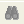
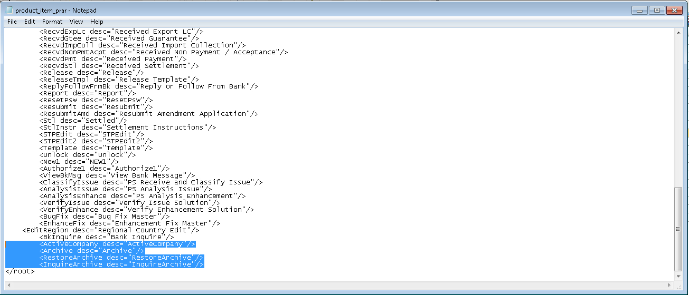

{width="8.625in" height="11.125in"}

+-----------------------------------------------------------------------+
| EXIMBILLS © Trade Finance System                                      |
|                                                                       |
| Customer Enterprise Version 3.3.6                                     |
|                                                                       |
| Archiving and Recovery                                                |
|                                                                       |
| July 2021                                                             |
+-----------------------------------------------------------------------+
| *Copyright 2021 © China Systems Corporation*                          |
|                                                                       |
| *All Rights Reserved*                                                 |
|                                                                       |
| *This document is protected by United States Copyright Law and may    |
| contain Trade Secrets Information which is proprietary to China       |
| Systems Corporation. No part of this document may be copied,          |
| photocopied, reproduced, translated, distributed, or reduced to any   |
| electronic medium or machine-readable form without prior consent in   |
| writing from China Systems Corporation. The information in this       |
| document may be used only under the terms and conditions of separate  |
| China Systems Corporation license agreements.*                        |
|                                                                       |
| *Information is subject to change without notice. China Systems       |
| Corporation makes no warranties, either expressed or implied, with    |
| respect to the software herein described as to its quality,           |
| performance, including, without limitations to, its fitness for any   |
| particular purpose.*                                                  |
|                                                                       |
| *This document may not reflect total system capability at any         |
| subsequent date as a result of development. It is also possible that  |
| it may contain references to facilities not available on your         |
| computer system. Such references should not be construed to mean that |
| these facilities will necessarily be made available on all types of   |
| computer hardware or in all user locations.*                          |
|                                                                       |
| *China Systems Corporation accepts no responsibility or liability for |
| any damages or loss of business or revenue due to the use of this     |
| document.*                                                            |
|                                                                       |
| *All trademarks, registered trademarks and trade names mentioned in   |
| this document are the sole property of their respective holders.*     |
+-----------------------------------------------------------------------+
| ORDER MORE EXIMBILLS DOCUMENTATION                                    |
|                                                                       |
| Additional copies of Documentation are available for purchase from    |
| China Systems Corporation or through your local EXIMBILLS Support     |
| Office.                                                               |
+-----------------------------------------------------------------------+
| {width="0.7604166666666666in"           |
| height="0.75in"}                                                      |
|                                                                       |
| CHINA SYSTEMS CORPORATION                                             |
|                                                                       |
| Comments may be addressed to:                                         |
|                                                                       |
| [[corporatedocs\@chinasystems.com]{.underline}](mailto:corporatedocs@ |
| chinasystems.com)                                                     |
|                                                                       |
| China Systems Corporation Ltd.                                        |
|                                                                       |
| Corner House, 20 Parliament Street                                    |
|                                                                       |
| Hamilton HM12                                                         |
|                                                                       |
| Bermuda                                                               |
+-----------------------------------------------------------------------+

Table of Contents

[CE Documentation Library 5](#ce-documentation-library)

[CE Documentation Library 6](#ce-documentation-library-1)

[Core System Manuals 6](#core-system-manuals)

[CE Utility Reference Manuals 9](#ce-utility-reference-manuals)

[Installation Guides 9](#installation-guides)

[Introduction 10](#introduction)

[System Overview 11](#system-overview)

[Manual Overview 12](#manual-overview)

[Using the CE Utility 13](#using-the-ce-utility)

[Running the CE Utility 14](#running-the-ce-utility)

[Preparing the CE Utility Files 14](#preparing-the-ce-utility-files)

[Accessing the CE Utility 16](#accessing-the-ce-utility)

[Navigating the CE Utility Interface
19](#navigating-the-ce-utility-interface)

[Generating the XML Parameter Files
31](#generating-the-xml-parameter-files)

[Building a Product 35](#building-a-product)

[Archiving Prerequisites 37](#archiving-prerequisites)

[Archiving / Backup Database Settings
38](#archiving-backup-database-settings)

[Data Source Settings 39](#data-source-settings)

[WebSphere Data Source Settings 39](#websphere-data-source-settings)

[CE Utility Data Source Settings 42](#ce-utility-data-source-settings)

[Log Settings 45](#log-settings)

[Manual Archive Mode 46](#manual-archive-mode)

[Overview 47](#overview)

[Common Parameter Settings 48](#common-parameter-settings)

[Archive Control Component 48](#archive-control-component)

[Archive Product Items 50](#archive-product-items)

[Error Codes 54](#error-codes)

[JSP and JS Settings 56](#jsp-and-js-settings)

[Archive Data Function 57](#archive-data-function)

[Parameter Settings 58](#parameter-settings)

[Transaction Process 63](#transaction-process)

[Restore Archived Data Function 66](#restore-archived-data-function)

[Parameter Settings 67](#parameter-settings-1)

[Transaction Process 71](#transaction-process-1)

[Inquire Archived Data Function 72](#inquire-archived-data-function)

[Parameter Settings 72](#parameter-settings-2)

[Transaction Process 77](#transaction-process-2)

[Auto Archive Mode 79](#auto-archive-mode)

[Overview 80](#overview-1)

[Parameter Settings 81](#parameter-settings-3)

[Transaction Process 88](#transaction-process-3)

[Archiving through STP 90](#archiving-through-stp)

[Overview 91](#overview-2)

[Parameter Settings 92](#parameter-settings-4)

[Transaction Process 98](#transaction-process-4)

[Sample Archiving JSP and JS Files
100](#sample-archiving-jsp-and-js-files)

[IMLC\_ArchiveCriteria.jsp 101](#imlc_archivecriteria.jsp)

[IMLC\_ViewArchive.jsp 104](#imlc_viewarchive.jsp)

[IMLC\_ViewArchive\_Function.JS 121](#imlc_viewarchive_function.js)

[IMLC\_ViewArchive\_Event.JS 122](#imlc_viewarchive_event.js)

[Glossary 124](#glossary)

[Glossary 125](#glossary-1)

CE Documentation Library {#ce-documentation-library .CS-ChapterTitle}
========================

CE Documentation Library {#ce-documentation-library-1 .CS-head1}
========================

The CE Documentation Library lists all available manuals that serve as
references on the use of the Customer Enterprise system. The documents
are categorized into three groups: Core System Manuals, CE Utility
Reference Manuals, and Installation Guides.

Core System Manuals {#core-system-manuals .CS-head2}
===================

The CE core system manuals provide details on the setup and
configuration of various CE parameters, as well as the implementation of
supplementary functionalities supported by the system.

Archiving and Recovery

This manual is a reference to the Archive and Recovery functionality of
the CE system. Discussions include the required parameter settings for
configuring the relevant functions, as well as examples of how this
functionality is used in transaction processes.

Building a Product

This manual is a reference to the process of building a product in CE.
It provides step-by-step procedures on how to create a basic CE module,
transaction function, and product setting; configure parameters; and
attach components to generate a working business product.

Data Objects

This manual serves as a reference for creating and utilizing data
objects in the CE system. The discussions provide details on how to
build data object templates and data object entities, and how to attach
these to the transaction function screen.

Frequently Asked Questions

This document addresses commonly-asked questions on the Customer
Enterprise system. Issues on the browser-side (transaction processing),
CE Utility, Security Module, and database, among others, are addressed
in the discussions.

Interfacing CE with CS Eximbills

This document discusses the process of interfacing CE with the CS
Eximbills (CSX) back office system. Employing the MQ, FTP, and TCP/IP
communication protocols, the interface process using the XML format is
detailed in this document.

Interfacing CE with Eximbills Enterprise

This document discusses the process of interfacing CE with the Eximbills
Enterprise (EE) back office system. Employing the MQ protocol, the
interface process for the transfer of data between CE and EE using the
XML format is detailed in this document.

Log Settings

This manual provides details on CE logs as well as general instructions
on log configuration in CE. This is especially written for the users who
are in charge of maintaining the CE system.

Look and Feel

This manual is a reference guide on designing the CE user interface
(i.e., the look and feel of the system). Divided into two parts, the
manual provides instructions on creating a) the basic L&F style of CE;
and b) the CE L&F style that incorporates widgets.

Multi-Entity

This manual is a reference on implementing the Multi-Entity
functionality of the CE system. Discussions cover the implementation and
application of CE multi-entity.

Multi-Language

This manual discusses the procedures required in setting up the
Multi-Language functionality of CE as it is run by Administrator- and
Operator-type users. Furthermore, the configuration of certain system
and browser elements as well as the setup of related system parameters
is explained in step-by-step procedures.

Reports

This manual is a comprehensive reference guide on the requirements and
processes involved in building business products and functions that
generate online reports and documents.

Security and System Maintenance Functions

This manual is a comprehensive guide on the security and system
maintenance of the CE system. As such, it includes detailed instructions
for company and company function management, and user and user function
management. Maintenance of key functionalities such as authorization
rules, reference numbers, and other services is covered as well. In
addition, this document discusses the security concepts in CE to assist
users assigned with access rights to the CE Security Module.

Standing Data Functions

This document discusses the functions for the CE standing data that are
maintained by operators (e.g., parties, clauses). It includes sections
for each function, starting with a brief description of the function,
followed by the function input when necessary, and the procedure steps.

Supplementary Functions

This manual is a reference for the CE Utility operator user in
configuring parameter, JSP, and transaction function settings to define
special or supplementary CE functionalities such as uploading images;
sending images and forms to the back-office system; and sending
notifications via e-mail, SMS, and widgets.

System Administration Functions

This manual is a reference for the default Super Administrator user of
the CE Utility in the configuration and maintenance of the CE
environment. It discusses in detail user management and parameter
management.

System Reference

This document serves as a quick reference to the following elements that
are used when configuring specific parameters in the CE Utility: global
system parameters, system parameters, components, XML Generator items,
server side system methods, system JS methods, and APIs.

CE Utility Reference Manuals {#ce-utility-reference-manuals .CS-head2}
============================

> The CE Utility Reference set of manuals is a guide on the use of the
> Customer Enterprise Utility Workbench, or simply CE Utility. This
> reference provides details on every function or feature in the CE
> Utility and includes instructions and step-by-step procedures on how
> to operate or use the function in relation to operating and
> maintaining the CE system and processing a business transaction.
>
> A manual is provided for each function group of the CE Utility:

-   *CE Utility Reference: User Manager Functions*, for the functions
    that belong to the User Manage function group of the CE Utility when
    accessed by an Administrator or Operator user

-   *CE Utility Reference: Parameter Manager Functions*, for the
    functions that belong to the Parameter Manage function group of the
    CE Utility when accessed by an Administrator or Operator user

-   *CE Utility Reference: System Functions*, for the functions that
    belong to the System Function group of the CE Utility.

-   *CE Utility Reference: Transaction Functions*, for the functions
    that belong to the Transaction Function group of the CE Utility.

-   *CE Utility Reference: Product Functions*, for the functions that
    belong to the Product Function group of the CE Utility.

-   *CE Utility Reference: Maintenance Functions*, for the functions
    that belong to the Maintenance function group of the CE Utility.

Installation Guides {#installation-guides .CS-head2}
===================

> The CE installation guides are references on the installation and
> setup processes of the CE system on different application servers and
> databases.

**Installation Guide WAS 9 - Oracle 19c**

This is a reference for installing the CE system on WebSphere
Application Server Version 9.0.5.6, with an Oracle 19c database. This
includes detailed instructions on configuring the components that are
required to successfully run CE.

Introduction {#introduction .CS-ChapterTitle}
============

-   System Overview

-   Manual Overview

System Overview {#system-overview .CS-head1}
===============

Transactions that are old, completed, or canceled consume much disk
space that is better used to store future records. Moreover, this slows
down transaction processes. While these types of records can simply be
deleted, there is no way to retrieve them for inquiry or any subsequent
process.

The Archiving and Recovery functionality of CE addresses these setbacks.
Archiving is the process of transferring transaction records from the
Transaction Database to the Backup Database. Recovery, on the other
hand, is the process of retrieving archived records from the Backup
Database. Recovered records may be used for other operations or inquiry,
depending on the bank's requirements.

Archived data include master file transaction data and the associated
data such as documents, images, GAPI, e-mails, and forms.

Run by bank operators, the Archiving functions in CE can only be created
for transaction modules. These functions are Archive Data, Inquire
Archived Data, and Restore Archived Data.

There are two modes of archiving:

-   Manual Archiving, in which records are manually archived per module
    according to a set of defined criteria. In addition, records
    received via STP can also be archived through this mode.

-   Auto Archiving, in which records are automatically archived by batch
    according to a set of defined criteria. This is also called Batch
    Archiving.

Creating Archiving functions requires specific installation, database,
and parameter settings.

Manual Overview {#manual-overview .CS-head1}
===============

> **[Purpose]{.underline}**
>
> This manual is a reference to the Archive and Recovery functionality
> of the CE system. Discussions include the required parameter settings
> for configuring the relevant functions, as well as examples on how
> this functionality is used in transaction processes.
>
> The archiving functions discussed in this document are manual
> Archiving functions (Archive Data, Restore Archived Data, and Inquire
> Archived Data), Batch Archive function, and STP Archive function.
>
> **[Audience]{.underline}**
>
> This document is written specifically for, but not limited to, the
> following users:

-   Consultants tasked to implement the Archive and Recovery functions
    in a business module. These users must have sufficient knowledge of
    running CE Utility functions, building a product, and installing the
    CE system.

-   Bank or browser-side users in charge of processing, managing, and
    maintaining transaction records.

> **[Prerequisites]{.underline}**
>
> Sufficient knowledge of building business products is required.
> Recommended titles before reading this manual are as follows:

-   *CE Building a Product*

-   *CE Installation Guide*

-   *CE System Administration Functions*

-   *CE Utility References*

> {width="0.3333333333333333in"
> height="0.3229166666666667in"}**NOTE:** Some features discussed in
> this manual have been tested and documented based on an older system
> version. Unless otherwise specified, the overall functionality is the
> same when recreated in the current version.

Using the CE Utility {#using-the-ce-utility .CS-ChapterTitle}
====================

-   Running the CE Utility

-   Generating the XML Parameters

-   BUILDING A PRODUCT

Running the CE Utility {#running-the-ce-utility .CS-head1}
======================

The Customer Enterprise Utility Workbench, or CE Utility, is the main
tool for building parameters in CE.

Preparing the CE Utility Files {#preparing-the-ce-utility-files .CS-head2}
==============================

> Along with the installation files, the CE Utility folder is provided
> with every CE system release. Prior to using the CE Utility, do the
> following:

i.  Copy the CE Utility folder to the local drive.

ii. Define the required environment variables.

iii. Map the CE directories (e.g., CEWeb.war and CE\_PARA) to the
    > network drive.

  --------------------------------------------------------------
  {width="4.84375in" height="3.3125in"}
  --------------------------------------------------------------

***Figure 2.*** ***1 CE Utility Folder***

> {width="0.3333333333333333in"
> height="0.3229166666666667in"}**NOTE: **

i.  The default drives defined in the GEN\_XML\_ROOTPATH and
    GEN\_WEB\_ROOTPATH system parameters are O:\\ and P:\\ respectively.
    These drives, if currently not existing, may be created through a
    batch file. While O:\\ and P:\\are the default drives for CE, these
    may be set to any other preferred drive available in the network.

ii. To enable users to use the CE Utility on their own local machines as
    clients connecting to the CE server: 1) Install the Java Development
    Kit (JDK) program; 2) Copy the CE Utility folder; 3) Create the
    JAVA\_HOME environment variable, which must point to this directory:
    \[Java Home\]\\\[Installed JDK\].

iii. For more information on setting up the CE environment, refer to the
    CE installation guides*.*

iv. For information on the CE Utility functions, refer to the *CE
    Utility Reference* manuals.

+-----------------------------------------------------------------------+
| **Batch File for Creating the CE Drives**                             |
|                                                                       |
| The batch file for creating drives contains the following commands:   |
|                                                                       |
| > subst O: /d                                                         |
| >                                                                     |
| > subst P: /d                                                         |
| >                                                                     |
| > subst O: C:\"\\Program                                              |
| > Files\\IBM\\WebSphere\\AppServer\\profiles\\AppSrv01\\installedApps |
| \\DOCS-CEV336Node01Cell\\CE.ear\\CE\_PARA\"                           |
| >                                                                     |
| > subst P: C:\"\\Program                                              |
| > Files\\IBM\\WebSphere\\AppServer\\profiles\\AppSrv01\\installedApps |
| \\DOCS-CEV336Node01Cell\\CE.ear\\CEWeb.war\"                          |
|                                                                       |
| {width="4.822916666666667in"                   |
| height="0.7708333333333334in"}                                        |
+-----------------------------------------------------------------------+

Accessing the CE Utility {#accessing-the-ce-utility .CS-head2}
========================

> The main program for running the CE Utility is the CEUtility.bat file,
> which is found in the CE Utility folder.

  ----------------------------
  **Do the following . . .**
  ----------------------------

+-----------------------+-----------------------+-----------------------+
| 1.  Run the CEUtility |                       | {width="3.5in"      |
|     access the CE     |                       | height="2.38541666666 |
|     Utility.          |                       | 66665in"}             |
|                       |                       |                       |
| **[NOTE]{.underline}* |                       |                       |
| *:                    |                       |                       |
|                       |                       |                       |
| A shortcut for the    |                       |                       |
| CEUtility batch file  |                       |                       |
| can be created on the |                       |                       |
| desktop for easy      |                       |                       |
| access.               |                       |                       |
+-----------------------+-----------------------+-----------------------+
|                       |                       |                       |
+-----------------------+-----------------------+-----------------------+
| 2.  The logon window  |                       | {width="3.5in"      |
|     is displayed.     |                       | height="2.34375in"}   |
|                       |                       |                       |
| > To define the       |                       |                       |
| > database            |                       |                       |
| > information, click  |                       |                       |
| > on the Profile      |                       |                       |
| > button.             |                       |                       |
+-----------------------+-----------------------+-----------------------+
|                       |                       |                       |
+-----------------------+-----------------------+-----------------------+
| 3.  In the Database   |                       | {width="3.5in"      |
|     dialog box that   |                       | height="2.47916666666 |
|     is displayed,     |                       | 66665in"}             |
|     specify the       |                       |                       |
|     required database |                       |                       |
|     details and click |                       |                       |
|     on the Save       |                       |                       |
|     button.           |                       |                       |
+-----------------------+-----------------------+-----------------------+
|                       |                       |                       |
+-----------------------+-----------------------+-----------------------+
| 4.  A confirmation    |                       | {width="3.5in"      |
|     displayed. Click  |                       | height="2.47916666666 |
|     on the OK button. |                       | 66665in"}             |
+-----------------------+-----------------------+-----------------------+
|                       |                       |                       |
+-----------------------+-----------------------+-----------------------+
| **[NOTE]{.underline}* |                       | {width="3.5in"     |
|                       |                       | height="0.80208333333 |
| This new data source  |                       | 33334in"}             |
| setting is saved in   |                       |                       |
| the UserInfo.xml file |                       |                       |
| in the CE Utility     |                       |                       |
| directory.            |                       |                       |
+-----------------------+-----------------------+-----------------------+
|                       |                       |                       |
+-----------------------+-----------------------+-----------------------+
| 5.  The relevant      |                       | {width="3.01041666 |
|     password may then |                       | 66666665in"           |
|     be specified for  |                       | height="2.01041666666 |
|     logging on the CE |                       | 66665in"}             |
|     Utility.          |                       |                       |
|                       |                       |                       |
| **[NOTE]{.underline}* |                       |                       |
| *:                    |                       |                       |
|                       |                       |                       |
| For information on    |                       |                       |
| defining CE Utility   |                       |                       |
| user profiles, refer  |                       |                       |
| to the *CE System     |                       |                       |
| Administration        |                       |                       |
| Functions* manual.    |                       |                       |
+-----------------------+-----------------------+-----------------------+
|                       |                       |                       |
+-----------------------+-----------------------+-----------------------+
| 6.  The CE Utility    |                       | {width="3.5in"     |
|     displayed.        |                       | height="1.85416666666 |
|                       |                       | 66667in"}             |
+-----------------------+-----------------------+-----------------------+
|                       |                       |                       |
+-----------------------+-----------------------+-----------------------+
| 7.  A function is     |                       | {width="3.5in"     |
|     opening or        |                       | height="1.85416666666 |
|     double-clicking   |                       | 66667in"}             |
|     on the relevant   |                       |                       |
|     function group    |                       |                       |
|     and clicking on   |                       |                       |
|     the function      |                       |                       |
|     name.             |                       |                       |
|                       |                       |                       |
| **[NOTE]{.underline}* |                       |                       |
| *:                    |                       |                       |
|                       |                       |                       |
| A user may only       |                       |                       |
| access and utilize    |                       |                       |
| the functions         |                       |                       |
| assigned to him. For  |                       |                       |
| more details, refer   |                       |                       |
| to the *CE Utility    |                       |                       |
| Reference: User       |                       |                       |
| Manager Functions*    |                       |                       |
| documentation*.*      |                       |                       |
+-----------------------+-----------------------+-----------------------+

> {width="0.3333333333333333in"
> height="0.3229166666666667in"}**NOTE:** It is sometimes necessary to
> assign a new user name and password when the new database is restored
> from a backup file. Restoring the backup file restores the original
> user profiles.
>
> The new user profiles for the CE Utility (as well as the CE Security
> Module) can be defined during the installation process. SQL scripts
> are run to create these profiles. Refer to the CE installation guides
> for more information.

Navigating the CE Utility Interface {#navigating-the-ce-utility-interface .CS-head2}
===================================

> After logging on, the CE Utility window is displayed and parameters
> may then be configured. The functions used for setting up parameters
> may be accessed by clicking on the function name on the Function menu
> or by using the shortcut buttons.
>
> The CE Utility interface also provides ways by which parameters can be
> created, edited, deleted or linked to other operations: menu bar,
> toolbar buttons, and popup menu.

  ---------------------------------------------------------------------------
  {width="4.84375in" height="2.5729166666666665in"}
  ---------------------------------------------------------------------------

***Figure 2.*** ***2 The CE Utility Interface***

> {width="0.3333333333333333in"
> height="0.3229166666666667in"}**NOTE:** A function is only displayed,
> and its corresponding button or menu option enabled, if the user has
> been given the right to access this function. Some options and
> functions are only available to Super Administrator users, while
> others are only accessible to Administrator and Operator users.

####### CE Utility Functions

> The functions that may be accessed for setting up parameters are
> organized together into several function groups. The current available
> function groups and their corresponding functions in the CE Utility
> are as follows:

**User Manager Function Group**

> This function group is comprised of functions used for creating,
> configuring, and exporting Bank-Country group settings; creating new
> users; and configuring data sources. These functions are:

-   Business Unit Config

-   DataSource Manage

-   Import/Export Business Unit

-   User Manage

**Parameter Manage Function Group**

> This function group consists of functions used for maintaining
> system-wide parameters and components. These functions are:

-   AP Server

-   Component Manage

-   Language Configuration

-   System Parameter

-   System Parameters

**System Function Group**

> This function group consists of functions used for maintaining and
> facilitating system-wide tasks, operations, and settings. These
> functions are:

-   Image Type Maintain

-   Output Device

-   Queue Manager

-   STP Setting

-   Time Zone

**Transaction Function Group**

> This function group is comprised of functions used for defining the
> actual business parameters of transaction functions. These facilitate
> the maintenance and processes of the business transaction modules.
> These functions are:

-   Amount/Rate Format

-   Batch Manage

-   Clause

-   DO Get Data

-   Export Setting

-   Form

-   GAPIs Setting

-   Get Data

-   Image Control

-   Message Broker Setting

-   Module & Event

-   Report Template

-   STPs Mapping

-   Sub Tasks

-   SWIFT Config

-   System Maintain

-   Transaction Function

-   Transfer To

-   TSU Mapping

-   Upload Message Setting

-   Web Service Setting

-   Widget Maintain

**Product Function Group**

> This function group consists of functions that are used for creating
> and configuring the products to be accessed and used by the customers
> or end-users. These functions are:

-   Fields Select

-   Inbox

-   Product Authorize

-   Product Authorize Setting

-   Product Catalog

-   Product Function Setting

-   Product Item

**Maintenance Function Group**

> This function group is comprised of functions used for facilitating
> the maintenance of data from CE tables, including fields and error
> settings. These functions are:

-   DB Dictionary

-   Error Handling

-   Error Message Config (CE)

-   Field Conversion

-   Multi Language

-   Page Dictionary

-   XML Generator

####### 

####### Menu Bar

> The options on the menu bar are shortcuts to both the common and
> specific functions and tasks of the system.

  -------------------------------------------------------------------------
  {width="2.25in" height="0.22916666666666666in"}
  -------------------------------------------------------------------------

***Figure 2.*** ***3 Menu Bar***

  ---------- -- -----------------
  **Menu**      **Description**
  ---------- -- -----------------

+-----------------------+-----------------------+-----------------------+
| **File**              |                       | The available options |
|                       |                       | in the File menu are: |
|                       |                       |                       |
|                       |                       | -   New: This is used |
|                       |                       |     for creating a    |
|                       |                       |     new parameter or  |
|                       |                       |     rule.             |
|                       |                       |                       |
|                       |                       | -   Save: This is     |
|                       |                       |     used for saving   |
|                       |                       |     the created or    |
|                       |                       |     modified          |
|                       |                       |     settings.         |
|                       |                       |                       |
|                       |                       | -   Close Function:   |
|                       |                       |     This is used for  |
|                       |                       |     closing the       |
|                       |                       |     current function  |
|                       |                       |     window.           |
|                       |                       |                       |
|                       |                       | -   Connect To: This  |
|                       |                       |     is used for       |
|                       |                       |     connecting to     |
|                       |                       |     another Meta data |
|                       |                       |     source.           |
|                       |                       |                       |
|                       |                       | -   Log Off: This is  |
|                       |                       |     used for logging  |
|                       |                       |     off a user that   |
|                       |                       |     is logged on to   |
|                       |                       |     the system        |
|                       |                       |     without exiting   |
|                       |                       |     the system.       |
|                       |                       |                       |
|                       |                       | -   Exit: This is     |
|                       |                       |     used for closing  |
|                       |                       |     the system window |
|                       |                       |     and exiting the   |
|                       |                       |     system.           |
+-----------------------+-----------------------+-----------------------+
|                       |                       |                       |
+-----------------------+-----------------------+-----------------------+
| **Edit**              |                       | The available options |
|                       |                       | in the Edit menu are: |
|                       |                       |                       |
|                       |                       | -   Add: This is used |
|                       |                       |     for adding a      |
|                       |                       |     setting for the   |
|                       |                       |     selected function |
|                       |                       |     or parameter.     |
|                       |                       |                       |
|                       |                       | -   Delete: This is   |
|                       |                       |     used for deleting |
|                       |                       |     or removing an    |
|                       |                       |     existing setting. |
|                       |                       |                       |
|                       |                       | -   Edit: This is     |
|                       |                       |     used for editing  |
|                       |                       |     or modifying      |
|                       |                       |     existing          |
|                       |                       |     settings.         |
|                       |                       |                       |
|                       |                       | -   Copy: This is     |
|                       |                       |     used for copying  |
|                       |                       |     or duplicating a  |
|                       |                       |     selected setting. |
|                       |                       |                       |
|                       |                       | -   Find: This is     |
|                       |                       |     used for finding  |
|                       |                       |     a specific        |
|                       |                       |     setting.          |
+-----------------------+-----------------------+-----------------------+
|                       |                       |                       |
+-----------------------+-----------------------+-----------------------+
| **Function**          |                       | The available options |
|                       |                       | in the Function menu  |
|                       |                       | are:                  |
|                       |                       |                       |
|                       |                       | -   User Manage,      |
|                       |                       |     which displays    |
|                       |                       |     options for       |
|                       |                       |     running User      |
|                       |                       |     Manager functions |
|                       |                       |                       |
|                       |                       | -   Parameter Manage, |
|                       |                       |     which displays    |
|                       |                       |     options for       |
|                       |                       |     running Parameter |
|                       |                       |     Manager functions |
|                       |                       |                       |
|                       |                       | -   System Function,  |
|                       |                       |     which displays    |
|                       |                       |     options for       |
|                       |                       |     running System    |
|                       |                       |     functions         |
|                       |                       |                       |
|                       |                       | -   Transaction       |
|                       |                       |     Function, which   |
|                       |                       |     displays options  |
|                       |                       |     for running       |
|                       |                       |     Transaction       |
|                       |                       |     functions         |
|                       |                       |                       |
|                       |                       | -   Product Function, |
|                       |                       |     which displays    |
|                       |                       |     options for       |
|                       |                       |     running Product   |
|                       |                       |     functions         |
|                       |                       |                       |
|                       |                       | -   Maintenance,      |
|                       |                       |     which displays    |
|                       |                       |     options for       |
|                       |                       |     running           |
|                       |                       |     Maintenance       |
|                       |                       |     functions         |
+-----------------------+-----------------------+-----------------------+
|                       |                       |                       |
+-----------------------+-----------------------+-----------------------+
| **Tools**             |                       | The available options |
|                       |                       | in the Tools menu     |
|                       |                       | are:                  |
|                       |                       |                       |
|                       |                       | -   Toolbar: When     |
|                       |                       |     this option is    |
|                       |                       |     marked, the       |
|                       |                       |     toolbar is        |
|                       |                       |     displayed on the  |
|                       |                       |     CE Utility        |
|                       |                       |     Workbench window. |
|                       |                       |                       |
|                       |                       | -   Function Toolbar: |
|                       |                       |     When this option  |
|                       |                       |     is marked, the    |
|                       |                       |     function toolbar  |
|                       |                       |     is displayed on   |
|                       |                       |     the CE Utility    |
|                       |                       |     Workbench window. |
|                       |                       |                       |
|                       |                       | -   Set User Profile  |
|                       |                       |     DB Info: This     |
|                       |                       |     option is used by |
|                       |                       |     the Super         |
|                       |                       |     Administrator     |
|                       |                       |     user to change    |
|                       |                       |     the user          |
|                       |                       |     information that  |
|                       |                       |     is to be used by  |
|                       |                       |     the CE Utility    |
|                       |                       |     for connecting to |
|                       |                       |     a database.       |
|                       |                       |                       |
|                       |                       | -   Window Style:     |
|                       |                       |     Selecting this    |
|                       |                       |     option displays a |
|                       |                       |     list of CE        |
|                       |                       |     Utility interface |
|                       |                       |     styles: Microsoft |
|                       |                       |     Style, Unix       |
|                       |                       |     Style, Java       |
|                       |                       |     Style, Classic    |
|                       |                       |     Style, and Metal  |
|                       |                       |     Style. The        |
|                       |                       |     preferred style   |
|                       |                       |     may be marked     |
|                       |                       |     accordingly.      |
+-----------------------+-----------------------+-----------------------+
|                       |                       |                       |
+-----------------------+-----------------------+-----------------------+
| **Help**              |                       | The available options |
|                       |                       | in the Help menu are: |
|                       |                       |                       |
|                       |                       | -   Help Topics: This |
|                       |                       |     is *currently not |
|                       |                       |     used*.            |
|                       |                       |                       |
|                       |                       | -   Content Help:     |
|                       |                       |     This is           |
|                       |                       |     *currently not    |
|                       |                       |     used.*            |
|                       |                       |                       |
|                       |                       | -   About Customer    |
|                       |                       |     Enterprise:       |
|                       |                       |     Selecting this    |
|                       |                       |     option displays   |
|                       |                       |     the About         |
|                       |                       |     Customer          |
|                       |                       |     Enterprise        |
|                       |                       |     window, which     |
|                       |                       |     indicates the     |
|                       |                       |     version           |
|                       |                       |     information of    |
|                       |                       |     CE.               |
+-----------------------+-----------------------+-----------------------+

####### Toolbar Buttons

> There are two kinds of toolbars in the CE Utility: the basic toolbar
> and the function toolbar.
>
> **Basic Toolbar**
>
> The following standard buttons are available on the Basic Toolbar of
> the CE Utility window. These are used for performing the basic and
> common tasks of the system.

  ---------------------------------------------------------------
  {width="3.65625in" height="0.3125in"}
  ---------------------------------------------------------------

***Figure 2.*** ***4 Basic Toolbar Buttons***

  ------------ -- -----------------
  **Button**      **Description**
  ------------ -- -----------------

  -------------------------------------------------------------------------------------------- -- ------------------------------------------------------------------------------------
  {width="0.25in" height="0.25in"} **New**                                This button is used for creating a new parameter or rule.
                                                                                                  
  {width="0.25in" height="0.25in"} **Add**                                This button is used for adding a setting for the selected function or parameter.
                                                                                                  
  {width="0.25in" height="0.25in"} **Save**                               This button is used for storing created or modified settings.
                                                                                                  
  {width="0.25in" height="0.25in"} **Edit**                               This button is used for editing or modifying existing settings.
                                                                                                  
  {width="0.25in" height="0.25in"} **Copy**                               This button is used for copying or duplicating a selected setting.
                                                                                                  
  {width="0.25in" height="0.25in"} **Delete**                             This button is used for deleting or removing an existing setting.
                                                                                                  
  {width="0.25in" height="0.25in"} **Find**                               This button is used for finding an existing setting.
                                                                                                  
  {width="0.22916666666666666in" height="0.25in"} **Close Function**      This button is used for closing a function window.
                                                                                                  
  {width="0.25in" height="0.25in"} **Help Topic**                         This button is *currently not used.*
                                                                                                  
  {width="0.25in" height="0.25in"} **About Customer Enterprise**          This button is used for displaying the version information of Customer Enterprise.
  -------------------------------------------------------------------------------------------- -- ------------------------------------------------------------------------------------

> **Function Toolbar**
>
> The buttons on this toolbar are shortcuts to some of the functions
> that are in the Function Group lists of the CE Utility window. The
> buttons may also be accessed from the Function menu on the menu bar.

  ----------------------------------------------------------------------------------------------
  {width="4.864583333333333in" height="0.14583333333333334in"}
  ----------------------------------------------------------------------------------------------

***Figure 2.*** ***5 Function Toolbar Buttons***

  ------------ -- -----------------
  **Button**      **Description**
  ------------ -- -----------------

  ------------------------------------------------------------------------------------------------------------------------------- -- ------------------------------------------------------------------------------------------------------------------------------------------------------------
  {width="0.22916666666666666in" height="0.22916666666666666in"} **Set System Parameter**                    This button is used for accessing the System Parameter function. The function may also be accessed from the Parameter Manage group in the Function menu.
                                                                                                                                     
  {width="0.22916666666666666in" height="0.22916666666666666in"} **Manage Component**                        This button is used for accessing the Component Manage function. The function may also be accessed from the Parameter Manage group in the Function menu.
                                                                                                                                     
  {width="0.22916666666666666in" height="0.22916666666666666in"} **Calculation**                             This button is *currently not used.*
                                                                                                                                     
  {width="0.22916666666666666in" height="0.22916666666666666in"} **Module/Event Configuration**              This button is used for accessing the Module & Event function. The function may also be accessed from the Transaction Function group in the Function menu.
                                                                                                                                     
  {width="0.22916666666666666in" height="0.22916666666666666in"} **Transaction Function Configuration**      This button is used for accessing the Transaction Function. The function may also be accessed from the Transaction Function group in the Function menu.
                                                                                                                                     
  {width="0.22916666666666666in" height="0.22916666666666666in"} **Form Set**                                This button is used for accessing the Form function. The function may also be accessed from the Transaction Function group in the Function menu.
                                                                                                                                     
  {width="0.22916666666666666in" height="0.22916666666666666in"} **Accounting Rule Setting**                 This button is *currently not used.*
                                                                                                                                     
  {width="0.22916666666666666in" height="0.22916666666666666in"} **Field Conversion**                        This button is used for accessing the Field Conversion function. The function may also be accessed from the Maintenance group in the Function menu.
                                                                                                                                     
  {width="0.22916666666666666in" height="0.22916666666666666in"}**Get Data**                                 This button is used for accessing the Get Data function. The function may also be accessed from the Transaction Function group in the Function menu.
                                                                                                                                     
  {width="0.22916666666666666in" height="0.22916666666666666in"} **Reference Number**                        This button is *currently not used.*
                                                                                                                                     
  {width="0.22916666666666666in" height="0.22916666666666666in"} **Output Device**                           This button is used for accessing the Output Device function. The function may also be accessed from the System Function group in the Function menu.
                                                                                                                                     
  {width="0.22916666666666666in" height="0.22916666666666666in"} **Function Group**                          This button is *currently not used.*
                                                                                                                                     
  {width="0.22916666666666666in" height="0.22916666666666666in"} **Clause**                                  This button is used for accessing the Clause function. The function may also be accessed from the Transaction Function group in the Function menu.
                                                                                                                                     
  {width="0.22916666666666666in" height="0.22916666666666666in"} **SWIFT**                                   This button is used for accessing the SWIFT Config function. The function may also be accessed from the Transaction Function group in the Function menu.
                                                                                                                                     
  ------------------------------------------------------------------------------------------------------------------------------- -- ------------------------------------------------------------------------------------------------------------------------------------------------------------

  ------------------------------------------------------------------------------------------------------------------------ -- --------------------------------------------------------------------------------------------------------------------------------------------------------------------
  {width="0.22916666666666666in" height="0.22916666666666666in"} **Queue Manager**                    This button is used for accessing the Queue Manager function. The function may also be accessed from the System Function group in the Function menu.
                                                                                                                              
  {width="0.22916666666666666in" height="0.22916666666666666in"} **GAPIs Setting**                    This button is used for accessing the GAPIs Setting function. The function may also be accessed from the Transaction Function group in the Function menu.
                                                                                                                              
  {width="0.22916666666666666in" height="0.22916666666666666in"} **Time Zone**                        This button is used for setting time zone. The function may also be accessed from the System Function group in the Function menu.
                                                                                                                              
  {width="0.22916666666666666in" height="0.22916666666666666in"} **STP Setting**                      This button is used for accessing the STP Setting function. The function may also be accessed from the System Function group in the Function menu.
                                                                                                                              
  {width="0.22916666666666666in" height="0.22916666666666666in"} **Message Broker Setting**           This button is used for accessing the Message Broker Setting function. The function may also be accessed from the Transaction Function group in the Function menu.
                                                                                                                              
  {width="0.22916666666666666in" height="0.22916666666666666in"} **Processing Center**                This button is *currently not used.*
                                                                                                                              
  {width="0.22916666666666666in" height="0.22916666666666666in"} **Amount Format Setting**            This button is used for accessing the Amount/Rate Format function. The function may also be accessed from the Transaction Function group in the Function menu.
                                                                                                                              
  {width="0.22916666666666666in" height="0.22916666666666666in"} **Error Message**                    This button is used for accessing the Error Message Config (CE) function. The function may also be accessed from the Maintenance group in the Function menu.
                                                                                                                              
  {width="0.22916666666666666in" height="0.22916666666666666in"} **Say Total**                        This button is *currently not used.*
                                                                                                                              
  {width="0.22916666666666666in" height="0.22916666666666666in"} **Holiday**                          This button is *currently not used.*
                                                                                                                              
  {width="0.22916666666666666in" height="0.22916666666666666in"} **Report**                           This button is *currently not used.*
                                                                                                                              
  {width="0.22916666666666666in" height="0.22916666666666666in"} **Transfer To**                      This button is used for accessing the Transfer To function. The function may also be accessed from the Transaction Function group in the Function menu.
                                                                                                                              
  {width="0.22916666666666666in" height="0.22916666666666666in"} **Archiving**                        This button is *currently not used.*
                                                                                                                              
  {width="0.22916666666666666in" height="0.22916666666666666in"} **DB Dictionary**                    This button is used for accessing the DB Dictionary function. The function may also be accessed from the Maintenance group in the Function menu.
                                                                                                                              
  {width="0.22916666666666666in" height="0.22916666666666666in"} **Calculation Constant**             This button is *currently not used.*
                                                                                                                              
  {width="0.22916666666666666in" height="0.22916666666666666in"} **XML Generator**                    This button is used for accessing the XML Generator function. The function may also be accessed from the Maintenance group in the Function menu.
                                                                                                                              
  {width="0.22916666666666666in" height="0.22916666666666666in"} **Business Unit**                    This button is used for accessing the Business Unit Config function. The function may also be accessed from the User Manage group in the Function menu.
                                                                                                                              
  {width="0.22916666666666666in" height="0.22916666666666666in"} **User Manager**                     This button is used for accessing the User Manage function. The function may also be accessed from the User Manage group in the Function menu.
                                                                                                                              
  {width="0.22916666666666666in" height="0.22916666666666666in"} **Import/Export Business Unit**      This button is used for accessing the Import/Export Business Unit function. The function may also be accessed from the User Manage group in the Function menu.
                                                                                                                              
  {width="0.22916666666666666in" height="0.22916666666666666in"} **DataSource Manager**               This function is used for accessing the Data Source Manage function. The function may also be accessed from the User Manage group in the Function menu.
  ------------------------------------------------------------------------------------------------------------------------ -- --------------------------------------------------------------------------------------------------------------------------------------------------------------------

####### Popup Menu

> Inside a function or configuration window, options may be provided in
> the form of a popup menu. This menu is displayed by right-clicking on
> the relevant window section or on the relevant information.

  ---------------------------------------------------------------------------
  {width="1.3645833333333333in" height="2.28125in"}
  ---------------------------------------------------------------------------

***Figure 2.*** ***6 Popup Menu***

> In a popup window, the following options may be made available:

-   New

-   Add

-   Save

-   Edit

-   Copy

-   Delete

-   Find

-   Sharable

-   Help

Generating the XML Parameter Files {#generating-the-xml-parameter-files .CS-head1}
==================================

The created parameters and business logic are stored in the database as
Meta data. For this Meta data to be accessible to the application server
(AP) and the web server, it has to be converted to XML -- the format
used for the communication between the client and the server.

The XML files are generated through the XML Generator function of the
Maintenance function group in the CE Utility. In most cases, the XML
Generator function must be run when a parameter is created or modified
using the functions discussed in this document.

  --------------------------------
  **Do the following . .** **.**
  --------------------------------

+-----------------------+-----------------------+-----------------------+
| 1.  Log on CE Utility |                       | {width="3.5in"     |
|     Administrator or  |                       | height="2.34375in"}   |
|     Operator user     |                       |                       |
|     with rights to    |                       |                       |
|     the XML Generator |                       |                       |
|     function.         |                       |                       |
+-----------------------+-----------------------+-----------------------+
|                       |                       |                       |
+-----------------------+-----------------------+-----------------------+
| 2.  The CE Utility    |                       | {width="3.5in"     |
|     displayed.        |                       | height="1.85416666666 |
|                       |                       | 66667in"}             |
| > Run the XML         |                       |                       |
| > Generator function  |                       |                       |
| > from the            |                       |                       |
| > Maintenance         |                       |                       |
| > function group.     |                       |                       |
| >                     |                       |                       |
| > Alternatively,      |                       |                       |
| > click on the XML    |                       |                       |
| > Generator button in |                       |                       |
| > the function        |                       |                       |
| > toolbar.            |                       |                       |
+-----------------------+-----------------------+-----------------------+
|                       |                       |                       |
+-----------------------+-----------------------+-----------------------+
| 3.  The XML Generator |                       | {width="3.5in"     |
|     is displayed.     |                       | height="1.85416666666 |
|                       |                       | 66667in"}             |
| > When there are      |                       |                       |
| > newly defined or    |                       |                       |
| > modified            |                       |                       |
| > parameters, the     |                       |                       |
| > Meta Data to XML    |                       |                       |
| > window is also      |                       |                       |
| > displayed. It lists |                       |                       |
| > these parameters    |                       |                       |
| > for easy selection. |                       |                       |
| > In this case, the   |                       |                       |
| > parameter can be    |                       |                       |
| > selected from this  |                       |                       |
| > window and the      |                       |                       |
| > Apply button        |                       |                       |
| > clicked.            |                       |                       |
| > Afterwards, proceed |                       |                       |
| > to Step 5.          |                       |                       |
| >                     |                       |                       |
| > Alternatively, the  |                       |                       |
| > Meta data or        |                       |                       |
| > parameter can be    |                       |                       |
| > manually selected   |                       |                       |
| > from the main XML   |                       |                       |
| > Generator window.   |                       |                       |
| > In this case, click |                       |                       |
| > on the Close button |                       |                       |
| > of the Meta Data to |                       |                       |
| > XML window and      |                       |                       |
| > proceed to Step 4.  |                       |                       |
+-----------------------+-----------------------+-----------------------+
|                       |                       |                       |
+-----------------------+-----------------------+-----------------------+
| 4.  Double-click on   |                       | {width="3.5in"     |
|     parameter type    |                       | height="1.85416666666 |
|     from the XML      |                       | 66667in"}             |
|     Generator window. |                       |                       |
+-----------------------+-----------------------+-----------------------+
|                       |                       |                       |
+-----------------------+-----------------------+-----------------------+
| 5.  Depending on the  |                       | {width="3.5in"     |
|     parameter type,   |                       | height="1.85416666666 |
|     an XML            |                       | 66667in"}             |
|     configuration     |                       |                       |
|     window may be     |                       |                       |
|     displayed. In     |                       |                       |
|     other cases, the  |                       |                       |
|     process directly  |                       |                       |
|     proceeds to       |                       |                       |
|     Step 6.           |                       |                       |
|                       |                       |                       |
| > If the              |                       |                       |
| > configuration       |                       |                       |
| > window is           |                       |                       |
| > displayed, indicate |                       |                       |
| > the exact or any    |                       |                       |
| > additional setting  |                       |                       |
| > required to         |                       |                       |
| > generate the        |                       |                       |
| > relevant XML files. |                       |                       |
| > When the            |                       |                       |
| > specifications are  |                       |                       |
| > defined click on    |                       |                       |
| > the Save button     |                       |                       |
+-----------------------+-----------------------+-----------------------+
|                       |                       |                       |
+-----------------------+-----------------------+-----------------------+
| 6.  A message is      |                       | {width="3.5in"     |
|     confirming if the |                       | height="1.13541666666 |
|     XML files are to  |                       | 66667in"}             |
|     be generated on   |                       |                       |
|     the system path.  |                       |                       |
+-----------------------+-----------------------+-----------------------+
|                       |                       |                       |
+-----------------------+-----------------------+-----------------------+
| > **[NOTE]{.underline |                       | {width="3.5in"     |
| >                     |                       | height="1.85416666666 |
| > The path of the XML |                       | 66667in"}             |
| > files is defined    |                       |                       |
| > through the         |                       |                       |
| > GEN\_XML\_ROOTPATH  |                       |                       |
| > Utility Workbench   |                       |                       |
| > system parameter.   |                       |                       |
| > This system         |                       |                       |
| > parameter is        |                       |                       |
| > configured through  |                       |                       |
| > the System          |                       |                       |
| > Parameter function  |                       |                       |
| > from the Parameter  |                       |                       |
| > Manage function     |                       |                       |
| > group.              |                       |                       |
+-----------------------+-----------------------+-----------------------+
|                       |                       |                       |
+-----------------------+-----------------------+-----------------------+
| 7.  To save the XML   |                       | {width="3.5in"     |
|     relevant system   |                       | height="2.46875in"}   |
|     path, click on    |                       |                       |
|     the Yes button.   |                       |                       |
|                       |                       |                       |
| > To specify another  |                       |                       |
| > path, click on the  |                       |                       |
| > No button. On the   |                       |                       |
| > Save dialog box     |                       |                       |
| > that is displayed,  |                       |                       |
| > browse for the path |                       |                       |
| > and click on the    |                       |                       |
| > Save button.        |                       |                       |
+-----------------------+-----------------------+-----------------------+
|                       |                       |                       |
+-----------------------+-----------------------+-----------------------+
| 8.  When the relevant |                       | {width="3.5in"     |
|     generated, the    |                       | height="1.85416666666 |
|     system displays a |                       | 66667in"}             |
|     confirmation      |                       |                       |
|     message.          |                       |                       |
|                       |                       |                       |
| > **[NOTE]{.underline |                       |                       |
| }**:                  |                       |                       |
| >                     |                       |                       |
| > To hide the         |                       |                       |
| > information on the  |                       |                       |
| > paths of the        |                       |                       |
| > generated XML       |                       |                       |
| > files, click on the |                       |                       |
| > Hide button.        |                       |                       |
+-----------------------+-----------------------+-----------------------+
|                       |                       |                       |
+-----------------------+-----------------------+-----------------------+
| > **[NOTE]{.underline |                       | {width="3.5in"     |
| >                     |                       | height="3.15625in"}   |
| > Check the indicated |                       |                       |
| > path(s) to see the  |                       |                       |
| > generated XML       |                       |                       |
| > files.              |                       |                       |
+-----------------------+-----------------------+-----------------------+

Building a Product {#building-a-product .CS-head1}
==================

When building a product in the CE Utility, a few prerequisites are
required to be met to make sure that modules or products are built in
accordance with the bank's requirements. One step is the GAP analysis
which involves an evaluation of transaction requirements, based on the
process flow (e.g., fields, clauses, forms, and interfaces). These are
necessary for identifying the fields required for anticipating the
required output. When the analysis has been completed, the project team
can now begin the process of building a product for the bank's
customers.

The following are steps in building a product:

1.  **Access the CE Utility**. To access the CE Utility for building
    parameters, an Operator user must be created by an Administrator
    user. This is set up through the User Manager function in the User
    Manage function group.

2.  **Set up the module and events**. This involves naming the module
    and the projected events that manage the transaction flow within the
    module. This is set up in the Module and Event function in CE
    Utility.

3.  **Set up the transaction tables.** This involves creating the tables
    in the DB Dictionary function in CE Utility. There can be different
    types of tables but only three are mandatory for a CE module:
    master, ledger, and event.

{width="0.3333333333333333in"
height="0.3229166666666667in"}NOTE: It is possible to create tables
directly into the database by running SQL scripts in the database. In
this case, tables can be created before modules and events. It is
recommended, however, to use the DB Dictionary for creating tables.

4.  **Add fields to the transaction table**. Fields must be added to a
    transaction table and field properties defined for the processing
    and storage of data. These can be done through the DB Dictionary
    function in CE Utility.

5.  **Set up the transaction functions**. This involves creating the
    functions that correspond to actual business transaction processes.
    This is done through Transaction Function in the Transaction
    Function group.

6.  **Set up the transaction parameters**. This involves designing the
    transaction screen, defining attribute and catalog settings, and
    attaching these parameters to the transaction function. These can be
    done through Transaction Function in CE Utility.

7.  **Create the product.** The product is the actual functionality
    accessed and run by the end-user. This process of creating a product
    involves setting up the product group, product, and product
    function, and defining product catalog settings.

8.  **Define authorization rules**. Authorization rules are set to
    further define or set limits for authorizing transactions.

9.  **Calculation.** This involves configuring the transaction JS files
    and defining calculation functions using available system methods.
    There are three JS files that have to be configured: the Module Base
    JS file, Event JS file, and Function JS file.

10. **Define the settings for the transaction input.** Certain functions
    may be added to aid in the input of data into the transaction. The
    CE Utility provides options for setting up field conversion rules,
    lookup buttons, customer reference numbers, clauses, dropdown lists,
    and data objects for this purpose.

11. **Define the settings for the transaction output.** Some business
    transactions involve output generation (i.e., Forms). To make this
    option available, certain settings must be configured using the
    functions from the Transaction Function group in CE Utility.

12. **Define the security settings in the CE browser.** The products and
    functions created are assigned to an end-user through the
    browser-side Security and System Maintenance functions.

{width="0.3333333333333333in"
height="0.3229166666666667in"}NOTE: The browser-side security and system
maintenance functions of CE are often collectively called the Security
Module.

13. **Add the Inbox functionality.** Another way of accessing a product
    or a transaction for further processing is through the Customer
    Inbox. This can be set up through the Inbox function in CE Utility.

{width="0.3333333333333333in"
height="0.3229166666666667in"}NOTE: For more information on configuring
different parameters in CE, refer to the *CE Utility Reference*
manuals*.*

 {#section-1 .CS-ChapterTitle}

Archiving Prerequisites {#archiving-prerequisites .CS-ChapterTitle}
=======================

-   Archiving / BACKUP Database Settings

-   Data Source Settings

-   Log Settings

Archiving / Backup Database Settings {#archiving-backup-database-settings .CS-head1}
====================================

Transaction records are archived into a separate Backup Database, i.e.,
the archiving database.

This Backup Database must have the same table structure as the physical
Transaction Database. When the table structures of the Transaction
Database is changed, modify the corresponding table structures in the
Backup Database by manually running the relevant SQL statements in this
archiving database.

> {width="0.3333333333333333in"
> height="0.3229166666666667in"}**NOTE:** The Backup Database settings
> must be configured in the same application server (WAS).

Data Source Settings {#data-source-settings .CS-head1}
====================

For the Archiving and Recovery functionality of the CE system, two data
sources are required: CEB and CEX.

The CEB data source refers to the Backup data source and, thus, points
to the physical archiving database. Used for storing archived data, this
Backup Database has the same table structure as the Transaction
Database.

The CEX data source points to the physical Transaction Database, and is
essentially the same as the CET data source.

The settings for the CEB and CEX data sources are configured in both
WebSphere and CE Utility.

WebSphere Data Source Settings {#websphere-data-source-settings .CS-head2}
==============================

> The required WebSphere settings are as follows.

  ----------------------------
  **Do the following . . .**
  ----------------------------

+-----------------------+-----------------------+-----------------------+
| 1.  Define the JDBC   |                       | {width="3.5in"     |
|                       |                       | height="2.48958333333 |
| -   Name: Oracle JDBC |                       | 33335in"}             |
|     > Driver (XA)     |                       |                       |
|                       |                       |                       |
| -   Implementation    |                       |                       |
|     > class name:     |                       |                       |
|     > oracle.jdbc.xa. |                       |                       |
| client.OracleXADataSo |                       |                       |
| urce                  |                       |                       |
|                       |                       |                       |
| -   Class path:       |                       |                       |
|     > \${ORACLE\_JDBC |                       |                       |
| \_DRIVER\_PATH}/ojdbc |                       |                       |
| 6.jar                 |                       |                       |
|                       |                       |                       |
| **[NOTE:]{.underline} |                       |                       |
| **                    |                       |                       |
|                       |                       |                       |
| **The ojdbc6.jar file |                       |                       |
| is the JDBC driver    |                       |                       |
| for Oracle 12c.**     |                       |                       |
+-----------------------+-----------------------+-----------------------+
|                       |                       |                       |
+-----------------------+-----------------------+-----------------------+
| 2.  Define the CEB    |                       | {width="3.5in"     |
|                       |                       | height="1.875in"}     |
| -   Name: CEB         |                       |                       |
|                       |                       |                       |
| -   JNDI Name: CEB    |                       |                       |
+-----------------------+-----------------------+-----------------------+
|                       |                       |                       |
+-----------------------+-----------------------+-----------------------+
| > This must point to  |                       | {width="3.5in"     |
| > (e.g., CEBK).       |                       | height="1.51041666666 |
| >                     |                       | 66667in"}             |
| > Assign CETRX for:   |                       |                       |
|                       |                       | {width="3.5in"     |
|     > alias for XA    |                       | height="1.96875in"}   |
|     > recovery        |                       |                       |
|                       |                       |                       |
| -   Component-managed |                       |                       |
|     > authentication  |                       |                       |
|     > alias           |                       |                       |
|                       |                       |                       |
| -   Container-managed |                       |                       |
|     > authentication  |                       |                       |
|     > alias           |                       |                       |
|                       |                       |                       |
| **[NOTE:]{.underline} |                       |                       |
| **                    |                       |                       |
|                       |                       |                       |
| The CETRX user        |                       |                       |
| created in the Oracle |                       |                       |
| Database is the user  |                       |                       |
| that is to access the |                       |                       |
| Backup Database. If   |                       |                       |
| this is not the same  |                       |                       |
| as the transaction    |                       |                       |
| database user, the    |                       |                       |
| CETRX alias must be   |                       |                       |
| set in the Global     |                       |                       |
| Security tab, JAAS -- |                       |                       |
| J2C Authentication    |                       |                       |
| Data page of the      |                       |                       |
| WebSphere Application |                       |                       |
| Server Administrative |                       |                       |
| Console.              |                       |                       |
+-----------------------+-----------------------+-----------------------+
|                       |                       |                       |
+-----------------------+-----------------------+-----------------------+
| 3.  Define the CEX    |                       | {width="3.5in"     |
|                       |                       | height="1.85416666666 |
| -   Name: CEX         |                       | 66667in"}             |
|                       |                       |                       |
| -   JNDI Name: CEX    |                       |                       |
+-----------------------+-----------------------+-----------------------+
|                       |                       |                       |
+-----------------------+-----------------------+-----------------------+
| > This must point to  |                       | {width="3.5in"     |
| > Database (e.g.,     |                       | height="1.54166666666 |
| > CEDB).              |                       | 66667in"}             |
| >                     |                       |                       |
| > Assign CETRX for:   |                       | {width="3.5in"     |
| -   Authentication    |                       | height="2.01041666666 |
|     > alias for XA    |                       | 66665in"}             |
|     > recovery        |                       |                       |
|                       |                       |                       |
| -   Component-managed |                       |                       |
|     > authentication  |                       |                       |
|     > alias           |                       |                       |
|                       |                       |                       |
| -   Container-managed |                       |                       |
|     > authentication  |                       |                       |
|     > alias           |                       |                       |
|                       |                       |                       |
| **[NOTE:]{.underline} |                       |                       |
| **                    |                       |                       |
|                       |                       |                       |
| i.  **The CETRX user  |                       |                       |
|     is the same as    |                       |                       |
|     the CETRX user    |                       |                       |
|     that is used to   |                       |                       |
|     access the        |                       |                       |
|     transaction       |                       |                       |
|     database**.       |                       |                       |
|                       |                       |                       |
| ii. The CEX data      |                       |                       |
|     source points to  |                       |                       |
|     the physical      |                       |                       |
|     Transaction       |                       |                       |
|     Database, and is  |                       |                       |
|     essentially the   |                       |                       |
|     same as the CET   |                       |                       |
|     data source.      |                       |                       |
+-----------------------+-----------------------+-----------------------+

CE Utility Data Source Settings {#ce-utility-data-source-settings .CS-head2}
===============================

> Log on the CE Utility as a Super Administrator user and configure the
> following data source settings.

  ----------------------------
  **Do the following . . .**
  ----------------------------

+-----------------------+-----------------------+-----------------------+
| 1.  Run the           |                       | {width="3.5in"     |
|     > Manage function |                       | height="1.875in"}     |
|     > from the User   |                       |                       |
|     > Manage group.   |                       |                       |
+-----------------------+-----------------------+-----------------------+
|                       |                       |                       |
+-----------------------+-----------------------+-----------------------+
| 2.  Check the         |                       | {width="3.5in"     |
|     > Transaction     |                       | height="1.86458333333 |
|     > Data Source     |                       | 33333in"}             |
|     > Manager tab of  |                       |                       |
|     > the DataSource  |                       |                       |
|     > Manage function |                       |                       |
|     > window.         |                       |                       |
+-----------------------+-----------------------+-----------------------+
|                       |                       |                       |
+-----------------------+-----------------------+-----------------------+
| 3.  Modify or create  |                       | {width="3.5in"     |
|     > source.         |                       | height="3.875in"}     |
|                       |                       |                       |
| > This data source    |                       |                       |
| > must point to the   |                       |                       |
| > Transaction         |                       |                       |
| > Database, and       |                       |                       |
| > reference the CEX   |                       |                       |
| > JNDI setting and    |                       |                       |
| > CETRX user profile. |                       |                       |
| >                     |                       |                       |
| > Make sure to select |                       |                       |
| > Archiving as the    |                       |                       |
| > database type.      |                       |                       |
+-----------------------+-----------------------+-----------------------+
|                       |                       |                       |
+-----------------------+-----------------------+-----------------------+
| 4.  Modify or create  |                       | {width="3.5in"     |
|     > source.         |                       | height="3.89583333333 |
|                       |                       | 33335in"}             |
| > This data source    |                       |                       |
| > must point to the   |                       |                       |
| > Backup Database,    |                       |                       |
| > and reference the   |                       |                       |
| > CEB JNDI setting    |                       |                       |
| > and CETRX user      |                       |                       |
| > profile.            |                       |                       |
| >                     |                       |                       |
| > Make sure to select |                       |                       |
| > Backup as the       |                       |                       |
| > database type.      |                       |                       |
|                       |                       |                       |
| **[NOTE:]{.underline} |                       |                       |
| **                    |                       |                       |
|                       |                       |                       |
| CETRX is the CE       |                       |                       |
| Transaction Database  |                       |                       |
| user that is to       |                       |                       |
| access the Backup     |                       |                       |
| Database.             |                       |                       |
+-----------------------+-----------------------+-----------------------+
|                       |                       |                       |
+-----------------------+-----------------------+-----------------------+
| **[XML                |                       | {width="3.5in"     |
| ne}**                 |                       | height="1.875in"}     |
|                       |                       |                       |
| Log on as an          |                       |                       |
| Administrator or      |                       |                       |
| Operator user and run |                       |                       |
| the XML Generator     |                       |                       |
| function.             |                       |                       |
|                       |                       |                       |
| Generate the XML file |                       |                       |
| for the Data Source   |                       |                       |
| Manager parameter.    |                       |                       |
+-----------------------+-----------------------+-----------------------+
|                       |                       |                       |
+-----------------------+-----------------------+-----------------------+
| The updated XML files |                       | {width="3.5in"     |
| path:                 |                       | height="1.51041666666 |
|                       |                       | 66667in"}             |
| \[Parameter           |                       |                       |
| Drive\]\\CE\_SYS\\SYS |                       |                       |
| T                     |                       |                       |
|                       |                       |                       |
| The updated           |                       |                       |
| ee\_dsmgr.xml file    |                       |                       |
| contains details on   |                       |                       |
| the bank groups which |                       |                       |
| data sources have     |                       |                       |
| been set.             |                       |                       |
+-----------------------+-----------------------+-----------------------+

 {#section-2 .CS-head1}

Log Settings {#log-settings .CS-head1}
============

Configure the settings for the Archive logs through this file:

\[CE Parameter Folder\]\\CE\_SYS\\CE\_Log\_Config.xml

**[EXAMPLE:]{.underline}**

Archive Log configuration settings:

{width="5.989583333333333in"
height="1.84375in"}

For detailed information on log configuration, refer to the *CE Log
Settings* documentation.

Manual Archive Mode {#manual-archive-mode .CS-ChapterTitle}
===================

-   Overview

-   COMMON pARAMETER Settings

-   ARCHIVE DATA FUNCTION

-   Restore Archived Data Function

-   Inquire Archived Data function

Overview {#overview .CS-head1}
========

With the Manual Archive mode, the archiving process is performed by
module. The archiving functions are grouped and accessed under a
particular transaction module. Moreover, only the records that satisfy
the defined set of criteria can be accessed and processed under an
Archive function.

The Manual Archive functions that may be created under a business
transaction module are as follows:

-   Archiving Data

-   Inquire Archived Data

-   Restore Archived Data

Common Parameter Settings {#common-parameter-settings .CS-head1}
=========================

Configuring manual Archiving functions involves common prerequisite
parameters.

Archive Control Component {#archive-control-component .CS-head2}
=========================

Trx Manager Archive, a Control component, is used for 2 manual Archiving
functions: Archive Data and Restore Archived Data.

Log on the CE Utility as an Operator user and define the following
settings.

  ------------------------
  Do the following . . .
  ------------------------

+-----------------------+-----------------------+-----------------------+
| 1.  Run the Component |                       | {width="3.5in"     |
|     > from the        |                       | height="1.86458333333 |
|     > Parameter       |                       | 33333in"}             |
|     > Manage function |                       |                       |
|     > group.          |                       |                       |
+-----------------------+-----------------------+-----------------------+
|                       |                       |                       |
+-----------------------+-----------------------+-----------------------+
| 2.  Access the        |                       | {width="3.5in"     |
|     > component type. |                       | height="1.86458333333 |
|                       |                       | 33333in"}             |
+-----------------------+-----------------------+-----------------------+
|                       |                       |                       |
+-----------------------+-----------------------+-----------------------+
| 3.  Check or add the  |                       | {width="3.5in"     |
|     > Archive Control |                       | height="2.57291666666 |
|     > component:      |                       | 66665in"}             |
|                       |                       |                       |
| -   Component Name:   |                       |                       |
|     > Trx Manager     |                       |                       |
|     > Archive         |                       |                       |
|                       |                       |                       |
| -   Component         |                       |                       |
|     > Description:    |                       |                       |
|     > Trx Manager     |                       |                       |
|     > Archive         |                       |                       |
|                       |                       |                       |
| -   Class Name:       |                       |                       |
|     > TrxManagerArchi |                       |                       |
| ve                    |                       |                       |
|                       |                       |                       |
| -   Business Type:    |                       |                       |
|     > Delete Master   |                       |                       |
|     > Mgr             |                       |                       |
+-----------------------+-----------------------+-----------------------+

Archive Product Items {#archive-product-items .CS-head2}
=====================

Specific Archive product items are required to associate a manual
Archiving function to the relevant Archiving product.

Add the following product items --

-   Archive

-   RestoreArchive

-   InquireArchive

-- to this file:

\[CE Utility
Directory\]\\ce\_params\\Script\_XML\\product\_item\_prar.xml.

  -------------------------------------------------------------------------------------
  {width="4.854166666666667in" height="2.0833333333333335in"}
  -------------------------------------------------------------------------------------

Figure 4. Product Items for Archiving

Once these product Ids are defined in the XML file, add these in the
Product Item function. Log on the CE Utility as an Operator user:

  ------------------------
  Do the following . . .
  ------------------------

+-----------------------+-----------------------+-----------------------+
| 1.  Run the Product   |                       | {width="3.5in"     |
|     > from the        |                       | height="1.86458333333 |
|     > Product         |                       | 33333in"}             |
|     > Function group. |                       |                       |
+-----------------------+-----------------------+-----------------------+
|                       |                       |                       |
+-----------------------+-----------------------+-----------------------+
| 2.  Add the Archive   |                       | {width="2.75in"    |
|                       |                       | height="4.52083333333 |
| -   Item ID: Archive  |                       | 3333in"}              |
|                       |                       |                       |
| -   Item Name:        |                       |                       |
|     > Archive         |                       |                       |
|                       |                       |                       |
| -   Item Desc:        |                       |                       |
|     > Archive         |                       |                       |
|                       |                       |                       |
| -   Is Group: No      |                       |                       |
|                       |                       |                       |
| -   Position:         |                       |                       |
|     > Transaction     |                       |                       |
|                       |                       |                       |
| -   Item Button:      |                       |                       |
|     > Archive         |                       |                       |
|                       |                       |                       |
| -   Type: Delete      |                       |                       |
+-----------------------+-----------------------+-----------------------+
|                       |                       |                       |
+-----------------------+-----------------------+-----------------------+
| 3.  Add the           |                       | {width="2.75in"    |
|     > item Id:        |                       | height="4.38541666666 |
|                       |                       | 6667in"}              |
| -   Item ID:          |                       |                       |
|     > RestoreArchive  |                       |                       |
|                       |                       |                       |
| -   Item Name:        |                       |                       |
|     > RestoreArchive  |                       |                       |
|                       |                       |                       |
| -   Item Desc:        |                       |                       |
|     > RestoreArchive  |                       |                       |
|                       |                       |                       |
| -   Is Group: No      |                       |                       |
|                       |                       |                       |
| -   Position:         |                       |                       |
|     > Transaction     |                       |                       |
|                       |                       |                       |
| -   Item Button:      |                       |                       |
|     > RestoreArchive  |                       |                       |
|                       |                       |                       |
| -   Type: Delete      |                       |                       |
+-----------------------+-----------------------+-----------------------+
|                       |                       |                       |
+-----------------------+-----------------------+-----------------------+
| 4.  Add the           |                       | {width="2.75in"    |
|     > item Id:        |                       | height="4.44791666666 |
|                       |                       | 6667in"}              |
| -   Item ID:          |                       |                       |
|     > InquireArchive  |                       |                       |
|                       |                       |                       |
| -   Item Name:        |                       |                       |
|     > InquireArchive  |                       |                       |
|                       |                       |                       |
| -   Item Desc:        |                       |                       |
|     > InquireArchive  |                       |                       |
|                       |                       |                       |
| -   Is Group: No      |                       |                       |
|                       |                       |                       |
| -   Position:         |                       |                       |
|     > Transaction     |                       |                       |
|                       |                       |                       |
| -   Item Button:      |                       |                       |
|     > InquireArchive  |                       |                       |
|                       |                       |                       |
| -   Type: Inquire     |                       |                       |
+-----------------------+-----------------------+-----------------------+

Error Codes {#error-codes .CS-head2}
===========

Log on the CE Utility as an Operator user and define the following error
codes for Archiving processes.

  ------------------------
  Do the following . . .
  ------------------------

+-----------------------+-----------------------+-----------------------+
| 1.  Run the Error     |                       | {width="3.5in"     |
|     > function from   |                       | height="1.86458333333 |
|     > the Maintenance |                       | 33333in"}             |
|     > function group. |                       |                       |
+-----------------------+-----------------------+-----------------------+
|                       |                       |                       |
+-----------------------+-----------------------+-----------------------+
| 2.  In the Catalog    |                       | {width="3.48958333 |
|     > Error Handling  |                       | 33333335in"           |
|     > function        |                       | height="1.86458333333 |
|     > window, access  |                       | 33333in"}             |
|     > the System      |                       |                       |
|     > node.           |                       |                       |
+-----------------------+-----------------------+-----------------------+
|                       |                       |                       |
+-----------------------+-----------------------+-----------------------+
| 3.  Check or add      |                       | {width="3.5in"     |
|     > 000464:         |                       | height="3.48958333333 |
|                       |                       | 33335in"}             |
| -   Error Code:       |                       |                       |
|     > 000464          |                       |                       |
|                       |                       |                       |
| -   Error Key: System |                       |                       |
|                       |                       |                       |
| -   Error Level:      |                       |                       |
|     > Error           |                       |                       |
|                       |                       |                       |
| -   Error Messge:     |                       |                       |
|     > \"Archive       |                       |                       |
|     > failure\"       |                       |                       |
+-----------------------+-----------------------+-----------------------+
|                       |                       |                       |
+-----------------------+-----------------------+-----------------------+
| 4.  Check or add      |                       | {width="3.5in"     |
|     > 000465:         |                       | height="3.48958333333 |
|                       |                       | 33335in"}             |
| -   Error Code:       |                       |                       |
|     > 000465          |                       |                       |
|                       |                       |                       |
| -   Error Key: System |                       |                       |
|                       |                       |                       |
| -   Error Level:      |                       |                       |
|     > Error           |                       |                       |
|                       |                       |                       |
| -   Error Messge:     |                       |                       |
|     > \"Exception     |                       |                       |
|     > occur when      |                       |                       |
|     > restoring       |                       |                       |
|     > Archive\"       |                       |                       |
+-----------------------+-----------------------+-----------------------+

JSP and JS Settings {#jsp-and-js-settings .CS-head2}
===================

Modify the JSP and JS settings of the relevant transaction module to
support the Archiving and Recovery functionality.

Examples of such settings are provided in [Appendix: Sample Archiving
JSP and JS Files](#sample-archiving-jsp-and-js-files).

 {#section-3 .CS-head1}

Archive Data Function {#archive-data-function .CS-head1}
=====================

This function is used for archiving records.

{width="0.3333333333333333in"
height="0.3229166666666667in"}NOTE:

i.  Archived records are stored in the Backup Database. An archived
    transaction can be restored through the Restore Archived Data
    function.

ii. Multiple records can be archived at a time by adding the following
    code in the multiCheck function found in the SYS\_MultiCatalog.js
    file:\
    \|\| ITEM\_ID == \"Archive\" \|\| ITEM\_ID == \"RestoreArchive\")

Example:

function multiCheck(){

try {

if (ITEM\_ID == \"Authorize\" \|\| ITEM\_ID == \"Authorise\" **\|\|**
ITEM\_ID == \"Archive\" \|\| ITEM\_ID == \"RestoreArchive\") {

return true;

}

}

catch (e) {

showExcpt(\"SYS\_MultiCatalog\", e);

}

}

 {#section-4 .CS-head2}

Parameter Settings {#parameter-settings .CS-head2}
==================

Log on CE Utility as an Operator user and configure the following
transaction function and product settings.

Transaction Function Settings

  ------------------------
  Do the following . . .
  ------------------------

+-----------------------+-----------------------+-----------------------+
| 1.  Run Transaction   |                       | {width="3.48958333 |
|     > the Transaction |                       | 33333335in"           |
|     > Function group. |                       | height="1.86458333333 |
|                       |                       | 33333in"}             |
+-----------------------+-----------------------+-----------------------+
|                       |                       |                       |
+-----------------------+-----------------------+-----------------------+
| 2.  Access the module |                       | {width="3.5in"    |
|     > group for which |                       | height="1.86458333333 |
|     > the Archive     |                       | 33333in"}             |
|     > Data function   |                       |                       |
|     > is to be        |                       |                       |
|     > created.        |                       |                       |
|                       |                       |                       |
| **[EXAMPLE:]{.underli |                       |                       |
| ne}**                 |                       |                       |
|                       |                       |                       |
| -   Module: Import    |                       |                       |
|     Letters of Credit |                       |                       |
|                       |                       |                       |
| -   Function Group:   |                       |                       |
|     System            |                       |                       |
|     Maintenance.      |                       |                       |
+-----------------------+-----------------------+-----------------------+
|                       |                       |                       |
+-----------------------+-----------------------+-----------------------+
| 3.  Create the        |                       | {width="3.5in"    |
|     > function and    |                       | height="4.90625in"}   |
|     > set its main    |                       |                       |
|     > program to Trx  |                       |                       |
|     > Manager         |                       |                       |
|     > Archive.        |                       |                       |
|                       |                       |                       |
| **[EXAMPLE:]{.underli |                       |                       |
| ne}**                 |                       |                       |
|                       |                       |                       |
| Function: IMLC        |                       |                       |
| Archive Data          |                       |                       |
|                       |                       |                       |
| **[NOTE:]{.underline} |                       |                       |
| **                    |                       |                       |
|                       |                       |                       |
| Unmark the following  |                       |                       |
| flags:                |                       |                       |
|                       |                       |                       |
| -   Check for Lock in |                       |                       |
|     Master            |                       |                       |
|                       |                       |                       |
| -   Hold Master       |                       |                       |
|                       |                       |                       |
| -   Need Lock         |                       |                       |
|                       |                       |                       |
| -   Release           |                       |                       |
+-----------------------+-----------------------+-----------------------+
|                       |                       |                       |
+-----------------------+-----------------------+-----------------------+
| 4.  Define the        |                       | {width="3.5in"    |
|     > Attribute       |                       | height="2.38541666666 |
|     > settings for    |                       | 66665in"}             |
|     > this function.  |                       |                       |
+-----------------------+-----------------------+-----------------------+
|                       |                       |                       |
+-----------------------+-----------------------+-----------------------+
| 5.  Define the        |                       | {width="3.5in"    |
|     > Catalog         |                       | height="1.86458333333 |
|     > settings for    |                       | 33333in"}             |
|     > this function.  |                       |                       |
+-----------------------+-----------------------+-----------------------+
|                       |                       |                       |
+-----------------------+-----------------------+-----------------------+
| **[NOTE:]{.underline} |                       | {width="3.5in"    |
|                       |                       | height="1.875in"}     |
| If this manual        |                       |                       |
| Archive function is   |                       |                       |
| to be used to archive |                       |                       |
| a record that has     |                       |                       |
| been received via     |                       |                       |
| STP, the STP settings |                       |                       |
| must also be          |                       |                       |
| configured through    |                       |                       |
| the STP function      |                       |                       |
| component.            |                       |                       |
|                       |                       |                       |
| For details on STP    |                       |                       |
| Archive functions,    |                       |                       |
| refer to:             |                       |                       |
|                       |                       |                       |
| Chapter Six:          |                       |                       |
| Archiving through STP |                       |                       |
+-----------------------+-----------------------+-----------------------+

Product Settings

  ------------------------
  Do the following . . .
  ------------------------

+-----------------------+-----------------------+-----------------------+
| 1.  Access the        |                       | {width="3.4895833 |
|     > Function        |                       | 333333335in"          |
|     > Setting         |                       | height="1.86458333333 |
|     > function from   |                       | 33333in"}             |
|     > the Product     |                       |                       |
|     > Function group. |                       |                       |
+-----------------------+-----------------------+-----------------------+
|                       |                       |                       |
+-----------------------+-----------------------+-----------------------+
| 2.  Access the        |                       | {width="3.4895833 |
|     > product group   |                       | 333333335in"          |
|     > and product     |                       | height="1.875in"}     |
|     > from the        |                       |                       |
|     > Product         |                       |                       |
|     > Function tab.   |                       |                       |
|                       |                       |                       |
| **[EXAMPLE:]{.underli |                       |                       |
| ne}**                 |                       |                       |
|                       |                       |                       |
| -   Product Group:    |                       |                       |
|     Import            |                       |                       |
|                       |                       |                       |
| -   Product: Import   |                       |                       |
|     Letters of Credit |                       |                       |
+-----------------------+-----------------------+-----------------------+
|                       |                       |                       |
+-----------------------+-----------------------+-----------------------+
| 3.  Select the        |                       | {width="3.5in"    |
|     > function (e.g., |                       | height="3.16666666666 |
|     > IMLC Archive    |                       | 66665in"}             |
|     > Data) and       |                       |                       |
|     > assign these    |                       |                       |
|     > settings:       |                       |                       |
|                       |                       |                       |
| -   Item: Archive     |                       |                       |
|                       |                       |                       |
| -   Item Type: Delete |                       |                       |
+-----------------------+-----------------------+-----------------------+

Transaction Process {#transaction-process .CS-head2}
===================

  ---------
  EXAMPLE
  ---------

+-----------------------+-----------------------+-----------------------+
| IMLC Archive Data     |                       | {width |
|                       |                       | ="3.5in"              |
| 1.  Run the IMLC      |                       | height="1.40625in"}   |
|     > Archive Data    |                       |                       |
|     > function.       |                       |                       |
+-----------------------+-----------------------+-----------------------+
|                       |                       |                       |
+-----------------------+-----------------------+-----------------------+
| 2.  Select one record |                       | {width |
|     > the Archive     |                       | ="3.5in"              |
|     > button.         |                       | height="1.33333333333 |
|                       |                       | 33333in"}             |
| > Check the Archive   |                       |                       |
| > Log: All            |                       |                       |
| > transaction event   |                       |                       |
| > records -- and      |                       |                       |
| > related data        |                       |                       |
| > including images,   |                       |                       |
| > documents, mails,   |                       |                       |
| > GAPI, etc. -- are   |                       |                       |
| > archived into the   |                       |                       |
| > Backup Database and |                       |                       |
| > deleted from the    |                       |                       |
| > original            |                       |                       |
| > Transaction         |                       |                       |
| > Database.           |                       |                       |
+-----------------------+-----------------------+-----------------------+
|                       |                       |                       |
+-----------------------+-----------------------+-----------------------+
| IMLC Inquire Archive  |                       | {width |
|                       |                       | ="3.5in"              |
| 1.  Run the IMLC      |                       | height="1.34375in"}   |
|     > Inquire Archive |                       |                       |
|     > function.       |                       |                       |
|                       |                       |                       |
| > The catalog shows   |                       |                       |
| > the archived        |                       |                       |
| > record. Select this |                       |                       |
| > record and click on |                       |                       |
| > the InquireArchive  |                       |                       |
| > button.             |                       |                       |
+-----------------------+-----------------------+-----------------------+
|                       |                       |                       |
+-----------------------+-----------------------+-----------------------+
| > The documents and   |                       | {width |
| > this record are     |                       | ="3.46875in"          |
| > listed for viewing  |                       | height="2.21875in"}   |
| > (through the        |                       |                       |
| > corresponding View  |                       |                       |
| > buttons).           |                       |                       |
+-----------------------+-----------------------+-----------------------+
|                       |                       |                       |
+-----------------------+-----------------------+-----------------------+
| 2.  Click on the View |                       | {width |
|     > button.         |                       | ="3.46875in"          |
|                       |                       | height="2.11458333333 |
|                       |                       | 33335in"}             |
+-----------------------+-----------------------+-----------------------+
|                       |                       |                       |
+-----------------------+-----------------------+-----------------------+
| > The events of the   |                       | {width |
| > are listed.         |                       | ="3.5in"              |
|                       |                       | height="1.60416666666 |
|                       |                       | 66667in"}             |
+-----------------------+-----------------------+-----------------------+
|                       |                       |                       |
+-----------------------+-----------------------+-----------------------+
| 3.  Select an event   |                       | {width |
|     > event details.  |                       | ="3.4166666666666665i |
|                       |                       | n"                    |
|                       |                       | height="2.10416666666 |
|                       |                       | 66665in"}             |
+-----------------------+-----------------------+-----------------------+

Restore Archived Data Function {#restore-archived-data-function .CS-head1}
==============================

This function is used to retrieve transactions from the Backup Database,
and add these back to the master file.

When the record to be restored already exists in the Transaction
Database, the Restore process may not be performed on this record.

When a record is restored, all related events are also restored in the
corresponding tables.

{width="0.3333333333333333in"
height="0.3229166666666667in"}NOTE:

i.  Multiple records may be restored by adding the following code in the
    multiCheck function found in the SYS\_MultiCatalog.js file:\
    \|\| ITEM\_ID == \"Archive\" \|\| ITEM\_ID == \"RestoreArchive\")

**[EXAMPLE:]{.underline}**

function multiCheck(){

try {

if (ITEM\_ID == \"Authorize\" \|\| ITEM\_ID == \"Authorise\" **\|\|**
ITEM\_ID == \"Archive\" \|\| ITEM\_ID == \"RestoreArchive\") {

return true;

}

}

catch (e) {

showExcpt(\"SYS\_MultiCatalog\", e);

}

}

ii. The system restores multiple records one at a time. After restoring
    the first selected record, the system provides a Continue button to
    enable the user to restore the next selected records.

 {#section-5 .CS-head2}

Parameter Settings {#parameter-settings-1 .CS-head2}
==================

Log on CE Utility as an Operator user and configure the following
transaction function and product settings.

Transaction Function Settings

  ------------------------
  Do the following . . .
  ------------------------

+-----------------------+-----------------------+-----------------------+
| 1.  Run Transaction   |                       | {width="3.5in"    |
|     > the Transaction |                       | height="1.76041666666 |
|     > Function group. |                       | 66667in"}             |
+-----------------------+-----------------------+-----------------------+
|                       |                       |                       |
+-----------------------+-----------------------+-----------------------+
| 2.  Access the module |                       | {width="3.5in"    |
|     > group for which |                       | height="1.76041666666 |
|     > the Restore     |                       | 66667in"}             |
|     > Archived Data   |                       |                       |
|     > function is to  |                       |                       |
|     > be created.     |                       |                       |
|                       |                       |                       |
| **[EXAMPLE:]{.underli |                       |                       |
| ne}**                 |                       |                       |
|                       |                       |                       |
| -   Module: Import    |                       |                       |
|     Letters of Credit |                       |                       |
|                       |                       |                       |
| -   Function Group:   |                       |                       |
|     System            |                       |                       |
|     Maintenance.      |                       |                       |
+-----------------------+-----------------------+-----------------------+
|                       |                       |                       |
+-----------------------+-----------------------+-----------------------+
| 3.  Create the        |                       | {width="3.5in"    |
|     > Archived Data   |                       | height="4.89583333333 |
|     > function and    |                       | 3333in"}              |
|     > set its main    |                       |                       |
|     > program to Trx  |                       |                       |
|     > Manager         |                       |                       |
|     > Archive.        |                       |                       |
|                       |                       |                       |
| **[EXAMPLE:]{.underli |                       |                       |
| ne}**                 |                       |                       |
|                       |                       |                       |
| Function: IMLC        |                       |                       |
| Restore Archive       |                       |                       |
|                       |                       |                       |
| **[NOTE:]{.underline} |                       |                       |
| **                    |                       |                       |
|                       |                       |                       |
| Unmark the following  |                       |                       |
| flags:                |                       |                       |
|                       |                       |                       |
| -   Check for Lock in |                       |                       |
|     Master            |                       |                       |
|                       |                       |                       |
| -   Hold Master       |                       |                       |
|                       |                       |                       |
| -   Need Lock         |                       |                       |
|                       |                       |                       |
| -   Release           |                       |                       |
+-----------------------+-----------------------+-----------------------+
|                       |                       |                       |
+-----------------------+-----------------------+-----------------------+
| 4.  Define the        |                       | {width="3.5in"    |
|     > Catalog         |                       | height="1.76041666666 |
|     > settings for    |                       | 66667in"}             |
|     > this function.  |                       |                       |
+-----------------------+-----------------------+-----------------------+

Product Settings

  ------------------------
  Do the following . . .
  ------------------------

+-----------------------+-----------------------+-----------------------+
| 1.  Access the        |                       | {width="3.5in"    |
|     > Function        |                       | height="1.76041666666 |
|     > Setting         |                       | 66667in"}             |
|     > function from   |                       |                       |
|     > the Product     |                       |                       |
|     > Function group. |                       |                       |
+-----------------------+-----------------------+-----------------------+
|                       |                       |                       |
+-----------------------+-----------------------+-----------------------+
| 2.  Access the        |                       | {width="3.5in"    |
|     > product group   |                       | height="1.76041666666 |
|     > and product     |                       | 66667in"}             |
|     > from the        |                       |                       |
|     > Product         |                       |                       |
|     > Function tab.   |                       |                       |
|                       |                       |                       |
| **[EXAMPLE:]{.underli |                       |                       |
| ne}**                 |                       |                       |
|                       |                       |                       |
| -   Product Group:    |                       |                       |
|     Import            |                       |                       |
|                       |                       |                       |
| -   Product: Import   |                       |                       |
|     Letters of Credit |                       |                       |
+-----------------------+-----------------------+-----------------------+
|                       |                       |                       |
+-----------------------+-----------------------+-----------------------+
| 3.  Select the        |                       | {width="3.5in"    |
|     > Archived Data   |                       | height="3.14583333333 |
|     > function (e.g., |                       | 33335in"}             |
|     > IMLC Restore    |                       |                       |
|     > Archive) and    |                       |                       |
|     > assign these    |                       |                       |
|     > settings:       |                       |                       |
|                       |                       |                       |
| -   Item:             |                       |                       |
|     > RestoreArchive  |                       |                       |
|                       |                       |                       |
| -   Item Type: Delete |                       |                       |
+-----------------------+-----------------------+-----------------------+

Transaction Process {#transaction-process-1 .CS-head2}
===================

+-----------------------------------------------------------------------+
| EXAMPLE                                                               |
|                                                                       |
| 1.  Run the IMLC Restore Archive function.                            |
|                                                                       |
| 2.  Select one record and click on the RestoreArchive button.         |
|                                                                       |
| {width="4.833333333333333in"      |
| height="2.3229166666666665in"}                                        |
|                                                                       |
| 3.  Check the Archive Log: All transaction event records -- and       |
|     related data including images, documents, mails, GAPI, etc. --    |
|     are retrieved from the Backup Database and restored back to the   |
|     Transaction Database.                                             |
|                                                                       |
| 4.  Run the IMLC Inquire Archive function. The restored record is not |
|     listed on the catalog page.                                       |
|                                                                       |
| 5.  Run the IMLC View Import LC function. The restored record, as     |
|     well as its associated data, can be viewed.                       |
+-----------------------------------------------------------------------+

Inquire Archived Data Function {#inquire-archived-data-function .CS-head1}
==============================

The Inquire Archived Data function is used to inquire into records that
are stored in the Archive file.

{width="0.3333333333333333in"
height="0.3229166666666667in"}NOTE: Unlike other inquiry functions, the
Inquire Archived Data function retrieves details from the Backup
Database (i.e., CEB data source) and not from the Transaction Database.

Parameter Settings {#parameter-settings-2 .CS-head2}
==================

Log on CE Utility as an Operator user and configure the following
transaction function and product settings.

Transaction Function Settings

  ------------------------
  Do the following . . .
  ------------------------

+-----------------------+-----------------------+-----------------------+
| 1.  Run Transaction   |                       | {width="3.5in"    |
|     > the Transaction |                       | height="1.76041666666 |
|     > Function group. |                       | 66667in"}             |
+-----------------------+-----------------------+-----------------------+
|                       |                       |                       |
+-----------------------+-----------------------+-----------------------+
| 2.  Access the module |                       | {width="3.5in"    |
|     > group for which |                       | height="1.76041666666 |
|     > the Archive     |                       | 66667in"}             |
|     > Data is to be   |                       |                       |
|     > created.        |                       |                       |
|                       |                       |                       |
| **[EXAMPLE:]{.underli |                       |                       |
| ne}**                 |                       |                       |
|                       |                       |                       |
| -   Module: Import    |                       |                       |
|     Letters of Credit |                       |                       |
|                       |                       |                       |
| -   Function Group:   |                       |                       |
|     System            |                       |                       |
|     Maintenance.      |                       |                       |
+-----------------------+-----------------------+-----------------------+
|                       |                       |                       |
+-----------------------+-----------------------+-----------------------+
| 3.  Create the        |                       | {width="3.5in"    |
|     > Archived Data   |                       | height="4.89583333333 |
|     > function and    |                       | 3333in"}              |
|     > set its main    |                       |                       |
|     > program to Trx  |                       |                       |
|     > Manager Inq.    |                       |                       |
|                       |                       |                       |
| **[EXAMPLE:]{.underli |                       |                       |
| ne}**                 |                       |                       |
|                       |                       |                       |
| Function: IMLC        |                       |                       |
| Inquire Archive       |                       |                       |
+-----------------------+-----------------------+-----------------------+
|                       |                       |                       |
+-----------------------+-----------------------+-----------------------+
| 4.  Attach the        |                       | {width="3.5in"    |
|     > and template    |                       | height="1.76041666666 |
|     > JSP files to    |                       | 66667in"}             |
|     > this function.  |                       |                       |
+-----------------------+-----------------------+-----------------------+
|                       |                       |                       |
+-----------------------+-----------------------+-----------------------+
| 5.  Define the        |                       | {width="3.5in"    |
|     > Attribute       |                       | height="1.76041666666 |
|     > settings for    |                       | 66667in"}             |
|     > this function.  |                       |                       |
+-----------------------+-----------------------+-----------------------+
|                       |                       |                       |
+-----------------------+-----------------------+-----------------------+
| 6.  Define the        |                       | {width="3.5in"    |
|     > Catalog         |                       | height="1.76041666666 |
|     > settings for    |                       | 66667in"}             |
|     > this function.  |                       |                       |
+-----------------------+-----------------------+-----------------------+

Product Settings

  ------------------------
  Do the following . . .
  ------------------------

+-----------------------+-----------------------+-----------------------+
| 1.  Access the        |                       | {width="3.5in"    |
|     > Function        |                       | height="1.76041666666 |
|     > Setting         |                       | 66667in"}             |
|     > function from   |                       |                       |
|     > the Product     |                       |                       |
|     > Function group. |                       |                       |
+-----------------------+-----------------------+-----------------------+
|                       |                       |                       |
+-----------------------+-----------------------+-----------------------+
| 2.  Access the        |                       | {width="3.5in"    |
|     > product group   |                       | height="1.76041666666 |
|     > and product     |                       | 66667in"}             |
|     > from the        |                       |                       |
|     > Product         |                       |                       |
|     > Function tab.   |                       |                       |
|                       |                       |                       |
| **[EXAMPLE:]{.underli |                       |                       |
| ne}**                 |                       |                       |
|                       |                       |                       |
| -   Product Group:    |                       |                       |
|     Import            |                       |                       |
|                       |                       |                       |
| -   Product: Import   |                       |                       |
|     Letters of Credit |                       |                       |
+-----------------------+-----------------------+-----------------------+
|                       |                       |                       |
+-----------------------+-----------------------+-----------------------+
| 3.  Select the        |                       | {width="3.5in"    |
|     > Archived Data   |                       | height="3.14583333333 |
|     > function (e.g., |                       | 33335in"}             |
|     > IMLC Inquire    |                       |                       |
|     > Archive) and    |                       |                       |
|     > assign these    |                       |                       |
|     > settings:       |                       |                       |
|                       |                       |                       |
| -   Item:             |                       |                       |
|     > InquireArchive  |                       |                       |
|                       |                       |                       |
| -   Item Type:        |                       |                       |
|     > Inquire         |                       |                       |
+-----------------------+-----------------------+-----------------------+

Transaction Process {#transaction-process-2 .CS-head2}
===================

  ---------
  EXAMPLE
  ---------

+-----------------------+-----------------------+-----------------------+
| 1.  Through the IMLC  |                       | {width |
|     > function,       |                       | ="3.5in"              |
|     > archive one     |                       | height="1.33333333333 |
|     > record.         |                       | 33333in"}             |
+-----------------------+-----------------------+-----------------------+
|                       |                       |                       |
+-----------------------+-----------------------+-----------------------+
| 2.  Run the IMLC      |                       | {width |
|     > function.       |                       | ="3.5in"              |
|                       |                       | height="1.34375in"}   |
| > The catalog shows   |                       |                       |
| > the archived        |                       |                       |
| > record. Select this |                       |                       |
| > record and click on |                       |                       |
| > the InquireArchive  |                       |                       |
| > button.             |                       |                       |
+-----------------------+-----------------------+-----------------------+
|                       |                       |                       |
+-----------------------+-----------------------+-----------------------+
| > The documents and   |                       | {width |
| > this record are     |                       | ="3.46875in"          |
| > listed for viewing  |                       | height="2.21875in"}   |
| > (through the        |                       |                       |
| > corresponding View  |                       |                       |
| > buttons).           |                       |                       |
+-----------------------+-----------------------+-----------------------+
|                       |                       |                       |
+-----------------------+-----------------------+-----------------------+
| 3.  Click on the View |                       | {width |
|     > button.         |                       | ="3.46875in"          |
|                       |                       | height="2.11458333333 |
|                       |                       | 33335in"}             |
+-----------------------+-----------------------+-----------------------+
|                       |                       |                       |
+-----------------------+-----------------------+-----------------------+
| > The events of the   |                       | {width |
| > are listed.         |                       | ="3.5in"              |
|                       |                       | height="1.60416666666 |
|                       |                       | 66667in"}             |
+-----------------------+-----------------------+-----------------------+
|                       |                       |                       |
+-----------------------+-----------------------+-----------------------+
| 4.  Select an event   |                       | {width |
|     > event details.  |                       | ="3.4166666666666665i |
|                       |                       | n"                    |
|                       |                       | height="2.10416666666 |
|                       |                       | 66665in"}             |
+-----------------------+-----------------------+-----------------------+

Auto Archive Mode {#auto-archive-mode .CS-ChapterTitle}
=================

-   Overview

-   parameter SEttings

-   Transaction Process

Overview {#overview-1 .CS-head1}
========

With the Auto Archive mode (or batch mode), records from the relevant
module that satisfy a defined set of criteria for the module are
automatically archived.

The AutoArchiveData batch function is an example of an Auto Archive
function.

{width="0.3333333333333333in"
height="0.3229166666666667in"}NOTE: Each module has its own Archive
conditions, which are set through the Sub Task function of the CE
Utility. Refer to the succeeding [Parameter
Settings](#parameter-settings-3) section for more details on setting the
archive conditions for each module.

Parameter Settings {#parameter-settings-3 .CS-head1}
==================

One of the tasks under the AutoProcessTaskMgr batch manager, the
AutoArchiveData batch function is used to automatically archive
transaction records from a particular module that satisfy a defined set
of criteria.

The parameter settings for this batch function involve settings in the
Sub Tasks, AP Server, Import/Export Business Unit, and Batch Manage
functions. Log on the CE Utility as an Operator user and configure the
following settings.

  ------------------------
  Do the following . . .
  ------------------------

+-----------------------+-----------------------+-----------------------+
| Sub Tasks             |                       | {wi |
| 1.  Run the Sub Tasks |                       | dth="3.5in"           |
|     > function from   |                       | height="1.84375in"}   |
|     > the Transaction |                       |                       |
|     > Function group. |                       |                       |
+-----------------------+-----------------------+-----------------------+
|                       |                       |                       |
+-----------------------+-----------------------+-----------------------+
| 2.  Access the Auto   |                       | {wi |
|     > subtask type.   |                       | dth="3.5in"           |
|                       |                       | height="1.84375in"}   |
+-----------------------+-----------------------+-----------------------+
|                       |                       |                       |
+-----------------------+-----------------------+-----------------------+
| 3.  Configure the     |                       | {wi |
|     > settings as     |                       | dth="3.47916666666666 |
|     > required, and   |                       | 65in"                 |
|     > make sure to    |                       | height="2.77083333333 |
|     > define the      |                       | 33335in"}             |
|     > following:      |                       |                       |
|                       |                       |                       |
| -   Task Name, Task   |                       |                       |
|     > Description,    |                       |                       |
|     > Task Component: |                       |                       |
|     > AutoArchiveData |                       |                       |
|                       |                       |                       |
| -   Start Schedule    |                       |                       |
|     > Type and        |                       |                       |
|     > related         |                       |                       |
|     > settings        |                       |                       |
|                       |                       |                       |
| **[NOTE:]{.underline} |                       |                       |
| **                    |                       |                       |
|                       |                       |                       |
| i.  **The Month, Week |                       |                       |
|     Day, Day, and     |                       |                       |
|     Hour fields are   |                       |                       |
|     enabled based the |                       |                       |
|     Start Schedule    |                       |                       |
|     Type field        |                       |                       |
|     setting. Define   |                       |                       |
|     the values of     |                       |                       |
|     these fields as   |                       |                       |
|     well as the       |                       |                       |
|     Minute component  |                       |                       |
|     of the archive    |                       |                       |
|     task schedule     |                       |                       |
|     accordingly.      |                       |                       |
|     Refer to the *CE  |                       |                       |
|     Utility           |                       |                       |
|     Reference:        |                       |                       |
|     Transaction       |                       |                       |
|     Functions*        |                       |                       |
|     documentation for |                       |                       |
|     more details on   |                       |                       |
|     these settings.** |                       |                       |
|                       |                       |                       |
| ii. **Marking the     |                       |                       |
|     Start Server flag |                       |                       |
|     allows a user to  |                       |                       |
|     manually start    |                       |                       |
|     the               |                       |                       |
|     AutoArchiveData   |                       |                       |
|     task.**           |                       |                       |
|                       |                       |                       |
| iii. The Timer        |                       |                       |
|     (Hours) field     |                       |                       |
|     pertains to the   |                       |                       |
|     duration within   |                       |                       |
|     which the system  |                       |                       |
|     archives the      |                       |                       |
|     records that meet |                       |                       |
|     the criteria. If  |                       |                       |
|     the records are   |                       |                       |
|     not archived      |                       |                       |
|     completely within |                       |                       |
|     this period, the  |                       |                       |
|     system terminates |                       |                       |
|     the archive       |                       |                       |
|     process.          |                       |                       |
+-----------------------+-----------------------+-----------------------+
|                       |                       |                       |
+-----------------------+-----------------------+-----------------------+
| AP Server             |                       | {width="3.5in"       |
|     > function from   |                       | height="1.95833333333 |
|     > the Parameter   |                       | 33333in"}             |
|     > Manage function |                       |                       |
|     > group.          |                       |                       |
+-----------------------+-----------------------+-----------------------+
|                       |                       |                       |
+-----------------------+-----------------------+-----------------------+
| 2.  Define or modify  |                       | {width="3.5in"       |
|     > Host Name, and  |                       | height="1.94791666666 |
|     > IIOP Port.      |                       | 66667in"}             |
+-----------------------+-----------------------+-----------------------+
|                       |                       |                       |
+-----------------------+-----------------------+-----------------------+
| Import/Export         |                       | {width="3.5in"       |
| 1.  Run the           |                       | height="1.94791666666 |
|     > Import/Export   |                       | 66667in"}             |
|     > Business Unit   |                       |                       |
|     > function from   |                       |                       |
|     > the User        |                       |                       |
|     > Manager         |                       |                       |
|     > function group. |                       |                       |
+-----------------------+-----------------------+-----------------------+
|                       |                       |                       |
+-----------------------+-----------------------+-----------------------+
| 2.  In the            |                       | {width="3.4895833333 |
|     > window, select  |                       | 333335in"             |
|     > the Application |                       | height="1.94791666666 |
|     > Server setting  |                       | 66667in"}             |
|     > and click on    |                       |                       |
|     > the Import      |                       |                       |
|     > button.         |                       |                       |
+-----------------------+-----------------------+-----------------------+
|                       |                       |                       |
+-----------------------+-----------------------+-----------------------+
| Batch Manage          |                       | {wi |
| 1.  Run the Batch     |                       | dth="3.5in"           |
|     > Manage function |                       | height="1.84375in"}   |
|     > from the        |                       |                       |
|     > Transaction     |                       |                       |
|     > Function group. |                       |                       |
+-----------------------+-----------------------+-----------------------+
|                       |                       |                       |
+-----------------------+-----------------------+-----------------------+
| 2.  Create or modify  |                       | {width="3.4895833333 |
| Mgr                   |                       | 333335in"             |
|     > batch manager.  |                       | height="1.94791666666 |
|     > Select the      |                       | 66667in"}             |
|     > correct AP      |                       |                       |
|     > Server Name     |                       |                       |
|     > setting.        |                       |                       |
+-----------------------+-----------------------+-----------------------+
|                       |                       |                       |
+-----------------------+-----------------------+-----------------------+
| 3.  Add               |                       | {wi |
|     > as a subtask of |                       | dth="3.5in"           |
|     > the             |                       | height="1.84375in"}   |
|     > AutoProcessTask |                       |                       |
| Mgr                   |                       |                       |
|     > batch manager.  |                       |                       |
+-----------------------+-----------------------+-----------------------+
|                       |                       |                       |
+-----------------------+-----------------------+-----------------------+
| Sub Tasks             |                       | {wi |
| 1.  Run the Sub Tasks |                       | dth="3.5in"           |
|     > function from   |                       | height="1.84375in"}   |
|     > the Transaction |                       |                       |
|     > Function group. |                       |                       |
|                       |                       |                       |
| > Access the          |                       |                       |
| > Archiving subtask   |                       |                       |
| > type.               |                       |                       |
+-----------------------+-----------------------+-----------------------+
|                       |                       |                       |
+-----------------------+-----------------------+-----------------------+
| 2.  Access the        |                       | {wi |
|     > and define the  |                       | dth="3.5in"           |
|     > following       |                       | height="1.84375in"}   |
|     > settings.       |                       |                       |
+-----------------------+-----------------------+-----------------------+
|                       |                       |                       |
+-----------------------+-----------------------+-----------------------+

-   

+-----------------------+-----------------------+-----------------------+
| -   Fields: Select    |                       | {wi |
|                       |                       | dth="2.98958333333333 |
| > This reference      |                       | 35in"                 |
| > number is used to   |                       | height="0.3125in"}    |
| > identify the        |                       |                       |
| > transaction and all |                       |                       |
| > its associated data |                       |                       |
| > (e.g., images,      |                       |                       |
| > documents).         |                       |                       |
+-----------------------+-----------------------+-----------------------+
|                       |                       |                       |
+-----------------------+-----------------------+-----------------------+
| -   In the text area, |                       | {wi |
|     condition by      |                       | dth="3.48958333333333 |
|     which records     |                       | 35in"                 |
|     from the module   |                       | height="0.1875in"}    |
|     are archived.     |                       |                       |
|                       |                       |                       |
| **[NOTE:]{.underline} |                       |                       |
| **                    |                       |                       |
|                       |                       |                       |
| The SQL keywords --   |                       |                       |
| such as SELECT and    |                       |                       |
| FROM -- must be in    |                       |                       |
| uppercase.            |                       |                       |
+-----------------------+-----------------------+-----------------------+
|                       |                       |                       |
+-----------------------+-----------------------+-----------------------+
| **[XML                |                       | {wi |
| ne}**                 |                       | dth="3.5in"           |
|                       |                       | height="1.84375in"}   |
| Generate the XML file |                       |                       |
| for the Archive       |                       |                       |
| parameter.            |                       |                       |
+-----------------------+-----------------------+-----------------------+
|                       |                       |                       |
+-----------------------+-----------------------+-----------------------+
| Select all modules.   |                       | {width="3.5in"       |
| **                    |                       | height="3.1875in"}    |
|                       |                       |                       |
| Selecting all modules |                       |                       |
| is recommended as the |                       |                       |
| system generates XML  |                       |                       |
| only for the selected |                       |                       |
| modules and deletes   |                       |                       |
| all previously        |                       |                       |
| generated XML for the |                       |                       |
| unselected modules    |                       |                       |
| from the Archive      |                       |                       |
| folder under the      |                       |                       |
| CE\_SYS directory.    |                       |                       |
+-----------------------+-----------------------+-----------------------+
|                       |                       |                       |
+-----------------------+-----------------------+-----------------------+
| The following files   |                       | {width="3.5in"       |
| Drive\]\\CE\_SYS\\ARC |                       | height="2.48958333333 |
| HIVE:                 |                       | 33335in"}             |
|                       |                       |                       |
| -   autoporcess.xml   |                       |                       |
|                       |                       |                       |
| -   module\_\[module  |                       |                       |
|     short name\].xml  |                       |                       |
|                       |                       |                       |
| -   multiPending.xml  |                       |                       |
+-----------------------+-----------------------+-----------------------+

Transaction Process {#transaction-process-3 .CS-head1}
===================

  ----------
  EXAMPLE:
  ----------

+-----------------------+-----------------------+-----------------------+
| 1.  Run the Batch     |                       | {width |
|     > function and    |                       | ="3.4479166666666665i |
|     > display the     |                       | n"                    |
|     > AutoProcessTask |                       | height="1.73958333333 |
| Mgr                   |                       | 33333in"}             |
|     > task manager.   |                       |                       |
|                       |                       |                       |
| > Start the           |                       |                       |
| > AutoArchiveData     |                       |                       |
| > subtask.            |                       |                       |
+-----------------------+-----------------------+-----------------------+
|                       |                       |                       |
+-----------------------+-----------------------+-----------------------+
| 2.  Execute this SQL  |                       | {width |
|     > records meet    |                       | ="3.4166666666666665i |
|     > the archiving   |                       | n"                    |
|     > filter          |                       | height="0.32291666666 |
|     > condition.      |                       | 66667in"}             |
+-----------------------+-----------------------+-----------------------+
|                       |                       |                       |
+-----------------------+-----------------------+-----------------------+
| > Three records are   |                       | {width |
| > to the archiving    |                       | ="3.4791666666666665i |
| > period and          |                       | n"                    |
| > archiving condition |                       | height="1.09375in"}   |
| > specified in the    |                       |                       |
| > parameters. (These  |                       |                       |
| > pertain to the Auto |                       |                       |
| > Process Manage and  |                       |                       |
| > Archiving settings  |                       |                       |
| > defined in the Sub  |                       |                       |
| > Tasks function.)    |                       |                       |
| >                     |                       |                       |
| > Check the Archive   |                       |                       |
| > Log: All            |                       |                       |
| > transaction event   |                       |                       |
| > records -- and      |                       |                       |
| > related data        |                       |                       |
| > including images,   |                       |                       |
| > documents, mails,   |                       |                       |
| > GAPI, etc. -- are   |                       |                       |
| > archived into the   |                       |                       |
| > Backup Database and |                       |                       |
| > deleted from the    |                       |                       |
| > original            |                       |                       |
| > Transaction         |                       |                       |
| > Database.           |                       |                       |
+-----------------------+-----------------------+-----------------------+
|                       |                       |                       |
+-----------------------+-----------------------+-----------------------+
| 3.  Run the IMLC      |                       | {width |
|     > function.       |                       | ="3.4479166666666665i |
|                       |                       | n"                    |
| > The three records,  |                       | height="1.3125in"}    |
| > along with their    |                       |                       |
| > associated data,    |                       |                       |
| > can be accessed     |                       |                       |
| > through this        |                       |                       |
| > function.           |                       |                       |
+-----------------------+-----------------------+-----------------------+

Archiving through STP  {#archiving-through-stp .CS-ChapterTitle}
======================

-   Overview

-   Parameter Settings

-   Transaction Process

Overview {#overview-2 .CS-head1}
========

When a record in the back-office system is archived, the corresponding
record in CE must also be archived.

The back-office system sends the transaction\'s main reference number
and other details to CE. CE, in turn, receives the data through Auto
Process function and archives the relevant record **through the STP
Archive Data function**.

{width="0.3333333333333333in"
height="0.3229166666666667in"}NOTE:

i.  The STP Archive Data and the manual Archive Data utilize the same
    function, which main program is Trx Manager Archive. For this
    function to perform the STP Archive Data process, the STP and
    Attribute transaction component settings are defined.

ii. CE receives the STP message when the InGapiForm message broker is
    started.

Parameter Settings {#parameter-settings-4 .CS-head1}
==================

Defining the STP configurations to archive transactions received via STP
involves the following parameter settings:

-   Extension field

-   STP template and mapping rule

-   STP Archive Data function

Log on the CE Utility as an Operator user and configure the following
settings.

  ------------------------
  Do the following . . .
  ------------------------

+-----------------------+-----------------------+-----------------------+
| Extension Field       |                       | {wi |
| 1.  Run the DB        |                       | dth="3.5in"           |
|     > Dictionary      |                       | height="1.84375in"}   |
|     > function from   |                       |                       |
|     > the Maintenance |                       |                       |
|     > function group. |                       |                       |
+-----------------------+-----------------------+-----------------------+
|                       |                       |                       |
+-----------------------+-----------------------+-----------------------+
| 2.  Access the        |                       | {wi |
|     > the DB          |                       | dth="3.5in"           |
|     > Dictionary      |                       | height="1.84375in"}   |
|     > function        |                       |                       |
|     > window.         |                       |                       |
+-----------------------+-----------------------+-----------------------+
|                       |                       |                       |
+-----------------------+-----------------------+-----------------------+
| 3.  Add an extension  |                       | {wi |
|     > which is to be  |                       | dth="3.5in"           |
|     > used for        |                       | height="2.625in"}     |
|     > storing module  |                       |                       |
|     > details sent    |                       |                       |
|     > from the        |                       |                       |
|     > back-office     |                       |                       |
|     > system:         |                       |                       |
|                       |                       |                       |
| -   Name: Module      |                       |                       |
|                       |                       |                       |
| -   DB Type: VARCHAR  |                       |                       |
|                       |                       |                       |
| -   Length: 4         |                       |                       |
+-----------------------+-----------------------+-----------------------+
|                       |                       |                       |
+-----------------------+-----------------------+-----------------------+
| STP Mapping           |                       | {wi |
| 1.  Run the STP       |                       | dth="3.5in"           |
|     > Mapping         |                       | height="1.84375in"}   |
|     > function from   |                       |                       |
|     > the Transaction |                       |                       |
|     > Function group. |                       |                       |
+-----------------------+-----------------------+-----------------------+
|                       |                       |                       |
+-----------------------+-----------------------+-----------------------+
| 2.  Create the        |                       | {wi |
|     > template.       |                       | dth="3.5in"           |
|                       |                       | height="1.84375in"}   |
| **[EXAMPLE:]{.underli |                       |                       |
| ne}**                 |                       |                       |
|                       |                       |                       |
| Template ID and       |                       |                       |
| Template Description: |                       |                       |
| ARCHIVE               |                       |                       |
+-----------------------+-----------------------+-----------------------+
|                       |                       |                       |
+-----------------------+-----------------------+-----------------------+
| 3.  Add the following |                       | {wi |
|     > which pertain   |                       | dth="3.5in"           |
|     > to field        |                       | height="1.84375in"}   |
|     > details of the  |                       |                       |
|     > transaction     |                       |                       |
|     > from the        |                       |                       |
|     > back-office     |                       |                       |
|     > system:         |                       |                       |
|                       |                       |                       |
| -   Module, which     |                       |                       |
|     > pertains to the |                       |                       |
|     > transaction     |                       |                       |
|     > module          |                       |                       |
|                       |                       |                       |
| -   CEMainRef, which  |                       |                       |
|     > pertains to the |                       |                       |
|     > main reference  |                       |                       |
|     > number of the   |                       |                       |
|     > transaction     |                       |                       |
|                       |                       |                       |
| -   CustId, which     |                       |                       |
|     > refers to the   |                       |                       |
|     > Customer or     |                       |                       |
|     > Company Id [    |                       |                       |
|     > ]{.underline}   |                       |                       |
+-----------------------+-----------------------+-----------------------+
|                       |                       |                       |
+-----------------------+-----------------------+-----------------------+
| 4.  Create an STP     |                       | {wi |
|     > and map the     |                       | dth="3.5in"           |
|     > template tags   |                       | height="1.84375in"}   |
|     > to the relevant |                       |                       |
|     > fields:         |                       |                       |
|                       |                       |                       |
| -   CEMainRef:        |                       |                       |
|     > C\_MAIN\_REF    |                       |                       |
|                       |                       |                       |
| -   CustId:           |                       |                       |
|     > C\_UNIT\_CODE   |                       |                       |
|                       |                       |                       |
| -   Module tag:       |                       |                       |
|     > C\_MODULE       |                       |                       |
+-----------------------+-----------------------+-----------------------+
|                       |                       |                       |
+-----------------------+-----------------------+-----------------------+
| STP Setting           |                       | {wi |
| 1.  Run the STP       |                       | dth="3.5in"           |
|     > Setting         |                       | height="1.84375in"}   |
|     > function from   |                       |                       |
|     > the System      |                       |                       |
|     > Function group. |                       |                       |
+-----------------------+-----------------------+-----------------------+
|                       |                       |                       |
+-----------------------+-----------------------+-----------------------+
| 2.  Access the Assign |                       | {wi |
|     > for the         |                       | dth="3.5in"           |
|     > Incoming        |                       | height="1.84375in"}   |
|     > Message STP     |                       |                       |
|     > type.           |                       |                       |
+-----------------------+-----------------------+-----------------------+
|                       |                       |                       |
+-----------------------+-----------------------+-----------------------+
| 3.  Select the        |                       | {wi |
|     > message type    |                       | dth="3.5in"           |
|     > (i.e., the      |                       | height="1.84375in"}   |
|     > defined STP     |                       |                       |
|     > template).      |                       |                       |
|                       |                       |                       |
| > Assign the function |                       |                       |
| > that is to process  |                       |                       |
| > the STP message     |                       |                       |
| > through the         |                       |                       |
| > stp.setFunc method. |                       |                       |
|                       |                       |                       |
| **[EXAMPLE:]{.underli |                       |                       |
| ne}**                 |                       |                       |
|                       |                       |                       |
| -   Transaction       |                       |                       |
|     function: IMLC    |                       |                       |
|     Archive Data      |                       |                       |
|                       |                       |                       |
| -   Product: Import   |                       |                       |
|     Letters of Credit |                       |                       |
|                       |                       |                       |
| -   Code:             |                       |                       |
|                       |                       |                       |
| > stp.setFunc(\"IMLC  |                       |                       |
| > Archive Data\",     |                       |                       |
| > \"Import Letters of |                       |                       |
| > Credit\")           |                       |                       |
+-----------------------+-----------------------+-----------------------+
|                       |                       |                       |
+-----------------------+-----------------------+-----------------------+
| Transaction Function  |                       | {wi |
| 1.  Run Transaction   |                       | dth="3.5in"           |
|     > Function from   |                       | height="1.84375in"}   |
|     > the Transaction |                       |                       |
|     > Function group. |                       |                       |
+-----------------------+-----------------------+-----------------------+
|                       |                       |                       |
+-----------------------+-----------------------+-----------------------+
| 2.  Access the module |                       | {wi |
|     > group for which |                       | dth="3.5in"           |
|     > the Archive     |                       | height="1.84375in"}   |
|     > Data function   |                       |                       |
|     > is to be        |                       |                       |
|     > created.        |                       |                       |
|                       |                       |                       |
| **[EXAMPLE:]{.underli |                       |                       |
| ne}**                 |                       |                       |
|                       |                       |                       |
| -   Module: Import    |                       |                       |
|     Letters of Credit |                       |                       |
|                       |                       |                       |
| -   Function Group:   |                       |                       |
|     System            |                       |                       |
|     Maintenance.      |                       |                       |
+-----------------------+-----------------------+-----------------------+
|                       |                       |                       |
+-----------------------+-----------------------+-----------------------+
| 3.  Access or create  |                       | {wi |
|     > Data function,  |                       | dth="3.5in"           |
|     > which is used   |                       | height="4.89583333333 |
|     > for archiving   |                       | 3333in"}              |
|     > the received    |                       |                       |
|     > STP message.    |                       |                       |
|                       |                       |                       |
| > For the required    |                       |                       |
| > parameter settings, |                       |                       |
| > refer to Chapter    |                       |                       |
| > Four \> Archive     |                       |                       |
| > Data Function \>    |                       |                       |
| > Parameter Settings. |                       |                       |
| > [ ]{.underline}     |                       |                       |
|                       |                       |                       |
| **[EXAMPLE:]{.underli |                       |                       |
| ne}**                 |                       |                       |
|                       |                       |                       |
| Function: IMLC        |                       |                       |
| Archive Data          |                       |                       |
|                       |                       |                       |
| **[NOTE:]{.underline} |                       |                       |
| **                    |                       |                       |
|                       |                       |                       |
| Only one function is  |                       |                       |
| used for both STP     |                       |                       |
| archiving and manual  |                       |                       |
| archiving processes:  |                       |                       |
| the IMLC Archive Data |                       |                       |
| function, which       |                       |                       |
| utilizes the Trx      |                       |                       |
| Manager Archive main  |                       |                       |
| program.              |                       |                       |
+-----------------------+-----------------------+-----------------------+
|                       |                       |                       |
+-----------------------+-----------------------+-----------------------+
| 4.  Define the STP    |                       | {wi |
|     > this function   |                       | dth="3.5in"           |
|     > through the STP |                       | height="1.84375in"}   |
|     > function        |                       |                       |
|     > component.      |                       |                       |
+-----------------------+-----------------------+-----------------------+
|                       |                       |                       |
+-----------------------+-----------------------+-----------------------+
| **[EXAMPLE]{.underlin |                       | {wi |
|                       |                       | dth="3.47916666666666 |
|                       |                       | 65in"                 |
|                       |                       | height="1.76041666666 |
|                       |                       | 66667in"}             |
+-----------------------+-----------------------+-----------------------+

### 

Transaction Process {#transaction-process-4 .CS-head1}
===================

  ----------
  EXAMPLE:
  ----------

+-----------------------+-----------------------+-----------------------+
| 1.  Send an STP       |                       | {width |
|                       |                       | ="3.4270833333333335i |
|                       |                       | n"                    |
|                       |                       | height="2.69791666666 |
|                       |                       | 66665in"}             |
+-----------------------+-----------------------+-----------------------+
|                       |                       |                       |
+-----------------------+-----------------------+-----------------------+
| 2.  Run the Batch     |                       | {width |
|     > function and    |                       | ="3.4375in"           |
|     > display the     |                       | height="1.75in"}      |
|     > Message Broker  |                       |                       |
|     > task manager.   |                       |                       |
|     > Make sure that  |                       |                       |
|     > the InGapiForm  |                       |                       |
|     > subtask has     |                       |                       |
|     > been started.   |                       |                       |
|                       |                       |                       |
| > Check the STP Log:  |                       |                       |
| > The STP message is  |                       |                       |
| > received            |                       |                       |
| > successfully.       |                       |                       |
| >                     |                       |                       |
| > Check the Archive   |                       |                       |
| > Log: All            |                       |                       |
| > transaction event   |                       |                       |
| > records -- and      |                       |                       |
| > related data        |                       |                       |
| > including images,   |                       |                       |
| > documents, mails,   |                       |                       |
| > GAPI, etc. -- are   |                       |                       |
| > archived into the   |                       |                       |
| > Backup Database and |                       |                       |
| > deleted from the    |                       |                       |
| > original            |                       |                       |
| > Transaction         |                       |                       |
| > Database.           |                       |                       |
+-----------------------+-----------------------+-----------------------+
|                       |                       |                       |
+-----------------------+-----------------------+-----------------------+
| 3.  Run the IMLC      |                       | {width |
|     > function.       |                       | ="3.4375in"           |
|                       |                       | height="1.69791666666 |
| > The record, along   |                       | 66667in"}             |
| > with its associated |                       |                       |
| > data, can be        |                       |                       |
| > accessed through    |                       |                       |
| > this function.      |                       |                       |
+-----------------------+-----------------------+-----------------------+

Sample Archiving JSP and JS Files {#sample-archiving-jsp-and-js-files .CS-ChapterTitle}
=================================

-   IMLC\_ArchiveCriteria.jsp

-   IMLC\_ViewArchive.jsp

-   IMLC\_ViewArchive\_Function.JS

-   IMLC\_ViewArchive\_Event.JS

IMLC\_ArchiveCriteria.jsp {#imlc_archivecriteria.jsp .CS-head1}
=========================

(Start of Code)

\<%\--

/\*\*

\* \$Id: IMLC\_ArchiveCriteria.jsp,v 1.5 2013/12/31 02:41:03 HelenLiu
Exp \$

\*

\* \@module: Import Letters of Credit (IMLC)

\* \@function: Archive

\*/

\--%\>

\<%@ taglib uri = \"/EXIMTAGS\" prefix = \"EXIMTAGS\"%\>

\<table\>

\<tr\>

\<td class=\"FldLabel\"\>Our Reference Number\</td\>

\<td\>\<select name=\"OP1\" id=\"OP1\" class=\"CHAR\_O\"
style=\"width:170px\"\>

\<option value=\"like\"\>Contains\</option\>

\<option value=\"=\"\>Equal to\</option\>

\<option value=\"\<=\"\>Less than or equal to\</option\>

\<option value=\"\>=\"\>More than or equal to\</option\>

\<option value=\"\<\"\>Less than\</option\>

\<option value=\"\>\"\>More than\</option\>

\</select\>\</td\>

\<td\>\<input name=\"OP2\" type=\"text\" class=\"CHAR\_O\" id=\"OP2\"
title=\"Our Reference Number\" size=\"35\" maxlength=\"16\"
style=\"width:250px\"\>\</td\>

\<td\>\<select name=\"OP3\" id=\"OP3\" class=\"CHAR\_O\"\>

\<option value=\"AND\"\>And\</option\>

\<option value=\"OR\"\>Or\</option\>

\</select\>\</td\>

\</tr\>

\<tr\>

\<td class=\"FldLabel\"\>Applicant Name\</td\>

\<td\>\<select name=\"OP4\" id=\"OP4\" class=\"CHAR\_O\"
style=\"width:170px\"\>

\<option value=\"like\"\>Contains\</option\>

\<option value=\"=\"\>Equal to\</option\>

\<option value=\"\<=\"\>Less than or equal to\</option\>

\<option value=\"\>=\"\>More than or equal to\</option\>

\<option value=\"\<\"\>Less than\</option\>

\<option value=\"\>\"\>More than\</option\>

\</select\>\</td\>

\<td\>\<input name=\"OP5\" type=\"text\" class=\"CHAR\_O\" id=\"OP5\"
size=\"35\" maxlength=\"16\" style=\"width:250px\"\>\</td\>

\<td\>\<select name=\"OP6\" id=\"OP6\" class=\"CHAR\_O\"\>

\<option value=\"AND\"\>And\</option\>

\<option value=\"OR\"\>Or\</option\>

\</select\>\</td\>

\</tr\>

\<tr\>

\<td class=\"FldLabel\"\>Beneficiary Name\</td\>

\<td\>\<select name=\"OP7\" id=\"OP7\" class=\"CHAR\_O\"
style=\"width:170px\"\>

\<option value=\"like\"\>Contains\</option\>

\<option value=\"=\"\>Equal to\</option\>

\<option value=\"\<=\"\>Less than or equal to\</option\>

\<option value=\"\>=\"\>More than or equal to\</option\>

\<option value=\"\<\"\>Less than\</option\>

\<option value=\"\>\"\>More than\</option\>

\</select\>\</td\>

\<td\>\<input name=\"OP8\" type=\"text\" class=\"CHAR\_O\" id=\"OP8\"
size=\"35\" maxlength=\"35\" style=\"width:250px\"\>\</td\>

\<td\>\<select name=\"OP9\" id=\"OP9\" class=\"CHAR\_O\"\>

\<option value=\"AND\"\>And\</option\>

\<option value=\"OR\"\>Or\</option\>

\</select\>\</td\>

\</tr\>

\<tr\>

\<td class=\"FldLabel\"\>Create Date\</td\>

\<td\>\<select name=\"OP10\" id=\"OP10\" class=\"CHAR\_O\"
style=\"width:170px\"\>

\<option value=\"like\"\>Contains\</option\>

\<option value=\"=\"\>Equal to\</option\>

\<option value=\"\<=\"\>Less than or equal to\</option\>

\<option value=\"\>=\"\>More than or equal to\</option\>

\<option value=\"\<\"\>Less than\</option\>

\<option value=\"\>\"\>More than\</option\>

\</select\>\</td\>

\<td\>\<input name=\"OP11\" type=\"text\" class=\"DATE\_O\" id=\"OP11\"
size=\"35\" maxlength=\"35\" style=\"width:250px\"\>\</td\>

\<td\>&nbsp;\</td\>

\</tr\>

\</table\>

(End of Code)

IMLC\_ViewArchive.jsp {#imlc_viewarchive.jsp .CS-head1}
=====================

(Start of Code)

\<%\--

/\*\*

\* \$Id: IMLC\_ViewArchive.jsp,v 1.6 2013/12/31 02:45:47 Helen Exp \$

\*

\* \@module: Import Letters of Credit (IMLC)

\* \@function: View Archive

\*/

\--%\>

\<%@ taglib uri = \"/EXIMTAGS\" prefix = \"EXIMTAGS\"%\>

\<%@ taglib uri = \"/CETAGS\" prefix = \"CETAGS\"%\>

\<EXIMTAGS:IncludeFile
filePath=\"../JS/IMLC\_ViewImpLc\_Function.js\"/\>

\<EXIMTAGS:IncludeFile filePath=\"../JS/IMLC\_ViewImpLc\_Event.js\"/\>

\<EXIMTAGS:IncludeFile filePath=\"../JS/IMLC\_BaseFunc.js\"/\>

\<input name=\"CURRNT\_STATUS\" type=\"hidden\" class=\"CHAR\_O\"
id=\"CURRNT\_STATUS\" title=\"Current Status\" value=\"\"\>

\<input name=\"NXT\_STATUS\" type=\"hidden\" class=\"CHAR\_O\"
id=\"NXT\_STATUS\" title=\"Next Status\" value=\"\"\>

\<input name=\"C\_MAIN\_REF\" type=\"hidden\" class=\"CHAR\_O\"
id=\"C\_MAIN\_REF\" title=\"CE Main Reference\" value=\"\"\>

\<input name=\"ACPT\_REJ\" type=\"hidden\" class=\"CHAR\_O\"
id=\"ACPT\_REJ\" title=\"Accept or Reject Application\" value=\"\"\>

\<input name=\"REASON\_FOR\_REJ\" type=\"hidden\" class=\"CHAR\_O\"
id=\"REASON\_FOR\_REJ\" title=\"Reason for Rejection\" value=\"\"\>

\<input name=\"LC\_BALA\" type=\"hidden\" class=\"AMT\_O\"
id=\"LC\_BALA\" title=\"LC Balance\" value=\"\"\>

\<input name=\"BK\_MAIN\_REF\" type=\"hidden\" class=\"CHAR\_O\"
id=\"BK\_MAIN\_REF\" title=\"Bank Main Reference\" value=\"\"\>

\<input name=\"PARENT\_MAIN\_REF\" type=\"hidden\"
class=\"CHAR\_O\"id=\"PARENT\_MAIN\_REF\" title=\"Parent Main
Reference\" value=\"\"\>

\

\<span\>\<a href=\"\#\" id=\"ViewImgLink\"\>Hide Image(s)\</a\>\</span\>

\

\<%@ include file=\"../../../../include/SysViewImage.jsp\" %\>

\</div\>

\</div\>

\

\<table\>

\<tbody\>

\<tr\>

\<td class=\"FldLabel\"\>LC Number\</td\>

\<td\>\<input name=\"LC\_NO\" type=\"text\" class=\"CHAR\_P\"
id=\"LC\_NO\" title=\"LC Number\" size=\"35\" maxlength=\"35\"\>\</td\>

\</tr\>

\<tr\>

\<td class=\"FldLabel\"\>Drawing Ref. No.\</td\>

\<td\>\<input name=\"DRAW\_NO\" type=\"text\" class=\"CHAR\_P\"
id=\"DRAW\_NO\" title=\"Drawing Ref. No.\" size=\"35\"
maxlength=\"35\"\>\</td\>

\</tr\>

\<tr\>

\<td class=\"FldLabel\"\>Amendment No.\</td\>

\<td\>\<input name=\"NO\_OF\_AMD\" type=\"text\" class=\"INT\_P\"
id=\"NO\_OF\_AMD\" title=\"Number of Amendment\" size=\"3\"
maxlength=\"3\"\>\</td\>

\</tr\>

\<tr\>

\<td class=\"FldLabel\"\>Drawing No.\</td\>

\<td\>\<input name=\"NO\_OF\_DRAW\" type=\"text\" class=\"INT\_P\"
id=\"NO\_OF\_DRAW\" title=\"Drawing No.\" size=\"3\"
maxlength=\"3\"\>\</td\>

\</tr\>

\<tr\>

\<td class=\"FldLabel\"\>Date of Application\</td\>

\<td\>\<input name=\"ISSUE\_DT\" type=\"text\" class=\"DATE\_P\"
id=\"ISSUE\_DT\" title=\"Date of Application\" size=\"10\"
maxlength=\"10\"\>\</td\>

\</tr\>

\<tr\>

\<td class=\"FldLabel\"\>Our Ref Number\</td\>

\<td\>\<input name=\"CUST\_NO\" type=\"text\" class=\"CHAR\_P\"
id=\"CUST\_NO\" title=\"Our Ref Number\" size=\"35\"
maxlength=\"35\"\>\</td\>

\</tr\>

\<tr\>

\<td class=\"FldLabel\"\>Type of LC\</td\>

\<td\>\<select name=\"FORM\_OF\_LC\" id=\"FORM\_OF\_LC\"
class=\"CHAR\_P\" title=\"Type of LC\"\>

\<EXIMTAGS:FldConv fldName=\"FORM\_OF\_LC\" smType=\"false\"
emptyValue=\"\" blankOption=\"TRUE\"/\>

\</select\>\</td\>

\</tr\>

\<tr\>

\<td class=\"FldLabel\"\>LC Currency\</td\>

\<td\>\<select name=\"LC\_CCY\" id=\"LC\_CCY\" class=\"CHAR\_P\"
title=\"LC Currency\"\>

\<EXIMTAGS:DropDownElement elementType=\"CCY\"/\>

\<option value=\"\" selected\>PLEASE SELECT\</option\>

\</select\>\</td\>

\</tr\>

\<tr\>

\<td class=\"FldLabel\"\>LC Amount\</td\>

\<td\>\<input name=\"LC\_AMT\" type=\"text\" class=\"AMT\_P\"
id=\"LC\_AMT\" title=\"LC Amount\" size=\"24\" maxlength=\"24\"\>\</td\>

\</tr\>

\<tr\>

\<td class=\"FldLabel\"\>Tolerance - Specification % + / -\</td\>

\<td\>\<select name=\"TOL\_SPEC\" id=\"TOL\_SPEC\" class=\"CHAR\_O\"
title=\"Tolerance - Specification % + / -\"\>

\<EXIMTAGS:FldConv fldName=\"TOL\_SPEC\" smType=\"false\"
emptyValue=\"\" blankOption=\"TRUE\"/\>

\</select\>\</td\>

\</tr\>

\<tr\>

\<td class=\"FldLabel\"\>Positive tolerance\</td\>

\<td\>\<input name=\"POS\_TOL\" type=\"text\" class=\"INT\_P\"
id=\"POS\_TOL\" title=\"Positive tolerance\" size=\"2\"
maxlength=\"2\"\>\</td\>

\</tr\>

\<tr\>

\<td class=\"FldLabel\"\>Negative tolerance\</td\>

\<td\>\<input name=\"NEG\_TOL\" type=\"text\" class=\"INT\_P\"
id=\"NEG\_TOL\" title=\"Negative tolerance\" size=\"2\"
maxlength=\"2\"\>\</td\>

\</tr\>

\<tr\>

\<td class=\"FldLabel\"\>Total Exposure\</td\>

\<td\>\<input name=\"TTL\_EXPOE\" type=\"text\" class=\"AMT\_P\"
id=\"TTL\_EXPOE\" title=\"Total Exposure\" size=\"24\"
maxlength=\"24\"\>\</td\>

\</tr\>

\<tr\>

\<td class=\"FldLabel\"\>Additional Amounts Covered\</td\>

\<td\>\<textarea name=\"ADD\_AMT\_COVR\" cols=\"35\" rows=\"4\"
class=\"CHAR\_\" id=\"ADD\_AMT\_COVR\" title=\"Additional Amounts
Covered\"\>\</textarea\>\</td\>

\</tr\>

\<tr\>

\<td class=\"FldLabel\"\>Available By\</td\>

\<td\>\<select name=\"AVAL\_BY\" id=\"AVAL\_BY\" class=\"CHAR\_M\"
title=\"Available By\"\>

\<EXIMTAGS:FldConv fldName=\"AVAL\_BY\" smType=\"false\" emptyValue=\"\"
blankOption=\"TRUE\"/\>

\</select\>

\<input name=\"MIX\_PAY\_BT\" type=\"button\" id=\"MIX\_PAY\_BT\"
title=\"Mixed Payment Button\" value=\"Mixed Payment\"
onClick=\"ShowDiv()\"\>\</td\>

\</tr\>

\<tr\>

\<td class=\"FldLabel\"\>Tenor Days / Type\</td\>

\<td\>\<input name=\"TENOR\_DAYS\" type=\"text\" class=\"INT\_P\"
id=\"TENOR\_DAYS\" title=\"Tenor Days\" size=\"3\" maxlength=\"3\"\>

\<select name=\"TENOR\_TYPE\" id=\"TENOR\_TYPE\" class=\"CHAR\_P\"
title=\"Tenor Type\"\>

\<EXIMTAGS:FldConv fldName=\"TENOR\_TYPE\" smType=\"false\"
emptyValue=\"\" blankOption=\"TRUE\"/\>

\</select\>

\</td\>

\</tr\>

\<tr\>

\<td class=\"FldLabel\"\>Deferred Payment Terms\</td\>

\<td\>\<textarea name=\"DEF\_PMT\_TERM\" cols=\"35\" rows=\"4\"
class=\"CHAR\_P\" id=\"DEF\_PMT\_TERM\" title=\"Deferred Payment
Terms\"\>\</textarea\>\</td\>

\</tr\>

\<tr\>

\<td class=\"FldLabel\"\>Drafts At\</td\>

\<td\>\<textarea name=\"DRAFTS\_AT\" cols=\"35\" rows=\"3\"
class=\"CHAR\_P\" id=\"textarea2\" title=\"Drafts
At\"\>\</textarea\>\</td\>

\</tr\>

\<tr\>

\<td class=\"FldLabel\"\>Mixed Payment Details\</td\>

\<td\>\<textarea name=\"MIX\_PMT\_DETL\" cols=\"35\" rows=\"4\"
class=\"CHAR\_P\" id=\"MIX\_PMT\_DETL\" title=\"Mixed Payment
Details\"\>\</textarea\>\</td\>

\</tr\>

\<tr\>

\<td class=\"FldLabel\"\>SWIFT Messages\</td\>

\<td\>\<select name=\"SWIFT\_MSG\" id=\"SWIFT\_MSG\" class=\"CHAR\_O\"
title=\"SWIFT Messages\"\>

\<option value=\"\" selected\>PLEASE SELECT\</option\>

\</select\>\</td\>

\</tr\>

\<tr\>

\<td class=\"FldLabel\"\>Advice Type\</td\>

\<td\>\<select name=\"ADV\_TYPE\" id=\"ADV\_TYPE\" class=\"CHAR\_O\"
title=\"Advice Type\"\>

\<option value=\"\" selected\>PLEASE SELECT\</option\>

\</select\>\</td\>

\</tr\>

\</tbody\>

\</table\>

\</div\>

\

\<table\>

\<tbody\>

\<tr\>

\<td colspan=\"2\" class=\"HeadingBg\"\>Beneficiary\</td\>

\</tr\>

\<tr\>

\<td class=\"FldLabel\"\>Name\</td\>

\<td\>\<input name=\"BENE\_NM\" type=\"text\" class=\"CHAR\_P\"
id=\"BENE\_NM\" title=\"Beneficiary Name\" size=\"35\"
maxlength=\"35\"\>

\<input name=\"BENE\_ID\" type=\"hidden\" class=\"CHAR\_O\"
id=\"BENE\_ID\" title=\"Beneficiary ID\" value=\"\"\>\</td\>

\</tr\>

\<tr\>

\<td class=\"FldLabel\"\>Location\</td\>

\<td\>\<input name=\"BENE\_ADD1\" type=\"text\" class=\"CHAR\_P\"
id=\"BENE\_ADD1\" title=\"Beneficiary Location\" size=\"35\"
maxlength=\"35\"\>\</td\>

\</tr\>

\<tr\>

\<td class=\"FldLabel\"\>City\</td\>

\<td\>\<input name=\"BENE\_ADD2\" type=\"text\" class=\"CHAR\_P\"
id=\"BENE\_ADD2\" title=\"Beneficiary City\" size=\"35\"
maxlength=\"35\"\>\</td\>

\</tr\>

\<tr\>

\<td class=\"FldLabel\"\>Country\</td\>

\<td\>\<input name=\"BENE\_ADD3\" type=\"text\" class=\"CHAR\_P\"
id=\"BENE\_ADD3\" title=\"Beneficiary Country\" size=\"35\"
maxlength=\"35\"\>\</td\>

\</tr\>

\<tr\>

\<td colspan=\"2\" class=\"HeadingBg\"\>Applicant\</td\>

\</tr\>

\<tr\>

\<td class=\"FldLabel\"\>Name\</td\>

\<td\>\<input name=\"APPL\_NM\" type=\"text\" class=\"CHAR\_P\"
id=\"APPL\_NM\" title=\"Applicant Name\" size=\"35\" maxlength=\"35\"\>

\<input name=\"APPL\_ID\" type=\"hidden\" class=\"CHAR\_O\"
id=\"APPL\_ID\" title=\"Applicant ID\" value=\"\"\>

\</td\>

\</tr\>

\<tr\>

\<td colspan=\"2\" class=\"HeadingBg\"\>Beneficiary Bank\</td\>

\</tr\>

\<tr\>

\<td class=\"FldLabel\"\>SWIFT Address\</td\>

\<td\>\<input name=\"BENE\_BK\_SW\_ADD\" type=\"text\" class=\"CHAR\_P\"
id=\"BENE\_BK\_SW\_ADD\" title=\"Beneficiary Bank SWIFT Address\"
size=\"11\" maxlength=\"11\"\>\</td\>

\</tr\>

\<tr\>

\<td class=\"FldLabel\"\>Name\</td\>

\<td\>\<input name=\"BENE\_BK\_NM\" type=\"text\" class=\"CHAR\_P\"
id=\"BENE\_BK\_NM\" title=\"Beneficiary Bank Name\" size=\"35\"
maxlength=\"35\"\>

\<!\--\<input name=\"BENE\_BK\_ID\_BT\" type=\"button\"
class=\"CHAR\_P\" id=\"BENE\_BK\_ID\_BT\" title=\"Beneficiary Bank ID
Button\" value=\"\...\"\>\--\>

\<input name=\"BENE\_BK\_ID\" type=\"hidden\" class=\"CHAR\_O\"
id=\"BENE\_BK\_ID\" title=\"Beneficiary Bank ID\" value=\"\"\>\</td\>

\</tr\>

\<tr\>

\<td class=\"FldLabel\"\>Location\</td\>

\<td\>\<input name=\"BENE\_BK\_ADD1\" type=\"text\" class=\"CHAR\_P\"
id=\"BENE\_BK\_ADD1\" title=\"Beneficiary Bank Location\" size=\"35\"
maxlength=\"35\"\>\</td\>

\</tr\>

\<tr\>

\<td class=\"FldLabel\"\>City\</td\>

\<td\>\<input name=\"BENE\_BK\_ADD2\" type=\"text\" class=\"CHAR\_P\"
id=\"BENE\_BK\_ADD2\" title=\"Beneficiary Bank City\" size=\"35\"
maxlength=\"35\"\>\</td\>

\</tr\>

\<tr\>

\<td class=\"FldLabel\"\>Country\</td\>

\<td\>\<input name=\"BENE\_BK\_ADD3\" type=\"text\" class=\"CHAR\_P\"
id=\"BENE\_BK\_ADD3\" title=\"Beneficiary Bank Country\" size=\"35\"
maxlength=\"35\"\>\</td\>

\</tr\>

\<td colspan=\"2\" class=\"HeadingBg\"\>For Account Of\</td\>

\</tr\>\<tr\>

\<td class=\"FldLabel\"\>Name\</td\>

\<td\>\<input name=\"FOR\_AC\_OF\_NM\" type=\"text\" class=\"CHAR\_P\"
id=\"FOR\_AC\_OF\_NM\" title=\"Account Of Name\" size=\"35\"
maxlength=\"35\"\>

\<input name=\"FOR\_AC\_OF\_ID\" type=\"hidden\" class=\"CHAR\_O\"
id=\"FOR\_AC\_OF\_ID\" title=\"Account Of ID\" value=\"\"\>\</td\>

\</tr\>

\<tr\>

\<td class=\"FldLabel\"\>Location\</td\>

\<td\>\<input name=\"FOR\_AC\_OF\_ADD1\" type=\"text\" class=\"CHAR\_P\"
id=\"FOR\_AC\_OF\_ADD1\" title=\"Account Of Location\" size=\"35\"
maxlength=\"35\"\>\</td\>

\</tr\>

\<tr\>

\<td class=\"FldLabel\"\>City\</td\>

\<td\>\<input name=\"FOR\_AC\_OF\_ADD2\" type=\"text\" class=\"CHAR\_P\"
id=\"FOR\_AC\_OF\_ADD2\" title=\"Account Of City\" size=\"35\"
maxlength=\"35\"\>\</td\>

\</tr\>

\<tr\>

\<td class=\"FldLabel\"\>Country\</td\>

\<td\>\<input name=\"FOR\_AC\_OF\_ADD3\" type=\"text\" class=\"CHAR\_P\"
id=\"FOR\_AC\_OF\_ADD3\" title=\"Account Of Country\" size=\"35\"
maxlength=\"35\"\>\</td\>

\</table\>

\</div\>

\

\<table\>

\<tr\>

\<td class=\"FldLabel\"\>Date of Expiry\</td\>

\<td\>\<input name=\"EXPIRY\_DT\" type=\"text\" class=\"DATE\_P\"
id=\"EXPIRY\_DT\" title=\"Date of Expiry\" size=\"10\"
maxlength=\"10\"\>\</td\>

\</tr\>

\<tr\>

\<td class=\"FldLabel\"\>Place of Expiry\</td\>

\<td\>\<input name=\"EXPIRY\_PLC\" type=\"text\" class=\"CHAR\_P\"
id=\"EXPIRY\_PLC\" title=\"Place of Expiry\" size=\"29\"
maxlength=\"29\"\>\</td\>

\</tr\>

\<tbody\>

\<tr\>

\<td class=\"FldLabel\"\>Latest Shipment Date\</td\>

\<td\>\<input name=\"LTST\_SHIP\_DT\" type=\"text\" class=\"DATE\_P\"
id=\"LTST\_SHIP\_DT\" title=\"Latest Shipment Date\" size=\"10\"
maxlength=\"10\"\>\</td\>

\</tr\>

\<tr\>

\<td class=\"FldLabel\"\>Shipment Period\</td\>

\<td\>\<textarea name=\"SHIP\_PRD\" cols=\"65\" rows=\"6\"
class=\"CHAR\_P\" id=\"SHIP\_PRD\" title=\"Shipment
Period\"\>\</textarea\>\</td\>

\</tr\>

\<tr\>

\<td class=\"FldLabel\"\>Partial Shipment\</td\>

\<td\>\<select name=\"PARTIAL\_SHIP\" id=\"PARTIAL\_SHIP\"
class=\"CHAR\_M\" title=\"Partial Shipment\"\>

\<EXIMTAGS:FldConv fldName=\"PARTIAL\_SHIP\" smType=\"false\"
emptyValue=\"\" blankOption=\"TRUE\"/\>

\</select\>\</td\>

\</tr\>

\<tr\>

\<td class=\"FldLabel\"\>Transhipment\</td\>

\<td\>\<select name=\"TNSHIP\" id=\"TNSHIP\" class=\"CHAR\_M\"
title=\"Transhipment\"\>

\<EXIMTAGS:FldConv fldName=\"TNSHIP\" smType=\"false\" emptyValue=\"\"
blankOption=\"TRUE\"/\>

\</select\>\</td\>

\</tr\>

\<tr\>

\<td class=\"FldLabel\"\>Ship From\</td\>

\<td\>\<input name=\"LOAD\_PLACE\" type=\"text\" class=\"CHAR\_P\"
id=\"LOAD\_PLACE\" title=\"Ship From\" size=\"65\"
maxlength=\"65\"\>\</td\>

\</tr\>

\<tr\>

\<td class=\"FldLabel\"\>Port of Loading\</td\>

\<td\>\<input name=\"LOAD\_PORT\" type=\"text\" class=\"CHAR\_P\"
id=\"LOAD\_PORT\" title=\"Port of Loading\" size=\"65\"
maxlength=\"65\"\>\</td\>

\</tr\>

\<tr\>

\<td class=\"FldLabel\"\>Port of Discharge\</td\>

\<td\>\<input name=\"DEST\_PORT\" type=\"text\" class=\"CHAR\_P\"
id=\"DEST\_PORT\" title=\"Port of Discharge\" size=\"65\"
maxlength=\"65\"\>\</td\>

\</tr\>

\<tr\>

\<td class=\"FldLabel\"\>Ship To\</td\>

\<td\>\<input name=\"DEST\_PLACE\" type=\"text\" class=\"CHAR\_P\"
id=\"DEST\_PLACE\" title=\"Ship To\" size=\"65\"
maxlength=\"65\"\>\</td\>

\</tr\>

\<tr\>

\<td class=\"FldLabel\"\>Description of Goods\</td\>

\<td\>\<textarea name=\"GOODS\_DESC\" cols=\"65\" rows=\"100\"
class=\"CHAR\_P\" id=\"GOODS\_DESC\" style=\"height:250px \"
title=\"Mixed Payment Details\"\>\</textarea\>\</td\>

\</tr\>

\</tbody\>

\</table\>

\</div\>

\

\<table\>

\<tbody\>

\<tr\>

\<td class=\"FldLabel\"\>Incoterms\</td\>

\<td\>\<select name=\"INCOTERMS\" id=\"INCOTERMS\" class=\"CHAR\_P\"
title=\"Incoterms\"\>

\<EXIMTAGS:FldConv fldName=\"INCOTERMS\" smType=\"false\"
emptyValue=\"\" blankOption=\"TRUE\"/\>

\</select\>\</td\>

\</tr\>

\<tr\>

\<td class=\"FldLabel\"\>Incoterms Instructions\</td\>

\<td\>\<input name=\"INCOTERMS\_INSTR\" type=\"text\" class=\"CHAR\_P\"
id=\"INCOTERMS\_INSTR\" title=\"Incoterms Instructions\" size=\"50\"
maxlength=\"50\"\>\</td\>

\</tr\>

\<tr\>

\<td class=\"FldLabel\"\>Documents to be Presented\</td\>

\<td\>\<textarea name=\"DOC\_PRES\" cols=\"65\" rows=\"100\"
class=\"CHAR\_P\" id=\"DOC\_PRES\" style=\"height:250px \"
title=\"Documents to be Presented\"\>\</textarea\>

\</td\>

\</tr\>

\<tr\>

\<td class=\"FldLabel\"\>Presentation Days\</td\>

\<td\>\<input name=\"PRES\_DAYS\" type=\"text\" class=\"INT\_P\"
id=\"PRES\_DAYS\" title=\"Presentation Days\" size=\"3\"
maxlength=\"3\"\>\</td\>

\</tr\>

\<tr\>

\<td class=\"FldLabel\"\>Presentation Period Event\</td\>

\<td\>\<select name=\"PRES\_PRD\_EVENT\" id=\"PRES\_PRD\_EVENT\"
class=\"CHAR\_M\" title=\"Presentation Period Event\"\>

\<EXIMTAGS:FldConv fldName=\"PRES\_PRD\_EVENT\" smType=\"false\"
emptyValue=\"\" blankOption=\"TRUE\"/\>

\</select\>\</td\>

\</tr\>

\<tr\>

\<td class=\"FldLabel\"\>Presentation Period\</td\>

\<td\>\<textarea name=\"PRES\_PRD\_TXT\" cols=\"35\" rows=\"4\"
class=\"CHAR\_P\" id=\"PRES\_PRD\_TXT\" title=\"Presentation
Period\"\>\</textarea\>\</td\>

\</tr\>

\</tbody\>

\</table\>

\</div\>

\

\<table\>

\<tbody\>

\<tr\>

\<td class=\"FldLabel\"\>Confirmation Instruction\</td\>

\<td\>\<select name=\"CONF\_INSTR\" id=\"CONF\_INSTR\" class=\"CHAR\_M\"
title=\"Confirmation Instruction\"\>

\<EXIMTAGS:FldConv fldName=\"CONF\_INSTR\" smType=\"false\"
emptyValue=\"\" blankOption=\"TRUE\"/\>

\</select\>\</td\>

\</tr\>

\<tr\>

\<td class=\"FldLabel\"\>Additional Conditions\</td\>

\<td\>\<textarea name=\"ADDIT\_CONDITION\" cols=\"65\" rows=\"100\"
class=\"CHAR\_P\" id=\"ADDIT\_CONDITION\" style=\"height:250px \"
title=\"Additional Conditions\"\>\</textarea\>\</td\>

\</tr\>

\<tr\>

\<td class=\"FldLabel\"\>Charge Account\</td\>

\<td\>\<select name=\"CHG\_AC\_CCY\" id=\"CHG\_AC\_CCY\"
class=\"CHAR\_P\" title=\"Charge Currency\"\>

\<EXIMTAGS:DropDownElement elementType=\"CCY\"/\>

\<option value=\"\" selected\>PLEASE SELECT\</option\>

\</select\>

\<input name=\"CHG\_AC\" type=\"text\" class=\"CHAR\_P\" id=\"CHG\_AC\"
title=\"Charge Account\" size=\"20\" maxlength=\"20\"\>

\</td\>

\</tr\>

\<tr\>

\<td class=\"FldLabel\"\>Principle Account\</td\>

\<td\>\<select name=\"PRINC\_CCY\" id=\"PRINC\_CCY\" class=\"CHAR\_P\"
title=\"Principle Currency\"\>

\<EXIMTAGS:DropDownElement elementType=\"CCY\"/\>

\<option value=\"\" selected\>PLEASE SELECT\</option\>

\</select\>

\<input name=\"PRINC\_AC\" type=\"text\" class=\"CHAR\_P\"
id=\"PRINC\_AC\" title=\"Principle Account\" size=\"20\"
maxlength=\"20\"\>

\</td\>

\</tr\>

\<tr\>

\<td class=\"FldLabel\"\>Charges\</td\>

\<td\>\<select name=\"CHG\_FLAG\" id=\"CHG\_FLAG\" class=\"CHAR\_P\"
title=\"Charges\"\>

\<EXIMTAGS:FldConv fldName=\"CHG\_FLAG\" smType=\"false\"
emptyValue=\"\" blankOption=\"TRUE\"/\>

\</select\>\</td\>

\</tr\>

\<tr\>

\<td class=\"FldLabel\"\>Forward Cover\</td\>

\<td\>\<select name=\"FWD\_COVER\" id=\"FWD\_COVER\" class=\"CHAR\_O\"
title=\"Forward Cover\"\>

\<EXIMTAGS:FldConv fldName=\"FWD\_COVER\" smType=\"false\"
emptyValue=\"\" blankOption=\"TRUE\"/\>

\</select\>\</td\>

\</tr\>

\<tr\>

\<td class=\"FldLabel\"\>Customer Instructions\</td\>

\<td\>\<textarea name=\"CUST\_INSTR\" cols=\"35\" rows=\"15\"
class=\"CHAR\_P\" id=\"CUST\_INSTR\" style=\"height:250px \"
title=\"Customer Instructions\"\>\</textarea\>\</td\>

\</tr\>

\</tbody\>

\</table\>

\</div\>

\

\<table\>

\<tbody\>

\<tr\>

\<td class=\"HeadingBg style1\"\>1\</td\>

\<td align=\"right\" class=\"HeadingBg\"\>\<input name=\"CLOSE\"
type=\"button\" id=\"CLOSE\" title=\"CLOSE\" value=\"CLOSE\"
onClick=\"HideDiv()\"\>\</td\>

\</tr\>

\<tr\>

\<td class=\"FldLabel\"\>Payment Type\</td\>

\<td\>\<select name=\"SDA\_FLAG1\" id=\"SDA\_FLAG1\" class=\"CHAR\_O\"
title=\"Payment Type 1\"\>

\<EXIMTAGS:FldConv fldName=\"SDA\_FLAG1\" smType=\"false\"
emptyValue=\"\" blankOption=\"TRUE\"/\>

\</select\>\</td\>

\</tr\>

\<tr\>

\<td class=\"FldLabel\"\>Percentage\</td\>

\<td\>\<input name=\"PAY\_PER1\" type=\"text\" class=\"INT\_P\"
id=\"PAY\_PER1\" title=\"Percentage1\" size=\"3\"
maxlength=\"3\"\>\</td\>

\</tr\>

\<tr\>

\<td class=\"FldLabel\"\>Amount\</td\>

\<td\>\<input name=\"PAY\_AMT1\" type=\"text\" class=\"AMT\_P\"
id=\"PAY\_AMT1\" title=\"Amount1\" size=\"24\" maxlength=\"24\"\>\</td\>

\</tr\>

\<tr\>

\<td class=\"FldLabel\"\>Tenor Days\</td\>

\<td\>\<input name=\"TENOR\_DAYS1\" type=\"text\" class=\"INT\_P\"
id=\"TENOR\_DAYS1\" title=\"Tenor Days1\" size=\"3\" maxlength=\"3\"\>

\<select name=\"TENOR\_TYPE1\" id=\"TENOR\_TYPE1\" class=\"CHAR\_O\"
title=\"Tenor Type1\"\>

\<EXIMTAGS:FldConv fldName=\"TENOR\_TYPE1\" smType=\"false\"
emptyValue=\"\" blankOption=\"TRUE\"/\>

\</select\>

\<input name=\"TENOR\_TYPE\_21\" type=\"text\" class=\"CHAR\_P\"
id=\"TENOR\_TYPE\_21\" title=\"Tenor Type\_2 1\" size=\"35\"
maxlength=\"35\"\>\</td\>

\</tr\>

\<tr\>

\<td colspan=\"2\" class=\"HeadingBg\"\>2\</td\>

\</tr\>

\<tr\>

\<td class=\"FldLabel\"\>Payment Type\</td\>

\<td\>\<select name=\"SDA\_FLAG2\" id=\"SDA\_FLAG2\" class=\"CHAR\_O\"
title=\"Payment Type 2\"\>

\<EXIMTAGS:FldConv fldName=\"SDA\_FLAG2\" smType=\"false\"
emptyValue=\"\" blankOption=\"TRUE\"/\>

\</select\>\</td\>

\</tr\>

\<tr\>

\<td class=\"FldLabel\"\>Percentage\</td\>

\<td\>\<input name=\"PAY\_PER2\" type=\"text\" class=\"INT\_P\"
id=\"PAY\_PER2\" title=\"Percentage2\" size=\"3\"
maxlength=\"3\"\>\</td\>

\</tr\>

\<tr\>

\<td class=\"FldLabel\"\>Amount\</td\>

\<td\>\<input name=\"PAY\_AMT2\" type=\"text\" class=\"AMT\_P\"
id=\"PAY\_AMT2\" title=\"Amount2\" size=\"24\" maxlength=\"24\"\>\</td\>

\</tr\>

\<tr\>

\<td class=\"FldLabel\"\>Tenor Days\</td\>

\<td\>\<input name=\"TENOR\_DAYS2\" type=\"text\" class=\"INT\_P\"
id=\"TENOR\_DAYS2\" title=\"Tenor Days2\" size=\"3\" maxlength=\"3\"\>

\<select name=\"TENOR\_TYPE2\" id=\"TENOR\_TYPE2\" class=\"CHAR\_O\"
title=\"Tenor Type2\"\>

\<EXIMTAGS:FldConv fldName=\"TENOR\_TYPE2\" smType=\"false\"
emptyValue=\"\" blankOption=\"TRUE\"/\>

\</select\>

\<input name=\"TENOR\_TYPE\_22\" type=\"text\" class=\"CHAR\_P\"
id=\"TENOR\_TYPE\_22\" title=\"Tenor Type\_2 2\" size=\"35\"
maxlength=\"35\"\>\</td\>

\</tr\>

\<tr\>

\<td colspan=\"2\" class=\"HeadingBg\"\>3\</td\>

\</tr\>

\<tr\>

\<td class=\"FldLabel\"\>Payment Type\</td\>

\<td\>\<select name=\"SDA\_FLAG3\" id=\"SDA\_FLAG3\" class=\"CHAR\_O\"
title=\"Payment Type3\"\>

\<EXIMTAGS:FldConv fldName=\"SDA\_FLAG3\" smType=\"false\"
emptyValue=\"\" blankOption=\"TRUE\"/\>

\</select\>\</td\>

\</tr\>

\<tr\>

\<td class=\"FldLabel\"\>Percentage\</td\>

\<td\>\<input name=\"PAY\_PER3\" type=\"text\" class=\"INT\_P\"
id=\"PAY\_PER3\" title=\"Percentage3\" size=\"3\"
maxlength=\"3\"\>\</td\>

\</tr\>

\<tr\>

\<td class=\"FldLabel\"\>Amount\</td\>

\<td\>\<input name=\"PAY\_AMT3\" type=\"text\" class=\"AMT\_P\"
id=\"PAY\_AMT3\" title=\"Amount3\" size=\"24\" maxlength=\"24\"\>\</td\>

\</tr\>

\<tr\>

\<td class=\"FldLabel\"\>Tenor Days\</td\>

\<td\>\<input name=\"TENOR\_DAYS3\" type=\"text\" class=\"INT\_P\"
id=\"TENOR\_DAYS3\" title=\"Tenor Days3\" size=\"3\" maxlength=\"3\"\>

\<select name=\"TENOR\_TYPE3\" id=\"TENOR\_TYPE3\" class=\"CHAR\_O\"
title=\"Tenor Type3\"\>

\<EXIMTAGS:FldConv fldName=\"TENOR\_TYPE3\" smType=\"false\"
emptyValue=\"\" blankOption=\"TRUE\"/\>

\</select\>

\<input name=\"TENOR\_TYPE\_23\" type=\"text\" class=\"CHAR\_P\"
id=\"TENOR\_TYPE\_23\" title=\"Tenor Type\_2 3\" size=\"35\"
maxlength=\"35\"\>\</td\>

\</tr\>

\<tr\>

\<td colspan=\"2\" class=\"HeadingBg\"\>4\</td\>

\</tr\>

\<tr\>

\<td class=\"FldLabel\"\>Payment Type\</td\>

\<td\>\<select name=\"SDA\_FLAG4\" id=\"SDA\_FLAG4\" class=\"CHAR\_O\"
title=\"Payment Type 4\"\>

\<EXIMTAGS:FldConv fldName=\"SDA\_FLAG4\" smType=\"false\"
emptyValue=\"\" blankOption=\"TRUE\"/\>

\</select\>\</td\>

\</tr\>

\<tr\>

\<td class=\"FldLabel\"\>Percentage\</td\>

\<td\>\<input name=\"PAY\_PER4\" type=\"text\" class=\"INT\_P\"
id=\"PAY\_PER4\" title=\"Percentage4\" size=\"3\"
maxlength=\"3\"\>\</td\>

\</tr\>

\<tr\>

\<td class=\"FldLabel\"\>Amount\</td\>

\<td\>\<input name=\"PAY\_AMT4\" type=\"text\" class=\"AMT\_P\"
id=\"PAY\_AMT4\" title=\"Amount4\" size=\"24\" maxlength=\"24\"\>\</td\>

\</tr\>

\<tr\>

\<td class=\"FldLabel\"\>Tenor Days\</td\>

\<td\>\<input name=\"TENOR\_DAYS4\" type=\"text\" class=\"INT\_P\"
id=\"TENOR\_DAYS4\" title=\"Tenor Days4\" size=\"3\" maxlength=\"3\"\>

\<select name=\"TENOR\_TYPE4\" id=\"TENOR\_TYPE4\" class=\"CHAR\_O\"
title=\"Tenor Type4\"\>

\<EXIMTAGS:FldConv fldName=\"TENOR\_TYPE4\" smType=\"false\"
emptyValue=\"\" blankOption=\"TRUE\"/\>

\</select\>

\<input name=\"TENOR\_TYPE\_24\" type=\"text\" class=\"CHAR\_P\"
id=\"TENOR\_TYPE\_24\" title=\"Tenor Type\_2 4\" size=\"35\"
maxlength=\"35\"\>\</td\>

\</tr\>

\<tr\>

\<td colspan=\"2\" class=\"HeadingBg\"\>5\</td\>

\</tr\>

\<tr\>

\<td class=\"FldLabel\"\>Payment Type\</td\>

\<td\>\<select name=\"SDA\_FLAG5\" id=\"SDA\_FLAG5\" class=\"CHAR\_O\"
title=\"Payment Type 5\"\>

\<EXIMTAGS:FldConv fldName=\"SDA\_FLAG5\" smType=\"false\"
emptyValue=\"\" blankOption=\"TRUE\"/\>

\</select\>\</td\>

\</tr\>

\<tr\>

\<td class=\"FldLabel\"\>Percentage\</td\>

\<td\>\<input name=\"PAY\_PER5\" type=\"text\" class=\"INT\_P\"
id=\"PAY\_PER5\" title=\"Percentage5\" size=\"3\"
maxlength=\"3\"\>\</td\>

\</tr\>

\<tr\>

\<td class=\"FldLabel\"\>Amount\</td\>

\<td\>\<input name=\"PAY\_AMT5\" type=\"text\" class=\"AMT\_P\"
id=\"PAY\_AMT5\" title=\"Amount5\" size=\"24\" maxlength=\"24\"\>\</td\>

\</tr\>

\<tr\>

\<td class=\"FldLabel\"\>Tenor Days\</td\>

\<td\>\<input name=\"TENOR\_DAYS5\" type=\"text\" class=\"INT\_P\"
id=\"TENOR\_DAYS5\" title=\"Tenor Days5\" size=\"3\" maxlength=\"3\"\>

\<select name=\"TENOR\_TYPE5\" id=\"TENOR\_TYPE5\" class=\"CHAR\_O\"
title=\"Tenor Type 5\"\>

\<EXIMTAGS:FldConv fldName=\"TENOR\_TYPE5\" smType=\"false\"
emptyValue=\"\" blankOption=\"TRUE\"/\>

\</select\>

\<input name=\"TENOR\_TYPE\_25\" type=\"text\" class=\"CHAR\_P\"
id=\"TENOR\_TYPE\_25\" title=\"Tenor Type\_2 5\" size=\"35\"
maxlength=\"35\"\>\</td\>

\</tr\>

\<tr\>

\<td colspan=\"2\" class=\"HeadingBg\"\>6\</td\>

\</tr\>

\<tr\>

\<td class=\"FldLabel\"\>Payment Type\</td\>

\<td\>\<select name=\"SDA\_FLAG6\" id=\"SDA\_FLAG6\" class=\"CHAR\_O\"
title=\"Payment Type 6\"\>

\<EXIMTAGS:FldConv fldName=\"SDA\_FLAG6\" smType=\"false\"
emptyValue=\"\" blankOption=\"TRUE\"/\>

\</select\>\</td\>

\</tr\>

\<tr\>

\<td class=\"FldLabel\"\>Percentage\</td\>

\<td\>\<input name=\"PAY\_PER6\" type=\"text\" class=\"INT\_P\"
id=\"PAY\_PER6\" title=\"Percentage6\" size=\"3\"
maxlength=\"3\"\>\</td\>

\</tr\>

\<tr\>

\<td class=\"FldLabel\"\>Amount\</td\>

\<td\>\<input name=\"PAY\_AMT6\" type=\"text\" class=\"AMT\_P\"
id=\"PAY\_AMT6\" title=\"Amount6\" size=\"24\" maxlength=\"24\"\>\</td\>

\</tr\>

\<tr\>

\<td class=\"FldLabel\"\>Tenor Days\</td\>

\<td\>\<input name=\"TENOR\_DAYS6\" type=\"text\" class=\"INT\_P\"
id=\"TENOR\_DAYS6\" title=\"Tenor Days6\" size=\"3\" maxlength=\"3\"\>

\<select name=\"TENOR\_TYPE6\" id=\"TENOR\_TYPE6\" class=\"CHAR\_O\"
title=\"Tenor Type6\"\>

\<EXIMTAGS:FldConv fldName=\"TENOR\_TYPE6\" smType=\"false\"
emptyValue=\"\" blankOption=\"TRUE\"/\>

\</select\>

\<input name=\"TENOR\_TYPE\_26\" type=\"text\" class=\"CHAR\_P\"
id=\"TENOR\_TYPE\_26\" title=\"Tenor Type\_2 6\" size=\"35\"
maxlength=\"35\"\>\</td\>

\</tr\>

\<tr\>

\<td colspan=\"2\" class=\"FldLabel\"\>&nbsp;\</td\>

\</tr\>

\<tr\>

\<td class=\"FldLabel\"\>Total Amount\</td\>

\<td\>\<input name=\"TTL\_PAY\_AMT\" type=\"text\" class=\"AMT\_P\"
id=\"PAY\_AMT62\" title=\"Amount6\" size=\"24\"
maxlength=\"24\"\>\</td\>

\</tr\>

\</tbody\>

\</table\>

\</div\>

(End of Code)

IMLC\_ViewArchive\_Function.JS {#imlc_viewarchive_function.js .CS-head1}
==============================

(Start of Code)

// \$Id: IMLC\_ViewArchive\_Function.js,v 1.6 2013/12/31 03:01:08
helenliu Exp \$

function Get\_CURRNT\_STATUS(){

try {

// setFldValue(\"CURRNT\_STATUS\",\"Issued LC\");

}

catch (e) {

showExcpt(\"IMLC\_ViewArchive\_Function\", e);

}

}

function Get\_NXT\_STATUS(){

try {

// setFldValue(\"NXT\_STATUS\", \"\");

}

catch (e) {

showExcpt(\"IMLC\_ViewArchive\_Function\", e);

}

}

(End of Code)

IMLC\_ViewArchive\_Event.JS {#imlc_viewarchive_event.js .CS-head1}
===========================

(Start of Code)

// \$Id: IMLC\_ViewArchive\_Event.js,v 1.6 2013/12/31 03:01:08 HelenLiu
Exp \$

function OnInit(){

try {

if (SYS\_FUNCTION\_TYPE == \"EC\" \|\| SYS\_FUNCTION\_TYPE == \"RE\"
\|\| SYS\_FUNCTION\_TYPE == \"IQ\" \|\| SYS\_FUNCTION\_TYPE == \"DM\") {

SYS\_CONFIRM\_FLAG = true;

GetImageList();

}

else {

if (SYS\_ERROR.length == 0) {

SYS\_CONFIRM\_FLAG = false;

InitValue();

}

}

}

catch (e) {

showExcpt(\"IMLC\_ViewArchive\_Event\", e);

}

}

function InitValue(){

try {

}

catch (e) {

showExcpt(\"IMLC\_ViewArchive\_Event\", e);

}

}

function ChkTrxData(){

try {

return true;

}

catch (e) {

showExcpt(\"IMLC\_ViewArchive\_Event\", e);

}

}

function ConfirmTrx(){

try {

//Get\_CURRNT\_STATUS();

//Get\_NXT\_STATUS();

}

catch (e) {

showExcpt(\"IMLC\_ViewArchive\_Event\", e);

}

}

function InitFldEvt(){

try {

}

catch (e) {

showExcpt(\"IMLC\_ViewArchive\_Event\", e);

}

}

(End of Code)

Glossary {#glossary .CS-ChapterTitle}
========

Glossary {#glossary-1 .CS-head1}
========

a

  ***Application Server***      Server where the CE system is actually deployed and where CE processes the business logic and parameter operations.
  ----------------------------- -----------------------------------------------------------------------------------------------------------------------------------------------------
                                
  ***Archiving***               The process of transferring transaction records from the Transaction Database to the Backup Database.
                                
  ***Auto Archiving***          Mode of archiving in which records are automatically archived by batch according to a set of defined criteria. This is also called Batch Archiving.
                                
  ***Archive Data Function***   Function used for archiving records.

B

  ***Batch Archiving***   See Auto Archiving.
  ----------------------- ---------------------------------------------------------------
                          
  ***Business Unit***     A processing center or a branch unit of a bank-country group.

C

  ***CE Utility***                 Short for Customer Enterprise Utility Workbench. This is the main tool for building parameters in CE.
  -------------------------------- -----------------------------------------------------------------------------------------------------------------------------------------------------------------------------------------------------------------------------
                                   
  ***Customer Enterprise (CE)***   The Eximbills business-to-business (B2B) solution that provides bank customers with a convenient and secure single window for processing and inquiring on all their trade finance, open account, and payments transactions.

D

  ***Database***   An application used for the management, storage, and retrieval of data.
  ---------------- -------------------------------------------------------------------------------------------------------------------------------------------------
                   
  ***Document***   Also referred to as form. It is one of the types of output that can be generated in HTML, PDF, WORD, or EXCEL format by a transaction function.

E

  ***End-user***    The actual user running the CE business functions.
  ----------------- ----------------------------------------------------------------------------------------------------------------------------------
                    
  ***Eximbills***   The flagship product of China Systems, which provides support for advanced e-commerce, open account, and trade-related services.

F

  ***Field***      The smallest unit that can hold data.
  ---------------- --------------------------------------------------------------------------------------------------------------------------------------------------------------------------------------------
                   
  ***Function***   A unified set of elements, operations, and configurations that produce a target setting, process, and/or output. This typically refers to a CE Utility function or a transaction function.

I

  -------------------------------------- -------------------------------------------------------------------------------
  ***Inquire Archived Data Function***   Function used for inquiring into records that are stored in the Archive file.
  -------------------------------------- -------------------------------------------------------------------------------

M

  ***Manual Archiving***   Mode of archiving in which records are manually archived per module according to a set of defined criteria. In addition, records received via STP can also be archived through this mode.
  ------------------------ -------------------------------------------------------------------------------------------------------------------------------------------------------------------------------------------------------------------------------------------------------------
                           
  ***Meta Data***          The parameter data, or simply parameters, that are defined in the CE Utility.
                           
  ***Module***             A group of functions that perform interrelated processes and operate under a general principle or objective (e.g., a system module, which is essential to system processes; a business or transaction module, which pertains to a bank service or product).

P

  ***Parameter ***        Any user-controlled configuration that defines a factor or logic within a set of interrelated operations; performs a specific action in a group of processes; or produces a categorical result or setting.
  ----------------------- ------------------------------------------------------------------------------------------------------------------------------------------------------------------------------------------------------------
                          
  ***Parameter Files***   See XML*.*

R

  ***Recovery***                         The process of retrieving archived records from the Backup Database.
  -------------------------------------- ---------------------------------------------------------------------------------------------------------------
                                         
  ***Restore Archived Data Function***   Function used for retrieving transactions from the Backup Database, and adding these back to the master file.

S

  ------------ -------------------------------------------------------------------------------------------------------------------------------------------------
  ***SQL ***   Stands for Structured Query Language. This is a standard interactive and programming language for retrieving and updating data in the database.
  ------------ -------------------------------------------------------------------------------------------------------------------------------------------------

X

  ***XML***                      Stands for Extensible Markup Language. This is the format used by CE for the communication between the client (browser) and the server.
  ------------------------------ -----------------------------------------------------------------------------------------------------------------------------------------
                                 
  ***XML Generator Function***   The CE Utility function that is used to generate the corresponding XML files for a specific parameter setting.
