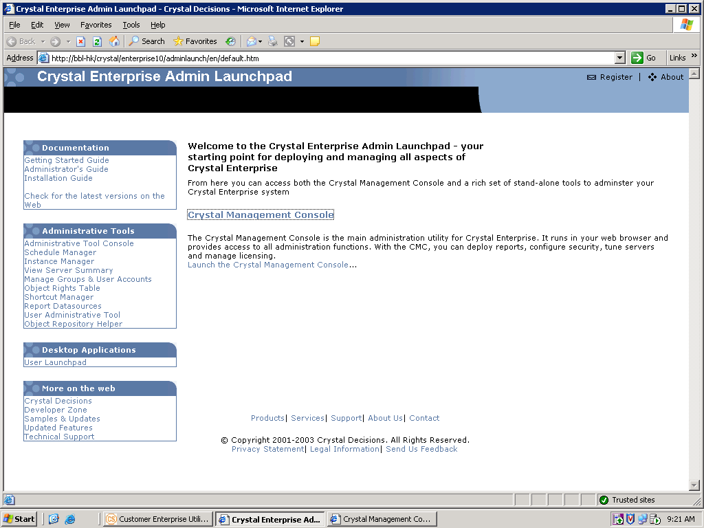
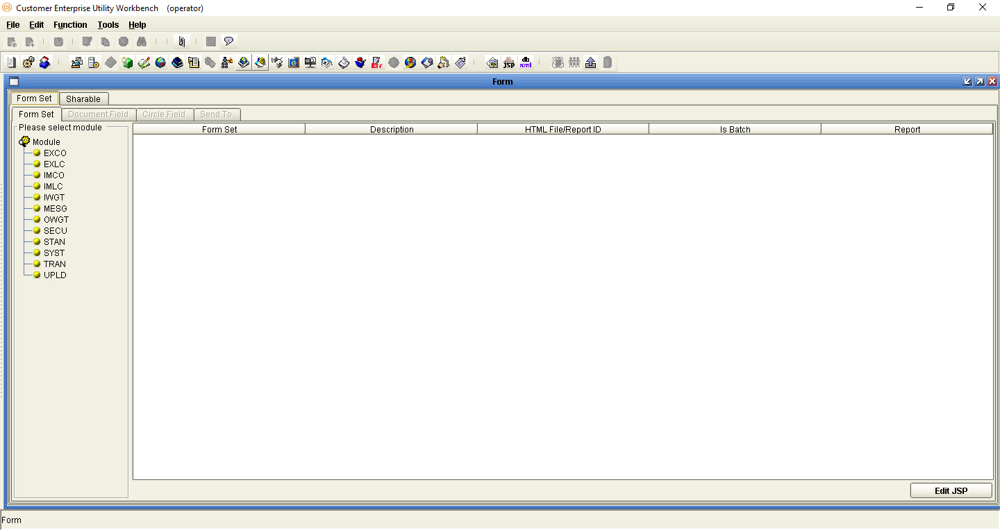
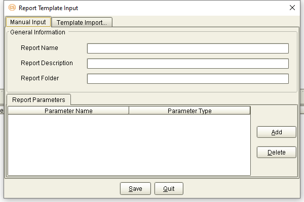
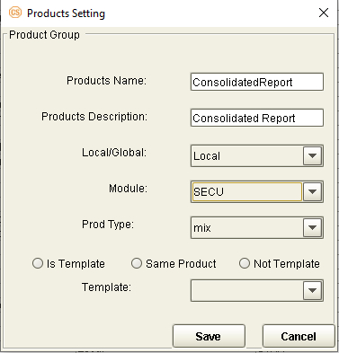

{width="8.510416666666666in"
height="11.310416666666667in"}

+-----------------------------------------------------------------------+
| EXIMBILLS © Trade Finance System                                      |
|                                                                       |
| Customer Enterprise System Version 3.3.6                              |
|                                                                       |
| Reports                                                               |
|                                                                       |
| July 2021                                                             |
+-----------------------------------------------------------------------+
| *Copyright 2021 © China Systems Corporation*                          |
|                                                                       |
| *All Rights Reserved*                                                 |
|                                                                       |
| *This document is protected by United States Copyright Law and may    |
| contain Trade Secrets Information which is proprietary to China       |
| Systems Corporation. No part of this document may be copied,          |
| photocopied, reproduced, translated, distributed, or reduced to any   |
| electronic medium or machine-readable form without prior consent in   |
| writing from China Systems Corporation. The information in this       |
| document may be used only under the terms and conditions of separate  |
| China Systems Corporation license agreements.*                        |
|                                                                       |
| *Information is subject to change without notice. China Systems       |
| Corporation makes no warranties, either expressed or implied, with    |
| respect to the software herein described as to its quality,           |
| performance, including, without limitations to, its fitness for any   |
| particular purpose.*                                                  |
|                                                                       |
| *This document may not reflect total system capability at any         |
| subsequent date as a result of development. It is also possible that  |
| it may contain references to facilities not available on your         |
| computer system. Such references should not be construed to mean that |
| these facilities will necessarily be made available on all types of   |
| computer hardware or in all user locations.*                          |
|                                                                       |
| *China Systems Corporation accepts no responsibility or liability for |
| any damages or loss of business or revenue due to the use of this     |
| document.*                                                            |
|                                                                       |
| *All trademarks, registered trademarks and trade names mentioned in   |
| this document are the sole property of their respective holders.*     |
+-----------------------------------------------------------------------+
| ORDER MORE EXIMBILLS DOCUMENTATION                                    |
|                                                                       |
| Additional copies of Documentation are available for purchase from    |
| China Systems Corporation or through your local EXIMBILLS Support     |
| Office.                                                               |
+-----------------------------------------------------------------------+
| {width="0.7604166666666666in"           |
| height="0.75in"}                                                      |
|                                                                       |
| CHINA SYSTEMS CORPORATION                                             |
|                                                                       |
| Comments may be addressed to:                                         |
|                                                                       |
| <corporatedocs@chinasystems.com>                                      |
|                                                                       |
| China Systems Corporation Ltd.                                        |
|                                                                       |
| Corner House, 20 Parliament Street                                    |
|                                                                       |
| Hamilton HM12                                                         |
|                                                                       |
| Bermuda                                                               |
+-----------------------------------------------------------------------+

Table of Contents

CE Documentation Library 6

CE Documentation Library 7

Core System Manuals 7

CE Utility Reference Manuals 10

Installation Guides 10

Introduction 11

System Overview 12

Manual Overview 13

Using the CE Utility 14

Running the CE Utility 15

Preparing the CE Utility Files 15

Accessing the CE Utility 17

Navigating the CE Utility Interface 21

CE Utility Functions 22

Menu Bar 25

Toolbar Buttons 27

Popup Menu 32

Generating the XML Parameter Files 33

Building a Product 37

System Requirements 39

Required Files 40

Program Files and Folders 41

BIRT Versions 42

BIRT Logs 43

BIRT Deployment 47

Deploying the BIRT EAR File 47

Configuring Other BIRT Settings 51

Installing CE and BIRT on the Same Application Server 56

Installing CE on Separate Application Servers 64

BIRT Report Templates 68

Creating the Report Template File 68

Connecting to a Data Source 73

Defining the Data Sets 79

Designing the Report Template 84

Layout Editor 84

Palette View 88

Using Data Set Fields in the Template Layout 95

Producing CE Documents 96

Overview 97

Parameter Settings 99

Defining the Output Directory 99

Configuring the CE Report Template 101

Configuration 101

Creating the Report Template 102

Importing the Report Template to the Transaction Data Source 107

Procedure 108

Creating the Document Form 111

Configuration 111

Form Rule Configuration: Basic Information 112

Form Rule Configuration: Mapping Information 114

Procedure 119

Setting up the Transaction Function 123

Setting up the Product Function 124

Generating the XML Files 128

Producing CE Transaction Reports 132

Overview 133

Parameter Settings 134

Configuring the CE Report Template 134

Configuration 134

Creating the Report Template 135

Importing the Report Template to the Transaction Data Source 137

Mapping the Parameters to the JSP Fields 137

Procedure 139

Setting up the Transaction Function 143

Function Information 143

Screen Settings 144

Setting up the Product Function 146

Generating the XML Files 150

Special Report Functionalities 153

Using Different E-mail, Catalog Export, and Report Templates Per Entity
154

Configuration 154

Procedures 160

Mail Templates 161

Catalog Export 166

Report Template 171

Glossary 176

Glossary 177

CE Documentation Library {#ce-documentation-library .CS-ChapterTitle}
========================

CE Documentation Library {#ce-documentation-library-1 .CS-head1}
========================

The CE Documentation Library lists all available manuals that serve as
references on the use of the Customer Enterprise system. The documents
are categorized into three groups: Core System Manuals, CE Utility
Reference Manuals, and Installation Guides.

Core System Manuals {#core-system-manuals .CS-head2}
===================

The CE core system manuals provide details on the setup and
configuration of various CE parameters, as well as the implementation of
supplementary functionalities supported by the system.

Archiving and Recovery

This manual is a reference to the Archive and Recovery functionality of
the CE system. Discussions include the required parameter settings for
configuring the relevant functions, as well as examples of how this
functionality is used in transaction processes.

Building a Product

This manual is a reference to the process of building a product in CE.
It provides step-by-step procedures on how to create a basic CE module,
transaction function, and product setting; configure parameters; and
attach components to generate a working business product.

Data Objects

This manual serves as a reference for creating and utilizing data
objects in the CE system. The discussions provide details on how to
build data object templates and data object entities, and how to attach
these to the transaction function screen.

Frequently Asked Questions

This document addresses commonly-asked questions on the Customer
Enterprise system. Issues on the browser-side (transaction processing),
CE Utility, Security Module, and database, among others, are addressed
in the discussions.

Interfacing CE with CS Eximbills

This document discusses the process of interfacing CE with the CS
Eximbills (CSX) back office system. Employing the MQ, FTP, and TCP/IP
communication protocols, the interface process using the XML format is
detailed in this document.

Interfacing CE with Eximbills Enterprise

This document discusses the process of interfacing CE with the Eximbills
Enterprise (EE) back office system. Employing the MQ protocol, the
interface process for the transfer of data between CE and EE using the
XML format is detailed in this document.

Log Settings

This manual provides details on CE logs as well as general instructions
on log configuration in CE. This is especially written for the users who
are in charge of maintaining the CE system.

Look and Feel

This manual is a reference guide on designing the CE user interface
(i.e., the look and feel of the system). Divided into two parts, the
manual provides instructions on creating a) the basic L&F style of CE;
and b) the CE L&F style that incorporates widgets.

Multi-Entity

This manual is a reference on implementing the Multi-Entity
functionality of the CE system. Discussions cover the implementation and
application of CE multi-entity.

Multi-Language

This manual discusses the procedures required in setting up the
Multi-Language functionality of CE as it is run by Administrator- and
Operator-type users. Furthermore, the configuration of certain system
and browser elements as well as the setup of related system parameters
is explained in step-by-step procedures.

Reports

This manual is a comprehensive reference guide on the requirements and
processes involved in building business products and functions that
generate online reports and documents.

Security and System Maintenance Functions

This manual is a comprehensive guide on the security and system
maintenance of the CE system. As such, it includes detailed instructions
for company and company function management, and user and user function
management. Maintenance of key functionalities such as authorization
rules, reference numbers, and other services is covered as well. In
addition, this document discusses the security concepts in CE to assist
users assigned with access rights to the CE Security Module.

Standing Data Functions

This document discusses the functions for the CE standing data that are
maintained by operators (e.g., parties, clauses). It includes sections
for each function, starting with a brief description of the function,
followed by the function input when necessary, and the procedure steps.

Supplementary Functions

This manual is a reference for the CE Utility operator user in
configuring parameter, JSP, and transaction function settings to define
special or supplementary CE functionalities such as uploading images;
sending images and forms to the back-office system; and sending
notifications via e-mail, SMS, and widgets.

System Administration Functions

This manual is a reference for the default Super Administrator user of
the CE Utility in the configuration and maintenance of the CE
environment. It discusses in detail user management and parameter
management.

System Reference

This document serves as a quick reference to the following elements that
are used when configuring specific parameters in the CE Utility: global
system parameters, system parameters, components, XML Generator items,
server side system methods, system JS methods, and APIs.

 {#section .CS-head2}

CE Utility Reference Manuals {#ce-utility-reference-manuals .CS-head2}
============================

The CE Utility Reference set of manuals is a guide on the use of the
Customer Enterprise Utility Workbench, or simply CE Utility. This
reference provides information on every function or feature in the CE
Utility and includes instructions and step-by-step procedures on how to
operate or use the function in relation to operating and maintaining the
CE system and processing a business transaction.

> A manual is provided for each function group of the CE Utility:

-   *CE Utility Reference: User Manager Functions*, for the functions
    that belong to the User Manage function group of the CE Utility when
    accessed by an Administrator or Operator user

-   *CE Utility Reference: Parameter Manager Functions*, for the
    functions that belong to the Parameter Manage function group of the
    CE Utility when accessed by an Administrator or Operator user

-   *CE Utility Reference: System Functions*, for the functions that
    belong to the System Function group of the CE Utility.

-   *CE Utility Reference: Transaction Functions*, for the functions
    that belong to the Transaction Function group of the CE Utility.

-   *CE Utility Reference: Product Functions*, for the functions that
    belong to the Product Function group of the CE Utility.

-   *CE Utility Reference: Maintenance Functions*, for the functions
    that belong to the Maintenance function group of the CE Utility.

Installation Guides {#installation-guides .CS-head2}
===================

The CE installation guides are references on the installation and setup
processes of the CE system on different application servers and
databases.

Installation Guide WAS 9 - Oracle 19c

This is a reference for installing the CE system on WebSphere
Application Server Version 9.0.5.6, with an Oracle 19c database. This
includes detailed instructions on configuring the components that are
required to successfully run CE.

 {#section-1 .CS-ChapterTitle}

Introduction {#introduction .CS-ChapterTitle}
============

-   SYSTEM OVERVIEW

-   MANUAL OVERVIEW

System Overview {#system-overview .CS-head1}
===============

The Business Intelligence and Reporting Tools, BIRT, is one of the most
frequently used and practical reporting services. An Eclipse-based open
source reporting system for web applications, BIRT provides a variety of
reporting design options and report patterns in different file output
formats.

The BIRT tool is the primary report engine integrated with CE. Through
the separately designed BIRT templates and parameter settings in CE, the
relevant CE data is passed to the BIRT application, which in turn,
facilitates the generation of reports and documents.

Through this reporting interface between CE and BIRT, the following
functionalities are supported:

-   The PDF, EXCEL, and DOC (WORD) report and document formats are
    supported.

-   Reports can be generated dynamically according to parameter values
    defined at function setup or at runtime.

-   A standalone function for producing online transaction reports can
    be defined.

-   Batch reports are supported.

With the BIRT report engine, the CE system can support online and
offline report and/or document generation. Online reports and documents
are generated at runtime, such as upon transaction confirmation. Offline
reports, on the other hand, are produced in batches according to a
defined schedule in which all report data are collected.

Documents can also be generated as e-mail attachments that are sent out
in batches.

 Manual Overview {#manual-overview .CS-head1}
===============

> **[Purpose]{.underline}**
>
> This manual is a comprehensive reference guide on the requirements and
> processes involved in building business products and functions that
> generate online reports and documents. This manual also covers basic
> BIRT settings.
>
> This document is written with the assumption that the CE environment
> has already been successfully installed and the reader has sufficient
> knowledge of the following:

-   Building a CE product; and

-   Using the BIRT application, installing BIRT, and designing BIRT
    > report templates.

> **[Audience]{.underline}**

This manual is a reference specifically for, but not limited to, the
following users:

-   Consultants responsible for creating and configuring reports and
    document outputs

-   Bank or browser-side users tasked to process transactions involving
    reports.

> **[Prerequisites]{.underline}**

-   Recommended references before reading this manual: *CE Building a
    Product, CE Installation Guide, and CE Utility References*

{width="0.3333333333333333in"
height="0.3333333333333333in"}NOTE: Some features discussed in this
manual have been tested and documented based on an older system version.
Unless otherwise specified, the overall functionality is the same when
recreated in the current version.

Using the CE Utility {#using-the-ce-utility .CS-ChapterTitle}
====================

-   RUNNING THE CE UTILITY

-   GENERATING THE XML PARAMETER FILES

-   BUILDING A PRODUCT

 {#section-2 .CS-head1}

 {#section-3 .CS-head1}

 {#section-4 .CS-head1}

Running the CE Utility {#running-the-ce-utility .CS-head1}
======================

The Customer Enterprise Utility Workbench, or CE Utility, is the main
tool for building parameters in CE.

Preparing the CE Utility Files {#preparing-the-ce-utility-files .CS-head2}
==============================

> Along with the installation files, the CE Utility folder is provided
> with every CE system release. Prior to using the CE Utility, do the
> following:

i.  Copy the CE Utility folder to the local drive.

ii. Define the required environment variables.

iii. Map the CE directories (e.g., CEWeb.war and CE\_PARA) to the
    > network drive.

  -----------------------------------------------------------------------
  {width="4.85in" height="3.3097222222222222in"}
  -----------------------------------------------------------------------

***Figure 2.*** ***1 CE Utility Folder***

> {width="0.3333333333333333in"
> height="0.3333333333333333in"}**NOTE: **

i.  The default drives defined in the GEN\_XML\_ROOTPATH and
    GEN\_WEB\_ROOTPATH system parameters are O:\\ and P:\\ respectively.
    These drives, if currently not existing, may be created through a
    batch file. While O:\\ and P:\\are the default drives for CE, these
    may be set to any other preferred drive available in the network.

ii. To enable users to use the CE Utility on their own local machines as
    clients connecting to the CE server: 1) Install the Java Development
    Kit (JDK) program; 2) Copy the CE Utility folder; 3) Create the
    JAVA\_HOME environment variable, which must point to this directory:
    \[Java Home\]\\\[Installed JDK\].

iii. For more information on setting up the CE environment, refer to the
    CE installation guides*.*

iv. For information on the CE Utility functions, refer to the *CE
    Utility Reference* manuals.

+-----------------------------------------------------------------------+
| **Batch File for Creating the CE Drives**                             |
|                                                                       |
| The batch file for creating drives contains the following commands:   |
|                                                                       |
| > subst O: /d                                                         |
| >                                                                     |
| > subst P: /d                                                         |
| >                                                                     |
| > subst O: C:\"\\Program                                              |
| > Files\\IBM\\WebSphere\\AppServer\\profiles\\AppSrv01\\installedApps |
| \\DOCS-CEV336Node01Cell\\CE.ear\\CE\_PARA\"                           |
| >                                                                     |
| > subst P: C:\"\\Program                                              |
| > Files\\IBM\\WebSphere\\AppServer\\profiles\\AppSrv01\\installedApps |
| \\DOCS-CEV336Node01Cell\\CE.ear\\CEWeb.war\"                          |
|                                                                       |
| {width="4.8181813210848645in"                  |
| height="0.7698829833770778in"}                                        |
+-----------------------------------------------------------------------+

Accessing the CE Utility {#accessing-the-ce-utility .CS-head2}
========================

> The main program for running the CE Utility is the CEUtility.bat file,
> which is found in the CE Utility folder.

  ----------------------------
  **Do the following . . .**
  ----------------------------

+-----------------------+-----------------------+-----------------------+
| 1\. Run the           |                       | {width="3.5in"      |
| program to access     |                       | height="2.38819444444 |
| the CE Utility.       |                       | 44443in"}             |
|                       |                       |                       |
| **[NOTE]{.underline}* |                       |                       |
| *:                    |                       |                       |
|                       |                       |                       |
| A shortcut for the    |                       |                       |
| CEUtility batch file  |                       |                       |
| can be created on the |                       |                       |
| desktop for easy      |                       |                       |
| access.               |                       |                       |
+-----------------------+-----------------------+-----------------------+
|                       |                       |                       |
+-----------------------+-----------------------+-----------------------+
| 2\. The logon window  |                       | {width="3.5in"      |
| is displayed.         |                       | height="2.34513888888 |
|                       |                       | 8889in"}              |
| To define the         |                       |                       |
| database information, |                       |                       |
| click on the Profile  |                       |                       |
| button.               |                       |                       |
+-----------------------+-----------------------+-----------------------+
|                       |                       |                       |
+-----------------------+-----------------------+-----------------------+
| 3\. In the Database   |                       | {width="3.5in"      |
| box that is           |                       | height="2.48125in"}   |
| displayed, specify    |                       |                       |
| the required          |                       |                       |
| database details      |                       |                       |
| and click on the      |                       |                       |
| Save button.          |                       |                       |
+-----------------------+-----------------------+-----------------------+
|                       |                       |                       |
+-----------------------+-----------------------+-----------------------+
| 4\. A confirmation    |                       | {width="3.5in"     |
| displayed. Click on   |                       | height="2.47361111111 |
| the OK button.        |                       | 1111in"}              |
+-----------------------+-----------------------+-----------------------+
|                       |                       |                       |
+-----------------------+-----------------------+-----------------------+

+-----------------------+-----------------------+-----------------------+
| **[NOTE]{.underline}* |                       | {width="3.5in"     |
|                       |                       | height="0.79861111111 |
| This new data source  |                       | 11112in"}             |
| setting is saved in   |                       |                       |
| the UserInfo.xml file |                       |                       |
| in the CE Utility     |                       |                       |
| directory.            |                       |                       |
+-----------------------+-----------------------+-----------------------+
|                       |                       |                       |
+-----------------------+-----------------------+-----------------------+
| 5\. The relevant      |                       | {width="3.5in"     |
| password may then     |                       | height="2.34513888888 |
| be specified for      |                       | 8889in"}              |
| logging on the CE     |                       |                       |
| Utility.              |                       |                       |
|                       |                       |                       |
| **[NOTE]{.underline}* |                       |                       |
| *:                    |                       |                       |
|                       |                       |                       |
| For information on    |                       |                       |
| defining CE Utility   |                       |                       |
| user profiles, refer  |                       |                       |
| to the *CE System     |                       |                       |
| Administration        |                       |                       |
| Functions* manual.    |                       |                       |
+-----------------------+-----------------------+-----------------------+
|                       |                       |                       |
+-----------------------+-----------------------+-----------------------+
| 6\. The CE Utility    |                       | {width="3.5in"     |
| displayed.            |                       | height="1.85694444444 |
|                       |                       | 44445in"}             |
+-----------------------+-----------------------+-----------------------+
|                       |                       |                       |
+-----------------------+-----------------------+-----------------------+

+-----------------------+-----------------------+-----------------------+
| 7\. A function is     |                       | {width="3.5in"     |
| or double-clicking    |                       | height="1.85694444444 |
| on the relevant       |                       | 44445in"}             |
| function group and    |                       |                       |
| clicking on the       |                       |                       |
| function name.        |                       |                       |
|                       |                       |                       |
| **[NOTE]{.underline}* |                       |                       |
| *:                    |                       |                       |
|                       |                       |                       |
| A user may only       |                       |                       |
| access and utilize    |                       |                       |
| the functions         |                       |                       |
| assigned to him. For  |                       |                       |
| more details, refer   |                       |                       |
| to the *CE Utility    |                       |                       |
| Reference: User       |                       |                       |
| Manager Functions*    |                       |                       |
| documentation*.*      |                       |                       |
+-----------------------+-----------------------+-----------------------+

> {width="0.3333333333333333in"
> height="0.3333333333333333in"}**NOTE:** It is sometimes necessary to
> assign a new user name and password when the new database is restored
> from a backup file. Restoring the backup file restores the original
> user profiles.
>
> The new user profiles for the CE Utility (as well as the CE Security
> Module) can be defined during the installation process. SQL scripts
> are run to create these profiles. Refer to the CE installation guides
> for more information.

Navigating the CE Utility Interface {#navigating-the-ce-utility-interface .CS-head2}
===================================

> After logging on, the CE Utility window is displayed and parameters
> may then be configured. The functions used for setting up parameters
> may be accessed by clicking on the function name on the Function menu
> or by using the shortcut buttons.
>
> The CE Utility interface also provides ways by which parameters can be
> created, edited, deleted or linked to other operations: menu bar,
> toolbar buttons, and popup menu.

  ------------------------------------------------------------------------
  {width="4.85in" height="2.5729166666666665in"}
  ------------------------------------------------------------------------

***Figure 2.*** ***2 The CE Utility Interface***

> {width="0.3333333333333333in"
> height="0.3333333333333333in"}**NOTE:** A function is only displayed,
> and its corresponding button or menu option enabled, if the user has
> been given the right to access this function. Some options and
> functions are only available to Super Administrator users, while
> others are only accessible to Administrator and Operator users.

####### CE Utility Functions

> The functions that may be accessed for setting up parameters are
> organized together into several function groups. The current available
> function groups and their corresponding functions in the CE Utility
> are as follows:

**User Manager Function Group**

> This function group is comprised of functions used for creating,
> configuring, and exporting Bank-Country group settings; creating new
> users; and configuring data sources. These functions are:

-   Business Unit Config

-   DataSource Manage

-   Import/Export Business Unit

-   User Manage

**Parameter Manage Function Group**

> This function group consists of functions used for maintaining
> system-wide parameters and components. These functions are:

-   AP Server

-   Component Manage

-   Language Configuration

-   System Parameter

-   System Parameters

**System Function Group**

> This function group consists of functions used for maintaining and
> facilitating system-wide tasks, operations, and settings. These
> functions are:

-   Image Type Maintain

-   Output Device

-   Queue Manager

-   STP Setting

-   Time Zone

**Transaction Function Group**

> This function group is comprised of functions used for defining the
> actual business parameters of transaction functions. These facilitate
> the maintenance and processes of the business transaction modules.
> These functions are:

-   Amount/Rate Format

-   Batch Manage

-   Clause

-   DO Get Data

-   Export Setting

-   Form

-   GAPIs Setting

-   Get Data

-   Image Control

-   Message Broker Setting

-   Module & Event

-   Report Template

-   STPs Mapping

-   Sub Tasks

-   SWIFT Config

-   System Maintain

-   Transaction Function

-   Transfer To

-   TSU Mapping

-   Upload Message Setting

-   Web Service Setting

-   Widget Maintain

**Product Function Group**

> This function group consists of functions that are used for creating
> and configuring the products to be accessed and used by the customers
> or end-users. These functions are:

-   Fields Select

-   Inbox

-   Product Authorize

-   Product Authorize Setting

-   Product Catalog

-   Product Function Setting

-   Product Item

**Maintenance Function Group**

> This function group is comprised of functions used for facilitating
> the maintenance of data from CE tables, including fields and error
> settings. These functions are:

-   DB Dictionary

-   Error Handling

-   Error Message Config (CE)

-   Field Conversion

-   Multi Language

-   Page Dictionary

-   XML Generator

####### 

####### Menu Bar

> The options on the menu bar are shortcuts to both the common and
> specific functions and tasks of the system.

  -------------------------------------------------------------------------
  {width="2.25in" height="0.22916666666666666in"}
  -------------------------------------------------------------------------

***Figure 2.*** ***3 Menu Bar***

  ---------- -- -----------------
  **Menu**      **Description**
  ---------- -- -----------------

+-----------------------+-----------------------+-----------------------+
| **File**              |                       | The available options |
|                       |                       | in the File menu are: |
|                       |                       |                       |
|                       |                       | -   New: This is used |
|                       |                       |     for creating a    |
|                       |                       |     new parameter or  |
|                       |                       |     rule.             |
|                       |                       |                       |
|                       |                       | -   Save: This is     |
|                       |                       |     used for saving   |
|                       |                       |     the created or    |
|                       |                       |     modified          |
|                       |                       |     settings.         |
|                       |                       |                       |
|                       |                       | -   Close Function:   |
|                       |                       |     This is used for  |
|                       |                       |     closing the       |
|                       |                       |     current function  |
|                       |                       |     window.           |
|                       |                       |                       |
|                       |                       | -   Connect To: This  |
|                       |                       |     is used for       |
|                       |                       |     connecting to     |
|                       |                       |     another Meta data |
|                       |                       |     source.           |
|                       |                       |                       |
|                       |                       | -   Log Off: This is  |
|                       |                       |     used for logging  |
|                       |                       |     off a user that   |
|                       |                       |     is logged on to   |
|                       |                       |     the system        |
|                       |                       |     without exiting   |
|                       |                       |     the system.       |
|                       |                       |                       |
|                       |                       | -   Exit: This is     |
|                       |                       |     used for closing  |
|                       |                       |     the system window |
|                       |                       |     and exiting the   |
|                       |                       |     system.           |
+-----------------------+-----------------------+-----------------------+
|                       |                       |                       |
+-----------------------+-----------------------+-----------------------+
| **Edit**              |                       | The available options |
|                       |                       | in the Edit menu are: |
|                       |                       |                       |
|                       |                       | -   Add: This is used |
|                       |                       |     for adding a      |
|                       |                       |     setting for the   |
|                       |                       |     selected function |
|                       |                       |     or parameter.     |
|                       |                       |                       |
|                       |                       | -   Delete: This is   |
|                       |                       |     used for deleting |
|                       |                       |     or removing an    |
|                       |                       |     existing setting. |
|                       |                       |                       |
|                       |                       | -   Edit: This is     |
|                       |                       |     used for editing  |
|                       |                       |     or modifying      |
|                       |                       |     existing          |
|                       |                       |     settings.         |
|                       |                       |                       |
|                       |                       | -   Copy: This is     |
|                       |                       |     used for copying  |
|                       |                       |     or duplicating a  |
|                       |                       |     selected setting. |
|                       |                       |                       |
|                       |                       | -   Find: This is     |
|                       |                       |     used for finding  |
|                       |                       |     a specific        |
|                       |                       |     setting.          |
+-----------------------+-----------------------+-----------------------+
|                       |                       |                       |
+-----------------------+-----------------------+-----------------------+
| **Function**          |                       | The available options |
|                       |                       | in the Function menu  |
|                       |                       | are:                  |
|                       |                       |                       |
|                       |                       | -   User Manage,      |
|                       |                       |     which displays    |
|                       |                       |     options for       |
|                       |                       |     running User      |
|                       |                       |     Manager functions |
|                       |                       |                       |
|                       |                       | -   Parameter Manage, |
|                       |                       |     which displays    |
|                       |                       |     options for       |
|                       |                       |     running Parameter |
|                       |                       |     Manager functions |
|                       |                       |                       |
|                       |                       | -   System Function,  |
|                       |                       |     which displays    |
|                       |                       |     options for       |
|                       |                       |     running System    |
|                       |                       |     functions         |
|                       |                       |                       |
|                       |                       | -   Transaction       |
|                       |                       |     Function, which   |
|                       |                       |     displays options  |
|                       |                       |     for running       |
|                       |                       |     Transaction       |
|                       |                       |     functions         |
|                       |                       |                       |
|                       |                       | -   Product Function, |
|                       |                       |     which displays    |
|                       |                       |     options for       |
|                       |                       |     running Product   |
|                       |                       |     functions         |
|                       |                       |                       |
|                       |                       | -   Maintenance,      |
|                       |                       |     which displays    |
|                       |                       |     options for       |
|                       |                       |     running           |
|                       |                       |     Maintenance       |
|                       |                       |     functions         |
+-----------------------+-----------------------+-----------------------+
|                       |                       |                       |
+-----------------------+-----------------------+-----------------------+
| **Tools**             |                       | The available options |
|                       |                       | in the Tools menu     |
|                       |                       | are:                  |
|                       |                       |                       |
|                       |                       | -   Toolbar: When     |
|                       |                       |     this option is    |
|                       |                       |     marked, the       |
|                       |                       |     toolbar is        |
|                       |                       |     displayed on the  |
|                       |                       |     CE Utility        |
|                       |                       |     Workbench window. |
|                       |                       |                       |
|                       |                       | -   Function Toolbar: |
|                       |                       |     When this option  |
|                       |                       |     is marked, the    |
|                       |                       |     function toolbar  |
|                       |                       |     is displayed on   |
|                       |                       |     the CE Utility    |
|                       |                       |     Workbench window. |
|                       |                       |                       |
|                       |                       | -   Set User Profile  |
|                       |                       |     DB Info: This     |
|                       |                       |     option is used by |
|                       |                       |     the Super         |
|                       |                       |     Administrator     |
|                       |                       |     user to change    |
|                       |                       |     the user          |
|                       |                       |     information that  |
|                       |                       |     is to be used by  |
|                       |                       |     the CE Utility    |
|                       |                       |     for connecting to |
|                       |                       |     a database.       |
|                       |                       |                       |
|                       |                       | -   Window Style:     |
|                       |                       |     Selecting this    |
|                       |                       |     option displays a |
|                       |                       |     list of CE        |
|                       |                       |     Utility interface |
|                       |                       |     styles: Microsoft |
|                       |                       |     Style, Unix       |
|                       |                       |     Style, Java       |
|                       |                       |     Style, Classic    |
|                       |                       |     Style, and Metal  |
|                       |                       |     Style. The        |
|                       |                       |     preferred style   |
|                       |                       |     may be marked     |
|                       |                       |     accordingly.      |
+-----------------------+-----------------------+-----------------------+
|                       |                       |                       |
+-----------------------+-----------------------+-----------------------+
| **Help**              |                       | The available options |
|                       |                       | in the Help menu are: |
|                       |                       |                       |
|                       |                       | -   Help Topics: This |
|                       |                       |     is *currently not |
|                       |                       |     used*.            |
|                       |                       |                       |
|                       |                       | -   Content Help:     |
|                       |                       |     This is           |
|                       |                       |     *currently not    |
|                       |                       |     used.*            |
|                       |                       |                       |
|                       |                       | -   About Customer    |
|                       |                       |     Enterprise:       |
|                       |                       |     Selecting this    |
|                       |                       |     option displays   |
|                       |                       |     the About         |
|                       |                       |     Customer          |
|                       |                       |     Enterprise        |
|                       |                       |     window, which     |
|                       |                       |     indicates the     |
|                       |                       |     version           |
|                       |                       |     information of    |
|                       |                       |     CE.               |
+-----------------------+-----------------------+-----------------------+

####### Toolbar Buttons

> There are two kinds of toolbars in the CE Utility: the basic toolbar
> and the function toolbar.
>
> **Basic Toolbar**
>
> The following standard buttons are available on the Basic Toolbar of
> the CE Utility window. These are used for performing the basic and
> common tasks of the system.

  ---------------------------------------------------------------
  {width="3.65625in" height="0.3125in"}
  ---------------------------------------------------------------

***Figure 2.*** ***4 Basic Toolbar Buttons***

  ------------ -- -----------------
  **Button**      **Description**
  ------------ -- -----------------

  -------------------------------------------------------------------------------------------- -- ------------------------------------------------------------------------------------
  {width="0.25in" height="0.25in"} **New**                                This button is used for creating a new parameter or rule.
                                                                                                  
  {width="0.25in" height="0.25in"} **Add**                                This button is used for adding a setting for the selected function or parameter.
                                                                                                  
  {width="0.25in" height="0.25in"} **Save**                               This button is used for storing created or modified settings.
                                                                                                  
  {width="0.25in" height="0.25in"} **Edit**                               This button is used for editing or modifying existing settings.
                                                                                                  
  {width="0.25in" height="0.25in"} **Copy**                               This button is used for copying or duplicating a selected setting.
                                                                                                  
  {width="0.25in" height="0.25in"} **Delete**                             This button is used for deleting or removing an existing setting.
                                                                                                  
  {width="0.25in" height="0.25in"} **Find**                               This button is used for finding an existing setting.
                                                                                                  
  {width="0.22916666666666666in" height="0.25in"} **Close Function**      This button is used for closing a function window.
                                                                                                  
  {width="0.25in" height="0.25in"} **Help Topic**                         This button is *currently not used.*
                                                                                                  
  {width="0.25in" height="0.25in"} **About Customer Enterprise**          This button is used for displaying the version information of Customer Enterprise.
  -------------------------------------------------------------------------------------------- -- ------------------------------------------------------------------------------------

> **Function Toolbar**
>
> The buttons on this toolbar are shortcuts to some of the functions
> that are in the Function Group lists of the CE Utility window. The
> buttons may also be accessed from the Function menu on the menu bar.

  ----------------------------------------------------------------------------------------------
  {width="4.864583333333333in" height="0.14583333333333334in"}
  ----------------------------------------------------------------------------------------------

***Figure 2.*** ***5 Function Toolbar Buttons***

  ------------ -- -----------------
  **Button**      **Description**
  ------------ -- -----------------

  ------------------------------------------------------------------------------------------------------------------------------- -- --------------------------------------------------------------------------------------------------------------------------------------------------------------------
  {width="0.22916666666666666in" height="0.22916666666666666in"} **Set System Parameter**                    This button is used for accessing the System Parameter function. The function may also be accessed from the Parameter Manage group in the Function menu.
                                                                                                                                     
  {width="0.22916666666666666in" height="0.22916666666666666in"} **Manage Component**                        This button is used for accessing the Component Manage function. The function may also be accessed from the Parameter Manage group in the Function menu.
                                                                                                                                     
  {width="0.22916666666666666in" height="0.22916666666666666in"} **Calculation**                             This button is *currently not used.*
                                                                                                                                     
  {width="0.22916666666666666in" height="0.22916666666666666in"} **Module/Event Configuration**              This button is used for accessing the Module & Event function. The function may also be accessed from the Transaction Function group in the Function menu.
                                                                                                                                     
  {width="0.22916666666666666in" height="0.22916666666666666in"} **Transaction Function Configuration**      This button is used for accessing the Transaction Function. The function may also be accessed from the Transaction Function group in the Function menu.
                                                                                                                                     
  {width="0.22916666666666666in" height="0.22916666666666666in"} **Form Set**                                This button is used for accessing the Form function. The function may also be accessed from the Transaction Function group in the Function menu.
                                                                                                                                     
  {width="0.22916666666666666in" height="0.22916666666666666in"} **Accounting Rule Setting**                 This button is *currently not used.*
                                                                                                                                     
  {width="0.22916666666666666in" height="0.22916666666666666in"} **Field Conversion**                        This button is used for accessing the Field Conversion function. The function may also be accessed from the Maintenance group in the Function menu.
                                                                                                                                     
  {width="0.22916666666666666in" height="0.22916666666666666in"}**Get Data**                                 This button is used for accessing the Get Data function. The function may also be accessed from the Transaction Function group in the Function menu.
                                                                                                                                     
  {width="0.22916666666666666in" height="0.22916666666666666in"} **Reference Number**                        This button is *currently not used.*
                                                                                                                                     
  {width="0.22916666666666666in" height="0.22916666666666666in"} **Output Device**                           This button is used for accessing the Output Device function. The function may also be accessed from the System Function group in the Function menu.
                                                                                                                                     
  {width="0.22916666666666666in" height="0.22916666666666666in"} **Function Group**                          This button is *currently not used.*
                                                                                                                                     
  {width="0.22916666666666666in" height="0.22916666666666666in"} **Clause**                                  This button is used for accessing the Clause function. The function may also be accessed from the Transaction Function group in the Function menu.
                                                                                                                                     
  {width="0.22916666666666666in" height="0.22916666666666666in"} **SWIFT**                                   This button is used for accessing the SWIFT Config function. The function may also be accessed from the Transaction Function group in the Function menu.
                                                                                                                                     
  {width="0.22916666666666666in" height="0.22916666666666666in"} **Queue Manager**                           This button is used for accessing the Queue Manager function. The function may also be accessed from the System Function group in the Function menu.
                                                                                                                                     
  {width="0.22916666666666666in" height="0.22916666666666666in"} **GAPIs Setting**                           This button is used for accessing the GAPIs Setting function. The function may also be accessed from the Transaction Function group in the Function menu.
                                                                                                                                     
  {width="0.22916666666666666in" height="0.22916666666666666in"} **Time Zone**                               This button is used for setting time zone. The function may also be accessed from the System Function group in the Function menu.
                                                                                                                                     
  {width="0.22916666666666666in" height="0.22916666666666666in"} **STP Setting**                             This button is used for accessing the STP Setting function. The function may also be accessed from the System Function group in the Function menu.
                                                                                                                                     
  {width="0.22916666666666666in" height="0.22916666666666666in"} **Message Broker Setting**                  This button is used for accessing the Message Broker Setting function. The function may also be accessed from the Transaction Function group in the Function menu.
                                                                                                                                     
  {width="0.22916666666666666in" height="0.22916666666666666in"} **Processing Center**                       This button is *currently not used.*
                                                                                                                                     
  {width="0.22916666666666666in" height="0.22916666666666666in"} **Amount Format Setting**                   This button is used for accessing the Amount/Rate Format function. The function may also be accessed from the Transaction Function group in the Function menu.
                                                                                                                                     
  {width="0.22916666666666666in" height="0.22916666666666666in"} **Error Message**                           This button is used for accessing the Error Message Config (CE) function. The function may also be accessed from the Maintenance group in the Function menu.
                                                                                                                                     
  {width="0.22916666666666666in" height="0.22916666666666666in"} **Say Total**                               This button is *currently not used.*
                                                                                                                                     
  {width="0.22916666666666666in" height="0.22916666666666666in"} **Holiday**                                 This button is *currently not used.*
                                                                                                                                     
  {width="0.22916666666666666in" height="0.22916666666666666in"} **Report**                                  This button is *currently not used.*
                                                                                                                                     
  {width="0.22916666666666666in" height="0.22916666666666666in"} **Transfer To**                             This button is used for accessing the Transfer To function. The function may also be accessed from the Transaction Function group in the Function menu.
                                                                                                                                     
  {width="0.22916666666666666in" height="0.22916666666666666in"} **Archiving**                               This button is *currently not used.*
                                                                                                                                     
  {width="0.22916666666666666in" height="0.22916666666666666in"} **DB Dictionary**                           This button is used for accessing the DB Dictionary function. The function may also be accessed from the Maintenance group in the Function menu.
                                                                                                                                     
  {width="0.22916666666666666in" height="0.22916666666666666in"} **Calculation Constant**                    This button is *currently not used.*
                                                                                                                                     
  {width="0.22916666666666666in" height="0.22916666666666666in"} **XML Generator**                           This button is used for accessing the XML Generator function. The function may also be accessed from the Maintenance group in the Function menu.
                                                                                                                                     
  {width="0.22916666666666666in" height="0.22916666666666666in"} **Business Unit**                           This button is used for accessing the Business Unit Config function. The function may also be accessed from the User Manage group in the Function menu.
                                                                                                                                     
  {width="0.22916666666666666in" height="0.22916666666666666in"} **User Manager**                            This button is used for accessing the User Manage function. The function may also be accessed from the User Manage group in the Function menu.
                                                                                                                                     
  {width="0.22916666666666666in" height="0.22916666666666666in"} **Import/Export Business Unit**             This button is used for accessing the Import/Export Business Unit function. The function may also be accessed from the User Manage group in the Function menu.
                                                                                                                                     
  {width="0.22916666666666666in" height="0.22916666666666666in"} **DataSource Manager**                      This function is used for accessing the Data Source Manage function. The function may also be accessed from the User Manage group in the Function menu.
  ------------------------------------------------------------------------------------------------------------------------------- -- --------------------------------------------------------------------------------------------------------------------------------------------------------------------

####### Popup Menu

> Inside a function or configuration window, options may be provided in
> the form of a popup menu. This menu is displayed by right-clicking on
> the relevant window section or on the relevant information.

  -------------------------------------------------------------------------------------
  {width="1.3644127296587927in" height="2.280964566929134in"}
  -------------------------------------------------------------------------------------

***Figure 2.*** ***6 Popup Menu***

> In a popup window, the following options may be made available:

-   New

-   Add

-   Save

-   Edit

-   Copy

-   Delete

-   Find

-   Sharable

-   Help

Generating the XML Parameter Files {#generating-the-xml-parameter-files .CS-head1}
==================================

The created parameters and business logic are stored in the database as
Meta data. For this Meta data to be accessible to the application server
(AP) and the web server, it has to be converted to XML -- the format
used for the communication between the client and the server.

The XML files are generated through the XML Generator function of the
Maintenance function group in the CE Utility. In most cases, the XML
Generator function must be run when a parameter is created or modified
using the functions discussed in this document.

  --------------------------------
  **Do the following . .** **.**
  --------------------------------

+-----------------------+-----------------------+-----------------------+
| 1\. Log on CE         |                       | {width="3.5in"     |
| Administrator or      |                       | height="2.34513888888 |
| Operator user with    |                       | 8889in"}              |
| rights to the XML     |                       |                       |
| Generator function.   |                       |                       |
+-----------------------+-----------------------+-----------------------+
|                       |                       |                       |
+-----------------------+-----------------------+-----------------------+
| 2\. The CE Utility    |                       | {width="3.5in"     |
| displayed.            |                       | height="1.85694444444 |
|                       |                       | 44445in"}             |
| Run the XML Generator |                       |                       |
| function from the     |                       |                       |
| Maintenance function  |                       |                       |
| group.                |                       |                       |
|                       |                       |                       |
| Alternatively, click  |                       |                       |
| on the XML Generator  |                       |                       |
| button in the         |                       |                       |
| function toolbar.     |                       |                       |
+-----------------------+-----------------------+-----------------------+
|                       |                       |                       |
+-----------------------+-----------------------+-----------------------+
| 3\. The XML           |                       | {width="3.5in"     |
| window is             |                       | height="1.85694444444 |
| displayed.            |                       | 44445in"}             |
|                       |                       |                       |
| When there are newly  |                       |                       |
| defined or modified   |                       |                       |
| parameters, the Meta  |                       |                       |
| Data to XML window is |                       |                       |
| also displayed. It    |                       |                       |
| lists these           |                       |                       |
| parameters for easy   |                       |                       |
| selection. In this    |                       |                       |
| case, the parameter   |                       |                       |
| can be selected from  |                       |                       |
| this window and the   |                       |                       |
| Apply button clicked. |                       |                       |
| Afterwards, proceed   |                       |                       |
| to Step 5.            |                       |                       |
|                       |                       |                       |
| Alternatively, the    |                       |                       |
| Meta data or          |                       |                       |
| parameter can be      |                       |                       |
| manually selected     |                       |                       |
| from the main XML     |                       |                       |
| Generator window. In  |                       |                       |
| this case, click on   |                       |                       |
| the Close button of   |                       |                       |
| the Meta Data to XML  |                       |                       |
| window and proceed to |                       |                       |
| Step 4.               |                       |                       |
+-----------------------+-----------------------+-----------------------+
|                       |                       |                       |
+-----------------------+-----------------------+-----------------------+
| 4\. Double-click on   |                       | {width="3.5in"     |
| parameter type from   |                       | height="1.85694444444 |
| the XML Generator     |                       | 44445in"}             |
| window.               |                       |                       |
+-----------------------+-----------------------+-----------------------+
|                       |                       |                       |
+-----------------------+-----------------------+-----------------------+
| 5\. Depending on the  |                       | {width="3.5in"     |
| type, an XML          |                       | height="1.85694444444 |
| configuration         |                       | 44445in"}             |
| window may be         |                       |                       |
| displayed. In other   |                       |                       |
| cases, the process    |                       |                       |
| directly proceeds     |                       |                       |
| to Step 6.            |                       |                       |
|                       |                       |                       |
| If the configuration  |                       |                       |
| window is displayed,  |                       |                       |
| indicate the exact or |                       |                       |
| any additional        |                       |                       |
| setting required to   |                       |                       |
| generate the relevant |                       |                       |
| XML files. When the   |                       |                       |
| specifications are    |                       |                       |
| defined click on the  |                       |                       |
| Save button           |                       |                       |
+-----------------------+-----------------------+-----------------------+
|                       |                       |                       |
+-----------------------+-----------------------+-----------------------+
| 6\. A message is      |                       | {width="3.5in"     |
| confirming if the     |                       | height="1.13472222222 |
| XML files are to be   |                       | 22222in"}             |
| generated on the      |                       |                       |
| system path.          |                       |                       |
+-----------------------+-----------------------+-----------------------+
|                       |                       |                       |
+-----------------------+-----------------------+-----------------------+
| **[NOTE]{.underline}* |                       | {width="3.5in"     |
|                       |                       | height="1.85694444444 |
| The path of the XML   |                       | 44445in"}             |
| files is defined      |                       |                       |
| through the           |                       |                       |
| GEN\_XML\_ROOTPATH    |                       |                       |
| Utility Workbench     |                       |                       |
| system parameter.     |                       |                       |
| This system parameter |                       |                       |
| is configured through |                       |                       |
| the System Parameter  |                       |                       |
| function from the     |                       |                       |
| Parameter Manage      |                       |                       |
| function group.       |                       |                       |
+-----------------------+-----------------------+-----------------------+
|                       |                       |                       |
+-----------------------+-----------------------+-----------------------+
| 7\. To save the XML   |                       | {width="3.5in"     |
| relevant system       |                       | height="2.47083333333 |
| path, click on the    |                       | 3333in"}              |
| Yes button.           |                       |                       |
|                       |                       |                       |
| To specify another    |                       |                       |
| path, click on the No |                       |                       |
| button. On the Save   |                       |                       |
| dialog box that is    |                       |                       |
| displayed, browse for |                       |                       |
| the path and click on |                       |                       |
| the Save button.      |                       |                       |
+-----------------------+-----------------------+-----------------------+
|                       |                       |                       |
+-----------------------+-----------------------+-----------------------+
| 8\. When the          |                       | {width="3.5in"     |
| are generated, the    |                       | height="1.85694444444 |
| system displays a     |                       | 44445in"}             |
| confirmation          |                       |                       |
| message.              |                       |                       |
|                       |                       |                       |
| **[NOTE]{.underline}* |                       |                       |
| *:                    |                       |                       |
|                       |                       |                       |
| To hide the           |                       |                       |
| information on the    |                       |                       |
| paths of the          |                       |                       |
| generated XML files,  |                       |                       |
| click on the Hide     |                       |                       |
| button.               |                       |                       |
+-----------------------+-----------------------+-----------------------+
|                       |                       |                       |
+-----------------------+-----------------------+-----------------------+
| **[NOTE]{.underline}* |                       | {width="3.5in"     |
|                       |                       | height="3.15208333333 |
| Check the indicated   |                       | 3333in"}              |
| path(s) to see the    |                       |                       |
| generated XML files.  |                       |                       |
+-----------------------+-----------------------+-----------------------+

Building a Product {#building-a-product .CS-head1}
==================

When building a product in the CE Utility, a few prerequisites are
required to be met to make sure that modules or products are built in
accordance with the bank's requirements. One step is the GAP analysis
which involves an evaluation of transaction requirements, based on the
process flow (e.g., fields, clauses, forms, and interfaces). These are
necessary for identifying the fields required for anticipating the
required output. When the analysis has been completed, the project team
can now begin the process of building a product for the bank's
customers.

The following are steps in building a product:

1.  **Access the CE Utility**. To access the CE Utility for building
    parameters, an Operator user must be created by an Administrator
    user. This is set up through the User Manager function in the User
    Manage function group.

2.  **Set up the module and events**. This involves naming the module
    and the projected events that manage the transaction flow within the
    module. This is set up in the Module and Event function in CE
    Utility.

3.  **Set up the transaction tables.** This involves creating the tables
    in the DB Dictionary function in CE Utility. There can be different
    types of tables but only three are mandatory for a CE module:
    master, ledger, and event.

{width="0.3333333333333333in"
height="0.3333333333333333in"}NOTE: It is possible to create tables
directly into the database by running SQL scripts in the database. In
this case, tables can be created before modules and events. It is
recommended, however, to use the DB Dictionary for creating tables.

4.  **Add fields to the transaction table**. Fields must be added to a
    transaction table and field properties defined for the processing
    and storage of data. These can be done through the DB Dictionary
    function in CE Utility.

5.  **Set up the transaction functions**. This involves creating the
    functions that correspond to actual transaction processes. This is
    done through Transaction Function in the Transaction Function group.

6.  **Set up the transaction parameters**. This involves designing the
    transaction screen, defining attribute and catalog settings, and
    attaching these parameters to the transaction function. These can be
    done through Transaction Function in CE Utility.

7.  **Create the product.** The product is the actual functionality
    accessed and run by the end-user. This process of creating a product
    involves setting up the product group, product, and product
    function, and defining product catalog settings.

8.  **Define authorization rules**. Authorization rules are set to
    further define or set limits for authorizing transactions.

9.  **Calculation.** This involves configuring the transaction JS files
    and defining calculation functions using available system methods.
    There are three JS files that have to be configured: the Module Base
    JS file, Event JS file, and Function JS file.

10. **Define the settings for the transaction input.** Certain functions
    may be added to aid in the input of data into the transaction. The
    CE Utility provides options for setting up field conversion rules,
    lookup buttons, customer reference numbers, clauses, dropdown lists,
    and data objects for this purpose.

11. **Define the settings for the transaction output.** Some business
    transactions involve output generation (i.e., Forms). To make this
    option available, certain settings must be configured using the
    functions from the Transaction Function group in CE Utility.

12. **Define the security settings in the CE browser.** The products and
    functions created are assigned to an end-user through the
    browser-side Security and System Maintenance functions.

{width="0.3333333333333333in"
height="0.3333333333333333in"}NOTE: The browser-side security and system
maintenance functions of CE are often collectively called the Security
Module.

13. **Add the Inbox functionality.** Another way of accessing a product
    or a transaction for further processing is through the Customer
    Inbox. This can be set up through the Inbox function in CE Utility.

{width="0.3333333333333333in"
height="0.3333333333333333in"}NOTE: For more information on configuring
different parameters in CE, refer to the *CE Utility Reference*
manuals*.*

System Requirements {#system-requirements .CS-ChapterTitle}
===================

-   REQUIRED FILES

-   BIRT DEPLOYMENT

-   BIRT REPORT TEMPLATES

 {#section-6 .CS-head1}

Required Files {#required-files .CS-head1}
==============

To be able to generate reports using the BIRT Report Engine, the
required files and folders must be copied and installed before defining
the relevant settings in the CE Utility. The CE.ear file must be set up
to install the CE system and the BIRT.ear file must be deployed to
enable the BIRT Reporting tool. Specific versions of BIRT are supported
in the CE system. These may be deployed on either a separate port or
together with the CE system in the same server.

{width="0.3333333333333333in"
height="0.3333333333333333in"}NOTE:

i.  Separate CE and BIRT application files are provided to enable the
    user to install CE and BIRT together or on different servers.

ii. If CE and BIRT are to reside in the same WebLogic server, they must
    be installed in separate domains.

iii. The application server demonstrated in this section is WebSphere
    9.0.5.6.

Program Files and Folders {#program-files-and-folders .CS-head2}
=========================

The following are the required files in installing the BIRT report
template

  ---------------- -- -------------
  File or Folder      Description
  ---------------- -- -------------

+-----------------------+-----------------------+-----------------------+
| **ReportEngine**      |                       | This folder is        |
|                       |                       | provided in the       |
|                       |                       | system release.       |
|                       |                       |                       |
|                       |                       | If the CE and BIRT    |
|                       |                       | applications are      |
|                       |                       | installed in the same |
|                       |                       | server, this folder   |
|                       |                       | must be copied to the |
|                       |                       | parameter path of CE  |
|                       |                       | (i.e., ce.user.dir    |
|                       |                       | setting).             |
|                       |                       |                       |
|                       |                       | If CE and BIRT reside |
|                       |                       | on separate servers,  |
|                       |                       | these must be copied  |
|                       |                       | to the report server. |
+-----------------------+-----------------------+-----------------------+
|                       |                       |                       |
+-----------------------+-----------------------+-----------------------+
| **REPORTTMPL**        |                       | All BIRT report       |
|                       |                       | template files must   |
|                       |                       | be stored in this     |
|                       |                       | folder (e.g.,         |
|                       |                       | IMLC\_report.rptdesig |
|                       |                       | n)                    |
|                       |                       |                       |
|                       |                       | If the CE and BIRT    |
|                       |                       | applications are      |
|                       |                       | installed in the same |
|                       |                       | server, this folder   |
|                       |                       | must be copied to the |
|                       |                       | parameter path of CE  |
|                       |                       | (i.e., ce.user.dir    |
|                       |                       | setting).             |
|                       |                       |                       |
|                       |                       | If CE and BIRT reside |
|                       |                       | on separate servers,  |
|                       |                       | these must be copied  |
|                       |                       | to the report server. |
+-----------------------+-----------------------+-----------------------+
|                       |                       |                       |
+-----------------------+-----------------------+-----------------------+
| **CE.ear**            |                       | This installs the CE  |
|                       |                       | application. Provided |
|                       |                       | by the CE team, this  |
|                       |                       | may or may not        |
|                       |                       | include the BIRT      |
|                       |                       | application.          |
+-----------------------+-----------------------+-----------------------+
|                       |                       |                       |
+-----------------------+-----------------------+-----------------------+
| **BIRT.ear**          |                       | Required when CE and  |
|                       |                       | BIRT are to be set up |
|                       |                       | in separate servers,  |
|                       |                       | this EAR file         |
|                       |                       | installs the BIRT     |
|                       |                       | application.          |
+-----------------------+-----------------------+-----------------------+

 {#section-7 .CS-head2}

BIRT Versions {#birt-versions .CS-head2}
=============

The CE Version 3.3.6 system supports BIRT Version 3.7.2 only.

{width="0.3333333333333333in"
height="0.3333333333333333in"}NOTE:

> i\. After installation, the Class loader order of BIRTWEB.war (path:
> Applications \> WebSphere Enterprise Applications \> BIRT \> Manage
> Modules) must be set to parent last.

{width="5.017391732283465in"
height="2.4146194225721787in"}

> ii\. For information on BIRT versions and settings for older versions of
> CE, refer to the earlier versions of this manual.

BIRT Logs {#birt-logs .CS-head2}
=========

To configure the BIRT log, the following procedures must be performed:

1.  In WebSphere:

> a\. If BIRT and CE are installed using the same EAR file, the relevant
> details
>
> must be specified in the BIRTWEB.war configuration window.
>
> {width="4.96in" height="2.3870002187226596in"}

b.  If BIRT and CE are installed using different EAR files, the
    > following details must be specified in the Class loader
    > configuration window:

> {width="4.858333333333333in"
> height="2.338073053368329in"}

2.  Locate the birt.properties file in the **CE\_SYS folder.**

> {width="5.462264873140858in"
> height="4.126411854768154in"}

3.  In the birt.properties file, configure the BIRT log details by
    > specifying the BIRT\_LOG\_PATH (e.g. BIRT\_LOG\_PATH=C:\\birtlog)
    > and the BIRT\_LOG\_LEVEL.

> The BIRT\_LOG\_LEVEL is used to define the log level which may be any
> of the following:

-   Severe (highest value)

-   Warning

-   Info

-   Config

-   Fine

-   Finer

-   Finest (lowest value)

-   All

-   Off

> The level OFF may be used to turn off logging, and the level ALL may
> be used to enable logging of all messages.
>
> {width="5.415095144356956in"
> height="1.7373425196850394in"}

4.  Confirm a transaction (e.g. Apply for Import LC) and click on the
    > View button to view the generated form.

> {width="5.474025590551181in"
> height="2.607764654418198in"}
>
> {width="5.454545056867891in" height="2.625in"}

5.  The BIRT log is generated in the path specified in the
    > BIRT\_LOG\_PATH.

> {width="5.454166666666667in"
> height="2.8937379702537185in"}

BIRT Deployment {#birt-deployment .CS-head1}
===============

The EAR file for the BIRT application can be deployed on either a
separate port or together with the CE system in the same server, or on a
different application server from CE.

The EAR file deployment and subsequent parameter checks are configured
in WebSphere.

{width="0.3333333333333333in"
height="0.3333333333333333in"}NOTE:

i.  BIRT may also be deployed prior to the installation of the CE EAR
    file. However, installing the CE and BIRT applications in the same
    server is recommended.

ii. For the steps demonstrated in this section, WAS Version 9.0.5.6 is
    used.

Deploying the BIRT EAR File {#deploying-the-birt-ear-file .CS-head2}
===========================

To successfully deploy the BIRT EAR file, the following WAS
configurations must be defined.

  ------------------------
  Do the following . . .
  ------------------------

+-----------------------+-----------------------+-----------------------+
| 1\. Run the           |                       |                   |
| Administrative        |                       |                       |
| Console.              |                       |                       |
+-----------------------+-----------------------+-----------------------+
|                       |                       |                       |
+-----------------------+-----------------------+-----------------------+
| 2\. In the            |                       |                   |
| click on the New      |                       |                       |
| Application option.   |                       |                       |
+-----------------------+-----------------------+-----------------------+
|                       |                       |                       |
+-----------------------+-----------------------+-----------------------+
| 3\. In the Install a  |                       |                   |
| page, select the      |                       |                       |
| New Enterprise        |                       |                       |
| Application option.   |                       |                       |
+-----------------------+-----------------------+-----------------------+
|                       |                       |                       |
+-----------------------+-----------------------+-----------------------+
| 4\. Select the Local  |                       |                   |
| and then click on     |                       |                       |
| the Choose File       |                       |                       |
| button.               |                       |                       |
|                       |                       |                       |
| **[NOTE:]{.underline} |                       |                       |
| **                    |                       |                       |
|                       |                       |                       |
| Button names may      |                       |                       |
| differ based on the   |                       |                       |
| browser used.         |                       |                       |
+-----------------------+-----------------------+-----------------------+
|                       |                       |                       |
+-----------------------+-----------------------+-----------------------+
| 5\. Browse for the    |                       |                   |
| click on the Open     |                       |                       |
| Button.               |                       |                       |
+-----------------------+-----------------------+-----------------------+
|                       |                       |                       |
+-----------------------+-----------------------+-----------------------+
| 6\. The selected      |                       |                   |
| in the New            |                       |                       |
| Application page.     |                       |                       |
|                       |                       |                       |
| Click on the Next     |                       |                       |
| button to continue to |                       |                       |
| the next step of this |                       |                       |
| procedure.            |                       |                       |
+-----------------------+-----------------------+-----------------------+
|                       |                       |                       |
+-----------------------+-----------------------+-----------------------+
| 7\. The Select        |                       |                   |
| Options page is       |                       |                       |
| displayed.            |                       |                       |
|                       |                       |                       |
| Select either option  |                       |                       |
| from the list:        |                       |                       |
|                       |                       |                       |
| -   Fast Path --      |                       |                       |
|     > wherein the     |                       |                       |
|     > system prompts  |                       |                       |
|     > only when       |                       |                       |
|     > additional      |                       |                       |
|     > details are     |                       |                       |
|     > required; or    |                       |                       |
|                       |                       |                       |
| -   Detailed: wherein |                       |                       |
|     > all             |                       |                       |
|     > installation    |                       |                       |
|     > options and     |                       |                       |
|     > parameters are  |                       |                       |
|     > displayed.      |                       |                       |
|                       |                       |                       |
| Click on the Next     |                       |                       |
| button to proceed.    |                       |                       |
|                       |                       |                       |
| **[NOTE]{.underline}* |                       |                       |
| *:                    |                       |                       |
|                       |                       |                       |
| The installation      |                       |                       |
| method used for this  |                       |                       |
| reference is Fast     |                       |                       |
| Path.                 |                       |                       |
+-----------------------+-----------------------+-----------------------+
|                       |                       |                       |
+-----------------------+-----------------------+-----------------------+
| 8\. The Installation  |                       |                   |
| displayed.            |                       |                       |
|                       |                       |                       |
| Accept the default    |                       |                       |
| settings and click on |                       |                       |
| the Next button.      |                       |                       |
+-----------------------+-----------------------+-----------------------+
|                       |                       |                       |
+-----------------------+-----------------------+-----------------------+
| 9\. The Map Modules   |                       |                   |
| displayed.            |                       |                       |
|                       |                       |                       |
| Accept the default    |                       |                       |
| settings, and click   |                       |                       |
| on the Next button.   |                       |                       |
+-----------------------+-----------------------+-----------------------+
|                       |                       |                       |
+-----------------------+-----------------------+-----------------------+
| 10\. A summary of     |                       |                   |
| options is            |                       |                       |
| displayed. Confirm    |                       |                       |
| that the              |                       |                       |
| Application Name      |                       |                       |
| displays BIRT.        |                       |                       |
|                       |                       |                       |
| Click on the Finish   |                       |                       |
| button.               |                       |                       |
+-----------------------+-----------------------+-----------------------+
|                       |                       |                       |
+-----------------------+-----------------------+-----------------------+
| 11\. The              |                       |                   |
| process is started.   |                       |                       |
+-----------------------+-----------------------+-----------------------+
|                       |                       |                       |
+-----------------------+-----------------------+-----------------------+
| 12\. At the end of    |                       |                   |
| corresponding         |                       |                       |
| message is            |                       |                       |
| displayed to          |                       |                       |
| indicate the status   |                       |                       |
| of the                |                       |                       |
| installation.         |                       |                       |
|                       |                       |                       |
| Click on the Save     |                       |                       |
| option.               |                       |                       |
+-----------------------+-----------------------+-----------------------+

Configuring Other BIRT Settings {#configuring-other-birt-settings .CS-head2}
===============================

After the BIRT EAR file is deployed, certain parameter settings must be
checked in WebSphere before the BIRT URL may be accessed to confirm a
successful installation.

Parameter Check

To check BIRT-related parameters in WebSphere:

  ------------------------
  Do the following . . .
  ------------------------

+-----------------------+-----------------------+-----------------------+
| 1\. Run the           |                       |                   |
| Administrative        |                       |                       |
| Console.              |                       |                       |
+-----------------------+-----------------------+-----------------------+
|                       |                       |                       |
+-----------------------+-----------------------+-----------------------+
| 2\. In the            |                       |                   |
| click on the          |                       |                       |
| WebSphere             |                       |                       |
| Enterprise            |                       |                       |
| Applications option   |                       |                       |
| in the Application    |                       |                       |
| Types sub-menu.       |                       |                       |
+-----------------------+-----------------------+-----------------------+
|                       |                       |                       |
+-----------------------+-----------------------+-----------------------+
| 3\. The index of      |                       |                   |
| applications is       |                       |                       |
| displayed.            |                       |                       |
|                       |                       |                       |
| Click on the link of  |                       |                       |
| the BIRT application. |                       |                       |
+-----------------------+-----------------------+-----------------------+
|                       |                       |                       |
+-----------------------+-----------------------+-----------------------+
| 4\. In the            |                       |                   |
| click on the Manage   |                       |                       |
| Modules option in     |                       |                       |
| the Modules           |                       |                       |
| section.              |                       |                       |
+-----------------------+-----------------------+-----------------------+
|                       |                       |                       |
+-----------------------+-----------------------+-----------------------+
| 5\. The Manage        |                       |                   |
| shown.                |                       |                       |
|                       |                       |                       |
| In the index of       |                       |                       |
| modules, click on the |                       |                       |
| link for the BIRTWEB  |                       |                       |
| module.               |                       |                       |
+-----------------------+-----------------------+-----------------------+
|                       |                       |                       |
+-----------------------+-----------------------+-----------------------+
| 6\. The BIRTWEB       |                       |                   |
| configuration page    |                       |                       |
| is displayed.         |                       |                       |
|                       |                       |                       |
| From the Class Loader |                       |                       |
| Order dropdown list,  |                       |                       |
| select this option:   |                       |                       |
|                       |                       |                       |
| Classes loaded with   |                       |                       |
| local class loader    |                       |                       |
| first (parent last)   |                       |                       |
|                       |                       |                       |
| Click on the OK       |                       |                       |
| button and then       |                       |                       |
| select the Save       |                       |                       |
| option to store the   |                       |                       |
| settings.             |                       |                       |
+-----------------------+-----------------------+-----------------------+
|                       |                       |                       |
+-----------------------+-----------------------+-----------------------+
| 7\. Select the Save   |                       |                   |
| settings.             |                       |                       |
+-----------------------+-----------------------+-----------------------+
|                       |                       |                       |
+-----------------------+-----------------------+-----------------------+
| 8\. In the            |                       |                  |
| click on the          |                       |                       |
| WebSphere             |                       |                       |
| Enterprise            |                       |                       |
| Applications          |                       |                       |
| option.               |                       |                       |
+-----------------------+-----------------------+-----------------------+
|                       |                       |                       |
+-----------------------+-----------------------+-----------------------+
| 9\. In the index of   |                       |                  |
| Enterprise            |                       |                       |
| Applications page,    |                       |                       |
| select the BIRT       |                       |                       |
| application and       |                       |                       |
| click on the Start    |                       |                       |
| button.               |                       |                       |
+-----------------------+-----------------------+-----------------------+
|                       |                       |                       |
+-----------------------+-----------------------+-----------------------+
| 10\. A message        |                       |                  |
| the status of the     |                       |                       |
| start process is      |                       |                       |
| displayed.            |                       |                       |
|                       |                       |                       |
| Log off from the      |                       |                       |
| Administrative        |                       |                       |
| Console.              |                       |                       |
+-----------------------+-----------------------+-----------------------+

BIRT URL

To access the BIRT URL:

1.  Restart the WebSphere server.

2.  To check the successful installation of BIRT, open the corresponding
    URL with the following format:\
    \
    http://\[Server IP Address\]:\[Port\]/BIRTWEB/servlets/GetBirtData\
    \
    **[EXAMPLE:]{.underline}**\
    \
    http://localhost:9080/BIRTWEB/servlets/GetBirtData\
    \
    \
    \
    The port number can be checked by going to this path in the
    Websphere Administrative console:\
    \
    Servers \> Application Servers \> \[server\] \> Ports \>
    WC\_defaulthost

> A message prompt to download the GetBirtData is displayed. This
> confirms that the successful deployment of BIRT.

  --------------------------------------------------------------
  {width="4.85in" height="0.25625in"}
  --------------------------------------------------------------

Figure 3. 1 BIRT Successfully Deployed Confirmation Message

Installing CE and BIRT on the Same Application Server {#installing-ce-and-birt-on-the-same-application-server .CS-head2}
=====================================================

To install CE and BIRT in the same application server and using the same
EAR file, the following procedures must be performed:

-   Updating the CE EAR File

-   Configuring WebSphere

-   Updating the CE Core

-   Binding the BIRT JDBC Reference

-   Updating the Cache\_Config.xml File

-   Defining the Report System parameter

-   Restarting CE

Updating the CE.EAR File

-   Add the following statement to the CE.ear\\META-INF\\application.xml
    > file:

(Start of code)

> \<module id=\"WebModule\_1141991381002\"\>\
> \<web\>\
> \<web-uri\>BIRTWEB.war\</web-uri\>\
> \<context-root\>BIRTWEB\</context-root\>\
> \</web\>\
> \</module\>

(End of code)

  ------------------------------------------------------------
  {width="4.85in" height="2.125in"}
  ------------------------------------------------------------

Figure 3. 2 Application.xml File

Configuring WebSphere

Run WebSphere --

-   Deploy the CE.ear file and define the other required settings for
    > installing the CE application.

-   Access the Enterprise Applications option of the Applications Menu
    > in Websphere. Click on the BIRT application. In the Modules
    > section, select the Manage Modules option and then select the
    > BIRTWEB module. In the BIRTWEB.war configuration window, set the
    > Class loader order by selecting the option Classes loaded with
    > local class loader first (parent last) from the dropdown list.

  -------------------------------------------------------------------------
  {width="4.85in" height="2.3340277777777776in"}
  -------------------------------------------------------------------------

Figure 3. 3 Class Loader Order: Classes Loaded with Local Class Loader
First

Updating the CE Core

From the CE.ear, copy the Core.jar, CSBase.jar, and com.cs.core.xml.jar
files into this path:

> BIRTWEB.war\\WEB-INF\\lib

  ------------------------------------------------------------------------
  {width="4.85in" height="2.120833333333333in"}
  ------------------------------------------------------------------------

Figure 3. 4 CSEECore.jar File

Binding the BIRT JDBC Reference

In order to set up the JDBC reference for the BIRT report, a new node
must be added to the Web.xml file in BIRTWEB.war.

The following code shows the content of Web.xml with the added JDBC
reference for BIRT:

+-----------------------------------------------------------------------+
| (Start of code)                                                       |
|                                                                       |
| \<?xml version=\"1.0\" encoding=\"UTF-8\"?\>                          |
|                                                                       |
| \<!DOCTYPE web-app PUBLIC \"-//Sun Microsystems, Inc.//DTD Web        |
| Application 2.3//EN\" \"http://java.sun.com/dtd/web-app\_2\_3.dtd\"\> |
|                                                                       |
| \<web-app id=\"WebApp\"\>                                             |
|                                                                       |
| \<display-name\>BIRTWEB\</display-name\>                              |
|                                                                       |
| \<listener\>                                                          |
|                                                                       |
| \<listener-class\>com.cs.birt.listener.BirtWebListener\</listener-cla |
| ss\>                                                                  |
|                                                                       |
| \</listener\>                                                         |
|                                                                       |
| \<servlet\>                                                           |
|                                                                       |
| \<servlet-name\>GetBirtData\</servlet-name\>                          |
|                                                                       |
| \<display-name\>GetBirtData\</display-name\>                          |
|                                                                       |
| \<servlet-class\>com.cs.birt.GetBirtData\</servlet-class\>            |
|                                                                       |
| \</servlet\>                                                          |
|                                                                       |
| \<servlet-mapping\>                                                   |
|                                                                       |
| \<servlet-name\>GetBirtData\</servlet-name\>                          |
|                                                                       |
| \<url-pattern\>/servlets/GetBirtData\</url-pattern\>                  |
|                                                                       |
| \</servlet-mapping\>                                                  |
|                                                                       |
| \<welcome-file-list\>                                                 |
|                                                                       |
| \<welcome-file\>index.html\</welcome-file\>                           |
|                                                                       |
| \<welcome-file\>index.htm\</welcome-file\>                            |
|                                                                       |
| \<welcome-file\>index.jsp\</welcome-file\>                            |
|                                                                       |
| \<welcome-file\>default.html\</welcome-file\>                         |
|                                                                       |
| \<welcome-file\>default.htm\</welcome-file\>                          |
|                                                                       |
| \<welcome-file\>default.jsp\</welcome-file\>                          |
|                                                                       |
| \</welcome-file-list\>                                                |
|                                                                       |
| \<!---add jdbc reference to BIRT Start\--\>                           |
|                                                                       |
| \<resource-ref id=\"ResourceRef\_1217229454744\"\>                    |
|                                                                       |
| \<res-ref-name\>jdbc/CET\</res-ref-name\>                             |
|                                                                       |
| \<res-type\>javax.sql.DataSource\</res-type\>                         |
|                                                                       |
| \<res-auth\>Container\</res-auth\>                                    |
|                                                                       |
| \<res-sharing-scope\>Shareable\</res-sharing-scope\>                  |
|                                                                       |
| \</resource-ref\>                                                     |
|                                                                       |
| \<!\-- add jdbc reference to BIRT End\--\>                            |
|                                                                       |
| \</web-app\>                                                          |
|                                                                       |
| (End of code)                                                         |
+-----------------------------------------------------------------------+

  ------------------------------------------------------------------------
  {width="4.85in" height="2.536111111111111in"}
  ------------------------------------------------------------------------

Figure 3. 5 Web.xml File

Updating the Cache\_Config.xml File

Add the following parameter in the Cache\_Config.xml file found in the
CE\_SYS folder:

> \<cache name=\"CACHE\_RPTTEMP\" maxElementsInMemory=\"500\"
> eternal=\"true\" timeToIdleSeconds=\"600\" timeToLiveSeconds=\"600\"
> overflowToDisk=\"false\"/\>

  ------------------------------------------------------------------------
  {width="4.85in" height="2.547222222222222in"}
  ------------------------------------------------------------------------

Figure 3. 6 Cache\_Config.xml File

Defining the Report System Parameter

Log on to the CE Utility as a Super Administrator user and add the
BIRT\_SERVER\_URL system parameter in the System Parameters function.
This is required for accessing the BIRT server.

  -------------------------------------------------------------------------
  {width="4.85in" height="2.5729166666666665in"}
  -------------------------------------------------------------------------

Figure 3. 7 System Parameters Function: Parameter Config Window

  ------- -- -------------------
  Field      Field Description
  ------- -- -------------------

+-----------------------+-----------------------+-----------------------+
| **Parameter Name**    |                       | Specify this value:   |
|                       |                       | BIRT\_SERVER\_URL.    |
+-----------------------+-----------------------+-----------------------+
|                       |                       |                       |
+-----------------------+-----------------------+-----------------------+
| **Parameter           |                       | Select the Common     |
| Attribute**           |                       | option from the       |
|                       |                       | dropdown list.        |
+-----------------------+-----------------------+-----------------------+
|                       |                       |                       |
+-----------------------+-----------------------+-----------------------+
| **Parameter Value**   |                       | Specify or browse for |
|                       |                       | this path:            |
|                       |                       |                       |
|                       |                       | http://\<local IP     |
|                       |                       | address\>:\<port      |
|                       |                       | number\>/\<context    |
|                       |                       | root                  |
|                       |                       | name\>/servlets/GetBi |
|                       |                       | rtData                |
|                       |                       |                       |
|                       |                       | **[EXAMPLE:]{.underli |
|                       |                       | ne}**                 |
|                       |                       |                       |
|                       |                       | http://127.0.0.1:9080 |
|                       |                       | /BIRTWEB/servlets/Get |
|                       |                       | BirtData              |
|                       |                       |                       |
|                       |                       | **[NOTE:]{.underline} |
|                       |                       | **                    |
|                       |                       |                       |
|                       |                       | To enable generation  |
|                       |                       | of reports when HTTPS |
|                       |                       | connection is used,   |
|                       |                       | use 'https' in the    |
|                       |                       | BIRT Server URL.      |
+-----------------------+-----------------------+-----------------------+
|                       |                       |                       |
+-----------------------+-----------------------+-----------------------+
| **CDATA**             |                       | If this flag is       |
|                       |                       | marked, all contents  |
|                       |                       | in the CDATA          |
|                       |                       | (Character Data) are  |
|                       |                       | treated as characters |
|                       |                       | by the XML program.   |
|                       |                       | Special characters    |
|                       |                       | "\]\] and \>" are not |
|                       |                       | allowed.              |
|                       |                       |                       |
|                       |                       | Leave this flag       |
|                       |                       | unmarked.             |
|                       |                       |                       |
|                       |                       | **[NOTE:]{.underline} |
|                       |                       | **                    |
|                       |                       |                       |
|                       |                       | If this flag is       |
|                       |                       | marked, the following |
|                       |                       | details are included  |
|                       |                       | in the xml file that  |
|                       |                       | is generated:         |
|                       |                       |                       |
|                       |                       | \<BIRT\_SERVER\_URL   |
|                       |                       | attr=\"C\"\>          |
|                       |                       | \<!\[CDATA\[http://lo |
|                       |                       | calhost:9080/BIRTWEB/ |
|                       |                       | servlets/GetBirtData\ |
|                       |                       | ]\]\>                 |
|                       |                       | \</BIRT\_SERVER\_URL\ |
|                       |                       | >                     |
+-----------------------+-----------------------+-----------------------+
|                       |                       |                       |
+-----------------------+-----------------------+-----------------------+
| **Parameter           |                       | Provide a short       |
| Description**         |                       | description of the    |
|                       |                       | parameter.            |
+-----------------------+-----------------------+-----------------------+

Restarting CE

Restart the CE service in WAS to begin using the CE application.

  ---------------------------------------------------------------------------------------
  {width="2.3854166666666665in" height="3.9256288276465443in"}
  ---------------------------------------------------------------------------------------

Figure 3. 8 Restarting the Application Server

{width="0.3333333333333333in"
height="0.3333333333333333in"}NOTE: The CE Shared Libraries must
[not]{.underline} be referenced for BIRT.

{width="5.056604330708661in"
height="2.433490813648294in"}

Installing CE on Separate Application Servers {#installing-ce-on-separate-application-servers .CS-head2}
=============================================

To install CE and BIRT in separate application servers and using
different EAR files, the following procedures must be performed:

-   Installing the CE.EAR File

-   Installing the BIRT.EAR File

-   Including Additional Properties

-   Updating the CE Core

-   Updating the Cache\_Config.xml File

-   Defining the Report System Parameter

-   Restarting CE

Installing the CE .EAR File

Run WebSphere to deploy the CE.ear file and define the other required
settings for installing the CE application.

Installing the BIRT .EAR File

Run WebSphere and deploy the BIRT EAR file.

Including Additional Properties

The following parameters (ce.user.dir) are required if the BIRT EAR file
is separately installed:

-   CE\_SYS\\ CE\_Log\_Config.xml

-   CE\_SYS\\ BIRT.properties -- This is used to define the log level
    and path for BIRT 2.2.1 and above version. Below is a sample of the
    code:

> BIRT\_LOG\_LEVEL=ALL
>
> BIRT\_LOG\_PATH= \${ce.user.dir}/CELog/BIRTLog
>
> BIRT\_LOG\_LEVEL: It is used to define log level. Log levels from
> lower to higher are: OFF, FINE, SEVERE, WARNING, INFO, CONFIG, FINER,
> FINEST and ALL.
>
> BIRT\_LOG\_PATH: It is used to define log path. The backslash '\\' is
> not supported. It must be slash '/'.

-   CE\_SYS\\ Cache\_Config.xml

-   CE\_SYS\\SYST\\\*.\*

-   REPORTTMPL\\

-   ReportEngine\\

{width="0.3333333333333333in"
height="0.3333333333333333in"}NOTE: In CE versions 3.3.1 and above, JVM
variable is supported in BIRT log.

Updating the CE Core

From the CE.ear, copy the Core.jar, CSBase.jar, and com.cs.core.xml.jar
files into this path:

BIRTWEB.war\\WEB-INF\\lib

Updating the Cache\_Config.xml File

Add the following parameter in the Cache\_Config.xml file found in the
CE\_SYS folder:

> \<cache name=\"CACHE\_RPTTEMP\" maxElementsInMemory=\"500\"
> eternal=\"true\" timeToIdleSeconds=\"600\" timeToLiveSeconds=\"600\"
> overflowToDisk=\"false\"/\>

Defining the Report System Parameter

Log on to the CE Utility as a Super Administrator user and add the
BIRT\_SERVER\_URL system parameter in the System Parameters function.
This is required for accessing the BIRT server.

  -------------------------------------------------------------------------------------
  {width="4.040277777777778in" height="2.408695319335083in"}
  -------------------------------------------------------------------------------------

Figure 3. 9 BIRT\_SERVER\_URL System Parameter

  ------- -- -------------------
  Field      Field Description
  ------- -- -------------------

+-----------------------+-----------------------+-----------------------+
| **Parameter Name**    |                       | Specify this value:   |
|                       |                       | BIRT\_SERVER\_URL.    |
+-----------------------+-----------------------+-----------------------+
|                       |                       |                       |
+-----------------------+-----------------------+-----------------------+
| **Parameter           |                       | Select the Common     |
| Attribute**           |                       | option from the       |
|                       |                       | dropdown list.        |
+-----------------------+-----------------------+-----------------------+
|                       |                       |                       |
+-----------------------+-----------------------+-----------------------+
| **Parameter Value**   |                       | Specify or browse for |
|                       |                       | this path:            |
|                       |                       |                       |
|                       |                       | http://\<BIRT IP      |
|                       |                       | address\>:\<BIRT port |
|                       |                       | number\>/\<context    |
|                       |                       | root                  |
|                       |                       | name\>/servlets/GetBi |
|                       |                       | rtData                |
|                       |                       |                       |
|                       |                       | **[EXAMPLE:]{.underli |
|                       |                       | ne}**                 |
|                       |                       |                       |
|                       |                       | http://127.0.0.1:9080 |
|                       |                       | /BIRTWEB/servlets/Get |
|                       |                       | BirtData              |
|                       |                       |                       |
|                       |                       | **[NOTE:]{.underline} |
|                       |                       | **                    |
|                       |                       |                       |
|                       |                       | To enable generation  |
|                       |                       | of reports when HTTPS |
|                       |                       | connection is used,   |
|                       |                       | use 'https' in the    |
|                       |                       | BIRT Server URL.      |
+-----------------------+-----------------------+-----------------------+
|                       |                       |                       |
+-----------------------+-----------------------+-----------------------+
| **CDATA**             |                       | If this flag is       |
|                       |                       | marked, all contents  |
|                       |                       | in the CDATA          |
|                       |                       | (Character Data) are  |
|                       |                       | treated as characters |
|                       |                       | by the XML program.   |
|                       |                       | Special characters    |
|                       |                       | "\]\] and \>" are not |
|                       |                       | allowed.              |
|                       |                       |                       |
|                       |                       | Leave this flag       |
|                       |                       | unmarked.             |
|                       |                       |                       |
|                       |                       | **[NOTE:]{.underline} |
|                       |                       | **                    |
|                       |                       |                       |
|                       |                       | If this flag is       |
|                       |                       | marked, the following |
|                       |                       | details are included  |
|                       |                       | in the xml file that  |
|                       |                       | is generated:         |
|                       |                       |                       |
|                       |                       | \<BIRT\_SERVER\_URL   |
|                       |                       | attr=\"C\"\>          |
|                       |                       | \<!\[CDATA\[http://lo |
|                       |                       | calhost:9080/BIRTWEB/ |
|                       |                       | servlets/GetBirtData\ |
|                       |                       | ]\]\>                 |
|                       |                       | \</BIRT\_SERVER\_URL\ |
|                       |                       | >                     |
+-----------------------+-----------------------+-----------------------+
|                       |                       |                       |
+-----------------------+-----------------------+-----------------------+
| **Parameter           |                       | Provide a short       |
| Description**         |                       | description of the    |
|                       |                       | parameter.            |
+-----------------------+-----------------------+-----------------------+

Restarting CE

Restart the CE service in WAS to begin using the CE application.

  -------------------------------------------------------------------------------------
  {width="2.883720472440945in" height="4.683549868766404in"}
  -------------------------------------------------------------------------------------

Figure 3. 10 Restarting the Application Server

 {#section-8 .CS-head1}

 {#section-9 .CS-head1}

BIRT Report Templates {#birt-report-templates .CS-head1}
=====================

A BIRT report template defines a basic report structure on which
generated reports are based. It also contains defined data sets, which
specify the data to display in a report. Creating the raw BIRT report
templates, which are later used in setting up CE documents and reports,
involves the following procedures:

-   Creating the Report Template File

-   Connecting to a Data Source

-   Defining the Data Sets

-   Designing the Report Template

-   Using Data Set Fields in the Template Layout

Creating the Report Template File {#creating-the-report-template-file .CS-head2}
=================================

Before designing the BIRT report template, the report project and
template files must first be created.

  ------------------------
  Do the following . . .
  ------------------------

+-----------------------+-----------------------+-----------------------+
| 1\. Run the BIRT      |                       | {width="3.5in"    |
| application file:     |                       | height="1.85694444444 |
| eclipse.exe.          |                       | 44445in"}             |
+-----------------------+-----------------------+-----------------------+
|                       |                       |                       |
+-----------------------+-----------------------+-----------------------+
| The Eclipse           |                       | {width="3.5in"    |
| initialized.          |                       | height="2.26944444444 |
|                       |                       | 44444in"}             |
+-----------------------+-----------------------+-----------------------+
|                       |                       |                       |
+-----------------------+-----------------------+-----------------------+
| 2\. The Workspace     |                       | {width="3.5in"    |
| is displayed.         |                       | height="1.58819444444 |
|                       |                       | 44445in"}             |
| Select the workspace  |                       |                       |
| on which the files    |                       |                       |
| are to be stored and  |                       |                       |
| click on the OK       |                       |                       |
| button.               |                       |                       |
+-----------------------+-----------------------+-----------------------+
|                       |                       |                       |
+-----------------------+-----------------------+-----------------------+
| The Eclipse welcome   |                       | {width="3.5in"    |
|                       |                       | height="1.85694444444 |
| Close this window.    |                       | 44445in"}             |
+-----------------------+-----------------------+-----------------------+
|                       |                       |                       |
+-----------------------+-----------------------+-----------------------+
| 3\. Open the File     |                       | {width="3.5in"    |
| and click on the      |                       | height="1.85694444444 |
| Project option.       |                       | 44445in"}             |
+-----------------------+-----------------------+-----------------------+
|                       |                       |                       |
+-----------------------+-----------------------+-----------------------+
| 4\. The New Project   |                       | {width="3.5in"    |
| displayed.            |                       | height="1.85694444444 |
|                       |                       | 44445in"}             |
| Expand the Business   |                       |                       |
| Intelligence and      |                       |                       |
| Reporting Tools       |                       |                       |
| folder and select the |                       |                       |
| Report Project        |                       |                       |
| option.               |                       |                       |
|                       |                       |                       |
| Click on the Next     |                       |                       |
| button.               |                       |                       |
+-----------------------+-----------------------+-----------------------+
|                       |                       |                       |
+-----------------------+-----------------------+-----------------------+
| 5\. Specify a name    |                       | {width="3.5in"    |
| project.              |                       | height="1.85694444444 |
|                       |                       | 44445in"}             |
| To use the indicated  |                       |                       |
| Workspace location    |                       |                       |
| for storing report    |                       |                       |
| project, mark the Use |                       |                       |
| default location      |                       |                       |
| option. Otherwise,    |                       |                       |
| use the Browse button |                       |                       |
| to indicate the       |                       |                       |
| relevant directory.   |                       |                       |
|                       |                       |                       |
| Click on the Finish   |                       |                       |
| button.               |                       |                       |
+-----------------------+-----------------------+-----------------------+
|                       |                       |                       |
+-----------------------+-----------------------+-----------------------+
| 6\. The Open          |                       | {width="3.5in"    |
| Perspective           |                       | height="1.09930555555 |
| confirmation          |                       | 55555in"}             |
| message is            |                       |                       |
| displayed.            |                       |                       |
|                       |                       |                       |
| Click on the Yes      |                       |                       |
| button.               |                       |                       |
+-----------------------+-----------------------+-----------------------+
|                       |                       |                       |
+-----------------------+-----------------------+-----------------------+
| 7\. In the Report     |                       | {width="3.5in"    |
| the File menu,        |                       | height="1.85694444444 |
| select New, and       |                       | 44445in"}             |
| click on the Report   |                       |                       |
| option.               |                       |                       |
+-----------------------+-----------------------+-----------------------+
|                       |                       |                       |
+-----------------------+-----------------------+-----------------------+
| 8\. The New Report    |                       | {width="3.5in"    |
| displayed.            |                       | height="4.05555555555 |
|                       |                       | 5555in"}              |
| Select the previously |                       |                       |
| defined project name; |                       |                       |
| this functions as a   |                       |                       |
| parent folder for the |                       |                       |
| report templates.     |                       |                       |
|                       |                       |                       |
| Specify the name of   |                       |                       |
| the report template   |                       |                       |
| to be created and     |                       |                       |
| click on the Next     |                       |                       |
| button.               |                       |                       |
+-----------------------+-----------------------+-----------------------+
|                       |                       |                       |
+-----------------------+-----------------------+-----------------------+
| 9\. Select the        |                       | {width="3.5in"    |
| be used and click     |                       | height="4.05in"}      |
| on the Finish         |                       |                       |
| button.               |                       |                       |
+-----------------------+-----------------------+-----------------------+
|                       |                       |                       |
+-----------------------+-----------------------+-----------------------+
| 10\. The Report       |                       | {width="3.5in"    |
| displayed.            |                       | height="1.85694444444 |
|                       |                       | 44445in"}             |
+-----------------------+-----------------------+-----------------------+

Connecting to a Data Source {#connecting-to-a-data-source .CS-head2}
===========================

A data source must be set up in order for the BIRT application to be
able to access data that serves as the body (content) of the report.

A JDBC data source allows BIRT to access data from the database tables
using SQL queries. This type of data source is used for producing list
reports. To establish a connection to the database, the following
settings must be defined when configuring a JDBC data source for a BIRT
template.

Configuration

  -------------------------------------------------------------------------
  {width="4.85in" height="3.6319444444444446in"}
  -------------------------------------------------------------------------

Figure 3. 11 JDBC Data Source Configuration Window

  ------- -- -------------------
  Field      Field Description
  ------- -- -------------------

+-----------------------+-----------------------+-----------------------+
| **Driver Class**      |                       | Select the relevant   |
|                       |                       | database driver from  |
|                       |                       | the dropdown list.    |
+-----------------------+-----------------------+-----------------------+
|                       |                       |                       |
+-----------------------+-----------------------+-----------------------+
| **Database URL**      |                       | Specify a value for   |
|                       |                       | the database URL.     |
|                       |                       | When using Oracle as  |
|                       |                       | database, the URL     |
|                       |                       | follows this format:  |
|                       |                       |                       |
|                       |                       | jdbc:oracle:thin:@\[S |
|                       |                       | erver                 |
|                       |                       | Name or IP            |
|                       |                       | Address\]:1521:\[DB   |
|                       |                       | Name\]                |
|                       |                       |                       |
|                       |                       | **[EXAMPLE:]{.underli |
|                       |                       | ne}**                 |
|                       |                       |                       |
|                       |                       | jdbc:oracle:thin:\@DO |
|                       |                       | CS-CEV330:1521:CEDB   |
+-----------------------+-----------------------+-----------------------+
|                       |                       |                       |
+-----------------------+-----------------------+-----------------------+
| **User Name**         |                       | Specify the username  |
|                       |                       | for accessing the     |
|                       |                       | database.             |
+-----------------------+-----------------------+-----------------------+
|                       |                       |                       |
+-----------------------+-----------------------+-----------------------+
| **Password**          |                       | Specify the password  |
|                       |                       | for the indicated     |
|                       |                       | user profile.         |
+-----------------------+-----------------------+-----------------------+
|                       |                       |                       |
+-----------------------+-----------------------+-----------------------+
| **JNDI URL**          |                       | Specify the URL of    |
|                       |                       | JNDI for database     |
|                       |                       | source access via     |
|                       |                       | Java EE api.          |
+-----------------------+-----------------------+-----------------------+

Procedure

  ------------------------
  Do the following . . .
  ------------------------

+-----------------------+-----------------------+-----------------------+
| 1\. Make sure that    |                       | {width="3.5in"    |
| tab is displayed in   |                       | height="1.85694444444 |
| the Report Design     |                       | 44445in"}             |
| window. To access     |                       |                       |
| this tab, open the    |                       |                       |
| Window menu, select   |                       |                       |
| Show View, and        |                       |                       |
| click on the Data     |                       |                       |
| Explorer option.      |                       |                       |
+-----------------------+-----------------------+-----------------------+
|                       |                       |                       |
+-----------------------+-----------------------+-----------------------+
| 2\. Right-click on    |                       | {width="3.5in"    |
| folder in the Data    |                       | height="1.85694444444 |
| Explorer tab and      |                       | 44445in"}             |
| click on the New      |                       |                       |
| Data Source option.   |                       |                       |
+-----------------------+-----------------------+-----------------------+
|                       |                       |                       |
+-----------------------+-----------------------+-----------------------+
| 3\. The New Data      |                       | {width="3.4305555 |
| displayed.            |                       | 555555554in"          |
|                       |                       | height="2.55555555555 |
| Mark this option:     |                       | 55554in"}             |
| Create from a Data    |                       |                       |
| Source Type in the    |                       |                       |
| Following List        |                       |                       |
|                       |                       |                       |
| Select the JDBC Data  |                       |                       |
| Source item from the  |                       |                       |
| list and specify a    |                       |                       |
| name for the data     |                       |                       |
| source in the field   |                       |                       |
| provided.             |                       |                       |
|                       |                       |                       |
| Click on the Next     |                       |                       |
| button.               |                       |                       |
+-----------------------+-----------------------+-----------------------+
|                       |                       |                       |
+-----------------------+-----------------------+-----------------------+
| 4\. The New JDBC      |                       | {width="3.5in"    |
| window is             |                       | height="2.58819444444 |
| displayed.            |                       | 44445in"}             |
|                       |                       |                       |
| Set the following     |                       |                       |
| values --             |                       |                       |
|                       |                       |                       |
| -   Driver Class:     |                       |                       |
|     This refers to    |                       |                       |
|     the database      |                       |                       |
|     driver used       |                       |                       |
|     (e.g.,            |                       |                       |
|     oracle.jdbc.Oracl |                       |                       |
| eDriver               |                       |                       |
|     (v19.3)).         |                       |                       |
|                       |                       |                       |
| -   Database URL:     |                       |                       |
|     > Specify the     |                       |                       |
|     > database URL.   |                       |                       |
|                       |                       |                       |
| -   User Name:        |                       |                       |
|     > Specify the     |                       |                       |
|     > username for    |                       |                       |
|     > accessing the   |                       |                       |
|     > database.       |                       |                       |
|                       |                       |                       |
| -   Password: Specify |                       |                       |
|     > the password    |                       |                       |
|     > for accessing   |                       |                       |
|     > the database.   |                       |                       |
+-----------------------+-----------------------+-----------------------+
|                       |                       |                       |
+-----------------------+-----------------------+-----------------------+
| **[NOTE:]{.underline} |                       | {width="3.5in"    |
|                       |                       | height="3.57430555555 |
| If the relevant       |                       | 55556in"}             |
| driver class is not   |                       |                       |
| included in the field |                       |                       |
| dropdown list, click  |                       |                       |
| on the Manage Drivers |                       |                       |
| button.               |                       |                       |
|                       |                       |                       |
| In the Manage JDBC    |                       |                       |
| Drivers window, click |                       |                       |
| on the Add button.    |                       |                       |
+-----------------------+-----------------------+-----------------------+
|                       |                       |                       |
+-----------------------+-----------------------+-----------------------+
| Search for the        |                       | {width="3.5in"    |
| located in the Oracle |                       | height="2.78333333333 |
| Home directory.       |                       | 3333in"}              |
+-----------------------+-----------------------+-----------------------+
|                       |                       |                       |
+-----------------------+-----------------------+-----------------------+
| The selected file is  |                       | {width="3.5in"    |
| OK button.            |                       | height="3.57986111111 |
|                       |                       | 1111in"}              |
+-----------------------+-----------------------+-----------------------+
|                       |                       |                       |
+-----------------------+-----------------------+-----------------------+
| 5\. To test for the   |                       | {width="3.5in"    |
| connection, click     |                       | height="2.58819444444 |
| on the Test           |                       | 44445in"}             |
| Connection button.    |                       |                       |
|                       |                       |                       |
| A confirmation        |                       |                       |
| message is displayed. |                       |                       |
| Click on the OK       |                       |                       |
| button.               |                       |                       |
+-----------------------+-----------------------+-----------------------+
|                       |                       |                       |
+-----------------------+-----------------------+-----------------------+
| 6\. The system        |                       | {width="3.5in"    |
| JDBC Data Source      |                       | height="2.59652777777 |
| Profile window.       |                       | 77778in"}             |
|                       |                       |                       |
| Click on the Finish   |                       |                       |
| button.               |                       |                       |
+-----------------------+-----------------------+-----------------------+
|                       |                       |                       |
+-----------------------+-----------------------+-----------------------+
| The defined data      |                       | {width="3.5in"    |
| under the Data        |                       | height="1.85694444444 |
| Sources item in the   |                       | 44445in"}             |
| Data Explorer tab.    |                       |                       |
+-----------------------+-----------------------+-----------------------+

Defining the Data Sets {#defining-the-data-sets .CS-head2}
======================

Specific details can be retrieved from the previously configured data
source through the configuration of data sets.

  ------------------------
  Do the following . . .
  ------------------------

+-----------------------+-----------------------+-----------------------+
| 1\. Right-click on    |                       | {width="3.5in"    |
| folder in the Data    |                       | height="1.66805555555 |
| Explorer tab and      |                       | 55556in"}             |
| click on the New      |                       |                       |
| Data Set option.      |                       |                       |
+-----------------------+-----------------------+-----------------------+
|                       |                       |                       |
+-----------------------+-----------------------+-----------------------+
| 2\. The New Data Set  |                       | {width="3.4305555 |
| displayed.            |                       | 555555554in"          |
|                       |                       | height="3.4375in"}    |
| Set the following     |                       |                       |
| values --             |                       |                       |
|                       |                       |                       |
| -   Data Set Name:    |                       |                       |
|     > Specify a name  |                       |                       |
|     > for the data    |                       |                       |
|     > set. This can   |                       |                       |
|     > be the name of  |                       |                       |
|     > a table from    |                       |                       |
|     > the data        |                       |                       |
|     > source.         |                       |                       |
|                       |                       |                       |
| -   Data Source:      |                       |                       |
|     > Select the      |                       |                       |
|     > previously      |                       |                       |
|     > defined data    |                       |                       |
|     > source.         |                       |                       |
|                       |                       |                       |
| -   Data Set Type:    |                       |                       |
|     > Choose SQL      |                       |                       |
|     > Select Query    |                       |                       |
|     > from the        |                       |                       |
|     > dropdown list.  |                       |                       |
|                       |                       |                       |
| Click on the Next     |                       |                       |
| button.               |                       |                       |
+-----------------------+-----------------------+-----------------------+
|                       |                       |                       |
+-----------------------+-----------------------+-----------------------+
| 3\. The Query window  |                       | {width="3.5in"    |
|                       |                       | height="1.85694444444 |
| The Available Items   |                       | 44445in"}             |
| section lists all the |                       |                       |
| schemas and tables    |                       | **[NOTE:]{.underline} |
| from the previously   |                       | **                    |
| selected data source. |                       |                       |
| While this only lists |                       | To list only the      |
| a maximum of 100      |                       | tables of a           |
| tables per schema, an |                       | particular schema in  |
| unlisted table can be |                       | the Available Items   |
| specified through a   |                       | section, select it    |
| query statement in    |                       | from the Schema       |
| the text area         |                       | dropdown list and     |
| provided.             |                       | click on the Apply    |
|                       |                       | Filter button.        |
+-----------------------+-----------------------+-----------------------+
|                       |                       |                       |
+-----------------------+-----------------------+-----------------------+
| Define a query        |                       | {width="3.5in"    |
| given text area for   |                       | height="1.85694444444 |
| selecting the fields  |                       | 44445in"}             |
| to be used in the     |                       |                       |
| report template.      |                       |                       |
|                       |                       |                       |
| Initially, the value  |                       |                       |
| of the Where          |                       |                       |
| condition must be set |                       |                       |
| to '?' (i.e., not a   |                       |                       |
| fixed value). Its     |                       |                       |
| value is defined      |                       |                       |
| later in the process. |                       |                       |
|                       |                       |                       |
| Click on the Finish   |                       |                       |
| button.               |                       |                       |
+-----------------------+-----------------------+-----------------------+
|                       |                       |                       |
+-----------------------+-----------------------+-----------------------+
| 4\. The Edit Data     |                       | {width="3.5in"    |
| displayed.            |                       | height="1.86597222222 |
|                       |                       | 22221in"}             |
| The Output Columns    |                       |                       |
| section lists all the |                       |                       |
| fields selected from  |                       |                       |
| the defined query.    |                       |                       |
| Click on the OK       |                       |                       |
| button.               |                       |                       |
+-----------------------+-----------------------+-----------------------+
|                       |                       |                       |
+-----------------------+-----------------------+-----------------------+
| 5\. Right-click on    |                       | {width="3.5in"    |
| Parameters folder     |                       | height="1.81736111111 |
| in the Data           |                       | 11112in"}             |
| Explorer tab and      |                       |                       |
| click on the New      |                       |                       |
| Parameter option.     |                       |                       |
+-----------------------+-----------------------+-----------------------+
|                       |                       |                       |
+-----------------------+-----------------------+-----------------------+
| 6\. The New           |                       | {width="3.4284722 |
| displayed.            |                       | 22222222in"           |
|                       |                       | height="3.15950896762 |
| Specify the name of   |                       | 90464in"}             |
| the key field to be   |                       |                       |
| used as a key for the |                       |                       |
| report template in    |                       |                       |
| the Name field (e.g.  |                       |                       |
| C\_UNIT\_CODE). This  |                       |                       |
| is also used for the  |                       |                       |
| previously selected   |                       |                       |
| data source.          |                       |                       |
|                       |                       |                       |
| Set its data type and |                       |                       |
| click on the OK       |                       |                       |
| button.               |                       |                       |
+-----------------------+-----------------------+-----------------------+
|                       |                       |                       |
+-----------------------+-----------------------+-----------------------+
| 7\. Double-click on   |                       | {width="3.5in"    |
| created (e.g., Data   |                       | height="2.29583333333 |
| Set).                 |                       | 33334in"}             |
+-----------------------+-----------------------+-----------------------+
|                       |                       |                       |
+-----------------------+-----------------------+-----------------------+
| 8\. The Edit Data     |                       | {width="3.5in"    |
| displayed.            |                       | height="1.87708333333 |
|                       |                       | 33334in"}             |
+-----------------------+-----------------------+-----------------------+
|                       |                       |                       |
+-----------------------+-----------------------+-----------------------+
| Select the Parameters |                       | {width="3.5in"    |
| pane to display the   |                       | height="1.86944444444 |
| Parameters section.   |                       | 44445in"}             |
|                       |                       |                       |
| Click on the New      |                       |                       |
| button.               |                       |                       |
+-----------------------+-----------------------+-----------------------+
|                       |                       |                       |
+-----------------------+-----------------------+-----------------------+
| 9\. The New           |                       | {width="3.4166666 |
| box is displayed.     |                       | 666666665in"          |
|                       |                       | height="1.95092082239 |
| Set the following     |                       | 72003in"}             |
| values --             |                       |                       |
|                       |                       |                       |
| -   Name: Specify a   |                       |                       |
|     > name to         |                       |                       |
|     > reference the   |                       |                       |
|     > previously      |                       |                       |
|     > defined report  |                       |                       |
|     > parameter (key  |                       |                       |
|     > field). This    |                       |                       |
|     > parameter       |                       |                       |
|     > corresponds     |                       |                       |
|     > with the '?'    |                       |                       |
|     > defined in the  |                       |                       |
|     > query.          |                       |                       |
|                       |                       |                       |
| -   Data Type (e.g.,  |                       |                       |
|     > String)         |                       |                       |
|                       |                       |                       |
| -   Direction: Input  |                       |                       |
|                       |                       |                       |
| -   Default Value:    |                       |                       |
|     > N/A             |                       |                       |
|                       |                       |                       |
| -   Linked to Report  |                       |                       |
|     > Parameter:      |                       |                       |
|     > Select the      |                       |                       |
|     > previously      |                       |                       |
|     > defined report  |                       |                       |
|     > parameter       |                       |                       |
|     > (e.g.,          |                       |                       |
|     > C\_UNIT\_CODE). |                       |                       |
|                       |                       |                       |
| Click on the OK       |                       |                       |
| button.               |                       |                       |
+-----------------------+-----------------------+-----------------------+
|                       |                       |                       |
+-----------------------+-----------------------+-----------------------+
| 10\. The system       |                       | {width="3.4471861 |
| Data Set window.      |                       | 32983377in"           |
|                       |                       | height="1.84400043744 |
| Define as many        |                       | 53194in"}             |
| parameters as         |                       |                       |
| required.             |                       |                       |
+-----------------------+-----------------------+-----------------------+

Designing the Report Template {#designing-the-report-template .CS-head2}
=============================

To provide a professional and consistent design for generating reports,
the report template layout must be constructed prior to the insertion of
data elements into the template. Template layouts can range from
skeletal outlines with predefined themes to complete reports.

The BIRT Designer carries different tools that may be used in carrying
out a report design. These are:

-   Layout Editor

-   Palette View

####### Layout Editor

> The Layout Editor allows the user to place different design elements
> in the template. It is used mainly to construct the report and acts as
> a canvass for positioning and formatting report elements.

  -------------------------------------------------------------------------
  {width="4.85in" height="2.5729166666666665in"}
  -------------------------------------------------------------------------

Figure 3. 12 Layout Editor

> Within the Layout Editor, the following tabs may be used to come up
> with a design suitable for the relevant business requirements: Layout,
> Master Page, Script, XML Source, and Preview.

Layout Tab

This tab functions as a canvass and is used for the visual layout of the
report. This supports drag-and-drop functionality wherein design
elements from the palette may be dragged into the editor to build the
required template layout.

  -------------------------------------------------------------------------
  {width="4.85in" height="2.5729166666666665in"}
  -------------------------------------------------------------------------

Figure 3. 13 Layout Tab

Master Page

This tab is used for setting the header, footer, and background image
configurations that are to be applied to the entire report. This page is
often the location of the corporate header.

  -------------------------------------------------------------------------
  {width="4.85in" height="2.5729166666666665in"}
  -------------------------------------------------------------------------

Figure 3. 14 Master Page

Script Tab

This tab allows access to the JavaScript Editor. This is used to code
event scripts for report templates and is typically used to add criteria
in retrieving data.

  -------------------------------------------------------------------------
  {width="4.85in" height="2.5729166666666665in"}
  -------------------------------------------------------------------------

Figure 3. 15 Script Tab

XML Source

This tab displays the XML source code for the report design. This is
automatically updated whenever design elements are added, edited, or
deleted.

  -------------------------------------------------------------------------
  {width="4.85in" height="2.5729166666666665in"}
  -------------------------------------------------------------------------

Figure 3. 16 XML Source tab

{width="0.3333333333333333in"
height="0.3333333333333333in"}NOTE: Though it is possible to modify the
XML within this tab, it is better to use the layout view.

Preview

This tab is used to preview the report output. This allows the report
developer to quickly render a working report to HTML.

  -------------------------------------------------------------------------
  {width="4.85in" height="2.5729166666666665in"}
  -------------------------------------------------------------------------

Figure 3. 17 Preview Tab

{width="0.3333333333333333in"
height="0.3333333333333333in"}NOTE: The Preview icon in the toolbar may
also be used to view the reports in other supported formats.

{width="1.4479166666666667in"
height="0.5833333333333334in"}

####### 

####### Palette View

> The Palette View contains the different design elements or report
> items that may be placed anywhere within the Layout page. It is also
> the main design layout tool for creating report templates.
>
> The available design elements are Label, Text, Dynamic Text, Data,
> Image, Grid, List, Table, and Chart.

Label

This is used for adding a single line of static text. The text can be
externalized for localization and supports such properties as font
sizing, highlighting, and usage as a hyperlink.

To use this report element, select it from the palette and place it
within the Layout page.

  -------------------------------------------------------------------------
  {width="4.85in" height="2.5729166666666665in"}
  -------------------------------------------------------------------------

Figure 3. 18 Label Design Element

Text

This is used to add a block of text. Though similar to Label, the Text
may be in plain text or may display multi-line, highly formatted HTML.
Values from existing data sets, parameters, JavaScript functions, and
BIRT-specialized script functions may also be added into the formatted
HTML using the BIRT Expression Builder.

This element can also be used to create scripts that are executed on the
client side by using the tag. To use this report item, select it from
the palette and place it within the Layout page. Use the Edit Text Item
window to enter blocks of text using HTML codes.

+-------------------------------------------------------------------+
| > {width="4.84375in" height="3.53125in"} |
+-------------------------------------------------------------------+

Figure 3. 19 Text Design Element

Dynamic text

This is used to insert a block of text with optional CLOB data
expressions. These values can also be combined with additional data
using the BIRT Expression Builder.

To use this design element, select it from the palette and place it
within the Layout page. Use the Expression Builder window to mix a block
of static text with an expression.

  -------------------------------------------------------------------------
  {width="4.85in" height="2.5729166666666665in"}
  -------------------------------------------------------------------------

Figure 3. 20 Dynamic Text Design Element

Data

This serves as the essential element for displaying values from data
sources. Using the Expression Builder, data values may be altered and
manipulated.

**[EXAMPLE: ]{.underline}**

If a data set contains separate columns with different values, the
values may be integrated into one data element using the Expression
Builder.

To use this report item, select it from the palette and place it within
the Layout page

  -------------------------------------------------------------------------
  {width="4.85in" height="2.5729166666666665in"}
  -------------------------------------------------------------------------

Figure 3. 21 Data Design Element

Image

This is used to include pictures in the report output. These images may
be retrieved from a URI or embedded in the design, and it may include
dynamic images (BLOB) from a data source or image files in a resource
folder.

To use this design element, select it from the palette and place it
within the Layout page.

  -------------------------------------------------------------------------
  {width="4.85in" height="2.5729166666666665in"}
  -------------------------------------------------------------------------

Figure 3. 22 Image Design Element

Grid

This element acts as a container for other report elements and is used
to position elements in a logical manner. Grid elements are configured
in tabular format.

  -------------------------------------------------------------------------
  {width="4.85in" height="2.5729166666666665in"}
  -------------------------------------------------------------------------

Figure 3. 23 Grid Design Element

List

This acts as a container for other elements. Lists iterate over data
sets that are bound to the list. The default list element has a header,
footer, and detail section. The header and footer are usually displayed
once, while the detail section is displayed for every row of the data
set that is bound to the list. Within the detail section, a text element
or another container element may be added such as a grid, table, or
another list.

  -------------------------------------------------------------------------
  {width="4.85in" height="2.5729166666666665in"}
  -------------------------------------------------------------------------

Figure 3. 24 List Design Element

Table

Similar to List, the Table design element is also a container element
that iterates over bound data sets; the data, however, are represented
in tabular format. The table element layout is similar to an HTML table.
Table elements contain header, footer and detail sections as well as
columns.

  -------------------------------------------------------------------------
  {width="4.85in" height="2.5729166666666665in"}
  -------------------------------------------------------------------------

Figure 3. 25 Table Design Element

Chart

This inserts charts into the report template and chart values may be
defined. The types of Chart are as follows:

-   Bar Chart

-   Line Chart

-   Area Chart

-   Pie Chart

-   Meter Chart

-   Scatter Chart

-   Stock Chart

  -------------------------------------------------------------------------
  {width="4.85in" height="2.5729166666666665in"}
  -------------------------------------------------------------------------

Figure 3. 26 Chart Design Element

 {#section-11 .CS-head2}

Using Data Set Fields in the Template Layout {#using-data-set-fields-in-the-template-layout .CS-head2}
============================================

> Data from created data sets may be incorporated into the template.
> Specifically, a field can be included in the template by dragging the
> selected field from the data set list into the layout page.

{width="0.3333333333333333in"
height="0.3333333333333333in"}NOTE: To include or delete fields within
the data set, drag the data set into the template and individually
delete the fields that are not to be included.

  -------------------------------------------------------------------------
  {width="4.85in" height="2.5729166666666665in"}
  -------------------------------------------------------------------------

Figure 3. 27 Using the Data Set Fields into the Template Layout

Producing CE Documents {#producing-ce-documents .CS-ChapterTitle}
======================

-   OVERVIEW

-   PARAMETER SETTINGS

Overview  {#overview .CS-head1}
=========

A document generally refers to a report form that displays transaction
details based on the defined Form and Report Template settings. It is
generated during transaction processing but can be viewed after the
transaction has been authorized.

The generated documents are stored in the defined Output directory.
These can be generated in the following formats:

-   PDF

-   HTML

+-----------------------------------------------------------------------+
| TRANSACTION PROCESSING EXAMPLE                                        |
|                                                                       |
| Create and confirm an LC application transaction. The defined         |
| document -- IMLC\_ApplyImpLc -- is listed in the document list after  |
| the transaction has been authorised.                                  |
|                                                                       |
|   ------------------------------------------------------------------- |
| ------------------                                                    |
|   {width="4.478261154855643in" height="2.133 |
| 669072615923in"}                                                      |
|   ------------------------------------------------------------------- |
| ------------------                                                    |
|                                                                       |
| Click on the corresponding View Report button to display the          |
| generated document in another window.                                 |
|                                                                       |
| {width="4.46956583552056in"                  |
| height="2.151240157480315in"}                                         |
|                                                                       |
| The generated report is saved in the Output directory.                |
|                                                                       |
| {width="4.513043525809274in"                 |
| height="2.3941874453193353in"}                                        |
+-----------------------------------------------------------------------+

Parameter Settings {#parameter-settings .CS-head1}
==================

The actual BIRT template, defined through BIRT, must be associated with
a CE form that is later attached to the transaction function. Generating
documents such as purchase orders requires these settings in the CE
Utility:

-   Defining the output directory

-   Configuring the CE report template

-   Creating the document form

-   Setting up the transaction function

-   Setting up the product function

-   Generating the XML files

Defining the Output Directory  {#defining-the-output-directory .CS-head2}
==============================

> The Output directory is the repository of all documents and reports
> generated through BIRT. This directory can be defined in the
> Application Server option of the WebSphere Administrative Console. In
> the Process Definition -- Configuration screen, click on the Java
> Virtual Machine property. Click on the Custom Properties option and
> create the following setting:

  ------- -- -------------------
  Field      Field Description
  ------- -- -------------------

+-----------------+--+----------------------------------------------------------+
| **Name**        |  | Specify the name of the output directory: ce.output.dir. |
+-----------------+--+----------------------------------------------------------+
|                 |  |                                                          |
+-----------------+--+----------------------------------------------------------+
| **Value**       |  | Specify the directory for the output.                    |
|                 |  |                                                          |
|                 |  | **[EXAMPLE:]{.underline}**                               |
|                 |  |                                                          |
|                 |  | C:\\OUTPUT                                               |
+-----------------+--+----------------------------------------------------------+
|                 |  |                                                          |
+-----------------+--+----------------------------------------------------------+
| **Description** |  | Provide a description for this new property.             |
|                 |  |                                                          |
|                 |  | **[EXAMPLE:]{.underline}**                               |
|                 |  |                                                          |
|                 |  | output directory                                         |
+-----------------+--+----------------------------------------------------------+
|                 |  |                                                          |
+-----------------+--+----------------------------------------------------------+

  -------------------------------------------------------------------------
  {width="4.85in" height="2.3340277777777776in"}
  -------------------------------------------------------------------------

Figure 4. 1 General Properties Configuration for the Output Directory

{width="0.3333333333333333in"
height="0.3333333333333333in"}NOTE: The output folder must already
exist; otherwise, the output data is not generated.

If this property is not defined, the system generates the output data in
the default directory, which is the TRXDATA folder of the parameter
directory (as defined in ce.user.dir).

Configuring the CE Report Template {#configuring-the-ce-report-template .CS-head2}
==================================

> The report template and its parameters that are set up in BIRT must be
> imported to the CE Utility for parameter setting.

####### Configuration

> Report templates are defined for the different CE modules to
> correspond to specific report engines such as BIRT.
>
> The Report Template function is used to configure these report
> templates as well as import these to the relevant data source. There
> are four tabs provided in the Report Template function window: Create
> Report, Document, Security Report, and Transaction Report.

  -------------------------------------------------------------------------
  {width="4.85in" height="2.5729166666666665in"}
  -------------------------------------------------------------------------

Figure 4. 2 Report Template Function -- Create Report tab

######### 

######### Creating the Report Template

> In configuring a report template, the following details must be
> defined in the Manual Input tab of the Report Template Input window.

  --------------------------------------------------------------------------------------
  {width="4.736000656167979in" height="3.2331649168853893in"}
  --------------------------------------------------------------------------------------

Figure 4. 3 Report Template Input Window -- Manual Input tab

  ------- -- -------------------
  Field      Field Description
  ------- -- -------------------

+-----------------------+-----------------------+-----------------------+
|                       |                       | ***General            |
|                       |                       | Information***        |
+-----------------------+-----------------------+-----------------------+
|                       |                       |                       |
+-----------------------+-----------------------+-----------------------+
| **Report Name**       |                       | Specify the name for  |
|                       |                       | the report template.  |
|                       |                       | This must be the same |
|                       |                       | as the name of the    |
|                       |                       | report template       |
|                       |                       | created in BIRT.      |
+-----------------------+-----------------------+-----------------------+
|                       |                       |                       |
+-----------------------+-----------------------+-----------------------+
| **Report              |                       | Provide a description |
| Description**         |                       | of the report         |
|                       |                       | template.             |
+-----------------------+-----------------------+-----------------------+
|                       |                       |                       |
+-----------------------+-----------------------+-----------------------+
| **Report Folder**     |                       | **[NOTE:]{.underline} |
|                       |                       | **                    |
|                       |                       |                       |
|                       |                       | i.  This setting      |
|                       |                       |     > pertains to     |
|                       |                       |     > Crystal reports |
|                       |                       |     > only. It is     |
|                       |                       |     > used to define  |
|                       |                       |     > the folder on   |
|                       |                       |     > which the       |
|                       |                       |     > report template |
|                       |                       |     > is stored in    |
|                       |                       |     > the crystal     |
|                       |                       |     > server. Refer   |
|                       |                       |     > to the          |
|                       |                       |     > succeeding      |
|                       |                       |     > [Crystal Report |
|                       |                       |     > Folder](#crysta |
|                       |                       | lreportfolder)        |
|                       |                       |     > discussion for  |
|                       |                       |     > more details.   |
|                       |                       |                       |
|                       |                       | ii. CE version 3.3.6  |
|                       |                       |     > supports        |
|                       |                       |     > Crystal         |
|                       |                       |     > versions RAS10  |
|                       |                       |     > and RAS11       |
+-----------------------+-----------------------+-----------------------+
|                       |                       |                       |
+-----------------------+-----------------------+-----------------------+
|                       |                       | ***Report             |
|                       |                       | Parameters***         |
+-----------------------+-----------------------+-----------------------+
|                       |                       |                       |
+-----------------------+-----------------------+-----------------------+
| **Parameter Name**    |                       | This field refers to  |
|                       |                       | the name of the       |
|                       |                       | parameter being       |
|                       |                       | added. To add a       |
|                       |                       | parameter, click on   |
|                       |                       | the Add button in     |
|                       |                       | this section. A row   |
|                       |                       | is displayed, in      |
|                       |                       | which a new parameter |
|                       |                       | name can be           |
|                       |                       | specified; this       |
|                       |                       | parameter must        |
|                       |                       | already exist in the  |
|                       |                       | actual BIRT template  |
|                       |                       | created. Select a     |
|                       |                       | parameter type from   |
|                       |                       | the Parameter Type    |
|                       |                       | dropdown list (e.g.,  |
|                       |                       | String). Click on the |
|                       |                       | Save button to        |
|                       |                       | continue.             |
|                       |                       |                       |
|                       |                       | As many parameters    |
|                       |                       | can be added as       |
|                       |                       | required. These       |
|                       |                       | parameters serve as   |
|                       |                       | the link between the  |
|                       |                       | BIRT report template  |
|                       |                       | and this current      |
|                       |                       | report template being |
|                       |                       | defined in CE.        |
+-----------------------+-----------------------+-----------------------+
|                       |                       |                       |
+-----------------------+-----------------------+-----------------------+
| **Parameter Type**    |                       | Select the type of    |
|                       |                       | the corresponding     |
|                       |                       | parameter from the    |
|                       |                       | dropdown list.        |
+-----------------------+-----------------------+-----------------------+

{width="0.3333333333333333in"
height="0.3333333333333333in"}NOTE: The Template Import tab of the
Report Template window is *currently not used.*

+-----------------------------------------------------------------------+
| []{#crystalreportfolder .anchor}Crystal Report Folder                 |
|                                                                       |
| To define the report folder for Crystal reports:                      |
|                                                                       |
| 1.  Logon the CE Utility as a super administrator user and configure  |
|     the required parameters in the System Parameters function.        |
|                                                                       |
|     {width="5.01298665791776in"              |
|     height="1.6671227034120735in"}                                    |
|                                                                       |
| 2.  Access the Crystal Enterprise Admin Launchpad and click on the    |
|     Crystal Management Console link.                                  |
|                                                                       |
|     {width="4.993570647419072in"             |
|     height="2.9220778652668415in"}                                    |
|                                                                       |
| 3.  Logon the Crystal Management Console using the following default  |
|     credentials:                                                      |
|                                                                       |
| -   User Name: administrator                                          |
|                                                                       |
| -   Password: \[no password\]                                         |
|                                                                       |
|     {width="4.987012248468941in"             |
|     height="2.2883628608923883in"}                                    |
|                                                                       |
| 4.  The Crystam Management Console homepage is shown. Click on the    |
|     Folders link.                                                     |
|                                                                       |
|     {width="4.986805555555556in"             |
|     height="2.7158737970253717in"}                                    |
|                                                                       |
| 5.  Click on the corresponding Reports folder. To create a new        |
|     folder, click on the New Folder button.                           |
|                                                                       |
|     {width="5.077922134733158in"             |
|     height="1.7020570866141733in"}                                    |
|                                                                       |
| 6.  In the Objects tab, add the corresponding template.               |
|                                                                       |
|     {width="5.0777777777777775in"            |
|     height="1.623947944006999in"}                                     |
|                                                                       |
| 7.  In the CE Utility, specify the name of the folder on which the    |
|     report template is stored.                                        |
|                                                                       |
|     {width="5.00043416447944in"              |
|     height="3.350290901137358in"}                                     |
+-----------------------------------------------------------------------+

######### Importing the Report Template to the Transaction Data Source

> The created report template can only be made available for use in the
> CE modules when it is imported to the transaction data source. When
> the created report template is for a document form, this is configured
> through the Document tab of the Report Template function window.

  -------------------------------------------------------------------------
  {width="4.85in" height="2.5729166666666665in"}
  -------------------------------------------------------------------------

Figure 4. 4 Report Template Function -- Document tab

####### Procedure

> To configure the report template:

  ------------------------
  Do the following . . .
  ------------------------

+-----------------------+-----------------------+-----------------------+
| 1\. Click on the      |                       | {width="3.5in"    |
| function from the     |                       | height="1.85694444444 |
| Transaction           |                       | 44445in"}             |
| Function group.       |                       |                       |
+-----------------------+-----------------------+-----------------------+
|                       |                       |                       |
+-----------------------+-----------------------+-----------------------+
| 2\. In the Create     |                       | {width="3.5in"    |
| Report Template       |                       | height="1.85694444444 |
| window, select the    |                       | 44445in"}             |
| relevant data         |                       |                       |
| source and report     |                       |                       |
| engine from their     |                       |                       |
| respective dropdown   |                       |                       |
| lists.                |                       |                       |
+-----------------------+-----------------------+-----------------------+
|                       |                       |                       |
+-----------------------+-----------------------+-----------------------+
| 3\. Click on the Add  |                       | {width="3.5in"    |
| toolbar.              |                       | height="0.3125in"}    |
|                       |                       |                       |
| Alternatively,        |                       |                       |
| right-click on the    |                       |                       |
| configuration section |                       |                       |
| and select the Add    |                       |                       |
| option from the       |                       |                       |
| dropdown list that is |                       |                       |
| displayed.            |                       |                       |
+-----------------------+-----------------------+-----------------------+
|                       |                       |                       |
+-----------------------+-----------------------+-----------------------+
| 4\. The Report        |                       | {width="3.4375in" |
| window is             |                       | height="2.33333333333 |
| displayed.            |                       | 33335in"}             |
|                       |                       |                       |
| Configure the         |                       |                       |
| required settings in  |                       |                       |
| the Manual Input tab, |                       |                       |
| and click on the Save |                       |                       |
| button.               |                       |                       |
+-----------------------+-----------------------+-----------------------+
|                       |                       |                       |
+-----------------------+-----------------------+-----------------------+
| 5\. The report name   |                       | {width="3.5in"    |
| top section of the    |                       | height="1.85694444444 |
| Report Template       |                       | 44445in"}             |
| window, while the     |                       |                       |
| lower grid lists      |                       |                       |
| the parameter/s       |                       |                       |
| added.                |                       |                       |
+-----------------------+-----------------------+-----------------------+
|                       |                       |                       |
+-----------------------+-----------------------+-----------------------+
| 6\. In the Document   |                       | {width="3.5in"    |
| Template window,      |                       | height="1.85694444444 |
| select the data       |                       | 44445in"}             |
| source to which the   |                       |                       |
| report template is    |                       |                       |
| to be imported, and   |                       |                       |
| click on the Import   |                       |                       |
| button.               |                       |                       |
+-----------------------+-----------------------+-----------------------+
|                       |                       |                       |
+-----------------------+-----------------------+-----------------------+
| 7\. In the window     |                       | {width="3.5in"    |
| select the            |                       | height="2.625in"}     |
| previously created    |                       |                       |
| report template,      |                       |                       |
| and mark the          |                       |                       |
| corresponding         |                       |                       |
| Isimport flag.        |                       |                       |
|                       |                       |                       |
| Click on the Save     |                       |                       |
| button to continue.   |                       |                       |
+-----------------------+-----------------------+-----------------------+
|                       |                       |                       |
+-----------------------+-----------------------+-----------------------+
| 8\. The newly         |                       | {width="3.5in"    |
| template is           |                       | height="1.85694444444 |
| displayed in the      |                       | 44445in"}             |
| grid of the           |                       |                       |
| Document tab.         |                       |                       |
+-----------------------+-----------------------+-----------------------+

Creating the Document Form {#creating-the-document-form .CS-head2}
==========================

Document forms are created through the Form function of the CE Utility.

####### Configuration

> Configuring the document form involves defining the Form rule and
> mapping the table fields and the report parameters.

  -------------------------------------------------------------------------
  {width="4.85in" height="2.5729166666666665in"}
  -------------------------------------------------------------------------

Figure 4. 5 Form Function -- Form Set tab

{width="0.3333333333333333in"
height="0.3333333333333333in"}NOTE: For additional details on the Form
function, refer to the *CE Utility Reference: Transaction Functions*
manual*.*

######### 

######### Form Rule Configuration: Basic Information

To configure the document form, the Form Rule must be defined through
the Config Form Set window of the CE Utility. The following details are
required:

  --------------------------------------------------------------
  {width="4.85in" height="5.59375in"}
  --------------------------------------------------------------

Figure 4. 6 Config Form Set window

  ------- -- -------------------
  Field      Field Description
  ------- -- -------------------

+-----------------------+-----------------------+-----------------------+
| **Form Generate       |                       | This refers to the    |
| Type**                |                       | type of form to be    |
|                       |                       | created. The          |
|                       |                       | available options in  |
|                       |                       | the dropdown list     |
|                       |                       | are:                  |
|                       |                       |                       |
|                       |                       | -   Report -- The     |
|                       |                       |     form is generated |
|                       |                       |     as a document in  |
|                       |                       |     a format that is  |
|                       |                       |     supported by the  |
|                       |                       |     BIRT tool.        |
|                       |                       |                       |
|                       |                       | -   Html -- The form  |
|                       |                       |     is generated as a |
|                       |                       |     document in HTML  |
|                       |                       |     format.           |
|                       |                       |                       |
|                       |                       | Select the Report     |
|                       |                       | type.                 |
+-----------------------+-----------------------+-----------------------+
|                       |                       |                       |
+-----------------------+-----------------------+-----------------------+
| **Form Set Name**     |                       | As the type of form   |
|                       |                       | being defined is      |
|                       |                       | Report, this field is |
|                       |                       | disabled and defaults |
|                       |                       | to the name of the    |
|                       |                       | selected report       |
|                       |                       | template (see Form    |
|                       |                       | Template File field). |
+-----------------------+-----------------------+-----------------------+
|                       |                       |                       |
+-----------------------+-----------------------+-----------------------+
| **Form Set Desc**     |                       | As the type of form   |
|                       |                       | being defined is      |
|                       |                       | Report, this field is |
|                       |                       | disabled and defaults |
|                       |                       | to the description of |
|                       |                       | the selected report   |
|                       |                       | template (see Form    |
|                       |                       | Template File field). |
+-----------------------+-----------------------+-----------------------+
|                       |                       |                       |
+-----------------------+-----------------------+-----------------------+
| **Form template       |                       | As the Form Generate  |
| file**                |                       | Type option selected  |
|                       |                       | is Report, this field |
|                       |                       | is enabled.           |
|                       |                       |                       |
|                       |                       | Click on the          |
|                       |                       | corresponding browse  |
|                       |                       | button. In the Get    |
|                       |                       | Report Name dialog    |
|                       |                       | box that is           |
|                       |                       | displayed, select the |
|                       |                       | report template to be |
|                       |                       | used and click on the |
|                       |                       | Save button.          |
+-----------------------+-----------------------+-----------------------+
|                       |                       |                       |
+-----------------------+-----------------------+-----------------------+
| **Html Header**       |                       | As the type of form   |
|                       |                       | being defined is      |
|                       |                       | Report, this field is |
|                       |                       | disabled.             |
+-----------------------+-----------------------+-----------------------+
|                       |                       |                       |
+-----------------------+-----------------------+-----------------------+
| **Html Foot**         |                       | As the type of form   |
|                       |                       | being defined is      |
|                       |                       | Report, this field is |
|                       |                       | disabled.             |
+-----------------------+-----------------------+-----------------------+
|                       |                       |                       |
+-----------------------+-----------------------+-----------------------+
| **Batch Process**     |                       | This is *currently*   |
|                       |                       | *not used*.           |
+-----------------------+-----------------------+-----------------------+
|                       |                       |                       |
+-----------------------+-----------------------+-----------------------+
|                       |                       | ***Printer Setting*** |
+-----------------------+-----------------------+-----------------------+
|                       |                       |                       |
+-----------------------+-----------------------+-----------------------+
| **Printer Setting     |                       | This is *currently*   |
| Flag**                |                       | *not used*.           |
+-----------------------+-----------------------+-----------------------+
|                       |                       |                       |
+-----------------------+-----------------------+-----------------------+
| **Printing Rows per   |                       | This is *currently*   |
| Page**                |                       | *not used*.           |
+-----------------------+-----------------------+-----------------------+
|                       |                       |                       |
+-----------------------+-----------------------+-----------------------+
| **Release Printer**   |                       | This is *currently*   |
|                       |                       | *not used*.           |
+-----------------------+-----------------------+-----------------------+
|                       |                       |                       |
+-----------------------+-----------------------+-----------------------+
| **Pending Printer**   |                       | This is *currently*   |
|                       |                       | *not used*.           |
+-----------------------+-----------------------+-----------------------+
|                       |                       |                       |
+-----------------------+-----------------------+-----------------------+
|                       |                       | ***Mail/Fax           |
|                       |                       | Setting***            |
+-----------------------+-----------------------+-----------------------+
|                       |                       |                       |
+-----------------------+-----------------------+-----------------------+
| **Mail Name**         |                       | If the form is to be  |
|                       |                       | sent as an e-mail     |
|                       |                       | upon transaction      |
|                       |                       | confirmation, select  |
|                       |                       | the relevant mail     |
|                       |                       | rule from the         |
|                       |                       | dropdown list. Mail   |
|                       |                       | rules or mail details |
|                       |                       | settings are defined  |
|                       |                       | in the Output Device  |
|                       |                       | function of the       |
|                       |                       | System Function       |
|                       |                       | group.                |
+-----------------------+-----------------------+-----------------------+
|                       |                       |                       |
+-----------------------+-----------------------+-----------------------+
| **Fax Name**          |                       | This is *currently    |
|                       |                       | not used.*            |
+-----------------------+-----------------------+-----------------------+

######### Form Rule Configuration: Mapping Information

The configuration of the field-mapping relationship between the table
fields and parameters is defined in the Document Field tab of the Form
function window.

  -------------------------------------------------------------------------
  {width="4.85in" height="2.5729166666666665in"}
  -------------------------------------------------------------------------

Figure 4. 7 Form Function -- Document Field tab

Specifying the Field Set Name, Field Set Type, and Table

The following details must be defined in the Config Document Field --
Step 1 window.

  --------------------------------------------------------------------------------------
  {width="4.743416447944007in" height="3.5909722222222222in"}
  --------------------------------------------------------------------------------------

Figure 4. 8 Config Document Field -- Step 1 window

  ------- -- -------------------
  Field      Field Description
  ------- -- -------------------

  --------------------- -- ------------------------------------------------------------------------------------------------------------------------------------------------------------------------------------------------------------------------------
  **Form Set Name**        This defaults to the name of the newly created form set.
                           
  **Fields Set Name**      Specify a name for the set of fields to be mapped. This is usually the same as the indicated Form Set Name value.
                           
  **Field Set Type**       This refers to the type of the target fields. As the type of form being defined is Report (i.e., the Form Generate Type option selected in the Config Form Set window is Report), the Report option is automatically marked.
                           
  **Table Name**           This field refers to the name of the table which fields are to be mapped to the report fields.
  --------------------- -- ------------------------------------------------------------------------------------------------------------------------------------------------------------------------------------------------------------------------------

Selecting the Value Type and Field Value Template

The following details must be defined in the Config Document Field --
Step 2 window.

  --------------------------------------------------------------------------------------
  {width="4.759353674540683in" height="3.5909722222222222in"}
  --------------------------------------------------------------------------------------

Figure 4. 9 Config Document Field -- Step 2 window

  -------- -- -------------
  Column      Description
  -------- -- -------------

  ----------------- -- ------------------------------------------------------------------------------------------------------------------------------------------------------------------------------------------------------------------
  **Key Field**        This column displays the Key fields of the table to which the form fields are to be mapped. Select the key field of the defined source table (e.g., \_SYS\_COMPANY\_CODE).
                       
  **Value Type **      As the mapping rule is being defined for a Report form, select Report from the dropdown list.
                       
  **Field Value**      This column displays the parameters defined for the selected report template. Select the report parameter that is to be mapped to the key field. This ensures that the report parameter is linked to the system.
  ----------------- -- ------------------------------------------------------------------------------------------------------------------------------------------------------------------------------------------------------------------

{width="0.3333333333333333in"
height="0.3333333333333333in"}NOTE:

i.  The recommended mapping conditions are as follows --

[FIELD NAME]{.underline} [MAPPING]{.underline}

C\_UNIT\_CODE \_SYS\_COMPANY\_CODE\
C\_MAIN\_REF C\_MAIN\_REF (screen field)\
I\_EVENT\_TIMES \_SYS\_EVENT\_TIME

ii. The following table lists the available system parameters that can
    be mapped to the report template.

  ------------------ -- -------------
  System Parameter      Description
  ------------------ -- -------------

+-----------------------+-----------------------+-----------------------+
| **\_SYS\_BANK\_GROUP* |                       | This refers to the    |
| *                     |                       | bank group Id.        |
+-----------------------+-----------------------+-----------------------+
|                       |                       |                       |
+-----------------------+-----------------------+-----------------------+
| **\_SYS\_COUNTRY\_COD |                       | This refers to the    |
| E**                   |                       | country code.         |
+-----------------------+-----------------------+-----------------------+
|                       |                       |                       |
+-----------------------+-----------------------+-----------------------+
| **\_SYS\_COMPANY\_GRO |                       | This refers to the    |
| UP**                  |                       | company group.        |
+-----------------------+-----------------------+-----------------------+
|                       |                       |                       |
+-----------------------+-----------------------+-----------------------+
| **\_SYS\_COMPANY\_COD |                       | This refers to the    |
| E**                   |                       | company code.         |
+-----------------------+-----------------------+-----------------------+
|                       |                       |                       |
+-----------------------+-----------------------+-----------------------+
| **\_SYS\_USER\_ID**   |                       | This refers to the    |
|                       |                       | user Id.              |
+-----------------------+-----------------------+-----------------------+
|                       |                       |                       |
+-----------------------+-----------------------+-----------------------+
| **\_SYS\_PRODUCT\_ID* |                       | This refers to the    |
| *                     |                       | product Id.           |
+-----------------------+-----------------------+-----------------------+
|                       |                       |                       |
+-----------------------+-----------------------+-----------------------+
| **\_SYS\_FUNC\_ID**   |                       | This refers to the    |
|                       |                       | function Id.          |
+-----------------------+-----------------------+-----------------------+
|                       |                       |                       |
+-----------------------+-----------------------+-----------------------+
| **\_SYS\_DATE**       |                       | This refers to the    |
|                       |                       | system date, the      |
|                       |                       | format of which is:   |
|                       |                       | YYYY-MM-DD.           |
+-----------------------+-----------------------+-----------------------+
|                       |                       |                       |
+-----------------------+-----------------------+-----------------------+
| **\_SYS\_TIME**       |                       | This refers to the    |
|                       |                       | system time, the      |
|                       |                       | format of which is:   |
|                       |                       | hh:mm:ss.             |
+-----------------------+-----------------------+-----------------------+
|                       |                       |                       |
+-----------------------+-----------------------+-----------------------+
| **\_SYS\_DATETIME**   |                       | This refers to the    |
|                       |                       | system date and time, |
|                       |                       | the format of which   |
|                       |                       | is: YYYY-MM-DD        |
|                       |                       | hh:mm:ss.             |
+-----------------------+-----------------------+-----------------------+
|                       |                       |                       |
+-----------------------+-----------------------+-----------------------+
| **\_SYS\_EVENT\_TIME* |                       | This refers to the    |
| *                     |                       | current event time.   |
|                       |                       | The value can either  |
|                       |                       | be:                   |
|                       |                       |                       |
|                       |                       | -   1 -- for the new  |
|                       |                       |     master record     |
|                       |                       |                       |
|                       |                       | -   Current event     |
|                       |                       |     number -- for the |
|                       |                       |     EC function       |
|                       |                       |                       |
|                       |                       | <!-- -->              |
|                       |                       |                       |
|                       |                       | -   Max               |
|                       |                       |     (I\_EVENT\_TIME)  |
|                       |                       | +                     |
|                       |                       |     1 -- for Edit     |
|                       |                       |     Master            |
+-----------------------+-----------------------+-----------------------+

####### Procedure

> To configure the form rule:

  ------------------------
  Do the following . . .
  ------------------------

+-----------------------+-----------------------+-----------------------+
| 1\. Run the Form      |                       | {width="3.5in"    |
| Transaction           |                       | height="1.85694444444 |
| Function group of     |                       | 44445in"}             |
| the CE Utility.       |                       |                       |
+-----------------------+-----------------------+-----------------------+
|                       |                       |                       |
+-----------------------+-----------------------+-----------------------+
| 2\. The Form          |                       | {width="3.5in"    |
| displayed. Two tabs   |                       | height="1.85694444444 |
| are shown:            |                       | 44445in"}             |
|                       |                       |                       |
| -   Form Set          |                       |                       |
|                       |                       |                       |
| -   Sharable          |                       |                       |
|                       |                       |                       |
| In the Form Set tab,  |                       |                       |
| select the relevant   |                       |                       |
| module and click on   |                       |                       |
| the Add button on the |                       |                       |
| toolbar.              |                       |                       |
+-----------------------+-----------------------+-----------------------+
|                       |                       |                       |
+-----------------------+-----------------------+-----------------------+
| 3\. The Config Form   |                       | {width="3.5in"    |
| displayed.            |                       | height="3.96180555555 |
|                       |                       | 55554in"}             |
| Define the required   |                       |                       |
| settings and click on |                       |                       |
| the Save button.      |                       |                       |
+-----------------------+-----------------------+-----------------------+
|                       |                       |                       |
+-----------------------+-----------------------+-----------------------+
| 4\. The details of    |                       | {width="3.5in"    |
| set are shown in      |                       | height="1.85694444444 |
| the grid.             |                       | 44445in"}             |
|                       |                       |                       |
| To set the            |                       |                       |
| field-mapping         |                       |                       |
| relationship between  |                       |                       |
| the table fields and  |                       |                       |
| report parameters,    |                       |                       |
| select the newly      |                       |                       |
| created Form rule and |                       |                       |
| go to the Document    |                       |                       |
| Field tab.            |                       |                       |
+-----------------------+-----------------------+-----------------------+
|                       |                       |                       |
+-----------------------+-----------------------+-----------------------+
| In the Document Field |                       | {width="3.5in"    |
| button on the         |                       | height="1.85694444444 |
| toolbar.              |                       | 44445in"}             |
+-----------------------+-----------------------+-----------------------+
|                       |                       |                       |
+-----------------------+-----------------------+-----------------------+
| In the Config         |                       | {width="3.4236111 |
| Step 1 window that is |                       | 11111111in"           |
| displayed, define the |                       | height="2.59166666666 |
| form set name, field  |                       | 6667in"}              |
| set type and source   |                       |                       |
| table.                |                       |                       |
|                       |                       |                       |
| Click on the Next     |                       |                       |
| button.               |                       |                       |
+-----------------------+-----------------------+-----------------------+
|                       |                       |                       |
+-----------------------+-----------------------+-----------------------+
| Define the key field  |                       | {width="3.4424792 |
| the Config Document   |                       | 213473316in"          |
| Field -- Step 2       |                       | height="2.59132327209 |
| window that is        |                       | 09884in"}             |
| displayed.            |                       |                       |
|                       |                       |                       |
| Click on the Save     |                       |                       |
| button.               |                       |                       |
+-----------------------+-----------------------+-----------------------+
|                       |                       |                       |
+-----------------------+-----------------------+-----------------------+
| The newly defined     |                       | {width="3.5in"    |
| in the grid under the |                       | height="1.85694444444 |
| Document Field tab of |                       | 44445in"}             |
| the Form function     |                       |                       |
| window.               |                       |                       |
|                       |                       |                       |
| When selected, the    |                       |                       |
| details are shown     |                       |                       |
| below the mapping     |                       |                       |
| rule name.            |                       |                       |
+-----------------------+-----------------------+-----------------------+
|                       |                       |                       |
+-----------------------+-----------------------+-----------------------+
| **[XML                |                       | {width="3.5in"    |
| ne}**                 |                       | height="1.85694444444 |
|                       |                       | 44445in"}             |
| Run the XML           |                       |                       |
| Generation function   |                       |                       |
| and generate the XML  |                       |                       |
| files for the Form    |                       |                       |
| Set parameter.        |                       |                       |
+-----------------------+-----------------------+-----------------------+
|                       |                       |                       |
+-----------------------+-----------------------+-----------------------+
| The XML files are     |                       | {width="3.5in"    |
| path:                 |                       | height="1.85694444444 |
|                       |                       | 44445in"}             |
| \[PARAMETER           |                       |                       |
| DRIVE\]\\\[BANK\]\\\[ |                       |                       |
| COUNTRY\]\\AP\\FORM   |                       |                       |
+-----------------------+-----------------------+-----------------------+

 Setting up the Transaction Function {#setting-up-the-transaction-function .CS-head2}
===================================

> A transaction function with specific Form-related settings must be
> created for generating the document form.

{width="0.3333333333333333in"
height="0.3333333333333333in"}NOTE: The *DV.appendForm (String formName)
is used to generate forms in both HTML and PDF format*.

  ------------------------
  Do the following . . .
  ------------------------

+-----------------------+-----------------------+-----------------------+
| 1\. Attach the        |                       | {width="3.5in"    |
| to the relevant       |                       | height="1.85694444444 |
| transaction           |                       | 44445in"}             |
| function by using     |                       |                       |
| the Form component    |                       |                       |
| and DV.appendForm     |                       |                       |
| method.               |                       |                       |
|                       |                       |                       |
| **[EXAMPLE:]{.underli |                       |                       |
| ne}**                 |                       |                       |
|                       |                       |                       |
| DV.appendForm("IMLC\_ |                       |                       |
| ApplyLC");            |                       |                       |
+-----------------------+-----------------------+-----------------------+
|                       |                       |                       |
+-----------------------+-----------------------+-----------------------+
| 2\. Add the Trx       |                       | {width="3.5in"    |
| attribute to the      |                       | height="1.85694444444 |
| transaction           |                       | 44445in"}             |
| function.             |                       |                       |
+-----------------------+-----------------------+-----------------------+

 {#section-14 .CS-head2}

Setting up the Product Function {#setting-up-the-product-function .CS-head2}
===============================

> A product function is the counterpart of transaction function in
> browser processing. Although it is the transaction function that
> executes parameter rules and operations, it is the product function
> that the end-user accesses at runtime. A product function must be
> associated to a transaction function, a product and a product group.
> This is done through the functions in the Product Functions group of
> the CE Utility.

{width="0.3333333333333333in"
height="0.3333333333333333in"}NOTE: Refer to the *CE Building a Product*
manual for more details regarding the Product Function.

Create a New Product

To be able to generate reports, the product function must be created
according to the business requirements.

  ------------------------
  Do the Following . . .
  ------------------------

  ------------------------------------------------------------------------- -- ------------------------------------------------------------------------
  1\. Run the Product Function Setting function from the Product Function      {width="3.5in" height="1.8569444444444445in"}
  group of the CE Utility.                                                     
                                                                               
  2\. From the Products tab of the Product Function Setting window, click      {width="3.5in" height="1.8569444444444445in"}
  on the Add button on the toolbar.                                            
                                                                               
  3\. The Products Setting dialog box is displayed. Specify the relevant       {width="3.5in" height="3.6770833333333335in"}
  details, and click on the Save button.                                       
                                                                               
  4\. The setting is then displayed in the products directory.                 {width="3.5in" height="1.8569444444444445in"}
  ------------------------------------------------------------------------- -- ------------------------------------------------------------------------

Assign the Product Group and Function of a Product

When the Product function has been created, it has to be assigned to a
product that belongs to a Transaction-, Security- or Reference-type
product group.

  ---------------------
  Do the Following...
  ---------------------

+-----------------------+-----------------------+-----------------------+
| 1\. In the Product    |                       | {width="3.5in"    |
| Product Function      |                       | height="1.85694444444 |
| Setting window,       |                       | 44445in"}             |
| select the product    |                       |                       |
| group from the left   |                       |                       |
| pane.                 |                       |                       |
|                       |                       |                       |
| Click on the Edit     |                       |                       |
| button on the         |                       |                       |
| toolbar.              |                       |                       |
+-----------------------+-----------------------+-----------------------+
|                       |                       |                       |
+-----------------------+-----------------------+-----------------------+
| 2\. The Set Products  |                       | {width="3.5in"    |
| displayed.            |                       | height="2.24027777777 |
|                       |                       | 77776in"}             |
| All available         |                       |                       |
| products are listed,  |                       |                       |
| that is, those that   |                       |                       |
| have not been         |                       |                       |
| assigned to other     |                       |                       |
| product groups.       |                       |                       |
| Products that have    |                       |                       |
| already been selected |                       |                       |
| are those that        |                       |                       |
| already belong to the |                       |                       |
| current product       |                       |                       |
| group.                |                       |                       |
|                       |                       |                       |
| Mark the newly        |                       |                       |
| created product to be |                       |                       |
| assigned to the       |                       |                       |
| selected product      |                       |                       |
| group, and click on   |                       |                       |
| the Save button.      |                       |                       |
+-----------------------+-----------------------+-----------------------+
|                       |                       |                       |
+-----------------------+-----------------------+-----------------------+
| 3\. Select the added  |                       | {width="3.5in"    |
| product group on      |                       | height="1.85694444444 |
| the left pane.        |                       | 44445in"}             |
|                       |                       |                       |
| Click on the Add      |                       |                       |
| button on the         |                       |                       |
| toolbar.              |                       |                       |
+-----------------------+-----------------------+-----------------------+
|                       |                       |                       |
+-----------------------+-----------------------+-----------------------+
| 4\. The Product       |                       |                  |
| dialog box is         |                       |                       |
| displayed.            |                       |                       |
|                       |                       |                       |
| Specify the relevant  |                       |                       |
| details, and click on |                       |                       |
| the Save button when  |                       |                       |
| done.                 |                       |                       |
+-----------------------+-----------------------+-----------------------+

Generating the XML Files {#generating-the-xml-files .CS-head2}
========================

> After configuring the required parameters of the document form (i.e.,
> Report Template, Form Set, Attribute, Transaction Function and Product
> Function Settings), the XML files must be generated through the XML
> Generator function in the Maintenance function group.

  ------------------------
  Do the following . . .
  ------------------------

+-----------------------+-----------------------+-----------------------+
| 1\. Run the XML       |                       | {width="3.5in"    |
| in the Maintenance    |                       | height="1.85694444444 |
| function group.       |                       | 44445in"}             |
+-----------------------+-----------------------+-----------------------+
|                       |                       |                       |
+-----------------------+-----------------------+-----------------------+
| 2\. In the AP Server  |                       | {width="3.5in"    |
| on the Form set       |                       | height="1.85694444444 |
| parameter to          |                       | 44445in"}             |
| generate the XML      |                       |                       |
| files.                |                       |                       |
+-----------------------+-----------------------+-----------------------+
|                       |                       |                       |
+-----------------------+-----------------------+-----------------------+
| The XML files for the |                       | {width="3.5in"    |
| generated on the      |                       | height="1.85694444444 |
| following path:       |                       | 44445in"}             |
|                       |                       |                       |
| -   Parameter         |                       |                       |
|     > Drive:\\\[Bank  |                       |                       |
|     > group\]\\\[Coun |                       |                       |
| try                   |                       |                       |
|     > Code\]\\AP\\FOR |                       |                       |
| M                     |                       |                       |
+-----------------------+-----------------------+-----------------------+
|                       |                       |                       |
+-----------------------+-----------------------+-----------------------+
| 3\. In the AP Server  |                       | {width="3.5in"    |
| on the Report         |                       | height="1.85694444444 |
| Template parameter    |                       | 44445in"}             |
| to generate the XML   |                       |                       |
| files.                |                       |                       |
+-----------------------+-----------------------+-----------------------+
|                       |                       |                       |
+-----------------------+-----------------------+-----------------------+
| The XML files for the |                       | {width="3.5in"    |
| generated on the      |                       | height="1.85694444444 |
| following path:       |                       | 44445in"}             |
|                       |                       |                       |
| -   Parameter         |                       |                       |
|     > Drive:\\\[Bank  |                       |                       |
|     > group\]\\\[Coun |                       |                       |
| try                   |                       |                       |
|     > Code\]\\AP\\REP |                       |                       |
| ORT                   |                       |                       |
+-----------------------+-----------------------+-----------------------+
|                       |                       |                       |
+-----------------------+-----------------------+-----------------------+
| 4\. In the Web        |                       | {width="3.5in"    |
| double-click on the   |                       | height="1.85694444444 |
| Function parameter    |                       | 44445in"}             |
| and select the        |                       |                       |
| Attribute and         |                       |                       |
| Function options to   |                       |                       |
| generate the XML      |                       |                       |
| files.                |                       |                       |
+-----------------------+-----------------------+-----------------------+
|                       |                       |                       |
+-----------------------+-----------------------+-----------------------+
| The XML files for     |                       | {width="3.5in"    |
| generated on the      |                       | height="1.85694444444 |
| following path:       |                       | 44445in"}             |
|                       |                       |                       |
| -   Parameter         |                       |                       |
|     > Drive:\\\[Bank  |                       |                       |
|     > group\]\\\[Coun |                       |                       |
| try                   |                       |                       |
|     > Code\]\\AP\\FUN |                       |                       |
| CATTR                 |                       |                       |
+-----------------------+-----------------------+-----------------------+
|                       |                       |                       |
+-----------------------+-----------------------+-----------------------+
| The XML file for the  |                       | {width="3.5in"    |
| parameter is          |                       | height="1.87291666666 |
| generated on the      |                       | 66666in"}             |
| following paths:      |                       |                       |
|                       |                       |                       |
| -   Parameter         |                       |                       |
|     > Drive:\\\[Bank  |                       |                       |
|     > group\]\\\[Coun |                       |                       |
| try                   |                       |                       |
|     > Code\]\\AP\\FUN |                       |                       |
| C                     |                       |                       |
|                       |                       |                       |
| -   Parameter         |                       |                       |
|     > Drive:\\\[Bank  |                       |                       |
|     > group\]\\\[Coun |                       |                       |
| try                   |                       |                       |
|     > Code\]\\WEB\\FU |                       |                       |
| NC                    |                       |                       |
+-----------------------+-----------------------+-----------------------+
|                       |                       |                       |
+-----------------------+-----------------------+-----------------------+
| 5\. In the Web        |                       | {width="3.5in"    |
| double-click on the   |                       | height="1.85694444444 |
| Product Function      |                       | 44445in"}             |
| Setting parameter     |                       |                       |
| to generate the XML   |                       |                       |
| file.                 |                       |                       |
+-----------------------+-----------------------+-----------------------+
|                       |                       |                       |
+-----------------------+-----------------------+-----------------------+
| The generated         |                       | {width="3.5in"    |
| ID\].xml file is      |                       | height="1.88055555555 |
| saved in the          |                       | 55555in"}             |
| following paths:      |                       |                       |
|                       |                       |                       |
| -   \[Parameter       |                       |                       |
|     > drive\]:\\      |                       |                       |
|     > \[Bank          |                       |                       |
|     > Group\]\\\[Coun |                       |                       |
| try                   |                       |                       |
|     > Code\]\\WEB\\PR |                       |                       |
| ODUCT                 |                       |                       |
|                       |                       |                       |
| -   \[Parameter       |                       |                       |
|     > drive\]:\\      |                       |                       |
|     > \[Bank          |                       |                       |
|     > Group\]\\\[Coun |                       |                       |
| try                   |                       |                       |
|     > Code\]\\AP\\PRO |                       |                       |
| DUCT                  |                       |                       |
+-----------------------+-----------------------+-----------------------+

 {#section-15 .CS-ChapterTitle}

Producing CE Transaction Reports {#producing-ce-transaction-reports .CS-ChapterTitle}
================================

-   OVERVIEW

-   PARAMETER SETTINGS

 {#section-16 .CS-head1}

Overview  {#overview-1 .CS-head1}
=========

Transaction reports generally refer to a set or batch of summarized
data. Through CE's integration with the BIRT report engine, a standalone
report function for generating transaction reports can be created; this
provides real-time data queries for business research and analysis. This
report can also be set up to allow the end-user to specify the
parameters by which the report is generated.

The BIRT template, on which the CE online transaction report is to be
based, must already be designed and reside in the relevant CE directory
of the application server.

+-----------------------------------------------------------------------+
| Transaction Processing Example                                        |
|                                                                       |
| Run the Report function. The Report Template lists all defined        |
| transaction report templates such as Consolidated Report.             |
|                                                                       |
|   ------------------------------------------------------------------- |
| ------                                                                |
|   {width="4.85in" height="1.3993055555555556 |
| in"}                                                                  |
|   ------------------------------------------------------------------- |
| ------                                                                |
|                                                                       |
| Click on the Confirm button to display the generated transaction      |
| report in another window.                                             |
|                                                                       |
| > {width="4.85in"                            |
| > height="2.4236067366579177in"}                                      |
+-----------------------------------------------------------------------+

Parameter Settings {#parameter-settings-1 .CS-head1}
==================

Generating transaction reports such as monthly summaries and statistics
reports requires these settings in the CE Utility:

-   Configuring the CE report template

-   Setting up the transaction function

-   Setting up the product function

-   Generating the XML files

Configuring the CE Report Template {#configuring-the-ce-report-template-1 .CS-head2}
==================================

> The report template and its parameters that have been set up in BIRT
> must be imported to CE Utility for parameter setting.

####### Configuration

> Report templates are defined for the different CE modules to
> correspond to specific report engines such as BIRT. A report may be in
> PDF format.
>
> The Report Template function is used to configure these report
> templates as well as import these to the relevant data source. There
> are four tabs provided in the Report Template function window: Create
> Report, Document, Security Report, and Transaction Report.

  -------------------------------------------------------------------------
  {width="4.85in" height="2.5729166666666665in"}
  -------------------------------------------------------------------------

Figure 5. 1 Report Template Function -- Create Report tab

######### Creating the Report Template

> When a report template is being configured, the following template
> details must be defined in the Manual Input tab of the Report Template
> Input window.

  --------------------------------------------------------------------------------------
  {width="4.738806867891514in" height="3.2329702537182854in"}
  --------------------------------------------------------------------------------------

Figure 5. 2 Report Template Input Window -- Manual Input tab

  ------- -- -------------------
  Field      Field Description
  ------- -- -------------------

+-----------------------+-----------------------+-----------------------+
|                       |                       | ***General            |
|                       |                       | Information***        |
+-----------------------+-----------------------+-----------------------+
|                       |                       |                       |
+-----------------------+-----------------------+-----------------------+
| **Report Name**       |                       | Specify the name for  |
|                       |                       | the report template.  |
|                       |                       | Make sure that it is  |
|                       |                       | the same as the name  |
|                       |                       | of the report         |
|                       |                       | template created in   |
|                       |                       | BIRT.                 |
+-----------------------+-----------------------+-----------------------+
|                       |                       |                       |
+-----------------------+-----------------------+-----------------------+
| **Report              |                       | Provide a description |
| Description**         |                       | of the report         |
|                       |                       | template.             |
+-----------------------+-----------------------+-----------------------+
|                       |                       |                       |
+-----------------------+-----------------------+-----------------------+
| **Report Folder**     |                       | **[NOTE:]{.underline} |
|                       |                       | **                    |
|                       |                       |                       |
|                       |                       | i.  This setting      |
|                       |                       |     > pertains to     |
|                       |                       |     > Crystal reports |
|                       |                       |     > only. It is     |
|                       |                       |     > used to define  |
|                       |                       |     > the folder on   |
|                       |                       |     > which the       |
|                       |                       |     > report template |
|                       |                       |     > is stored in    |
|                       |                       |     > the crystal     |
|                       |                       |     > server. Refer   |
|                       |                       |     > to the          |
|                       |                       |     > preceding       |
|                       |                       |     > [Crystal Report |
|                       |                       |     > Folder](#crysta |
|                       |                       | lreportfolder)        |
|                       |                       |     > discussion for  |
|                       |                       |     > more details.   |
|                       |                       |                       |
|                       |                       | ii. CE version 3.3.6  |
|                       |                       |     > supports        |
|                       |                       |     > Crystal         |
|                       |                       |     > versions RAS10  |
|                       |                       |     > and RAS11       |
+-----------------------+-----------------------+-----------------------+
|                       |                       |                       |
+-----------------------+-----------------------+-----------------------+
|                       |                       | ***Report             |
|                       |                       | Parameters***         |
+-----------------------+-----------------------+-----------------------+
|                       |                       |                       |
+-----------------------+-----------------------+-----------------------+
| **Parameter Name**    |                       | This field refers to  |
|                       |                       | the name of the       |
|                       |                       | parameter being       |
|                       |                       | added. To add a       |
|                       |                       | parameter, click on   |
|                       |                       | the Add button in     |
|                       |                       | this section. A row   |
|                       |                       | is displayed, in      |
|                       |                       | which a new parameter |
|                       |                       | name can be           |
|                       |                       | specified; this       |
|                       |                       | parameter must        |
|                       |                       | already exist in the  |
|                       |                       | actual BIRT template  |
|                       |                       | created. Select a     |
|                       |                       | parameter type from   |
|                       |                       | the Parameter Type    |
|                       |                       | dropdown list (e.g.,  |
|                       |                       | String). Click on the |
|                       |                       | Save button to        |
|                       |                       | continue.             |
|                       |                       |                       |
|                       |                       | As many parameters    |
|                       |                       | can be added as       |
|                       |                       | required. These       |
|                       |                       | parameters serve as   |
|                       |                       | the link between the  |
|                       |                       | BIRT report template  |
|                       |                       | and this current      |
|                       |                       | report template being |
|                       |                       | defined in CE.        |
+-----------------------+-----------------------+-----------------------+
|                       |                       |                       |
+-----------------------+-----------------------+-----------------------+
| **Parameter Type**    |                       | Select the type of    |
|                       |                       | the corresponding     |
|                       |                       | parameter from the    |
|                       |                       | dropdown list.        |
+-----------------------+-----------------------+-----------------------+

{width="0.3333333333333333in"
height="0.3333333333333333in"}NOTE: The Template Import tab of the
Report Template window is *currently not used.*

######### Importing the Report Template to the Transaction Data Source

The created report template can only be made available for use in the CE
modules when it is imported to the transaction data source. When the
created report template is for a transaction report, this is configured
through the Transaction Report tab of the Report Template function
window.

  -------------------------------------------------------------------------
  {width="4.85in" height="2.5729166666666665in"}
  -------------------------------------------------------------------------

Figure 5. 3 Report Template Function -- Transaction Report Tab

######### Mapping the Parameters to the JSP Fields

The parameters defined in the template for a transaction report must be
mapped to the fields in the JSP file of the transaction function that is
to generate the transaction report.

> The fields required in the mapping rule depend on the parameters set
> in the report template. These fields and the following are defined in
> the Mapping Field window:

-   **JSP File Name -** Specify or browse for the JSP file which fields
    > are to be mapped with the report template parameters.

  -------------------------------------------------------------------------------------
  {width="4.328358486439195in" height="3.957227690288714in"}
  -------------------------------------------------------------------------------------

Figure 5. 4 Mapping Field Window

#######  Procedure

> To configure the report template:

  ------------------------
  Do the following . . .
  ------------------------

+-----------------------+-----------------------+-----------------------+
| 1\. Run the Report    |                       | {width="3.5in"    |
| from the              |                       | height="1.85694444444 |
| Transaction           |                       | 44445in"}             |
| Function group.       |                       |                       |
+-----------------------+-----------------------+-----------------------+
|                       |                       |                       |
+-----------------------+-----------------------+-----------------------+
| 2\. In the Create     |                       | {width="3.5in"    |
| Report Template       |                       | height="1.85694444444 |
| window, select the    |                       | 44445in"}             |
| relevant data         |                       |                       |
| source and report     |                       |                       |
| engine from their     |                       |                       |
| respective dropdown   |                       |                       |
| lists.                |                       |                       |
+-----------------------+-----------------------+-----------------------+
|                       |                       |                       |
+-----------------------+-----------------------+-----------------------+
| 3\. Click on the Add  |                       | {width="3.5in"    |
| toolbar.              |                       | height="0.27986111111 |
|                       |                       | 11111in"}             |
+-----------------------+-----------------------+-----------------------+
|                       |                       |                       |
+-----------------------+-----------------------+-----------------------+
| 4\. The Report        |                       | {width="3.5in"    |
| window is             |                       | height="2.33333333333 |
| displayed.            |                       | 33335in"}             |
|                       |                       |                       |
| Configure the         |                       |                       |
| required settings in  |                       |                       |
| the Manual Input tab, |                       |                       |
| and click on the Save |                       |                       |
| button.               |                       |                       |
+-----------------------+-----------------------+-----------------------+
|                       |                       |                       |
+-----------------------+-----------------------+-----------------------+
| 5\. The report name   |                       | {width="3.5in"    |
| top section of the    |                       | height="1.85694444444 |
| Report Template       |                       | 44445in"}             |
| window, while the     |                       |                       |
| lower grid lists      |                       |                       |
| the parameter(s)      |                       |                       |
| added.                |                       |                       |
+-----------------------+-----------------------+-----------------------+
|                       |                       |                       |
+-----------------------+-----------------------+-----------------------+
| 6\. In the            |                       | {width="3.5in"    |
| tab of the Report     |                       | height="1.85694444444 |
| Template window,      |                       | 44445in"}             |
| select the data       |                       |                       |
| source to which the   |                       |                       |
| report template is    |                       |                       |
| to be imported, and   |                       |                       |
| click on the Import   |                       |                       |
| button.               |                       |                       |
+-----------------------+-----------------------+-----------------------+
|                       |                       |                       |
+-----------------------+-----------------------+-----------------------+
| 7\. In the window     |                       | {width="3.5in"    |
| select the report     |                       | height="2.625in"}     |
| template that has     |                       |                       |
| been previously       |                       |                       |
| created, and mark     |                       |                       |
| the corresponding     |                       |                       |
| Isimport flag.        |                       |                       |
|                       |                       |                       |
| Click on the Save     |                       |                       |
| button to continue.   |                       |                       |
+-----------------------+-----------------------+-----------------------+
|                       |                       |                       |
+-----------------------+-----------------------+-----------------------+
| 8\. The               |                       | {width="3.5in"    |
| report template is    |                       | height="1.85694444444 |
| displayed in the      |                       | 44445in"}             |
| grid of the           |                       |                       |
| Transaction Report    |                       |                       |
| tab.                  |                       |                       |
+-----------------------+-----------------------+-----------------------+
|                       |                       |                       |
+-----------------------+-----------------------+-----------------------+
| 9\. To select the     |                       | {width="3.5in"    |
| the parameters to     |                       | height="1.85694444444 |
| the fields in the     |                       | 44445in"}             |
| JSP file, select      |                       |                       |
| the setting from      |                       |                       |
| the grid in the       |                       |                       |
| upper panel and       |                       |                       |
| right-click to        |                       |                       |
| select the Edit       |                       |                       |
| button from the       |                       |                       |
| popup menu that is    |                       |                       |
| displayed.            |                       |                       |
+-----------------------+-----------------------+-----------------------+
|                       |                       |                       |
+-----------------------+-----------------------+-----------------------+
| 10\. The Mapping      |                       | {width="3.5in"    |
| displayed.            |                       | height="3.09305555555 |
|                       |                       | 55554in"}             |
| Define the required   |                       |                       |
| settings, and click   |                       |                       |
| on the Save button.   |                       |                       |
+-----------------------+-----------------------+-----------------------+

 Setting up the Transaction Function {#setting-up-the-transaction-function-1 .CS-head2}
===================================

> A transaction function with specific Screen-related settings must be
> created for generating the transaction report.

####### Function Information

Create the relevant transaction function according to the business
requirements.

  --------------------------------------------------------------------------------------
  {width="4.041161417322835in" height="5.7701115485564305in"}
  --------------------------------------------------------------------------------------

Figure 5. 5 Function Add Window

{width="0.3333333333333333in"
height="0.3333333333333333in"}NOTE: The attached Main Program does not
have any effect on the report processing.

####### Screen Settings

> Apart from attaching the relevant JSP file and template to the
> transaction function, create the following settings.

{width="0.3333333333333333in"
height="0.3333333333333333in"}NOTE: The Main Screen must always be set
to the screen selected from the Mapping Field window of the Report
Template function.

  -------------------------------------------------------------------------
  {width="4.85in" height="2.5729166666666665in"}
  -------------------------------------------------------------------------

Figure 5. 6 Transaction Function -- Transaction Component Config Tab

> Ensure that the JSP file to be attached to the transaction function
> contains the following system fields:

  -------------- -- -------------------
  System Field      Field Description
  -------------- -- -------------------

+-----------------------+-----------------------+-----------------------+
| **C\_REPORT\_FORMAT** |                       | This system field     |
|                       |                       | refers to the type(s) |
|                       |                       | of format available   |
|                       |                       | for the report.       |
|                       |                       |                       |
|                       |                       | **[EXAMPLE:]{.underli |
|                       |                       | ne}**                 |
|                       |                       |                       |
|                       |                       | \<input               |
|                       |                       | type=\"hidden\"       |
|                       |                       | name=\"C\_REPORT\_FOR |
|                       |                       | MAT\"                 |
|                       |                       | value = \"pdf\"\>     |
|                       |                       |                       |
|                       |                       | If more than one      |
|                       |                       | format is available,  |
|                       |                       | the field parameter   |
|                       |                       | must be set           |
|                       |                       | accordingly. For      |
|                       |                       | instance, the         |
|                       |                       | Interpreter field     |
|                       |                       | must be set in order  |
|                       |                       | to generate the       |
|                       |                       | available formats.    |
|                       |                       |                       |
|                       |                       | **[EXAMPLE:]{.underli |
|                       |                       | ne}**                 |
|                       |                       |                       |
|                       |                       | \<td                  |
|                       |                       | class=\"FldLabel\"\>R |
|                       |                       | eport                 |
|                       |                       | Type\</td\>z\         |
|                       |                       | \<td\>\<select        |
|                       |                       | name=\"C\_REPORT\_FOR |
|                       |                       | MAT\"                 |
|                       |                       | class=\"CHAR\_M\"     |
|                       |                       | id=\"C\_REPORT\_FORMA |
|                       |                       | T\"                   |
|                       |                       | title=\"Report        |
|                       |                       | Format\"\>\           |
|                       |                       | \<option              |
|                       |                       | value=\"pdf\"         |
|                       |                       | selected\>PDF\</optio |
|                       |                       | n\>\                  |
|                       |                       | \<option              |
|                       |                       | value=\"excel\"\>Exce |
|                       |                       | l\</option\>\         |
|                       |                       | \</select\>\          |
|                       |                       | \</td\>               |
|                       |                       |                       |
|                       |                       | **[NOTE:]{.underline} |
|                       |                       | **                    |
|                       |                       |                       |
|                       |                       | The supported report  |
|                       |                       | output formats are    |
|                       |                       | dependent on the      |
|                       |                       | version of BIRT being |
|                       |                       | used. Refer to the    |
|                       |                       | [BIRT                 |
|                       |                       | Versions](#birt-versi |
|                       |                       | ons)                  |
|                       |                       | section in Chapter    |
|                       |                       | Three of this manual  |
|                       |                       | for details.          |
+-----------------------+-----------------------+-----------------------+
|                       |                       |                       |
+-----------------------+-----------------------+-----------------------+
| **C\_REPORT\_TNAME**  |                       | This field refers to  |
|                       |                       | the name of the       |
|                       |                       | report template in    |
|                       |                       | BIRT.                 |
|                       |                       |                       |
|                       |                       | **[EXAMPLE:]{.underli |
|                       |                       | ne}**                 |
|                       |                       |                       |
|                       |                       | \<td\>\<select        |
|                       |                       | name=\"C\_REPORT\_TNA |
|                       |                       | ME\"                  |
|                       |                       | class=\"CHAR\_O\"     |
|                       |                       | id=\"select\"         |
|                       |                       | title=\"Report        |
|                       |                       | Template\"\>\         |
|                       |                       | \<option              |
|                       |                       | value=\"ConsolidatedR |
|                       |                       | eport\"               |
|                       |                       | selected\>Consolidate |
|                       |                       | d                     |
|                       |                       | Report\</option\>\    |
|                       |                       | \</select\>\          |
|                       |                       | \                     |
|                       |                       | If more than one      |
|                       |                       | report template is    |
|                       |                       | available, the field  |
|                       |                       | parameter must be set |
|                       |                       | accordingly. For      |
|                       |                       | instance, the         |
|                       |                       | Interpreter field     |
|                       |                       | must be set in order  |
|                       |                       | to generate the       |
|                       |                       | available report      |
|                       |                       | templates.            |
+-----------------------+-----------------------+-----------------------+

 Setting up the Product Function {#setting-up-the-product-function-1 .CS-head2}
===============================

> A product function is the counterpart of transaction function in
> browser processing. Although it is the transaction function that
> executes parameter rules and operations, it is the product function
> that the end-user accesses at runtime. A product function must be
> associated to a transaction function, a product and a product group.
> This is done through the functions in the Product Functions group in
> CE Utility.

{width="0.3333333333333333in"
height="0.3333333333333333in"}NOTE: Refer to the *CE Building a Product*
manual for more details regarding the Product Function.

Create a New Product

To be able to generate reports, the product function must be created
according to the business requirements.

  ----------------------
  Do the following ...
  ----------------------

  ------------------------------------------------------------------------- -- ------------------------------------------------------------------------
  1\. Run the Product Function Setting function from the Product Function      {width="3.5in" height="1.8569444444444445in"}
  group of the CE Utility.                                                     
                                                                               
  2\. From the Products tab of the Product Function Setting window, click      {width="3.5in" height="1.8569444444444445in"}
  on the Add button on the toolbar.                                            
                                                                               
  3\. The Products Setting dialog box is displayed. Specify the relevant       {width="3.5in" height="3.6486111111111112in"}
  details, and click on the Save button.                                       
                                                                               
  4\. The setting is then displayed in the products directory.                 {width="3.5in" height="1.8569444444444445in"}
  ------------------------------------------------------------------------- -- ------------------------------------------------------------------------

Assign the Product Group and Function of a Product

When the Product function has been created, it has to be assigned to a
product that belongs to a Transaction-, Security- or Reference-type
product group

  ---------------------
  Do the Following...
  ---------------------

+-----------------------+-----------------------+-----------------------+
| 1\. Under the         |                       | {width="3.5in"    |
| tab in the Product    |                       | height="1.85694444444 |
| Function Setting      |                       | 44445in"}             |
| window, select the    |                       |                       |
| product group from    |                       |                       |
| the left pane.        |                       |                       |
|                       |                       |                       |
| Click on the Edit     |                       |                       |
| button on the         |                       |                       |
| toolbar.              |                       |                       |
+-----------------------+-----------------------+-----------------------+
|                       |                       |                       |
+-----------------------+-----------------------+-----------------------+
| 2\. The Set Products  |                       | {width="3.5in"    |
| displayed.            |                       | height="1.85694444444 |
|                       |                       | 44445in"}             |
| All available         |                       |                       |
| products are listed,  |                       |                       |
| that is, those that   |                       |                       |
| have not been         |                       |                       |
| assigned to other     |                       |                       |
| product groups.       |                       |                       |
| Products that have    |                       |                       |
| already been selected |                       |                       |
| are those that        |                       |                       |
| already belong to the |                       |                       |
| current product       |                       |                       |
| group.                |                       |                       |
|                       |                       |                       |
| Mark the newly        |                       |                       |
| created product to be |                       |                       |
| assigned to the       |                       |                       |
| selected product      |                       |                       |
| group, and click on   |                       |                       |
| the Save button.      |                       |                       |
+-----------------------+-----------------------+-----------------------+
|                       |                       |                       |
+-----------------------+-----------------------+-----------------------+
| 3\. Select the added  |                       | {width="3.5in"    |
| product group on      |                       | height="1.85694444444 |
| the left pane.        |                       | 44445in"}             |
|                       |                       |                       |
| Click on the Add      |                       |                       |
| button on the         |                       |                       |
| toolbar.              |                       |                       |
+-----------------------+-----------------------+-----------------------+
|                       |                       |                       |
+-----------------------+-----------------------+-----------------------+
| 4\. The Product       |                       |                  |
| dialog box is         |                       |                       |
| displayed.            |                       |                       |
|                       |                       |                       |
| Specify the relevant  |                       |                       |
| details, and click on |                       |                       |
| the Save button when  |                       |                       |
| done.                 |                       |                       |
+-----------------------+-----------------------+-----------------------+

Generating the XML Files {#generating-the-xml-files-1 .CS-head2}
========================

> After configuring the required parameters of the Report, (i.e., Report
> Template, Screen, Transaction Function and Product Function Setting),
> the XML files must be generated through the XML Generator function of
> the Maintenance function group.

  ------------------------
  Do the following . . .
  ------------------------

+-----------------------+-----------------------+-----------------------+
| 1\. Run the XML       |                       | {width="3.5in"    |
| of the Maintenance    |                       | height="2.23888888888 |
| function group.       |                       | 8889in"}              |
+-----------------------+-----------------------+-----------------------+
|                       |                       |                       |
+-----------------------+-----------------------+-----------------------+
| 2\. In the AP Server  |                       | {width="3.5in"    |
| the Report Template   |                       | height="1.85694444444 |
| parameter to          |                       | 44445in"}             |
| generate the XML      |                       |                       |
| files.                |                       |                       |
+-----------------------+-----------------------+-----------------------+
|                       |                       |                       |
+-----------------------+-----------------------+-----------------------+
| The XML files for the |                       | {width="3.5in"    |
| generated on the      |                       | height="1.53055555555 |
| following path:       |                       | 55554in"}             |
|                       |                       |                       |
| -   Parameter         |                       |                       |
|     > Drive:\\\[Bank  |                       |                       |
|     > group\]\\\[Coun |                       |                       |
| try                   |                       |                       |
|     > Code\]\\AP\\REP |                       |                       |
| ORT                   |                       |                       |
+-----------------------+-----------------------+-----------------------+
|                       |                       |                       |
+-----------------------+-----------------------+-----------------------+
| 3\. In the Web        |                       | {width="3.5in"    |
| double-click on the   |                       | height="1.85694444444 |
| Function parameter    |                       | 44445in"}             |
| and select the        |                       |                       |
| created function to   |                       |                       |
| generate the XML      |                       |                       |
| files.                |                       |                       |
+-----------------------+-----------------------+-----------------------+
|                       |                       |                       |
+-----------------------+-----------------------+-----------------------+
| The XML file for the  |                       | {width="3.5in"    |
| parameter is          |                       | height="1.88194444444 |
| generated on the      |                       | 44444in"}             |
| following paths:      |                       |                       |
|                       |                       |                       |
| -   Parameter         |                       |                       |
|     > Drive:\\\[Bank  |                       |                       |
|     > group\]\\\[Coun |                       |                       |
| try                   |                       |                       |
|     > Code\]\\AP\\FUN |                       |                       |
| C                     |                       |                       |
|                       |                       |                       |
| -   Parameter         |                       |                       |
|     > Drive:\\\[Bank  |                       |                       |
|     > group\]\\\[Coun |                       |                       |
| try                   |                       |                       |
|     > Code\]\\WEB\\FU |                       |                       |
| NC                    |                       |                       |
+-----------------------+-----------------------+-----------------------+
|                       |                       |                       |
+-----------------------+-----------------------+-----------------------+
| 4\. To generate the   |                       | {width="3.5in"    |
| Screen,               |                       | height="1.85694444444 |
| double-click on the   |                       | 44445in"}             |
| Screen parameter in   |                       |                       |
| the Web Server tab    |                       |                       |
| of the XML            |                       |                       |
| generator function.   |                       |                       |
+-----------------------+-----------------------+-----------------------+
|                       |                       |                       |
+-----------------------+-----------------------+-----------------------+
| The XML file for the  |                       | {width="3.5in"    |
| generated on the      |                       | height="1.53333333333 |
| following path:       |                       | 33334in"}             |
|                       |                       |                       |
| -   Parameter         |                       |                       |
|     > Drive:\\\[Bank  |                       |                       |
|     > group\]\\\[Coun |                       |                       |
| try                   |                       |                       |
|     > Code\]\\WEB\\SC |                       |                       |
| RN                    |                       |                       |
+-----------------------+-----------------------+-----------------------+
|                       |                       |                       |
+-----------------------+-----------------------+-----------------------+
| 5\. In the Web        |                       | {width="3.5in"    |
| double-click on the   |                       | height="1.85694444444 |
| Product Function      |                       | 44445in"}             |
| Setting parameter     |                       |                       |
| to generate the XML   |                       |                       |
| file.                 |                       |                       |
+-----------------------+-----------------------+-----------------------+
|                       |                       |                       |
+-----------------------+-----------------------+-----------------------+
| The generated         |                       | {width="3.5in"    |
| ID\].xml file is      |                       | height="1.87291666666 |
| saved on the          |                       | 66666in"}             |
| following paths:      |                       |                       |
|                       |                       |                       |
| -   \[Parameter       |                       |                       |
|     > drive\]:\\      |                       |                       |
|     > \[Bank          |                       |                       |
|     > Group\]\\\[Coun |                       |                       |
| try                   |                       |                       |
|     > Code\]\\WEB\\PR |                       |                       |
| ODUCT                 |                       |                       |
|                       |                       |                       |
| -   \[Parameter       |                       |                       |
|     > drive\]:\\      |                       |                       |
|     > \[Bank          |                       |                       |
|     > Group\]\\\[Coun |                       |                       |
| try                   |                       |                       |
|     > Code\]\\AP\\PRO |                       |                       |
| DUCT                  |                       |                       |
+-----------------------+-----------------------+-----------------------+

Special Report Functionalities {#special-report-functionalities .CS-ChapterTitle}
==============================

-   Using Different E-mail, Catalog Export, and Report Templates Per
    > Entity

Using Different E-mail, Catalog Export, and Report Templates Per Entity {#using-different-e-mail-catalog-export-and-report-templates-per-entity .CS-head1}
=======================================================================

Regions typically use common e-mail templates, Export catalog templates,
and report templates. Nonetheless, such templates can be configured
specifically for an entity (i.e., regional country code) according to
its requirements.

Configuration {#configuration-3 .CS-head2}
=============

> To enable the use of specific e-mail template, catalog export, and
> report templates per entity, the following xml files must be manually
> configured:

-   EntityOutPutConfig.xml

-   sys\_extend\_session\_fields.xml

EntityOutPutConfig.xml

The bank or region options to be used for templates must be manually
defined in the EntityOutPutConfig.xml file. This file is stored on the
following path:

\[Parameter Folder\]\\CE\_SYS

If the parameters are not defined in this file, or if this file does not
exist, the system applies the standard logic of using a common template
for e-mails, catalog exports and reports.

  ------------------------------------------------------------------------
  {width="4.85in" height="2.348611111111111in"}
  ------------------------------------------------------------------------

[EntityOutPutConfig.xml File Sample Content:]{.underline}

+-----------------------------------------------------------------------+
| \<OUTPUT\>                                                            |
|                                                                       |
| \<MAILTEMPLATE BYBANK=\"Y/N\" BYREGION=\"Y/N\"\>                      |
|                                                                       |
| \<TEMPLNAME BYBANK=\"N\" BYREGION=\"Y\"\>Create User                  |
| Information\</TEMPLNAME\>                                             |
|                                                                       |
| \<TEMPLNAME BYBANK=\"N\" BYREGION=\"Y\"\>Apply for Import             |
| LC\</TEMPLNAME\>                                                      |
|                                                                       |
| \</MAILTEMPLATE\>                                                     |
|                                                                       |
| \<CATALOGEXPORT BYBANK=\"Y/N\" BYREGION=\"Y/N\"\>                     |
|                                                                       |
| \<PDF BYBANK=\"N\" BYREGION=\"Y\"\>\</PDF\>                           |
|                                                                       |
| \<EXCEL BYBANK=\"N\" BYREGION=\"Y\"\>\</EXCEL\>                       |
|                                                                       |
| \<HTML BYBANK=\"N\" BYREGION=\"Y\"\>\</HTML\>                         |
|                                                                       |
| \</CATALOGEXPORT\>                                                    |
|                                                                       |
| \<BIRTREPORT BYBANK=\"Y/N\" BYREGION=\"Y/N\"\>                        |
|                                                                       |
| \<TEMPLATENAME BYBANK=\"N\"                                           |
| BYREGION=\"Y\"\>IMLC\_ApplyImpLc\</TEMPLATENAME\>                     |
|                                                                       |
| \</BIRTREPORT\>                                                       |
|                                                                       |
| \</OUTPUT\>                                                           |
+-----------------------------------------------------------------------+

{width="0.3333333333333333in"
height="0.3333333333333333in"}NOTE: Map the mail and report templates.

Example:

\[Parameter Folder\]\\CSBANK\\US\\AP\\MAIL\\mailConfig.xml

{width="5.0625in" height="2.55in"}

\[Parameter Folder\]\\REPORTTMPL\\US

{width="4.989583333333333in"
height="1.603134295713036in"}

The EntityOutPutConfig.xml file may be configured using the following
details:

+-----------------------+-----------------------+-----------------------+
| Output                | Head Node             |                       |
+=======================+=======================+=======================+
| MAILTEMPLATE          | MAILTEMPLATE\@BYBANK  | This attribute is a   |
|                       |                       | global setting for    |
| Configure 'by         |                       | all mail templates.   |
|                       |                       |                       |
| bank/region' options  |                       | -   Y: Use different  |
|                       |                       |     mail templates by |
| for mail templates    |                       |     bank (different   |
|                       |                       |     {BANK} folder)    |
|                       |                       |                       |
|                       |                       | -   N: Use a common   |
|                       |                       |     mail template for |
|                       |                       |     all banks. It is  |
|                       |                       |     the default       |
|                       |                       |     value.            |
+-----------------------+-----------------------+-----------------------+
|                       | MAILTEMPLATE\@BYREGIO | This attribute is a   |
|                       | N                     | global setting for    |
|                       |                       | all mail templates.   |
|                       |                       |                       |
|                       |                       | -   Y: Use different  |
|                       |                       |     mail templates by |
|                       |                       |     region (different |
|                       |                       |     {REGION} folder)  |
|                       |                       |                       |
|                       |                       | -   N: Use a common   |
|                       |                       |     mail template for |
|                       |                       |     all regions. It   |
|                       |                       |     is the default    |
|                       |                       |     value.            |
+-----------------------+-----------------------+-----------------------+
|                       | MAILTEMPLATE\>TEMPLNA | This attribute is a   |
|                       | ME                    | special setting for   |
|                       |                       | specified mail        |
|                       |                       | template. The         |
|                       |                       | settings are prior to |
|                       |                       | the global setting.   |
|                       |                       |                       |
|                       |                       | Specify the mail      |
|                       |                       | template name         |
+-----------------------+-----------------------+-----------------------+
|                       | TEMPLNAME\@BYBANK     | This attribute is a   |
|                       |                       | special setting for   |
|                       |                       | specified mail        |
|                       |                       | template.             |
|                       |                       |                       |
|                       |                       | -   Y: Use different  |
|                       |                       |     mail templates by |
|                       |                       |     bank (different   |
|                       |                       |     {BANK} folder)    |
|                       |                       |                       |
|                       |                       | -   N: Use a common   |
|                       |                       |     mail template for |
|                       |                       |     all banks. It is  |
|                       |                       |     the default       |
|                       |                       |     value.            |
+-----------------------+-----------------------+-----------------------+
|                       | TEMPLNAME\@BYREGION   | This attribute is a   |
|                       |                       | special setting for   |
|                       |                       | specified mail        |
|                       |                       | template.             |
|                       |                       |                       |
|                       |                       | -   Y: Use different  |
|                       |                       |     mail templates by |
|                       |                       |     region (different |
|                       |                       |     {REGION} folder)  |
|                       |                       |                       |
|                       |                       | -   N: Use a common   |
|                       |                       |     mail template for |
|                       |                       |     all regions. It   |
|                       |                       |     is the default    |
|                       |                       |     value.            |
+-----------------------+-----------------------+-----------------------+
| CATALOGEXPORT         | CATALOGEXPORT\@BYBANK | This attribute is a   |
|                       |                       | global setting for    |
| Configure 'by         |                       | all catalog export    |
|                       |                       | templates and related |
| bank/region' options  |                       | files (CSS, FTL,      |
|                       |                       | etc.)                 |
| for catalog export    |                       |                       |
|                       |                       | -   Y: Use different  |
| templates             |                       |     templates by bank |
|                       |                       |     (different {BANK} |
|                       |                       |     folder)           |
|                       |                       |                       |
|                       |                       | -   N: Use a common   |
|                       |                       |     template for all  |
|                       |                       |     banks. It is the  |
|                       |                       |     default value.    |
+-----------------------+-----------------------+-----------------------+
|                       | CATALOGEXPORT\@BYREGI | This attribute is a   |
|                       | ON                    | global setting for    |
|                       |                       | all catalog export    |
|                       |                       | templates and related |
|                       |                       | files (CSS, FTL,      |
|                       |                       | etc.)                 |
|                       |                       |                       |
|                       |                       | -   Y: Use different  |
|                       |                       |     templates by      |
|                       |                       |     region (different |
|                       |                       |     {REGION} folder)  |
|                       |                       |                       |
|                       |                       | -   N: Use a common   |
|                       |                       |     template for all  |
|                       |                       |     regions. It is    |
|                       |                       |     the default       |
|                       |                       |     value.            |
+-----------------------+-----------------------+-----------------------+
|                       | CATALOGEXPORT\>PDF    | This attribute is a   |
|                       |                       | special setting for   |
|                       |                       | specified file        |
|                       |                       | format. The settings  |
|                       |                       | are prior to the      |
|                       |                       | global setting.       |
|                       |                       |                       |
|                       |                       | -   PDF: define 'by   |
|                       |                       |     bank/region'      |
|                       |                       |     options for CSS   |
|                       |                       |     of PDF template.  |
|                       |                       |                       |
|                       |                       | -   Excel: define 'by |
|                       |                       |     bank/region'      |
|                       |                       |     options for Excel |
|                       |                       |     template file.    |
|                       |                       |                       |
|                       |                       | -   HTML: define 'by  |
|                       |                       |     bank/region'      |
|                       |                       |     options for FTL   |
|                       |                       |     template file.    |
+-----------------------+-----------------------+-----------------------+
|                       | CATALOGEXPORT\>EXCEL  |                       |
+-----------------------+-----------------------+-----------------------+
|                       | CATALOGEXPORT\>HTML   |                       |
+-----------------------+-----------------------+-----------------------+
| BIRTREPORT            | BIRTREPORT\@BYBANK B  | This attribute is a   |
|                       |                       | global setting for    |
| Configure 'by         |                       | all BIRT templates.   |
|                       |                       |                       |
| bank/region' options  |                       | -   Y: Use different  |
|                       |                       |     BIRT templates by |
| for BIRT templates    |                       |     bank (different   |
|                       |                       |     {BANK} folder)    |
|                       |                       |                       |
|                       |                       | -   N: Use a common   |
|                       |                       |     BIRT template for |
|                       |                       |     all banks. It is  |
|                       |                       |     the default       |
|                       |                       |     value.            |
+-----------------------+-----------------------+-----------------------+
|                       | BIRTREPORT\@BYREGION  | This attribute is a   |
|                       |                       | global setting for    |
|                       |                       | all BIRT templates.   |
|                       |                       |                       |
|                       |                       | -   Y: Use different  |
|                       |                       |     BIRT templates by |
|                       |                       |     region (different |
|                       |                       |     {REGION} folder)  |
|                       |                       |                       |
|                       |                       | -   N: Use a common   |
|                       |                       |     BIRT template for |
|                       |                       |     all regions. It   |
|                       |                       |     is the default    |
|                       |                       |     value.            |
+-----------------------+-----------------------+-----------------------+
|                       | BIRTREPORT\>TEMPLATEN | This attribute is a   |
|                       | AME                   | special setting for   |
|                       |                       | specified BIRT        |
|                       |                       | template.             |
|                       |                       |                       |
|                       |                       | The settings are      |
|                       |                       | prior to the global   |
|                       |                       | setting.              |
|                       |                       |                       |
|                       |                       | Specify the BIRT      |
|                       |                       | template name         |
+-----------------------+-----------------------+-----------------------+
|                       | TEMPLATENAME\@BYBANK  | This attribute is a   |
|                       |                       | special setting for   |
|                       |                       | specified BIRT        |
|                       |                       | template.             |
|                       |                       |                       |
|                       |                       | -   Y: Use different  |
|                       |                       |     BIRT templates by |
|                       |                       |     bank (different   |
|                       |                       |     {BANK} folder)    |
|                       |                       |                       |
|                       |                       | -   N: Use a common   |
|                       |                       |     BIRT template for |
|                       |                       |     all banks. It is  |
|                       |                       |     the default       |
|                       |                       |     value.            |
+-----------------------+-----------------------+-----------------------+
|                       | TEMPLATENAME\@BYREGIO | This attribute is a   |
|                       | N                     | special setting for   |
|                       |                       | specified BIRT        |
|                       |                       | template.             |
|                       |                       |                       |
|                       |                       | -   Y: Use different  |
|                       |                       |     BIRT templates by |
|                       |                       |     region (different |
|                       |                       |     {REGION} folder)  |
|                       |                       |                       |
|                       |                       | -   N: Use a common   |
|                       |                       |     BIRT template for |
|                       |                       |     all regions. It   |
|                       |                       |     is the default    |
|                       |                       |     value.            |
+-----------------------+-----------------------+-----------------------+

sys\_extend\_session\_fields.xml

Manually add the field \<REG\_CNT\_CD/\> under \<SEC\_BUSINESS\_UNIT\>
in the sys\_extend\_session\_fields.xml file. This file is stored on the
following path:

\[Parameter Folder\]\\CE\_SYS\\SYST

> {width="6.0in" height="3.3847222222222224in"}

Procedures {#procedures .CS-head2}
==========

In these sample procedures, the following initial settings are
configured:

-   The value of the BYREGION security parameter is set to TRUE. The xml
    file that contains the details of security parameters is the
    sys\_para.xml file, which is stored on the path: \[Parameter
    Folder\]\\CE\_SYS\\SYST

> {width="5.0625in"
> height="1.6939457567804024in"}

-   In the EntityOutputConfig.xml file, the mail, catalog export, and
    report templates are set to by region (i.e., BYREGION="Y"). This
    file is stored on the path: \[Parameter Folder\]\\CE\_SYS

{width="4.927083333333333in"
height="2.385985345581802in"}

####### Mail Templates

To use different mail templates based on entity (i.e., regional country
code):

  ------------------------
  Do the following . . .
  ------------------------

+-----------------------+-----------------------+-----------------------+
|                       |                       | *Mail Template*       |
+-----------------------+-----------------------+-----------------------+
|                       |                       |                       |
+-----------------------+-----------------------+-----------------------+
| 1\. In this example,  |                       | {width="3.5in"    |
| regions in the        |                       | height="1.45in"}      |
| system: CN and US.    |                       |                       |
| Folders must be       |                       |                       |
| created to be used    |                       |                       |
| to store templates    |                       |                       |
| for different         |                       |                       |
| regions.              |                       |                       |
|                       |                       |                       |
| **[NOTE:]{.underline} |                       |                       |
| **                    |                       |                       |
|                       |                       |                       |
| All the templates     |                       |                       |
| have the same name.   |                       |                       |
+-----------------------+-----------------------+-----------------------+
|                       |                       |                       |
+-----------------------+-----------------------+-----------------------+
| 2\. Add the mail      |                       | {width="3.5in"    |
| folder.               |                       | height="0.79722222222 |
|                       |                       | 22223in"}             |
|                       |                       |                       |
|                       |                       | {width="3.5in"    |
|                       |                       | height="1.21180555555 |
|                       |                       | 55556in"}             |
|                       |                       |                       |
|                       |                       | {width="3.5in"    |
|                       |                       | height="1.28888888888 |
|                       |                       | 8889in"}              |
+-----------------------+-----------------------+-----------------------+
|                       |                       |                       |
+-----------------------+-----------------------+-----------------------+
| 3\. Add the mail      |                       | {width="3.5in"    |
| folder.               |                       | height="0.78402777777 |
|                       |                       | 77778in"}             |
|                       |                       |                       |
|                       |                       | {width="3.5in"    |
|                       |                       | height="1.18958333333 |
|                       |                       | 33334in"}             |
|                       |                       |                       |
|                       |                       | {width="3.5in"    |
|                       |                       | height="1.14652777777 |
|                       |                       | 77778in"}             |
+-----------------------+-----------------------+-----------------------+
|                       |                       |                       |
+-----------------------+-----------------------+-----------------------+
|                       |                       | *E-mail notification  |
|                       |                       | in transaction module |
|                       |                       | *                     |
|                       |                       |                       |
|                       |                       | *(Regional Country    |
|                       |                       | Code= ENBD\_AE)*      |
+-----------------------+-----------------------+-----------------------+
|                       |                       |                       |
+-----------------------+-----------------------+-----------------------+
| 4\. Log on the CE     |                       | {width="3.5in"    |
| operator user         |                       | height="1.50625in"}   |
| (e.g., ENBDAEOP1)     |                       |                       |
| with the ENBD\_AE     |                       |                       |
| regional code.        |                       |                       |
|                       |                       |                       |
| Run the Apply for     |                       |                       |
| Import LC function.   |                       |                       |
+-----------------------+-----------------------+-----------------------+
|                       |                       |                       |
+-----------------------+-----------------------+-----------------------+
| 5\. Confirm the       |                       | {width="3.5in"    |
|                       |                       | height="2.27083333333 |
| Click on the View     |                       | 33335in"}             |
| Mail button in the    |                       |                       |
| success page.         |                       | {width="3.5in"    |
|                       |                       | height="1.1375in"}    |
+-----------------------+-----------------------+-----------------------+
|                       |                       |                       |
+-----------------------+-----------------------+-----------------------+
| 6\. The mail content  |                       | {width="3.5in"    |
| template for the      |                       | height="1.64652777777 |
| ENBD\_AE region.      |                       | 77778in"}             |
|                       |                       |                       |
|                       |                       | {width="3.5in"    |
|                       |                       | height="2.52916666666 |
|                       |                       | 6667in"}              |
+-----------------------+-----------------------+-----------------------+
|                       |                       |                       |
+-----------------------+-----------------------+-----------------------+
|                       |                       | *E-mail notification  |
|                       |                       | in Security module*   |
|                       |                       |                       |
|                       |                       | *(Regional Country    |
|                       |                       | Code= CN)*            |
+-----------------------+-----------------------+-----------------------+
|                       |                       |                       |
+-----------------------+-----------------------+-----------------------+
| 7\. Log on the CE     |                       | {width="3.5in"    |
| administrator user    |                       | height="0.81388888888 |
| (e.g., ENBDADMIN01)   |                       | 88889in"}             |
| which regional code   |                       |                       |
| is ENBD\_AE.          |                       | {width="3.5in"    |
| Run the Add Operator  |                       | height="1.275in"}     |
| function. Process and |                       |                       |
| confirm a             |                       |                       |
| transaction.          |                       |                       |
+-----------------------+-----------------------+-----------------------+
|                       |                       |                       |
+-----------------------+-----------------------+-----------------------+
| 8\. Authorise the     |                       | {width="3.5in"    |
|                       |                       | height="1.87291666666 |
| The mail is received  |                       | 66666in"}             |
| by the relevant user. |                       |                       |
| The content of the    |                       | {width="3.5in"    |
| the mail template set |                       | height="1.42083333333 |
| for the ENBD\_AE      |                       | 33334in"}             |
| region.               |                       |                       |
+-----------------------+-----------------------+-----------------------+
|                       |                       |                       |
+-----------------------+-----------------------+-----------------------+
|                       |                       | *E-mail notification  |
|                       |                       | in Security module*   |
|                       |                       |                       |
|                       |                       | *(Regional Country    |
|                       |                       | Code= US)*            |
+-----------------------+-----------------------+-----------------------+
|                       |                       |                       |
+-----------------------+-----------------------+-----------------------+
| 9\. Log on to the CE  |                       | {width="3.5in"    |
| administrator user    |                       | height="0.77847222222 |
| (e.g., EIBADMIN01)    |                       | 22222in"}             |
| which regional code   |                       |                       |
| is EIB\_AE.           |                       | {width="3.5in"    |
| Run the Add Operator  |                       | height="1.15347222222 |
| function. Process and |                       | 22222in"}             |
| confirm a             |                       |                       |
| transaction.          |                       |                       |
+-----------------------+-----------------------+-----------------------+
|                       |                       |                       |
+-----------------------+-----------------------+-----------------------+
| 10\. Authorise the    |                       | {width="3.5in"    |
|                       |                       | height="0.84791666666 |
| The mail is received  |                       | 66667in"}             |
| by the relevant user. |                       |                       |
| The content of the    |                       | {width="3.5in"    |
| the mail template set |                       | height="1.10902777777 |
| for the EIB\_AE       |                       | 77777in"}             |
| region.               |                       |                       |
|                       |                       | {width="3.5in"    |
|                       |                       | height="1.80347222222 |
|                       |                       | 22221in"}             |
+-----------------------+-----------------------+-----------------------+

####### Catalog Export 

To use different catalog export settings based on entity (i.e., regional
country code):

{width="0.3333333333333333in"
height="0.3333333333333333in"}NOTE: For information on configuring the
related Export template parameters, refer to the Export Setting function
discussion in the *CE Utility Reference: Transaction Functions* manual.

  ------------------------
  Do the following . . .
  ------------------------

+-----------------------+-----------------------+-----------------------+
| 1\. In this example,  |                       | {width="3.5in"    |
| regions in the        |                       | height="0.71180555555 |
| system: CN and US.    |                       | 55556in"}             |
| Folders must be       |                       |                       |
| created to be used    |                       | {width="3.5in"    |
| for different         |                       | height="1.29791666666 |
| regions.              |                       | 66666in"}             |
|                       |                       |                       |
| **[NOTE:]{.underline} |                       |                       |
| **                    |                       |                       |
|                       |                       |                       |
| All the templates     |                       |                       |
| have the same name.   |                       |                       |
+-----------------------+-----------------------+-----------------------+
|                       |                       |                       |
+-----------------------+-----------------------+-----------------------+
| 2\. Add the export    |                       | {width="3.5in"    |
| folder.               |                       | height="0.73333333333 |
|                       |                       | 33333in"}             |
|                       |                       |                       |
|                       |                       | -   Template for      |
|                       |                       |     Print (e.g.,      |
|                       |                       |     Print.ftl):       |
|                       |                       |                       |
|                       |                       | {width="3.5in"    |
|                       |                       | height="1.60416666666 |
|                       |                       | 66667in"}             |
|                       |                       |                       |
|                       |                       | -   Template for PDF  |
|                       |                       |     (e.g.,            |
|                       |                       |     TemplateofPDF.css |
|                       |                       | ):                    |
|                       |                       |                       |
|                       |                       | {width="3.5in"    |
|                       |                       | height="1.70208333333 |
|                       |                       | 33334in"}             |
|                       |                       |                       |
|                       |                       | -   Template for      |
|                       |                       |     Excel (e.g.,      |
|                       |                       |     TemplateofExcel.x |
|                       |                       | ls):                  |
|                       |                       |                       |
|                       |                       | {width="3.5in"    |
|                       |                       | height="1.79861111111 |
|                       |                       | 11112in"}             |
+-----------------------+-----------------------+-----------------------+
|                       |                       |                       |
+-----------------------+-----------------------+-----------------------+
| 3\. Add the export    |                       | {width="3.5in"    |
| folder.               |                       | height="0.93402777777 |
|                       |                       | 77778in"}             |
|                       |                       |                       |
|                       |                       | -   Template for      |
|                       |                       |     Print (e.g.,      |
|                       |                       |     Print.ftl):       |
|                       |                       |                       |
|                       |                       | {width="3.5in"    |
|                       |                       | height="2.02569444444 |
|                       |                       | 44445in"}             |
|                       |                       |                       |
|                       |                       | -   Template for PDF  |
|                       |                       |     (e.g.,            |
|                       |                       |     TemplateofPDF.css |
|                       |                       | ):                    |
|                       |                       |                       |
|                       |                       | {width="3.5in"    |
|                       |                       | height="1.30763888888 |
|                       |                       | 88888in"}             |
|                       |                       |                       |
|                       |                       | -   Template for      |
|                       |                       |     Excel (e.g.,      |
|                       |                       |     TemplateofExcel.x |
|                       |                       | ls):                  |
|                       |                       |                       |
|                       |                       | {width="3.5in"    |
|                       |                       | height="1.62291666666 |
|                       |                       | 66666in"}             |
+-----------------------+-----------------------+-----------------------+
|                       |                       |                       |
+-----------------------+-----------------------+-----------------------+
|                       |                       | *Catalog Export in    |
|                       |                       | transaction module *  |
|                       |                       |                       |
|                       |                       | *(Regional Country    |
|                       |                       | Code= CN)*            |
+-----------------------+-----------------------+-----------------------+
|                       |                       |                       |
+-----------------------+-----------------------+-----------------------+
| 4\. Log on to the CE  |                       | {width="3.5in"    |
| operator user (e.g,   |                       | height="1.9375in"}    |
| CHINAOP01) which      |                       |                       |
| regional code is      |                       |                       |
| CN.                   |                       |                       |
|                       |                       |                       |
| Run the View Import   |                       |                       |
| LC function.          |                       |                       |
|                       |                       |                       |
| Click on the relevant |                       |                       |
| export button for     |                       |                       |
| Print, Excel, or PDF. |                       |                       |
+-----------------------+-----------------------+-----------------------+
|                       |                       |                       |
+-----------------------+-----------------------+-----------------------+
|                       |                       | [Exporting the        |
|                       |                       | catalog as            |
|                       |                       | Print]{.underline}    |
|                       |                       |                       |
|                       |                       | {width="3.5in"    |
|                       |                       | height="1.12152777777 |
|                       |                       | 77777in"}             |
+-----------------------+-----------------------+-----------------------+
|                       |                       |                       |
+-----------------------+-----------------------+-----------------------+
|                       |                       | [Exporting the        |
|                       |                       | catalog in PDF        |
|                       |                       | format]{.underline}   |
|                       |                       |                       |
|                       |                       | {width="3.5in"    |
|                       |                       | height="1.88194444444 |
|                       |                       | 44444in"}             |
+-----------------------+-----------------------+-----------------------+
|                       |                       |                       |
+-----------------------+-----------------------+-----------------------+
|                       |                       | [Exporting the        |
|                       |                       | catalog in Excel      |
|                       |                       | format]{.underline}   |
|                       |                       |                       |
|                       |                       | {width="3.5in"    |
|                       |                       | height="1.59027777777 |
|                       |                       | 77777in"}             |
+-----------------------+-----------------------+-----------------------+
|                       |                       |                       |
+-----------------------+-----------------------+-----------------------+
|                       |                       | *Catalog Export in    |
|                       |                       | transaction module *  |
|                       |                       |                       |
|                       |                       | *(Regional Country    |
|                       |                       | Code= US)*            |
+-----------------------+-----------------------+-----------------------+
|                       |                       |                       |
+-----------------------+-----------------------+-----------------------+
| 5\. Log on to the CE  |                       | {width="3.5in"    |
| operator user (e.g,   |                       | height="2.13819444444 |
| USOP01) which         |                       | 44443in"}             |
| regional code is      |                       |                       |
| US.                   |                       |                       |
|                       |                       |                       |
| Run the View Import   |                       |                       |
| LC function.          |                       |                       |
|                       |                       |                       |
| Click on the relevant |                       |                       |
| export button for     |                       |                       |
| Print, Excel, or PDF. |                       |                       |
+-----------------------+-----------------------+-----------------------+
|                       |                       |                       |
+-----------------------+-----------------------+-----------------------+
|                       |                       | [Exporting the        |
|                       |                       | catalog as            |
|                       |                       | Print]{.underline}    |
|                       |                       |                       |
|                       |                       | {width="3.5in"    |
|                       |                       | height="0.71388888888 |
|                       |                       | 88889in"}             |
+-----------------------+-----------------------+-----------------------+
|                       |                       |                       |
+-----------------------+-----------------------+-----------------------+
|                       |                       | [Exporting the        |
|                       |                       | catalog as            |
|                       |                       | Print]{.underline}    |
|                       |                       |                       |
|                       |                       | {width="3.5in"    |
|                       |                       | height="1.67361111111 |
|                       |                       | 11112in"}             |
+-----------------------+-----------------------+-----------------------+
|                       |                       |                       |
+-----------------------+-----------------------+-----------------------+
|                       |                       | [Exporting the        |
|                       |                       | catalog in Excel      |
|                       |                       | format]{.underline}   |
|                       |                       |                       |
|                       |                       | {width="3.5in"    |
|                       |                       | height="1.28611111111 |
|                       |                       | 11112in"}             |
+-----------------------+-----------------------+-----------------------+

####### Report Template

To use different report templates based on entity (i.e., regional
country code):

  ------------------------
  Do the following . . .
  ------------------------

+-----------------------+-----------------------+-----------------------+
| 1\. In this example,  |                       | {width="3.5in"    |
| regions in the        |                       | height="0.70277777777 |
| system: CN and US.    |                       | 77777in"}             |
| Folders must be       |                       |                       |
| created to be used    |                       | {width="3.5in"    |
| for different         |                       | height="1.22986111111 |
| regions.              |                       | 1111in"}              |
|                       |                       |                       |
| **[NOTE:]{.underline} |                       |                       |
| **                    |                       |                       |
|                       |                       |                       |
| All the templates     |                       |                       |
| have the same name.   |                       |                       |
+-----------------------+-----------------------+-----------------------+
|                       |                       |                       |
+-----------------------+-----------------------+-----------------------+
| 2\. Add the report    |                       | {width="3.5in"    |
| folder.               |                       | height="0.71666666666 |
|                       |                       | 66667in"}             |
|                       |                       |                       |
|                       |                       | {width="3.5in"    |
|                       |                       | height="1.81597222222 |
|                       |                       | 22223in"}             |
+-----------------------+-----------------------+-----------------------+
|                       |                       |                       |
+-----------------------+-----------------------+-----------------------+
| 3\. Add the report    |                       | {width="3.5in"    |
| folder.               |                       | height="0.64652777777 |
|                       |                       | 77778in"}             |
|                       |                       |                       |
|                       |                       | {width="3.5in"    |
|                       |                       | height="2.3125in"}    |
+-----------------------+-----------------------+-----------------------+
|                       |                       |                       |
+-----------------------+-----------------------+-----------------------+
|                       |                       | *Report Template in   |
|                       |                       | transaction module *  |
|                       |                       |                       |
|                       |                       | *(Regional Country    |
|                       |                       | Code= CN)*            |
+-----------------------+-----------------------+-----------------------+
|                       |                       |                       |
+-----------------------+-----------------------+-----------------------+
| 4\. Log on to the CE  |                       | {width="3.5in"    |
| operator user         |                       | height="2.40694444444 |
| (e.g., CHINAOP01)     |                       | 44446in"}             |
| which regional code   |                       |                       |
| is CN.                |                       |                       |
|                       |                       |                       |
| Run the Apply for     |                       |                       |
| Import LC function.   |                       |                       |
+-----------------------+-----------------------+-----------------------+
|                       |                       |                       |
+-----------------------+-----------------------+-----------------------+
| 5\. Confirm the       |                       | {width="3.5in"    |
|                       |                       | height="2.57638888888 |
| Click on the View     |                       | 8889in"}              |
| Report button in the  |                       |                       |
| success page.         |                       | {width="3.5in"    |
|                       |                       | height="1.43263888888 |
|                       |                       | 88888in"}             |
+-----------------------+-----------------------+-----------------------+
|                       |                       |                       |
+-----------------------+-----------------------+-----------------------+
| 6\. The report is     |                       | {width="3.5in"    |
| report template       |                       | height="1.55625in"}   |
| added in the CN       |                       |                       |
| region.               |                       |                       |
+-----------------------+-----------------------+-----------------------+
|                       |                       |                       |
+-----------------------+-----------------------+-----------------------+
|                       |                       | *Report Template in   |
|                       |                       | transaction module *  |
|                       |                       |                       |
|                       |                       | *(Regional Country    |
|                       |                       | Code= US)*            |
+-----------------------+-----------------------+-----------------------+
|                       |                       |                       |
+-----------------------+-----------------------+-----------------------+
| 7\. Log on to the CE  |                       | {width="3.5in"    |
| operator user         |                       | height="2.23680555555 |
| (e.g., USOP01)        |                       | 55557in"}             |
| which regional code   |                       |                       |
| is US.                |                       |                       |
|                       |                       |                       |
| Run the Apply for     |                       |                       |
| Import LC function.1. |                       |                       |
+-----------------------+-----------------------+-----------------------+
|                       |                       |                       |
+-----------------------+-----------------------+-----------------------+
| 8\. Confirm the       |                       | {width="3.5in"    |
|                       |                       | height="2.5375in"}    |
| Click on the View     |                       |                       |
| Report button in the  |                       | {width="3.5in"    |
|                       |                       | height="1.42708333333 |
|                       |                       | 33333in"}             |
+-----------------------+-----------------------+-----------------------+
|                       |                       |                       |
+-----------------------+-----------------------+-----------------------+
| 9\. The report is     |                       | {width="3.5in"    |
| report template       |                       | height="3.41180555555 |
| added in the US       |                       | 55555in"}             |
| region.               |                       |                       |
+-----------------------+-----------------------+-----------------------+

Glossary {#glossary .CS-ChapterTitle}
========

 {#section-17 .CS-head1}

Glossary {#glossary-1 .CS-head1}
========

a

  -----------------------------------------------------------------------------------------------------------------------------------------------------------------------------------------------------------------------------------------------------------------------------------------------------------------------------------------------------------------------------------------------------------------------------------
  ***Administrator***        The type of CE Utility user with rights to create Administrator and Operator users and define transaction function parameters such as GAPI rules, SWIFT settings, and accounting rules.
  -------------------------- --------------------------------------------------------------------------------------------------------------------------------------------------------------------------------------------------------------------------------------------------------------------------------------------------------------------------------------------------------------------------------------------------------
  ***\                       
  ***                        

  ***Application Server***   Server on which the CE system is actually deployed and on which CE processes the business logic and parameter operations.

                             

  ***Attribute***            Pertains to a Business component. Its specific settings regulate the behavior of functions in processing transactions. Unlike the main program (Control component), which provides the general purpose of the function, attributes define the actual actions to be performed by the function. A function may use several attributes; this group of one or more attributes is called an Attribute rule.
  -----------------------------------------------------------------------------------------------------------------------------------------------------------------------------------------------------------------------------------------------------------------------------------------------------------------------------------------------------------------------------------------------------------------------------------

B

  -----------------------------------------------------------------------------------------------------------------------------------------------------------------------------------------------------------------------------------------------------------------------------------------------------------------------------------------------------------------------------------------
  ***BIRT***                   Stands for Business Intelligence and Reporting Tools. It is an Eclipse-based open source reporting system for web applications that provide a variety of reporting design options and report patterns in different file output formats. This application is embedded in CE as a report engine type to be used for the generation of reports and documents.
  ---------------------------- ------------------------------------------------------------------------------------------------------------------------------------------------------------------------------------------------------------------------------------------------------------------------------------------------------------------------------------------------------------
  ***\                         
  ***                          

  ***BIRT Designer***          A report template layout designer tool used to create a professional and consistent design for generating reports.

  ***\                         
  ***                          

  ***BIRT EAR File***          The required file to deploy the BIRT application. This file contains the required XML files and the BIRT.war folder, which is composed of the BIRT configuration properties, the CSS files, and the JAR files that are used to configure the BIRT application.

  ***\                         
  ***                          

  ***BIRT\_LOG\_PATH***        The field used to define the BIRT log path.

  ***\                         
  ***                          

  ***BIRT\_LOG\_LEVEL***       The field used to define the BIRT log level: Severe, Warning, Info, Config, Fine, Finer, Finest, All, or Off.

                               

  ***BIRT Report Template***   It defines a basic report structure on which generated reports are based.

  ***\                         
  ***                          

  ***BIRT\_SERVER\_URL***      A system parameter that defines the URL of the BIRT Server.

  ***\                         
  ***                          

  ***BIRT.war***               This file must be included in the CE.ear file if CE and BIRT are to be installed in the same application server and are to use the same .EAR file.
  -----------------------------------------------------------------------------------------------------------------------------------------------------------------------------------------------------------------------------------------------------------------------------------------------------------------------------------------------------------------------------------------

C

+-----------------------------------+-----------------------------------+
| ***Catalog***                     | A set of criteria that is used    |
|                                   | for filtering the records to be   |
|                                   | retrieved into, and subsequently  |
|                                   | processed in, a transaction       |
|                                   | function.                         |
+===================================+===================================+
| ***\                              |                                   |
| ***                               |                                   |
+-----------------------------------+-----------------------------------+
| ***CE Baseline ***                | The CE data and processing model  |
|                                   | for the trade finance and supply  |
|                                   | chain services of a customer      |
|                                   | (company). It consists of modules |
|                                   | that can be executed readily to   |
|                                   | produce the required output or    |
|                                   | action.                           |
+-----------------------------------+-----------------------------------+
| ***\                              |                                   |
| ***                               |                                   |
+-----------------------------------+-----------------------------------+
| ***CE Document***                 | Generally refers to a report form |
|                                   | that displays transaction details |
|                                   | based on the defined Form and     |
|                                   | Report Template settings. It is   |
|                                   | generated during transaction      |
|                                   | processing but can be viewed      |
|                                   | after the transaction has been    |
|                                   | authorized.                       |
+-----------------------------------+-----------------------------------+
| ***\                              |                                   |
| ***                               |                                   |
+-----------------------------------+-----------------------------------+
| ***CE Output Directory***         | Pertains to the directory on      |
|                                   | which reports are generated.      |
+-----------------------------------+-----------------------------------+
| ***\                              |                                   |
| ***                               |                                   |
+-----------------------------------+-----------------------------------+
| ***CE Utility ***                 | Short for Customer Enterprise     |
|                                   | Utility Workbench. This is the    |
|                                   | main tool for building parameters |
|                                   | in CE.                            |
+-----------------------------------+-----------------------------------+
| ***\                              |                                   |
| ***                               |                                   |
+-----------------------------------+-----------------------------------+
| ***CEWeb.war***                   | The folder that contains the      |
|                                   | business parameter files which    |
|                                   | are in the original format as JS  |
|                                   | or JSP.                           |
+-----------------------------------+-----------------------------------+
| ***\                              |                                   |
| ***                               |                                   |
+-----------------------------------+-----------------------------------+
| ***CE.ear***                      | The main file required in order   |
|                                   | to deploy and install Customer    |
|                                   | Enterprise.                       |
+-----------------------------------+-----------------------------------+
| ***\                              |                                   |
| ***                               |                                   |
+-----------------------------------+-----------------------------------+
| ***CE\_PARA***                    | The folder that contains the      |
|                                   | business parameter files which    |
|                                   | are in an XML file format.        |
+-----------------------------------+-----------------------------------+
| ***\                              |                                   |
| ***                               |                                   |
+-----------------------------------+-----------------------------------+
| ***Client***                      | The CE system's user browser      |
|                                   | interface.                        |
+-----------------------------------+-----------------------------------+
| ***\                              |                                   |
| ***                               |                                   |
+-----------------------------------+-----------------------------------+
| ***CS Eximbills (CSX)***          | The Eximbills core back-office    |
|                                   | application that runs on          |
|                                   | client-server technology. It is a |
|                                   | fully integrated system designed  |
|                                   | to automate the complete trade    |
|                                   | finance processing cycle as well  |
|                                   | as communicate the requirements   |
|                                   | of the parties involved in a      |
|                                   | trade finance transaction.        |
+-----------------------------------+-----------------------------------+
| ***\                              |                                   |
| ***                               |                                   |
+-----------------------------------+-----------------------------------+
| ***Customer Enterprise (CE)***    | The Eximbills                     |
|                                   | business-to-business (B2B)        |
|                                   | solution that provides bank       |
|                                   | customers with a convenient and   |
|                                   | secure single window for          |
|                                   | processing and inquiring on all   |
|                                   | their trade finance, open         |
|                                   | account, and payments             |
|                                   | transactions.                     |
+-----------------------------------+-----------------------------------+
| ***\                              |                                   |
| ***                               |                                   |
+-----------------------------------+-----------------------------------+
| ***Customer Enterprise ***        | See CE Utility.                   |
|                                   |                                   |
| ***Utility Workbench***           |                                   |
+-----------------------------------+-----------------------------------+

D

  ***Data Source***   A source of digitized data (e.g., database, connection to a database).
  ------------------- ------------------------------------------------------------------------
                      
  ***Document***      See Transaction Document*.*

E

  ***Eclipse***                     An open-source software used as the BIRT Report Designer application.
  --------------------------------- -------------------------------------------------------------------------------------------------------------------------------------------------------------------------------------------------------------------------------------
                                    
  ***End-user***                    The actual user running the CE business functions.
                                    
  ***Event***                       A grouping of activities that occur in the life cycle of a specific type of transaction.
                                    
  ***Eximbills ***                  The flagship product of China Systems, which provides support for advanced e-commerce, open account, and trade-related services.
                                    
  ***Eximbills Enterprise (EE)***   The Eximbills integrated system that runs on Java EE. It automates and audits the complete cycle of Trade Finance, Open Account, and Payments transactions, in real time and in accordance with SWIFT, UCP, and ISO20022 standards.

F

  ***Field***              The smallest unit that can hold data.
  ------------------------ --------------------------------------------------------------------------------------------------------------------------------------------------------------------------------------------
                           
  ***Form Rule***          Pertains to the rule or settings for creating document forms. This is defined in the Form function of the CE Utility.
                           
  ***Function ***          A unified set of elements, operations, and configurations that produce a target setting, process, and/or output. This typically refers to a CE Utility function or a transaction function.
                           
  ***Function JS file***   A JS file that contains the function level methods, calculations and validations that control the behavior of specific fields in a transaction page.
                           
  ***Function Group ***    A grouping of CE browser-side functions that is organized based on the common usage and purpose of the functions. A function group is set up in the CE Utility.

G

  ***GEN\_WEB\_ROOTPATH***    The system parameter that is used to define the path of the WEB parameter files. It is a Utility Workbench type of system parameter, which is defined through the System Parameter function in the CE Utility.
  --------------------------- ----------------------------------------------------------------------------------------------------------------------------------------------------------------------------------------------------------------
                              
  ***GEN\_XML\_ROOTPATH ***   The system parameter that is used to define the path of the XML parameter files. It is a Utility Workbench type of system parameter, which is defined through the System Parameter function in the CE Utility.

H

  ***HTML***     Stands for Hyper Text Markup Language; the main markup language for web pages, HTML elements are the basic building-blocks of web pages. It consists of tags enclosed in angle brackets within the web page content, and has start tags (opening tags) and end tags (closing tags). In between these tags are text, tags, comments and other types of text-based content.
  -------------- ---------------------------------------------------------------------------------------------------------------------------------------------------------------------------------------------------------------------------------------------------------------------------------------------------------------------------------------------------------------------------
                 
  ***HTTPS ***   Stands for Hypertext Transport Protocol Secure, a variant of the standard HTTP. It is a protocol for secure communication over a computer network.

I

+-----------------------------------+-----------------------------------+
| ***IBM WebSphere Application ***  | The application server service by |
|                                   | IBM WebSphere that facilitates    |
| ***Server***                      | the operation and maintenance of  |
|                                   | the application processes of      |
|                                   | systems such as CE.               |
+-----------------------------------+-----------------------------------+

J

  ------------------- ----------------------------------------------------------------------------------------
  ***JavaScript ***   A scripting language that can interact with HTML source codes and has dynamic content.
  ------------------- ----------------------------------------------------------------------------------------

K

  ------------------ -----------------------------------------------------------------------------------------------------------------------------------------------------------------------------------------------------
  ***Key Fields***   The fields that, when combined together, make each of the records of a table unique. The key fields that are automatically added to the table must be retained to ensure proper runtime processing.
  ------------------ -----------------------------------------------------------------------------------------------------------------------------------------------------------------------------------------------------

L

  ------------------------ -----------------------------------------------------------------------------------------------------------------------------------------------------------------------------------------------------------------------------------------------------------------------------------------------------------------------------------------------------------------------------------------------------------------------------------------------------------------------------
  ***Letter of Credit***   A document that is issued by a bank stating its commitment to pay the Exporter (or Seller) a stated amount of money on behalf of an Importer (or Buyer) so long as the Seller meets specific documentary terms and conditions. The Buyer applies for a letter of credit from his bank (the Issuing Bank) in favor of the Seller (the Beneficiary of the letter of credit). The Seller's bank (the Advising Bank) advises the Seller of the receipt of the letter of credit.
  ------------------------ -----------------------------------------------------------------------------------------------------------------------------------------------------------------------------------------------------------------------------------------------------------------------------------------------------------------------------------------------------------------------------------------------------------------------------------------------------------------------------

M

  ***Main Program***                 Pertains to a Control component. It indicates the primary operation to be performed by a transaction function and determines the parameter and control rules to be used once the transaction function is initialized and confirmed.
  ---------------------------------- -------------------------------------------------------------------------------------------------------------------------------------------------------------------------------------------------------------------------------------------------------------
                                     
  ***Maintenance Function Group***   A function group composed of functions that are used for maintaining the tables, fields, and files that are used in the CE Utility.
                                     
  ***Module***                       A group of functions that perform interrelated processes and operate under a general principle or objective (e.g., a system module, which is essential to system processes; a business or transaction module, which pertains to a bank service or product).

O

  ***Operator ***                The type of CE Utility user with parameter and transaction module configuration rights.
  ------------------------------ ------------------------------------------------------------------------------------------------------------------------------------------------------------------------------------
                                 
  ***Oracle ***                  A database server product that is compatible with the CE system.
                                 
  ***Output Device Function***   The CE Utility function that is used to define parameters and rules that instruct the system on handling transaction output using the devices such as printers, faxes, and e-mail.
                                 
  ***Output directory***         The repository of all documents and reports generated through BIRT

P

  ***Parameter***                  Any user-controlled configuration that defines a factor or logic within a set of interrelated operations; performs a specific action in a group of processes; or produces a categorical result or setting.
  -------------------------------- ------------------------------------------------------------------------------------------------------------------------------------------------------------------------------------------------------------
                                   
  ***Parameter Drive***            The location of the CE parameter files, one of the two main folders of an CE environment. Its path is defined in the GEN\_XML\_ROOTPATH system parameter.
                                   
  ***Product ***                   The actual functionality accessed and run by the end-user. This process of creating a product involves setting up the product group, product and product function and defining product catalog settings.
                                   
  ***Product Function***           The counterpart of transaction function in browser processing. It is the function that the end-user access at runtime.
                                   
  ***Product Function Setting***   The Product Function Setting from the Product function group is used to configure the settings for defining Product Groups, Products and Product Functions.

R

  ***Record ***           Pertains to the transaction.
  ----------------------- ------------------------------------------------------------------------------------------------------------------------
                          
  ***ReportEngine***      A folder provided in the system release and is required for the installation of the BIRT template.
                          
  ***REPORTTMPL***        A folder required for the installation of the BIRT template. All BIRT report template files are stored in this folder.
                          
  ***Report Template***   Templates that are created to be incorporated to the CE Directory for the system to generate the relevant report.

S

  ***Schema ***                      The structure and layout of objects within the database. In Oracle, a schema is associated with a specific database user and is comprised of database objects such as tables and views.
  ---------------------------------- -----------------------------------------------------------------------------------------------------------------------------------------------------------------------------------------------------------------------------------------------------------------------------------------------------------------------------------------------------------------------------
                                     
  ***Screen***                       A function's transaction screen. This is the actual webpage displayed when running a function in the CE browser.
                                     
  ***SQL***                          Stands for Structured Query Language. This is a standard interactive and programming language for retrieving and updating data in the database.
                                     
  ***Super Administrator***          The type of CE Utility user with rights to administrative tasks such as configuring business units; defining data sources; and creating Super Administrator and Administrator user profiles.
                                     
  ***System Date***                  The date used by the server on which the CE application is installed.
                                     
  ***System Fields***                Predefined fields that are used by the system. Such fields are automatically added to a transaction table according to the transaction table type (e.g., Master, Event, and Ledger). There are of two types of system fields: System Control fields, which are listed in the DataDic.xml file, and System Transaction fields, which are imported from standing data tables.
                                     
  ***System Function Group***        The CE Utility function group that is comprised of functions, which are used for maintaining and facilitating system-wide tasks.
                                     
  ***System Maintenance Module ***   A module for system maintenance operations. This includes functions for opening and closing a business day, running batch tasks, and viewing logs among others.
                                     
  ***System Parameters***            The references or values that are defined to control the behavior of CE during transaction processing on the browser and in the CE Utility.

T

  ---------------------------- --------------------------------------------------------------------------------------------------------------------------------------------------------------------------------------------------------------------------------------------------------------------------------------------------
  ***Transaction Database***   The main database utilized by CE. It contains system, security, standing, parameter, and transaction data.
                               
  ***Transaction Document***   Also referred to as form. It is one of the types of output that can be generated in HTML, PDF, WORD, or EXCEL format by a transaction function.
                               
  ***Transaction Fields***     User-defined fields for use in transaction module tables.
                               
  ***Transaction Function***   The CE Utility function group that consists of functions used for defining the actual business parameters of transaction functions. See Function also.
                               
  ***Transaction Report***     Refers to a set or batch of summarized data generated through a standalone report function.
                               
  ***Transaction Screen***     See Screen.
                               
  ***Transaction Tables***     Also referred to as module tables. Data used by a module are stored into and retrieved from module tables. Through the DB Dictionary function in the CE Utility -- a table is created, assigned to a schema, and reformatted in order to physically create and commit the table to the database.
  ---------------------------- --------------------------------------------------------------------------------------------------------------------------------------------------------------------------------------------------------------------------------------------------------------------------------------------------

W

  ------------------ ------------------------------------------------------------------------------------------------------------------------------------------------------------------------------------------------------------------------------------
  ***Web Server***   The server that receives data from the client (i.e., JSP and JS details), converts ist to XML format, passes it to the application server for processing, and passes the processed info from the application server to the client.
  ------------------ ------------------------------------------------------------------------------------------------------------------------------------------------------------------------------------------------------------------------------------

X

  ***XML ***                      Stands for Extensible Markup Language. This is the format used by CE for the communication between the client (browser) and the server.
  ------------------------------- -----------------------------------------------------------------------------------------------------------------------------------------
                                  
  ***XML Generator Function ***   The CE Utility function that is used to generate the corresponding XML files for a specific parameter setting.
