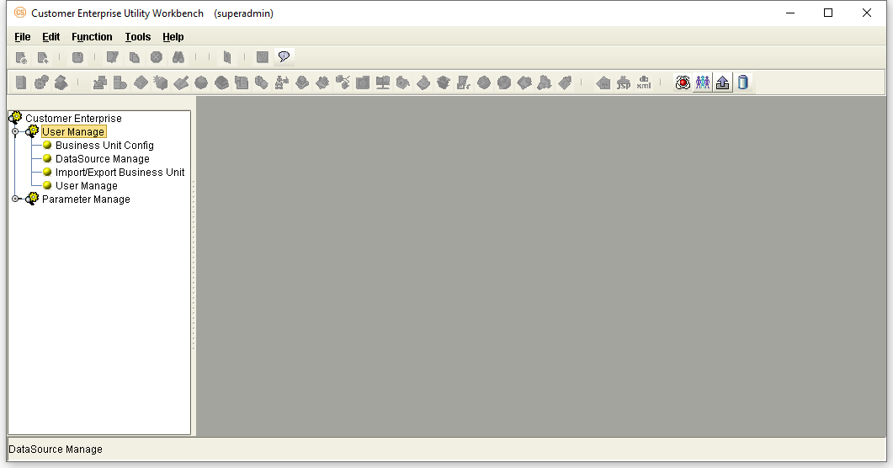
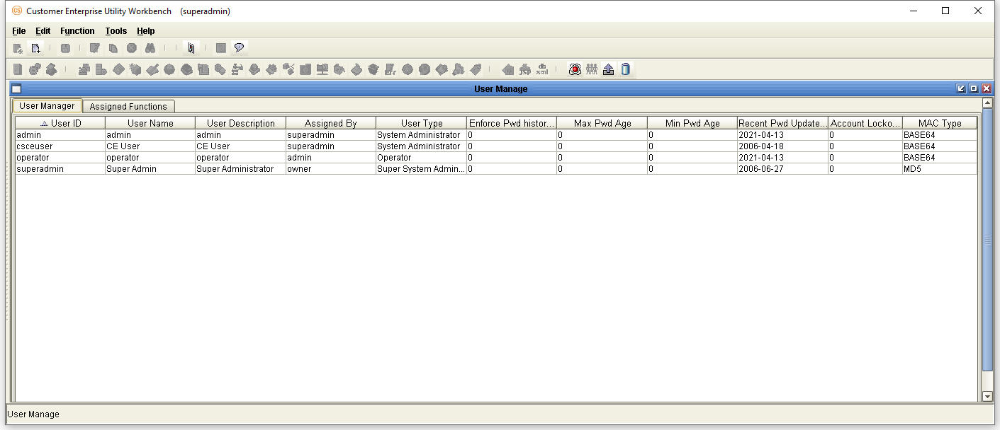
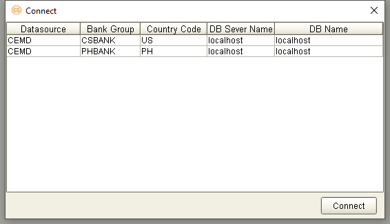
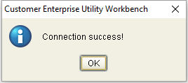
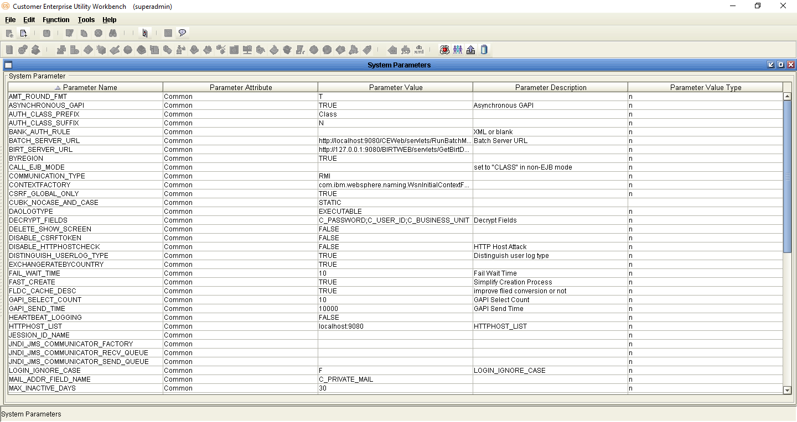

{width="8.625in" height="11.125in"}

+-----------------------------------------------------------------------+
| EXIMBILLS © Trade Finance System                                      |
|                                                                       |
| Customer Enterprise System Version 3.3.6                              |
|                                                                       |
| System Administration Functions                                       |
|                                                                       |
| July 2021                                                             |
+-----------------------------------------------------------------------+
| *Copyright 2021 © China Systems Corporation*                          |
|                                                                       |
| *All Rights Reserved*                                                 |
|                                                                       |
| *This document is protected by United States Copyright Law and may    |
| contain Trade Secrets Information which is proprietary to China       |
| Systems Corporation. No part of this document may be copied,          |
| photocopied, reproduced, translated, distributed, or reduced to any   |
| electronic medium or machine-readable form without prior consent in   |
| writing from China Systems Corporation. The information in this       |
| document may be used only under the terms and conditions of separate  |
| China Systems Corporation license agreements.*                        |
|                                                                       |
| *Information is subject to change without notice. China Systems       |
| Corporation makes no warranties, either expressed or implied, with    |
| respect to the software herein described as to its quality,           |
| performance, including, without limitations to, its fitness for any   |
| particular purpose.*                                                  |
|                                                                       |
| *This document may not reflect total system capability at any         |
| subsequent date as a result of development. It is also possible that  |
| it may contain references to facilities not available on your         |
| computer system. Such references should not be construed to mean that |
| these facilities will necessarily be made available on all types of   |
| computer hardware or in all user locations.*                          |
|                                                                       |
| *China Systems Corporation accepts no responsibility or liability for |
| any damages or loss of business or revenue due to the use of this     |
| document.*                                                            |
|                                                                       |
| *All trademarks, registered trademarks and trade names mentioned in   |
| this document are the sole property of their respective holders.*     |
+-----------------------------------------------------------------------+
| ORDER MORE EXIMBILLS DOCUMENTATION                                    |
|                                                                       |
| Additional copies of Documentation are available for purchase from    |
| China Systems Corporation or through your local EXIMBILLS Support     |
| Office.                                                               |
+-----------------------------------------------------------------------+
| {width="0.7548611111111111in"           |
| height="0.7451388888888889in"}                                        |
|                                                                       |
| CHINA SYSTEMS CORPORATION                                             |
|                                                                       |
| Comments may be addressed to:                                         |
|                                                                       |
| <corporatedocs@chinasystems.com>                                      |
|                                                                       |
| China Systems Corporation Ltd.                                        |
|                                                                       |
| Corner House, 20 Parliament Street                                    |
|                                                                       |
| Hamilton HM12                                                         |
|                                                                       |
| Bermuda                                                               |
+-----------------------------------------------------------------------+

Table of Contents

CE Documentation Library 5

CE Documentation Library 6

Core System Manuals 6

CE Utility Reference Manuals 9

Installation Guides 9

Introduction 10

System Overview 11

Manual Overview 12

Using the CE Utility 13

Running the CE Utility 14

Preparing the CE Utility Files 14

Accessing the CE Utility 16

Navigating the CE Utility Interface 20

CE Utility Functions 21

Menu Bar 23

Toolbar Buttons 25

Popup Menu 30

Generating the XML Parameter Files 31

Building a Product 35

User Management Functions 37

Introduction to the User Management Functions 38

Business Unit Config 39

Configuration 39

Area Tab 40

Bank Group Tab 41

Country Tab 42

Bank Country Group Tab 45

Authorization Level Configuration Tab 47

Procedure 48

Data Source Manage 54

Transaction Data Source Manager Tab 55

Configuration 55

Procedure 58

Utility Data Source Manager Tab 62

Configuration 62

Procedure 64

Import/Export Business Unit 66

User Manage 69

Creating User Profiles 70

Configuration 70

Procedure 73

Assigning Functions to a User 75

Configuration 76

Procedure 78

Assigning Multiple Data Sources to a User 80

Modifying the Assigned Functions of a User 85

Deleting the Assigned Functions of a User 88

Parameter Management Functions 91

Introduction to the Parameter Management Functions 92

System Parameters 93

Defining System Parameters 94

Available Global System Parameters 97

Project-Controlled Parameters 119

Project-Controlled Parameters 120

Glossary 121

Glossary 122

CE Documentation Library {#ce-documentation-library .CS-ChapterTitle}
========================

CE Documentation Library {#ce-documentation-library-1 .CS-head1}
========================

The CE Documentation Library lists all available manuals that serve as
references on the use of the Customer Enterprise system. The documents
are categorized into three groups: Core System Manuals, CE Utility
Reference Manuals, and Installation Guides.

Core System Manuals {#core-system-manuals .CS-head2}
===================

> The CE core system manuals provide details on the setup and
> configuration of various CE parameters, as well as the implementation
> of supplementary functionalities supported by the system.

Archiving and Recovery

This manual is a reference to the Archive and Recovery functionality of
the CE system. Discussions include the required parameter settings for
configuring the relevant functions, as well as examples of how this
functionality is used in transaction processes.

Building a Product

This manual is a reference to the process of building a product in CE.
It provides step-by-step procedures on how to create a basic CE module,
transaction function, and product setting; configure parameters; and
attach components to generate a working business product.

Data Objects

This manual serves as a reference for creating and utilizing data
objects in the CE system. The discussions provide details on how to
build data object templates and data object entities, and how to attach
these to the transaction function screen.

Frequently Asked Questions

This document addresses commonly-asked questions on the Customer
Enterprise system. Issues on the browser-side (transaction processing),
CE Utility, Security Module, and database, among others, are addressed
in the discussions.

Interfacing CE with CS Eximbills

This document discusses the process of interfacing CE with the CS
Eximbills (CSX) back office system. Employing the MQ, FTP, and TCP/IP
communication protocols, the interface process using the XML format is
detailed in this document.

Interfacing CE with Eximbills Enterprise

This document discusses the process of interfacing CE with the Eximbills
Enterprise (EE) back office system. Employing the MQ protocol, the
interface process for the transfer of data between CE and EE using the
XML format is detailed in this document.

Log Settings

This manual provides details on CE logs as well as general instructions
on log configuration in CE. This is especially written for the users who
are in charge of maintaining the CE system.

Look and Feel

This manual is a reference guide on designing the CE user interface
(i.e., the look and feel of the system). Divided into two parts, the
manual provides instructions on creating a) the basic L&F style of CE;
and b) the CE L&F style that incorporates widgets.

Multi-Entity

This manual is a reference on implementing the Multi-Entity
functionality of the CE system. Discussions cover the implementation and
application of CE multi-entity.

Multi-Language

This manual discusses the procedures required in setting up the
Multi-Language functionality of CE as it is run by Administrator- and
Operator-type users. Furthermore, the configuration of certain system
and browser elements as well as the setup of related system parameters
is explained in step-by-step procedures.

Reports

This manual is a comprehensive reference guide on the requirements and
processes involved in building business products and functions that
generate online reports and documents.

Security and System Maintenance Functions

This manual is a comprehensive guide on the security and system
maintenance of the CE system. As such, it includes detailed instructions
for company and company function management, and user and user function
management. Maintenance of key functionalities such as authorization
rules, reference numbers, and other services is covered as well. In
addition, this document discusses the security concepts in CE to assist
users assigned with access rights to the CE Security Module.

Standing Data Functions

This document discusses the functions for the CE standing data that are
maintained by operators (e.g., parties, clauses). It includes sections
for each function, starting with a brief description of the function,
followed by the function input when necessary, and the procedure steps.

Supplementary Functions

This manual is a reference for the CE Utility operator user in
configuring parameter, JSP, and transaction function settings to define
special or supplementary CE functionalities such as uploading images;
sending images and forms to the back-office system; and sending
notifications via e-mail, SMS, and widgets.

System Administration Functions

This manual is a reference for the default Super Administrator user of
the CE Utility in the configuration and maintenance of the CE
environment. It discusses in detail user management and parameter
management.

System Reference

This document serves as a quick reference to the following elements that
are used when configuring specific parameters in the CE Utility: global
system parameters, system parameters, components, XML Generator items,
server side system methods, system JS methods, and APIs.

 {#section .CS-head2}

CE Utility Reference Manuals {#ce-utility-reference-manuals .CS-head2}
============================

The CE Utility Reference set of manuals is a guide on the use of the
Customer Enterprise Utility Workbench, or simply CE Utility. This
reference provides details on every function or feature in the CE
Utility and includes instructions and step-by-step procedures on how to
operate or use the function in relation to operating and maintaining the
CE system and processing a business transaction.

A manual is provided for each function group of the CE Utility:

-   *CE Utility Reference: User Manager Functions*, for the functions
    that belong to the User Manage function group of the CE Utility when
    accessed by an Administrator or Operator user

-   *CE Utility Reference: Parameter Manager Functions*, for the
    functions that belong to the Parameter Manage function group of the
    CE Utility when accessed by an Administrator or Operator user

-   *CE Utility Reference: System Functions*, for the functions that
    belong to the System Function group of the CE Utility.

-   *CE Utility Reference: Transaction Functions*, for the functions
    that belong to the Transaction Function group of the CE Utility.

-   *CE Utility Reference: Product Functions*, for the functions that
    belong to the Product Function group of the CE Utility.

-   *CE Utility Reference: Maintenance Functions*, for the functions
    that belong to the Maintenance function group of the CE Utility.

Installation Guides {#installation-guides .CS-head2}
===================

The CE installation guides are references on the installation and setup
processes of the CE system on different application servers and
databases.

Installation Guide WAS 9 - Oracle 19c

This is a reference for installing the CE system on WebSphere
Application Server Version 9.0.5.6, with an Oracle 19c database. This
includes detailed instructions on configuring the components that are
required to successfully run CE.

 {#section-1 .CS-ChapterTitle}

Introduction {#introduction .CS-ChapterTitle}
============

-   system overview

-   manual overview

System Overview {#system-overview .CS-head1}
===============

The Customer Enterprise Utility Workbench, or CE Utility, is the main
parameter-setting tool of the CE system. It is used to define the
parameters that are required to carry out business operations and system
tasks in CE. Using the CE Utility, parameters may be customized
according to specific business requirements.

The CE Utility is managed by a set of users: the Super Administrator,
the Administrator, and the Operator. System administration tasks, such
as configuring bank-country group settings, defining data sources,
setting global system parameters, and creating new Super Administrator
users, may be performed only by a Super Administrator user.
Administrator and Operator users, on the other hand, manage and
configure parameter settings.

System Administration functions, or those handled by a super
administrator, are classified in the CE Utility into two main function
groups: User Manage and Parameter Manage.

The User Manage function group pertains to functions that are used for
creating and configuring bank-country groups and data sources; creating
other Super Administrator users; and creating Administrator users and
assigning their functions

The Parameter Manage function group pertains to functions that are used
for the maintenance of global system parameters and Language records.

{width="0.3298611111111111in"
height="0.3298611111111111in"}NOTE:

i.  The default Super Administrator logon details in the CE Utility are
    as follows:

\- User ID: superadmin

\- Password: db2admin

ii. The settings that are made by a CE Utility super administrator
    define certain scopes and limitations in the parameters that apply
    on the browser side of the CE system.

Manual Overview {#manual-overview .CS-head1}
===============

Purpose

This manual is a reference for the default Super Administrator user of
the CE Utility in the configuration and maintenance of the CE
environment. It discusses in detail user management and parameter
management.

Audience

This document serves as a guide specifically for, but not limited to,
the following users:

-   Users in-charge of the installation and setup of the CE environment;
    and

-   Users involved in the management, maintenance, and use of the CE
    Utility.

> **[Prerequisites]{.underline}**

Sufficient knowledge of the CE system is required. In addition:

-   Recommended materials before reading this manual:

<!-- -->

-   *CE Installation Guides*

-   *CE Utility: User Manager Functions*

-   *CE Utility: Parameter Manager Functions*

-   *CE Multi-Language Reference*

{width="0.3333333333333333in"
height="0.3333333333333333in"}NOTE: Some features discussed in this
manual have been tested and documented based on an older system version.
Unless otherwise specified, the overall functionality is the same when
recreated in the current version.

Using the CE Utility {#using-the-ce-utility .CS-ChapterTitle}
====================

-   RUNNING THE CE UTILITY

-   GENERATING THE XML PARAMETER FIles

-   Building a product

 {#section-2 .CS-head1}

 {#section-3 .CS-head1}

Running the CE Utility {#running-the-ce-utility .CS-head1}
======================

The Customer Enterprise Utility Workbench, or CE Utility, is the main
tool for building parameters in CE.

Preparing the CE Utility Files {#preparing-the-ce-utility-files .CS-head2}
==============================

> Along with the installation files, the CE Utility folder is provided
> with every CE system release. Prior to using the CE Utility, do the
> following:

i.  Copy the CE Utility folder to the local drive.

ii. Define the required environment variables.

iii. Map the CE directories (e.g., CEWeb.war and CE\_PARA) to the
    > network drive.

  -----------------------------------------------------------------------
  {width="4.85in" height="3.3097222222222222in"}
  -----------------------------------------------------------------------

***Figure 2.*** ***1 CE Utility Folder***

> {width="0.3333333333333333in"
> height="0.3333333333333333in"}**NOTE: **

i.  The default drives defined in the GEN\_XML\_ROOTPATH and
    GEN\_WEB\_ROOTPATH system parameters are O:\\ and P:\\ respectively.
    These drives, if currently not existing, may be created through a
    batch file. While O:\\ and P:\\are the default drives for CE, these
    may be set to any other preferred drive available in the network.

ii. To enable users to use the CE Utility on their own local machines as
    clients connecting to the CE server: 1) Install the Java Development
    Kit (JDK) program; 2) Copy the CE Utility folder; 3) Create the
    JAVA\_HOME environment variable, which must point to this directory:
    \[Java Home\]\\\[Installed JDK\].

iii. For more details on setting up the CE environment, refer to the CE
    installation guides*.*

iv. For details on the CE Utility functions, refer to the *CE Utility
    Reference* manuals.

+-----------------------------------------------------------------------+
| **Batch File for Creating the CE Drives**                             |
|                                                                       |
| The batch file for creating drives contains the following commands:   |
|                                                                       |
| > subst O: /d                                                         |
| >                                                                     |
| > subst P: /d                                                         |
| >                                                                     |
| > subst O: C:\"\\Program                                              |
| > Files\\IBM\\WebSphere\\AppServer\\profiles\\AppSrv01\\installedApps |
| \\DOCS-CEV336Node01Cell\\CE.ear\\CE\_PARA\"                           |
| >                                                                     |
| > subst P: C:\"\\Program                                              |
| > Files\\IBM\\WebSphere\\AppServer\\profiles\\AppSrv01\\installedApps |
| \\DOCS-CEV336Node01Cell\\CE.ear\\CEWeb.war\"                          |
|                                                                       |
| {width="4.8181813210848645in"                  |
| height="0.7698829833770778in"}                                        |
+-----------------------------------------------------------------------+

Accessing the CE Utility {#accessing-the-ce-utility .CS-head2}
========================

> The main program for running the CE Utility is the CEUtility.bat file,
> which is found in the CE Utility folder.

  ----------------------------
  **Do the following . . .**
  ----------------------------

+-----------------------+-----------------------+-----------------------+
| 1\. Run the           |                       | {width="3.5in"      |
| program to access     |                       | height="2.38819444444 |
| the CE Utility.       |                       | 44443in"}             |
|                       |                       |                       |
| **[NOTE]{.underline}* |                       |                       |
| *:                    |                       |                       |
|                       |                       |                       |
| A shortcut for the    |                       |                       |
| CEUtility batch file  |                       |                       |
| can be created on the |                       |                       |
| desktop for easy      |                       |                       |
| access.               |                       |                       |
+-----------------------+-----------------------+-----------------------+
|                       |                       |                       |
+-----------------------+-----------------------+-----------------------+
| 2\. The logon window  |                       | {width="3.5in"      |
| is displayed.         |                       | height="2.34513888888 |
|                       |                       | 8889in"}              |
| To define the         |                       |                       |
| database details,     |                       |                       |
| click on the Profile  |                       |                       |
| button.               |                       |                       |
+-----------------------+-----------------------+-----------------------+
|                       |                       |                       |
+-----------------------+-----------------------+-----------------------+
| 3\. In the Database   |                       | {width="3.5in"      |
| box that is           |                       | height="2.48125in"}   |
| displayed, specify    |                       |                       |
| the required          |                       |                       |
| database details      |                       |                       |
| and click on the      |                       |                       |
| Save button.          |                       |                       |
+-----------------------+-----------------------+-----------------------+
|                       |                       |                       |
+-----------------------+-----------------------+-----------------------+
| 4\. A confirmation    |                       | {width="3.5in"     |
| displayed. Click on   |                       | height="2.47361111111 |
| the OK button.        |                       | 1111in"}              |
+-----------------------+-----------------------+-----------------------+
|                       |                       |                       |
+-----------------------+-----------------------+-----------------------+

+-----------------------+-----------------------+-----------------------+
| **[NOTE]{.underline}* |                       | {width="3.5in"     |
|                       |                       | height="0.79861111111 |
| This new data source  |                       | 11112in"}             |
| setting is saved in   |                       |                       |
| the UserInfo.xml file |                       |                       |
| in the CE Utility     |                       |                       |
| directory.            |                       |                       |
+-----------------------+-----------------------+-----------------------+
|                       |                       |                       |
+-----------------------+-----------------------+-----------------------+
| 5\. The relevant      |                       | {width="3.5in"     |
| password may then     |                       | height="2.34513888888 |
| be specified for      |                       | 8889in"}              |
| logging on the CE     |                       |                       |
| Utility.              |                       |                       |
|                       |                       |                       |
| **[NOTE]{.underline}* |                       |                       |
| *:                    |                       |                       |
|                       |                       |                       |
| For details on        |                       |                       |
| defining CE Utility   |                       |                       |
| user profiles, refer  |                       |                       |
| to the *CE System     |                       |                       |
| Administration        |                       |                       |
| Functions* manual.    |                       |                       |
+-----------------------+-----------------------+-----------------------+
|                       |                       |                       |
+-----------------------+-----------------------+-----------------------+
| 6\. The CE Utility    |                       | {width="3.5in"     |
| displayed.            |                       | height="1.85694444444 |
|                       |                       | 44445in"}             |
+-----------------------+-----------------------+-----------------------+
|                       |                       |                       |
+-----------------------+-----------------------+-----------------------+

+-----------------------+-----------------------+-----------------------+
| 7\. A function is     |                       | {width="3.5in"     |
| or double-clicking    |                       | height="1.85694444444 |
| on the relevant       |                       | 44445in"}             |
| function group and    |                       |                       |
| clicking on the       |                       |                       |
| function name.        |                       |                       |
|                       |                       |                       |
| **[NOTE]{.underline}* |                       |                       |
| *:                    |                       |                       |
|                       |                       |                       |
| A user may only       |                       |                       |
| access and utilize    |                       |                       |
| the functions         |                       |                       |
| assigned to him. For  |                       |                       |
| more details, refer   |                       |                       |
| to the *CE Utility    |                       |                       |
| Reference: User       |                       |                       |
| Manager Functions*    |                       |                       |
| documentation*.*      |                       |                       |
+-----------------------+-----------------------+-----------------------+

> {width="0.3333333333333333in"
> height="0.3333333333333333in"}**NOTE:** It is sometimes necessary to
> assign a new user name and password when the new database is restored
> from a backup file. Restoring the backup file restores the original
> user profiles.
>
> The new user profiles for the CE Utility (as well as the CE Security
> Module) can be defined during the installation process. SQL scripts
> are run to create these profiles. Refer to the CE installation guides
> for more details.

Navigating the CE Utility Interface {#navigating-the-ce-utility-interface .CS-head2}
===================================

> After logging on, the CE Utility window is displayed and parameters
> may then be configured. The functions used for setting up parameters
> may be accessed by clicking on the function name on the Function menu
> or by using the shortcut buttons.
>
> The CE Utility interface also provides ways by which parameters can be
> created, edited, deleted or linked to other operations: menu bar,
> toolbar buttons, and popup menu.

  ------------------------------------------------------------------------
  {width="4.85in" height="2.5729166666666665in"}
  ------------------------------------------------------------------------

***Figure 2.*** ***2 The CE Utility Interface***

> {width="0.3333333333333333in"
> height="0.3333333333333333in"}**NOTE:** A function is only displayed,
> and its corresponding button or menu option enabled, if the user has
> been given the right to access this function. Some options and
> functions are only available to Super Administrator users, while
> others are only accessible to Administrator and Operator users.

####### CE Utility Functions

> The functions that may be accessed for setting up parameters are
> organized together into several function groups. The current available
> function groups and their corresponding functions in the CE Utility
> are as follows:

**User Manager Function Group**

> This function group is comprised of functions used for creating,
> configuring, and exporting Bank-Country group settings; creating new
> users; and configuring data sources. These functions are:

-   Business Unit Config

-   DataSource Manage

-   Import/Export Business Unit

-   User Manage

**Parameter Manage Function Group**

> This function group consists of functions used for maintaining
> system-wide parameters and components. These functions are:

-   AP Server

-   Component Manage

-   Language Configuration

-   System Parameter

-   System Parameters

**System Function Group**

> This function group consists of functions used for maintaining and
> facilitating system-wide tasks, operations, and settings. These
> functions are:

-   Image Type Maintain

-   Output Device

-   Queue Manager

-   STP Setting

-   Time Zone

**Transaction Function Group**

> This function group is comprised of functions used for defining the
> actual business parameters of transaction functions. These facilitate
> the maintenance and processes of the business transaction modules.
> These functions are:

-   Amount/Rate Format

-   Batch Manage

-   Clause

-   DO Get Data

-   Export Setting

-   Form

-   GAPIs Setting

-   Get Data

-   Image Control

-   Message Broker Setting

-   Module & Event

-   Report Template

-   STPs Mapping

-   Sub Tasks

-   SWIFT Config

-   System Maintain

-   Transaction Function

-   Transfer To

-   TSU Mapping

-   Upload Message Setting

-   Web Service Setting

-   Widget Maintain

**Product Function Group**

> This function group consists of functions that are used for creating
> and configuring the products to be accessed and used by the customers
> or end-users. These functions are:

-   Fields Select

-   Inbox

-   Product Authorize

-   Product Authorize Setting

-   Product Catalog

-   Product Function Setting

-   Product Item

**Maintenance Function Group**

> This function group is comprised of functions used for facilitating
> the maintenance of data from CE tables, including fields and error
> settings. These functions are:

-   DB Dictionary

-   Error Handling

-   Error Message Config (CE)

-   Field Conversion

-   Multi Language

-   Page Dictionary

-   XML Generator

####### Menu Bar

> The options on the menu bar are shortcuts to both the common and
> specific functions and tasks of the system.

  -------------------------------------------------------------------------
  {width="2.25in" height="0.22916666666666666in"}
  -------------------------------------------------------------------------

***Figure 2.*** ***3 Menu Bar***

  ---------- -- -----------------
  **Menu**      **Description**
  ---------- -- -----------------

+-----------------------+-----------------------+-----------------------+
| **File**              |                       | The available options |
|                       |                       | in the File menu are: |
|                       |                       |                       |
|                       |                       | -   New: This is used |
|                       |                       |     for creating a    |
|                       |                       |     new parameter or  |
|                       |                       |     rule.             |
|                       |                       |                       |
|                       |                       | -   Save: This is     |
|                       |                       |     used for saving   |
|                       |                       |     the created or    |
|                       |                       |     modified          |
|                       |                       |     settings.         |
|                       |                       |                       |
|                       |                       | -   Close Function:   |
|                       |                       |     This is used for  |
|                       |                       |     closing the       |
|                       |                       |     current function  |
|                       |                       |     window.           |
|                       |                       |                       |
|                       |                       | -   Connect To: This  |
|                       |                       |     is used for       |
|                       |                       |     connecting to     |
|                       |                       |     another Meta data |
|                       |                       |     source.           |
|                       |                       |                       |
|                       |                       | -   Log Off: This is  |
|                       |                       |     used for logging  |
|                       |                       |     off a user that   |
|                       |                       |     is logged on to   |
|                       |                       |     the system        |
|                       |                       |     without exiting   |
|                       |                       |     the system.       |
|                       |                       |                       |
|                       |                       | -   Exit: This is     |
|                       |                       |     used for closing  |
|                       |                       |     the system window |
|                       |                       |     and exiting the   |
|                       |                       |     system.           |
+-----------------------+-----------------------+-----------------------+
|                       |                       |                       |
+-----------------------+-----------------------+-----------------------+
| **Edit**              |                       | The available options |
|                       |                       | in the Edit menu are: |
|                       |                       |                       |
|                       |                       | -   Add: This is used |
|                       |                       |     for adding a      |
|                       |                       |     setting for the   |
|                       |                       |     selected function |
|                       |                       |     or parameter.     |
|                       |                       |                       |
|                       |                       | -   Delete: This is   |
|                       |                       |     used for deleting |
|                       |                       |     or removing an    |
|                       |                       |     existing setting. |
|                       |                       |                       |
|                       |                       | -   Edit: This is     |
|                       |                       |     used for editing  |
|                       |                       |     or modifying      |
|                       |                       |     existing          |
|                       |                       |     settings.         |
|                       |                       |                       |
|                       |                       | -   Copy: This is     |
|                       |                       |     used for copying  |
|                       |                       |     or duplicating a  |
|                       |                       |     selected setting. |
|                       |                       |                       |
|                       |                       | -   Find: This is     |
|                       |                       |     used for finding  |
|                       |                       |     a specific        |
|                       |                       |     setting.          |
+-----------------------+-----------------------+-----------------------+
|                       |                       |                       |
+-----------------------+-----------------------+-----------------------+
| **Function**          |                       | The available options |
|                       |                       | in the Function menu  |
|                       |                       | are:                  |
|                       |                       |                       |
|                       |                       | -   User Manage,      |
|                       |                       |     which displays    |
|                       |                       |     options for       |
|                       |                       |     running User      |
|                       |                       |     Manager functions |
|                       |                       |                       |
|                       |                       | -   Parameter Manage, |
|                       |                       |     which displays    |
|                       |                       |     options for       |
|                       |                       |     running Parameter |
|                       |                       |     Manager functions |
|                       |                       |                       |
|                       |                       | -   System Function,  |
|                       |                       |     which displays    |
|                       |                       |     options for       |
|                       |                       |     running System    |
|                       |                       |     functions         |
|                       |                       |                       |
|                       |                       | -   Transaction       |
|                       |                       |     Function, which   |
|                       |                       |     displays options  |
|                       |                       |     for running       |
|                       |                       |     Transaction       |
|                       |                       |     functions         |
|                       |                       |                       |
|                       |                       | -   Product Function, |
|                       |                       |     which displays    |
|                       |                       |     options for       |
|                       |                       |     running Product   |
|                       |                       |     functions         |
|                       |                       |                       |
|                       |                       | -   Maintenance,      |
|                       |                       |     which displays    |
|                       |                       |     options for       |
|                       |                       |     running           |
|                       |                       |     Maintenance       |
|                       |                       |     functions         |
+-----------------------+-----------------------+-----------------------+
|                       |                       |                       |
+-----------------------+-----------------------+-----------------------+
| **Tools**             |                       | The available options |
|                       |                       | in the Tools menu     |
|                       |                       | are:                  |
|                       |                       |                       |
|                       |                       | -   Toolbar: When     |
|                       |                       |     this option is    |
|                       |                       |     marked, the       |
|                       |                       |     toolbar is        |
|                       |                       |     displayed on the  |
|                       |                       |     CE Utility        |
|                       |                       |     Workbench window. |
|                       |                       |                       |
|                       |                       | -   Function Toolbar: |
|                       |                       |     When this option  |
|                       |                       |     is marked, the    |
|                       |                       |     function toolbar  |
|                       |                       |     is displayed on   |
|                       |                       |     the CE Utility    |
|                       |                       |     Workbench window. |
|                       |                       |                       |
|                       |                       | -   Set User Profile  |
|                       |                       |     DB Info: This     |
|                       |                       |     option is used by |
|                       |                       |     the Super         |
|                       |                       |     Administrator     |
|                       |                       |     user to change    |
|                       |                       |     the user          |
|                       |                       |     information that  |
|                       |                       |     is to be used by  |
|                       |                       |     the CE Utility    |
|                       |                       |     for connecting to |
|                       |                       |     a database.       |
|                       |                       |                       |
|                       |                       | -   Window Style:     |
|                       |                       |     Selecting this    |
|                       |                       |     option displays a |
|                       |                       |     list of CE        |
|                       |                       |     Utility interface |
|                       |                       |     styles: Microsoft |
|                       |                       |     Style, Unix       |
|                       |                       |     Style, Java       |
|                       |                       |     Style, Classic    |
|                       |                       |     Style, and Metal  |
|                       |                       |     Style. The        |
|                       |                       |     preferred style   |
|                       |                       |     may be marked     |
|                       |                       |     accordingly.      |
+-----------------------+-----------------------+-----------------------+
|                       |                       |                       |
+-----------------------+-----------------------+-----------------------+
| **Help**              |                       | The available options |
|                       |                       | in the Help menu are: |
|                       |                       |                       |
|                       |                       | -   Help Topics: This |
|                       |                       |     is *currently not |
|                       |                       |     used*.            |
|                       |                       |                       |
|                       |                       | -   Content Help:     |
|                       |                       |     This is           |
|                       |                       |     *currently not    |
|                       |                       |     used.*            |
|                       |                       |                       |
|                       |                       | -   About Customer    |
|                       |                       |     Enterprise:       |
|                       |                       |     Selecting this    |
|                       |                       |     option displays   |
|                       |                       |     the About         |
|                       |                       |     Customer          |
|                       |                       |     Enterprise        |
|                       |                       |     window, which     |
|                       |                       |     indicates the     |
|                       |                       |     version           |
|                       |                       |     information of    |
|                       |                       |     CE.               |
+-----------------------+-----------------------+-----------------------+

####### Toolbar Buttons

> There are two kinds of toolbars in the CE Utility: the basic toolbar
> and the function toolbar.
>
> **Basic Toolbar**
>
> The following standard buttons are available on the Basic Toolbar of
> the CE Utility window. These are used for performing the basic and
> common tasks of the system.

  ---------------------------------------------------------------
  {width="3.65625in" height="0.3125in"}
  ---------------------------------------------------------------

***Figure 2.*** ***4 Basic Toolbar Buttons***

  ------------ -- -----------------
  **Button**      **Description**
  ------------ -- -----------------

  -------------------------------------------------------------------------------------------- -- ------------------------------------------------------------------------------------
  {width="0.25in" height="0.25in"} **New**                                This button is used for creating a new parameter or rule.
                                                                                                  
  {width="0.25in" height="0.25in"} **Add**                                This button is used for adding a setting for the selected function or parameter.
                                                                                                  
  {width="0.25in" height="0.25in"} **Save**                               This button is used for storing created or modified settings.
                                                                                                  
  {width="0.25in" height="0.25in"} **Edit**                               This button is used for editing or modifying existing settings.
                                                                                                  
  {width="0.25in" height="0.25in"} **Copy**                               This button is used for copying or duplicating a selected setting.
                                                                                                  
  {width="0.25in" height="0.25in"} **Delete**                             This button is used for deleting or removing an existing setting.
                                                                                                  
  {width="0.25in" height="0.25in"} **Find**                               This button is used for finding an existing setting.
                                                                                                  
  {width="0.22916666666666666in" height="0.25in"} **Close Function**      This button is used for closing a function window.
                                                                                                  
  {width="0.25in" height="0.25in"} **Help Topic**                         This button is *currently not used.*
                                                                                                  
  {width="0.25in" height="0.25in"} **About Customer Enterprise**          This button is used for displaying the version information of Customer Enterprise.
  -------------------------------------------------------------------------------------------- -- ------------------------------------------------------------------------------------

> **Function Toolbar**
>
> The buttons on this toolbar are shortcuts to some of the functions
> that are in the Function Group lists of the CE Utility window. The
> buttons may also be accessed from the Function menu on the menu bar.

  ----------------------------------------------------------------------------------------------
  {width="4.864583333333333in" height="0.14583333333333334in"}
  ----------------------------------------------------------------------------------------------

***Figure 2.*** ***5 Function Toolbar Buttons***

  ------------ -- -----------------
  **Button**      **Description**
  ------------ -- -----------------

  ------------------------------------------------------------------------------------------------------------------------------- -- --------------------------------------------------------------------------------------------------------------------------------------------------------------------
  {width="0.22916666666666666in" height="0.22916666666666666in"} **Set System Parameter**                    This button is used for accessing the System Parameter function. The function may also be accessed from the Parameter Manage group in the Function menu.
                                                                                                                                     
  {width="0.22916666666666666in" height="0.22916666666666666in"} **Manage Component**                        This button is used for accessing the Component Manage function. The function may also be accessed from the Parameter Manage group in the Function menu.
                                                                                                                                     
  {width="0.22916666666666666in" height="0.22916666666666666in"} **Calculation**                             This button is *currently not used.*
                                                                                                                                     
  {width="0.22916666666666666in" height="0.22916666666666666in"} **Module/Event Configuration**              This button is used for accessing the Module & Event function. The function may also be accessed from the Transaction Function group in the Function menu.
                                                                                                                                     
  {width="0.22916666666666666in" height="0.22916666666666666in"} **Transaction Function Configuration**      This button is used for accessing the Transaction Function. The function may also be accessed from the Transaction Function group in the Function menu.
                                                                                                                                     
  {width="0.22916666666666666in" height="0.22916666666666666in"} **Form Set**                                This button is used for accessing the Form function. The function may also be accessed from the Transaction Function group in the Function menu.
                                                                                                                                     
  {width="0.22916666666666666in" height="0.22916666666666666in"} **Accounting Rule Setting**                 This button is *currently not used.*
                                                                                                                                     
  {width="0.22916666666666666in" height="0.22916666666666666in"} **Field Conversion**                        This button is used for accessing the Field Conversion function. The function may also be accessed from the Maintenance group in the Function menu.
                                                                                                                                     
  {width="0.22916666666666666in" height="0.22916666666666666in"}**Get Data**                                 This button is used for accessing the Get Data function. The function may also be accessed from the Transaction Function group in the Function menu.
                                                                                                                                     
  {width="0.22916666666666666in" height="0.22916666666666666in"} **Reference Number**                        This button is *currently not used.*
                                                                                                                                     
  {width="0.22916666666666666in" height="0.22916666666666666in"} **Output Device**                           This button is used for accessing the Output Device function. The function may also be accessed from the System Function group in the Function menu.
                                                                                                                                     
  {width="0.22916666666666666in" height="0.22916666666666666in"} **Function Group**                          This button is *currently not used.*
                                                                                                                                     
  {width="0.22916666666666666in" height="0.22916666666666666in"} **Clause**                                  This button is used for accessing the Clause function. The function may also be accessed from the Transaction Function group in the Function menu.
                                                                                                                                     
  {width="0.22916666666666666in" height="0.22916666666666666in"} **SWIFT**                                   This button is used for accessing the SWIFT Config function. The function may also be accessed from the Transaction Function group in the Function menu.
                                                                                                                                     
  {width="0.22916666666666666in" height="0.22916666666666666in"} **Queue Manager**                           This button is used for accessing the Queue Manager function. The function may also be accessed from the System Function group in the Function menu.
                                                                                                                                     
  {width="0.22916666666666666in" height="0.22916666666666666in"} **GAPIs Setting**                           This button is used for accessing the GAPIs Setting function. The function may also be accessed from the Transaction Function group in the Function menu.
                                                                                                                                     
  {width="0.22916666666666666in" height="0.22916666666666666in"} **Time Zone**                               This button is used for setting time zone. The function may also be accessed from the System Function group in the Function menu.
                                                                                                                                     
  {width="0.22916666666666666in" height="0.22916666666666666in"} **STP Setting**                             This button is used for accessing the STP Setting function. The function may also be accessed from the System Function group in the Function menu.
                                                                                                                                     
  {width="0.22916666666666666in" height="0.22916666666666666in"} **Message Broker Setting**                  This button is used for accessing the Message Broker Setting function. The function may also be accessed from the Transaction Function group in the Function menu.
                                                                                                                                     
  {width="0.22916666666666666in" height="0.22916666666666666in"} **Processing Center**                       This button is *currently not used.*
                                                                                                                                     
  {width="0.22916666666666666in" height="0.22916666666666666in"} **Amount Format Setting**                   This button is used for accessing the Amount/Rate Format function. The function may also be accessed from the Transaction Function group in the Function menu.
                                                                                                                                     
  {width="0.22916666666666666in" height="0.22916666666666666in"} **Error Message**                           This button is used for accessing the Error Message Config (CE) function. The function may also be accessed from the Maintenance group in the Function menu.
                                                                                                                                     
  {width="0.22916666666666666in" height="0.22916666666666666in"} **Say Total**                               This button is *currently not used.*
                                                                                                                                     
  {width="0.22916666666666666in" height="0.22916666666666666in"} **Holiday**                                 This button is *currently not used.*
                                                                                                                                     
  {width="0.22916666666666666in" height="0.22916666666666666in"} **Report**                                  This button is *currently not used.*
                                                                                                                                     
  {width="0.22916666666666666in" height="0.22916666666666666in"} **Transfer To**                             This button is used for accessing the Transfer To function. The function may also be accessed from the Transaction Function group in the Function menu.
                                                                                                                                     
  {width="0.22916666666666666in" height="0.22916666666666666in"} **Archiving**                               This button is *currently not used.*
                                                                                                                                     
  {width="0.22916666666666666in" height="0.22916666666666666in"} **DB Dictionary**                           This button is used for accessing the DB Dictionary function. The function may also be accessed from the Maintenance group in the Function menu.
                                                                                                                                     
  {width="0.22916666666666666in" height="0.22916666666666666in"} **Calculation Constant**                    This button is *currently not used.*
                                                                                                                                     
  {width="0.22916666666666666in" height="0.22916666666666666in"} **XML Generator**                           This button is used for accessing the XML Generator function. The function may also be accessed from the Maintenance group in the Function menu.
                                                                                                                                     
  {width="0.22916666666666666in" height="0.22916666666666666in"} **Business Unit**                           This button is used for accessing the Business Unit Config function. The function may also be accessed from the User Manage group in the Function menu.
                                                                                                                                     
  {width="0.22916666666666666in" height="0.22916666666666666in"} **User Manager**                            This button is used for accessing the User Manage function. The function may also be accessed from the User Manage group in the Function menu.
                                                                                                                                     
  {width="0.22916666666666666in" height="0.22916666666666666in"} **Import/Export Business Unit**             This button is used for accessing the Import/Export Business Unit function. The function may also be accessed from the User Manage group in the Function menu.
                                                                                                                                     
  {width="0.22916666666666666in" height="0.22916666666666666in"} **DataSource Manager**                      This function is used for accessing the Data Source Manage function. The function may also be accessed from the User Manage group in the Function menu.
  ------------------------------------------------------------------------------------------------------------------------------- -- --------------------------------------------------------------------------------------------------------------------------------------------------------------------

####### Popup Menu

> Inside a function or configuration window, options may be provided in
> the form of a popup menu. This menu is displayed by right-clicking on
> the relevant window section or on the relevant information.

  -------------------------------------------------------------------------------------
  {width="1.3644127296587927in" height="2.280964566929134in"}
  -------------------------------------------------------------------------------------

***Figure 2.*** ***6 Popup Menu***

> In a popup window, the following options may be made available:

-   New

-   Add

-   Save

-   Edit

-   Copy

-   Delete

-   Find

-   Sharable

-   Help

Generating the XML Parameter Files {#generating-the-xml-parameter-files .CS-head1}
==================================

The created parameters and business logic are stored in the database as
Meta data. For this Meta data to be accessible to the application server
(AP) and the web server, it has to be converted to XML -- the format
used for the communication between the client and the server.

The XML files are generated through the XML Generator function of the
Maintenance function group in the CE Utility. In most cases, the XML
Generator function must be run when a parameter is created or modified
using the functions discussed in this document.

  --------------------------------
  **Do the following . .** **.**
  --------------------------------

+-----------------------+-----------------------+-----------------------+
| 1\. Log on CE         |                       | {width="3.5in"     |
| Administrator or      |                       | height="2.34513888888 |
| Operator user with    |                       | 8889in"}              |
| rights to the XML     |                       |                       |
| Generator function.   |                       |                       |
+-----------------------+-----------------------+-----------------------+
|                       |                       |                       |
+-----------------------+-----------------------+-----------------------+
| 2\. The CE Utility    |                       | {width="3.5in"     |
| displayed.            |                       | height="1.85694444444 |
|                       |                       | 44445in"}             |
| Run the XML Generator |                       |                       |
| function from the     |                       |                       |
| Maintenance function  |                       |                       |
| group.                |                       |                       |
|                       |                       |                       |
| Alternatively, click  |                       |                       |
| on the XML Generator  |                       |                       |
| button in the         |                       |                       |
| function toolbar.     |                       |                       |
+-----------------------+-----------------------+-----------------------+
|                       |                       |                       |
+-----------------------+-----------------------+-----------------------+
| 3\. The XML           |                       | {width="3.5in"     |
| window is             |                       | height="1.85694444444 |
| displayed.            |                       | 44445in"}             |
|                       |                       |                       |
| When there are newly  |                       |                       |
| defined or modified   |                       |                       |
| parameters, the Meta  |                       |                       |
| Data to XML window is |                       |                       |
| also displayed. It    |                       |                       |
| lists these           |                       |                       |
| parameters for easy   |                       |                       |
| selection. In this    |                       |                       |
| case, the parameter   |                       |                       |
| can be selected from  |                       |                       |
| this window and the   |                       |                       |
| Apply button clicked. |                       |                       |
| Afterwards, proceed   |                       |                       |
| to Step 5.            |                       |                       |
|                       |                       |                       |
| Alternatively, the    |                       |                       |
| Meta data or          |                       |                       |
| parameter can be      |                       |                       |
| manually selected     |                       |                       |
| from the main XML     |                       |                       |
| Generator window. In  |                       |                       |
| this case, click on   |                       |                       |
| the Close button of   |                       |                       |
| the Meta Data to XML  |                       |                       |
| window and proceed to |                       |                       |
| Step 4.               |                       |                       |
+-----------------------+-----------------------+-----------------------+
|                       |                       |                       |
+-----------------------+-----------------------+-----------------------+
| 4\. Double-click on   |                       | {width="3.5in"     |
| parameter type from   |                       | height="1.85694444444 |
| the XML Generator     |                       | 44445in"}             |
| window.               |                       |                       |
+-----------------------+-----------------------+-----------------------+
|                       |                       |                       |
+-----------------------+-----------------------+-----------------------+
| 5\. Depending on the  |                       | {width="3.5in"     |
| type, an XML          |                       | height="1.85694444444 |
| configuration         |                       | 44445in"}             |
| window may be         |                       |                       |
| displayed. In other   |                       |                       |
| cases, the process    |                       |                       |
| directly proceeds     |                       |                       |
| to Step 6.            |                       |                       |
|                       |                       |                       |
| If the configuration  |                       |                       |
| window is displayed,  |                       |                       |
| indicate the exact or |                       |                       |
| any additional        |                       |                       |
| setting required to   |                       |                       |
| generate the relevant |                       |                       |
| XML files. When the   |                       |                       |
| specifications are    |                       |                       |
| defined click on the  |                       |                       |
| Save button           |                       |                       |
+-----------------------+-----------------------+-----------------------+
|                       |                       |                       |
+-----------------------+-----------------------+-----------------------+
| 6\. A message is      |                       | {width="3.5in"     |
| confirming if the     |                       | height="1.13472222222 |
| XML files are to be   |                       | 22222in"}             |
| generated on the      |                       |                       |
| system path.          |                       |                       |
+-----------------------+-----------------------+-----------------------+
|                       |                       |                       |
+-----------------------+-----------------------+-----------------------+
| **[NOTE]{.underline}* |                       | {width="3.5in"     |
|                       |                       | height="1.85694444444 |
| The path of the XML   |                       | 44445in"}             |
| files is defined      |                       |                       |
| through the           |                       |                       |
| GEN\_XML\_ROOTPATH    |                       |                       |
| Utility Workbench     |                       |                       |
| system parameter.     |                       |                       |
| This system parameter |                       |                       |
| is configured through |                       |                       |
| the System Parameter  |                       |                       |
| function from the     |                       |                       |
| Parameter Manage      |                       |                       |
| function group.       |                       |                       |
+-----------------------+-----------------------+-----------------------+
|                       |                       |                       |
+-----------------------+-----------------------+-----------------------+
| 7\. To save the XML   |                       | {width="3.5in"     |
| relevant system       |                       | height="2.47083333333 |
| path, click on the    |                       | 3333in"}              |
| Yes button.           |                       |                       |
|                       |                       |                       |
| To specify another    |                       |                       |
| path, click on the No |                       |                       |
| button. On the Save   |                       |                       |
| dialog box that is    |                       |                       |
| displayed, browse for |                       |                       |
| the path and click on |                       |                       |
| the Save button.      |                       |                       |
+-----------------------+-----------------------+-----------------------+
|                       |                       |                       |
+-----------------------+-----------------------+-----------------------+
| 8\. When the          |                       | {width="3.5in"     |
| are generated, the    |                       | height="1.85694444444 |
| system displays a     |                       | 44445in"}             |
| confirmation          |                       |                       |
| message.              |                       |                       |
|                       |                       |                       |
| **[NOTE]{.underline}* |                       |                       |
| *:                    |                       |                       |
|                       |                       |                       |
| To hide the details   |                       |                       |
| on the paths of the   |                       |                       |
| generated XML files,  |                       |                       |
| click on the Hide     |                       |                       |
| button.               |                       |                       |
+-----------------------+-----------------------+-----------------------+
|                       |                       |                       |
+-----------------------+-----------------------+-----------------------+
| **[NOTE]{.underline}* |                       | {width="3.5in"     |
|                       |                       | height="3.15208333333 |
| Check the indicated   |                       | 3333in"}              |
| path(s) to see the    |                       |                       |
| generated XML files.  |                       |                       |
+-----------------------+-----------------------+-----------------------+

Building a Product {#building-a-product .CS-head1}
==================

When building a product in the CE Utility, a few prerequisites are
required to be met to make sure that modules or products are built in
accordance with the bank's requirements. One step is the GAP analysis
which involves an evaluation of transaction requirements, based on the
process flow (e.g., fields, clauses, forms, and interfaces). These are
necessary for identifying the fields required for anticipating the
required output. When the analysis has been completed, the project team
can now begin the process of building a product for the bank's
customers.

The following are steps in building a product:

1.  **Access the CE Utility**. To access the CE Utility for building
    parameters, an Operator user must be created by an Administrator
    user. This is set up through the User Manager function in the User
    Manage function group.

2.  **Set up the module and events**. This involves naming the module
    and the projected events that manage the transaction flow within the
    module. This is set up in the Module and Event function in CE
    Utility.

3.  **Set up the transaction tables.** This involves creating the tables
    in the DB Dictionary function in CE Utility. There can be different
    types of tables but only three are mandatory for a CE module:
    master, ledger, and event.

{width="0.3333333333333333in"
height="0.3333333333333333in"}NOTE: It is possible to create tables
directly into the database by running SQL scripts in the database. In
this case, tables can be created before modules and events. It is
recommended, however, to use the DB Dictionary for creating tables.

4.  **Add fields to the transaction table**. Fields must be added to a
    transaction table and field properties defined for the processing
    and storage of data. These can be done through the DB Dictionary
    function in CE Utility.

5.  **Set up the transaction functions**. This involves creating the
    functions that correspond to actual business transaction processes.
    This is done through Transaction Function in the Transaction
    Function group.

6.  **Set up the transaction parameters**. This involves designing the
    transaction screen, defining attribute and catalog settings, and
    attaching these parameters to the transaction function. These can be
    done through Transaction Function in CE Utility.

7.  **Create the product.** The product is the actual functionality
    accessed and run by the end-user. This process of creating a product
    involves setting up the product group, product, and product
    function, and defining product catalog settings.

8.  **Define authorization rules**. Authorization rules are set to
    further define or set limits for authorizing transactions.

9.  **Calculation.** This involves configuring the transaction JS files
    and defining calculation functions using available system methods.
    There are three JS files that have to be configured: the Module Base
    JS file, Event JS file, and Function JS file.

10. **Define the settings for the transaction input.** Certain functions
    may be added to aid in the input of data into the transaction. The
    CE Utility provides options for setting up field conversion rules,
    lookup buttons, customer reference numbers, clauses, dropdown lists,
    and data objects for this purpose.

11. **Define the settings for the transaction output.** Some business
    transactions involve output generation (i.e., Forms). To make this
    option available, certain settings must be configured using the
    functions from the Transaction Function group in CE Utility.

12. **Define the security settings in the CE browser.** The products and
    functions created are assigned to an end-user through the
    browser-side Security and System Maintenance functions.

{width="0.3333333333333333in"
height="0.3333333333333333in"}NOTE: The browser-side security and system
maintenance functions of CE are often collectively called the Security
Module.

13. **Add the Inbox functionality.** Another way of accessing a product
    or a transaction for further processing is through the Customer
    Inbox. This can be set up through the Inbox function in CE Utility.

{width="0.3333333333333333in"
height="0.3333333333333333in"}NOTE: For more details on configuring
different parameters in CE, refer to the *CE Utility Reference*
manuals*.*

 {#section-4 .CS-ChapterTitle}

User Management Functions {#user-management-functions .CS-ChapterTitle}
=========================

-   introduction to the user management functions

-   business unit config

-   data source manage

-   import / export business unit

-   user manage

Introduction to the User Management Functions {#introduction-to-the-user-management-functions .CS-head1}
=============================================

The User Manage function group consists of functions used for creating,
configuring, and exporting Bank Group - Country setups; creating new
users and assigning access rights; and configuring data sources.

The functions that are available in this function group depend on the
type of CE Utility user that is logged on the system. For the Super
Administrator user, the following functions are available in this
function group:

-   Business Unit Config

-   Data Source Manage

-   Import / Export Business Unit

-   User Manage

  ------------------------------------------------------------------------
  {width="4.85in" height="2.5409722222222224in"}
  ------------------------------------------------------------------------

Figure 3. User Manage Function Group

{width="0.3298611111111111in"
height="0.3298611111111111in"}NOTE: There are User Manage functions that
are also available to, but used differently by, Administrator and
Operator users. Refer to the *CE Utility Reference: User Manager
Functions* document.

 {#section-5 .CS-head1}

Business Unit Config {#business-unit-config .CS-head1}
====================

The Business Unit Config function is used to define several
inter-related information pertaining to a working CE environment: area,
bank group, country, sub-country, bank-country group, and authorization
level. The defined settings are used in the configuration of transaction
and security parameters.

Configuration {#configuration .CS-head2}
=============

The Business Unit Config function consists of these tabs: Area, Bank
Group, Country, Bank Country Group, and Authorization Level
Configuration.

  ------------------------------------------------------------------------
  {width="4.85in" height="2.5409722222222224in"}
  ------------------------------------------------------------------------

Figure 3. Business Unit Config Function Window

> {width="0.3298611111111111in"
> height="0.3298611111111111in"}**NOTE:** The Sub Country tab is
> *currently not used*.

####### 

### Area Tab {#area-tab .CS-head3}

An area code may pertain to a region, a continent, or any grouping of
several countries. The Area tab of the Business Unit Config function
window is used for defining these area codes.

  -------------------------------------------------------------------------------------
  {width="3.822438757655293in" height="1.7081200787401576in"}
  -------------------------------------------------------------------------------------

Figure 3. New Area Code Window

When defining a new area code, the following details are required in the
New Area Code window.

  ------- -- -------------------
  Field      Field Description
  ------- -- -------------------

+-----------------------+-----------------------+-----------------------+
| **Area Code**         |                       | This pertains to the  |
|                       |                       | region code, which    |
|                       |                       | may be an             |
|                       |                       | alphanumeric value    |
|                       |                       | with up to five       |
|                       |                       | characters. It is     |
|                       |                       | automatically         |
|                       |                       | specified in capital  |
|                       |                       | letters.              |
|                       |                       |                       |
|                       |                       | Once the Area record  |
|                       |                       | is created, this      |
|                       |                       | information cannot be |
|                       |                       | modified.             |
+-----------------------+-----------------------+-----------------------+
|                       |                       |                       |
+-----------------------+-----------------------+-----------------------+
| **Area Description**  |                       | This pertains to the  |
|                       |                       | name or a short       |
|                       |                       | description of the    |
|                       |                       | area code, which may  |
|                       |                       | be an alphanumeric    |
|                       |                       | value with up to 20   |
|                       |                       | characters. Special   |
|                       |                       | characters are also   |
|                       |                       | allowed.              |
+-----------------------+-----------------------+-----------------------+

####### 

### Bank Group Tab {#bank-group-tab .CS-head3}

A bank group is a group of banks which business transactions are managed
and processed by CE.

  ------------------------------------------------------------------------
  {width="4.85in" height="2.0631944444444446in"}
  ------------------------------------------------------------------------

Figure 3. New Bank Group Window

When defining a new bank group, the following details are required in
the New Bank Group window.

  ------- -- -------------------
  Field      Field Description
  ------- -- -------------------

+-----------------------+-----------------------+-----------------------+
| **Bank Group ID**     |                       | This pertains to the  |
|                       |                       | bank group Id, which  |
|                       |                       | may be an             |
|                       |                       | alphanumeric value of |
|                       |                       | up to nine            |
|                       |                       | characters. It is     |
|                       |                       | automatically         |
|                       |                       | specified in capital  |
|                       |                       | letters.              |
|                       |                       |                       |
|                       |                       | Once the Bank Group   |
|                       |                       | record is created,    |
|                       |                       | this information      |
|                       |                       | cannot be modified.   |
+-----------------------+-----------------------+-----------------------+
|                       |                       |                       |
+-----------------------+-----------------------+-----------------------+
| **Bank Group Name**   |                       | This pertains to the  |
|                       |                       | name of the bank      |
|                       |                       | group; this may also  |
|                       |                       | be set to the name of |
|                       |                       | the bank concatenated |
|                       |                       | to the area or region |
|                       |                       | name.                 |
|                       |                       |                       |
|                       |                       | This field accepts an |
|                       |                       | alphanumeric value    |
|                       |                       | with up to 70         |
|                       |                       | characters. Special   |
|                       |                       | characters are also   |
|                       |                       | allowed.              |
+-----------------------+-----------------------+-----------------------+

####### 

### Country Tab {#country-tab .CS-head3}

A Country profile is created primarily to determine the currency, date
format defaults, and related details that are assigned to a particular
country. These Country records are maintained by the system as standing
data.

  -------------------------------------------------------------------------------------
  {width="4.436945538057743in" height="6.7804024496937885in"}
  -------------------------------------------------------------------------------------

Figure 3. New Country Code Window

When creating a Country profile, the following fields are required in
the New Country Code window.

  ------- -- -------------------
  Field      Field Description
  ------- -- -------------------

+-----------------------+-----------------------+-----------------------+
|                       |                       | ***Area***            |
+-----------------------+-----------------------+-----------------------+
|                       |                       |                       |
+-----------------------+-----------------------+-----------------------+
| **Area Code**         |                       | This refers to the    |
|                       |                       | region code that      |
|                       |                       | applies to the        |
|                       |                       | country. Select the   |
|                       |                       | relevant area code    |
|                       |                       | from the dropdown     |
|                       |                       | list.                 |
|                       |                       |                       |
|                       |                       | **[NOTE:]{.underline} |
|                       |                       | **                    |
|                       |                       |                       |
|                       |                       | The Area Code         |
|                       |                       | dropdown list options |
|                       |                       | are defined in the    |
|                       |                       | Area tab of the       |
|                       |                       | Business Unit Config  |
|                       |                       | function window.      |
+-----------------------+-----------------------+-----------------------+
|                       |                       |                       |
+-----------------------+-----------------------+-----------------------+
| **Area Code Desc**    |                       | This field            |
|                       |                       | automatically         |
|                       |                       | displays the          |
|                       |                       | description of the    |
|                       |                       | selected area code.   |
+-----------------------+-----------------------+-----------------------+
|                       |                       |                       |
+-----------------------+-----------------------+-----------------------+
|                       |                       | ***Country***         |
+-----------------------+-----------------------+-----------------------+
|                       |                       |                       |
+-----------------------+-----------------------+-----------------------+
| **Country Code**      |                       | This refers to the    |
|                       |                       | primary country code  |
|                       |                       | of the country.       |
+-----------------------+-----------------------+-----------------------+
|                       |                       |                       |
+-----------------------+-----------------------+-----------------------+
| **Country Code 1**    |                       | This refers to an     |
|                       |                       | alternate country     |
|                       |                       | code for the country. |
+-----------------------+-----------------------+-----------------------+
|                       |                       |                       |
+-----------------------+-----------------------+-----------------------+
| **Country Code 2**    |                       | This refers to a      |
|                       |                       | secondary alternate   |
|                       |                       | code for the country. |
+-----------------------+-----------------------+-----------------------+
|                       |                       |                       |
+-----------------------+-----------------------+-----------------------+
| **Country Name**      |                       | This refers to the    |
|                       |                       | actual name of the    |
|                       |                       | country.              |
+-----------------------+-----------------------+-----------------------+
|                       |                       |                       |
+-----------------------+-----------------------+-----------------------+
| **Local CCY**         |                       | This refers to the    |
|                       |                       | local currency of the |
|                       |                       | country.              |
+-----------------------+-----------------------+-----------------------+
|                       |                       |                       |
+-----------------------+-----------------------+-----------------------+
| **Second CCY**        |                       | This refers to the    |
|                       |                       | secondary currency    |
|                       |                       | that applies to the   |
|                       |                       | country.              |
+-----------------------+-----------------------+-----------------------+
|                       |                       |                       |
+-----------------------+-----------------------+-----------------------+
| **EUR Flag**          |                       | This is *currently    |
|                       |                       | not used*.            |
+-----------------------+-----------------------+-----------------------+
|                       |                       |                       |
+-----------------------+-----------------------+-----------------------+
| **Date Format**       |                       | This refers to the    |
|                       |                       | date format that      |
|                       |                       | applies to the        |
|                       |                       | country. Select the   |
|                       |                       | relevant format from  |
|                       |                       | the dropdown list.    |
+-----------------------+-----------------------+-----------------------+
|                       |                       |                       |
+-----------------------+-----------------------+-----------------------+
| **Decimal**           |                       | This refers to the    |
|                       |                       | number of decimal     |
|                       |                       | places.               |
+-----------------------+-----------------------+-----------------------+
|                       |                       |                       |
+-----------------------+-----------------------+-----------------------+
| **Integer**           |                       | This refers to the    |
|                       |                       | integer delimiter     |
|                       |                       | that applies to the   |
|                       |                       | country.              |
+-----------------------+-----------------------+-----------------------+
|                       |                       |                       |
+-----------------------+-----------------------+-----------------------+
| **CCY Major**         |                       | This refers to the    |
|                       |                       | term used for the     |
|                       |                       | major denomination of |
|                       |                       | the country's         |
|                       |                       | currency (e.g.,       |
|                       |                       | Dollars).             |
+-----------------------+-----------------------+-----------------------+
|                       |                       |                       |
+-----------------------+-----------------------+-----------------------+
| **CCY Minor**         |                       | This refers to the    |
|                       |                       | term used for the     |
|                       |                       | minor denomination of |
|                       |                       | the country's         |
|                       |                       | currency (e.g.,       |
|                       |                       | Centavos).            |
+-----------------------+-----------------------+-----------------------+
|                       |                       |                       |
+-----------------------+-----------------------+-----------------------+
| **Time Zone**         |                       | Select the time zone  |
|                       |                       | that applies to the   |
|                       |                       | country from the      |
|                       |                       | dropdown list.        |
+-----------------------+-----------------------+-----------------------+
|                       |                       |                       |
+-----------------------+-----------------------+-----------------------+
|                       |                       | ***Credit***          |
+-----------------------+-----------------------+-----------------------+
|                       |                       |                       |
+-----------------------+-----------------------+-----------------------+
| **Credit Rate**       |                       | This is *currently    |
|                       |                       | not used.*            |
+-----------------------+-----------------------+-----------------------+
|                       |                       |                       |
+-----------------------+-----------------------+-----------------------+
| **Credit Store**      |                       | This is *currently    |
|                       |                       | not used.*            |
+-----------------------+-----------------------+-----------------------+

{width="0.3298611111111111in"
height="0.3298611111111111in"}NOTE: Because CE does not yet support
copying of modules, the default '\_SY' country record is *currently not
used*.

 {#section-9 .CS-head2}

### Bank Country Group Tab {#bank-country-group-tab .CS-head3}

The bank-country combination is defined to facilitate sharing of
parameters and authorization rules among bank groups that utilize
similar rules and parameters for business transaction processing and
record management.

The system only recognizes the combination of bank group and country or,
simply, bank-country group. A bank-country group follows this naming
convention: \<Bank Group\>\_\<Country Code\>

**[EXAMPLE:]{.underline}**

CSBANK\_US

  -------------------------------------------------------------------------------------
  {width="4.166146106736658in" height="3.1246095800524936in"}
  -------------------------------------------------------------------------------------

Figure 3. Bank Country Group Window

When defining a new bank-country group, the following details are
required in the Bank Country Group window.

  ------- -- -------------------
  Field      Field Description
  ------- -- -------------------

+-----------------------+-----------------------+-----------------------+
|                       |                       | ***Set Group ***      |
+-----------------------+-----------------------+-----------------------+
|                       |                       |                       |
+-----------------------+-----------------------+-----------------------+
| **Bank Group ID**     |                       | Select the bank group |
|                       |                       | from the dropdown     |
|                       |                       | list.                 |
|                       |                       |                       |
|                       |                       | Once the bank-country |
|                       |                       | group record is       |
|                       |                       | created, this         |
|                       |                       | information cannot be |
|                       |                       | modified.             |
|                       |                       |                       |
|                       |                       | **[NOTE:]{.underline} |
|                       |                       | **                    |
|                       |                       |                       |
|                       |                       | The Bank Group Id     |
|                       |                       | dropdown list values  |
|                       |                       | are defined in the    |
|                       |                       | Bank Group tab of the |
|                       |                       | Business Unit Config  |
|                       |                       | function window.      |
+-----------------------+-----------------------+-----------------------+
|                       |                       |                       |
+-----------------------+-----------------------+-----------------------+
| **Country Code**      |                       | Select the country    |
|                       |                       | code group from the   |
|                       |                       | dropdown list.        |
|                       |                       |                       |
|                       |                       | Once the bank-country |
|                       |                       | group record is       |
|                       |                       | created, this         |
|                       |                       | information cannot be |
|                       |                       | modified.             |
|                       |                       |                       |
|                       |                       | **[NOTE:]{.underline} |
|                       |                       | **                    |
|                       |                       |                       |
|                       |                       | The Country Code      |
|                       |                       | dropdown list values  |
|                       |                       | are defined in the    |
|                       |                       | Country Code tab of   |
|                       |                       | the of the Business   |
|                       |                       | Unit Config function  |
|                       |                       | window.               |
+-----------------------+-----------------------+-----------------------+
|                       |                       |                       |
+-----------------------+-----------------------+-----------------------+
|                       |                       | ***Data Source        |
|                       |                       | Setting***            |
+-----------------------+-----------------------+-----------------------+
|                       |                       |                       |
+-----------------------+-----------------------+-----------------------+
| **Meta**              |                       | Select from the       |
|                       |                       | dropdown list the     |
|                       |                       | Meta data source to   |
|                       |                       | be assigned to the    |
|                       |                       | indicated bank        |
|                       |                       | group-country         |
|                       |                       | setting.              |
+-----------------------+-----------------------+-----------------------+
|                       |                       |                       |
+-----------------------+-----------------------+-----------------------+
| **Transaction**       |                       | Select from the       |
|                       |                       | dropdown list the     |
|                       |                       | transaction data      |
|                       |                       | source to be assigned |
|                       |                       | to the indicated bank |
|                       |                       | group-country         |
|                       |                       | setting.              |
+-----------------------+-----------------------+-----------------------+

### Authorization Level Configuration Tab {#authorization-level-configuration-tab .CS-head3}

An authorization level is defined to determine the maximum allowable
amount that may be released by a bank-country group. Each level
corresponds to an authorization amount limit for transaction processing.

  -------------------------------------------------------------------------------------
  {width="4.166146106736658in" height="1.8747659667541556in"}
  -------------------------------------------------------------------------------------

Figure 3. Authorization Level Configuration Window

When defining a new authorization level setting, the following details
are required in the Authorization Level Configuration window.

  ------- -- -------------------
  Field      Field Description
  ------- -- -------------------

+-----------------------+-----------------------+-----------------------+
| **Bank Country        |                       | Select the            |
| Group**               |                       | bank-country group    |
|                       |                       | from the dropdown     |
|                       |                       | list.                 |
|                       |                       |                       |
|                       |                       | **[NOTE:]{.underline} |
|                       |                       | **                    |
|                       |                       |                       |
|                       |                       | The Bank Country      |
|                       |                       | Group dropdown list   |
|                       |                       | values are defined in |
|                       |                       | the Bank Country      |
|                       |                       | Group tab of the of   |
|                       |                       | the Business Unit     |
|                       |                       | Config function       |
|                       |                       | window.               |
+-----------------------+-----------------------+-----------------------+
|                       |                       |                       |
+-----------------------+-----------------------+-----------------------+
| **Max Authorization   |                       | Specify the maximum   |
| Level**               |                       | transaction           |
|                       |                       | authorization level   |
|                       |                       | for the indicated     |
|                       |                       | bank-country group.   |
|                       |                       |                       |
|                       |                       | Twenty authorization  |
|                       |                       | level options are     |
|                       |                       | provided in the       |
|                       |                       | dropdown list. Of     |
|                       |                       | these options, 1 is   |
|                       |                       | the lowest and 20 is  |
|                       |                       | the highest.          |
+-----------------------+-----------------------+-----------------------+

> {width="0.3298611111111111in"
> height="0.3298611111111111in"}**NOTE:** An authorization level for a
> bank-country group is also called a class number. This is used in
> authorization settings configured through the CE Security Module.
> Refer to the *CE Security and System Maintenance Functions* manual for
> details.

Procedure {#procedure .CS-head2}
=========

To define the basic details of a CE unit or environment:

  ----------------------------
  **Do the following . . .**
  ----------------------------

+-----------------------+-----------------------+-----------------------+
| 1\. Run the Business  |                       | {width="3.5in"     |
| function from the     |                       | height="1.83402777777 |
| User Manage           |                       | 77778in"}             |
| function group.       |                       |                       |
+-----------------------+-----------------------+-----------------------+
|                       |                       |                       |
+-----------------------+-----------------------+-----------------------+
| 2\. The Business      |                       | {width="3.5in"     |
| function window is    |                       | height="1.83402777777 |
| displayed.            |                       | 77778in"}             |
|                       |                       |                       |
| This is comprised of  |                       |                       |
| the following tabs:   |                       |                       |
| Area, Bank Group,     |                       |                       |
| Country, Sub Country, |                       |                       |
| Bank Country Group,   |                       |                       |
| and Authorization     |                       |                       |
| Level Configuration.  |                       |                       |
|                       |                       |                       |
| **[NOTE:]{.underline} |                       |                       |
| **                    |                       |                       |
|                       |                       |                       |
| The Sub Country tab   |                       |                       |
| is *currently not     |                       |                       |
| used*.                |                       |                       |
+-----------------------+-----------------------+-----------------------+
|                       |                       |                       |
+-----------------------+-----------------------+-----------------------+
| 3\. To define a new   |                       | {width="3.5in"     |
| the Area tab.         |                       | height="1.83402777777 |
| Right-click on the    |                       | 77778in"}             |
| Config section and    |                       |                       |
| select the Add        |                       |                       |
| option.               |                       |                       |
+-----------------------+-----------------------+-----------------------+
|                       |                       |                       |
+-----------------------+-----------------------+-----------------------+
| The New Area Code     |                       | {width="3.5in"     |
|                       |                       | height="1.83402777777 |
| Specify the relevant  |                       | 77778in"}             |
| details and click on  |                       |                       |
| the Save button.      |                       |                       |
+-----------------------+-----------------------+-----------------------+
|                       |                       |                       |
+-----------------------+-----------------------+-----------------------+
| The record is saved   |                       | {width="3.5in"     |
| grid.                 |                       | height="1.83402777777 |
|                       |                       | 77778in"}             |
| To define another     |                       |                       |
| area code, specify    |                       |                       |
| the required details  |                       |                       |
| in the blank New Area |                       |                       |
| Code window that is   |                       |                       |
| displayed. Otherwise, |                       |                       |
| click on the Cancel   |                       |                       |
| button.               |                       |                       |
+-----------------------+-----------------------+-----------------------+
|                       |                       |                       |
+-----------------------+-----------------------+-----------------------+
| 4\. To define a new   |                       | {width="3.5in"     |
| the Bank Group tab    |                       | height="1.83402777777 |
| and click on the      |                       | 77778in"}             |
| Add button on the     |                       |                       |
| toolbar.              |                       |                       |
+-----------------------+-----------------------+-----------------------+
|                       |                       |                       |
+-----------------------+-----------------------+-----------------------+
| The New Bank Group    |                       | {width="3.5in"     |
|                       |                       | height="1.83402777777 |
| Specify the relevant  |                       | 77778in"}             |
| details and click on  |                       |                       |
| the Save button.      |                       |                       |
+-----------------------+-----------------------+-----------------------+
|                       |                       |                       |
+-----------------------+-----------------------+-----------------------+
| The record is saved   |                       | {width="3.5in"     |
| grid.                 |                       | height="1.83402777777 |
|                       |                       | 77778in"}             |
| To define another     |                       |                       |
| bank group, specify   |                       |                       |
| the required details  |                       |                       |
| in the blank New Bank |                       |                       |
| Group window that is  |                       |                       |
| displayed. Otherwise, |                       |                       |
| click on the Cancel   |                       |                       |
| button.               |                       |                       |
+-----------------------+-----------------------+-----------------------+
|                       |                       |                       |
+-----------------------+-----------------------+-----------------------+
| 5\. To define a new   |                       | {width="3.5in"     |
| Country tab and       |                       | height="1.83402777777 |
| click on the Add      |                       | 77778in"}             |
| button on the         |                       |                       |
| toolbar.              |                       |                       |
+-----------------------+-----------------------+-----------------------+
|                       |                       |                       |
+-----------------------+-----------------------+-----------------------+
| The New Country Code  |                       | {width="3.5in"     |
|                       |                       | height="1.85694444444 |
| Specify the relevant  |                       | 44445in"}             |
| details and click on  |                       |                       |
| the Save button.      |                       |                       |
+-----------------------+-----------------------+-----------------------+
|                       |                       |                       |
+-----------------------+-----------------------+-----------------------+
| The record is saved   |                       | {width="3.5in"     |
| grid.                 |                       | height="1.85694444444 |
|                       |                       | 44445in"}             |
| To define another     |                       |                       |
| country, specify the  |                       |                       |
| required details in   |                       |                       |
| the blank New Country |                       |                       |
| Code window that is   |                       |                       |
| displayed. Otherwise, |                       |                       |
| click on the Cancel   |                       |                       |
| button.               |                       |                       |
+-----------------------+-----------------------+-----------------------+
|                       |                       |                       |
+-----------------------+-----------------------+-----------------------+
| 6\. To define a       |                       | {width="3.5in"     |
| go to the Bank        |                       | height="1.85694444444 |
| Country Group tab     |                       | 44445in"}             |
| and click on the      |                       |                       |
| Add button on the     |                       |                       |
| toolbar.              |                       |                       |
+-----------------------+-----------------------+-----------------------+
|                       |                       |                       |
+-----------------------+-----------------------+-----------------------+
| The Bank Country      |                       | {width="3.5in"     |
| displayed.            |                       | height="1.85694444444 |
|                       |                       | 44445in"}             |
| Define the required   |                       |                       |
| details and click on  |                       |                       |
| the Save button.      |                       |                       |
+-----------------------+-----------------------+-----------------------+
|                       |                       |                       |
+-----------------------+-----------------------+-----------------------+
| The record is saved   |                       | {width="3.5in"     |
| grid.                 |                       | height="1.85694444444 |
|                       |                       | 44445in"}             |
+-----------------------+-----------------------+-----------------------+
|                       |                       |                       |
+-----------------------+-----------------------+-----------------------+
| 7\. To define the     |                       | {width="3.5in"     |
| authorization level   |                       | height="1.85694444444 |
| of a bank-country     |                       | 44445in"}             |
| group, go to the      |                       |                       |
| Authorization Level   |                       |                       |
| Configuration tab     |                       |                       |
| and click on the      |                       |                       |
| Add button on the     |                       |                       |
| toolbar.              |                       |                       |
+-----------------------+-----------------------+-----------------------+
|                       |                       |                       |
+-----------------------+-----------------------+-----------------------+
| The Authorization     |                       | {width="3.5in"     |
| window is displayed.  |                       | height="1.85694444444 |
|                       |                       | 44445in"}             |
| Define the required   |                       |                       |
| details and click on  |                       |                       |
| the Save button.      |                       |                       |
+-----------------------+-----------------------+-----------------------+
|                       |                       |                       |
+-----------------------+-----------------------+-----------------------+
| The record is saved   |                       | {width="3.5in"     |
| grid.                 |                       | height="1.85694444444 |
|                       |                       | 44445in"}             |
+-----------------------+-----------------------+-----------------------+

 {#section-10 .CS-head1}

Data Source Manage {#data-source-manage .CS-head1}
==================

The CE system uses data sources, which are facilities for storing data.
These are:

-   the Security Data Source, which is used to store security data;

-   the Meta Data Source, which is used to store CE Utility parameters;
    and

-   the Transaction Data Source, which is used to store transaction
    data.

Each of the data sources is partitioned into several schemas, which
group together the data that are classified under the information type
of the data source.

The CE Utility must be properly configured to the correct data sources.
This is done through the Data Source Manage function. Moreover, this
function is used to identify the Java Naming and Directory Interface
(JNDI) data source in the application server to the system.

This function consists of two tabs: Transaction Data Source Manager and
Utility Data Source Manager.

  ------------------------------------------------------------------------
  {width="4.85in" height="2.5729166666666665in"}
  ------------------------------------------------------------------------

Figure 3. Data Source Manage Function Window

Transaction Data Source Manager Tab {#transaction-data-source-manager-tab .CS-head2}
===================================

The Transaction Data Source Manager tab is used for defining the data
sources to be used in actual browser-side transactions. These are:

-   Transaction, which is the data source used for storing transaction
    data

-   Security, which is the data source used for storing security data

### Configuration {#configuration-1 .CS-head3}

When defining a data source, the following details are required in the
Data Source Config window.

  ------------------------------------------------------------------------------------
  {width="4.749406167979003in" height="5.332666229221347in"}
  ------------------------------------------------------------------------------------

Figure 3. Data Source Config Window

  ------- -- -------------------
  Field      Field Description
  ------- -- -------------------

+-----------------------+-----------------------+-----------------------+
| **Database Type**     |                       | This refers to the    |
|                       |                       | type of data source   |
|                       |                       | to be defined. Select |
|                       |                       | Transaction for the   |
|                       |                       | transaction data      |
|                       |                       | source, or Security   |
|                       |                       | for the Security data |
|                       |                       | source.               |
|                       |                       |                       |
|                       |                       | **[NOTE:]{.underline} |
|                       |                       | **                    |
|                       |                       |                       |
|                       |                       | The Backup and        |
|                       |                       | Archiving types are   |
|                       |                       | used for the          |
|                       |                       | Archiving and         |
|                       |                       | Recovery              |
|                       |                       | functionality of CE.  |
|                       |                       | Refer to the *CE      |
|                       |                       | Archiving and         |
|                       |                       | Recovery* manual*.*   |
+-----------------------+-----------------------+-----------------------+
|                       |                       |                       |
+-----------------------+-----------------------+-----------------------+
| **Data Source         |                       | Select the database   |
| Version**             |                       | version used from the |
|                       |                       | dropdown list. The    |
|                       |                       | available options     |
|                       |                       | are:                  |
|                       |                       |                       |
|                       |                       | -   SYBASE            |
|                       |                       |                       |
|                       |                       | -   ORACLE            |
|                       |                       |                       |
|                       |                       | -   DB2               |
|                       |                       |                       |
|                       |                       | -   INFORMIX          |
|                       |                       |                       |
|                       |                       | -   MSSQL2000         |
+-----------------------+-----------------------+-----------------------+
|                       |                       |                       |
+-----------------------+-----------------------+-----------------------+
| **Data Source JNDI    |                       | Specify the JNDI Name |
| Name**                |                       | for the specific data |
|                       |                       | source. This is to    |
|                       |                       | get the connection of |
|                       |                       | the data source that  |
|                       |                       | is defined in the     |
|                       |                       | WebSphere service.    |
+-----------------------+-----------------------+-----------------------+
|                       |                       |                       |
+-----------------------+-----------------------+-----------------------+
| **Data Source JNDI    |                       | Provide a brief       |
| Desc**                |                       | description for the   |
|                       |                       | indicated Java naming |
|                       |                       | directory interface.  |
+-----------------------+-----------------------+-----------------------+
|                       |                       |                       |
+-----------------------+-----------------------+-----------------------+
| **Resource            |                       | A JNDI reference can  |
| Reference**           |                       | be specified in this  |
|                       |                       | optional field. This  |
|                       |                       | instructs the system  |
|                       |                       | to perform an         |
|                       |                       | indirect JNDI lookup  |
|                       |                       | to access a data      |
|                       |                       | source. This allows   |
|                       |                       | CE to use resource    |
|                       |                       | references to access  |
|                       |                       | data (i.e., indirect  |
|                       |                       | JNDI lookup).         |
|                       |                       |                       |
|                       |                       | If the platform used  |
|                       |                       | is WebLogic, the      |
|                       |                       | value must be the     |
|                       |                       | same as the resource  |
|                       |                       | reference setting in  |
|                       |                       | the                   |
|                       |                       | **weblogic-ejb-jar.xm |
|                       |                       | l                     |
|                       |                       | file.**               |
+-----------------------+-----------------------+-----------------------+
|                       |                       |                       |
+-----------------------+-----------------------+-----------------------+
| **Bank Group**        |                       | Select the relevant   |
|                       |                       | bank group from the   |
|                       |                       | dropdown list.        |
|                       |                       |                       |
|                       |                       | When the data source  |
|                       |                       | being defined is the  |
|                       |                       | Security data source, |
|                       |                       | this field is         |
|                       |                       | protected.            |
+-----------------------+-----------------------+-----------------------+
|                       |                       |                       |
+-----------------------+-----------------------+-----------------------+

+-----------------------+-----------------------+-----------------------+
| **Country Code**      |                       | Select the relevant   |
|                       |                       | country code from the |
|                       |                       | dropdown list.        |
|                       |                       |                       |
|                       |                       | When the data source  |
|                       |                       | being defined is the  |
|                       |                       | Security data source, |
|                       |                       | this field is         |
|                       |                       | protected.            |
+-----------------------+-----------------------+-----------------------+
|                       |                       |                       |
+-----------------------+-----------------------+-----------------------+
| **Date Format**       |                       | Select the relevant   |
|                       |                       | date format from the  |
|                       |                       | dropdown list.        |
+-----------------------+-----------------------+-----------------------+
|                       |                       |                       |
+-----------------------+-----------------------+-----------------------+
| **Schema**            |                       | Specify the relevant  |
|                       |                       | database schema.      |
+-----------------------+-----------------------+-----------------------+
|                       |                       |                       |
+-----------------------+-----------------------+-----------------------+
| **User ID**           |                       | Specify the valid     |
|                       |                       | username for          |
|                       |                       | accessing the data    |
|                       |                       | source.               |
|                       |                       |                       |
|                       |                       | **[NOTE:]{.underline} |
|                       |                       | **                    |
|                       |                       |                       |
|                       |                       | Refer also to this    |
|                       |                       | discussion:           |
|                       |                       | [Retrieving a         |
|                       |                       | Connection from the   |
|                       |                       | WebSphere Connection  |
|                       |                       | Pool](#retrieving_con |
|                       |                       | nections_from_websphe |
|                       |                       | re).                  |
+-----------------------+-----------------------+-----------------------+
|                       |                       |                       |
+-----------------------+-----------------------+-----------------------+
| **Password**          |                       | Specify the valid     |
|                       |                       | password for          |
| **Confirm Password**  |                       | accessing the data    |
|                       |                       | source.               |
|                       |                       |                       |
|                       |                       | **[NOTE:]{.underline} |
|                       |                       | **                    |
|                       |                       |                       |
|                       |                       | Refer also to this    |
|                       |                       | discussion:           |
|                       |                       | [Retrieving a         |
|                       |                       | Connection from the   |
|                       |                       | WebSphere Connection  |
|                       |                       | Pool](#retrieving_con |
|                       |                       | nections_from_websphe |
|                       |                       | re).                  |
+-----------------------+-----------------------+-----------------------+
|                       |                       |                       |
+-----------------------+-----------------------+-----------------------+
| **Physical Schema**   |                       | This is the name of   |
|                       |                       | the physical schema.  |
|                       |                       |                       |
|                       |                       | This is especially    |
|                       |                       | useful when CE is     |
|                       |                       | deployed in different |
|                       |                       | environments with     |
|                       |                       | different schema      |
|                       |                       | names in the data     |
|                       |                       | base. If the name of  |
|                       |                       | the physical schema   |
|                       |                       | is configured here,   |
|                       |                       | the system uses it as |
|                       |                       | the actual schema: in |
|                       |                       | executing SQL         |
|                       |                       | statements, it        |
|                       |                       | replaces the schema   |
|                       |                       | value with the value  |
|                       |                       | specified here. If    |
|                       |                       | the schema must be    |
|                       |                       | changed, the          |
|                       |                       | modification can be   |
|                       |                       | simply made here; it  |
|                       |                       | is not required to    |
|                       |                       | modify the schema     |
|                       |                       | values in XML         |
|                       |                       | parameter files.      |
+-----------------------+-----------------------+-----------------------+

### Procedure {#procedure-1 .CS-head3}

To define a data source setting:

  ------------------------
  Do the following . . .
  ------------------------

+-----------------------+-----------------------+-----------------------+
| 1\. Run the Data      |                       | {width="3.5in"    |
| function from the     |                       | height="1.83402777777 |
| User Manage           |                       | 77778in"}             |
| function group.       |                       |                       |
+-----------------------+-----------------------+-----------------------+
|                       |                       |                       |
+-----------------------+-----------------------+-----------------------+
| 2\. The Data Source   |                       | {width="3.5in"    |
| window is             |                       | height="1.85694444444 |
| displayed.            |                       | 44445in"}             |
|                       |                       |                       |
| To create the         |                       |                       |
| settings for a        |                       |                       |
| Transaction or        |                       |                       |
| Security data source, |                       |                       |
| go to the Transaction |                       |                       |
| Data Source Manager   |                       |                       |
| and click on the Add  |                       |                       |
| button on the         |                       |                       |
| toolbar.              |                       |                       |
+-----------------------+-----------------------+-----------------------+
|                       |                       |                       |
+-----------------------+-----------------------+-----------------------+
| 3\. The Data Source   |                       | {width="3.5in"    |
| displayed.            |                       | height="3.92986111111 |
|                       |                       | 11112in"}             |
| Define the required   |                       |                       |
| details and click on  |                       |                       |
| the Save button.      |                       |                       |
|                       |                       |                       |
| **[NOTE:]{.underline} |                       |                       |
| **                    |                       |                       |
|                       |                       |                       |
| Refer also to this    |                       |                       |
| discussion:           |                       |                       |
| [Retrieving a         |                       |                       |
| Connection from the   |                       |                       |
| WebSphere Connection  |                       |                       |
| Pool](#retrieving_con |                       |                       |
| nections_from_websphe |                       |                       |
| re).                  |                       |                       |
+-----------------------+-----------------------+-----------------------+
|                       |                       |                       |
+-----------------------+-----------------------+-----------------------+
| **[XML                |                       | {width="3.5in"    |
| ne}**                 |                       | height="1.85694444444 |
|                       |                       | 44445in"}             |
| Log on as an          |                       |                       |
| Administrator or      |                       |                       |
| Operator user and run |                       |                       |
| the XML Generator     |                       |                       |
| function for Data     |                       |                       |
| Source Manager.       |                       |                       |
+-----------------------+-----------------------+-----------------------+
|                       |                       |                       |
+-----------------------+-----------------------+-----------------------+
| The XML files for the |                       | {width="3.5in"    |
| settings are          |                       | height="2.21805555555 |
| generated or updated: |                       | 55554in"}             |
|                       |                       |                       |
| -   ee\_dsmgr.xml     |                       |                       |
|                       |                       |                       |
| -   sec\_dsmgr.xml    |                       |                       |
|                       |                       |                       |
| These are stored on   |                       |                       |
| this path:            |                       |                       |
| \[Parameter Drive\]   |                       |                       |
| \\CE\_SYS\\SYST       |                       |                       |
+-----------------------+-----------------------+-----------------------+

+-----------------------------------------------------------------------+
| []{#retrieving_connections_from_websphere .anchor}**Retrieving a      |
| Connection from the WebSphere Connection Pool**                       |
|                                                                       |
| Generally, the system accesses the transaction and security data      |
| sources through the usernames and passwords specified in the Data     |
| Source Manage function. If these are not specified, CE uses the       |
| settings configured in WebSphere.                                     |
|                                                                       |
| [CE Utility Settings]{.underline}                                     |
|                                                                       |
| -   Run the Data Source Manage function. Remove the User Id,          |
|     Password, and Confirm Password field values from the CET and CES  |
|     data source settings.                                             |
|                                                                       |
| -   Run the XML Generator function and generate the relevant XML      |
|     files for Data Source Manager:                                    |
|                                                                       |
|     -   \[Parameter Drive\]\\CE\_SYS\\SYST\\ee\_dsmgr.xml             |
|                                                                       |
|     -   \[Parameter Drive\]\\CE\_SYS\\SYST\\sec\_dsmgr.xml            |
|                                                                       |
| [WebSphere Settings]{.underline}                                      |
|                                                                       |
| Set up the username and password to be used for the CES and CET data  |
| sources.                                                              |
|                                                                       |
| {width="4.260416666666667in"                 |
| height="2.0505741469816274in"}                                        |
|                                                                       |
| {width="4.244792213473316in"                 |
| height="2.043054461942257in"}                                         |
|                                                                       |
| **[NOTE:]{.underline}**                                               |
|                                                                       |
| Restart the CE server after creating these settings.                  |
+-----------------------------------------------------------------------+

Utility Data Source Manager Tab {#utility-data-source-manager-tab .CS-head2}
===============================

The Utility Data Source Manger tab is used for defining the data sources
that are to be used for configuring parameters and settings in the CE
Utility. These are:

-   Transaction, which is the data source used for storing transaction
    data. Additionally, this data source is required to enable the DB
    Reformat functionality of the CE Utility.

-   Security, which is the data source used for storing security data.

### Configuration {#configuration-2 .CS-head3}

When defining a CE Utility data source, the following details are
required in the Set User Profile Data Source window.

  -------------------------------------------------------------------------
  {width="4.85in" height="3.0541666666666667in"}
  -------------------------------------------------------------------------

Figure 3. Set User Profile Data Source Window

  ------- -- -------------------
  Field      Field Description
  ------- -- -------------------

+-----------------------+-----------------------+-----------------------+
|                       |                       | ***Data Source        |
|                       |                       | Type***               |
+-----------------------+-----------------------+-----------------------+
|                       |                       |                       |
+-----------------------+-----------------------+-----------------------+
| **Data Source Type**  |                       | This refers to the    |
|                       |                       | type of data source   |
|                       |                       | to be defined. Select |
|                       |                       | Transaction for the   |
|                       |                       | transaction data      |
|                       |                       | source, or Meta for   |
|                       |                       | the Meta data source. |
+-----------------------+-----------------------+-----------------------+
|                       |                       |                       |
+-----------------------+-----------------------+-----------------------+
|                       |                       | ***Data Source        |
|                       |                       | Config***             |
+-----------------------+-----------------------+-----------------------+
|                       |                       |                       |
+-----------------------+-----------------------+-----------------------+
| **Utility             |                       | Specify the name for  |
| DataSource**          |                       | the data source       |
|                       |                       | (e.g., CEMD).         |
+-----------------------+-----------------------+-----------------------+
|                       |                       |                       |
+-----------------------+-----------------------+-----------------------+
| **DB DataSource**     |                       | Specify the name of   |
|                       |                       | the database (e.g.,   |
|                       |                       | CEDB).                |
+-----------------------+-----------------------+-----------------------+
|                       |                       |                       |
+-----------------------+-----------------------+-----------------------+
| **Host**              |                       | Specify the name or   |
|                       |                       | IP address of the     |
|                       |                       | host machine (e.g.,   |
|                       |                       | localhost or          |
|                       |                       | 192.168.0.163)        |
+-----------------------+-----------------------+-----------------------+
|                       |                       |                       |
+-----------------------+-----------------------+-----------------------+
| **Schema**            |                       | Specify the schema of |
|                       |                       | the data source       |
|                       |                       | (e.g., CEMETA)        |
+-----------------------+-----------------------+-----------------------+
|                       |                       |                       |
+-----------------------+-----------------------+-----------------------+
| **Server**            |                       | Specify the name or   |
|                       |                       | IP address of the     |
|                       |                       | database server       |
|                       |                       | (e.g., localhost).    |
+-----------------------+-----------------------+-----------------------+
|                       |                       |                       |
+-----------------------+-----------------------+-----------------------+
| **Port**              |                       | **Specify the port    |
|                       |                       | number of the         |
|                       |                       | database (e.g.,**     |
|                       |                       | 1521**)**             |
+-----------------------+-----------------------+-----------------------+
|                       |                       |                       |
+-----------------------+-----------------------+-----------------------+
| **DB Version**        |                       | Select the database   |
|                       |                       | type and version from |
|                       |                       | the dropdown list     |
|                       |                       | (e.g. Oracle 12c).    |
+-----------------------+-----------------------+-----------------------+
|                       |                       |                       |
+-----------------------+-----------------------+-----------------------+
|                       |                       | ***Database User      |
|                       |                       | Info***               |
+-----------------------+-----------------------+-----------------------+
|                       |                       |                       |
+-----------------------+-----------------------+-----------------------+
| **DB User ID**        |                       | **Specify the valid   |
|                       |                       | user Id for accessing |
|                       |                       | the data source       |
|                       |                       | (e.g.,** CEMETA**).** |
+-----------------------+-----------------------+-----------------------+
|                       |                       |                       |
+-----------------------+-----------------------+-----------------------+
| **DB User Name**      |                       | **Specify the valid   |
|                       |                       | user name for         |
|                       |                       | accessing the data    |
|                       |                       | source (e.g.,**       |
|                       |                       | CEMETA**).**          |
+-----------------------+-----------------------+-----------------------+
|                       |                       |                       |
+-----------------------+-----------------------+-----------------------+
| **Password**          |                       | **Specify the valid   |
|                       |                       | user password for     |
| **Confirm Password**  |                       | accessing the data    |
|                       |                       | source (e.g.,**       |
|                       |                       | CEMETA**).**          |
+-----------------------+-----------------------+-----------------------+

### Procedure {#procedure-2 .CS-head3}

To define a CE Utility data source:

  ------------------------
  Do the following . . .
  ------------------------

+-----------------------+-----------------------+-----------------------+
| 1\. Run the Data      |                       | {width="3.5in"    |
| function from the     |                       | height="1.83194444444 |
| User Manage           |                       | 44444in"}             |
| function group.       |                       |                       |
+-----------------------+-----------------------+-----------------------+
|                       |                       |                       |
+-----------------------+-----------------------+-----------------------+
| 2\. The Data Source   |                       | {width="3.5in"    |
| window is             |                       | height="1.83194444444 |
| displayed.            |                       | 44444in"}             |
|                       |                       |                       |
| To define a CE        |                       |                       |
| Utility data source,  |                       |                       |
| go to the Utility     |                       |                       |
| Data Source Manager   |                       |                       |
| tab and click on the  |                       |                       |
| Add button on the     |                       |                       |
| toolbar.              |                       |                       |
+-----------------------+-----------------------+-----------------------+
|                       |                       |                       |
+-----------------------+-----------------------+-----------------------+
| 3\. The Set User      |                       | {width="3.5in"    |
| window is             |                       | height="2.20416666666 |
| displayed.            |                       | 66666in"}             |
|                       |                       |                       |
| Define the required   |                       |                       |
| details and click on  |                       |                       |
| the Save button.      |                       |                       |
+-----------------------+-----------------------+-----------------------+
|                       |                       |                       |
+-----------------------+-----------------------+-----------------------+
| **[XML                |                       | {width="3.5in"    |
| ne}**                 |                       | height="1.85694444444 |
|                       |                       | 44445in"}             |
| Log on as an          |                       |                       |
| Administrator or      |                       |                       |
| Operator user and run |                       |                       |
| the XML Generator     |                       |                       |
| function for Data     |                       |                       |
| Source Manager.       |                       |                       |
+-----------------------+-----------------------+-----------------------+
|                       |                       |                       |
+-----------------------+-----------------------+-----------------------+
| The XML files for     |                       | {width="3.5in"    |
| settings are          |                       | height="2.21805555555 |
| generated or updated: |                       | 55554in"}             |
|                       |                       |                       |
| -   ee\_dsmgr.xml     |                       |                       |
|                       |                       |                       |
| -   sec\_dsmgr.xml    |                       |                       |
|                       |                       |                       |
| These are stored on   |                       |                       |
| this path:            |                       |                       |
| \[Parameter Drive\]   |                       |                       |
| \\CE\_SYS\\SYST       |                       |                       |
+-----------------------+-----------------------+-----------------------+

Import/Export Business Unit {#importexport-business-unit .CS-head1}
===========================

Any modification or new settings on an existing administrative setup by
the Super Administrator must be exported to the relevant CE tables
before these can be used. Specifically, these are settings that pertain
to Area, Bank Group, Country Code, and Business Unit information.

  ------------------------------------------------------------------------
  {width="4.85in" height="2.027083333333333in"}
  ------------------------------------------------------------------------

Figure 3. Import/Export Business Unit Function Window

{width="0.3298611111111111in"
height="0.3298611111111111in"}NOTE: This function is also available to
Administrator and Operator users. When run by these users, this function
is used for importing the Application Server setting (APSERVER).

To export an administrative setting to the CE tables:

  ------------------------
  Do the following . . .
  ------------------------

+-----------------------+-----------------------+-----------------------+
| 1\. Run the           |                       | {width="3.5in"    |
| Business Unit         |                       | height="1.64861111111 |
| function from the     |                       | 1111in"}              |
| User Manage           |                       |                       |
| function group.       |                       |                       |
+-----------------------+-----------------------+-----------------------+
|                       |                       |                       |
+-----------------------+-----------------------+-----------------------+
| 2\. The               |                       | {width="3.5in"    |
| Business Unit         |                       | height="1.64861111111 |
| function window is    |                       | 1111in"}              |
| displayed.            |                       |                       |
|                       |                       |                       |
| Select the relevant   |                       |                       |
| setting to be         |                       |                       |
| exported and click on |                       |                       |
| the Edit button on    |                       |                       |
| the toolbar.          |                       |                       |
+-----------------------+-----------------------+-----------------------+
|                       |                       |                       |
+-----------------------+-----------------------+-----------------------+
| 3\. The Export        |                       | {width="3.5in"    |
| window is             |                       | height="2.56111111111 |
| displayed.            |                       | 1111in"}              |
|                       |                       |                       |
| Select the data       |                       |                       |
| source to which the   |                       |                       |
| setting is to be      |                       |                       |
| exported, and click   |                       |                       |
| on the Export button. |                       |                       |
+-----------------------+-----------------------+-----------------------+
|                       |                       |                       |
+-----------------------+-----------------------+-----------------------+
| 4\. A confirmation    |                       | {width="3.5in"    |
| displayed when the    |                       | height="1.64861111111 |
| process is            |                       | 1111in"}              |
| successfully          |                       |                       |
| completed.            |                       |                       |
+-----------------------+-----------------------+-----------------------+

 {#section-11 .CS-head1}

User Manage {#user-manage .CS-head1}
===========

There are three types of CE Utility users:

-   Super Administrator (or Super System Administrator) -- This type of
    user is responsible for creating Administrator users and other Super
    Administrator users; assigning the CE Utility functions of
    Administrator users; configuring data source settings; configuring
    and exporting bank-country group settings; and setting system
    parameters.

-   Administrator (or System Administrator) -- This type of user is
    responsible for creating Operator users and other Administrator
    users; assigning the CE Utility functions of these users; and
    defining the parameters required for building a module or business
    product.

-   Operator -- This type of user is responsible for creating the
    parameters that are required in building a module or business
    product.

The User Manage function is used for maintaining the profiles of CE
Utility users and assigning their functions. It consists of two tabs:
User Manager and Assigned Functions. When run by a Super Administrator
user, this function is specifically used for managing Super
Administrator and Administrator user profiles.

  ------------------------------------------------------------------------
  {width="4.85in" height="2.089583333333333in"}
  ------------------------------------------------------------------------

Figure 3. User Manage Function Window

{width="0.3298611111111111in"
height="0.3298611111111111in"}NOTE: This function is also available to
Administrator users. When run by an administrator, this function is used
for creating Administrator and Operator users and assigning their
function rights.

 {#section-12 .CS-head2}

Creating User Profiles {#creating-user-profiles .CS-head2}
======================

A Super Administrator user can create Super Administrator and
Administrator users.

{width="0.3298611111111111in"
height="0.3298611111111111in"}NOTE:

i.  A super administrator can also modify and delete Administrator and
    other Super Administrator user profiles.

ii. A super administrator can modify his own profile details.

iii. A super administrator can modify and delete the function
    assignments of all Administrator users.

iv. A super administrator cannot modify Operator user profiles.

### Configuration {#configuration-3 .CS-head3}

When creating a new user profile, the following details are required in
the User Manager configuration window.

  -------------------------------------------------------------------------------------
  {width="4.780652887139108in" height="4.811898512685914in"}
  -------------------------------------------------------------------------------------

Figure 3. User Manager Configuration Window

  ------- -- -------------------
  Field      Field Description
  ------- -- -------------------

+-----------------------+-----------------------+-----------------------+
| **User Type**         |                       | Select the type of    |
|                       |                       | the user that is      |
|                       |                       | being created:        |
|                       |                       |                       |
|                       |                       | -   Administrator:    |
|                       |                       |     This type of user |
|                       |                       |     has limited       |
|                       |                       |     administrative    |
|                       |                       |     rights but is     |
|                       |                       |     capable of        |
|                       |                       |     creating          |
|                       |                       |     transaction       |
|                       |                       |     functions and     |
|                       |                       |     configuring       |
|                       |                       |     parameters such   |
|                       |                       |     as product        |
|                       |                       |     groups, Form      |
|                       |                       |     rules, and Inbox  |
|                       |                       |     settings.         |
|                       |                       |                       |
|                       |                       | -   Super             |
|                       |                       |     Administrator:    |
|                       |                       |     This type of user |
|                       |                       |     is capable of     |
|                       |                       |     administrative    |
|                       |                       |     tasks such as     |
|                       |                       |     configuring unit  |
|                       |                       |     settings,         |
|                       |                       |     defining data     |
|                       |                       |     sources, and      |
|                       |                       |     managing user     |
|                       |                       |     profiles.         |
|                       |                       |                       |
|                       |                       | **[NOTE:]{.underline} |
|                       |                       | **                    |
|                       |                       |                       |
|                       |                       | If the creator (or    |
|                       |                       | logged-on) user is an |
|                       |                       | Administrator user,   |
|                       |                       | the available options |
|                       |                       | -- user types that    |
|                       |                       | can be created -- are |
|                       |                       | Administrator and     |
|                       |                       | Operator.             |
+-----------------------+-----------------------+-----------------------+
|                       |                       |                       |
+-----------------------+-----------------------+-----------------------+
| **User ID**           |                       | Specify a unique Id   |
|                       |                       | for the new user.     |
|                       |                       |                       |
|                       |                       | This accepts a        |
|                       |                       | maximum of 12         |
|                       |                       | alphanumeric          |
|                       |                       | characters.           |
+-----------------------+-----------------------+-----------------------+
|                       |                       |                       |
+-----------------------+-----------------------+-----------------------+
| **New Password**      |                       | Specify the password  |
|                       |                       | of the new user.      |
| **Confirm Password**  |                       |                       |
|                       |                       | This accepts 8 to19   |
|                       |                       | alphanumeric          |
|                       |                       | characters. Special   |
|                       |                       | characters are also   |
|                       |                       | allowed.              |
|                       |                       |                       |
|                       |                       | **[NOTE:]{.underline} |
|                       |                       | **                    |
|                       |                       |                       |
|                       |                       | The password defined  |
|                       |                       | in this field is to   |
|                       |                       | be encrypted and has  |
|                       |                       | a maximum of 32       |
|                       |                       | characters once       |
|                       |                       | stored in the         |
|                       |                       | database.             |
+-----------------------+-----------------------+-----------------------+
|                       |                       |                       |
+-----------------------+-----------------------+-----------------------+
| **User Name**         |                       | Specify the name of   |
|                       |                       | the user.             |
|                       |                       |                       |
|                       |                       | This accepts a        |
|                       |                       | maximum of 16         |
|                       |                       | alphanumeric          |
|                       |                       | characters. Special   |
|                       |                       | characters are also   |
|                       |                       | allowed.              |
+-----------------------+-----------------------+-----------------------+
|                       |                       |                       |
+-----------------------+-----------------------+-----------------------+
| **User Desc.**        |                       | Provide a description |
|                       |                       | of the new user.      |
|                       |                       |                       |
|                       |                       | This accepts a        |
|                       |                       | maximum of 40         |
|                       |                       | alphanumeric          |
|                       |                       | characters. Special   |
|                       |                       | characters are also   |
|                       |                       | allowed.              |
+-----------------------+-----------------------+-----------------------+
|                       |                       |                       |
+-----------------------+-----------------------+-----------------------+
| **Assigned By**       |                       | This defaults to the  |
|                       |                       | Id of the user that   |
|                       |                       | is creating this new  |
|                       |                       | user profile. This    |
|                       |                       | field is protected.   |
|                       |                       |                       |
|                       |                       | **[NOTE:]{.underline} |
|                       |                       | **                    |
|                       |                       |                       |
|                       |                       | If the record is for  |
|                       |                       | the default Super     |
|                       |                       | Administrator user,   |
|                       |                       | this defaults to      |
|                       |                       | owner.                |
+-----------------------+-----------------------+-----------------------+
|                       |                       |                       |
+-----------------------+-----------------------+-----------------------+
| **Pwd History         |                       | Specify the number of |
| Numbers**             |                       | times that the        |
|                       |                       | password can be       |
|                       |                       | reused.               |
|                       |                       |                       |
|                       |                       | When a 0 value is     |
|                       |                       | defined in this       |
|                       |                       | field, the system     |
|                       |                       | ignores this feature. |
|                       |                       | A maximum of 9        |
|                       |                       | numeric characters    |
|                       |                       | can be specified in   |
|                       |                       | this field.           |
+-----------------------+-----------------------+-----------------------+
|                       |                       |                       |
+-----------------------+-----------------------+-----------------------+
| **Max Password Age**  |                       | Specify the maximum   |
|                       |                       | duration of the       |
|                       |                       | validity of the       |
|                       |                       | defined password.     |
|                       |                       | This duration         |
|                       |                       | pertains to the       |
|                       |                       | maximum number of     |
|                       |                       | days.                 |
|                       |                       |                       |
|                       |                       | When a 0 value is     |
|                       |                       | defined in this       |
|                       |                       | field, the system     |
|                       |                       | ignores this feature. |
|                       |                       | A maximum of 9        |
|                       |                       | numeric characters    |
|                       |                       | can be specified in   |
|                       |                       | this field.           |
+-----------------------+-----------------------+-----------------------+
|                       |                       |                       |
+-----------------------+-----------------------+-----------------------+
| **Min Password Age**  |                       | Specify in this field |
|                       |                       | the minimum duration  |
|                       |                       | of the validity of    |
|                       |                       | the defined password. |
|                       |                       | This duration         |
|                       |                       | pertains to the       |
|                       |                       | minimum number of     |
|                       |                       | days.                 |
|                       |                       |                       |
|                       |                       | When a 0 value is     |
|                       |                       | defined in this       |
|                       |                       | field, the system     |
|                       |                       | ignores this feature. |
|                       |                       | A maximum of 9        |
|                       |                       | numeric characters    |
|                       |                       | can be specified in   |
|                       |                       | this field.           |
+-----------------------+-----------------------+-----------------------+
|                       |                       |                       |
+-----------------------+-----------------------+-----------------------+
| **Account Lockout**   |                       | Specify the maximum   |
|                       |                       | allowable number of   |
|                       |                       | incorrect password    |
|                       |                       | input before the      |
|                       |                       | account is locked by  |
|                       |                       | the system.           |
|                       |                       |                       |
|                       |                       | When a 0 value is     |
|                       |                       | defined in this       |
|                       |                       | field, the system     |
|                       |                       | ignores this feature. |
|                       |                       | A maximum of 9        |
|                       |                       | numeric characters    |
|                       |                       | can be specified in   |
|                       |                       | this field.           |
+-----------------------+-----------------------+-----------------------+
|                       |                       |                       |
+-----------------------+-----------------------+-----------------------+
| **Password Encrypt    |                       | Select the encryption |
| Method**              |                       | method for the user   |
|                       |                       | password: BASE64 or   |
|                       |                       | MD5.                  |
+-----------------------+-----------------------+-----------------------+

### Procedure {#procedure-3 .CS-head3}

To create a user profile:

  ------------------------
  Do the following . . .
  ------------------------

+-----------------------+-----------------------+-----------------------+
| 1\. Run the User      |                       | {width="3.5in"    |
| from the User         |                       | height="1.50833333333 |
| Manage function       |                       | 33333in"}             |
| group.                |                       |                       |
+-----------------------+-----------------------+-----------------------+
|                       |                       |                       |
+-----------------------+-----------------------+-----------------------+
| 2\. The User Manage   |                       | {width="3.5in"    |
| displayed.            |                       | height="1.50833333333 |
|                       |                       | 33333in"}             |
| To create a new user  |                       |                       |
| profile, go to the    |                       |                       |
| User Manager tab and  |                       |                       |
| click on the Add      |                       |                       |
| button on the         |                       |                       |
| toolbar.              |                       |                       |
+-----------------------+-----------------------+-----------------------+
|                       |                       |                       |
+-----------------------+-----------------------+-----------------------+
| 3\. The User Manager  |                       | {width="3.5in"    |
| window is             |                       | height="3.52291666666 |
| displayed.            |                       | 66667in"}             |
|                       |                       |                       |
| Specify the required  |                       |                       |
| details and click on  |                       |                       |
| the Save button.      |                       |                       |
+-----------------------+-----------------------+-----------------------+
|                       |                       |                       |
+-----------------------+-----------------------+-----------------------+
| The record is saved   |                       | {width="3.5in"    |
| grid.                 |                       | height="1.50833333333 |
|                       |                       | 33333in"}             |
+-----------------------+-----------------------+-----------------------+

 {#section-13 .CS-head2}

Assigning Functions to a User {#assigning-functions-to-a-user .CS-head2}
=============================

A Super Administrator user is automatically assigned with a set of
administrative functions in the CE Utility:

-   Business Unit Config

-   Data Source Manage

-   Import / Export Business Unit

-   User Manage

-   Language Configuration

-   System Parameters

An Administrator user, on the other hand, must be assigned with specific
functions through the User Manage function.

A Super Administrator user can assign the functions of an Administrator
user. These are functions from a specific bank-country group that, in
turn, has its own Meta and Transaction data sources.

{width="0.3298611111111111in"
height="0.3298611111111111in"}NOTE:

i.  A user can be assigned with functions from multiple bank-country
    groups. This is discussed in the following section: [Assigning
    Multiple Data Sources to a
    User](#assigning-multiple-data-sources-to-a-user).

ii. An Administrator user can assign the functions of Administrator and
    Operator users.

###  {#section-14 .CS-head3}

### Configuration {#configuration-4 .CS-head3}

When assigning the functions of an Administrator user, the following
details are required in the Assigned Functions window.

  ------------------------------------------------------------------------
  {width="4.85in" height="4.386805555555555in"}
  ------------------------------------------------------------------------

Figure 3. Assigned Functions Window

  ------- -- -------------
  Field      Description
  ------- -- -------------

+-----------------------+-----------------------+-----------------------+
|                       |                       | ***Set Group Name***  |
+-----------------------+-----------------------+-----------------------+
|                       |                       |                       |
+-----------------------+-----------------------+-----------------------+
| **Group Name**        |                       | Select from the       |
|                       |                       | dropdown list the     |
|                       |                       | bank-country group to |
|                       |                       | be assigned to the    |
|                       |                       | user.                 |
|                       |                       |                       |
|                       |                       | This indicates that   |
|                       |                       | the function rights   |
|                       |                       | currently being set   |
|                       |                       | up are to apply when  |
|                       |                       | this user is          |
|                       |                       | accessing the         |
|                       |                       | bank-country group's  |
|                       |                       | data sources.         |
+-----------------------+-----------------------+-----------------------+
|                       |                       |                       |
+-----------------------+-----------------------+-----------------------+
| **Is Default**        |                       | A user may be         |
|                       |                       | assigned to several   |
|                       |                       | bank-country groups,  |
|                       |                       | each of which         |
|                       |                       | corresponds to a set  |
|                       |                       | of Meta and           |
|                       |                       | Transaction data      |
|                       |                       | sources.              |
|                       |                       |                       |
|                       |                       | To indicate that the  |
|                       |                       | current set of data   |
|                       |                       | sources is the        |
|                       |                       | default set to which  |
|                       |                       | the user connects,    |
|                       |                       | mark the Is Default   |
|                       |                       | flag.                 |
|                       |                       |                       |
|                       |                       | When there are        |
|                       |                       | several data source   |
|                       |                       | settings assigned to  |
|                       |                       | the user, these are   |
|                       |                       | listed in the data    |
|                       |                       | source grid. To set   |
|                       |                       | which one is the      |
|                       |                       | default, select it    |
|                       |                       | from the grid and     |
|                       |                       | mark the Is Default   |
|                       |                       | flag.                 |
+-----------------------+-----------------------+-----------------------+
|                       |                       |                       |
+-----------------------+-----------------------+-----------------------+
|                       |                       | ***Assigned           |
|                       |                       | Functions***          |
+-----------------------+-----------------------+-----------------------+
|                       |                       |                       |
+-----------------------+-----------------------+-----------------------+
| **Please Select**     |                       | This section displays |
|                       |                       | all the available     |
|                       |                       | functions that the    |
|                       |                       | user may access. Use  |
|                       |                       | the selection buttons |
|                       |                       | to assign the         |
|                       |                       | relevant functions to |
|                       |                       | the user.             |
+-----------------------+-----------------------+-----------------------+
|                       |                       |                       |
+-----------------------+-----------------------+-----------------------+
| **Function**          |                       | This section displays |
|                       |                       | the functions that    |
|                       |                       | are currently         |
|                       |                       | assigned to the user. |
+-----------------------+-----------------------+-----------------------+
|                       |                       |                       |
+-----------------------+-----------------------+-----------------------+
|                       |                       | ***(Data Source       |
|                       |                       | List)***              |
+-----------------------+-----------------------+-----------------------+
|                       |                       |                       |
+-----------------------+-----------------------+-----------------------+
| ***(Data Source       |                       | Generally, this grid  |
| List)***              |                       | lists all the         |
|                       |                       | bank-country groups   |
|                       |                       | to which the user is  |
|                       |                       | assigned with         |
|                       |                       | corresponding         |
|                       |                       | function rights.      |
|                       |                       |                       |
|                       |                       | **[NOTE:]{.underline} |
|                       |                       | **                    |
|                       |                       |                       |
|                       |                       | When the function     |
|                       |                       | assignment currently  |
|                       |                       | being configured is   |
|                       |                       | later added to or     |
|                       |                       | modified, this grid   |
|                       |                       | displays the Meta and |
|                       |                       | Transaction data      |
|                       |                       | sources that          |
|                       |                       | correspond to the     |
|                       |                       | selected bank-country |
|                       |                       | group.                |
+-----------------------+-----------------------+-----------------------+

### Procedure {#procedure-4 .CS-head3}

To assign functions to a user:

  ------------------------
  Do the following . . .
  ------------------------

+-----------------------+-----------------------+-----------------------+
| 1\. Run the User      |                       | {width="3.5in"    |
| the User Manage       |                       | height="1.92916666666 |
| function group.       |                       | 66667in"}             |
+-----------------------+-----------------------+-----------------------+
|                       |                       |                       |
+-----------------------+-----------------------+-----------------------+
| 2\. The User Manage   |                       | {width="3.5in"    |
| displayed.            |                       | height="1.61736111111 |
|                       |                       | 1111in"}              |
| To assign the         |                       |                       |
| functions of a user,  |                       |                       |
| go to the Assigned    |                       |                       |
| Functions tab.        |                       |                       |
+-----------------------+-----------------------+-----------------------+
|                       |                       |                       |
+-----------------------+-----------------------+-----------------------+
| 3\. Select the        |                       | {width="3.5in"    |
| the grid and click    |                       | height="1.61736111111 |
| on the Add button     |                       | 1111in"}              |
| on the toolbar.       |                       |                       |
+-----------------------+-----------------------+-----------------------+
|                       |                       |                       |
+-----------------------+-----------------------+-----------------------+
| 4\. The Assigned      |                       | {width="3.5in"    |
| displayed.            |                       | height="1.61736111111 |
|                       |                       | 1111in"}              |
| Select the relevant   |                       |                       |
| bank-country group    |                       |                       |
| from the dropdown     |                       |                       |
| list.                 |                       |                       |
|                       |                       |                       |
| Use the function      |                       |                       |
| lists and selection   |                       |                       |
| buttons provided to   |                       |                       |
| choose which          |                       |                       |
| functions to assign   |                       |                       |
| to the user.          |                       |                       |
|                       |                       |                       |
| Click on the Save     |                       |                       |
| button.               |                       |                       |
+-----------------------+-----------------------+-----------------------+
|                       |                       |                       |
+-----------------------+-----------------------+-----------------------+
| 5\. The created       |                       | {width="3.5in"    |
| is then displayed     |                       | height="1.61736111111 |
| in the grid,          |                       | 1111in"}              |
| showing also the      |                       |                       |
| bank-country group    |                       |                       |
| to which the user's   |                       |                       |
| function rights       |                       |                       |
| apply.                |                       |                       |
+-----------------------+-----------------------+-----------------------+

 {#section-15 .CS-head2}

Assigning Multiple Data Sources to a User {#assigning-multiple-data-sources-to-a-user .CS-head2}
=========================================

Each bank-country group has its own Meta and Transaction data sources. A
user may be assigned with functions from multiple bank-country groups
and multiple Meta and Transaction data sources.

+-----------------------------------------------------------------------+
| **Connecting to a Different Data Source**                             |
|                                                                       |
| A user, once assigned with multiple data sources, can connect to      |
| another data source while still logged on the CE Utility. To connect  |
| to another data source:                                               |
|                                                                       |
| 1.  Access the Connect To option from the File menu of the CE         |
|     Utility.                                                          |
|                                                                       |
| {width="3.2916666666666665in"                |
| height="2.6458333333333335in"}                                        |
|                                                                       |
| 2.  From the Connect window that is displayed, select the data source |
|     to access and click on the Connect button.                        |
|                                                                       |
| {width="4.65625in"                           |
| height="2.6816951006124237in"}                                        |
|                                                                       |
| 3.  A confirmation message is displayed. Click on the OK button.      |
|                                                                       |
| {width="2.792361111111111in"         |
| height="1.2361111111111112in"}                                        |
+-----------------------------------------------------------------------+

{width="0.3298611111111111in"
height="0.3298611111111111in"}NOTE: A Super Administrator user can only
manage the function assignments of Administrator users.

To assign another data source to a user:

  ------------------------
  Do the following . . .
  ------------------------

+-----------------------+-----------------------+-----------------------+
| 1\. Run the User      |                       | {width="3.5in"    |
| from the User         |                       | height="1.85694444444 |
| Manage function       |                       | 44445in"}             |
| group.                |                       |                       |
+-----------------------+-----------------------+-----------------------+
|                       |                       |                       |
+-----------------------+-----------------------+-----------------------+
| 2\. The User Manage   |                       | {width="3.5in"    |
| displayed.            |                       | height="1.85694444444 |
|                       |                       | 44445in"}             |
| Go to the Assigned    |                       |                       |
| Functions tab.        |                       |                       |
+-----------------------+-----------------------+-----------------------+
|                       |                       |                       |
+-----------------------+-----------------------+-----------------------+
| 3\. Select the        |                       | {width="3.5in"    |
| click on the Add      |                       | height="1.85694444444 |
| button on the         |                       | 44445in"}             |
| toolbar.              |                       |                       |
+-----------------------+-----------------------+-----------------------+
|                       |                       |                       |
+-----------------------+-----------------------+-----------------------+
| 4\. The Assigned      |                       | {width="3.5in"    |
| displayed.            |                       | height="1.85694444444 |
|                       |                       | 44445in"}             |
| The data source grid  |                       |                       |
| lists all the         |                       |                       |
| bank-country groups,  |                       |                       |
| each with its own     |                       |                       |
| Meta and Transaction  |                       |                       |
| data sources, which   |                       |                       |
| have already been     |                       |                       |
| assigned to the user. |                       |                       |
+-----------------------+-----------------------+-----------------------+
|                       |                       |                       |
+-----------------------+-----------------------+-----------------------+
| To add another data   |                       | {width="3.5in"    |
| this user, select     |                       | height="3.16527777777 |
| another bank-country  |                       | 7778in"}              |
| group from the Group  |                       |                       |
| Name field.           |                       |                       |
+-----------------------+-----------------------+-----------------------+
|                       |                       |                       |
+-----------------------+-----------------------+-----------------------+
| Define the function   |                       | {width="3.5in"    |
| user for the selected |                       | height="3.16527777777 |
| bank-country group    |                       | 7778in"}              |
| and click on the Save |                       |                       |
| button.               |                       |                       |
+-----------------------+-----------------------+-----------------------+
|                       |                       |                       |
+-----------------------+-----------------------+-----------------------+
| 5\. The new function  |                       | {width="3.5in"    |
| displayed in the      |                       | height="1.45555555555 |
| grid.                 |                       | 55555in"}             |
|                       |                       |                       |
| The bank-country      |                       |                       |
| groups assigned to    |                       |                       |
| the user are          |                       |                       |
| indicated in the Bank |                       |                       |
| Group ID and Country  |                       |                       |
| Code columns.         |                       |                       |
+-----------------------+-----------------------+-----------------------+

 {#section-16 .CS-head2}

Modifying the Assigned Functions of a User {#modifying-the-assigned-functions-of-a-user .CS-head2}
==========================================

The function assignments of a user for a specific bank-country group can
be modified.

{width="0.3298611111111111in"
height="0.3298611111111111in"}NOTE: A Super Administrator user can
modify the function assignments of all Administrator users.

  ------------------------
  Do the following . . .
  ------------------------

+-----------------------+-----------------------+-----------------------+
| 1\. Run the User      |                       | {width="3.5in"    |
| from the User         |                       | height="1.45555555555 |
| Manage function       |                       | 55555in"}             |
| group.                |                       |                       |
+-----------------------+-----------------------+-----------------------+
|                       |                       |                       |
+-----------------------+-----------------------+-----------------------+
| 2\. The User Manage   |                       | {width="3.5in"    |
| displayed.            |                       | height="1.45555555555 |
|                       |                       | 55555in"}             |
| Go to the Assigned    |                       |                       |
| Functions tab.        |                       |                       |
+-----------------------+-----------------------+-----------------------+
|                       |                       |                       |
+-----------------------+-----------------------+-----------------------+
| 3\. Select the        |                       | {width="3.5in"    |
| click on the Edit     |                       | height="1.45555555555 |
| button on the         |                       | 55555in"}             |
| toolbar.              |                       |                       |
+-----------------------+-----------------------+-----------------------+
|                       |                       |                       |
+-----------------------+-----------------------+-----------------------+
| 4\. The Assigned      |                       | {width="3.5in"    |
| displayed.            |                       | height="3.16527777777 |
|                       |                       | 7778in"}              |
+-----------------------+-----------------------+-----------------------+
|                       |                       |                       |
+-----------------------+-----------------------+-----------------------+
| From the data source  |                       | {width="3.5in"    |
| relevant data source  |                       | height="3.16527777777 |
| and bank-country      |                       | 7778in"}              |
| group setting.        |                       |                       |
|                       |                       |                       |
| This displays the     |                       |                       |
| current function      |                       |                       |
| assignments of the    |                       |                       |
| user for the          |                       |                       |
| bank-country group.   |                       |                       |
+-----------------------+-----------------------+-----------------------+
|                       |                       |                       |
+-----------------------+-----------------------+-----------------------+
| Modify the assigned   |                       | {width="3.5in"    |
| as required and click |                       | height="3.16527777777 |
| on the Save button.   |                       | 7778in"}              |
+-----------------------+-----------------------+-----------------------+
|                       |                       |                       |
+-----------------------+-----------------------+-----------------------+
| 5\. To modify the     |                       | {width="3.5in"    |
| assignments of the    |                       | height="1.59652777777 |
| user for another      |                       | 77778in"}             |
| data source and       |                       |                       |
| bank-country group,   |                       |                       |
| select the relevant   |                       |                       |
| setting from the      |                       |                       |
| data source grid.     |                       |                       |
| Otherwise, click on   |                       |                       |
| the Cancel button.    |                       |                       |
+-----------------------+-----------------------+-----------------------+

 {#section-17 .CS-head2}

Deleting the Assigned Functions of a User {#deleting-the-assigned-functions-of-a-user .CS-head2}
=========================================

A user's function assignments for a specific bank-country group may be
deleted.

{width="0.3298611111111111in"
height="0.3298611111111111in"}NOTE: A Super Administrator user can
delete the function assignments of all Administrator users.

  ------------------------
  Do the following . . .
  ------------------------

+-----------------------+-----------------------+-----------------------+
| 1\. Run the User      |                       | {width="3.5in"    |
| from the User         |                       | height="1.59652777777 |
| Manage function       |                       | 77778in"}             |
| group.                |                       |                       |
+-----------------------+-----------------------+-----------------------+
|                       |                       |                       |
+-----------------------+-----------------------+-----------------------+
| 2\. The User Manage   |                       | {width="3.5in"    |
| displayed.            |                       | height="1.59652777777 |
|                       |                       | 77778in"}             |
| Go to the Assigned    |                       |                       |
| Functions tab.        |                       |                       |
+-----------------------+-----------------------+-----------------------+
|                       |                       |                       |
+-----------------------+-----------------------+-----------------------+
| 3\. Select the        |                       | {width="3.5in"    |
| click on the Delete   |                       | height="1.59652777777 |
| button on the         |                       | 77778in"}             |
| toolbar.              |                       |                       |
+-----------------------+-----------------------+-----------------------+
|                       |                       |                       |
+-----------------------+-----------------------+-----------------------+
| 4\. The Assigned      |                       | {width="3.5in"    |
| displayed.            |                       | height="1.59652777777 |
|                       |                       | 77778in"}             |
+-----------------------+-----------------------+-----------------------+
|                       |                       |                       |
+-----------------------+-----------------------+-----------------------+
| From the data source  |                       | {width="3.5in"    |
| relevant data source  |                       | height="3.16527777777 |
| and bank-country      |                       | 7778in"}              |
| group setting. Click  |                       |                       |
| on the Delete button. |                       |                       |
|                       |                       |                       |
| A message confirming  |                       |                       |
| the deletion is       |                       |                       |
| displayed. Click on   |                       |                       |
| the Yes button.       |                       |                       |
+-----------------------+-----------------------+-----------------------+
|                       |                       |                       |
+-----------------------+-----------------------+-----------------------+
| **[NOTE:]{.underline} |                       | {width="3.5in"    |
|                       |                       | height="0.86597222222 |
| This is the           |                       | 22223in"}             |
| confirmation message  |                       |                       |
| if the setting to be  |                       |                       |
| deleted is the        |                       |                       |
| default data source   |                       |                       |
| and bank-country      |                       |                       |
| group setting of the  |                       |                       |
| user.                 |                       |                       |
+-----------------------+-----------------------+-----------------------+
|                       |                       |                       |
+-----------------------+-----------------------+-----------------------+
| This is the           |                       | {width="2.7916666 |
| if the setting to be  |                       | 666666665in"          |
| deleted is not the    |                       | height="1.23958333333 |
| default data source   |                       | 33333in"}             |
| and bank-country      |                       |                       |
| group setting of the  |                       |                       |
| user.                 |                       |                       |
+-----------------------+-----------------------+-----------------------+
|                       |                       |                       |
+-----------------------+-----------------------+-----------------------+
| 5\. To delete the     |                       | {width="3.5in"    |
| assignments of the    |                       | height="1.59652777777 |
| user for another      |                       | 77778in"}             |
| data source and       |                       |                       |
| bank-country group,   |                       |                       |
| select the relevant   |                       |                       |
| setting from the      |                       |                       |
| data source grid.     |                       |                       |
| Otherwise, click on   |                       |                       |
| the Cancel button.    |                       |                       |
+-----------------------+-----------------------+-----------------------+

Parameter Management Functions {#parameter-management-functions .CS-ChapterTitle}
==============================

-   INTRODUCTION TO THE PARAMETER MANAGEMENT FUNCTIONS

-   SYSTEM PARAMETERS

 {#section-18 .CS-head1}

Introduction to the Parameter Management Functions {#introduction-to-the-parameter-management-functions .CS-head1}
==================================================

The Parameter Manage function group consists of system-wide functions
used for creating and maintaining parameters and components.

For the Super Administrator user, the following functions are provided
in the Parameter Manage function group:

-   Language Configuration

-   System Parameters

  -------------------------------------------------------------------------
  {width="4.85in" height="2.3270833333333334in"}
  -------------------------------------------------------------------------

Figure 4. Parameter Manage Function Group

{width="0.3298611111111111in"
height="0.3298611111111111in"}NOTE:

i.  The Language Configuration function is discussed in the *CE
    Multi-Language Reference.*

ii. There are Parameter Management functions that are available only to
    Administrator and Operator users. Refer to the *CE Utility
    Reference: Parameter Manager Functions*.

System Parameters {#system-parameters .CS-head1}
=================

The System Parameters function is used for maintaining security
parameters or global system parameters. Their settings, most of which
identify programs or parameters to the system, are applied throughout
the CE system.

{width="0.4152777777777778in"
height="0.4152777777777778in"}WARNING! Any change to any of the security
parameters affects the performance of the system.

  -------------------------------------------------------------------------
  {width="4.85in" height="2.5729166666666665in"}
  -------------------------------------------------------------------------

Figure 4. System Parameters Function

> {width="0.3298611111111111in"
> height="0.3298611111111111in"}**NOTE:** The non-global system
> parameters are defined by an Administrator or Operator user through
> the System Parameter function. Refer to the *CE Utility Reference:
> Parameter Manager Functions*.

 {#section-19 .CS-head2}

 {#section-20 .CS-head2}

Defining System Parameters {#defining-system-parameters .CS-head2}
==========================

When defining a new system parameter, the following details are required
in the New Parameter Config window.

  --------------------------------------------------------------------------------------
  {width="4.166146106736658in" height="2.4996872265966754in"}
  --------------------------------------------------------------------------------------

Figure 4. New Parameter Config Window

  ------- -- -------------------
  Field      Field Description
  ------- -- -------------------

+-----------------------+-----------------------+-----------------------+
| **Parameter Name**    |                       | Specify a name for    |
|                       |                       | the new system        |
|                       |                       | parameter.            |
|                       |                       |                       |
|                       |                       | **[NOTE:              |
|                       |                       | ]{.underline}**       |
|                       |                       |                       |
|                       |                       | For a list of the     |
|                       |                       | global system         |
|                       |                       | parameters in the CE  |
|                       |                       | Utility, refer to the |
|                       |                       | [Available Global     |
|                       |                       | System                |
|                       |                       | Parameters](#availabl |
|                       |                       | e-global-system-param |
|                       |                       | eters)                |
|                       |                       | section in this       |
|                       |                       | chapter.              |
+-----------------------+-----------------------+-----------------------+
|                       |                       |                       |
+-----------------------+-----------------------+-----------------------+
| **Parameter           |                       | Select the parameter  |
| Attribute**           |                       | attribute from the    |
|                       |                       | dropdown list:        |
|                       |                       | Common.               |
+-----------------------+-----------------------+-----------------------+
|                       |                       |                       |
+-----------------------+-----------------------+-----------------------+
| **Parameter Value**   |                       | Specify the value of  |
|                       |                       | the system parameter  |
|                       |                       | manually or browse    |
|                       |                       | for this using the    |
|                       |                       | accompanying browse   |
|                       |                       | button.               |
+-----------------------+-----------------------+-----------------------+
|                       |                       |                       |
+-----------------------+-----------------------+-----------------------+

  -------------------- -- ---------------------------------------------------------------------------------------------------------------
  **CDATA**               Select this flag in case the parameter value contains special characters that must be accepted by the system.
                          
  **Parameter Desc**      Specify a description for the new parameter.
  -------------------- -- ---------------------------------------------------------------------------------------------------------------

To define a system parameter:

  ------------------------
  Do the following . . .
  ------------------------

+-----------------------+-----------------------+-----------------------+
| 1\. Run the System    |                       | {width="3.5in"    |
| from the Parameter    |                       | height="1.67916666666 |
| Manage function       |                       | 66667in"}             |
| group.                |                       |                       |
+-----------------------+-----------------------+-----------------------+
|                       |                       |                       |
+-----------------------+-----------------------+-----------------------+
| 2\. The System        |                       | {width="3.5in"    |
| is displayed.         |                       | height="1.85694444444 |
|                       |                       | 44445in"}             |
| To define a new       |                       |                       |
| system parameter,     |                       |                       |
| click on the Add      |                       |                       |
| button on the         |                       |                       |
| toolbar.              |                       |                       |
+-----------------------+-----------------------+-----------------------+
|                       |                       |                       |
+-----------------------+-----------------------+-----------------------+
| 3\. The New           |                       | {width="3.5in"    |
| window is             |                       | height="1.85694444444 |
| displayed.            |                       | 44445in"}             |
|                       |                       |                       |
| Specify the required  |                       |                       |
| details and click on  |                       |                       |
| the Save button.      |                       |                       |
|                       |                       |                       |
| The new system        |                       |                       |
| parameter is then     |                       |                       |
| listed on the System  |                       |                       |
| Parameters function   |                       |                       |
| window.               |                       |                       |
+-----------------------+-----------------------+-----------------------+
|                       |                       |                       |
+-----------------------+-----------------------+-----------------------+
| **[XML                |                       | {width="3.5in"    |
| ne}**                 |                       | height="1.85694444444 |
|                       |                       | 44445in"}             |
| Log on as an          |                       |                       |
| Administrator or      |                       |                       |
| Operator user and run |                       |                       |
| the XML Generator     |                       |                       |
| function for System   |                       |                       |
| Parameter. Select the |                       |                       |
| Security System       |                       |                       |
| Parameter option from |                       |                       |
| the XML Generator --  |                       |                       |
| System Parameter      |                       |                       |
| window.               |                       |                       |
+-----------------------+-----------------------+-----------------------+
|                       |                       |                       |
+-----------------------+-----------------------+-----------------------+
| The following XML     |                       | {width="3.5in"    |
| system parameter are  |                       | height="2.21805555555 |
| generated or updated: |                       | 55554in"}             |
|                       |                       |                       |
| -   sys\_para.xml,    |                       |                       |
|     which contains    |                       |                       |
|     the details of    |                       |                       |
|     all defined       |                       |                       |
|     global system     |                       |                       |
|     parameters        |                       |                       |
|                       |                       |                       |
| -   sec.report.xml,   |                       |                       |
|     which contains    |                       |                       |
|     the report server |                       |                       |
|     details for       |                       |                       |
|     report generation |                       |                       |
|                       |                       |                       |
| These are stored on   |                       |                       |
| this path:            |                       |                       |
| \[Parameter Drive\]   |                       |                       |
| \\CE\_SYS\\SYST       |                       |                       |
+-----------------------+-----------------------+-----------------------+

 {#section-21 .CS-head2}

Available Global System Parameters {#available-global-system-parameters .CS-head2}
==================================

The following are the available default global system parameters in the
CE Utility, those which settings are applied throughout the system.

> {width="0.3298611111111111in"
> height="0.3298611111111111in"}**NOTE: **

i.  Global system parameters are also referred to as security
    parameters.

ii. The SCHEMA\_REF security parameter is *currently not used*.

  ---------------------- -- -----------------
  **System Parameter**      **Description**
  ---------------------- -- -----------------

+-----------------------+-----------------------+-----------------------+
| **AMT\_ROUND\_\       |                       | This is used to       |
| FMT**                 |                       | control whether or    |
|                       |                       | not numeric values    |
|                       |                       | with decimals are     |
|                       |                       | rounded to the        |
|                       |                       | nearest hundredths.   |
|                       |                       | This parameter may    |
|                       |                       | have any of the       |
|                       |                       | following values:     |
|                       |                       |                       |
|                       |                       | -   T, in which the   |
|                       |                       |     numeric value is  |
|                       |                       |     rounded to the    |
|                       |                       |     nearest           |
|                       |                       |     hundredths (e.g., |
|                       |                       |     3.526 is          |
|                       |                       |     displayed as      |
|                       |                       |     3.53); or         |
|                       |                       |                       |
|                       |                       | -   F, in which all   |
|                       |                       |     decimal numbers   |
|                       |                       |     after the         |
|                       |                       |     hundredths place  |
|                       |                       |     are dropped       |
|                       |                       |     without rounding  |
|                       |                       |     off to the        |
|                       |                       |     nearest           |
|                       |                       |     hundredths (e.g., |
|                       |                       |     3.526 is          |
|                       |                       |     displayed as      |
|                       |                       |     3.52).            |
|                       |                       |                       |
|                       |                       | The default value is  |
|                       |                       | T.                    |
+-----------------------+-----------------------+-----------------------+
|                       |                       |                       |
+-----------------------+-----------------------+-----------------------+
| **ASYNCHRONOUS\_GAPI* |                       | This is used to       |
| *                     |                       | control whether or    |
|                       |                       | not asynchronous GAPI |
|                       |                       | is enabled. This      |
|                       |                       | parameter may have    |
|                       |                       | any of the following  |
|                       |                       | values:               |
|                       |                       |                       |
|                       |                       | -   True, in which    |
|                       |                       |     asynchronous GAPI |
|                       |                       |     is enabled. Upon  |
|                       |                       |     transaction       |
|                       |                       |     release, the      |
|                       |                       |     corresponding     |
|                       |                       |     GAPI message is   |
|                       |                       |     generated, which  |
|                       |                       |     are later sent    |
|                       |                       |     out by a new      |
|                       |                       |     batch task.       |
|                       |                       |                       |
|                       |                       | -   False, in which   |
|                       |                       |     asynchronous GAPI |
|                       |                       |     is disabled and   |
|                       |                       |     the synchronous   |
|                       |                       |     GAPI is used. The |
|                       |                       |     GAPI message is   |
|                       |                       |     sent out at the   |
|                       |                       |     same time as the  |
|                       |                       |     transaction is    |
|                       |                       |     released.         |
|                       |                       |                       |
|                       |                       | The default value is  |
|                       |                       | False.                |
+-----------------------+-----------------------+-----------------------+
|                       |                       |                       |
+-----------------------+-----------------------+-----------------------+

+-----------------------+-----------------------+-----------------------+
| **AUTH\_CLASS\_\      |                       | This is used to       |
| PREFIX**              |                       | define the prefix of  |
|                       |                       | a class name in       |
|                       |                       | setting up an         |
|                       |                       | authorization rule.   |
|                       |                       |                       |
|                       |                       | **[EXAMPLE]{.underlin |
|                       |                       | e}**:                 |
|                       |                       |                       |
|                       |                       | If the                |
|                       |                       | AUTH\_CLASS\_PREFIX   |
|                       |                       | parameter is set to   |
|                       |                       | User Class, the       |
|                       |                       | classes in the Add    |
|                       |                       | Authorization Rules   |
|                       |                       | function are User     |
|                       |                       | Class 1, User Class   |
|                       |                       | 2, and User Class 3.  |
+-----------------------+-----------------------+-----------------------+
|                       |                       |                       |
+-----------------------+-----------------------+-----------------------+
| **AUTH\_CLASS\_\      |                       | This is used to       |
| SUFFIX**              |                       | define the suffix of  |
|                       |                       | a class name in       |
|                       |                       | setting up an         |
|                       |                       | authorization rule.   |
|                       |                       |                       |
|                       |                       | If the specified      |
|                       |                       | value is L, the       |
|                       |                       | suffix to be applied  |
|                       |                       | is a capital letter   |
|                       |                       | and the sequence      |
|                       |                       | starts from A. That   |
|                       |                       | is, the classes in    |
|                       |                       | the Add Authorization |
|                       |                       | Rules function are    |
|                       |                       | Class A, Class B,     |
|                       |                       | Class C, and so on.   |
|                       |                       |                       |
|                       |                       | If the parameter's    |
|                       |                       | value is not L, or if |
|                       |                       | this parameter is     |
|                       |                       | undefined, the suffix |
|                       |                       | defaults to numbers   |
|                       |                       | starting from 1. That |
|                       |                       | is, the classes in    |
|                       |                       | the Add Authorization |
|                       |                       | Rules function are    |
|                       |                       | Class 1, Class 2,     |
|                       |                       | Class 3, and so on.   |
+-----------------------+-----------------------+-----------------------+
|                       |                       |                       |
+-----------------------+-----------------------+-----------------------+
| **BANK\_AUTH\_\       |                       | This is used to       |
| RULE**                |                       | control whether or    |
|                       |                       | not the bank          |
|                       |                       | authorization rule    |
|                       |                       | takes effect.         |
|                       |                       |                       |
|                       |                       | When this system      |
|                       |                       | parameter is set to   |
|                       |                       | XML, the system       |
|                       |                       | follows the           |
|                       |                       | authorization rule    |
|                       |                       | defined in the        |
|                       |                       | Product Authorize     |
|                       |                       | Setting function of   |
|                       |                       | the CE Utility.       |
|                       |                       | Otherwise, the        |
|                       |                       | authorization rule    |
|                       |                       | defined in the        |
|                       |                       | browser-side Security |
|                       |                       | Module is applied;    |
|                       |                       | thus, the             |
|                       |                       | authorization rule    |
|                       |                       | defined in the        |
|                       |                       | Product Authorize     |
|                       |                       | Setting function only |
|                       |                       | serves as a dummy     |
|                       |                       | authorization rule.   |
+-----------------------+-----------------------+-----------------------+
|                       |                       |                       |
+-----------------------+-----------------------+-----------------------+
| **BATCH\_SERVER\_URL* |                       | If the system runs    |
| *                     |                       | without EJB, this     |
|                       |                       | parameter is used to  |
|                       |                       | define the batch      |
|                       |                       | server URL. The value |
|                       |                       | of this parameter     |
|                       |                       | follows this format:  |
|                       |                       |                       |
|                       |                       | http://\<CE Server IP |
|                       |                       | Address\>:\<Port      |
|                       |                       | Number\>/\<Context    |
|                       |                       | Root                  |
|                       |                       | Name\>/servlets/RunBa |
|                       |                       | tchManager            |
|                       |                       |                       |
|                       |                       | **[NOTE]{.underline}* |
|                       |                       | *:                    |
|                       |                       |                       |
|                       |                       | A fixed IP address    |
|                       |                       | must be used (i.e.,   |
|                       |                       | "localhost" cannot be |
|                       |                       | used).                |
+-----------------------+-----------------------+-----------------------+
|                       |                       |                       |
+-----------------------+-----------------------+-----------------------+

+-----------------------+-----------------------+-----------------------+
| **BIRT\_SERVER\_\     |                       | This is used to       |
| URL**                 |                       | define the path to    |
|                       |                       | the BIRT server,      |
|                       |                       | which follows this    |
|                       |                       | format:               |
|                       |                       |                       |
|                       |                       | http://\<BIRT IP      |
|                       |                       | address\>:\<port      |
|                       |                       | number\>/\<context    |
|                       |                       | root                  |
|                       |                       | name\>/servlets/GetBi |
|                       |                       | rtData                |
|                       |                       |                       |
|                       |                       | **[EXAMPLE]{.underlin |
|                       |                       | e}**:                 |
|                       |                       |                       |
|                       |                       | http://127.0.0.1:9080 |
|                       |                       | /BIRTWEB/servlets/Get |
|                       |                       | BirtData              |
+-----------------------+-----------------------+-----------------------+
|                       |                       |                       |
+-----------------------+-----------------------+-----------------------+
| **BYREGION**          |                       | This is used to       |
|                       |                       | control whether or    |
|                       |                       | not the regional      |
|                       |                       | country code is       |
|                       |                       | enabled for security  |
|                       |                       | management. This      |
|                       |                       | parameter may have    |
|                       |                       | any of the following  |
|                       |                       | values:               |
|                       |                       |                       |
|                       |                       | -   True, which       |
|                       |                       |     allows the bank   |
|                       |                       |     unit              |
|                       |                       |     administrator to  |
|                       |                       |     manage security   |
|                       |                       |     customer-related  |
|                       |                       |     details by        |
|                       |                       |     regional country  |
|                       |                       |     code; or          |
|                       |                       |                       |
|                       |                       | -   False, which does |
|                       |                       |     not allow the     |
|                       |                       |     bank unit         |
|                       |                       |     administrator to  |
|                       |                       |     manage security   |
|                       |                       |     customer-related  |
|                       |                       |     details by        |
|                       |                       |     regional country  |
|                       |                       |     code.             |
|                       |                       |                       |
|                       |                       | The default value of  |
|                       |                       | this parameter is     |
|                       |                       | False.                |
+-----------------------+-----------------------+-----------------------+
|                       |                       |                       |
+-----------------------+-----------------------+-----------------------+
| **CALL\_EJB\_MODE**   |                       | If the system is to   |
|                       |                       | be run without EJB,   |
|                       |                       | this parameter must   |
|                       |                       | be set to CLASS. If   |
|                       |                       | this parameter is not |
|                       |                       | defined or its value  |
|                       |                       | is set to blank, the  |
|                       |                       | system is run on EJB  |
|                       |                       | mode.                 |
+-----------------------+-----------------------+-----------------------+
|                       |                       |                       |
+-----------------------+-----------------------+-----------------------+
| **CATALOG\_\          |                       | This is used to       |
| IGNORE\_CASE**        |                       | define whether or not |
|                       |                       | the Catalog or Search |
|                       |                       | Filter functionality  |
|                       |                       | is case sensitive.    |
|                       |                       | This parameter may    |
|                       |                       | have either value:    |
|                       |                       |                       |
|                       |                       | -   T, which          |
|                       |                       |     indicates that it |
|                       |                       |     is not case       |
|                       |                       |     sensitive         |
|                       |                       |                       |
|                       |                       | -   F, which          |
|                       |                       |     indicates that it |
|                       |                       |     is case sensitive |
|                       |                       |                       |
|                       |                       | **[NOTE:]{.underline} |
|                       |                       | **                    |
|                       |                       |                       |
|                       |                       | Another way to define |
|                       |                       | whether it is case    |
|                       |                       | sensitive or not is   |
|                       |                       | through the Case Type |
|                       |                       | field in the Set      |
|                       |                       | Catalog dialog box    |
|                       |                       | when defining catalog |
|                       |                       | settings for a        |
|                       |                       | function (through the |
|                       |                       | Catalog function      |
|                       |                       | component). When the  |
|                       |                       | defined values for    |
|                       |                       | the                   |
|                       |                       | CATALOG\_IGNORE\_CASE |
|                       |                       | system parameter and  |
|                       |                       | the Case Type field   |
|                       |                       | are different, the    |
|                       |                       | system uses the       |
|                       |                       | setting defined in    |
|                       |                       | the Case Type field.  |
|                       |                       | For more details on   |
|                       |                       | configuring catalog   |
|                       |                       | settings, refer to    |
|                       |                       | the *CE Building a    |
|                       |                       | Product* and *CE      |
|                       |                       | Utility Reference:    |
|                       |                       | Transaction           |
|                       |                       | Functions* manuals.   |
+-----------------------+-----------------------+-----------------------+
|                       |                       |                       |
+-----------------------+-----------------------+-----------------------+
| **CCY\_DESC\_\        |                       | This is used for      |
| FIELD**               |                       | defining which field  |
|                       |                       | is to be used to set  |
|                       |                       | up the currency       |
|                       |                       | description. The      |
|                       |                       | value of this system  |
|                       |                       | parameter may be a    |
|                       |                       | field name in the     |
|                       |                       | STD\_CURRENCY table;  |
|                       |                       | for example:          |
|                       |                       | C\_CURRENCY\_DESC.    |
+-----------------------+-----------------------+-----------------------+
|                       |                       |                       |
+-----------------------+-----------------------+-----------------------+
| **CCY\_CATALOG\_\     |                       | This is used for      |
| SHOW\_DESC**          |                       | controlling whether   |
|                       |                       | or not the currency   |
|                       |                       | description is        |
|                       |                       | displayed in the      |
|                       |                       | catalog. This system  |
|                       |                       | parameter may have    |
|                       |                       | one of the following  |
|                       |                       | values:               |
|                       |                       |                       |
|                       |                       | -   T, in which the   |
|                       |                       |     currency          |
|                       |                       |     description is    |
|                       |                       |     shown in the      |
|                       |                       |     catalog           |
|                       |                       |                       |
|                       |                       | -   F, in which the   |
|                       |                       |     currency name is  |
|                       |                       |     shown in the      |
|                       |                       |     catalog           |
|                       |                       |                       |
|                       |                       | The default value is  |
|                       |                       | F.                    |
+-----------------------+-----------------------+-----------------------+
|                       |                       |                       |
+-----------------------+-----------------------+-----------------------+
| **COMMUNICATION\_TYPE |                       | This is used to       |
| **                    |                       | define the connection |
|                       |                       | type of the Web and   |
|                       |                       | Application servers.  |
|                       |                       | This can be blank or  |
|                       |                       | may have one of the   |
|                       |                       | following values:     |
|                       |                       |                       |
|                       |                       | -   MQ                |
|                       |                       |                       |
|                       |                       | -   HTTPS             |
|                       |                       |                       |
|                       |                       | -   RMI               |
+-----------------------+-----------------------+-----------------------+
|                       |                       |                       |
+-----------------------+-----------------------+-----------------------+
| **COMPARE\_\          |                       | This is used to       |
| EVENT\_IGNORE\_\      |                       | define the case       |
| CASE**                |                       | sensitivity settings  |
|                       |                       | of the Compare Event  |
|                       |                       | function. This        |
|                       |                       | parameter may have    |
|                       |                       | one of the following  |
|                       |                       | values:               |
|                       |                       |                       |
|                       |                       | -   TRUE, in which    |
|                       |                       |     the fields in the |
|                       |                       |     Compare Event     |
|                       |                       |     function are not  |
|                       |                       |     case sensitive.   |
|                       |                       |                       |
|                       |                       | -   FALSE, in which   |
|                       |                       |     the fields in the |
|                       |                       |     Compare Event     |
|                       |                       |     function are case |
|                       |                       |     sensitive.        |
|                       |                       |                       |
|                       |                       | The default value is  |
|                       |                       | TRUE.                 |
+-----------------------+-----------------------+-----------------------+
|                       |                       |                       |
+-----------------------+-----------------------+-----------------------+
| **CONTEXTFACTORY**    |                       | This is used to       |
|                       |                       | ensure that the Batch |
|                       |                       | Manager function      |
|                       |                       | works properly. The   |
|                       |                       | value depends on the  |
|                       |                       | application server    |
|                       |                       | used:                 |
|                       |                       |                       |
|                       |                       | -   For WebSphere,    |
|                       |                       |     this must be set  |
|                       |                       |     to:               |
|                       |                       |     com.ibm.websphere |
|                       |                       | .naming.WsnInitialCon |
|                       |                       | textFactory           |
|                       |                       |                       |
|                       |                       | -   For WebLogic,     |
|                       |                       |     this must be set  |
|                       |                       |     to:               |
|                       |                       |     weblogic.jndi.T3I |
|                       |                       | nitialContextFactory  |
+-----------------------+-----------------------+-----------------------+
|                       |                       |                       |
+-----------------------+-----------------------+-----------------------+

+-----------------------+-----------------------+-----------------------+
| **CSRF\_GLOBAL\_\     |                       | This is used to       |
| ONLY**                |                       | control whether or    |
|                       |                       | not the system uses   |
|                       |                       | the same CSRF token   |
|                       |                       | value for function    |
|                       |                       | level and global      |
|                       |                       | level. This parameter |
|                       |                       | may have any of the   |
|                       |                       | following values:     |
|                       |                       |                       |
|                       |                       | -   TRUE, in which    |
|                       |                       |     the system uses   |
|                       |                       |     only one session  |
|                       |                       |     global CSRF token |
|                       |                       |     for both the      |
|                       |                       |     function level    |
|                       |                       |     and the global    |
|                       |                       |     level; or         |
|                       |                       |                       |
|                       |                       | -   FALSE, in which   |
|                       |                       |     the system uses   |
|                       |                       |     different global  |
|                       |                       |     CSRF tokens for   |
|                       |                       |     the function      |
|                       |                       |     level and the     |
|                       |                       |     global level.     |
|                       |                       |                       |
|                       |                       | **[NOTE:]{.underline} |
|                       |                       | **                    |
|                       |                       |                       |
|                       |                       | If the                |
|                       |                       | PARALLEL\_PROCESS     |
|                       |                       | system parameter is   |
|                       |                       | set to TRUE, the      |
|                       |                       | CSRF\_GLOBAL\_ONLY    |
|                       |                       | system parameter must |
|                       |                       | be set to TRUE as     |
|                       |                       | well.                 |
+-----------------------+-----------------------+-----------------------+
|                       |                       |                       |
+-----------------------+-----------------------+-----------------------+
| **COOKIE\_\           |                       | This parameter may    |
| SECURITY**            |                       | have either one of    |
|                       |                       | the following values: |
|                       |                       |                       |
|                       |                       | -   HttpOnly: This    |
|                       |                       |     restricts access  |
|                       |                       |     from other        |
|                       |                       |     non-HTTP APIs     |
|                       |                       |     such as           |
|                       |                       |     JavaScript.       |
|                       |                       |                       |
|                       |                       | -   SECURE: This      |
|                       |                       |     ensures that the  |
|                       |                       |     cookie is always  |
|                       |                       |     encrypted when    |
|                       |                       |     transmitting      |
|                       |                       |     information from  |
|                       |                       |     client to server. |
|                       |                       |                       |
|                       |                       | -   HttpOnly;SECURE:  |
|                       |                       |     This is a         |
|                       |                       |     combination of    |
|                       |                       |     the HttpOnly and  |
|                       |                       |     SECURE            |
|                       |                       |     attributes.       |
+-----------------------+-----------------------+-----------------------+
|                       |                       |                       |
+-----------------------+-----------------------+-----------------------+
| **CUBK\_NOCASE\_\     |                       | This is used to       |
| AND\_CASE**           |                       | define whether the    |
|                       |                       | Get CUBK condition    |
|                       |                       | setting is case       |
|                       |                       | sensitive.            |
|                       |                       |                       |
|                       |                       | The setting is case   |
|                       |                       | sensitive if:         |
|                       |                       |                       |
|                       |                       | -   The value of this |
|                       |                       |     system parameter  |
|                       |                       |     is DYNAMIC; and   |
|                       |                       |                       |
|                       |                       | -   The value of the  |
|                       |                       |     CHK\_IGNORE\_CASE |
|                       |                       |     setting is true.  |
|                       |                       |                       |
|                       |                       | **[NOTE:]{.underline} |
|                       |                       | **                    |
|                       |                       |                       |
|                       |                       | The value of          |
|                       |                       | CHK\_IGNORE\_CASE is  |
|                       |                       | set in                |
|                       |                       | \[CEWeb.war\]\\screen |
|                       |                       | \\SYS\_InqCUBK.jsp.   |
|                       |                       | For example:          |
|                       |                       |                       |
|                       |                       | \<input type=\"text\" |
|                       |                       | name=\"SEARCH\_FLD\"  |
|                       |                       | id=\"SEARCH\_FLD\"    |
|                       |                       | value=\" \" /\>       |
|                       |                       |                       |
|                       |                       | \<input type=\"text\" |
|                       |                       | name=\"SEARCH\_OP\"   |
|                       |                       | id=\"SEARCH\_OP\"     |
|                       |                       | value=\"LIKE\" /\>    |
|                       |                       |                       |
|                       |                       | \<input type=\"text\" |
|                       |                       | name=\"SEARCH\_VALUE\ |
|                       |                       | "                     |
|                       |                       | id=\"SEARCH\_VALUE\"  |
|                       |                       | value=\"\" /\>        |
|                       |                       |                       |
|                       |                       | \<input               |
|                       |                       | name=\"CHK\_IGNORE\_C |
|                       |                       | ASE\"                 |
|                       |                       | type=\"hidden\"       |
|                       |                       | id=\"CHK\_IGNORE\_CAS |
|                       |                       | E\"                   |
|                       |                       | value=\"true\"\>      |
+-----------------------+-----------------------+-----------------------+
|                       |                       |                       |
+-----------------------+-----------------------+-----------------------+

+-----------------------+-----------------------+-----------------------+
| **DAOLOGTYPE**        |                       | This controls how SQL |
|                       |                       | statements are shown  |
|                       |                       | on the log file. When |
|                       |                       | set to EXECUTABLE,    |
|                       |                       | the statements        |
|                       |                       | produced can be used  |
|                       |                       | as SQL commands.      |
|                       |                       |                       |
|                       |                       | **[EXAMPLE:]{.underli |
|                       |                       | ne}**                 |
|                       |                       |                       |
|                       |                       | -   If this parameter |
|                       |                       |     is not defined,   |
|                       |                       |     the SQL in the    |
|                       |                       |     log is:           |
|                       |                       |                       |
|                       |                       | > INSERT INTO         |
|                       |                       | > CEUSER.SEC\_LOGIN\_ |
|                       |                       | SESSION               |
|                       |                       | > (C\_BK\_GROUP\_ID,C |
|                       |                       | \_UNIT\_CODE,C\_USER\ |
|                       |                       | _ID,C\_SESSION\_ID,C\ |
|                       |                       | _IS\_INFORM)          |
|                       |                       | > VALUES (?,?,?,?,?)  |
|                       |                       | > {(C\_BK\_GROUP\_ID\ |
|                       |                       | #12:CSBANK),(C\_UNIT\ |
|                       |                       | _CODE\#12:CSOFFICE),( |
|                       |                       | C\_USER\_ID\#12:super |
|                       |                       | officer),(C\_SESSION\ |
|                       |                       | _ID\#12:J3BJDwAJmCRHW |
|                       |                       | mAF8em0AwI),(C\_IS\_I |
|                       |                       | NFORM\#1:F)}          |
|                       |                       |                       |
|                       |                       | -   If this parameter |
|                       |                       |     is set to         |
|                       |                       |     EXECUTABLE, the   |
|                       |                       |     SQL in the log    |
|                       |                       |     is:               |
|                       |                       |                       |
|                       |                       | > INSERT INTO         |
|                       |                       | > CEUSER.SEC\_LOGIN\_ |
|                       |                       | SESSION               |
|                       |                       | > (C\_BK\_GROUP\_ID,C |
|                       |                       | \_UNIT\_CODE,C\_USER\ |
|                       |                       | _ID,C\_SESSION\_ID,C\ |
|                       |                       | _IS\_INFORM)          |
|                       |                       | > VALUES              |
|                       |                       | > (\'CSBANK\',\'CSOFF |
|                       |                       | ICE\',\'superofficer\ |
|                       |                       | ',\'YGiE9onHVTkSKnTNb |
|                       |                       | mzgfFD\',\'F\')       |
+-----------------------+-----------------------+-----------------------+
|                       |                       |                       |
+-----------------------+-----------------------+-----------------------+
| **DECRYPT\_\          |                       | This is used to       |
| FIELDS**              |                       | define the fields to  |
|                       |                       | be encrypted during   |
|                       |                       | logon to the CE       |
|                       |                       | browser. Multiple     |
|                       |                       | fields are separated  |
|                       |                       | by a semicolon ( ; ). |
|                       |                       |                       |
|                       |                       | **[EXAMPLE:]{.underli |
|                       |                       | ne}**                 |
|                       |                       |                       |
|                       |                       | \<DECRYPT\_FIELDS     |
|                       |                       | attr=\"C\"\>C\_PASSWO |
|                       |                       | RD;C\_USER\_ID;C\_BUS |
|                       |                       | INESS\_UNIT\</DECRYPT |
|                       |                       | \_FIELDS\>            |
+-----------------------+-----------------------+-----------------------+
|                       |                       |                       |
+-----------------------+-----------------------+-----------------------+
| **DELETE\_SHOW\_\     |                       | This is used to       |
| SCREEN**              |                       | control whether or    |
|                       |                       | not the full          |
|                       |                       | transaction page (or  |
|                       |                       | record) is shown when |
|                       |                       | running the Delete    |
|                       |                       | function of a         |
|                       |                       | standing, security,   |
|                       |                       | or transaction        |
|                       |                       | module. The value may |
|                       |                       | either be TRUE or     |
|                       |                       | FALSE.                |
+-----------------------+-----------------------+-----------------------+
|                       |                       |                       |
+-----------------------+-----------------------+-----------------------+
| **DISABLE\_\          |                       | This controls whether |
| CSRFTOKEN**           |                       | or not the system     |
|                       |                       | checks the token to   |
|                       |                       | prevent CSRF attacks. |
|                       |                       | This parameter may    |
|                       |                       | have either one of    |
|                       |                       | the following values: |
|                       |                       |                       |
|                       |                       | -   TRUE, in which    |
|                       |                       |     the token is not  |
|                       |                       |     checked           |
|                       |                       |                       |
|                       |                       | -   FALSE, in which   |
|                       |                       |     the token is      |
|                       |                       |     checked to        |
|                       |                       |     prevent CSRF      |
|                       |                       |     attacks. This is  |
|                       |                       |     the default       |
|                       |                       |     value.            |
+-----------------------+-----------------------+-----------------------+
|                       |                       |                       |
+-----------------------+-----------------------+-----------------------+

+-----------------------+-----------------------+-----------------------+
| **DISABLE\_\          |                       | This is used to       |
| HTTPHOSTCHECK**       |                       | control whether or    |
|                       |                       | not the system checks |
|                       |                       | for HTTP host         |
|                       |                       | attacks. This         |
|                       |                       | parameter may have    |
|                       |                       | either one of the     |
|                       |                       | following values:     |
|                       |                       |                       |
|                       |                       | -   TRUE, in which    |
|                       |                       |     the HTTP host     |
|                       |                       |     check is          |
|                       |                       |     disabled; or      |
|                       |                       |                       |
|                       |                       | -   FALSE, in which   |
|                       |                       |     the HTTP host     |
|                       |                       |     check is enabled  |
|                       |                       |     and the setting   |
|                       |                       |     of the            |
|                       |                       |     HTTPHOST\_LIST    |
|                       |                       |     system parameter  |
|                       |                       |     is used.          |
|                       |                       |                       |
|                       |                       | The default value is  |
|                       |                       | True.                 |
+-----------------------+-----------------------+-----------------------+
|                       |                       |                       |
+-----------------------+-----------------------+-----------------------+
| **DISPLAY\_ERR\_TS\_O |                       | This is used to       |
| N\_SRCN**             |                       | control whether or    |
|                       |                       | not the timestamp is  |
|                       |                       | displayed together    |
|                       |                       | with an error         |
|                       |                       | message. This         |
|                       |                       | parameter may have    |
|                       |                       | either of the         |
|                       |                       | following values:     |
|                       |                       |                       |
|                       |                       | -   TRUE, in which    |
|                       |                       |     the error message |
|                       |                       |     timestamp is      |
|                       |                       |     displayed; or     |
|                       |                       |                       |
|                       |                       | -   FALSE, in which   |
|                       |                       |     the error message |
|                       |                       |     timestamp is not  |
|                       |                       |     displayed.        |
|                       |                       |                       |
|                       |                       | The default value is  |
|                       |                       | False.                |
|                       |                       |                       |
|                       |                       | **[NOTE:]{.underline} |
|                       |                       | **                    |
|                       |                       |                       |
|                       |                       | When this system      |
|                       |                       | parameter is set to   |
|                       |                       | TRUE, the timestamp   |
|                       |                       | is only displayed for |
|                       |                       | error messages with   |
|                       |                       | the following         |
|                       |                       | settings:             |
|                       |                       |                       |
|                       |                       | -   Error Key: System |
|                       |                       |                       |
|                       |                       | -   Error Level:      |
|                       |                       |     Error             |
+-----------------------+-----------------------+-----------------------+
|                       |                       |                       |
+-----------------------+-----------------------+-----------------------+
| **DISTINGUISH\_\      |                       | When the Single Sign  |
| USER\_LOG\_TYPE**     |                       | On feature is         |
|                       |                       | enabled, this system  |
|                       |                       | parameter is used to  |
|                       |                       | distinguish log       |
|                       |                       | entries of different  |
|                       |                       | user types for        |
|                       |                       | activity logs during  |
|                       |                       | logon. This may have  |
|                       |                       | any of the following  |
|                       |                       | values:               |
|                       |                       |                       |
|                       |                       | -   True, in which    |
|                       |                       |     the logs are      |
|                       |                       |     distinguished by  |
|                       |                       |     user type.\       |
|                       |                       |     \                 |
|                       |                       |     **[EXAMPLE:]{.und |
|                       |                       | erline}**\            |
|                       |                       |     Successful logon  |
|                       |                       |     of non-SSO user:  |
|                       |                       |     Login\            |
|                       |                       |     Successful logon  |
|                       |                       |     of SSO user:      |
|                       |                       |     SSOLogin\         |
|                       |                       |     Failed logon of   |
|                       |                       |     non-SSO user:     |
|                       |                       |     LoginFail\        |
|                       |                       |     Failed logon of   |
|                       |                       |     SSO user:         |
|                       |                       |     SSOLoginFail      |
|                       |                       |                       |
|                       |                       | -   False, in which   |
|                       |                       |     the logs are not  |
|                       |                       |     distinguished by  |
|                       |                       |     user type.\       |
|                       |                       |     \                 |
|                       |                       |     **[EXAMPLE:]{.und |
|                       |                       | erline}**\            |
|                       |                       |     Successful logon  |
|                       |                       |     of both non-SSO   |
|                       |                       |     and SSO users:    |
|                       |                       |     Login\            |
|                       |                       |     Failed logon of   |
|                       |                       |     both non-SSO and  |
|                       |                       |     SSO users:        |
|                       |                       |     LoginFail         |
+-----------------------+-----------------------+-----------------------+
|                       |                       |                       |
+-----------------------+-----------------------+-----------------------+
| **EXCHANGERATEBYCOUYN |                       | This is used to       |
| TRY**                 |                       | control whether or    |
|                       |                       | not the system takes  |
|                       |                       | the value of the      |
|                       |                       | C\_CNTY\_CODE field   |
|                       |                       | as a condition when   |
|                       |                       | calculating exchange  |
|                       |                       | rates. The exchange   |
|                       |                       | rate value is then    |
|                       |                       | retrieved from the    |
|                       |                       | C\_EX\_RATE\_CNTY     |
|                       |                       | field of the          |
|                       |                       | SEC\_BUSINESS\_UNIT   |
|                       |                       | table. This parameter |
|                       |                       | may have either one   |
|                       |                       | of the following      |
|                       |                       | values:               |
|                       |                       |                       |
|                       |                       | -   TRUE, in which    |
|                       |                       |     the C\_CNTY\_CODE |
|                       |                       |     field is taken as |
|                       |                       |     a condition; or   |
|                       |                       |                       |
|                       |                       | -   FALSE, in which   |
|                       |                       |     the C\_CNTY\_CODE |
|                       |                       |     field is not      |
|                       |                       |     taken as a        |
|                       |                       |     condition.        |
|                       |                       |                       |
|                       |                       | The default value is  |
|                       |                       | false.                |
|                       |                       |                       |
|                       |                       | **[NOTE:]{.underline} |
|                       |                       | **                    |
|                       |                       |                       |
|                       |                       | For CE versions lower |
|                       |                       | than version 3.2.0,   |
|                       |                       | this parameter is     |
|                       |                       | defined as            |
|                       |                       | ExchangeRateByCountry |
|                       |                       | .                     |
|                       |                       | For versions 3.2.0    |
|                       |                       | and above, it is      |
|                       |                       | defined in all        |
|                       |                       | uppercase letters.    |
+-----------------------+-----------------------+-----------------------+
|                       |                       |                       |
+-----------------------+-----------------------+-----------------------+
| **ENABLED\_\          |                       | This parameter is     |
| CLIENT\_COOKIE**      |                       | used to identify      |
|                       |                       | whether the           |
|                       |                       | application server    |
|                       |                       | disabled the cookie   |
|                       |                       | or not. The value is  |
|                       |                       | either T or F.        |
+-----------------------+-----------------------+-----------------------+
|                       |                       |                       |
+-----------------------+-----------------------+-----------------------+
| **EXTEND\_SESSION\_LA |                       | This is used to       |
| YER**                 |                       | control how the       |
|                       |                       | extend session        |
|                       |                       | notification is to be |
|                       |                       | displayed: through a  |
|                       |                       | popup window or a     |
|                       |                       | float layer.          |
|                       |                       |                       |
|                       |                       | -   TRUE, in which a  |
|                       |                       |     float layer is    |
|                       |                       |     shown as a        |
|                       |                       |     notification for  |
|                       |                       |     extending the     |
|                       |                       |     session. This is  |
|                       |                       |     made available in |
|                       |                       |     transaction,      |
|                       |                       |     security,         |
|                       |                       |     standing, and     |
|                       |                       |     system modules.   |
|                       |                       |                       |
|                       |                       | -   FALSE, in which   |
|                       |                       |     the standard      |
|                       |                       |     logic is applied  |
|                       |                       |     and a popup       |
|                       |                       |     window is         |
|                       |                       |     displayed as a    |
|                       |                       |     notification for  |
|                       |                       |     extending the     |
|                       |                       |     session. This is  |
|                       |                       |     made available in |
|                       |                       |     pending           |
|                       |                       |     transactions      |
|                       |                       |     only.             |
|                       |                       |                       |
|                       |                       | The default value is  |
|                       |                       | FALSE.                |
+-----------------------+-----------------------+-----------------------+
|                       |                       |                       |
+-----------------------+-----------------------+-----------------------+
| **EXTERNAL\_DS\_\     |                       | This is used to       |
| CLASS**               |                       | define the class of   |
|                       |                       | the data source to be |
|                       |                       | used. If the value is |
|                       |                       | not null, the system  |
|                       |                       | uses the class        |
|                       |                       | specified here to get |
|                       |                       | the database          |
|                       |                       | connection, instead   |
|                       |                       | of the default system |
|                       |                       | method.               |
+-----------------------+-----------------------+-----------------------+
|                       |                       |                       |
+-----------------------+-----------------------+-----------------------+
| **FAIL\_WAIT\_TIME**  |                       | When asynchronous     |
|                       |                       | GAPI is enabled and   |
|                       |                       | the sending of one or |
|                       |                       | more GAPI messages    |
|                       |                       | failed, this system   |
|                       |                       | parameter is used to  |
|                       |                       | define the number of  |
|                       |                       | minutes before the    |
|                       |                       | system attempts to    |
|                       |                       | send the messages     |
|                       |                       | again. The default    |
|                       |                       | value is 30 minutes.  |
+-----------------------+-----------------------+-----------------------+
|                       |                       |                       |
+-----------------------+-----------------------+-----------------------+
| **FAST\_CREATE**      |                       | This is used to       |
|                       |                       | control whether or    |
|                       |                       | not it is allowed to  |
|                       |                       | create companies and  |
|                       |                       | users from the        |
|                       |                       | security template     |
|                       |                       | when applying the     |
|                       |                       | Alternative           |
|                       |                       | Entitlement           |
|                       |                       | Allocation process.   |
|                       |                       |                       |
|                       |                       | This parameter may    |
|                       |                       | have one of the       |
|                       |                       | following values:     |
|                       |                       |                       |
|                       |                       | -   TRUE, in which    |
|                       |                       |     companies and     |
|                       |                       |     users can be      |
|                       |                       |     created from the  |
|                       |                       |     security          |
|                       |                       |     template.         |
|                       |                       |                       |
|                       |                       | -   FALSE, in which   |
|                       |                       |     companies and     |
|                       |                       |     users cannot be   |
|                       |                       |     created from the  |
|                       |                       |     security          |
|                       |                       |     template.         |
|                       |                       |                       |
|                       |                       | The default value is  |
|                       |                       | FALSE.                |
|                       |                       |                       |
|                       |                       | **[NOTE:]{.underline} |
|                       |                       | **                    |
|                       |                       |                       |
|                       |                       | Refer to the          |
|                       |                       | *Security and System  |
|                       |                       | Maintenance           |
|                       |                       | Functions*            |
|                       |                       | documentation for     |
|                       |                       | more details on the   |
|                       |                       | Alternative           |
|                       |                       | Entitlement           |
|                       |                       | Allocation process.   |
+-----------------------+-----------------------+-----------------------+
|                       |                       |                       |
+-----------------------+-----------------------+-----------------------+
| **FILTER\_RECORD\_BYS |                       | This is used to       |
| TRUCT**               |                       | control whether or    |
|                       |                       | not the catalogs of   |
|                       |                       | functions in the      |
|                       |                       | Operator Assign Role  |
|                       |                       | and Admin Assign Role |
|                       |                       | groups must filter    |
|                       |                       | records by structure. |
|                       |                       |                       |
|                       |                       | This may have any of  |
|                       |                       | the following values: |
|                       |                       |                       |
|                       |                       | -   T, in which       |
|                       |                       |     catalog records   |
|                       |                       |     are filtered by   |
|                       |                       |     structure through |
|                       |                       |     the addition of   |
|                       |                       |     the Parent ID     |
|                       |                       |     condition.        |
|                       |                       |                       |
|                       |                       | -   F, in which       |
|                       |                       |     catalog records   |
|                       |                       |     are not filtered  |
|                       |                       |     by structure and  |
|                       |                       |     the Parent ID     |
|                       |                       |     condition is not  |
|                       |                       |     added.            |
+-----------------------+-----------------------+-----------------------+
|                       |                       |                       |
+-----------------------+-----------------------+-----------------------+
| **FLDC\_CACHE\_\      |                       | This is used to       |
| DESC**                |                       | define whether or not |
|                       |                       | the Field Conversion  |
|                       |                       | functionality is      |
|                       |                       | optimized. This may   |
|                       |                       | have a TRUE or FALSE  |
|                       |                       | value.                |
|                       |                       |                       |
|                       |                       | When the value is set |
|                       |                       | to TRUE, the system   |
|                       |                       | performance is        |
|                       |                       | optimized by directly |
|                       |                       | retrieving the values |
|                       |                       | of the Field          |
|                       |                       | Conversion fields     |
|                       |                       | from the session      |
|                       |                       | instead of the static |
|                       |                       | XML files or tables   |
|                       |                       | when loading          |
|                       |                       | transaction screens   |
|                       |                       | for the Release or    |
|                       |                       | Inquire functions.    |
|                       |                       |                       |
|                       |                       | This functionality    |
|                       |                       | only works for        |
|                       |                       | transaction screens.  |
|                       |                       | For the system        |
|                       |                       | screens that use the  |
|                       |                       | BTAGFldConversion tag |
|                       |                       | (e.g., screen for     |
|                       |                       | uploading images),    |
|                       |                       | the alwaysGetData     |
|                       |                       | property has to be    |
|                       |                       | added and set to      |
|                       |                       | TRUE; this indicates  |
|                       |                       | that the field values |
|                       |                       | are retrieved from    |
|                       |                       | the XML files or      |
|                       |                       | tables.               |
+-----------------------+-----------------------+-----------------------+
|                       |                       |                       |
+-----------------------+-----------------------+-----------------------+
| **GAPI\_SELECT\_\     |                       | When asynchronous     |
| COUNT**               |                       | GAPI is enabled, this |
|                       |                       | is used to define the |
|                       |                       | number of GAPI        |
|                       |                       | messages to be        |
|                       |                       | selected from         |
|                       |                       | CETRX.TRX\_GAPI\_ASYN |
|                       |                       | C                     |
|                       |                       | table. These selected |
|                       |                       | messages are sent out |
|                       |                       | together by a batch   |
|                       |                       | task. The default     |
|                       |                       | value is 10.          |
+-----------------------+-----------------------+-----------------------+
|                       |                       |                       |
+-----------------------+-----------------------+-----------------------+
| **GAPI\_SEND\_TIME**  |                       | This is used to       |
|                       |                       | define the intervals  |
|                       |                       | in milliseconds for   |
|                       |                       | running the batch     |
|                       |                       | task in the system.   |
|                       |                       |                       |
|                       |                       | The value of this     |
|                       |                       | parameter involves 2  |
|                       |                       | conditions:           |
|                       |                       |                       |
|                       |                       | [Increase             |
|                       |                       | interval]{.underline} |
|                       |                       |                       |
|                       |                       | Increase the interval |
|                       |                       | in the following      |
|                       |                       | instances in order to |
|                       |                       | reduce the inserted   |
|                       |                       | log time and enhance  |
|                       |                       | the performance of    |
|                       |                       | the system:           |
|                       |                       |                       |
|                       |                       | -   If the batch      |
|                       |                       |     framework         |
|                       |                       |     enhancement is    |
|                       |                       |     disabled          |
|                       |                       |                       |
|                       |                       | -   If there are no   |
|                       |                       |     large amounts of  |
|                       |                       |     data to be        |
|                       |                       |     uploaded          |
|                       |                       |                       |
|                       |                       | -   If files are to   |
|                       |                       |     be uploaded to    |
|                       |                       |     the CE system     |
|                       |                       |     only              |
|                       |                       |                       |
|                       |                       | [Reduce               |
|                       |                       | interval]{.underline} |
|                       |                       |                       |
|                       |                       | Reduce the interval   |
|                       |                       | in the following      |
|                       |                       | instances:            |
|                       |                       |                       |
|                       |                       | -   If the Batch      |
|                       |                       |     framework         |
|                       |                       |     enhancement is    |
|                       |                       |     enabled           |
|                       |                       |                       |
|                       |                       | -   If large amounts  |
|                       |                       |     of data are to be |
|                       |                       |     uploaded to the   |
|                       |                       |     back-office       |
|                       |                       |     system            |
+-----------------------+-----------------------+-----------------------+
|                       |                       |                       |
+-----------------------+-----------------------+-----------------------+
| **GLOBAL\_BATCH\_\    |                       | This is used to       |
| SET**                 |                       | define whether or not |
|                       |                       | the Global Batch      |
|                       |                       | function is enabled.  |
|                       |                       | This may have one of  |
|                       |                       | the following values: |
|                       |                       |                       |
|                       |                       | -   TRUE, in which    |
|                       |                       |     the global batch  |
|                       |                       |     function is       |
|                       |                       |     enabled. The      |
|                       |                       |     value is set to   |
|                       |                       |     TRUE when the     |
|                       |                       |     task of each      |
|                       |                       |     entity listens to |
|                       |                       |     the same queues.  |
|                       |                       |     (The message is   |
|                       |                       |     received by the   |
|                       |                       |     task of the       |
|                       |                       |     specific entity   |
|                       |                       |     defined in        |
|                       |                       |     \[PARAMETER       |
|                       |                       |     DRIVE\]\\CE\_SYS\ |
|                       |                       | \                     |
|                       |                       |     global\_batch\_re |
|                       |                       | ference.xml.          |
|                       |                       |     The system        |
|                       |                       |     distributes the   |
|                       |                       |     message to the    |
|                       |                       |     correct entity    |
|                       |                       |     and does further  |
|                       |                       |     processing        |
|                       |                       |     according to the  |
|                       |                       |     entity            |
|                       |                       |     information in    |
|                       |                       |     the message       |
|                       |                       |     content.)         |
|                       |                       |                       |
|                       |                       | -   FALSE, in which   |
|                       |                       |     the global batch  |
|                       |                       |     function is       |
|                       |                       |     disabled; this is |
|                       |                       |     the default       |
|                       |                       |     value. The value  |
|                       |                       |     is set to FALSE   |
|                       |                       |     when the task of  |
|                       |                       |     each entity       |
|                       |                       |     listens to        |
|                       |                       |     different queues. |
+-----------------------+-----------------------+-----------------------+
|                       |                       |                       |
+-----------------------+-----------------------+-----------------------+
| **HASH\_SESSION\_ID** |                       | This is used to       |
|                       |                       | control whether or    |
|                       |                       | not the system hashes |
|                       |                       | the session id value. |
|                       |                       |                       |
|                       |                       | This may have one of  |
|                       |                       | the following values: |
|                       |                       |                       |
|                       |                       | -   TRUE, in which    |
|                       |                       |     the system hashes |
|                       |                       |     the session id    |
|                       |                       |     value in the      |
|                       |                       |     database.         |
|                       |                       |                       |
|                       |                       | -   FALSE, in which   |
|                       |                       |     the system stores |
|                       |                       |     clear text for    |
|                       |                       |     the session id    |
|                       |                       |     value in the      |
|                       |                       |     database.         |
|                       |                       |                       |
|                       |                       | The default value is  |
|                       |                       | FALSE.                |
+-----------------------+-----------------------+-----------------------+
|                       |                       |                       |
+-----------------------+-----------------------+-----------------------+
| **HEARTBEAT\_\        |                       | This is used to       |
| LOGGING**             |                       | control whether or    |
|                       |                       | not the running logs  |
|                       |                       | for the batch         |
|                       |                       | processes and         |
|                       |                       | listeners are         |
|                       |                       | recorded in the       |
|                       |                       | related log files.    |
|                       |                       |                       |
|                       |                       | By default, the       |
|                       |                       | system writes the     |
|                       |                       | logs. No log is       |
|                       |                       | written only when     |
|                       |                       | this system parameter |
|                       |                       | is set to FALSE.      |
+-----------------------+-----------------------+-----------------------+
|                       |                       |                       |
+-----------------------+-----------------------+-----------------------+
| **HTTPHOST\_LIST**    |                       | This is used to       |
|                       |                       | define legal hosts in |
|                       |                       | order to prevent Host |
|                       |                       | Header Poisoning      |
|                       |                       | vulnerability. If     |
|                       |                       | more than one host    |
|                       |                       | are to be defined,    |
|                       |                       | separate hosts by     |
|                       |                       | using semicolons ( ;  |
|                       |                       | ).                    |
|                       |                       |                       |
|                       |                       | To enable this        |
|                       |                       | setting, the          |
|                       |                       | DISABLED\_HTTPHOSTCHE |
|                       |                       | CK                    |
|                       |                       | must first be set to  |
|                       |                       | FALSE.                |
+-----------------------+-----------------------+-----------------------+
|                       |                       |                       |
+-----------------------+-----------------------+-----------------------+
| **HTTPS\_AP\_\        |                       | If the                |
| HOST\_ADDR**          |                       | COMMUNICATION\_TYPE   |
|                       |                       | value is HTTPS,       |
|                       |                       | define the            |
|                       |                       | application server    |
|                       |                       | host address in this  |
|                       |                       | system parameter.     |
+-----------------------+-----------------------+-----------------------+
|                       |                       |                       |
+-----------------------+-----------------------+-----------------------+
| **HTTPS\_AP\_\        |                       | If the                |
| HOST\_PORT**          |                       | COMMUNICATION\_TYPE   |
|                       |                       | value is HTTPS,       |
|                       |                       | specify the           |
|                       |                       | application server    |
|                       |                       | port number in this   |
|                       |                       | parameter.            |
+-----------------------+-----------------------+-----------------------+
|                       |                       |                       |
+-----------------------+-----------------------+-----------------------+
| **HTTP\_MAC\_\        |                       | This is used to       |
| ALGORITHM**           |                       | define which          |
|                       |                       | algorithm is used to  |
|                       |                       | do MAC'ing for the    |
|                       |                       | transaction data. Its |
|                       |                       | value can either be   |
|                       |                       | HmacMD5 or HmacSHA1.  |
+-----------------------+-----------------------+-----------------------+
|                       |                       |                       |
+-----------------------+-----------------------+-----------------------+
| **HTTP\_MAC\_\        |                       | This is used to       |
| KEYSTORE\_FILE**      |                       | define the path of    |
|                       |                       | the keystore file     |
|                       |                       | that contains the key |
|                       |                       | used for generating   |
|                       |                       | MAC.                  |
+-----------------------+-----------------------+-----------------------+
|                       |                       |                       |
+-----------------------+-----------------------+-----------------------+
| **HTTP\_MAC\_\        |                       | As the keystore file  |
| KEYSTORE\_\           |                       | is normally           |
| PASSWORD**            |                       | encrypted, this       |
|                       |                       | parameter is used for |
|                       |                       | defining the password |
|                       |                       | to open the keystore  |
|                       |                       | file.                 |
+-----------------------+-----------------------+-----------------------+
|                       |                       |                       |
+-----------------------+-----------------------+-----------------------+
| **HTTP \_MAC\_\       |                       | This is used to       |
| KEY\_ALIAS**          |                       | specify the key's     |
|                       |                       | alias in the keystore |
|                       |                       | file that is used for |
|                       |                       | retrieving the key.   |
+-----------------------+-----------------------+-----------------------+
|                       |                       |                       |
+-----------------------+-----------------------+-----------------------+
| **HTTP\_MAC\_\        |                       | This is used to set   |
| KEY\_PASSWORD**       |                       | the password for      |
|                       |                       | retrieving the key    |
|                       |                       | from the keystore     |
|                       |                       | file.                 |
+-----------------------+-----------------------+-----------------------+
|                       |                       |                       |
+-----------------------+-----------------------+-----------------------+
| **JESSION\_ID\_\      |                       | This security system  |
| NAME**                |                       | parameter is used to  |
|                       |                       | define the name of    |
|                       |                       | the web cookie. If    |
|                       |                       | this parameter is not |
|                       |                       | set up, the system    |
|                       |                       | uses JSESSIONID as    |
|                       |                       | the default value.    |
+-----------------------+-----------------------+-----------------------+
|                       |                       |                       |
+-----------------------+-----------------------+-----------------------+
| **JNDI\_JMS\_\        |                       | This is used to set   |
| COMMUNICATOR\         |                       | the Queue Connection  |
| \_FACTORY**           |                       | Factory JNDI name.    |
+-----------------------+-----------------------+-----------------------+
|                       |                       |                       |
+-----------------------+-----------------------+-----------------------+
| **JNDI\_JMS\_\        |                       | If the                |
| COMMUNICATOR\         |                       | COMMUNICATION\_TYPE   |
| \_RECV\_QUEUE**       |                       | value is MQ, specify  |
|                       |                       | the queue name for    |
|                       |                       | receiving messages in |
|                       |                       | this parameter.       |
+-----------------------+-----------------------+-----------------------+
|                       |                       |                       |
+-----------------------+-----------------------+-----------------------+
| **JNDI\_JMS\_\        |                       | If the                |
| COMMUNICATOR\         |                       | COMMUNICATION\_TYPE   |
| \_SEND\_QUEUE**       |                       | value is MQ, specify  |
|                       |                       | the queue name for    |
|                       |                       | sending messages in   |
|                       |                       | this parameter.       |
+-----------------------+-----------------------+-----------------------+
|                       |                       |                       |
+-----------------------+-----------------------+-----------------------+
| **LOGIN\_IGNORE\_CASE |                       | This is used to       |
| **                    |                       | define the case       |
|                       |                       | sensitivity settings  |
|                       |                       | of the logon page.    |
|                       |                       | When the value is set |
|                       |                       | to T, the Login ID    |
|                       |                       | and Unit Code fields  |
|                       |                       | on the logon page are |
|                       |                       | not case sensitive.   |
|                       |                       | If it is set to any   |
|                       |                       | other value (e.g.,    |
|                       |                       | F), the fields are    |
|                       |                       | case sensitive.       |
+-----------------------+-----------------------+-----------------------+
|                       |                       |                       |
+-----------------------+-----------------------+-----------------------+
| **MAIL\_ADDR\_\       |                       | When e-mail           |
| FIELD\_NAME**         |                       | notification is       |
|                       |                       | enabled, this system  |
|                       |                       | parameter is used to  |
|                       |                       | define the field that |
|                       |                       | stores the e-mail     |
|                       |                       | address to which      |
|                       |                       | e-mail notifications  |
|                       |                       | are to be sent (e.g., |
|                       |                       | C\_PRIVATE\_MAIL).    |
|                       |                       | This field must be    |
|                       |                       | included in the       |
|                       |                       | CEUSER.SEC\_USER\_INF |
|                       |                       | O                     |
|                       |                       | table.                |
+-----------------------+-----------------------+-----------------------+
|                       |                       |                       |
+-----------------------+-----------------------+-----------------------+
| **MAIL\_TRX\_LINK\_EX |                       | When an e-mail        |
| PIRY**                |                       | notification is sent  |
|                       |                       | to a user's           |
|                       |                       | registered e-mail     |
|                       |                       | address with a        |
|                       |                       | hyperlink that leads  |
|                       |                       | directly to the       |
|                       |                       | relevant transaction  |
|                       |                       | record, this system   |
|                       |                       | parameter is used to  |
|                       |                       | specify the length of |
|                       |                       | time before the link  |
|                       |                       | expires.              |
|                       |                       |                       |
|                       |                       | The following         |
|                       |                       | indicators may be     |
|                       |                       | used to define        |
|                       |                       | parameter value:      |
|                       |                       |                       |
|                       |                       | -   D, which refers   |
|                       |                       |     to the number of  |
|                       |                       |     days before the   |
|                       |                       |     link expires      |
|                       |                       |     (e.g., 2 days is  |
|                       |                       |     specified as 2D); |
|                       |                       |                       |
|                       |                       | -   H, which refers   |
|                       |                       |     to the number of  |
|                       |                       |     hours before the  |
|                       |                       |     link expires      |
|                       |                       |     (e.g., 4 hours is |
|                       |                       |     specified as 4D); |
|                       |                       |     and               |
|                       |                       |                       |
|                       |                       | -   M, which refers   |
|                       |                       |     to the number of  |
|                       |                       |     minutes before    |
|                       |                       |     the link expires  |
|                       |                       |     (e.g., 5 minutes  |
|                       |                       |     is specified as   |
|                       |                       |     5M).              |
|                       |                       |                       |
|                       |                       | These indicators can  |
|                       |                       | be used separately or |
|                       |                       | be together in any    |
|                       |                       | combination.          |
|                       |                       |                       |
|                       |                       | If this system        |
|                       |                       | parameter is not      |
|                       |                       | defined, or its value |
|                       |                       | is null or has an     |
|                       |                       | invalid format, the   |
|                       |                       | link has no           |
|                       |                       | expiration.           |
|                       |                       |                       |
|                       |                       | **[EXAMPLE:]{.underli |
|                       |                       | ne}**                 |
|                       |                       |                       |
|                       |                       | 1D2H3M means the link |
|                       |                       | expires after 1 day,  |
|                       |                       | 2 hours, and 3        |
|                       |                       | minutes.              |
|                       |                       |                       |
|                       |                       | 1D20M means the link  |
|                       |                       | expires after 1 day   |
|                       |                       | and 20 minutes.       |
|                       |                       |                       |
|                       |                       | 2H30M means the link  |
|                       |                       | expires after 2 hours |
|                       |                       | and 30 minutes.       |
|                       |                       |                       |
|                       |                       | 5M means the link     |
|                       |                       | expires after 5       |
|                       |                       | minutes.              |
+-----------------------+-----------------------+-----------------------+
|                       |                       |                       |
+-----------------------+-----------------------+-----------------------+
| **MAX\_EXPORT\_\      |                       | This is used to       |
| COUNT**               |                       | define the maximum    |
|                       |                       | number of records     |
|                       |                       | that can be exported  |
|                       |                       | from the catalog      |
|                       |                       | screen.               |
+-----------------------+-----------------------+-----------------------+
|                       |                       |                       |
+-----------------------+-----------------------+-----------------------+
| **MAX\_INACTIVE\_\    |                       | This is used to       |
| DAYS**                |                       | define the maximum    |
|                       |                       | number of days a user |
|                       |                       | account can remain    |
|                       |                       | inactive before the   |
|                       |                       | system inactivates    |
|                       |                       | it.                   |
+-----------------------+-----------------------+-----------------------+
|                       |                       |                       |
+-----------------------+-----------------------+-----------------------+
| **MAX\_LOGON\_\       |                       | This is used to       |
| RETRIES**             |                       | define the maximum    |
|                       |                       | number of times the   |
|                       |                       | user can enter an     |
|                       |                       | incorrect password    |
|                       |                       | (unsuccessful logon   |
|                       |                       | attempts) before the  |
|                       |                       | user account is       |
|                       |                       | locked by the system. |
|                       |                       |                       |
|                       |                       | **[NOTE:]{.underline} |
|                       |                       | **                    |
|                       |                       |                       |
|                       |                       | This is also applied  |
|                       |                       | to check the number   |
|                       |                       | of times an incorrect |
|                       |                       | password is indicated |
|                       |                       | in the Change User    |
|                       |                       | Profile function.     |
+-----------------------+-----------------------+-----------------------+
|                       |                       |                       |
+-----------------------+-----------------------+-----------------------+
| **MLG\_PROFILE**      |                       | This is used to       |
|                       |                       | define the            |
|                       |                       | Multi-Language        |
|                       |                       | setting to be used.   |
|                       |                       | The value of this     |
|                       |                       | system parameter has  |
|                       |                       | two parts. The first  |
|                       |                       | is for transaction    |
|                       |                       | modules and the       |
|                       |                       | second is for the     |
|                       |                       | Security Module. Each |
|                       |                       | part may have one of  |
|                       |                       | the following values: |
|                       |                       |                       |
|                       |                       | -   B, wherein the    |
|                       |                       |     system uses the   |
|                       |                       |     browser's         |
|                       |                       |     language setting; |
|                       |                       |                       |
|                       |                       | -   S, wherein the    |
|                       |                       |     system uses the   |
|                       |                       |     configured        |
|                       |                       |     language profile  |
|                       |                       |     preference in CE  |
|                       |                       |     Utility.          |
|                       |                       |                       |
|                       |                       | -   F, in which the   |
|                       |                       |     multi-language    |
|                       |                       |     feature is        |
|                       |                       |     deactivated. When |
|                       |                       |     this value is     |
|                       |                       |     used, the system  |
|                       |                       |     shows the default |
|                       |                       |     language. It      |
|                       |                       |     neither uses the  |
|                       |                       |     browser's         |
|                       |                       |     language setting  |
|                       |                       |     nor the           |
|                       |                       |     configured        |
|                       |                       |     language profile  |
|                       |                       |     preference for    |
|                       |                       |     the current user. |
|                       |                       |                       |
|                       |                       | **[\                  |
|                       |                       | EXAMPLE]{.underline}* |
|                       |                       | *:                    |
|                       |                       |                       |
|                       |                       | The requirement is    |
|                       |                       | this: on the          |
|                       |                       | transaction side, the |
|                       |                       | browser's language    |
|                       |                       | setting must be       |
|                       |                       | followed; on the      |
|                       |                       | security side, the    |
|                       |                       | multi-language        |
|                       |                       | setting must be       |
|                       |                       | deactivated. The      |
|                       |                       | parameter value must  |
|                       |                       | then be BF.           |
+-----------------------+-----------------------+-----------------------+
|                       |                       |                       |
+-----------------------+-----------------------+-----------------------+
| **NO\_TOKEN\_\        |                       | This is used for      |
| CHECK\_REQ**          |                       | defining the          |
|                       |                       | parameter from the    |
|                       |                       | page or action URL    |
|                       |                       | that is not going to  |
|                       |                       | be checked by the     |
|                       |                       | system. Multiple      |
|                       |                       | values can be         |
|                       |                       | defined, each         |
|                       |                       | separated by a        |
|                       |                       | semi-colon (;).       |
|                       |                       |                       |
|                       |                       | **[EXAMPLE:]{.underli |
|                       |                       | ne}**                 |
|                       |                       |                       |
|                       |                       | If this system        |
|                       |                       | parameter is set to   |
|                       |                       | PWD\_CHECK;USERPROFIL |
|                       |                       | E,                    |
|                       |                       | then the system does  |
|                       |                       | not check the         |
|                       |                       | PWD\_CHECK and        |
|                       |                       | USERPROFILE values on |
|                       |                       | the URL.              |
+-----------------------+-----------------------+-----------------------+
|                       |                       |                       |
+-----------------------+-----------------------+-----------------------+
| **NO\_TOKEN\_\        |                       | This is used to       |
| CHECK\_SVT**          |                       | define unchecked      |
|                       |                       | servlet settings. The |
|                       |                       | value is the          |
|                       |                       | url-pattern value     |
|                       |                       | that is set in        |
|                       |                       | Web.xml. The values   |
|                       |                       | to be defined are     |
|                       |                       | separated by \";\".   |
|                       |                       | In addition, the      |
|                       |                       | servlet can simply be |
|                       |                       | added as a value of   |
|                       |                       | this parameter.       |
|                       |                       |                       |
|                       |                       | **[EXAMPLE:]{.underli |
|                       |                       | ne}**                 |
|                       |                       |                       |
|                       |                       | screen/SYS\_UserProfi |
|                       |                       | le.jsp;/servlets/CELo |
|                       |                       | ginAuthorizationManag |
|                       |                       | er;/servlets/WSSGetUs |
|                       |                       | erProfile             |
+-----------------------+-----------------------+-----------------------+
|                       |                       |                       |
+-----------------------+-----------------------+-----------------------+
| **NO\_TOKEN\_\        |                       | This is used to       |
| CHECK\_URI**          |                       | define unchecked file |
|                       |                       | request. If the URI   |
|                       |                       | ends with a value     |
|                       |                       | that is defined in    |
|                       |                       | the setting, the      |
|                       |                       | request does not      |
|                       |                       | check the token. The  |
|                       |                       | values to be defined  |
|                       |                       | are separated by      |
|                       |                       | \";\". The following  |
|                       |                       | are the file          |
|                       |                       | extensions used:.js,  |
|                       |                       | .htm, .html, .css,    |
|                       |                       | .jpeg, .png, .gif,    |
|                       |                       | .ico, .bmp, .jpg,     |
|                       |                       | .tiff, .pcx, .tga,    |
|                       |                       | .exif, .fpx, .svg,    |
|                       |                       | .psd, .cdr, .pcd,     |
|                       |                       | .dxf, .ufo, .eps,     |
|                       |                       | .ai, .raw             |
|                       |                       |                       |
|                       |                       | **[EXAMPLE:]{.underli |
|                       |                       | ne}**                 |
|                       |                       |                       |
|                       |                       | \<NO\_TOKEN\_CHECK\_U |
|                       |                       | RI                    |
|                       |                       | attr=\"C\"\>.JS;.CSS\ |
|                       |                       | </                    |
|                       |                       | NO\_TOKEN\_CHECK\_URI |
|                       |                       | \>                    |
+-----------------------+-----------------------+-----------------------+
|                       |                       |                       |
+-----------------------+-----------------------+-----------------------+
| **PARA\_FILE\_FORMAT* |                       | This is used to       |
| *                     |                       | define the parameter  |
|                       |                       | folder structure to   |
|                       |                       | be utilized by the CE |
|                       |                       | system.               |
|                       |                       |                       |
|                       |                       | This system parameter |
|                       |                       | may have one of the   |
|                       |                       | following values:     |
|                       |                       |                       |
|                       |                       | -   NU, in which the  |
|                       |                       |     parameters        |
|                       |                       |     generated by the  |
|                       |                       |     CE New Utility    |
|                       |                       |     are used by the   |
|                       |                       |     CE system.        |
|                       |                       |                       |
|                       |                       | -   LEGACY, in which  |
|                       |                       |     the parameters    |
|                       |                       |     generated in the  |
|                       |                       |     standard CE       |
|                       |                       |     Utility (e.g.,    |
|                       |                       |     CSBANK folder)    |
|                       |                       |     are used by the   |
|                       |                       |     CE system.        |
|                       |                       |                       |
|                       |                       | If this parameter is  |
|                       |                       | set to LEGACY, the CE |
|                       |                       | core system is not    |
|                       |                       | able to use the       |
|                       |                       | parameters that are   |
|                       |                       | currently in CE NU.   |
+-----------------------+-----------------------+-----------------------+
|                       |                       |                       |
+-----------------------+-----------------------+-----------------------+
| **PARALLEL\_\         |                       | This is used to       |
| PROCESS**             |                       | enable or disable the |
|                       |                       | parallel process in   |
|                       |                       | CE. This may have one |
|                       |                       | of the following      |
|                       |                       | values:               |
|                       |                       |                       |
|                       |                       | -   T, in which the   |
|                       |                       |     parallel process  |
|                       |                       |     is enabled.       |
|                       |                       |     Multiple          |
|                       |                       |     functions can be  |
|                       |                       |     processed as the  |
|                       |                       |     same time. A      |
|                       |                       |     hyperlink is      |
|                       |                       |     provided in the   |
|                       |                       |     function catalog  |
|                       |                       |     screens, which    |
|                       |                       |     can be used to    |
|                       |                       |     jump from one     |
|                       |                       |     function to       |
|                       |                       |     another.          |
|                       |                       |                       |
|                       |                       | -   F, in which the   |
|                       |                       |     parallel process  |
|                       |                       |     is disabled.      |
|                       |                       |                       |
|                       |                       | The default value is  |
|                       |                       | F.                    |
+-----------------------+-----------------------+-----------------------+
|                       |                       |                       |
+-----------------------+-----------------------+-----------------------+
| **PASSWORD\_\         |                       | This system parameter |
| VERIFY**              |                       | is used to control    |
|                       |                       | whether or not the    |
|                       |                       | user password is      |
|                       |                       | verified:             |
|                       |                       |                       |
|                       |                       | -   TRUE, wherein the |
|                       |                       |     system performs   |
|                       |                       |     password          |
|                       |                       |     verification of   |
|                       |                       |     CE browser users  |
|                       |                       |     through this file |
|                       |                       |     -- \[Parameter    |
|                       |                       |     Drive\]\\CE\_SYS\ |
|                       |                       | \password\_verificati |
|                       |                       | on.xml                |
|                       |                       |                       |
|                       |                       | -   FALSE, wherein no |
|                       |                       |     password          |
|                       |                       |     verification is   |
|                       |                       |     performed.        |
|                       |                       |                       |
|                       |                       | The default value is  |
|                       |                       | FALSE.                |
+-----------------------+-----------------------+-----------------------+
|                       |                       |                       |
+-----------------------+-----------------------+-----------------------+
| **PHONE\_FIELD\_\     |                       | When SMS notification |
| NAME**                |                       | is enabled, this      |
|                       |                       | system parameter is   |
|                       |                       | used to define the    |
|                       |                       | field that stores the |
|                       |                       | phone number to which |
|                       |                       | SMS notifications are |
|                       |                       | to be sent (e.g.,     |
|                       |                       | C\_PHONE\_NO). This   |
|                       |                       | field must be         |
|                       |                       | included in the       |
|                       |                       | CEUSER.SEC\_USER\_INF |
|                       |                       | O                     |
|                       |                       | table.                |
+-----------------------+-----------------------+-----------------------+
|                       |                       |                       |
+-----------------------+-----------------------+-----------------------+
| **PRIVATEMAIL\_URL**  |                       | When an e-mail        |
|                       |                       | notification is sent  |
|                       |                       | to a user's           |
|                       |                       | registered e-mail     |
|                       |                       | address with a        |
|                       |                       | hyperlink that leads  |
|                       |                       | directly to the       |
|                       |                       | relevant transaction  |
|                       |                       | record, this system   |
|                       |                       | parameter is used to  |
|                       |                       | specify the URL to be |
|                       |                       | used for the          |
|                       |                       | hyperlink.            |
|                       |                       |                       |
|                       |                       | The parameter value   |
|                       |                       | must be defined in    |
|                       |                       | this format:          |
|                       |                       |                       |
|                       |                       | http://\[IP           |
|                       |                       | Address\]:\[Port\]/CE |
|                       |                       | Web/servlets/WSSEmail |
|                       |                       | Link                  |
+-----------------------+-----------------------+-----------------------+
|                       |                       |                       |
+-----------------------+-----------------------+-----------------------+
| **PSW\_EXPIRED\_\     |                       | This is used to       |
| CHANGE**              |                       | control whether or    |
|                       |                       | not the system allows |
|                       |                       | the CE user to reset  |
|                       |                       | the account password  |
|                       |                       | after it expires.     |
|                       |                       | This can have either  |
|                       |                       | of the following      |
|                       |                       | values:               |
|                       |                       |                       |
|                       |                       | -   TRUE, in which    |
|                       |                       |     password reset is |
|                       |                       |     allowed after the |
|                       |                       |     password expires. |
|                       |                       |     The user is       |
|                       |                       |     directed to the   |
|                       |                       |     Change Password   |
|                       |                       |     screen after      |
|                       |                       |     logging on to CE. |
|                       |                       |                       |
|                       |                       | -   FALSE, in which   |
|                       |                       |     pass reset is not |
|                       |                       |     allowed after the |
|                       |                       |     password expires. |
|                       |                       |     An error message  |
|                       |                       |     is displayed      |
|                       |                       |     after the user    |
|                       |                       |     logs on to CE.    |
+-----------------------+-----------------------+-----------------------+
|                       |                       |                       |
+-----------------------+-----------------------+-----------------------+
| **PSW\_EXPIRE\_\      |                       | This is used to       |
| DAYS**                |                       | define the number of  |
|                       |                       | days the password can |
|                       |                       | be used for logging   |
|                       |                       | on to the system.     |
|                       |                       | After the specified   |
|                       |                       | number of days, the   |
|                       |                       | password expires or   |
|                       |                       | is no longer valid    |
|                       |                       | for use, and must     |
|                       |                       | therefore be reset.   |
+-----------------------+-----------------------+-----------------------+
|                       |                       |                       |
+-----------------------+-----------------------+-----------------------+
| **PSW\_EXPIRE\_\      |                       | This is used to set   |
| NOTIFY\_DAYS**        |                       | the number of days    |
|                       |                       | prior to the actual   |
|                       |                       | expiration date of    |
|                       |                       | the password when a   |
|                       |                       | notification is sent. |
|                       |                       |                       |
|                       |                       | **[EXAMPLE]{.underlin |
|                       |                       | e}**:                 |
|                       |                       |                       |
|                       |                       | The password is set   |
|                       |                       | to expire in 10 days  |
|                       |                       | and the               |
|                       |                       | PSW\_EXPIRE\_NOTIFY\_ |
|                       |                       | DAYS                  |
|                       |                       | is set to 2. A        |
|                       |                       | notification is       |
|                       |                       | displayed on the      |
|                       |                       | 8^th^ day, which is 2 |
|                       |                       | days before the       |
|                       |                       | expiration date.      |
+-----------------------+-----------------------+-----------------------+
|                       |                       |                       |
+-----------------------+-----------------------+-----------------------+
| **PSW\_HISTORY\_\     |                       | This indicates the    |
| NUM**                 |                       | number of times that  |
|                       |                       | the user must use     |
|                       |                       | another password      |
|                       |                       | before utilizing the  |
|                       |                       | previously used       |
|                       |                       | password again.       |
|                       |                       |                       |
|                       |                       | **[EXAMPLE:           |
|                       |                       | ]{.underline}**       |
|                       |                       |                       |
|                       |                       | The password used is  |
|                       |                       | 123pass and the value |
|                       |                       | of PSW\_HISTORY\_NUM  |
|                       |                       | is set to 2. On the   |
|                       |                       | first instance that   |
|                       |                       | the password is to be |
|                       |                       | changed, the 123pass  |
|                       |                       | password cannot be    |
|                       |                       | used, therefore,      |
|                       |                       | another password must |
|                       |                       | be used. On the       |
|                       |                       | second time, another  |
|                       |                       | password must still   |
|                       |                       | be used. On the third |
|                       |                       | instance that the     |
|                       |                       | password is to be     |
|                       |                       | changed, the 123pass  |
|                       |                       | password can then be  |
|                       |                       | utilized again.       |
+-----------------------+-----------------------+-----------------------+
|                       |                       |                       |
+-----------------------+-----------------------+-----------------------+
| **REFUSESEND\         |                       | This system parameter |
| MAIL**                |                       | may have either       |
|                       |                       | value:                |
|                       |                       |                       |
|                       |                       | -   TRUE, in which    |
|                       |                       |     the system sends  |
|                       |                       |     an e-mail when a  |
|                       |                       |     transaction is    |
|                       |                       |     refused.          |
|                       |                       |                       |
|                       |                       | -   FALSE, in which   |
|                       |                       |     the system does   |
|                       |                       |     not send an       |
|                       |                       |     e-mail when a     |
|                       |                       |     transaction is    |
|                       |                       |     refused.          |
+-----------------------+-----------------------+-----------------------+
|                       |                       |                       |
+-----------------------+-----------------------+-----------------------+

+-----------------------+-----------------------+-----------------------+
| **RELEASE\_MODE**     |                       | This is used to       |
|                       |                       | define the setting to |
|                       |                       | be used when          |
|                       |                       | displaying the        |
|                       |                       | Release screen.       |
|                       |                       |                       |
|                       |                       | If the value is set   |
|                       |                       | to ORIGINAL\_PAGE,    |
|                       |                       | the original          |
|                       |                       | transaction screen is |
|                       |                       | used for the Release  |
|                       |                       | function, while the   |
|                       |                       | other sections of the |
|                       |                       | Release function --   |
|                       |                       | Release and Refuse    |
|                       |                       | buttons -- are        |
|                       |                       | dynamically           |
|                       |                       | displayed.            |
|                       |                       |                       |
|                       |                       | When another value or |
|                       |                       | none is defined, only |
|                       |                       | the Release page is   |
|                       |                       | displayed when the    |
|                       |                       | Release function is   |
|                       |                       | run.                  |
+-----------------------+-----------------------+-----------------------+
|                       |                       |                       |
+-----------------------+-----------------------+-----------------------+
| **RELEASE\_\          |                       | This is used to       |
| VERIFY**              |                       | define whether or not |
|                       |                       | the system is to      |
|                       |                       | perform a             |
|                       |                       | verification process  |
|                       |                       | when a transaction is |
|                       |                       | released. This system |
|                       |                       | parameter may have    |
|                       |                       | one of the following  |
|                       |                       | values:               |
|                       |                       |                       |
|                       |                       | -   TRUE, wherein the |
|                       |                       |     system performs   |
|                       |                       |     verification      |
|                       |                       |     after transaction |
|                       |                       |     release (i.e.,    |
|                       |                       |     thru Password,    |
|                       |                       |     PKI or VASSCO).   |
|                       |                       |                       |
|                       |                       | -   FALSE, wherein no |
|                       |                       |     verification is   |
|                       |                       |     performed.        |
|                       |                       |                       |
|                       |                       | The default value is  |
|                       |                       | FALSE.                |
+-----------------------+-----------------------+-----------------------+
|                       |                       |                       |
+-----------------------+-----------------------+-----------------------+
| **RTL**               |                       | This is used to       |
|                       |                       | change how widgets,   |
|                       |                       | transaction           |
|                       |                       | functions, and error  |
|                       |                       | messages are          |
|                       |                       | displayed on the CE   |
|                       |                       | page: certain         |
|                       |                       | elements are          |
|                       |                       | re-arranged from      |
|                       |                       | right to left.        |
|                       |                       |                       |
|                       |                       | For widgets --        |
|                       |                       |                       |
|                       |                       | -   The hyperlinks    |
|                       |                       |     follow this order |
|                       |                       |     -- Sign Out,      |
|                       |                       |     Help,             |
|                       |                       |     Personalize,      |
|                       |                       |     \[User Name\] --  |
|                       |                       |     instead of:       |
|                       |                       |     \[User Name\],    |
|                       |                       |     Personalize,      |
|                       |                       |     Help, and Sign    |
|                       |                       |     Out.              |
|                       |                       |                       |
|                       |                       | -   The Title and     |
|                       |                       |     Description       |
|                       |                       |     elements, when    |
|                       |                       |     personalizing a   |
|                       |                       |     widget, are       |
|                       |                       |     right-aligned.    |
|                       |                       |                       |
|                       |                       | -   The functions     |
|                       |                       |     from these        |
|                       |                       |     widgets are       |
|                       |                       |     right-aligned:    |
|                       |                       |     Main Menu and its |
|                       |                       |     Search tool,      |
|                       |                       |     Quick Access, and |
|                       |                       |     Recent Functions. |
|                       |                       |                       |
|                       |                       | -   The descriptions  |
|                       |                       |     are displayed on  |
|                       |                       |     the right: Upload |
|                       |                       |     Message, Welcome, |
|                       |                       |     Criteria Search,  |
|                       |                       |                       |
|                       |                       | -   Calendar Events:  |
|                       |                       |     The weekends and  |
|                       |                       |     weekdays are      |
|                       |                       |     displayed from    |
|                       |                       |     right to left.    |
|                       |                       |                       |
|                       |                       | -   The elements are  |
|                       |                       |     reversed:         |
|                       |                       |     Exchange Rate     |
|                       |                       |     (rates first,     |
|                       |                       |     then the          |
|                       |                       |     currencies),      |
|                       |                       |     Summary,          |
|                       |                       |     Notification.     |
|                       |                       |                       |
|                       |                       | For transaction       |
|                       |                       | functions:            |
|                       |                       |                       |
|                       |                       | -   The tabs and      |
|                       |                       |     buttons are       |
|                       |                       |     displayed in      |
|                       |                       |     reversed order.   |
|                       |                       |                       |
|                       |                       | -   The field         |
|                       |                       |     descriptions are  |
|                       |                       |     displayed on the  |
|                       |                       |     right.            |
|                       |                       |                       |
|                       |                       | For error messages:   |
|                       |                       |                       |
|                       |                       | -   The error         |
|                       |                       |     messages are      |
|                       |                       |     right-aligned.    |
|                       |                       |                       |
|                       |                       | To enable this        |
|                       |                       | right-to-left style,  |
|                       |                       | set the value of this |
|                       |                       | system parameter to:  |
|                       |                       |                       |
|                       |                       | dir:rtl               |
+-----------------------+-----------------------+-----------------------+
|                       |                       |                       |
+-----------------------+-----------------------+-----------------------+
| **SAVE\_VALIDATION**  |                       | This is used to       |
|                       |                       | control whether or    |
|                       |                       | not server side       |
|                       |                       | validation is         |
|                       |                       | performed once a      |
|                       |                       | transaction is saved. |
|                       |                       |                       |
|                       |                       | This may have any of  |
|                       |                       | the following values: |
|                       |                       |                       |
|                       |                       | -   TRUE, in which    |
|                       |                       |     server side       |
|                       |                       |     validation is     |
|                       |                       |     performed upon    |
|                       |                       |     saving a          |
|                       |                       |     transaction.      |
|                       |                       |                       |
|                       |                       | -   FALSE, in which   |
|                       |                       |     no server side    |
|                       |                       |     validation is     |
|                       |                       |     performed upon    |
|                       |                       |     saving a          |
|                       |                       |     transaction.      |
|                       |                       |                       |
|                       |                       | The default value is  |
|                       |                       | FALSE.                |
|                       |                       |                       |
|                       |                       | **[NOTE:]{.underline} |
|                       |                       | **                    |
|                       |                       |                       |
|                       |                       | Due to incomplete     |
|                       |                       | transaction data when |
|                       |                       | saving, the system    |
|                       |                       | does not perform      |
|                       |                       | server side           |
|                       |                       | validation in         |
|                       |                       | versions earlier than |
|                       |                       | CE Version 3.3.6.     |
|                       |                       | However, some         |
|                       |                       | projects request to   |
|                       |                       | validate the value of |
|                       |                       | protected fields by   |
|                       |                       | Server Side JS once   |
|                       |                       | the transaction is    |
|                       |                       | saved or confirmed.   |
|                       |                       | Thus, this parameter  |
|                       |                       | is provided to avoid  |
|                       |                       | impact to projects    |
|                       |                       | that do not require   |
|                       |                       | validation when       |
|                       |                       | saving.               |
+-----------------------+-----------------------+-----------------------+
|                       |                       |                       |
+-----------------------+-----------------------+-----------------------+
| **SECU\_EXT\_\        |                       | This is used to       |
| RESPONSE\_\           |                       | define the security   |
| HEADER**              |                       | attributes in the     |
|                       |                       | HTTP response header. |
|                       |                       | More than one         |
|                       |                       | attribute can be      |
|                       |                       | defined. Separate     |
|                       |                       | multiple attributes   |
|                       |                       | by using \\r as in    |
|                       |                       | the example below.    |
|                       |                       |                       |
|                       |                       | **[EXAMPLE:           |
|                       |                       | ]{.underline}**       |
|                       |                       |                       |
|                       |                       | Strict-Transport-Secu |
|                       |                       | rity:max-age=16070400 |
|                       |                       | ;includeSubDomains\\r |
|                       |                       | X-XXS-Protection:1;mo |
|                       |                       | de=bllock\\rContent-S |
|                       |                       | ecurity-Policy:defaul |
|                       |                       | t-src                 |
|                       |                       | 'unsafe-inline'       |
|                       |                       | 'unsafe-eval'         |
|                       |                       | http://10.39.104.39:3 |
|                       |                       | 9083                  |
+-----------------------+-----------------------+-----------------------+
|                       |                       |                       |
+-----------------------+-----------------------+-----------------------+
| **SMS\_SERVER\_\      |                       | When SMS notification |
| SEND\_TYPE**          |                       | is enabled, this      |
|                       |                       | system parameter      |
|                       |                       | defines how the SMS   |
|                       |                       | notifications are     |
|                       |                       | sent out. This may    |
|                       |                       | have any of the       |
|                       |                       | following values:     |
|                       |                       |                       |
|                       |                       | -   BATCH, in which   |
|                       |                       |     multiple SMS      |
|                       |                       |     messages are sent |
|                       |                       |     out by batch. If  |
|                       |                       |     one message       |
|                       |                       |     fails, all the    |
|                       |                       |     messages in the   |
|                       |                       |     batch cannot be   |
|                       |                       |     sent. The thread  |
|                       |                       |     used is found in  |
|                       |                       |     the               |
|                       |                       |     CETRX.TRX\_SMS    |
|                       |                       |     table.            |
|                       |                       |                       |
|                       |                       | -   SINGLE, in which  |
|                       |                       |     one SMS message   |
|                       |                       |     is sent at a time |
|                       |                       |     with each message |
|                       |                       |     having its own    |
|                       |                       |     status. The       |
|                       |                       |     thread used is    |
|                       |                       |     found in the      |
|                       |                       |     CETRX.TRX\_SMS\_R |
|                       |                       | ECVER\_INFO           |
|                       |                       |     table.            |
+-----------------------+-----------------------+-----------------------+
|                       |                       |                       |
+-----------------------+-----------------------+-----------------------+
| **SRV\_TIME\_\        |                       | This is used to       |
| FORMAT**              |                       | define the time       |
|                       |                       | format to be used for |
|                       |                       | timezone settings.    |
|                       |                       | This may have any of  |
|                       |                       | the following values: |
|                       |                       |                       |
|                       |                       | -   Server; or        |
|                       |                       |                       |
|                       |                       | -   GMT.              |
+-----------------------+-----------------------+-----------------------+
|                       |                       |                       |
+-----------------------+-----------------------+-----------------------+
| **SSO\_CHECK\_ID**    |                       | When using the Single |
|                       |                       | Sign On facility,     |
|                       |                       | this security system  |
|                       |                       | parameter indicates   |
|                       |                       | whether or not the    |
|                       |                       | filter must check the |
|                       |                       | incoming requests to  |
|                       |                       | the system. This      |
|                       |                       | system parameter may  |
|                       |                       | have one of the       |
|                       |                       | following values:     |
|                       |                       |                       |
|                       |                       | -   TRUE, in which    |
|                       |                       |     incoming requests |
|                       |                       |     are checked by    |
|                       |                       |     the filter.       |
|                       |                       |                       |
|                       |                       | -   FALSE, in which   |
|                       |                       |     incoming requests |
|                       |                       |     are not checked   |
|                       |                       |     by the filter.    |
|                       |                       |                       |
|                       |                       | The default value is  |
|                       |                       | False.                |
|                       |                       |                       |
|                       |                       | Refer to the CE       |
|                       |                       | installation guides   |
|                       |                       | for more details on   |
|                       |                       | the Single Sign On    |
|                       |                       | facility              |
|                       |                       | configuration.        |
+-----------------------+-----------------------+-----------------------+
|                       |                       |                       |
+-----------------------+-----------------------+-----------------------+
| **SSO\_GROUP\_ID**    |                       | Used for the SSO      |
|                       |                       | logon information,    |
|                       |                       | this system parameter |
|                       |                       | refers to the HTTP    |
|                       |                       | header variable name  |
|                       |                       | that contains the     |
|                       |                       | group Id and user Id  |
|                       |                       | of the user logging   |
|                       |                       | on to the system.     |
|                       |                       |                       |
|                       |                       | Refer to the CE       |
|                       |                       | installation guides   |
|                       |                       | for more details on   |
|                       |                       | the Single Sign On    |
|                       |                       | facility              |
|                       |                       | configuration.        |
+-----------------------+-----------------------+-----------------------+
|                       |                       |                       |
+-----------------------+-----------------------+-----------------------+
| **SSO\_GRP\_ID\_\     |                       | This is used for the  |
| REGEXP**              |                       | SSO logon             |
|                       |                       | information. CE       |
|                       |                       | retrieves the Group   |
|                       |                       | Code and User Id from |
|                       |                       | the request header    |
|                       |                       | (i.e., SSO\_GRP\_ID). |
|                       |                       |                       |
|                       |                       | The system uses this  |
|                       |                       | REG expression to     |
|                       |                       | drag the group code   |
|                       |                       | from the SSO\_GRP\_ID |
|                       |                       | value.                |
|                       |                       |                       |
|                       |                       | Refer to the CE       |
|                       |                       | installation guides   |
|                       |                       | for more details on   |
|                       |                       | the Single Sign On    |
|                       |                       | facility              |
|                       |                       | configuration.        |
+-----------------------+-----------------------+-----------------------+
|                       |                       |                       |
+-----------------------+-----------------------+-----------------------+
| **SSO\_LOGOFF\_\      |                       | This is used for the  |
| LOCATION**            |                       | SSO logon             |
|                       |                       | information. When a   |
|                       |                       | user that is logged   |
|                       |                       | on using the SSO      |
|                       |                       | facility logs off     |
|                       |                       | from CE, the user may |
|                       |                       | be redirected to a    |
|                       |                       | customized log off    |
|                       |                       | page, or a different  |
|                       |                       | website (e.g. bank    |
|                       |                       | portal). The value of |
|                       |                       | this system parameter |
|                       |                       | contains the redirect |
|                       |                       | path.                 |
|                       |                       |                       |
|                       |                       | **[NOTE:]{.underline} |
|                       |                       | **                    |
|                       |                       |                       |
|                       |                       | i.  The application   |
|                       |                       |     > server formats  |
|                       |                       |     > the location    |
|                       |                       |     > header into a   |
|                       |                       |     > URL that is     |
|                       |                       |     > compatible or   |
|                       |                       |     > readable by the |
|                       |                       |     > client device.  |
|                       |                       |                       |
|                       |                       | ii. If a slash (/) is |
|                       |                       |     > added before    |
|                       |                       |     > the parameter   |
|                       |                       |     > value, the      |
|                       |                       |     > application     |
|                       |                       |     > server formats  |
|                       |                       |     > the URL as:\    |
|                       |                       |     > \               |
|                       |                       |     > http://\[server |
|                       |                       |     > address\]:\[por |
|                       |                       | t\]/\[parameter       |
|                       |                       |     > value\]         |
|                       |                       |                       |
|                       |                       | iii. If there is no   |
|                       |                       |     > slash (/)       |
|                       |                       |     > before the      |
|                       |                       |     > parameter       |
|                       |                       |     > value, the      |
|                       |                       |     > application     |
|                       |                       |     > server formats  |
|                       |                       |     > the URL as:\    |
|                       |                       |     > \               |
|                       |                       |     > http://\[server |
|                       |                       |     > address\]:\[por |
|                       |                       | t\]/CEWeb/servlets\[p |
|                       |                       | arameter              |
|                       |                       |     > value\]         |
|                       |                       |                       |
|                       |                       | Refer to the CE       |
|                       |                       | installation guides   |
|                       |                       | for more details on   |
|                       |                       | the Single Sign On    |
|                       |                       | facility              |
|                       |                       | configuration         |
+-----------------------+-----------------------+-----------------------+
|                       |                       |                       |
+-----------------------+-----------------------+-----------------------+
| **SSO\_USER\_ID**     |                       | Used for the SSO      |
|                       |                       | logon information,    |
|                       |                       | this system parameter |
|                       |                       | refers to the HTTP    |
|                       |                       | header variable name  |
|                       |                       | that contains the     |
|                       |                       | User Id of the user   |
|                       |                       | logging on to the CE  |
|                       |                       | system.               |
|                       |                       |                       |
|                       |                       | Refer to the CE       |
|                       |                       | installation guides   |
|                       |                       | for more details on   |
|                       |                       | the Single Sign On    |
|                       |                       | facility              |
|                       |                       | configuration.        |
+-----------------------+-----------------------+-----------------------+
|                       |                       |                       |
+-----------------------+-----------------------+-----------------------+
| **SSO\_USER\_ID\_\    |                       | This is used for the  |
| REGEXP**              |                       | SSO logon             |
|                       |                       | information. This     |
|                       |                       | refers to the regular |
|                       |                       | expression to be      |
|                       |                       | applied to the User   |
|                       |                       | Id value.             |
|                       |                       |                       |
|                       |                       | Refer to the CE       |
|                       |                       | installation guides   |
|                       |                       | for more details on   |
|                       |                       | the Single Sign On    |
|                       |                       | facility              |
|                       |                       | configuration         |
+-----------------------+-----------------------+-----------------------+
|                       |                       |                       |
+-----------------------+-----------------------+-----------------------+
| **SYS\_FILTER\_DB**   |                       | This is used to       |
|                       |                       | define whether a      |
|                       |                       | filter process is to  |
|                       |                       | be performed when     |
|                       |                       | retrieving data from  |
|                       |                       | the database.         |
|                       |                       |                       |
|                       |                       | This system parameter |
|                       |                       | may have one of the   |
|                       |                       | following values:     |
|                       |                       |                       |
|                       |                       | -   TRUE, wherein the |
|                       |                       |     system performs a |
|                       |                       |     character filter  |
|                       |                       |     when retrieving   |
|                       |                       |     data              |
|                       |                       |                       |
|                       |                       | -   FALSE, wherein no |
|                       |                       |     character filter  |
|                       |                       |     is performed      |
|                       |                       |                       |
|                       |                       | The default value is  |
|                       |                       | FALSE.                |
+-----------------------+-----------------------+-----------------------+
|                       |                       |                       |
+-----------------------+-----------------------+-----------------------+
| **SYS\_TEMP\_FUNC**   |                       | This is used to       |
|                       |                       | generate the success  |
|                       |                       | or error message when |
|                       |                       | saving transactions.  |
|                       |                       | This parameter may a  |
|                       |                       | value of F, in which  |
|                       |                       | the system generates  |
|                       |                       | the success or error  |
|                       |                       | message when a        |
|                       |                       | transaction is saved. |
|                       |                       |                       |
|                       |                       | If the value is not   |
|                       |                       | set to F, or if no    |
|                       |                       | value is defined, no  |
|                       |                       | confirmation or error |
|                       |                       | message is generated. |
+-----------------------+-----------------------+-----------------------+
|                       |                       |                       |
+-----------------------+-----------------------+-----------------------+
| **TWO\_COLUMNS\_\     |                       | This is used to       |
| WIDGET**              |                       | control whether or    |
|                       |                       | not widgets in the CE |
|                       |                       | landing page          |
|                       |                       | auto-extend their     |
|                       |                       | width to occupy       |
|                       |                       | available columns on  |
|                       |                       | the page. This        |
|                       |                       | parameter may have    |
|                       |                       | the any of the        |
|                       |                       | following values:     |
|                       |                       |                       |
|                       |                       | -   True, in which    |
|                       |                       |     widgets           |
|                       |                       |     auto-extend their |
|                       |                       |     width; or         |
|                       |                       |                       |
|                       |                       | -   False, in which   |
|                       |                       |     the width of the  |
|                       |                       |     widgets is fixed. |
|                       |                       |                       |
|                       |                       | The default value is  |
|                       |                       | False.                |
+-----------------------+-----------------------+-----------------------+
|                       |                       |                       |
+-----------------------+-----------------------+-----------------------+
| **UNLOCKTIME**        |                       | This is used to       |
|                       |                       | specify the time (in  |
|                       |                       | minutes) that the     |
|                       |                       | user account remains  |
|                       |                       | locked out before it  |
|                       |                       | is automatically      |
|                       |                       | reactivated. During   |
|                       |                       | this time, the user   |
|                       |                       | is not allowed log on |
|                       |                       | to the system even    |
|                       |                       | with the correct      |
|                       |                       | logon credentials.    |
|                       |                       | Only once the         |
|                       |                       | specified time has    |
|                       |                       | elapsed is the user   |
|                       |                       | allowed to log on to  |
|                       |                       | the system.           |
|                       |                       |                       |
|                       |                       | This system parameter |
|                       |                       | may have one of the   |
|                       |                       | following values:     |
|                       |                       |                       |
|                       |                       | -   0, in which The   |
|                       |                       |     auto-reactivate   |
|                       |                       |     feature is not    |
|                       |                       |     enabled, and the  |
|                       |                       |     user must contact |
|                       |                       |     the system        |
|                       |                       |     administrator to  |
|                       |                       |     reactivate the    |
|                       |                       |     user account      |
|                       |                       |     manually.         |
|                       |                       |                       |
|                       |                       | > **[NOTE:            |
|                       |                       | > ]{.underline}**     |
|                       |                       | >                     |
|                       |                       | > If this system      |
|                       |                       | > parameter is not    |
|                       |                       | > defined, the        |
|                       |                       | > auto-reactivate     |
|                       |                       | > feature is not      |
|                       |                       | > enabled as well.    |
|                       |                       |                       |
|                       |                       | -   Any positive      |
|                       |                       |     integer, in which |
|                       |                       |     the system        |
|                       |                       |     calculates the    |
|                       |                       |     number of minutes |
|                       |                       |     from the last     |
|                       |                       |     failed logon      |
|                       |                       |     attempt. If the   |
|                       |                       |     calculated time   |
|                       |                       |     is less than this |
|                       |                       |     parameter value,  |
|                       |                       |     the user is not   |
|                       |                       |     allowed to logon  |
|                       |                       |     to the system and |
|                       |                       |     the account       |
|                       |                       |     remains           |
|                       |                       |     deactivated.      |
|                       |                       |     Otherwise, the    |
|                       |                       |     account is        |
|                       |                       |     reactivated and   |
|                       |                       |     the user is able  |
|                       |                       |     to logon.         |
|                       |                       |                       |
|                       |                       | The default value is  |
|                       |                       | 0.                    |
|                       |                       |                       |
|                       |                       | **[NOTE:]{.underline} |
|                       |                       | **                    |
|                       |                       |                       |
|                       |                       | Only user accounts    |
|                       |                       | that are inactivated  |
|                       |                       | by exceeding the      |
|                       |                       | maximum number of     |
|                       |                       | unsuccessful attempts |
|                       |                       | (incorrect password   |
|                       |                       | retries) are          |
|                       |                       | auto-activated by the |
|                       |                       | system.               |
+-----------------------+-----------------------+-----------------------+
|                       |                       |                       |
+-----------------------+-----------------------+-----------------------+
| **UPLOADIMG\_\        |                       | This system parameter |
| BYREF**               |                       | is used to control    |
|                       |                       | whether or not        |
|                       |                       | uploading, editing,   |
|                       |                       | and deleting images   |
|                       |                       | (files) -- through    |
|                       |                       | the Upload Image(s)   |
|                       |                       | function -- is based  |
|                       |                       | on the image          |
|                       |                       | reference number.     |
|                       |                       | This may have either  |
|                       |                       | value:                |
|                       |                       |                       |
|                       |                       | -   TRUE, in which    |
|                       |                       |     the Upload        |
|                       |                       |     Image(s) function |
|                       |                       |     is based on the   |
|                       |                       |     image reference   |
|                       |                       |     number. This is   |
|                       |                       |     the default       |
|                       |                       |     method for CE     |
|                       |                       |     Versions 3.0 and  |
|                       |                       |     lower.            |
|                       |                       |                       |
|                       |                       | -   FALSE, in which   |
|                       |                       |     the Upload        |
|                       |                       |     Image(s) function |
|                       |                       |     is not based on   |
|                       |                       |     the image         |
|                       |                       |     reference number. |
|                       |                       |     This is the       |
|                       |                       |     default method    |
|                       |                       |     for CE Versions   |
|                       |                       |     3.1 and above.    |
+-----------------------+-----------------------+-----------------------+
|                       |                       |                       |
+-----------------------+-----------------------+-----------------------+
| **USE\_BANK\_CODE**   |                       | This is used to       |
|                       |                       | control whether or    |
|                       |                       | not the multiple-bank |
|                       |                       | setting is applied to |
|                       |                       | the CE system. This   |
|                       |                       | may have either of    |
|                       |                       | the following values: |
|                       |                       |                       |
|                       |                       | -   TRUE, in which    |
|                       |                       |     the multiple-bank |
|                       |                       |     setting is        |
|                       |                       |     enabled; or       |
|                       |                       |                       |
|                       |                       | -   FALSE, in which   |
|                       |                       |     the multiple-bank |
|                       |                       |     setting is        |
|                       |                       |     disabled and the  |
|                       |                       |     single-bank       |
|                       |                       |     setting is        |
|                       |                       |     applied.          |
|                       |                       |                       |
|                       |                       | The default value is  |
|                       |                       | FALSE.                |
|                       |                       |                       |
|                       |                       | **[NOTE:]{.underline} |
|                       |                       | **                    |
|                       |                       |                       |
|                       |                       | For details on the    |
|                       |                       | multiple-bank         |
|                       |                       | setting, refer to the |
|                       |                       | *CE Security and      |
|                       |                       | System Maintenance    |
|                       |                       | Functions*            |
|                       |                       | documentation.        |
+-----------------------+-----------------------+-----------------------+
|                       |                       |                       |
+-----------------------+-----------------------+-----------------------+
| **USE\_ROLE**         |                       | This is used to       |
|                       |                       | control whether the   |
|                       |                       | Role feature is       |
|                       |                       | enabled. This         |
|                       |                       | parameter may have a  |
|                       |                       | value of TRUE, in     |
|                       |                       | which the Role        |
|                       |                       | feature is enabled.   |
|                       |                       |                       |
|                       |                       | If a different value  |
|                       |                       | is specified, or if   |
|                       |                       | no value is defined,  |
|                       |                       | the Role feature is   |
|                       |                       | not enabled.          |
+-----------------------+-----------------------+-----------------------+
|                       |                       |                       |
+-----------------------+-----------------------+-----------------------+
| **WEB\_AP\_\          |                       | This indicates        |
| COMPRESS**            |                       | whether or not the    |
|                       |                       | transaction data are  |
|                       |                       | to be compressed when |
|                       |                       | sent from the Web     |
|                       |                       | server to the         |
|                       |                       | Application server.   |
|                       |                       | The available options |
|                       |                       | are FALSE, the        |
|                       |                       | default value, and    |
|                       |                       | TRUE.                 |
+-----------------------+-----------------------+-----------------------+
|                       |                       |                       |
+-----------------------+-----------------------+-----------------------+
| **WEB\_AP\_\          |                       | This indicates        |
| HTTP\_MAC**           |                       | whether or not        |
|                       |                       | MAC'ing is to be      |
|                       |                       | performed when        |
|                       |                       | transaction data are  |
|                       |                       | transferred between   |
|                       |                       | the Web and           |
|                       |                       | Application servers.  |
|                       |                       | The available options |
|                       |                       | are FALSE, the        |
|                       |                       | default value, and    |
|                       |                       | TRUE.                 |
+-----------------------+-----------------------+-----------------------+
|                       |                       |                       |
+-----------------------+-----------------------+-----------------------+
| **WIDGET\_ACTION\_POP |                       | This is used to       |
| UP**                  |                       | control whether the   |
|                       |                       | system pops up a new  |
|                       |                       | window when a widget  |
|                       |                       | hyperlink or button   |
|                       |                       | is clicked.           |
|                       |                       |                       |
|                       |                       | **[EXAMPLE:]{.underli |
|                       |                       | ne}**                 |
|                       |                       |                       |
|                       |                       | i.  For the Dashboard |
|                       |                       |     widget:           |
|                       |                       |                       |
|                       |                       | {width="4.3965277 |
|                       |                       | 77777778in"           |
|                       |                       | height="2.42430555555 |
|                       |                       | 55557in"}             |
|                       |                       |                       |
|                       |                       | ii. For the Criteria  |
|                       |                       |     Search widget:    |
|                       |                       |                       |
|                       |                       | {width="4.4430555 |
|                       |                       | 555555555in"          |
|                       |                       | height="2.39652777777 |
|                       |                       | 77776in"}             |
+-----------------------+-----------------------+-----------------------+

Project-Controlled Parameters {#project-controlled-parameters .CS-ChapterTitle}
=============================

Project-Controlled Parameters {#project-controlled-parameters-1 .CS-head1}
=============================

Most parameter files are controlled and maintained in the product
development center. Only the following parameters can be modified and
controlled by the project team:

-   CEUtility\\ce\_params\\parameters\\dbprop\\sqlserver.prop

-   CEUtility\\ce\_params\\parameters\\dbprop\\oracle.prop

-   CEUtility\\ce\_params\\parameters\\dbprop\\informix.prop

-   CEUtility\\ce\_params\\parameters\\dbprop\\db2.prop

-   CEUtility\\ce\_params\\Script\_XML\\product\_item\_prar.xml

Glossary {#glossary .CS-ChapterTitle}
========

Glossary {#glossary-1 .CS-head1}
========

> **a**

  ***Administrator***         Type of CE Utility user responsible for creating Operator users and other Administrator users; assigning the CE Utility functions of these users; and defining the parameters required for building a module or business product.
  --------------------------- -----------------------------------------------------------------------------------------------------------------------------------------------------------------------------------------------------------------------------------
                              
  ***Area Code***             Region code (e.g., Central America).
                              
  ***Authorization Level***   A n order used to determine the maximum allowable amount that may be released by a bank-country group. Each level corresponds to an authorization amount limit for transaction processing.

> **B**

  -------------------------- --------------------------------------------------------------------------------------------------------------------------------------------------------------------------------------------------------------------------------------
  ***Bank-Country Group***   Combination of the bank and a country. It is used to facilitate sharing of parameters and authorization rules among bank groups that utilize similar rules and parameters for business transaction processing and record management.
  -------------------------- --------------------------------------------------------------------------------------------------------------------------------------------------------------------------------------------------------------------------------------

> **C**

  ***CE Utility***       Short for Customer Enterprise Utility Workbench. This is the main tool for building parameters in CE.
  ---------------------- -------------------------------------------------------------------------------------------------------
                         
  ***CE New Utility***   The web-based parameter setting cool of the CE system. Refer to the CE New Utility set of manuals.
                         

  -------------------------------- -----------------------------------------------------------------------------------------------------------------------------------------------------------------------------------------------------------------------------
  ***Customer Enterprise (CE)***   The Eximbills business-to-business (B2B) solution that provides bank customers with a convenient and secure single window for processing and inquiring on all their trade finance, open account, and payments transactions.
  -------------------------------- -----------------------------------------------------------------------------------------------------------------------------------------------------------------------------------------------------------------------------

> **D**

  ------------------- ----------------------------------------------------------------------------------------------------------------
  ***Data Source***   Storage or facility for storing data. See Security Data Source, Meta Data Source, and Transaction Data Source.
  ------------------- ----------------------------------------------------------------------------------------------------------------

> **E**

  ***End-user***    The actual user running the CE business functions.
  ----------------- ----------------------------------------------------------------------------------------------------------------------------------
                    
  ***Eximbills***   The flagship product of China Systems, which provides support for advanced e-commerce, open account, and trade-related services.

> **F**

  ***Field***      The smallest unit that can hold data.
  ---------------- --------------------------------------------------------------------------------------------------------------------------------------------------------------------------------------------
                   
  ***Function***   A unified set of elements, operations, and configurations that produce a target setting, process, and/or output. This typically refers to a CE Utility function or a transaction function.

> **I**

  ------------- -----------------------------------------------------------------------------------------------------------------------------------------------
  ***Inbox***   A facility for accessing and processing transactions in three ways: by product; by transaction status; and by product and transaction status.
  ------------- -----------------------------------------------------------------------------------------------------------------------------------------------

> **M**

  ***Meta Data***          The parameter data, or simply parameters, that are defined in the CE Utility. See XML also.
  ------------------------ -------------------------------------------------------------------------------------------------------------------------------------------------------------------------------------------------------------------------------------------------------------
                           
  ***Meta Data Source***   Data source for CE Utility parameters.
                           
  ***Module***             A group of functions that perform interrelated processes and operate under a general principle or objective (e.g., a system module, which is essential to system processes; a business or transaction module, which pertains to a bank service or product).

> **O**

  ---------------- -----------------------------------------------------------------------------------------------------------------------------
  ***Operator***   Type of CE Utility user responsible for creating the parameters that are required in building a module or business product.
  ---------------- -----------------------------------------------------------------------------------------------------------------------------

> **P**

  ***Parameter***         Any user-controlled configuration that defines a factor or logic within a set of interrelated operations; performs a specific action in a group of processes; or produces a categorical result or setting.
  ----------------------- ------------------------------------------------------------------------------------------------------------------------------------------------------------------------------------------------------------
                          
  ***Parameter Files***   See XML*.*

> **S**

  ***Security Parameters***    Global system parameters which settings are applied throughout the CE system.
  ---------------------------- ----------------------------------------------------------------------------------------------------------------------------------------------------------------------------------------------------------------------------------------------------------------------------------------------
                               
  ***Security Data Source***   Data source for security data.
                               
  ***Sub Country***            Member of a country that requires separate and different business parameters for the processing of transactions.
                               
  ***Super Administrator***    Type of CE Utility user responsible for creating Administrator users and other Super Administrator users; assigning the CE Utility functions of Administrator users; configuring data source settings; configuring and exporting bank country group settings; and setting system parameters.
                               
  ***System Parameter ***      If pertaining to global system parameters or security parameters, these are settings that are applied throughout the CE system. Otherwise, they are references or values that are defined to control the behavior of CE during transaction processing on the browser and in the CE Utility.

**T**

  ------------------------------- -----------------------------------
  ***Transaction Data Source***   Data source for transaction data.
  ------------------------------- -----------------------------------

> **X**

  ------------------------------- -----------------------------------------------------------------------------------------------------------------------------------------
  ***XML***                       Stands for Extensible Markup Language. This is the format used by CE for the communication between the client (browser) and the server.
                                  
  ***XML Generator Function ***   The CE Utility function that is used to generate the corresponding XML files for a specific parameter setting.
  ------------------------------- -----------------------------------------------------------------------------------------------------------------------------------------
