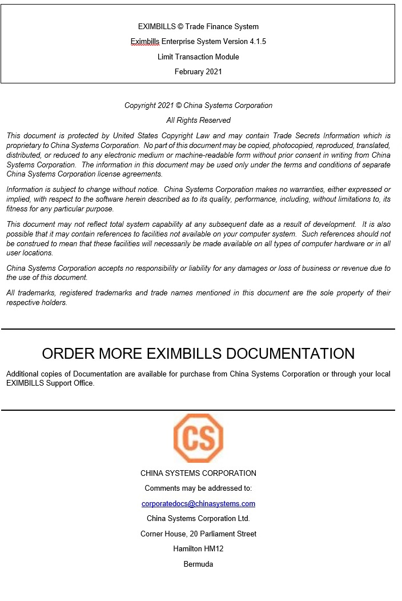

Contents 
========
  
[EE Documentation Library 5](#ee-documentation-library)

[EE Documentation Library 6](#ee-documentation-library-1)

[Core System Manuals 6](#core-system-manuals)

[EE Utility References 11](#ee-utility-references)

[Installation Guide 12](#_Toc77262309)

[CHAPTER ONE: INTRODUCTION 13](#chapter-one-introduction)

[System Overview 14](#system-overview)

[Manual Overview 15](#_Toc77262312)

[CHAPTER TWO: LIMIT TRANSACTION FUNCTIONS
16](#chapter-two-limit-transaction-functions)

[Introduction to the Limit Transaction Function Group
17](#introduction-to-the-limit-transaction-function-group)

[Takedown Limit by Pending 18](#takedown-limit-by-pending)

[Takedown Limit by Master 23](#takedown-limit-by-master)

[Payment Limit by Pending 28](#payment-limit-by-pending)

[Payment Limit by Master 34](#payment-limit-by-master)

[Fix Pending Takedown or Payment 40](#fix-pending-takedown-or-payment)

[Delete Pending Takedown or Payment
43](#delete-pending-takedown-or-payment)

[Release Takedown or Payment 46](#release-takedown-or-payment)

[Inquire Takedown or Payment 48](#inquire-takedown-or-payment)

[Unlock Limit Transaction 52](#unlock-limit-transaction)

[Limit Transfer Functions 54](#limit-transfer-functions)

[Introduction to the Limit Transfer Function Group
55](#introduction-to-the-limit-transfer-function-group)

[Add Limit Transfer by Pending 59](#add-limit-transfer-by-pending)

[Add Limit Transfer by Master 65](#add-limit-transfer-by-master)

[Pay Limit Transfer by Pending 71](#pay-limit-transfer-by-pending)

[Pay Limit Transfer by Master 78](#pay-limit-transfer-by-master)

[Fix Pending Limit Transfer 84](#fix-pending-limit-transfer)

[Delete Pending Limit Transfer 87](#delete-pending-limit-transfer)

[Release Limit Transfer 90](#release-limit-transfer)

[Inquiry Limit Transfer 92](#inquiry-limit-transfer)

[Unlock Limit Transaction 96](#unlock-limit-transaction-1)

[Glossary 98](#glossary)

[Glossary 99](#_Toc77262336)

 {#section .CS-head1}

EE Documentation Library
========================

EE Documentation Library
------------------------

The EE Documentation Library lists all available manuals that serve as
references on the use of the Eximbills Enterprise system. The documents
are categorized into three groups: Core System Manuals, EE Utility
References, and Installation Guides.

### Core System Manuals

The EE Core System manuals provide information on the setup and
configuration of various EE parameters, as well as the implementation of
supplementary functionalities supported by the system.

**Archiving and Recovery**

This manual is a reference to the Archive and Recovery functionality of
the EE system. Discussions include the required parameter settings for
configuring the relevant functions, as well as examples of how this
functionality is used in transaction processes. The archiving functions
discussed in this manual are Archive Data, Inquire Archived Data,
Restore Archived Data, Delete Archived Data, and End of Month functions.

**BIRT Report Engine**

This manual discusses the requirements and processes involved in
applying the built-in BIRT report engine of EE to build transaction
functions that generate BIRT reports and documents. Other
functionalities, such as configuring a report batch function and
defining rules to attach documents to an outgoing e-mail, are covered as
well.

**Building a Module**

This manual is designed to help new users of EE plan, organize, control,
and successfully carry out the implementation of the system. It provides
a general description of the different features of EE that enable every
bank to build and design business modules according to its processing
requirements. This manual discusses how a custom business module in EE
can be built and adapted. It includes step-by-step procedures on how to
build a module as well as an overview of runtime transaction processing.

**Charges and Commissions Reference**

This document provides extensive discussions on the setup and usage of
the Charges and Commissions component of EE. Instructions include
setting up parameters, defining the relevant standing data, and using
charge-specific calculation methods.

**Data Objects**

This manual describes in detail the steps and procedures required in
building and utilizing a data object, which is a logical object that has
its own attributes and calculation rules. Instructions on customizing
the DO screen interface, navigating the data object screen, and using
data objects in transaction processes are also provided.

**eLOAN Transaction Module**

This document provides extensive discussions on EE's eLOAN sub-system.
Topics include eLOAN functions from the eLOAN Transaction Module and the
EE Standing Data Module.

**FAQs**

This document addresses commonly asked questions about the EE system.
This includes answers to issues related to browser-side processing, EE
Utility, EE database, Security Manager, and other issues that may arise
while operating and configuring settings within the EE environment. Some
system features and capabilities are discussed as well.

**GAPI Integration**

This manual is a comprehensive reference guide on setting up the
required parameters for sending and receiving GAPI messages. It includes
instructions on the configuration of related functionalities and
auxiliary operations, as well as discussions on actual transaction
processing.

**Limit Management Module**

This document provides extensive discussions on the Limits sub-system of
EE. The manual is divided into two parts:

-   The first part discusses all the browser functions of the Limit
    Management module.

-   The second part discusses the required parameter settings to
    integrate Limits settings and data with a business module.

**Limit Transaction Module**

This document provides extensive discussions on running and using the
functions of the Limit Transaction module.

**Log Settings**

This manual provides instructions on defining EE log settings and
configuring parameters to set up log functions. Generating logs on
different modes and checking the different log directories are discussed
as well.

**Multi-Entity Reference**

This manual is a guide to the multi-entity structure of the EE system.
This includes a discussion on the composition of the system in relation
to this structure. EE also supports the use of a single and default
domain; a supplementary section is provided for this.

**Multi-Language Reference**

This manual provides instructions on defining language records and
configuring the multi-language settings in the EE Utility and EE
browser. With this multi-language functionality, users are able to
access the EE system in their preferred language.

**Payment Component Reference**

This document provides extensive discussions on the setup and usage of
the different Payment component types: Payment Terms, Payment Schedule,
Payment Instruction Dealer, and Payment Dealer. Topics include parameter
settings and Payment-specific calculation methods.

**Security Manager**

This manual is a comprehensive guide to security management in the EE
system. As such, it includes instructions on the setup of user profiles,
user functions, business units, business unit functions, user and
business unit assignments, and other security-related operations.

**Service Level Agreement Reference**

This document is a reference to the Service Level Agreement (SLA)
functionality of EE the system, which pertains to a group of settings
that control the flow of transaction steps and processes. It is divided
into two major sections: Basic Data, for the functions used in the
creation and maintenance of SLA standing data; and System Operations,
for the functions used in SLA enquiry, business task initialization, and
end time adjustments. A sample SLA process is also provided.

**Standing Data Module**

This document discusses the functions for the standing data of the EE
system. Among these are rate descriptions, exchange rates, interest
rates, account numbers, currencies, weekend data, holiday data, clauses,
reference number rules, authorization standing data, and time zone data.
Descriptions, input details, and processing steps are included in the
function discussions.

**Supplementary Functions**

This manual is a reference in configuring the parameter settings to
define special or supplementary EE functionalities such as the
Compliance Check and invoice uploading features.

**SWIFT Configuration**

This document provides extensive discussions on the primary components
required in defining SWIFT messages: the SWIFT template and the SWIFT
message rule. The complete parameter settings and external
configurations required for enabling EE to exchange messages with the
SWIFT network are detailed in comprehensive procedures. This manual is
supplemented with sections on SWIFT-related system parameters and
miscellaneous functions.

**System Administration Functions**

This manual is a reference for Super Administrator users of the EE
Utility in the configuration and maintenance of the EE environment.
Sections of this reference include instructions on the use of specific
User Manage and Parameter Manage functions.

**System Maintenance Module**

This document discusses the functions provided in the System Maintenance
module of the EE system. This includes sections on the maintenance
processes for daily operations, authorization rule settings, EDI
messages, SWIFT messages, XML messages, log files, and documents.

**System Reference**

This manual is a reference for the following elements provided in the EE
Utility for parameterization: security parameters, system parameters,
components, server side system methods, calculation methods, and XML
Generator items.

**Version Control**

This manual discusses the settings in maintaining the different versions
of parameters.

 

### EE Utility References

The EE Utility set of reference manuals is a guide on the use of the
Eximbills Enterprise Utility Workbench, or simply EE Utility. These
references discuss every function or feature of the EE Utility and
provide instructions on how to operate or use the function in relation
to operating and maintaining the EE system and processing a business
transaction.

A manual is provided for each major function group of the EE Utility:
User Manage, Parameter Manage, System Function, Transaction Function,
and Maintenance.  

__**NOTE**__:

The TSU Parameter Manage function group is comprised of functions used
for configuring, managing and maintaining parameters for the TSU (or
Open Account) module. For information on the TSU module, refer to the EE
Baseline TSU documentation.

**EE Utility Reference: User Manager Functions**

This manual is a comprehensive guide for the Administrator and Operator
user on the use and configuration of the functions belonging to the User
Manage function group of the EE Utility. This includes functions for
user profiles and audit logs.

**EE Utility Reference: Parameter Manager Functions**

This manual is a reference on the use and configuration of the functions
that belong to the Parameter Manage function group of the EE Utility and
that are accessible to Administrator and Operator users. These are
system-wide functions used for creating and maintaining system
parameters, components, and calculation rules, among others.

**EE Utility Reference: System Functions**

This manual includes information on the configuration of the functions
belonging to the System Function group of the EE Utility. The functions
in this group are used to maintain settings that facilitate system-wide
tasks and operations; among these are function groups, output devices,
protocol managers, and STP settings.

**EE Utility Reference: Transaction Functions**

This manual provides discussions on the configuration of the functions
belonging to the Transaction Function group of the EE Utility. These
functions are used for defining and setting up the actual business
parameters of transaction functions.

**EE Utility Reference: Maintenance Functions**

This manual is a comprehensive guide on the use and configuration of the
functions belonging to the Maintenance function group of the EE Utility.
These functions are used for maintaining the tables, fields, and files
that are used in the EE Utility.

### Installation Guide

An EE installation guide is a reference on the installation and setup
processes of the EE system on a specific application server and
database.

**Installation Guide WAS 9.0 - Oracle 12c**

This is a reference for installing the EE system on WebSphere
Application Server Version 9.0.5.5, with an Oracle 12c database. This
includes detailed instructions on configuring the components that are
required to successfully run EE.  
  
  

CHAPTER ONE: INTRODUCTION
=========================

-   **SYSTEM OVERVIEW**

-   **MANUAL OVERVIEW**

System Overview
---------------

The Limit Transaction (CZQO) module of the Eximbills Enterprise (EE)
system is used to takedown and repay specific credit lines for business
transactions without having to go through the normal cycle of the
business module.

The main function groups for this module are:

-   Limit Transaction

-   Limit Transfer
  
  
__**NOTE**__:

This module is generally used to test and simulate limits-related
transactions.

Function Access

A user only has access to function groups---and their corresponding
transactions---to which he has been given the appropriate rights. The
assignment of function access rights, as well as other security
settings, is defined through the EE Security Manager.

To run a function: access the module, open the function group, and click
on the function name. Example: Limit Transaction \> Limit Transaction \>
Takedown Limit by Master.

Manual Overview
---------------

**Purpose**

This document provides extensive discussions on running and using the
functions of the Limit Transaction module.

**Audience**

This document is a reference specifically for, but not limited to, the
following users:

-   Browser users tasked to maintain Limits records

**Prerequisites**

Suggested title before reading this manual:

-   EE Limit Management Module

__**NOTE**__:

Some features discussed in this manual have been tested and documented
based on an older system version. Unless otherwise specified, the
overall functionality is the same when recreated in the current version.

CHAPTER TWO: LIMIT TRANSACTION FUNCTIONS
========================================

-   **INTRODUCTION TO THE LIMIT TRANSACTION FUNCTION GROUP**

-   **TAKEDOWN LIMIT BY PENDING**

-   **TAKEDOWN LIMIT BY MASTER**

-   **PAYMENT LIMIT BY PENDING**

-   **PAYMENT LIMIT BY MASTER**

-   **FIX PENDING TAKEDOWN OR PAYMENT**

-   **DELETE PENDING TAKEDOWN OR PAYMENT**

-   **RELEASE TAKEDOWN OR PAYMENT**

-   **INQUIRE TAKEDOWN OR PAYMENT**

-   **UNLOCK LIMIT TRANSACTION**

Introduction to the Limit Transaction Function Group
----------------------------------------------------

The Limit Transaction function group consists of functions for creating
and maintaining takedown transactions and payments of takedowns.

It consists of the following functions:

-   Takedown Limit by Pending

-   Takedown Limit by Master

-   Payment Limit by Pending

-   Payment Limit by Master

-   Fix Pending Takedown or Payment

-   Delete Pending Takedown or Payment

-   Release Takedown or Payment

-   Inquire Takedown or Payment

-   Unlock Limit Transaction

__**NOTE**__:

Depending on the system version, the catalog screen of each function may
also provide the following buttons:

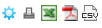

i\. Catalog Config - This is used for selecting which fields are to be
displayed in the catalog and which ones are to be included for exporting
to a file.

ii\. Print - This is used for printing selected records or the entire
catalog page.

iii\. Save as Excel - This is used for exporting the entire catalog page,
or selected records, to an Excel file.

iv\. Save as PDF - This is used for exporting the entire catalog page, or
selected records, to a PDF file.

v\. Save as PDF - This is used for exporting the entire catalog page, or
selected records, to a PDF file.

 

Takedown Limit by Pending
-------------------------

This function is used for creating a takedown transaction. Records that
are processed with this function require the Release process through the
Release Takedown or Payment function.

When the transaction is confirmed, the system checks for the validity of
the transaction:

-   The transaction amount must be within the available credit line.

-   The credit line must be within the validity period. The value date
    and due date of the transaction are checked against the validity
    period of the credit line involved: the transaction value date and
    due date must fall within the start date and expiry date of the
    credit line.

When the transaction does not pass these checks, the system displays a
warning message.

__**NOTE**__:

If the customer has a defined shared limit, the customer may borrow from
other member facilities if the transaction amount has exceeded the
available credit line. The amount that a customer can borrow from
another credit line must be within the available share limit balance of
the defined shared limit. Refer to the EE Limit Management Module for
more information on shared limits.

  --------------------------
  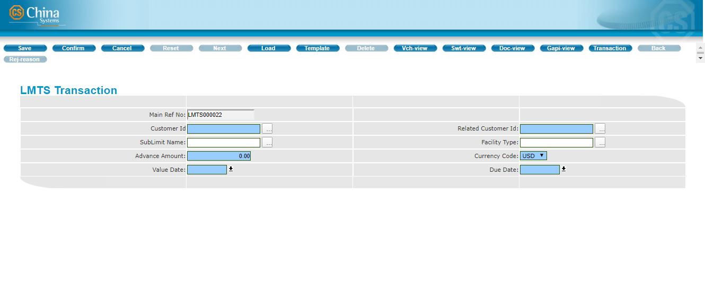
  --------------------------
Figure 2. Takedown Limit by Pending Function

**Configuration**

This function provides the following fields.

-   Main Ref No - This is the unique reference number for this takedown
    transaction. This is a protected field.

-   Customer Id - Specify the Id of the Customer. The lookup button that
    accompanies this field may be used to retrieve the Id from the
    Customer table. This is a mandatory field.

-   Related Customer Id -- When there is a related customer for the
    present customer, the system automatically retrieves the information
    if the associated Id field is updated. If there is no related
    customer, this field defaults to the indicated Customer Id value.
    This is a mandatory field.

-   Sublimit Name -- Specify the name of the sub-limit that is to be
    used in this transaction. The lookup button that accompanies this
    field may be used to locate the Sub-limit Description record. This
    is a mandatory field.

-   Facility Type -- Specify the facility type that is to be used in
    this transaction. The lookup button that accompanies this field may
    be used to locate the Facility Type record. This is a mandatory
    field.

-   Advance Amount -- Specify the transaction or takedown amount. This
    amount must be less than the available balance of the customer,
    sub-limit or facility type. This is a mandatory field.

-   Currency Code -- Select the currency of the transaction amount from
    the dropdown list. This is a mandatory field.

-   Value Date -- Specify the value date of this takedown transaction.
    The date may be defined using the dropdown calendar function that
    accompanies this field. This is a mandatory field.

-   Due Date -- Specify the due date of the transaction. The date may be
    defined using the dropdown calendar function that accompanies this
    field. This is a mandatory field.

**Procedure**

1.  Run the following function:

Limit Transaction \> Limit Transaction \> Takedown Limit by Pending.

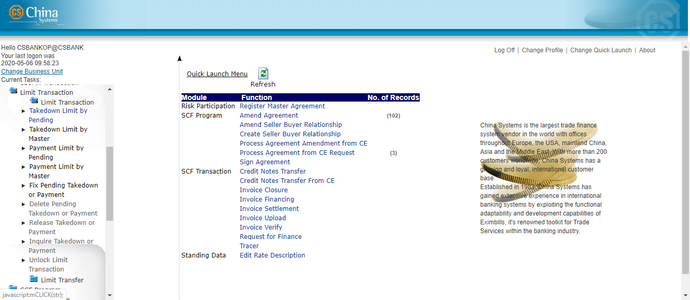

2.  The Takedown Limit by Pending function screen is displayed.

> Specify the relevant information.
>
> 

3.  Click on the Confirm button on the toolbar.

> 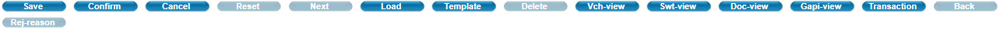

4.  The Transaction Completed screen is displayed.

> To view the details of the transaction, click on the GAPI button.

To add another record, click on the Continue option.

> To exit the function, click on the Cancel button.
>
> 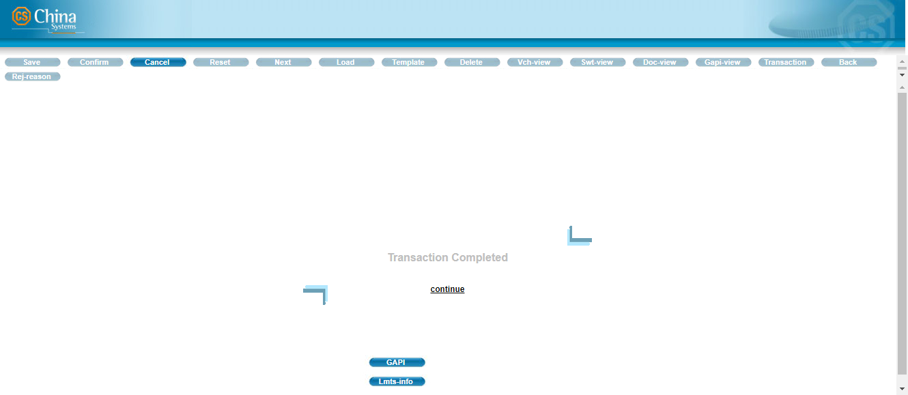

__**NOTE**__:

To view the Limits information of the record, click on the LMTS-INFO
button. The Limits details are displayed on another window.

> 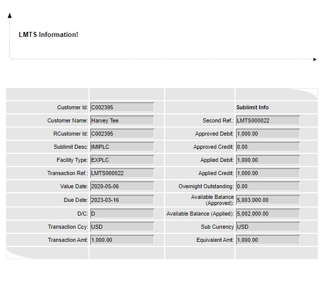

Takedown Limit by Master 
========================

This function is used for creating a takedown transaction. Records that
are processed with this function do not require the Release process
(through the Release Takedown or Payment function); transactions are
automatically posted to the master file.

When the transaction is confirmed, the system checks for the validity of
the transaction:

-   The transaction amount must be within the available credit line.

-   The credit line must be within the validity period. The value date
    and due date of the transaction are checked against the validity
    period of the credit line involved: the transaction value date and
    due date must fall within the start date and expiry date of the
    credit line.

When the transaction does not pass these checks, the system displays a
warning message.

__**NOTE**__:

If the customer has a defined shared limit, the customer may borrow from
other member facilities if the transaction amount has exceeded the
available credit line. Refer to the *EE Limit Management Module* for
more information on shared limits.

  --------------------------
  
  --------------------------
Figure 2. Takedown Limit by Master Function

**Configuration**

This function provides the following fields.

-   Main Ref No - This is the unique reference number for this takedown
    transaction. This is a protected field.

-   Customer Id - Specify the Id of the Customer. The lookup button that
    accompanies this field may be used to retrieve the Id from the
    Customer table. This is a mandatory field.

-   Related Customer Id - When there is a related customer for the
    present customer, the system automatically retrieves the information
    if the associated Id field is updated. If there's no related
    customer, this field defaults to the indicated Customer Id value.
    This is a mandatory field.

-   Sublimit Name - Specify the name of the sub-limit that is to be used
    in this transaction. The lookup button that accompanies this field
    may be used to locate the Sub-limit Description record. This is a
    mandatory field.

-   Facility Type - Specify the facility type that is to be used in this
    transaction. The lookup button that accompanies this field may be
    used to locate the facility type record. This is an mandatory field.

-   Advance Amount - Specify the transaction or takedown amount. This
    amount must not be less than the available balance of the customer,
    sub-limit or member facility. This is a mandatory field.

__**NOTE**__:

If the selected customer, sub-limit, or facility has corresponding
Combined or Limit Settings, the limit defined in these settings are
considered when the system runs a validation of the amount specified in
this field.

For information on configuring Combined and Limit settings, see the
discussion on the Combined & Shared Limit function group in the *EE
Limit Management Module* documentation*.*

-   Currency Code - Select the currency of the transaction amount from
    the dropdown list. This is a mandatory field.

-   Value Date - Specify the value date of this takedown transaction.
    The date may be defined using the dropdown calendar function that
    accompanies this field. This is a mandatory field.

-   Due Date - Specify the due date of the transaction. The date may be
    defined using the dropdown calendar function that accompanies this
    field. This is a mandatory field.

**Procedure**

1\. Run the following function:

Limit Transaction \> Limit Transaction \> Takedown Limit by Master.

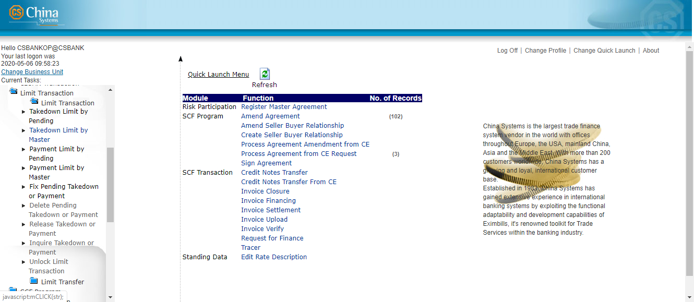

2\. The Takedown Limit by Master function screen is displayed. Specify
the relevant information.

3\. Click on the Confirm button on the toolbar.

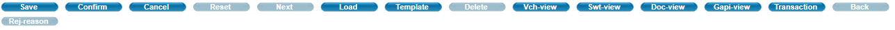

4\. The Transaction Completed screen is displayed.

> To view the details of the transaction, click on the GAPI button.
>
> To add another record, click on the Continue option.
>
> To exit the function, click on the Cancel button.

__**NOTE**__:

To view the Limits information of the record, click on the LMTS-INFO
button. The Limits details are displayed in another window.

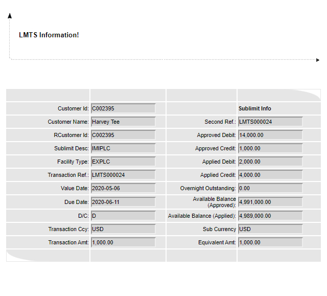

Payment Limit by Pending
------------------------

This function is used for processing payments of takedowns. Records that
are processed with this function require the Release process through the
Release Takedown or Payment function.

+-------------------------------+
|   --------------------------- |
|   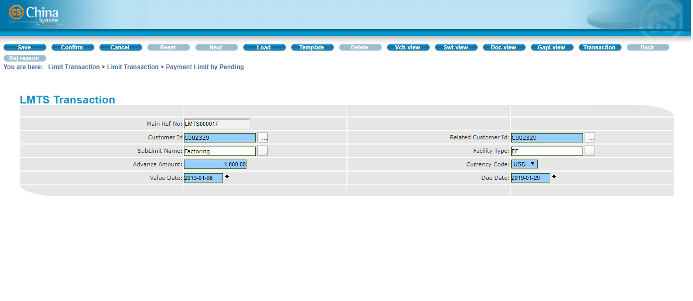   |
|   --------------------------- |
+-------------------------------+
Figure 2. Payment Limit by Pending Function

**Configuration**

This function provides the following fields.

-   Main Ref No - This is the unique reference number for this
    transaction. This pertains to the reference number of the takedown
    that is being paid. This is a protected field.

-   Customer Id - Specify the Id of the Customer. The lookup button that
    accompanies this field may be used to retrieve the Id from the
    Customer table. This is a mandatory field.

-   Related Customer Id - When there is a related customer for the
    present customer, the system automatically retrieves the information
    if the associated Id field is updated. If there's no related
    customer, this field defaults to the indicated Customer Id value.
    This is a mandatory field.

-   Sublimit Name - Specify the name of the sub-limit that is to be used
    in this transaction. The lookup button that accompanies this field
    may be used to locate the Sub-limit Description record. This is a
    mandatory field.

-   Facility Type - Specify the facility type that is to be used in this
    transaction. The lookup button that accompanies this field may be
    used to locate the facility type record. This is an mandatory field.

-   Advance Amount - Specify the amount to be paid. The amount should be
    equal to or less than the original takedown amount. This is a
    mandatory field.

__**NOTE**__:

If the selected customer, sub-limit, or facility has corresponding
Combined or Limit Settings, the limit defined in these settings are
considered when the system runs a validation of the amount specified in
this field.

For information on configuring Combined and Limit settings, see the
discussion on the Combined & Shared Limit function group in the *EE
Limit Management Module* documentation.

-   Currency Code - Select the currency of the transaction amount from
    the dropdown list. This is a mandatory field.

-   Value Date - Specify the value date of this payment transaction. The
    date may be defined using the dropdown calendar function that
    accompanies this field. This is a mandatory field.

__**NOTE**__:

The value date must be within the validity period of the customer,
sub-limit, or member facility.

-   Due Date - Specify the due date of the payment. The date may be
    defined using the dropdown calendar function that accompanies this
    field. This is a mandatory field.

__**NOTE**__:

The due date must be within the validity period of the customer,
sub-limit, or member facility.

**Procedure**

1.  Run the following function:

> Limit Transaction \> Limit Transaction \> Payment Limit by Pending.
>
> 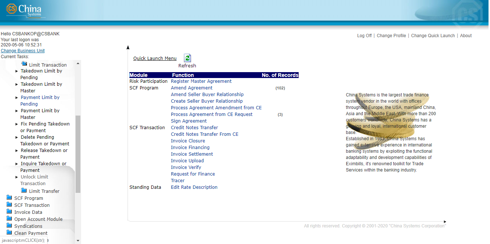

2.  The Payment Limit by Pending function catalog screen is displayed.
    To create the filter criteria for displaying records, specify the
    value for the MAIN REF NO field. Click on the Next button.

> 

3.  Select the relevant record from the list that is displayed. Click on
    the Next button.

> 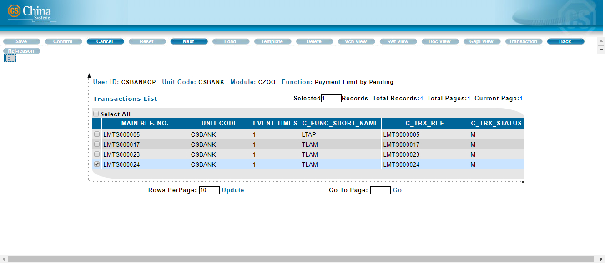
4.  The Payment Limit by Pending function screen is displayed. Specify
    the relevant information

> 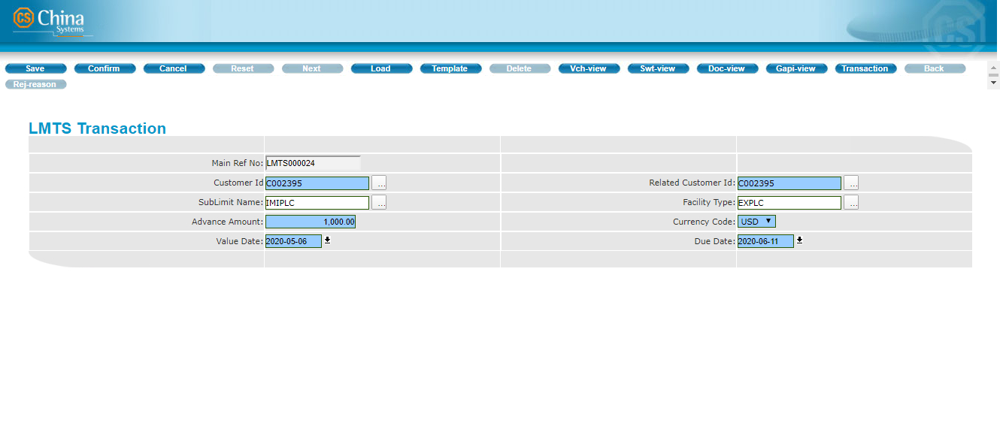

5.  Click on the Confirm button on the toolbar.

> 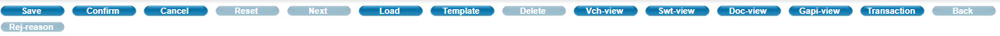

6.  The Transaction Completed screen is displayed.

> To view the details of the transaction, click on the GAPI button.

To process another record, click on the Continue option.

> To exit the function, click on the Cancel button.
>
> 

__**NOTE**__:

To view the Limits information of the record, click on the LMTS-INFO
button. The Limits details are displayed in another window.

Payment Limit by Master
-----------------------

This function is used for processing payments of takedowns. Records that
are processed with this function do not require the Release process
through the (Release Takedown or Payment function); transactions are
automatically posted to the master file.

  ---------------------------
  
  ---------------------------
Figure 2. Payment Limit by Master Function

**Configuration**

This function provides the following fields.

-   Main Ref No - This is the unique reference number for this
    transaction. This pertains to the reference number of the takedown
    that is being paid. This is a protected field.

-   Customer Id - Specify the Id of the Customer. The lookup button that
    accompanies this field may be used to retrieve the Id from the
    Customer table. This is a mandatory field.

-   Related Customer Id - When there is a related customer for the
    present customer, the system automatically retrieves the information
    if the associated Id field is updated. If there's no related
    customer, this field defaults to the indicated Customer Id value.
    This is a mandatory field.

-   Sublimit Name - Specify the name of the sub-limit that is to be used
    in this transaction. The lookup button that accompanies this field
    may be used to locate the Sub-limit Description record. This is a
    mandatory field.

-   Facility Type - Specify the facility type that is to be used in this
    transaction. The lookup button that accompanies this field may be
    used to locate the Facility Type record. This is a mandatory field.

-   Advance Amount - Specify the amount to be paid. The amount should be
    equal to or less than the original takedown amount. This is a
    mandatory field.

<!-- -->

-   Currency Code - Select the currency of the transaction amount from
    the dropdown list. This is a mandatory field.

-   Value Date - Specify the value date of this payment transaction. The
    date may be defined using the dropdown calendar function that
    accompanies this field. This is a mandatory field.

__**NOTE:**__

The value date must be within the validity period of the customer,
sub-limit, or member facility.

-   Due Date - Specify the due date of the transaction. The date may be
    defined using the dropdown calendar function that accompanies this
    field. This is a mandatory field.

**Procedure**

1.  Run the following function:

Limit Transaction \> Limit Transaction \> Payment Limit by Master.

2.  The Payment Limit by Master function catalog screen is displayed.

    To create the filter criteria for displaying records, specify the
    value for the MAIN REF NO field.

> Click on the Next button.

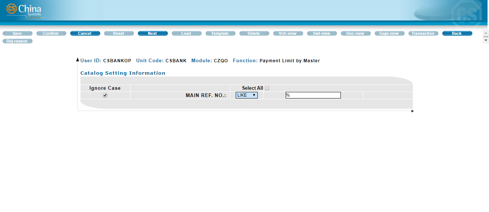

3.  Select the relevant record from the list that is displayed. Click on
    the Next button.

> 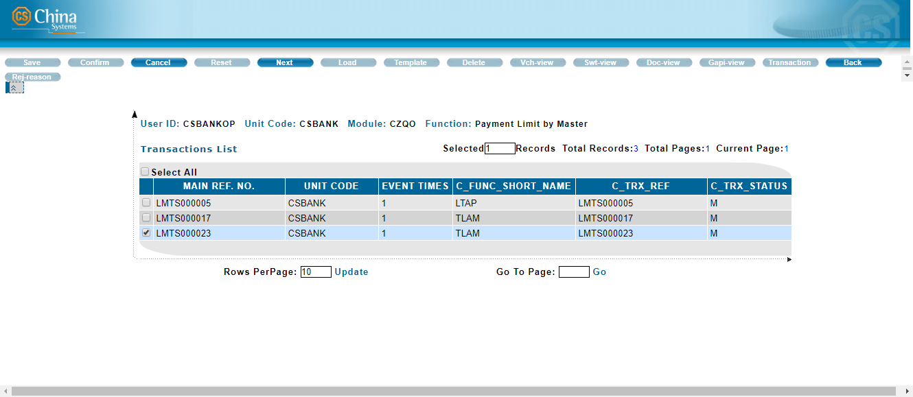

4.  The Payment Limit by Master function screen is displayed. Specify
    the relevant information.

> 

5.  Click on the Confirm button on the toolbar.

> 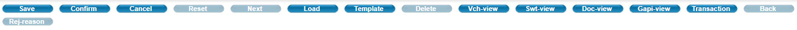

6.  The Transaction Completed screen is displayed.

> To view the details of the transaction, click on the GAPI button.
>
> To process another record, click on the Continue option.
>
> To exit the function, click on the Cancel button.
>
> 

__**NOTE:**__

To view the Limits information of the record, click on the LMTS-INFO
button. The Limits details are displayed in another window.

{width="4.330189195100613in"
height="3.8976870078740156in"}

Fix Pending Takedown or Payment
-------------------------------

This function is used for correcting or modifying a pending Limits
takedown or payment transaction. The original transaction screen is
displayed for modifying the record.

Records that are processed with this function require the Release
process through the Release Takedown or Payment function.

  ------------------------
  Do the following . . .
  ------------------------

+-----------------------+-----------------------+-----------------------+
| 1\. Run the           |                       |                   |
|                       |                       |                       |
| Limit Transaction \>  |                       |                       |
| Limit Transaction \>  |                       |                       |
| Fix Pending Takedown  |                       |                       |
| or Payment.           |                       |                       |
+-----------------------+-----------------------+-----------------------+
|                       |                       |                       |
+-----------------------+-----------------------+-----------------------+
| 2\. The Fix Pending   |                       |                   |
| function catalog      |                       |                       |
| screen is             |                       |                       |
| displayed.            |                       |                       |
|                       |                       |                       |
| To create the filter  |                       |                       |
| criteria for          |                       |                       |
| displaying records,   |                       |                       |
| specify the value for |                       |                       |
| the MAIN REF NO       |                       |                       |
| field.                |                       |                       |
|                       |                       |                       |
| Click on the Next     |                       |                       |
| button.               |                       |                       |
+-----------------------+-----------------------+-----------------------+
|                       |                       |                       |
+-----------------------+-----------------------+-----------------------+
| 3\. Select the        |                       |                   |
| from the list that    |                       |                       |
| is displayed. Click   |                       |                       |
| on the Next button.   |                       |                       |
|                       |                       |                       |
| __**[NOTE:]**__       |                       |                       |
|                       |                       |                       |
|                       |                       |                       |
| To check whether the  |                       |                       |
| record has been       |                       |                       |
| previously refused,   |                       |                       |
| click on the          |                       |                       |
| Rej-reason button.    |                       |                       |
| The relevant          |                       |                       |
| information, such as  |                       |                       |
| the reason for        |                       |                       |
| refusal, is displayed |                       |                       |
| on another window.    |                       |                       |
+-----------------------+-----------------------+-----------------------+
|                       |                       |                       |
+-----------------------+-----------------------+-----------------------+
| 4\. The Fix Pending   |                       |                   |
| function screen is    |                       |                       |
| displayed.            |                       |                       |
|                       |                       |                       |
| Modify the            |                       |                       |
| information as        |                       |                       |
| required.             |                       |                       |
+-----------------------+-----------------------+-----------------------+
|                       |                       |                       |
+-----------------------+-----------------------+-----------------------+
| 5\. Click on the      |                       |                   |
| the toolbar.          |                       |                       |
+-----------------------+-----------------------+-----------------------+
|                       |                       |                       |
+-----------------------+-----------------------+-----------------------+
| 6\. The Transaction   |                       |                   |
| displayed.            |                       |                       |
|                       |                       |                       |
| To view the details   |                       |                       |
| of the transaction,   |                       |                       |
| click on the GAPI     |                       |                       |
| button.               |                       |                       |
|                       |                       |                       |
| To edit another       |                       |                       |
| record, click on the  |                       |                       |
| Continue option.      |                       |                       |
|                       |                       |                       |
| To exit the function, |                       |                       |
| click on the Cancel   |                       |                       |
| button.               |                       |                       |
+-----------------------+-----------------------+-----------------------+
|                       |                       |                       |
+-----------------------+-----------------------+-----------------------+
| **[NOTE:]{.underline} |                       |                   |
|                       |                       |                       |
| To view the Limits    |                       |                       |
| information of the    |                       |                       |
| record, click on the  |                       |                       |
| LMTS-INFO button. The |                       |                       |
| Limits details are    |                       |                       |
| displayed in another  |                       |                       |
| window.               |                       |                       |
+-----------------------+-----------------------+-----------------------+

Delete Pending Takedown or Payment {#delete-pending-takedown-or-payment .CS-head1}
==================================

This function is used for deleting a pending Limits takedown or payment
transaction. This does not require the release process. Once a record is
deleted through this function, the transaction is also deleted from the
database.

  ------------------------
  Do the following . . .
  ------------------------

+-----------------------+-----------------------+-----------------------+
| 1\. Run the           |                       |                   |
|                       |                       |                       |
| Limit Transaction \>  |                       |                       |
| Limit Transaction \>  |                       |                       |
| Delete Pending        |                       |                       |
| Takedown or Payment.  |                       |                       |
+-----------------------+-----------------------+-----------------------+
|                       |                       |                       |
+-----------------------+-----------------------+-----------------------+
| 2\. The Delete        |                       |                   |
| Payment function      |                       |                       |
| catalog screen is     |                       |                       |
| displayed.            |                       |                       |
|                       |                       |                       |
| To create the filter  |                       |                       |
| criteria for          |                       |                       |
| displaying records,   |                       |                       |
| specify the value for |                       |                       |
| the MAIN REF NO       |                       |                       |
| field.                |                       |                       |
|                       |                       |                       |
| Click on the Next     |                       |                       |
| button.               |                       |                       |
+-----------------------+-----------------------+-----------------------+
|                       |                       |                       |
+-----------------------+-----------------------+-----------------------+
| 3\. A list of         |                       |                   |
| displayed.            |                       |                       |
|                       |                       |                       |
| **[NOTE:]{.underline} |                       |                       |
| **                    |                       |                       |
|                       |                       |                       |
| To check whether the  |                       |                       |
| record has been       |                       |                       |
| previously refused,   |                       |                       |
| click on the          |                       |                       |
| Rej-reason button.    |                       |                       |
| The relevant          |                       |                       |
| information, such as  |                       |                       |
| the reason for        |                       |                       |
| refusal, is displayed |                       |                       |
| on another window.    |                       |                       |
+-----------------------+-----------------------+-----------------------+
|                       |                       |                       |
+-----------------------+-----------------------+-----------------------+
| 4\. To view the       |                       |                   |
| record, select it     |                       |                       |
| from the catalog      |                       |                       |
| list and click on     |                       |                       |
| the View button.      |                       |                       |
|                       |                       |                       |
| The record details    |                       |                       |
| are shown on another  |                       |                       |
| window.               |                       |                       |
+-----------------------+-----------------------+-----------------------+
|                       |                       |                       |
+-----------------------+-----------------------+-----------------------+
| **[NOTE:]{.underline} |                       |                   |
|                       |                       |                       |
| To view the Limits    |                       |                       |
| information of the    |                       |                       |
| record, click on the  |                       |                       |
| LMTS-INFO button. The |                       |                       |
| Limits details are    |                       |                       |
| displayed in another  |                       |                       |
| window.               |                       |                       |
+-----------------------+-----------------------+-----------------------+
|                       |                       |                       |
+-----------------------+-----------------------+-----------------------+
| 5\. To delete a       |                       |                   |
| from the catalog      |                       |                       |
| list and click on     |                       |                       |
| the Delete button.    |                       |                       |
|                       |                       |                       |
| A confirmation        |                       |                       |
| message is displayed. |                       |                       |
| Click on the OK       |                       |                       |
| button.               |                       |                       |
+-----------------------+-----------------------+-----------------------+
|                       |                       |                       |
+-----------------------+-----------------------+-----------------------+
| 6\. The Transaction   |                       |                   |
| displayed.            |                       |                       |
|                       |                       |                       |
| To delete another     |                       |                       |
| record, click on the  |                       |                       |
| Continue option.      |                       |                       |
|                       |                       |                       |
| To exit the function, |                       |                       |
| click on the Cancel   |                       |                       |
| button.               |                       |                       |
+-----------------------+-----------------------+-----------------------+

Release Takedown or Payment {#release-takedown-or-payment .CS-head1}
===========================

This function is used for processing the release of Limits takedown or
payment transactions that require the Release process. Such type of
records may not be used in transaction operations until it is approved
through this Release process.

This function only allows record detail viewing. No modification or
change may be applied to the record through this function.

  ------------------------
  Do the following . . .
  ------------------------

+-----------------------+-----------------------+-----------------------+
| 1\. Run the           |                       |                   |
|                       |                       |                       |
| Limit Transaction \>  |                       |                       |
| Limit Transaction     |                       |                       |
| \>Release Takedown or |                       |                       |
| Payment.              |                       |                       |
+-----------------------+-----------------------+-----------------------+
|                       |                       |                       |
+-----------------------+-----------------------+-----------------------+
| 2\. The Release       |                       | {width="3.5in"     |
| function catalog      |                       | height="1.84722222222 |
| screen is             |                       | 22223in"}             |
| displayed.            |                       |                       |
|                       |                       |                       |
| To create the filter  |                       |                       |
| criteria for          |                       |                       |
| displaying records,   |                       |                       |
| specify the value for |                       |                       |
| the MAIN REF NO       |                       |                       |
| field.                |                       |                       |
|                       |                       |                       |
| Click on the Next     |                       |                       |
| button.               |                       |                       |
+-----------------------+-----------------------+-----------------------+
|                       |                       |                       |
+-----------------------+-----------------------+-----------------------+
| 3\. Select the        |                       | {width="3.5in"     |
| from the list that    |                       | height="1.84722222222 |
| is displayed.         |                       | 22223in"}             |
|                       |                       |                       |
| To proceed, click on  |                       |                       |
| the Release button.   |                       |                       |
+-----------------------+-----------------------+-----------------------+
|                       |                       |                       |
+-----------------------+-----------------------+-----------------------+
| 4\. The Release       |                       | {width="3.5in"     |
| function screen is    |                       | height="1.84722222222 |
| displayed.            |                       | 22223in"}             |
|                       |                       |                       |
| Review the given      |                       |                       |
| information.          |                       |                       |
|                       |                       |                       |
| To release the        |                       |                       |
| record, mark the      |                       |                       |
| Release option.       |                       |                       |
|                       |                       |                       |
| To refuse the record, |                       |                       |
| mark the Refuse       |                       |                       |
| option. The reason    |                       |                       |
| for this refusal can  |                       |                       |
| be indicated in the   |                       |                       |
| field provided.       |                       |                       |
+-----------------------+-----------------------+-----------------------+
|                       |                       |                       |
+-----------------------+-----------------------+-----------------------+
| 5\. Click on the      |                       | {width="3.5in"     |
| the toolbar.          |                       | height="5.90277777777 |
|                       |                       | 77776e-2in"}          |
+-----------------------+-----------------------+-----------------------+
|                       |                       |                       |
+-----------------------+-----------------------+-----------------------+
| 6\. The Transaction   |                       | {width="3.5in"     |
| displayed.            |                       | height="1.84722222222 |
|                       |                       | 22223in"}             |
| To release another    |                       |                       |
| record, click on the  |                       |                       |
| Continue option.      |                       |                       |
|                       |                       |                       |
| To exit the function, |                       |                       |
| click on the Cancel   |                       |                       |
| button.               |                       |                       |
+-----------------------+-----------------------+-----------------------+

Inquire Takedown or Payment {#inquire-takedown-or-payment .CS-head1}
===========================

This function is used for inquiring an existing Limits takedown or
payment transaction. No modification or change may be applied to the
record through this function.

  ------------------------
  Do the following . . .
  ------------------------

+-----------------------+-----------------------+-----------------------+
| 1\. Run the           |                       |                   |
|                       |                       |                       |
| Limit Transaction \>  |                       |                       |
| Limit Transaction \>  |                       |                       |
| Inquire Takedown or   |                       |                       |
| Payment.              |                       |                       |
+-----------------------+-----------------------+-----------------------+
|                       |                       |                       |
+-----------------------+-----------------------+-----------------------+
| 2\. The Inquire       |                       |                   |
| function catalog      |                       |                       |
| screen is             |                       |                       |
| displayed.            |                       |                       |
|                       |                       |                       |
| To create the filter  |                       |                       |
| criteria for          |                       |                       |
| displaying records,   |                       |                       |
| specify the value for |                       |                       |
| the MAIN REF NO       |                       |                       |
| field.                |                       |                       |
|                       |                       |                       |
| Click on the Next     |                       |                       |
| button.               |                       |                       |
+-----------------------+-----------------------+-----------------------+
|                       |                       |                       |
+-----------------------+-----------------------+-----------------------+
| 3\. A list of         |                       |                   |
| displayed.            |                       |                       |
|                       |                       |                       |
| Two buttons are       |                       |                       |
| provided: View and    |                       |                       |
| Transaction.          |                       |                       |
+-----------------------+-----------------------+-----------------------+
|                       |                       |                       |
+-----------------------+-----------------------+-----------------------+
| 4\. To view the       |                       |                   |
| transaction record,   |                       |                       |
| select it and click   |                       |                       |
| on the View button.   |                       |                       |
|                       |                       |                       |
| The record details    |                       |                       |
| are shown on another  |                       |                       |
| window.               |                       |                       |
|                       |                       |                       |
| **[NOTE:]{.underline} |                       |                       |
| **                    |                       |                       |
|                       |                       |                       |
| To check whether the  |                       |                       |
| record has been       |                       |                       |
| previously refused,   |                       |                       |
| click on the          |                       |                       |
| Rej-reason button.    |                       |                       |
| The relevant          |                       |                       |
| information, such as  |                       |                       |
| the reason for        |                       |                       |
| refusal, is displayed |                       |                       |
| on another window.    |                       |                       |
+-----------------------+-----------------------+-----------------------+
|                       |                       |                       |
+-----------------------+-----------------------+-----------------------+
| 5\. To view the       |                       |                   |
| transaction, select   |                       |                       |
| it and click on the   |                       |                       |
| Transaction button.   |                       |                       |
|                       |                       |                       |
| The event records of  |                       |                       |
| the transaction are   |                       |                       |
| listed on another     |                       |                       |
| window.               |                       |                       |
+-----------------------+-----------------------+-----------------------+
|                       |                       |                       |
+-----------------------+-----------------------+-----------------------+
| To check whether the  |                       |                   |
| previously refused,   |                       |                       |
| click on the          |                       |                       |
| Rej-reason button.    |                       |                       |
| The relevant          |                       |                       |
| information, such as  |                       |                       |
| the reason for        |                       |                       |
| refusal, is displayed |                       |                       |
| on another window.    |                       |                       |
+-----------------------+-----------------------+-----------------------+
|                       |                       |                       |
+-----------------------+-----------------------+-----------------------+
| To view the details   |                       |                   |
| select it from the    |                       |                       |
| list and click on the |                       |                       |
| View button.          |                       |                       |
|                       |                       |                       |
| The record details    |                       |                       |
| are shown on another  |                       |                       |
| window.               |                       |                       |
+-----------------------+-----------------------+-----------------------+
|                       |                       |                       |
+-----------------------+-----------------------+-----------------------+
| **[NOTE:]{.underline} |                       |                   |
|                       |                       |                       |
| To view the Limits    |                       |                       |
| information of the    |                       |                       |
| displayed event,      |                       |                       |
| click on the          |                       |                       |
| LMTS-INFO button. The |                       |                       |
| Limits details are    |                       |                       |
| displayed in another  |                       |                       |
| window.               |                       |                       |
+-----------------------+-----------------------+-----------------------+

Unlock Limit Transaction {#unlock-limit-transaction .CS-head1}
========================

This function is used for unlocking a Limits takedown or payment
transaction that has been held and locked for such reasons as system
failure and processing errors. A locked record may only be used for
processing after it is unlocked through this function.

  ------------------------
  Do the following . . .
  ------------------------

+-----------------------+-----------------------+-----------------------+
| 1\. Run the           |                       |                   |
|                       |                       |                       |
| Limit Transaction \>  |                       |                       |
| Limit Transaction \>  |                       |                       |
| Unlock Limit          |                       |                       |
| Transaction.          |                       |                       |
+-----------------------+-----------------------+-----------------------+
|                       |                       |                       |
+-----------------------+-----------------------+-----------------------+
| 2\. The Unlock Limit  |                       |                   |
| function catalog      |                       |                       |
| screen is             |                       |                       |
| displayed.            |                       |                       |
|                       |                       |                       |
| To create the filter  |                       |                       |
| criteria for          |                       |                       |
| displaying records,   |                       |                       |
| specify the value for |                       |                       |
| the MAIN REF NO       |                       |                       |
| field.                |                       |                       |
|                       |                       |                       |
| Click on the Next     |                       |                       |
| button.               |                       |                       |
+-----------------------+-----------------------+-----------------------+
|                       |                       |                       |
+-----------------------+-----------------------+-----------------------+
| 3\. Select the        |                       |                   |
| from the list that    |                       |                       |
| is displayed.         |                       |                       |
|                       |                       |                       |
| Click on the Confirm  |                       |                       |
| button.               |                       |                       |
+-----------------------+-----------------------+-----------------------+
|                       |                       |                       |
+-----------------------+-----------------------+-----------------------+
| 4\. A confirmation    |                       |                   |
|                       |                       |                       |
| Click on the OK       |                       |                       |
| button to proceed.    |                       |                       |
+-----------------------+-----------------------+-----------------------+
|                       |                       |                       |
+-----------------------+-----------------------+-----------------------+
| 5\. The Transaction   |                       |                   |
| displayed.            |                       |                       |
|                       |                       |                       |
| To unlock another     |                       |                       |
| record, click on the  |                       |                       |
| Continue option.      |                       |                       |
|                       |                       |                       |
| To exit the function, |                       |                       |
| click on the Cancel   |                       |                       |
| button.               |                       |                       |
+-----------------------+-----------------------+-----------------------+

 {#section-3 .CS-ChapterTitle}

Limit Transfer Functions  {#limit-transfer-functions .CS-ChapterTitle}
=========================

-   Introduction to the LImit Transfer Function Group

-   Add Limit Transfer by Pending

-   Add Limit Transfer by Master

-   Pay Limit Transfer by Pending

-   Pay Limit Transfer by Master

-   Fix Pending Limit Transfer

-   Delete Pending lIMIT Transfer

-   Release Limit Transfer

-   Inquiry Limit Transfer

-   Unlock Limit Transaction

 {#section-4 .CS-head1}

Introduction to the Limit Transfer Function Group {#introduction-to-the-limit-transfer-function-group .CS-head1}
=================================================

The Limit Transfer function group consists of functions for transferring
limits from member facility to another facility type and processing
payments of transferred limits. Once a limit transfer transaction is
processed, the relevant group, customer and sub-limit details are
updated as well.

It consists of the following functions:

-   Add Limit Transfer by Pending

-   Add Limit Transfer by Master

-   Pay Limit Transfer by Pending

-   Pay Limit Transfer by Master

-   Fix Pending Limit Transfer

-   Delete Pending Limit Transfer

-   Release Limit Transfer

-   Inquiry Limit Transfer

-   Unlock Limit Transaction

{width="0.3368055555555556in"
height="0.3368055555555556in"}NOTE: Depending on the system version, the
catalog screen of each function may also provide the following buttons:

{width="1.2687018810148731in"
height="0.3482709973753281in"}

i\. Catalog Config - This is used for selecting which fields are to be
displayed in the catalog and which ones are to be included for exporting
to a file.

ii\. Print - This is used for printing selected records or the entire
catalog page.

iii\. Save as Excel - This is used for exporting the entire catalog page,
or selected records, to an Excel file.

iv\. Save as PDF - This is used for exporting the entire catalog page, or
selected records, to a PDF file.

v\. Save as PDF - This is used for exporting the entire catalog page, or
selected records, to a PDF file.

+-----------------------------------------------------------------------+
| Notes                                                                 |
|                                                                       |
| Sharing a credit line (through the Shared Limit functions) is similar |
| to transferring a credit line (through the Limit Transfer functions). |
|                                                                       |
| [Shared Limit]{.underline}                                            |
|                                                                       |
| When sharing a credit line, a credit line may be shared by one member |
| facility to several other member facilities, and the shared credit    |
| line is not immediately deducted from the Share Out customer's credit |
| line. Only when the shared limit is required and used in a CL         |
| transaction is the credit line subtracted from the Share Out          |
| customer.                                                             |
|                                                                       |
| [EXAMPLE:]{.underline}                                                |
|                                                                       |
| Customer A Credit Line: USD1000; Share Out: 500                       |
|                                                                       |
| Customer B Credit Line: USD; Share In: 500                            |
|                                                                       |
| If Customer B processes a Takedown transaction of USD800, this        |
| transaction is considered valid as Customer B's credit line is        |
| calculated as:                                                        |
|                                                                       |
| USD500 (Customer B's credit line) + USD300 (Shared Limit)             |
|                                                                       |
| As only USD300 of the Shared Limit is used, the available balance for |
| Customer A becomes USD700. That is:                                   |
|                                                                       |
| USD1000 (Customer A's credit line) -- USD300 (Amount of Shared Limit  |
| used).                                                                |
|                                                                       |
| **[Transferred Limit]{.underline}**                                   |
|                                                                       |
| On the other hand, when transferring credit line, a source (customer, |
| sub-limit, or facility) may only transfer to one target (customer,    |
| sub-limit, or facility) and the credit line is immediately deducted   |
| from the "transferring customer" and transferred to the "borrowing    |
| customer".                                                            |
|                                                                       |
| [EXAMPLE:]{.underline}                                                |
|                                                                       |
| Customer A Credit Line: USD1000; Transfer Out: 300                    |
|                                                                       |
| Customer B Credit Line: USD500; Transfer In: 300                      |
|                                                                       |
| Once part of the credit limit is transferred out, the relevant        |
| customer's Shared Limit is immediately updated. Example: Customer A's |
| credit line = USD700 and Customer B's credit line = 800.              |
|                                                                       |
| If Customer A attempts a Takedown transaction with an amount USD800,  |
| the transaction is considered invalid.                                |
|                                                                       |
| After an Add Limit Transfer and a Pay Limit Transfer transaction, the |
| Transfer Out, Transfer In information, and Available Balance for the  |
| Customer and Sub-limit are updated accordingly.                       |
|                                                                       |
| 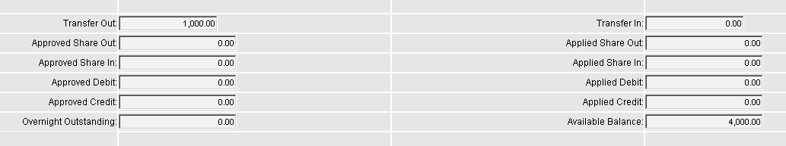{width="4.5472222222222225in"                 |
| height="0.8527777777777777in"}                                        |
|                                                                       |
| These information may be viewed through the relevant Inquire          |
| functions which are discussed in detail in the *EE* *Limit Management |
| Module* manual.                                                       |
+-----------------------------------------------------------------------+

 {#section-5 .CS-head1}

Add Limit Transfer by Pending {#add-limit-transfer-by-pending .CS-head1}
=============================

Credit lines can be transferred in these ways:

-   Among members of the same group

-   Between 2 customers that do not belong to any group (i.e., free
    customers)

-   Between sub-limits under the same Customer

**[EXAMPLE:]{.underline}**

i.  Customer A and Customer B belong to Group Z. Customer A can transfer
    part of his credit line to Customer B and vice versa.

ii. Customer C and Customer D are both free customers. Customer C can
    transfer part of his credit line to Customer D and vice versa.

iii. Customer E has 2 sub-limits: S1 and S2. The customer can transfer
    part of the credit line of S2 to S1. When the customer applies for a
    transaction which amount is USD 100,000.00 and the credit line is
    only USD 90,000.00, he can 'borrow' USD 10,000.00 (or more) from S2
    to cover the amount.

The following types of credit line cannot be transferred:

-   A credit line with a lower risk ratio cannot transfer a limit amount
    to a credit line with a higher risk ratio.

-   A non-revolving credit line

The system keeps track of all transferred limits and updates the credit
lines automatically.

The Add Limit Transfer by Pending function is used for transferring
limits. Records that are processed with this function require the
Release process through the Release Limit Transfer function.

  ------------------------------------------------------------------------------------------------------------------------------------------------------------------------
  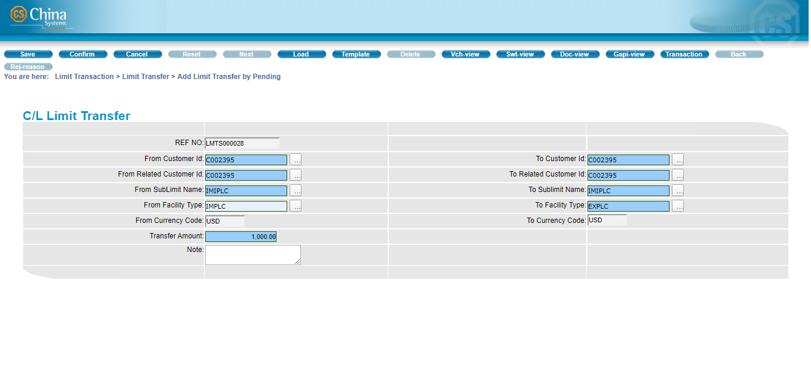{width="4.843055555555556in" height="2.1791666666666667in"}
  ------------------------------------------------------------------------------------------------------------------------------------------------------------------------

Figure 3. Add Limit Transfer by Pending Function

Configuration

This function provides the following fields.

  ------- -- -------------------
  Field      Field Description
  ------- -- -------------------

+-----------------------+-----------------------+-----------------------+
| **Ref No**            |                       | This is a unique      |
|                       |                       | reference number for  |
|                       |                       | this Limits transfer  |
|                       |                       | transaction.          |
|                       |                       |                       |
|                       |                       | This is a protected   |
|                       |                       | field.                |
+-----------------------+-----------------------+-----------------------+
|                       |                       |                       |
+-----------------------+-----------------------+-----------------------+
| **From Customer Id**  |                       | Specify the Id of the |
|                       |                       | Customer who owns the |
|                       |                       | credit line that is   |
|                       |                       | to be transferred.    |
|                       |                       | The lookup button     |
|                       |                       | that accompanies this |
|                       |                       | field may be used to  |
|                       |                       | retrieve the Id from  |
|                       |                       | the Customer table.   |
|                       |                       |                       |
|                       |                       | This is a mandatory   |
|                       |                       | field.                |
+-----------------------+-----------------------+-----------------------+
|                       |                       |                       |
+-----------------------+-----------------------+-----------------------+
| **To Customer Id**    |                       | Specify the Id of the |
|                       |                       | Customer to whom the  |
|                       |                       | credit line is to be  |
|                       |                       | transferred. The      |
|                       |                       | lookup button that    |
|                       |                       | accompanies this      |
|                       |                       | field may be used to  |
|                       |                       | retrieve the Id from  |
|                       |                       | the Customer table.   |
|                       |                       |                       |
|                       |                       | This is a mandatory   |
|                       |                       | field.                |
+-----------------------+-----------------------+-----------------------+
|                       |                       |                       |
+-----------------------+-----------------------+-----------------------+
| **From Related        |                       | When there is a       |
| Customer Id**         |                       | related customer for  |
|                       |                       | the customer          |
|                       |                       | transferring the      |
|                       |                       | credit line, the      |
|                       |                       | system automatically  |
|                       |                       | retrieves the         |
|                       |                       | information if the    |
|                       |                       | associated Id field   |
|                       |                       | is updated.           |
|                       |                       | Otherwise, this       |
|                       |                       | defaults to the       |
|                       |                       | indicated From        |
|                       |                       | Customer Id value.    |
|                       |                       |                       |
|                       |                       | This is a mandatory   |
|                       |                       | field.                |
+-----------------------+-----------------------+-----------------------+
|                       |                       |                       |
+-----------------------+-----------------------+-----------------------+
| **To Related Customer |                       | When there is a       |
| Id**                  |                       | related customer for  |
|                       |                       | the customer to whom  |
|                       |                       | the credit line is    |
|                       |                       | transferred, the      |
|                       |                       | system automatically  |
|                       |                       | retrieves the         |
|                       |                       | information if the    |
|                       |                       | associated Id field   |
|                       |                       | is updated.           |
|                       |                       | Otherwise, this       |
|                       |                       | defaults to the       |
|                       |                       | indicated To Customer |
|                       |                       | Id value.             |
|                       |                       |                       |
|                       |                       | This is a mandatory   |
|                       |                       | field.                |
+-----------------------+-----------------------+-----------------------+
|                       |                       |                       |
+-----------------------+-----------------------+-----------------------+
| **From Sublimit       |                       | Specify the name of   |
| Name**                |                       | the sub-limit that is |
|                       |                       | to be transferred.    |
|                       |                       | Use the lookup button |
|                       |                       | to select the         |
|                       |                       | Sub-limit Description |
|                       |                       | record; only the      |
|                       |                       | sub-limits defined    |
|                       |                       | for the customer      |
|                       |                       | indicated in the From |
|                       |                       | Customer Id field are |
|                       |                       | available for         |
|                       |                       | selection in the      |
|                       |                       | lookup window that is |
|                       |                       | displayed.            |
|                       |                       |                       |
|                       |                       | This is a mandatory   |
|                       |                       | field.                |
+-----------------------+-----------------------+-----------------------+
|                       |                       |                       |
+-----------------------+-----------------------+-----------------------+
| **To Sublimit Name**  |                       | Specify the name of   |
|                       |                       | the sub-limit to      |
|                       |                       | which the limit is    |
|                       |                       | transferred. Use the  |
|                       |                       | lookup button to      |
|                       |                       | select the Sub-limit  |
|                       |                       | Description record;   |
|                       |                       | only the sub-limits   |
|                       |                       | defined for the       |
|                       |                       | customer indicated in |
|                       |                       | the To Customer Id    |
|                       |                       | field are available   |
|                       |                       | for selection in the  |
|                       |                       | lookup window that is |
|                       |                       | displayed.            |
|                       |                       |                       |
|                       |                       | This is a mandatory   |
|                       |                       | field.                |
+-----------------------+-----------------------+-----------------------+
|                       |                       |                       |
+-----------------------+-----------------------+-----------------------+
| **From Facility       |                       | Specify the facility  |
| Type**                |                       | type under the source |
|                       |                       | sub-limit. Use the    |
|                       |                       | lookup button to      |
|                       |                       | select the Facility   |
|                       |                       | Type record; only the |
|                       |                       | member facilities     |
|                       |                       | defined for the       |
|                       |                       | specific sub-limit    |
|                       |                       | (From Sublimit Name)  |
|                       |                       | of the customer (From |
|                       |                       | Customer Id) are      |
|                       |                       | available for         |
|                       |                       | selection in the      |
|                       |                       | lookup window that is |
|                       |                       | displayed.            |
|                       |                       |                       |
|                       |                       | This is a mandatory   |
|                       |                       | field.                |
+-----------------------+-----------------------+-----------------------+
|                       |                       |                       |
+-----------------------+-----------------------+-----------------------+
| **To Facility Type**  |                       | Specify the facility  |
|                       |                       | type under the target |
|                       |                       | sub-limit. Use the    |
|                       |                       | lookup button to      |
|                       |                       | select the Facility   |
|                       |                       | Type record; only the |
|                       |                       | member facilities     |
|                       |                       | defined for the       |
|                       |                       | specific sub-limit    |
|                       |                       | (To Sublimit Name) of |
|                       |                       | the customer (To      |
|                       |                       | Customer Id) are      |
|                       |                       | available for         |
|                       |                       | selection in the      |
|                       |                       | lookup window that is |
|                       |                       | displayed.            |
|                       |                       |                       |
|                       |                       | This is a mandatory   |
|                       |                       | field.                |
+-----------------------+-----------------------+-----------------------+
|                       |                       |                       |
+-----------------------+-----------------------+-----------------------+
| **From Currency       |                       | This refers to the    |
| Code**                |                       | currency of the       |
|                       |                       | source sub-limit.     |
|                       |                       |                       |
|                       |                       | This is a protected   |
|                       |                       | field.                |
+-----------------------+-----------------------+-----------------------+
|                       |                       |                       |
+-----------------------+-----------------------+-----------------------+

+-----------------------+-----------------------+-----------------------+
| **To Currency Code**  |                       | This refers to the    |
|                       |                       | currency of the       |
|                       |                       | target sub-limit.     |
|                       |                       |                       |
|                       |                       | This is a protected   |
|                       |                       | field.                |
+-----------------------+-----------------------+-----------------------+
|                       |                       |                       |
+-----------------------+-----------------------+-----------------------+
| **Transfer Amount**   |                       | Specify the amount    |
|                       |                       | that is to be         |
|                       |                       | transferred from the  |
|                       |                       | source sub-limit to   |
|                       |                       | the target sub-limit. |
|                       |                       |                       |
|                       |                       | This is a mandatory   |
|                       |                       | field.                |
+-----------------------+-----------------------+-----------------------+
|                       |                       |                       |
+-----------------------+-----------------------+-----------------------+
| **Note**              |                       | Additional            |
|                       |                       | information on the    |
|                       |                       | transaction can be    |
|                       |                       | indicated in this     |
|                       |                       | field.                |
|                       |                       |                       |
|                       |                       | This is an optional   |
|                       |                       | field.                |
+-----------------------+-----------------------+-----------------------+

Procedure

  ------------------------
  Do the following . . .
  ------------------------

+-----------------------+-----------------------+-----------------------+
| 1\. Run the           |                       | {width="3.488194444 |
| Pending.              |                       | 4444444in"            |
|                       |                       | height="1.56805555555 |
|                       |                       | 55555in"}             |
+-----------------------+-----------------------+-----------------------+
|                       |                       |                       |
+-----------------------+-----------------------+-----------------------+
| 2\. The Add Limit     |                       |                   |
| function screen is    |                       |                       |
| displayed.            |                       |                       |
|                       |                       |                       |
| Specify the relevant  |                       |                       |
| information.          |                       |                       |
+-----------------------+-----------------------+-----------------------+
|                       |                       |                       |
+-----------------------+-----------------------+-----------------------+
| 3\. Click on the      |                       |                   |
| the toolbar.          |                       |                       |
+-----------------------+-----------------------+-----------------------+
|                       |                       |                       |
+-----------------------+-----------------------+-----------------------+
| 4\. The Transaction   |                       |                   |
| displayed.            |                       |                       |
|                       |                       |                       |
| To view the details   |                       |                       |
| of the transaction,   |                       |                       |
| click on the GAPI     |                       |                       |
| button.               |                       |                       |
|                       |                       |                       |
| To add another        |                       |                       |
| record, click on the  |                       |                       |
| Continue option.      |                       |                       |
|                       |                       |                       |
| To exit the function, |                       |                       |
| click on the Cancel   |                       |                       |
| button.               |                       |                       |
+-----------------------+-----------------------+-----------------------+

 {#section-6 .CS-head1}

Add Limit Transfer by Master {#add-limit-transfer-by-master .CS-head1}
============================

Credit lines can be transferred in these ways:

-   Among members of the same group

-   Between 2 customers that do not belong to any group (i.e., free
    customers)

-   Between sub-limits under the same Customer

**[EXAMPLE: ]{.underline}**

i.  Customer A and Customer B belong to Group Z. Customer A can transfer
    part of his credit line to Customer B and vice versa.

ii. Customer C and Customer D are both free customers. Customer C can
    transfer part of his credit line to Customer D and vice versa.

iii. Customer E has 2 sub-limits: S1 and S2. The customer can transfer
    part of the credit line for S2 to S1. When the customer applies for
    a transaction which amount is USD 100,000.00 and the credit line is
    only USD 90,000.00, he can 'borrow' USD 10,000.00 (or more) from S2
    to cover the amount.

The following types of credit line cannot be transferred:

-   A credit line with a lower risk ratio cannot transfer a limit amount
    to a credit line with a higher risk ratio.

-   A non-revolving credit line

The system keeps track of all transferred limits and updates the credit
lines automatically.

The Add Limit Transfer by Master function is used for transferring
limits. Records that are processed with this function do not require the
Release process (through the Release Limit Transfer function);
transactions are automatically posted to the master file.

  ---------------------------
  
  ---------------------------

Figure 3. Add Limit Transfer by Master Function

Configuration

This function provides the following fields.

  ------- -- -------------------
  Field      Field Description
  ------- -- -------------------

+-----------------------+-----------------------+-----------------------+
| **Ref No**            |                       | This is a unique      |
|                       |                       | reference number for  |
|                       |                       | this Limits transfer  |
|                       |                       | transaction.          |
|                       |                       |                       |
|                       |                       | This is a protected   |
|                       |                       | field.                |
+-----------------------+-----------------------+-----------------------+
|                       |                       |                       |
+-----------------------+-----------------------+-----------------------+
| **From Customer Id**  |                       | Specify the name of   |
|                       |                       | the sub-limit that is |
|                       |                       | to be transferred.    |
|                       |                       | Use the lookup button |
|                       |                       | to select the         |
|                       |                       | Sub-limit Description |
|                       |                       | record; only the      |
|                       |                       | sub-limits defined    |
|                       |                       | for the customer      |
|                       |                       | indicated in the From |
|                       |                       | Customer Id field are |
|                       |                       | available for         |
|                       |                       | selection in the      |
|                       |                       | lookup window that is |
|                       |                       | displayed.            |
|                       |                       |                       |
|                       |                       | This is a mandatory   |
|                       |                       | field.                |
+-----------------------+-----------------------+-----------------------+
|                       |                       |                       |
+-----------------------+-----------------------+-----------------------+
| **To Customer Id**    |                       | Specify the name of   |
|                       |                       | the sub-limit to      |
|                       |                       | which the limit is    |
|                       |                       | transferred. Use the  |
|                       |                       | lookup button to      |
|                       |                       | select the Sub-limit  |
|                       |                       | Description record;   |
|                       |                       | only the sub-limits   |
|                       |                       | defined for the       |
|                       |                       | customer indicated in |
|                       |                       | the To Customer Id    |
|                       |                       | field are available   |
|                       |                       | for selection in the  |
|                       |                       | lookup window that is |
|                       |                       | displayed.            |
|                       |                       |                       |
|                       |                       | This is a mandatory   |
|                       |                       | field.                |
+-----------------------+-----------------------+-----------------------+
|                       |                       |                       |
+-----------------------+-----------------------+-----------------------+
| **From Related        |                       | When there is a       |
| Customer Id**         |                       | related customer for  |
|                       |                       | the customer          |
|                       |                       | transferring the      |
|                       |                       | credit line, the      |
|                       |                       | system automatically  |
|                       |                       | retrieves the         |
|                       |                       | information if the    |
|                       |                       | associated Id field   |
|                       |                       | is updated.           |
|                       |                       | Otherwise, this       |
|                       |                       | defaults to the       |
|                       |                       | indicated From        |
|                       |                       | Customer Id value.    |
|                       |                       |                       |
|                       |                       | This is a mandatory   |
|                       |                       | field.                |
+-----------------------+-----------------------+-----------------------+
|                       |                       |                       |
+-----------------------+-----------------------+-----------------------+
| **To Related Customer |                       | When there is a       |
| Id**                  |                       | related customer for  |
|                       |                       | the customer to whom  |
|                       |                       | the credit line is    |
|                       |                       | transferred, the      |
|                       |                       | system automatically  |
|                       |                       | retrieves the         |
|                       |                       | information if the    |
|                       |                       | associated Id field   |
|                       |                       | is updated.           |
|                       |                       | Otherwise, this       |
|                       |                       | defaults to the       |
|                       |                       | indicated To Customer |
|                       |                       | Id value.             |
|                       |                       |                       |
|                       |                       | This is a mandatory   |
|                       |                       | field.                |
+-----------------------+-----------------------+-----------------------+
|                       |                       |                       |
+-----------------------+-----------------------+-----------------------+
| **From Sublimit       |                       | Specify the name of   |
| Name**                |                       | the sub-limit that is |
|                       |                       | to be transferred.    |
|                       |                       | Use the lookup button |
|                       |                       | to select the         |
|                       |                       | Sub-limit Description |
|                       |                       | record; only the      |
|                       |                       | sub-limits defined    |
|                       |                       | for the customer      |
|                       |                       | indicated in the From |
|                       |                       | Customer Id field are |
|                       |                       | available for         |
|                       |                       | selection in the      |
|                       |                       | lookup window that is |
|                       |                       | displayed.            |
|                       |                       |                       |
|                       |                       | This is a mandatory   |
|                       |                       | field.                |
+-----------------------+-----------------------+-----------------------+
|                       |                       |                       |
+-----------------------+-----------------------+-----------------------+
| **To Sublimit Name**  |                       | Specify the name of   |
|                       |                       | the sub-limit to      |
|                       |                       | which the limit is    |
|                       |                       | transferred. Use the  |
|                       |                       | lookup button to      |
|                       |                       | select the Sub-limit  |
|                       |                       | Description record;   |
|                       |                       | only the sub-limits   |
|                       |                       | defined for the       |
|                       |                       | customer indicated in |
|                       |                       | the To Customer Id    |
|                       |                       | field are available   |
|                       |                       | for selection in the  |
|                       |                       | lookup window that is |
|                       |                       | displayed.            |
|                       |                       |                       |
|                       |                       | This is a mandatory   |
|                       |                       | field.                |
+-----------------------+-----------------------+-----------------------+
|                       |                       |                       |
+-----------------------+-----------------------+-----------------------+
| **From Facility       |                       | Specify the facility  |
| Type**                |                       | type under the source |
|                       |                       | sub-limit. Use the    |
|                       |                       | lookup button to      |
|                       |                       | select the Facility   |
|                       |                       | Type record; only the |
|                       |                       | member facilities     |
|                       |                       | defined for the       |
|                       |                       | specific sub-limit    |
|                       |                       | (From Sublimit Name)  |
|                       |                       | of the customer (From |
|                       |                       | Customer Id) are      |
|                       |                       | available for         |
|                       |                       | selection in the      |
|                       |                       | lookup window that is |
|                       |                       | displayed.            |
|                       |                       |                       |
|                       |                       | This is a mandatory   |
|                       |                       | field.                |
+-----------------------+-----------------------+-----------------------+
|                       |                       |                       |
+-----------------------+-----------------------+-----------------------+
| **To Facility Type**  |                       | Specify the facility  |
|                       |                       | type under the target |
|                       |                       | sub-limit. Use the    |
|                       |                       | lookup button to      |
|                       |                       | select the Facility   |
|                       |                       | Type record; only the |
|                       |                       | member facilities     |
|                       |                       | defined for the       |
|                       |                       | specific sub-limit    |
|                       |                       | (To Sublimit Name) of |
|                       |                       | the customer (To      |
|                       |                       | Customer Id) are      |
|                       |                       | available for         |
|                       |                       | selection in the      |
|                       |                       | lookup window that is |
|                       |                       | displayed.            |
|                       |                       |                       |
|                       |                       | This is a mandatory   |
|                       |                       | field.                |
+-----------------------+-----------------------+-----------------------+
|                       |                       |                       |
+-----------------------+-----------------------+-----------------------+
| **From Currency       |                       | This refers to the    |
| Code**                |                       | currency of the       |
|                       |                       | source sub-limit.     |
|                       |                       |                       |
|                       |                       | This is a protected   |
|                       |                       | field.                |
+-----------------------+-----------------------+-----------------------+
|                       |                       |                       |
+-----------------------+-----------------------+-----------------------+

+-----------------------+-----------------------+-----------------------+
| **To Currency Code**  |                       | This refers to the    |
|                       |                       | currency of the       |
|                       |                       | target sub-limit.     |
|                       |                       |                       |
|                       |                       | This is a protected   |
|                       |                       | field.                |
+-----------------------+-----------------------+-----------------------+
|                       |                       |                       |
+-----------------------+-----------------------+-----------------------+
| **Transfer Amount**   |                       | Specify the amount    |
|                       |                       | that is to be         |
|                       |                       | transferred from the  |
|                       |                       | source sub-limit to   |
|                       |                       | the target sub-limit. |
|                       |                       |                       |
|                       |                       | This is a mandatory   |
|                       |                       | field.                |
+-----------------------+-----------------------+-----------------------+
|                       |                       |                       |
+-----------------------+-----------------------+-----------------------+
| **Note**              |                       | Additional            |
|                       |                       | information on the    |
|                       |                       | transaction can be    |
|                       |                       | indicated in this     |
|                       |                       | field.                |
|                       |                       |                       |
|                       |                       | This is an optional   |
|                       |                       | field.                |
+-----------------------+-----------------------+-----------------------+

Procedure

  ------------------------
  Do the following . . .
  ------------------------

+-----------------------+-----------------------+-----------------------+
| 1\. Run the           |                       |                   |
|                       |                       |                       |
| Limit Transaction \>  |                       |                       |
| Limit Transfer \> Add |                       |                       |
| Limit Transfer by     |                       |                       |
| Master.               |                       |                       |
+-----------------------+-----------------------+-----------------------+
|                       |                       |                       |
+-----------------------+-----------------------+-----------------------+
| 2\. The Add Limit     |                       |                   |
| function screen is    |                       |                       |
| displayed.            |                       |                       |
|                       |                       |                       |
| Specify the relevant  |                       |                       |
| information.          |                       |                       |
+-----------------------+-----------------------+-----------------------+
|                       |                       |                       |
+-----------------------+-----------------------+-----------------------+
| 3\. Click on the      |                       |                   |
| the toolbar.          |                       |                       |
+-----------------------+-----------------------+-----------------------+
|                       |                       |                       |
+-----------------------+-----------------------+-----------------------+
| 4\. The Transaction   |                       |                   |
| displayed.            |                       |                       |
|                       |                       |                       |
| To view the details   |                       |                       |
| of the transaction,   |                       |                       |
| click on the GAPI     |                       |                       |
| button.               |                       |                       |
|                       |                       |                       |
| To add another        |                       |                       |
| record, click on the  |                       |                       |
| Continue option.      |                       |                       |
|                       |                       |                       |
| To exit the function, |                       |                       |
| click on the Cancel   |                       |                       |
| button.               |                       |                       |
+-----------------------+-----------------------+-----------------------+

 {#section-7 .CS-head1}

Pay Limit Transfer by Pending {#pay-limit-transfer-by-pending .CS-head1}
=============================

This function is used for processing payments of transferred (borrowed)
limits.

Records that are processed with this function require the Release
process through the Release Limit Transfer function.

{width="0.3368055555555556in"
height="0.3368055555555556in"}NOTE:

i.  A Limit Transfer transaction involves one "source" limit and one
    "target" limit, with the source being the customer, sub-limit, or
    facility type that owns the credit line to be transferred, and the
    target being the customer, sub-limit, or facility type to which the
    credit line is transferred.

ii. After a source transfers part of the credit line to a target limit
    (through the Add Limit Transfer function), the target must "return"
    or transfer back the "borrowed" credit line to the source limit. For
    instance, if Customer A (source) transfers part of his credit line
    to Customer B (target), Customer B must return the borrowed credit
    line to Customer A.

iii. In the Add Limit Transfer by Pending function, the "source" is the
    From Customer, From Sub-limit Name, From Facility Type and the
    "target" is the To Customer, To Sub-limit Name, and To Facility
    Type.

iv. In the Pay Limit Transfer by Pending function, the "source" is the
    To Customer, To Sub-limit Name, and To Facility Type, while the From
    Customer, From Sub-limit Name, From Facility Type become the
    "target".

+-----------------------------------------------------------------------+
|   ------------------------------------------------------------------- |
| ----------------                                                      |
|   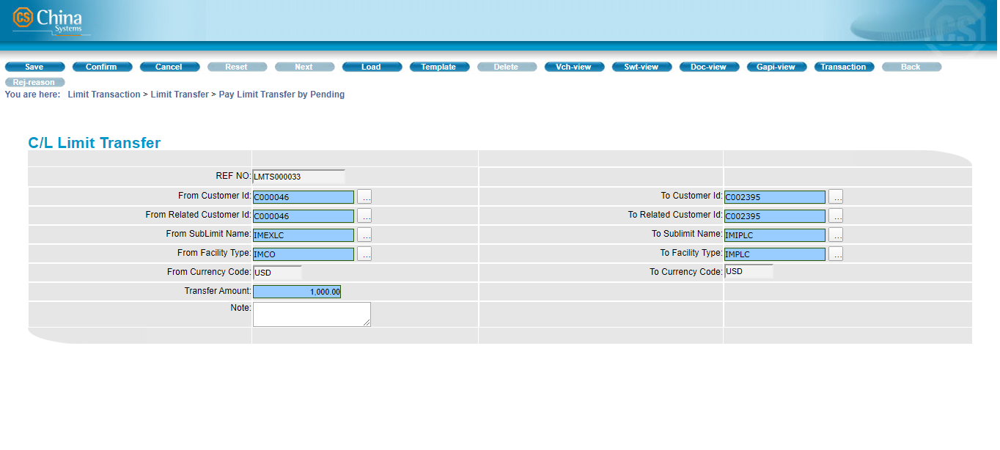{width="4.4473687664042in" height="2.0096 |
| 3145231846in"}                                                        |
|   ------------------------------------------------------------------- |
| ----------------                                                      |
+-----------------------------------------------------------------------+

Figure 3. Pay Limit Transfer by Pending Function

Configuration

This function provides the following fields.

  ------- -- -------------------
  Field      Field Description
  ------- -- -------------------

+-----------------------+-----------------------+-----------------------+
| **Ref No**            |                       | This is a unique      |
|                       |                       | reference number for  |
|                       |                       | this Limits transfer  |
|                       |                       | transaction.          |
|                       |                       |                       |
|                       |                       | This is a protected   |
|                       |                       | field.                |
+-----------------------+-----------------------+-----------------------+
|                       |                       |                       |
+-----------------------+-----------------------+-----------------------+
| **From Customer Id**  |                       | This displays the Id  |
|                       |                       | of the Customer to    |
|                       |                       | whom the credit line  |
|                       |                       | is to be returned.    |
|                       |                       | This is the customer  |
|                       |                       | who owns the credit   |
|                       |                       | line that was         |
|                       |                       | transferred (through  |
|                       |                       | the Add Limit         |
|                       |                       | Transfer function) to |
|                       |                       | the To Customer.      |
|                       |                       |                       |
|                       |                       | This is a mandatory   |
|                       |                       | field.                |
|                       |                       |                       |
|                       |                       | **[NOTE:]{.underline} |
|                       |                       | **                    |
|                       |                       |                       |
|                       |                       | Only when the         |
|                       |                       | incorrect Customer Id |
|                       |                       | is displayed must the |
|                       |                       | value of this field   |
|                       |                       | be modified. The      |
|                       |                       | lookup button that    |
|                       |                       | accompanies this      |
|                       |                       | field may be used to  |
|                       |                       | retrieve the Id from  |
|                       |                       | the Customer table.   |
+-----------------------+-----------------------+-----------------------+
|                       |                       |                       |
+-----------------------+-----------------------+-----------------------+
| **To Customer Id**    |                       | This displays the Id  |
|                       |                       | of the Customer who   |
|                       |                       | is to return the      |
|                       |                       | transferred credit    |
|                       |                       | line. This is the     |
|                       |                       | customer to whom the  |
|                       |                       | credit line was       |
|                       |                       | transferred during    |
|                       |                       | the Add Limit         |
|                       |                       | Transfer transaction. |
|                       |                       |                       |
|                       |                       | This is a mandatory   |
|                       |                       | field.                |
|                       |                       |                       |
|                       |                       | **[NOTE:]{.underline} |
|                       |                       | **                    |
|                       |                       |                       |
|                       |                       | Only when the         |
|                       |                       | incorrect Customer Id |
|                       |                       | is displayed must the |
|                       |                       | value of this field   |
|                       |                       | be modified. The      |
|                       |                       | lookup button that    |
|                       |                       | accompanies this      |
|                       |                       | field may be used to  |
|                       |                       | retrieve the Id from  |
|                       |                       | the Customer table.   |
+-----------------------+-----------------------+-----------------------+
|                       |                       |                       |
+-----------------------+-----------------------+-----------------------+
| **From Related        |                       | When there is a       |
| Customer Id**         |                       | related customer for  |
|                       |                       | the customer to whom  |
|                       |                       | the borrowed credit   |
|                       |                       | line is to be         |
|                       |                       | returned, the system  |
|                       |                       | automatically         |
|                       |                       | retrieves the         |
|                       |                       | information if the    |
|                       |                       | associated Id field   |
|                       |                       | is updated.           |
|                       |                       | Otherwise, this       |
|                       |                       | defaults to the       |
|                       |                       | indicated From        |
|                       |                       | Customer Id value.    |
|                       |                       |                       |
|                       |                       | This is a mandatory   |
|                       |                       | field.                |
+-----------------------+-----------------------+-----------------------+
|                       |                       |                       |
+-----------------------+-----------------------+-----------------------+
| **To Related Customer |                       | When there is a       |
| Id**                  |                       | related customer for  |
|                       |                       | the customer          |
|                       |                       | returning the         |
|                       |                       | borrowed credit line, |
|                       |                       | the system            |
|                       |                       | automatically         |
|                       |                       | retrieves the         |
|                       |                       | information if the    |
|                       |                       | associated Id field   |
|                       |                       | is updated.           |
|                       |                       | Otherwise, this       |
|                       |                       | defaults to the       |
|                       |                       | indicated To Customer |
|                       |                       | Id value.             |
|                       |                       |                       |
|                       |                       | This is a mandatory   |
|                       |                       | field.                |
+-----------------------+-----------------------+-----------------------+
|                       |                       |                       |
+-----------------------+-----------------------+-----------------------+
| **From Sublimit       |                       | This displays the     |
| Name**                |                       | name of the sub-limit |
|                       |                       | to which the credit   |
|                       |                       | line is to be         |
|                       |                       | returned.             |
|                       |                       |                       |
|                       |                       | This is a mandatory   |
|                       |                       | field.                |
|                       |                       |                       |
|                       |                       | **[NOTE:]{.underline} |
|                       |                       | **                    |
|                       |                       |                       |
|                       |                       | Only when the         |
|                       |                       | incorrect sub-limit   |
|                       |                       | is displayed must the |
|                       |                       | value of this field   |
|                       |                       | be modified. Use the  |
|                       |                       | lookup button to      |
|                       |                       | select the Sub-limit  |
|                       |                       | Description record;   |
|                       |                       | only the sub-limits   |
|                       |                       | defined for the       |
|                       |                       | customer indicated in |
|                       |                       | the From Customer Id  |
|                       |                       | field are available   |
|                       |                       | for selection in the  |
|                       |                       | lookup window that is |
|                       |                       | displayed.            |
+-----------------------+-----------------------+-----------------------+
|                       |                       |                       |
+-----------------------+-----------------------+-----------------------+
| **To Sublimit Name**  |                       | This displays the     |
|                       |                       | name of the sub-limit |
|                       |                       | that is to return the |
|                       |                       | borrowed credit line. |
|                       |                       |                       |
|                       |                       | This is a mandatory   |
|                       |                       | field.                |
|                       |                       |                       |
|                       |                       | **[NOTE:]{.underline} |
|                       |                       | **                    |
|                       |                       |                       |
|                       |                       | Only when the         |
|                       |                       | incorrect sub-limit   |
|                       |                       | is displayed must the |
|                       |                       | value of this field   |
|                       |                       | be modified. Use the  |
|                       |                       | lookup button to      |
|                       |                       | select the Sub-limit  |
|                       |                       | Description record;   |
|                       |                       | only the sub-limits   |
|                       |                       | defined for the       |
|                       |                       | customer indicated in |
|                       |                       | the From Customer Id  |
|                       |                       | field are available   |
|                       |                       | for selection in the  |
|                       |                       | lookup window that is |
|                       |                       | displayed.            |
+-----------------------+-----------------------+-----------------------+
|                       |                       |                       |
+-----------------------+-----------------------+-----------------------+
| **From Facility       |                       | This displays the     |
| Type**                |                       | facility type under   |
|                       |                       | the target sub-limit. |
|                       |                       |                       |
|                       |                       | This is a mandatory   |
|                       |                       | field.                |
|                       |                       |                       |
|                       |                       | **[NOTE:]{.underline} |
|                       |                       | **                    |
|                       |                       |                       |
|                       |                       | Only when the         |
|                       |                       | incorrect sub-limit   |
|                       |                       | is displayed must the |
|                       |                       | value of this field   |
|                       |                       | be modified. Use the  |
|                       |                       | lookup button to      |
|                       |                       | select the Facility   |
|                       |                       | Type record; only the |
|                       |                       | member facilities     |
|                       |                       | defined for the       |
|                       |                       | specific sub-limit    |
|                       |                       | (From Sublimit Name)  |
|                       |                       | of the customer (From |
|                       |                       | Customer Id) are      |
|                       |                       | available for         |
|                       |                       | selection in the      |
|                       |                       | lookup window that is |
|                       |                       | displayed.            |
+-----------------------+-----------------------+-----------------------+
|                       |                       |                       |
+-----------------------+-----------------------+-----------------------+
| **To Facility Type**  |                       | This displays the     |
|                       |                       | facility type under   |
|                       |                       | the source sub-limit. |
|                       |                       |                       |
|                       |                       | This is a mandatory   |
|                       |                       | field.                |
|                       |                       |                       |
|                       |                       | **[NOTE:]{.underline} |
|                       |                       | **                    |
|                       |                       |                       |
|                       |                       | Only when the         |
|                       |                       | incorrect sub-limit   |
|                       |                       | is displayed must the |
|                       |                       | value of this field   |
|                       |                       | be modified. Use the  |
|                       |                       | lookup button to      |
|                       |                       | select the Facility   |
|                       |                       | Type record; only the |
|                       |                       | member facilities     |
|                       |                       | defined for the       |
|                       |                       | specific sub-limit    |
|                       |                       | (To Sublimit Name) of |
|                       |                       | the customer (To      |
|                       |                       | Customer Id) are      |
|                       |                       | available for         |
|                       |                       | selection in the      |
|                       |                       | lookup window that is |
|                       |                       | displayed.            |
+-----------------------+-----------------------+-----------------------+
|                       |                       |                       |
+-----------------------+-----------------------+-----------------------+
| **From Currency       |                       | This refers to the    |
| Code**                |                       | currency of the       |
|                       |                       | target sub-limit.     |
|                       |                       |                       |
|                       |                       | This is a protected   |
|                       |                       | field.                |
+-----------------------+-----------------------+-----------------------+
|                       |                       |                       |
+-----------------------+-----------------------+-----------------------+
| **To Currency Code**  |                       | This refers to the    |
|                       |                       | currency of the       |
|                       |                       | source sub-limit.     |
|                       |                       |                       |
|                       |                       | This is a protected   |
|                       |                       | field.                |
+-----------------------+-----------------------+-----------------------+
|                       |                       |                       |
+-----------------------+-----------------------+-----------------------+
| **Transfer Amount**   |                       | Specify the amount    |
|                       |                       | that is to be         |
|                       |                       | transferred from the  |
|                       |                       | source sub-limit to   |
|                       |                       | the target sub-limit. |
|                       |                       |                       |
|                       |                       | This is a mandatory   |
|                       |                       | field.                |
+-----------------------+-----------------------+-----------------------+
|                       |                       |                       |
+-----------------------+-----------------------+-----------------------+
| **Note**              |                       | Additional            |
|                       |                       | information on the    |
|                       |                       | transaction can be    |
|                       |                       | indicated in this     |
|                       |                       | field.                |
|                       |                       |                       |
|                       |                       | This is an optional   |
|                       |                       | field.                |
+-----------------------+-----------------------+-----------------------+

Procedure

  ------------------------
  Do the following . . .
  ------------------------

+-----------------------+-----------------------+-----------------------+
| 1\. Run the           |                       |                   |
|                       |                       |                       |
| Limit Transaction \>  |                       |                       |
| Limit Transfer \> Pay |                       |                       |
| Limit Transfer by     |                       |                       |
| Pending.              |                       |                       |
+-----------------------+-----------------------+-----------------------+
|                       |                       |                       |
+-----------------------+-----------------------+-----------------------+
| 2\. The Pay Limit     |                       |                   |
| function catalog      |                       |                       |
| screen is             |                       |                       |
| displayed.            |                       |                       |
|                       |                       |                       |
| To create the filter  |                       |                       |
| criteria for          |                       |                       |
| displaying records,   |                       |                       |
| specify the value for |                       |                       |
| the MAIN REF NO       |                       |                       |
| field.                |                       |                       |
|                       |                       |                       |
| Click on the Next     |                       |                       |
| button.               |                       |                       |
+-----------------------+-----------------------+-----------------------+
|                       |                       |                       |
+-----------------------+-----------------------+-----------------------+
| 3\. Select the        |                       | {width="3.491666 |
| from the list that    |                       | 6666666667in"         |
| is displayed. Click   |                       | height="1.57777777777 |
| on the Next button.   |                       | 77777in"}             |
+-----------------------+-----------------------+-----------------------+
|                       |                       |                       |
+-----------------------+-----------------------+-----------------------+
| 4\. The Pay Limit     |                       | {width="3.491666 |
| function screen is    |                       | 6666666667in"         |
| displayed.            |                       | height="1.57777777777 |
|                       |                       | 77777in"}             |
| Specify the relevant  |                       |                       |
| information.          |                       |                       |
+-----------------------+-----------------------+-----------------------+
|                       |                       |                       |
+-----------------------+-----------------------+-----------------------+
| 5\. Click on the      |                       |                   |
| the toolbar.          |                       |                       |
+-----------------------+-----------------------+-----------------------+
|                       |                       |                       |
+-----------------------+-----------------------+-----------------------+
| 6\. The Transaction   |                       |                   |
| displayed.            |                       |                       |
|                       |                       |                       |
| To view the details   |                       |                       |
| of the transaction,   |                       |                       |
| click on the GAPI     |                       |                       |
| button.               |                       |                       |
|                       |                       |                       |
| To process another    |                       |                       |
| record, click on the  |                       |                       |
| Continue option.      |                       |                       |
|                       |                       |                       |
| To exit the function, |                       |                       |
| click on the Cancel   |                       |                       |
| button.               |                       |                       |
+-----------------------+-----------------------+-----------------------+

 {#section-8 .CS-head1}

Pay Limit Transfer by Master {#pay-limit-transfer-by-master .CS-head1}
============================

This function is used for processing payments of transferred (borrowed)
limits.

Records that are processed with this function do not require the Release
process (through the Release Limit Transfer function); transactions are
automatically posted to the master file.

  ---------------------------
  
  ---------------------------

Figure 3. Pay Limit Transfer by Master Function

{width="0.3368055555555556in"
height="0.3368055555555556in"}NOTE:

i.  A Limit Transfer transaction involves one "source" limit and one
    "target" limit, with the source being the customer, sub-limit, or
    facility type that owns the credit line to be transferred, and the
    target being the customer, sub-limit, or facility type to which the
    credit line is transferred.

ii. After a source transfers part of the credit line to a target limit
    (through the Add Limit Transfer function), the target must "return"
    or transfer back the "borrowed" credit line to the source limit. For
    instance, if Customer A (source) transfers part of his credit line
    to Customer B (target), Customer B must return the borrowed credit
    line to Customer A.

iii. In the Add Limit Transfer by Pending function, the "source" is the
    From Customer, From Sub-limit Name, From Facility Type and the
    "target" is the To Customer, To Sub-limit Name, and To Facility
    Type.

iv. In the Pay Limit Transfer by Pending function, the "source" is the
    To Customer, To Sub-limit Name, and To Facility Type, while the From
    Customer, From Sub-limit Name, From Facility Type become the
    "target"

Configuration

This function provides the following fields.

  ------- -- -------------------
  Field      Field Description
  ------- -- -------------------

+-----------------------+-----------------------+-----------------------+
| **Ref No**            |                       | This is a unique      |
|                       |                       | reference number for  |
|                       |                       | this Limits transfer  |
|                       |                       | transaction.          |
|                       |                       |                       |
|                       |                       | This is a protected   |
|                       |                       | field.                |
+-----------------------+-----------------------+-----------------------+
|                       |                       |                       |
+-----------------------+-----------------------+-----------------------+
| **From Customer Id**  |                       | This displays the Id  |
|                       |                       | of the Customer to    |
|                       |                       | whom the credit line  |
|                       |                       | is to be returned.    |
|                       |                       | This is the customer  |
|                       |                       | who owns the credit   |
|                       |                       | line that was         |
|                       |                       | transferred (through  |
|                       |                       | the Add Limit         |
|                       |                       | Transfer function) to |
|                       |                       | the To Customer.      |
|                       |                       |                       |
|                       |                       | This is a mandatory   |
|                       |                       | field.                |
|                       |                       |                       |
|                       |                       | **[NOTE:]{.underline} |
|                       |                       | **                    |
|                       |                       |                       |
|                       |                       | Only when the         |
|                       |                       | incorrect Customer Id |
|                       |                       | is displayed must the |
|                       |                       | value of this field   |
|                       |                       | be modified. The      |
|                       |                       | lookup button that    |
|                       |                       | accompanies this      |
|                       |                       | field may be used to  |
|                       |                       | retrieve the Id from  |
|                       |                       | the Customer table.   |
+-----------------------+-----------------------+-----------------------+
|                       |                       |                       |
+-----------------------+-----------------------+-----------------------+
| **To Customer Id**    |                       | This displays the Id  |
|                       |                       | of the Customer who   |
|                       |                       | is to return the      |
|                       |                       | borrowed credit line. |
|                       |                       | This is the customer  |
|                       |                       | to whom the credit    |
|                       |                       | line was transferred  |
|                       |                       | during the Add Limit  |
|                       |                       | Transfer transaction. |
|                       |                       |                       |
|                       |                       | This is a mandatory   |
|                       |                       | field.                |
|                       |                       |                       |
|                       |                       | **[NOTE:]{.underline} |
|                       |                       | **                    |
|                       |                       |                       |
|                       |                       | Only when the         |
|                       |                       | incorrect Customer Id |
|                       |                       | is displayed must the |
|                       |                       | value of this field   |
|                       |                       | be modified. The      |
|                       |                       | lookup button that    |
|                       |                       | accompanies this      |
|                       |                       | field may be used to  |
|                       |                       | retrieve the Id from  |
|                       |                       | the Customer table.   |
+-----------------------+-----------------------+-----------------------+
|                       |                       |                       |
+-----------------------+-----------------------+-----------------------+
| **From Related        |                       | When there is a       |
| Customer Id**         |                       | related customer for  |
|                       |                       | the customer to whom  |
|                       |                       | the borrowed credit   |
|                       |                       | line is to be         |
|                       |                       | returned, the system  |
|                       |                       | automatically         |
|                       |                       | retrieves the         |
|                       |                       | information if the    |
|                       |                       | associated Id field   |
|                       |                       | is updated.           |
|                       |                       | Otherwise, this       |
|                       |                       | defaults to the       |
|                       |                       | indicated From        |
|                       |                       | Customer Id value.    |
|                       |                       |                       |
|                       |                       | This is a mandatory   |
|                       |                       | field.                |
+-----------------------+-----------------------+-----------------------+
|                       |                       |                       |
+-----------------------+-----------------------+-----------------------+
| **To Related Customer |                       | When there is a       |
| Id**                  |                       | related customer for  |
|                       |                       | the customer          |
|                       |                       | returning the         |
|                       |                       | borrowed credit line, |
|                       |                       | the system            |
|                       |                       | automatically         |
|                       |                       | retrieves the         |
|                       |                       | information if the    |
|                       |                       | associated Id field   |
|                       |                       | is updated.           |
|                       |                       | Otherwise, this       |
|                       |                       | defaults to the       |
|                       |                       | indicated To Customer |
|                       |                       | Id value.             |
|                       |                       |                       |
|                       |                       | This is a mandatory   |
|                       |                       | field.                |
+-----------------------+-----------------------+-----------------------+
|                       |                       |                       |
+-----------------------+-----------------------+-----------------------+
| **From Sublimit       |                       | This displays the     |
| Name**                |                       | name of the sub-limit |
|                       |                       | to which the credit   |
|                       |                       | line is to be         |
|                       |                       | returned.             |
|                       |                       |                       |
|                       |                       | This is a mandatory   |
|                       |                       | field.                |
|                       |                       |                       |
|                       |                       | **[NOTE:]{.underline} |
|                       |                       | **                    |
|                       |                       |                       |
|                       |                       | Only when the         |
|                       |                       | incorrect sub-limit   |
|                       |                       | is displayed must the |
|                       |                       | value of this field   |
|                       |                       | be modified. Use the  |
|                       |                       | lookup button to      |
|                       |                       | select the Sub-limit  |
|                       |                       | Description record;   |
|                       |                       | only the sub-limits   |
|                       |                       | defined for the       |
|                       |                       | customer indicated in |
|                       |                       | the From Customer Id  |
|                       |                       | field are available   |
|                       |                       | for selection in the  |
|                       |                       | lookup window that is |
|                       |                       | displayed.            |
+-----------------------+-----------------------+-----------------------+
|                       |                       |                       |
+-----------------------+-----------------------+-----------------------+
| **To Sublimit Name**  |                       | This displays the     |
|                       |                       | name of the sub-limit |
|                       |                       | that is to return the |
|                       |                       | borrowed credit line. |
|                       |                       |                       |
|                       |                       | This is a mandatory   |
|                       |                       | field.                |
|                       |                       |                       |
|                       |                       | **[NOTE:]{.underline} |
|                       |                       | **                    |
|                       |                       |                       |
|                       |                       | Only when the         |
|                       |                       | incorrect sub-limit   |
|                       |                       | is displayed must the |
|                       |                       | value of this field   |
|                       |                       | be modified. Use the  |
|                       |                       | lookup button to      |
|                       |                       | select the Sub-limit  |
|                       |                       | Description record;   |
|                       |                       | only the sub-limits   |
|                       |                       | defined for the       |
|                       |                       | customer indicated in |
|                       |                       | the From Customer Id  |
|                       |                       | field are available   |
|                       |                       | for selection in the  |
|                       |                       | lookup window that is |
|                       |                       | displayed.            |
+-----------------------+-----------------------+-----------------------+
|                       |                       |                       |
+-----------------------+-----------------------+-----------------------+
| **From Facility       |                       | This displays the     |
| Type**                |                       | facility type under   |
|                       |                       | the target sub-limit. |
|                       |                       |                       |
|                       |                       | This is a mandatory   |
|                       |                       | field.                |
|                       |                       |                       |
|                       |                       | **[NOTE:]{.underline} |
|                       |                       | **                    |
|                       |                       |                       |
|                       |                       | Only when the         |
|                       |                       | incorrect sub-limit   |
|                       |                       | is displayed must the |
|                       |                       | value of this field   |
|                       |                       | be modified. Use the  |
|                       |                       | lookup button to      |
|                       |                       | select the Facility   |
|                       |                       | Type record; only the |
|                       |                       | member facilities     |
|                       |                       | defined for the       |
|                       |                       | specific sub-limit    |
|                       |                       | (From Sublimit Name)  |
|                       |                       | of the customer (From |
|                       |                       | Customer Id) are      |
|                       |                       | available for         |
|                       |                       | selection in the      |
|                       |                       | lookup window that is |
|                       |                       | displayed.            |
+-----------------------+-----------------------+-----------------------+
|                       |                       |                       |
+-----------------------+-----------------------+-----------------------+
| **To Facility Type**  |                       | This displays the     |
|                       |                       | facility type under   |
|                       |                       | the source sub-limit. |
|                       |                       |                       |
|                       |                       | This is a mandatory   |
|                       |                       | field.                |
|                       |                       |                       |
|                       |                       | **[NOTE:]{.underline} |
|                       |                       | **                    |
|                       |                       |                       |
|                       |                       | Only when the         |
|                       |                       | incorrect sub-limit   |
|                       |                       | is displayed must the |
|                       |                       | value of this field   |
|                       |                       | be modified. Use the  |
|                       |                       | lookup button to      |
|                       |                       | select the Facility   |
|                       |                       | Type record; only the |
|                       |                       | member facilities     |
|                       |                       | defined for the       |
|                       |                       | specific sub-limit    |
|                       |                       | (To Sublimit Name) of |
|                       |                       | the customer (To      |
|                       |                       | Customer Id) are      |
|                       |                       | available for         |
|                       |                       | selection in the      |
|                       |                       | lookup window that is |
|                       |                       | displayed.            |
+-----------------------+-----------------------+-----------------------+
|                       |                       |                       |
+-----------------------+-----------------------+-----------------------+
| **From Currency       |                       | This refers to the    |
| Code**                |                       | currency of the       |
|                       |                       | target sub-limit.     |
|                       |                       |                       |
|                       |                       | This is a protected   |
|                       |                       | field.                |
+-----------------------+-----------------------+-----------------------+
|                       |                       |                       |
+-----------------------+-----------------------+-----------------------+
| **To Currency Code**  |                       | This refers to the    |
|                       |                       | currency of the       |
|                       |                       | source sub-limit.     |
|                       |                       |                       |
|                       |                       | This is a protected   |
|                       |                       | field.                |
+-----------------------+-----------------------+-----------------------+
|                       |                       |                       |
+-----------------------+-----------------------+-----------------------+
| **Transfer Amount**   |                       | Specify the amount    |
|                       |                       | that is to be shared  |
|                       |                       | or transferred from   |
|                       |                       | the source sub-limit  |
|                       |                       | to the target         |
|                       |                       | sub-limit.            |
|                       |                       |                       |
|                       |                       | This is a mandatory   |
|                       |                       | field.                |
+-----------------------+-----------------------+-----------------------+
|                       |                       |                       |
+-----------------------+-----------------------+-----------------------+
| **Note**              |                       | Additional            |
|                       |                       | information on the    |
|                       |                       | transaction can be    |
|                       |                       | indicated in this     |
|                       |                       | field.                |
|                       |                       |                       |
|                       |                       | This is an optional   |
|                       |                       | field.                |
+-----------------------+-----------------------+-----------------------+

Procedure

  ------------------------
  Do the following . . .
  ------------------------

+-----------------------+-----------------------+-----------------------+
| 1\. Run the           |                       |                   |
|                       |                       |                       |
| Limit Transaction \>  |                       |                       |
| Limit Transfer \> Pay |                       |                       |
| Limit Transfer by     |                       |                       |
| Master.               |                       |                       |
+-----------------------+-----------------------+-----------------------+
|                       |                       |                       |
+-----------------------+-----------------------+-----------------------+
| 2\. The Pay Limit     |                       |                   |
| function catalog      |                       |                       |
| screen is             |                       |                       |
| displayed.            |                       |                       |
|                       |                       |                       |
| To create the filter  |                       |                       |
| criteria for          |                       |                       |
| displaying records,   |                       |                       |
| specify the value for |                       |                       |
| the MAIN REF NO       |                       |                       |
| field.                |                       |                       |
|                       |                       |                       |
| Click on the Next     |                       |                       |
| button.               |                       |                       |
+-----------------------+-----------------------+-----------------------+
|                       |                       |                       |
+-----------------------+-----------------------+-----------------------+
| 3\. Select the        |                       |                   |
| from the list that    |                       |                       |
| is displayed. Click   |                       |                       |
| on the Next button.   |                       |                       |
+-----------------------+-----------------------+-----------------------+
|                       |                       |                       |
+-----------------------+-----------------------+-----------------------+
| 4\. The Pay Limit     |                       |                   |
| function screen is    |                       |                       |
| displayed.            |                       |                       |
|                       |                       |                       |
| Specify the relevant  |                       |                       |
| information.          |                       |                       |
+-----------------------+-----------------------+-----------------------+
|                       |                       |                       |
+-----------------------+-----------------------+-----------------------+
| 5\. Click on the      |                       |                   |
| the toolbar.          |                       |                       |
+-----------------------+-----------------------+-----------------------+
|                       |                       |                       |
+-----------------------+-----------------------+-----------------------+
| 6\. The Transaction   |                       |                   |
| displayed.            |                       |                       |
|                       |                       |                       |
| To view the details   |                       |                       |
| of the transaction,   |                       |                       |
| click on the GAPI     |                       |                       |
| button.               |                       |                       |
|                       |                       |                       |
| To process another    |                       |                       |
| record, click on the  |                       |                       |
| Continue option.      |                       |                       |
|                       |                       |                       |
| To exit the function, |                       |                       |
| click on the Cancel   |                       |                       |
| button.               |                       |                       |
+-----------------------+-----------------------+-----------------------+

 {#section-9 .CS-head1}

Fix Pending Limit Transfer {#fix-pending-limit-transfer .CS-head1}
==========================

This function is used for correcting or modifying a pending Limits
transfer transaction. The original transaction screen is displayed for
modifying the record.

Records that are processed with this function require the Release
process through the Release Limit Transfer function.

  ------------------------
  Do the following . . .
  ------------------------

+-----------------------+-----------------------+-----------------------+
| 1\. Run the           |                       |                   |
|                       |                       |                       |
| Limit Transaction \>  |                       |                       |
| Limit Transfer \> Fix |                       |                       |
| Pending Limit         |                       |                       |
| Transfer.             |                       |                       |
+-----------------------+-----------------------+-----------------------+
|                       |                       |                       |
+-----------------------+-----------------------+-----------------------+
| 2\. The Fix Pending   |                       |                   |
| function catalog      |                       |                       |
| screen is             |                       |                       |
| displayed.            |                       |                       |
|                       |                       |                       |
| To create the filter  |                       |                       |
| criteria for          |                       |                       |
| displaying records,   |                       |                       |
| specify the value for |                       |                       |
| the MAIN REF NO       |                       |                       |
| field.                |                       |                       |
|                       |                       |                       |
| Click on the Next     |                       |                       |
| button.               |                       |                       |
+-----------------------+-----------------------+-----------------------+
|                       |                       |                       |
+-----------------------+-----------------------+-----------------------+
| 3\. Select the        |                       |                   |
| from the list that    |                       |                       |
| is displayed. Click   |                       |                       |
| on the Next button.   |                       |                       |
|                       |                       |                       |
| **[NOTE:]{.underline} |                       |                       |
| **                    |                       |                       |
|                       |                       |                       |
| To check whether the  |                       |                       |
| record has been       |                       |                       |
| previously refused,   |                       |                       |
| click on the          |                       |                       |
| Rej-reason button.    |                       |                       |
| The relevant          |                       |                       |
| information, such as  |                       |                       |
| the reason for        |                       |                       |
| refusal, is displayed |                       |                       |
| on another window.    |                       |                       |
+-----------------------+-----------------------+-----------------------+
|                       |                       |                       |
+-----------------------+-----------------------+-----------------------+
| 4\. The Fix Pending   |                       |                   |
| function screen is    |                       |                       |
| displayed.            |                       |                       |
|                       |                       |                       |
| Modify the            |                       |                       |
| information as        |                       |                       |
| required.             |                       |                       |
+-----------------------+-----------------------+-----------------------+
|                       |                       |                       |
+-----------------------+-----------------------+-----------------------+
| 5\. Click on the      |                       |                   |
| the toolbar.          |                       |                       |
+-----------------------+-----------------------+-----------------------+
|                       |                       |                       |
+-----------------------+-----------------------+-----------------------+
| 6\. The Transaction   |                       |                   |
| displayed.            |                       |                       |
|                       |                       |                       |
| To view the details   |                       |                       |
| of the transaction,   |                       |                       |
| click on the GAPI     |                       |                       |
| button.               |                       |                       |
|                       |                       |                       |
| To edit another       |                       |                       |
| record, click on the  |                       |                       |
| Continue option.      |                       |                       |
|                       |                       |                       |
| To exit the function, |                       |                       |
| click on the Cancel   |                       |                       |
| button.               |                       |                       |
+-----------------------+-----------------------+-----------------------+

Delete Pending Limit Transfer {#delete-pending-limit-transfer .CS-head1}
=============================

This function is used for deleting a pending Limits transfer
transaction. This does not require the release process. Once a record is
deleted through this function, the record is deleted from the database
as well.

  ------------------------
  Do the following . . .
  ------------------------

+-----------------------+-----------------------+-----------------------+
| 1\. Run the           |                       |                   |
|                       |                       |                       |
| Limit Transaction \>  |                       |                       |
| Limit Transfer \>     |                       |                       |
| Delete Pending Limit  |                       |                       |
| Transfer.             |                       |                       |
+-----------------------+-----------------------+-----------------------+
|                       |                       |                       |
+-----------------------+-----------------------+-----------------------+
| 2\. The Delete        |                       |                   |
| Transfer function     |                       |                       |
| catalog screen is     |                       |                       |
| displayed.            |                       |                       |
|                       |                       |                       |
| To create the filter  |                       |                       |
| criteria for          |                       |                       |
| displaying records,   |                       |                       |
| specify the value for |                       |                       |
| the MAIN REF NO       |                       |                       |
| field.                |                       |                       |
|                       |                       |                       |
| Click on the Next     |                       |                       |
| button.               |                       |                       |
+-----------------------+-----------------------+-----------------------+
|                       |                       |                       |
+-----------------------+-----------------------+-----------------------+
| 3\. A list of         |                       |                   |
| displayed.            |                       |                       |
|                       |                       |                       |
| **[NOTE:]{.underline} |                       |                       |
| **                    |                       |                       |
|                       |                       |                       |
| To check whether the  |                       |                       |
| record has been       |                       |                       |
| previously refused,   |                       |                       |
| click on the          |                       |                       |
| Rej-reason button.    |                       |                       |
| The relevant          |                       |                       |
| information, such as  |                       |                       |
| the reason for        |                       |                       |
| refusal, is displayed |                       |                       |
| on another window.    |                       |                       |
+-----------------------+-----------------------+-----------------------+
|                       |                       |                       |
+-----------------------+-----------------------+-----------------------+
| 4\. To view the       |                       |                   |
| record, select it     |                       |                       |
| from the catalog      |                       |                       |
| list and click on     |                       |                       |
| the View button.      |                       |                       |
|                       |                       |                       |
| The record details    |                       |                       |
| are shown on another  |                       |                       |
| window.               |                       |                       |
+-----------------------+-----------------------+-----------------------+
|                       |                       |                       |
+-----------------------+-----------------------+-----------------------+
| 5\. To delete a       |                       |                   |
| from the catalog      |                       |                       |
| list and click on     |                       |                       |
| the Delete button.    |                       |                       |
|                       |                       |                       |
| A confirmation        |                       |                       |
| message is displayed. |                       |                       |
| Click on the OK       |                       |                       |
| button.               |                       |                       |
+-----------------------+-----------------------+-----------------------+
|                       |                       |                       |
+-----------------------+-----------------------+-----------------------+
| 6\. The Transaction   |                       |                   |
| displayed.            |                       |                       |
|                       |                       |                       |
| To delete another     |                       |                       |
| record, click on the  |                       |                       |
| Continue option.      |                       |                       |
|                       |                       |                       |
| To exit the function, |                       |                       |
| click on the Cancel   |                       |                       |
| button.               |                       |                       |
+-----------------------+-----------------------+-----------------------+

Release Limit Transfer {#release-limit-transfer .CS-head1}
======================

This function is used for processing the release of Limits transfer
transactions that require the Release process. Such type of records may
not be used in transaction operations until after this Release process.

This function only allows record detail viewing. No modification or
change may be applied to the record through this function.

  ------------------------
  Do the following . . .
  ------------------------

+-----------------------+-----------------------+-----------------------+
| 1\. Run the           |                       |                   |
|                       |                       |                       |
| Limit Transaction \>  |                       |                       |
| Limit Transfer \>     |                       |                       |
| Release Limit         |                       |                       |
| Transfer.             |                       |                       |
+-----------------------+-----------------------+-----------------------+
|                       |                       |                       |
+-----------------------+-----------------------+-----------------------+
| 2\. The Release       |                       |                   |
| function catalog      |                       |                       |
| screen is             |                       |                       |
| displayed.            |                       |                       |
|                       |                       |                       |
| To create the filter  |                       |                       |
| criteria for          |                       |                       |
| displaying records,   |                       |                       |
| specify the value for |                       |                       |
| the MAIN REF NO       |                       |                       |
| field.                |                       |                       |
|                       |                       |                       |
| Click on the Next     |                       |                       |
| button.               |                       |                       |
+-----------------------+-----------------------+-----------------------+
|                       |                       |                       |
+-----------------------+-----------------------+-----------------------+
| 3\. Select the        |                       |                   |
| from the list that    |                       |                       |
| is displayed.         |                       |                       |
|                       |                       |                       |
| Click on the Release  |                       |                       |
| button.               |                       |                       |
+-----------------------+-----------------------+-----------------------+
|                       |                       |                       |
+-----------------------+-----------------------+-----------------------+
| 4\. The Release       |                       |                   |
| function screen is    |                       |                       |
| displayed.            |                       |                       |
|                       |                       |                       |
| Review the given      |                       |                       |
| information.          |                       |                       |
|                       |                       |                       |
| To release the        |                       |                       |
| record, mark the      |                       |                       |
| Release option.       |                       |                       |
|                       |                       |                       |
| To refuse the record, |                       |                       |
| mark the Refuse       |                       |                       |
| option. The reason    |                       |                       |
| for this refusal can  |                       |                       |
| be indicated in the   |                       |                       |
| field provided.       |                       |                       |
+-----------------------+-----------------------+-----------------------+
|                       |                       |                       |
+-----------------------+-----------------------+-----------------------+
| 5\. Click on the      |                       |                   |
| the toolbar.          |                       |                       |
+-----------------------+-----------------------+-----------------------+
|                       |                       |                       |
+-----------------------+-----------------------+-----------------------+
| 6\. The Transaction   |                       |                   |
| displayed.            |                       |                       |
|                       |                       |                       |
| To release another    |                       |                       |
| record, click on the  |                       |                       |
| Continue option.      |                       |                       |
|                       |                       |                       |
| To exit the function, |                       |                       |
| click on the Cancel   |                       |                       |
| button.               |                       |                       |
+-----------------------+-----------------------+-----------------------+

Inquiry Limit Transfer {#inquiry-limit-transfer .CS-head1}
======================

This function is used for inquiring an existing Limits transfer
transaction. No modification or change may be applied to the record
through this function.

  ------------------------
  Do the following . . .
  ------------------------

+-----------------------+-----------------------+-----------------------+
| 1\. Run the           |                       |                   |
|                       |                       |                       |
| Limit Transaction \>  |                       |                       |
| Limit Transfer \>     |                       |                       |
| Inquiry Limit         |                       |                       |
| Transfer.             |                       |                       |
+-----------------------+-----------------------+-----------------------+
|                       |                       |                       |
+-----------------------+-----------------------+-----------------------+
| 2\. The Inquiry       |                       |                  |
| function catalog      |                       |                       |
| screen is             |                       |                       |
| displayed.            |                       |                       |
|                       |                       |                       |
| To create the filter  |                       |                       |
| criteria for          |                       |                       |
| displaying records,   |                       |                       |
| specify the value for |                       |                       |
| the MAIN REF NO       |                       |                       |
| field.                |                       |                       |
|                       |                       |                       |
| Click on the Next     |                       |                       |
| button.               |                       |                       |
+-----------------------+-----------------------+-----------------------+
|                       |                       |                       |
+-----------------------+-----------------------+-----------------------+
| 3\. A list of         |                       |                  |
| displayed.            |                       |                       |
|                       |                       |                       |
| Two buttons are       |                       |                       |
| provided: View and    |                       |                       |
| Transaction.          |                       |                       |
+-----------------------+-----------------------+-----------------------+
|                       |                       |                       |
+-----------------------+-----------------------+-----------------------+
| 4\. To view the       |                       |                  |
| transaction record,   |                       |                       |
| select it and click   |                       |                       |
| on the View button.   |                       |                       |
|                       |                       |                       |
| The record details    |                       |                       |
| are shown on another  |                       |                       |
| window.               |                       |                       |
|                       |                       |                       |
| **[NOTE:]{.underline} |                       |                       |
| **                    |                       |                       |
|                       |                       |                       |
| To check whether the  |                       |                       |
| record has been       |                       |                       |
| previously refused,   |                       |                       |
| click on the          |                       |                       |
| Rej-reason button.    |                       |                       |
| The relevant          |                       |                       |
| information, such as  |                       |                       |
| the reason for        |                       |                       |
| refusal, is displayed |                       |                       |
| on another window.    |                       |                       |
+-----------------------+-----------------------+-----------------------+
|                       |                       |                       |
+-----------------------+-----------------------+-----------------------+
| 5\. To view the       |                       |                  |
| transaction, select   |                       |                       |
| it and click on the   |                       |                       |
| Transaction button.   |                       |                       |
|                       |                       |                       |
| The event records of  |                       |                       |
| the transaction are   |                       |                       |
| listed on another     |                       |                       |
| window.               |                       |                       |
+-----------------------+-----------------------+-----------------------+
|                       |                       |                       |
+-----------------------+-----------------------+-----------------------+
| To view the details   |                       |                  |
| select it from the    |                       |                       |
| list and click on the |                       |                       |
| View button.          |                       |                       |
|                       |                       |                       |
| The record details    |                       |                       |
| are shown on another  |                       |                       |
| window.               |                       |                       |
+-----------------------+-----------------------+-----------------------+
|                       |                       |                       |
+-----------------------+-----------------------+-----------------------+
| **[NOTE:]{.underline} |                       |                  |
|                       |                       |                       |
| To view the Limits    |                       |                       |
| information of the    |                       |                       |
| record, click on the  |                       |                       |
| LMTS-INFO button. The |                       |                       |
| Limits details are    |                       |                       |
| displayed on another  |                       |                       |
| window.               |                       |                       |
+-----------------------+-----------------------+-----------------------+
|                       |                       |                       |
+-----------------------+-----------------------+-----------------------+
| To check whether the  |                       | {width="3.49375in" |
| information is        |                       | height="1.96736111111 |
| displayed on another  |                       | 11111in"}             |
| window (e.g.,         |                       |                       |
| reason).              |                       |                       |
+-----------------------+-----------------------+-----------------------+

Unlock Limit Transaction {#unlock-limit-transaction-1 .CS-head1}
========================

This function is used for unlocking a Limits transfer transaction that
has been held and locked for such reasons as system failure and
processing errors. A locked record may only be used for processing after
it is unlocked through this function.

  ------------------------
  Do the following . . .
  ------------------------

+-----------------------+-----------------------+-----------------------+
| 1\. Run the           |                       |                  |
|                       |                       |                       |
| Limit Transaction \>  |                       |                       |
| Limit Transfer \>     |                       |                       |
| Unlock Limit          |                       |                       |
| Transaction.          |                       |                       |
+-----------------------+-----------------------+-----------------------+
|                       |                       |                       |
+-----------------------+-----------------------+-----------------------+
| 2\. The Unlock Limit  |                       |                  |
| function catalog      |                       |                       |
| screen is             |                       |                       |
| displayed.            |                       |                       |
|                       |                       |                       |
| To create the filter  |                       |                       |
| criteria for          |                       |                       |
| displaying records,   |                       |                       |
| specify the value for |                       |                       |
| the MAIN REF NO       |                       |                       |
| field.                |                       |                       |
|                       |                       |                       |
| Click on the Next     |                       |                       |
| button.               |                       |                       |
+-----------------------+-----------------------+-----------------------+
|                       |                       |                       |
+-----------------------+-----------------------+-----------------------+
| 3\. Select the        |                       |                  |
| from the list that    |                       |                       |
| is displayed.         |                       |                       |
|                       |                       |                       |
| Click on the Confirm  |                       |                       |
| button.               |                       |                       |
+-----------------------+-----------------------+-----------------------+
|                       |                       |                       |
+-----------------------+-----------------------+-----------------------+
| 4\. A confirmation    |                       |                  |
| Click on the OK       |                       |                       |
| button to proceed.    |                       |                       |
+-----------------------+-----------------------+-----------------------+
|                       |                       |                       |
+-----------------------+-----------------------+-----------------------+
| 5\. The Transaction   |                       |                  |
| displayed.            |                       |                       |
|                       |                       |                       |
| To unlock another     |                       |                       |
| record, click on the  |                       |                       |
| Continue option.      |                       |                       |
|                       |                       |                       |
| To exit the function, |                       |                       |
| click on the Cancel   |                       |                       |
| button.               |                       |                       |
+-----------------------+-----------------------+-----------------------+

 {#section-10 .CS-ChapterTitle}

Glossary {#glossary .CS-ChapterTitle}
========

Glossary {#glossary-1 .CS-head1}
========

a

  ---------------------- ---------------------------------
  ***Advance Amount***   Transaction or takedown amount.
  ---------------------- ---------------------------------

C

  ***Credit Line***   The maximum amount that a customer or group can borrow from the bank.
  ------------------- -----------------------------------------------------------------------
                      

  ---------------- -------------------------------------------------------------------------------------------------------------------------------------------------------------------------------------
  ***Customer***   A bank's client that has a credit line with the bank. The customer has a record with the bank and is given a Customer ID that the customer uses for all transactions with the bank.
  ---------------- -------------------------------------------------------------------------------------------------------------------------------------------------------------------------------------

D

  ---------------- ---------------------------------
  ***Due Date***   Expiry date of the credit line.
  ---------------- ---------------------------------

E

+-----------------------------------+-----------------------------------+
| ***End of Day***                  | The End of Day function executes  |
|                                   | the following:                    |
|                                   |                                   |
|                                   | -   Writes the balance value      |
|                                   |     between Debit approved and    |
|                                   |     Credit approved into the      |
|                                   |     "Over Outstanding" field.     |
|                                   |                                   |
|                                   | -   Deletes archived transactions |
|                                   |     by the settings in the        |
|                                   |     Control Parameter function.   |
                                                                       
+===================================+===================================+
|                                   |                                   |
+-----------------------------------+-----------------------------------+
| ***End of Month***                | The End of Month function         |
|                                   | executes the following:           |
|                                   |                                   |
|                                   | -   Moves the transaction record  |
|                                   |     from the normal transaction   |
|                                   |     table to archive transaction  |
|                                   |     table.                        |
|                                   |                                   |
|                                   | -   Deletes Customer, Customer    |
|                                   |     Sub-limit, and Member         |
|                                   |     facility setting if the       |
|                                   |     amount is balanced (no        |
|                                   |     outstanding) and status is    |
|                                   |     inactive.                     |
+-----------------------------------+-----------------------------------+
|                                   |                                   |
+-----------------------------------+-----------------------------------+
| ***Eximbills Enterprise (EE)***   | An integrated system that         |
|                                   | automates and audits the complete |
|                                   | cycle of Trade Finance, Open      |
|                                   | Account, and Payments             |
|                                   | transactions, in real time and in |
|                                   | accordance with SWIFT, UCP, and   |
|                                   | ISO20022 standards.               |
+-----------------------------------+-----------------------------------+

F

  ***Facility Type***   Pertains to the different credit products and services offered by banks through their account officers. Thus, this term normally also corresponds to different levels of risks associated with different transactions. Depending on the facility defined by banks, different natures and levels of risk may be established.
  --------------------- -----------------------------------------------------------------------------------------------------------------------------------------------------------------------------------------------------------------------------------------------------------------------------------------------------------------------------
                        
  ***Field***           The smallest unit that can hold data.
                        
  ***Free Customer***   A customer that does not belong to any group.
                        
  ***Function***        A unified set of elements, operations, and configurations that produce a target setting, process, and/or output. This typically refers to an EE Utility function or a transaction function.

G

  ------------ -----------------------------------------------------------------------------------------------------------------------------------------------------------------------------------------------
  ***GAPI***   Stands for Generic Application Programming Interface. This is the mechanism that facilitates the integration between EE and other systems for data exchange, data transfer, and data inquiry.
  ------------ -----------------------------------------------------------------------------------------------------------------------------------------------------------------------------------------------

  ------------- ------------------------------------------------------------------------------------------------------------------------------------------------------------------------------------------------------------------------------------------------------------------------------------------------------------------------------------------------------------------------------------------------------------------------------------------------------------------
  ***Group***   Bank-defined groups that have their own credit lines. It may be classified according to different categories as company affiliations, associations, or even countries, regions, etc. This differs from the credit limits set for individual customers. The bank can link customers, banks, or countries together into groups and establish credit limits that are used to control each group\'s total liability, including sub-limit and member facility limits.
  ------------- ------------------------------------------------------------------------------------------------------------------------------------------------------------------------------------------------------------------------------------------------------------------------------------------------------------------------------------------------------------------------------------------------------------------------------------------------------------------

L

  ---------------------- ----------------------------
  ***Limit Transfer***   Process of sharing limits.
  ---------------------- ----------------------------

M

  ***Member Facility***   Facility type set under the lowest level sub-limit. A sub-limit may consist of multiple facility types. These facility types are then called the sub-limit's member facilities.
  ----------------------- -------------------------------------------------------------------------------------------------------------------------------------------------------------------------------------------------------------------------------------------------------------
                          
  ***Module***            A group of functions that perform interrelated processes and operate under a general principle or objective (e.g., a system module, which is essential to system processes; a business or transaction module, which pertains to a bank service or product).

O

  ---------------- ----------------------------------------------------------------------
  ***Overline***   Indicates that the transaction has exceeded the credit limit amount.
  ---------------- ----------------------------------------------------------------------

R

  ***Related Customer***   A different customer with whom the present customer has business relations.
  ------------------------ -------------------------------------------------------------------------------------------------------------------------------------------------------------------------------------------------------------------------------------------------------------------------------------------------
                           
  ***Release Process***    Process of reviewing the details of a pending record and approving it. This process is performed through a Release function, which changes a record's status from pending (P) to master (M). Records that require this release must first be approved before it can be used in other processes.
                           
  ***Repayment***          Repayment for the used credit line by a customer during a transaction.

S

  -------------------- -----------------------------------------------------------------------------------------------------------------------------------------------------------------------------------------------------------------------------------------------------------------------------------------
  ***Shared Limit***   A portion of the member facility credit line that is shared with other member facilities. A Shared Limit setting must have only one Shared Out limit and one or several Shared In limits. Only facilities with higher risk codes may share out part of their credit limit to lower risk
  -------------------- -----------------------------------------------------------------------------------------------------------------------------------------------------------------------------------------------------------------------------------------------------------------------------------------

  ------------------------------------------------- ------------------------------------------------------------------------------------------------------------------------------------------------------------------------------------------------------------------
  ***Sub-Limit, Sublimit, Sublimit Description***   Sub-credit line of the customer or group. There may be multiple levels for each sub-limit; the sub-limit on a higher level is called Parent Sub-limit. The facility type is then set under the lowest sub-limit.
  ------------------------------------------------- ------------------------------------------------------------------------------------------------------------------------------------------------------------------------------------------------------------------

T

  ***Takedown***          Usage of a credit line. The takedown amount is the amount of the credit line used in a transaction.
  ----------------------- -----------------------------------------------------------------------------------------------------
                          
  ***Transfer ***         See Limit Transfer.
                          
  ***Transfer Amount***   Amount that is shared or transferred from the source sub-limit to the target sub-limit

V

  ------------------ --------------------------
  ***Value Date***   Date of the transaction.
  ------------------ --------------------------
